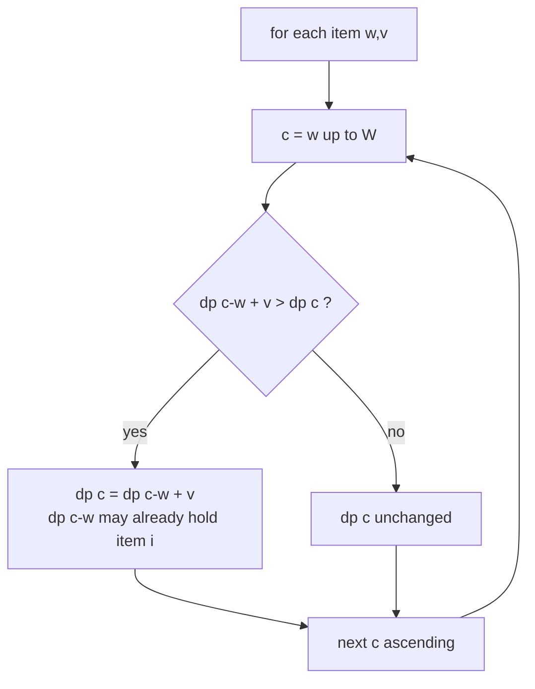
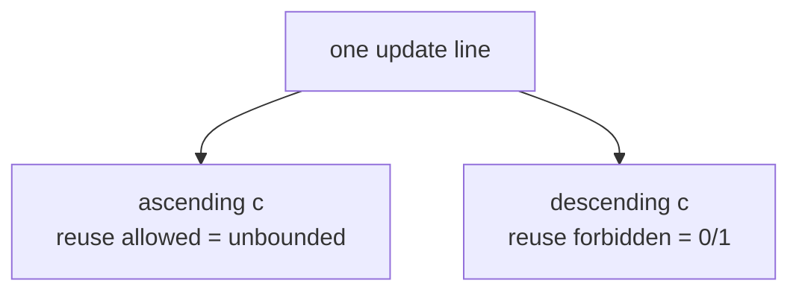
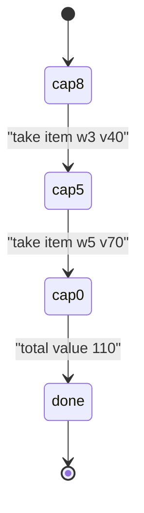

# Unbounded Knapsack — Maximum Value

| Meta | Value |
| --- | --- |
| Problem | Unbounded Knapsack (each item usable unlimited times) |
| Source | Classic DP / GeeksforGeeks Unbounded Knapsack |
| Reference | https://www.geeksforgeeks.org/unbounded-knapsack-repetition-items-allowed/ |
| Difficulty | Medium |
| Topics | Dynamic Programming, Knapsack, Coin-Change Family |
| Time | $O(nW)$ |
| Space | $O(W)$ |

## Problem Statement

You are given $n$ items, each with a weight and a value, and a knapsack with capacity $W$. Each item may be used **any number of times** (including zero). Maximize the total value without exceeding the capacity.

```text
Input:
  weights = [1, 3, 4, 5]
  values  = [10, 40, 50, 70]
  W = 8

Output:
  110

Explanation:
  Take item weight 4 twice (value 50 + 50 = 100)? weight 8, value 100.
  Better: weight 3 + weight 5 => value 40 + 70 = 110, weight 8. Answer 110.
  Reuse is allowed, so we search multisets, not subsets.
```

## Approach (WHY)

The recurrence is identical to 0/1 knapsack:

$$
dp[c] = \max\big(dp[c],\; dp[c - w] + v\big)
$$

The only difference is that an item may be reused. To allow reuse with a single rolling array, iterate capacity **ascending** from $w$ to $W$. Walking upward means $dp[c-w]$ may **already include item $i$** from a smaller capacity in this same pass — so the item can be picked again and again.



Contrast with 0/1: the *exact same line of code* gives unbounded behavior purely because of the loop direction.



### Solution

```python
def unbounded_knapsack(weights, values, W):
    dp = [0] * (W + 1)
    for w, v in zip(weights, values):
        for c in range(w, W + 1):          # ASCENDING => unlimited reuse
            dp[c] = max(dp[c], dp[c - w] + v)
    return dp[W]


if __name__ == "__main__":
    print(unbounded_knapsack([1, 3, 4, 5], [10, 40, 50, 70], 8))  # 110
```

```cpp
#include <bits/stdc++.h>
using namespace std;

long long unbounded_knapsack(vector<long long> weights, vector<long long> values, long long W) {
    vector<long long> dp(W + 1, 0);
    for (size_t i = 0; i < weights.size(); i++) {
        long long w = weights[i], v = values[i];
        for (long long c = w; c <= W; c++)   // ASCENDING => unlimited reuse
            dp[c] = max(dp[c], dp[c - w] + v);
    }
    return dp[W];
}

int main() {
    cout << unbounded_knapsack({1, 3, 4, 5}, {10, 40, 50, 70}, 8) << "\n";  // 110
    return 0;
}
```

## DP-Table Trace

Items $(w,v) = (1,10), (3,40), (4,50), (5,70)$, capacity $W = 8$. Each row is the `dp` array **after** processing that item, capacities $0 \dots 8$, ascending updates.

| After item | 0 | 1 | 2 | 3 | 4 | 5 | 6 | 7 | 8 |
| --- | --- | --- | --- | --- | --- | --- | --- | --- | --- |
| init | 0 | 0 | 0 | 0 | 0 | 0 | 0 | 0 | 0 |
| (1,10) | 0 | 10 | 20 | 30 | 40 | 50 | 60 | 70 | 80 |
| (3,40) | 0 | 10 | 20 | 40 | 50 | 60 | 80 | 90 | 100 |
| (4,50) | 0 | 10 | 20 | 40 | 50 | 60 | 80 | 100 | 110 |
| (5,70) | 0 | 10 | 20 | 40 | 50 | 70 | 80 | 110 | 110 |

After item $(1,10)$ the row already shows multiples of $10$ — proof that the ascending loop reuses the same item to fill every capacity. The final $dp[8] = 110$.



## Complexity

- **Time:** $O(nW)$ — each item scans every capacity once.
- **Space:** $O(W)$ — single rolling array; reuse needs no extra dimension.

## Takeaway

Unbounded knapsack is 0/1 knapsack with the capacity loop reversed to **ascending**. That one change lets each item be reused freely, and it is the backbone of the coin-change and "make-the-amount" problem family.
