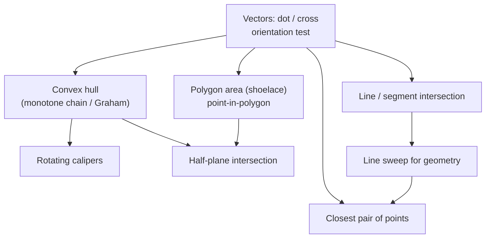

# Geometry — Computational Geometry

A module on **computational geometry** for competitive programming and interviews. Each topic has
a **complete guide** (theory, formulas, many Mermaid diagrams, complexity, pitfalls) and **curated
problems** solved in **both Python and C++**. Integer coordinates and exact cross-product
arithmetic are preferred over floating point wherever possible.

## Structure

```
geometry/
├── guide/      # one concept guide per topic (diagram-heavy)
└── problems/   # one file per curated problem (Python + C++, traces, diagrams, math)
```

## Topics & Guides

| # | Concept | Guide | Key problems |
|---|---------|-------|--------------|
| 1 | Vectors, dot/cross, orientation test | [01-vectors-dot-cross-orientation.md](guide/01-vectors-dot-cross-orientation.md) | Valid Boomerang, Orientation test, Point on segment |
| 2 | Line / segment intersection | [02-line-segment-intersection.md](guide/02-line-segment-intersection.md) | Segment intersection, Line intersection point, Count intersecting pairs |
| 3 | Polygon area (shoelace), point-in-polygon | [03-polygon-area-point-in-polygon.md](guide/03-polygon-area-point-in-polygon.md) | Shoelace area, Ray-casting PIP, Pick's theorem |
| 4 | Convex hull (monotone chain / Graham) | [04-convex-hull.md](guide/04-convex-hull.md) | Erect the Fence, Monotone chain, Hull area/perimeter |
| 5 | Closest pair of points | [05-closest-pair-of-points.md](guide/05-closest-pair-of-points.md) | Divide & conquer, Sweep line, Min distance pair |
| 6 | Line sweep for geometry | [06-line-sweep-geometry.md](guide/06-line-sweep-geometry.md) | Any segments intersect, Rectangle Area II, Union of intervals |
| 7 | Rotating calipers | [07-rotating-calipers.md](guide/07-rotating-calipers.md) | Farthest pair / diameter, Min width, Min-area rectangle |
| 8 | Half-plane intersection | [08-half-plane-intersection.md](guide/08-half-plane-intersection.md) | Half-plane area, Feasible region, Polygon kernel |

## How the pieces fit together



## Recommended study order

1. **Vectors, dot/cross, orientation** (1) — the primitives every other algorithm is built on.
2. **Line / segment intersection** (2) — direct application of the orientation test.
3. **Polygon area & point-in-polygon** (3) — shoelace, ray casting, Pick's theorem.
4. **Convex hull** (4) — the workhorse construction; monotone chain + Graham scan.
5. **Rotating calipers** (7) — $O(n)$ diameter / width / bounding box on the hull.
6. **Closest pair of points** (5) — divide & conquer and the sweep-line variant.
7. **Line sweep for geometry** (6) — events + an ordered active set (intersection, unions).
8. **Half-plane intersection** (8) — the feasible region of linear constraints, the capstone.

## Complexity cheat sheet

| Technique | Complexity | Notes |
|-----------|-----------|-------|
| Dot / cross / orientation | $O(1)$ | use `long long`; sign = turn direction |
| Segment intersection (pair) | $O(1)$ | 4 orientations + collinear cases |
| Line intersection point | $O(1)$ | determinant / Cramer's rule |
| Shoelace area | $O(n)$ | signed; doubled-integer to stay exact |
| Point in polygon | $O(n)$ / $O(\log n)$ convex | ray casting or winding number |
| Convex hull | $O(n \log n)$ | monotone chain / Graham scan |
| Closest pair | $O(n \log n)$ | divide & conquer or sweep + set |
| Line sweep (intersection / union) | $O((n+k) \log n)$ | event queue + status BST |
| Rotating calipers | $O(n)$ after hull | diameter, width, min-area rectangle |
| Half-plane intersection | $O(n \log n)$ | angular sort + deque; $O(n)$ if pre-sorted |

---

> Every code sample appears in **both Python and C++**. Problem files follow the repo format:
> meta table → statement → approaches → Python + C++ → iteration trace → Mermaid → math →
> complexity → takeaway. Guides follow: TOC → concepts → paired code → Mermaid (lots!) → math →
> complexity → pitfalls → patterns. Prefer integer/exact arithmetic; use `EPS` only when floats
> are unavoidable.
