# Vectors, Dot &amp; Cross Product, and the Orientation Test

> The single most important primitive in 2D computational geometry is the **orientation test**:
> given three points, do they turn left, turn right, or stay on a straight line? Almost every
> classic algorithm — convex hull, segment intersection, point-in-polygon, polygon area — is
> built on top of this one tiny operation.

Computational geometry can feel intimidating because of trigonometry, angles, and floating-point
precision. The good news is that the **vast majority** of problems are solved without a single
`sin`, `cos`, or `sqrt`. Instead we work with **vectors** and two products between them — the
**dot product** and the (2D) **cross product** — both of which reduce to a handful of
multiplications and subtractions of the raw coordinates.

When the input coordinates are integers, these operations stay **exact**: no rounding, no
epsilon comparisons, no precision bugs. This guide builds the toolkit from the ground up — how to
represent points and vectors, how to add/subtract/scale them, what the dot and cross products
*mean* geometrically, and how the orientation test `orient(a, b, c)` falls straight out of the
cross product. By the end you will be able to test collinearity, compute signed triangle areas,
and compare points by polar angle, all with safe integer arithmetic.

---

## Table of Contents
1. [Representing Points &amp; Vectors](#1-representing-points--vectors)
2. [Vector Add, Subtract, Scale](#2-vector-add-subtract-scale)
3. [The Dot Product](#3-the-dot-product)
4. [The Cross Product in 2D](#4-the-cross-product-in-2d)
5. [The Orientation Test](#5-the-orientation-test)
6. [Integer Arithmetic &amp; Precision](#6-integer-arithmetic--precision)
7. [Signed Area of a Triangle](#7-signed-area-of-a-triangle)
8. [Distance &amp; Angle](#8-distance--angle)
9. [Checking Collinearity](#9-checking-collinearity)
10. [Comparing by Polar Angle](#10-comparing-by-polar-angle)
11. [Complexity Summary](#complexity-summary)
12. [Common Pitfalls](#common-pitfalls)
13. [Patterns](#patterns)

---

## 1. Representing Points &amp; Vectors

A **point** is a location in the plane, written $P = (x, y)$. A **vector** is a *displacement* —
an arrow with a direction and a length — also written as a pair $\vec{v} = (x, y)$. The two share
the same representation; the difference is interpretation. A point answers "where", a vector
answers "how far and which way".

The key bridge: subtracting two points gives the vector that goes **from** one **to** the other.

$$
\vec{AB} = B - A = (B_x - A_x,\ B_y - A_y)
$$

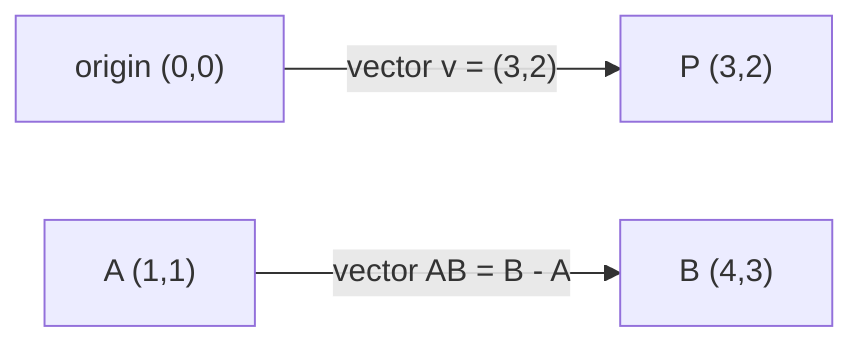

We store everything in a small `Point` (Python) / `pt` (C++) struct. For competitive geometry we
prefer **integer coordinates** (`long long` in C++) so that dot and cross products are exact.

```python
from dataclasses import dataclass

@dataclass(frozen=True)
class Point:
    x: int
    y: int

    def __add__(self, o):   # vector addition
        return Point(self.x + o.x, self.y + o.y)

    def __sub__(self, o):   # B - A gives vector A -> B
        return Point(self.x - o.x, self.y - o.y)

    def scale(self, k):     # scalar multiply
        return Point(self.x * k, self.y * k)
```

```cpp
#include <bits/stdc++.h>
using namespace std;

struct pt {
    long long x, y;
    pt(long long x = 0, long long y = 0) : x(x), y(y) {}

    pt operator+(const pt& o) const { return pt(x + o.x, y + o.y); } // addition
    pt operator-(const pt& o) const { return pt(x - o.x, y - o.y); } // B - A => A->B
    pt operator*(long long k) const { return pt(x * k, y * k); }     // scalar multiply
};
```

---

## 2. Vector Add, Subtract, Scale

The three building blocks operate **component-wise**:

- **Add** $\vec{a} + \vec{b} = (a_x + b_x,\ a_y + b_y)$ — chain two displacements head-to-tail.
- **Subtract** $\vec{a} - \vec{b} = (a_x - b_x,\ a_y - b_y)$ — the vector from $\vec b$'s tip to $\vec a$'s tip.
- **Scale** $k\,\vec{a} = (k a_x,\ k a_y)$ — stretch (or flip, if $k &lt; 0$) without changing the line of direction.

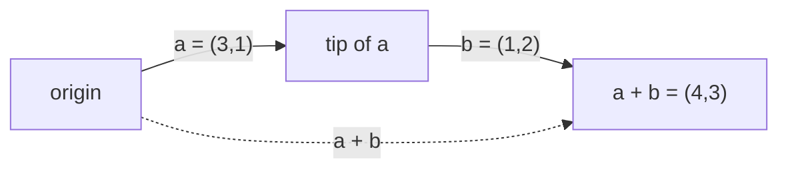

```python
a = Point(3, 1)
b = Point(1, 2)
print(a + b)        # Point(x=4, y=3)
print(a - b)        # Point(x=2, y=-1)
print(a.scale(2))   # Point(x=6, y=2)
```

```cpp
int main() {
    pt a(3, 1), b(1, 2);
    pt s = a + b;     // (4, 3)
    pt d = a - b;     // (2, -1)
    pt t = a * 2;     // (6, 2)
    cout << s.x << "," << s.y << "\n";
    return 0;
}
```

---

## 3. The Dot Product

The **dot product** of two vectors is a single number (a scalar):

$$
\vec{a} \cdot \vec{b} = a_x b_x + a_y b_y = |\vec{a}|\,|\vec{b}|\cos\theta
$$

where $\theta$ is the angle between them. Because $|\vec a|,|\vec b| &gt; 0$, the **sign** of the dot
product tells you the angle's nature directly — no trig needed:

| Dot sign | Angle $\theta$ | Geometric meaning |
|----------|----------------|-------------------|
| $&gt; 0$ | acute (less than $90°$) | vectors point "the same way" |
| $= 0$ | exactly $90°$ | vectors are **perpendicular** |
| $&lt; 0$ | obtuse (more than $90°$) | vectors point "apart" |

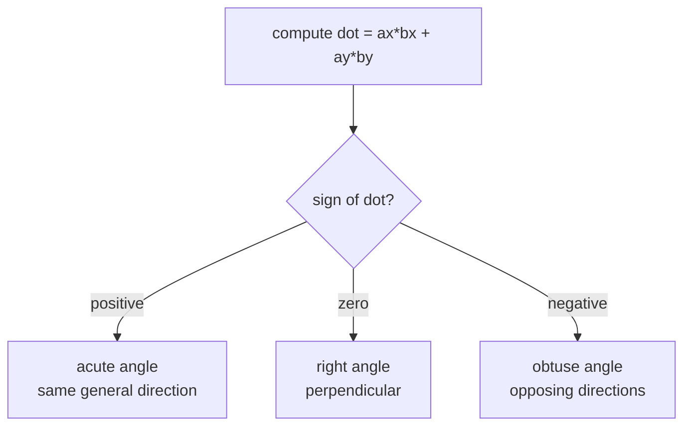

The dot product also gives the **scalar projection** of $\vec a$ onto $\vec b$: the length of
$\vec a$'s shadow along $\vec b$ is $\dfrac{\vec a \cdot \vec b}{|\vec b|}$. This is how we test
whether a point falls *between* two others along a direction.

```python
def dot(a: Point, b: Point) -> int:
    return a.x * b.x + a.y * b.y

# angle classification using only the sign
def angle_kind(a: Point, b: Point) -> str:
    d = dot(a, b)
    return "right" if d == 0 else ("acute" if d > 0 else "obtuse")
```

```cpp
long long dot(const pt& a, const pt& b) {
    return a.x * b.x + a.y * b.y;
}

// angle classification using only the sign
string angle_kind(const pt& a, const pt& b) {
    long long d = dot(a, b);
    if (d == 0) return "right";
    return d > 0 ? "acute" : "obtuse";
}
```

---

## 4. The Cross Product in 2D

In 2D the **cross product** is also a single scalar (it is the $z$-component of the 3D cross
product when the vectors lie in the plane):

$$
(\vec{a}\times\vec{b}) = a_x b_y - a_y b_x
$$

Geometrically this equals the **signed area of the parallelogram** spanned by $\vec a$ and
$\vec b$, and it satisfies $(\vec a \times \vec b) = |\vec a|\,|\vec b|\sin\theta$. Its **sign**
encodes the *turn direction* from $\vec a$ to $\vec b$:

| Cross sign | Turn from $\vec a$ to $\vec b$ | Meaning |
|------------|-------------------------------|---------|
| $&gt; 0$ | counter-clockwise (left) | $\vec b$ is to the **left** of $\vec a$ |
| $= 0$ | none | $\vec a$ and $\vec b$ are **parallel** / collinear |
| $&lt; 0$ | clockwise (right) | $\vec b$ is to the **right** of $\vec a$ |

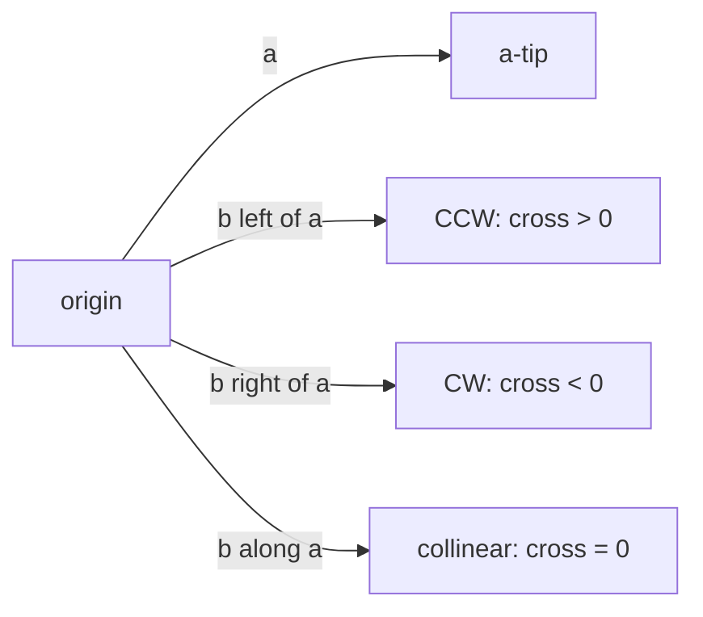

The right-hand intuition: point the fingers of your right hand along $\vec a$ and curl them
toward $\vec b$. If your thumb points **out of the page**, the cross is positive (CCW); if it
points **into the page**, it is negative (CW).

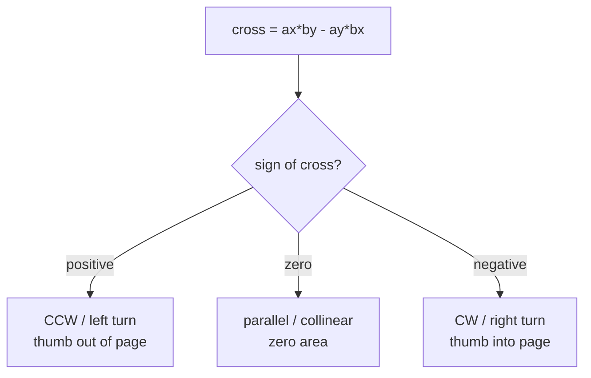

```python
def cross(a: Point, b: Point) -> int:
    return a.x * b.y - a.y * b.x
```

```cpp
long long cross(const pt& a, const pt& b) {
    return a.x * b.y - a.y * b.x;
}
```

---

## 5. The Orientation Test

The orientation test answers: walking from $A$ to $B$ to $C$, do we turn left, turn right, or go
straight? We build two vectors out of $A$ and translate the cross product:

$$
\text{orient}(A, B, C) = (B - A) \times (C - A)
$$

| Result | Orientation | Picture |
|--------|-------------|---------|
| $&gt; 0$ | **counter-clockwise** (CCW), left turn | $C$ lies left of ray $A \to B$ |
| $= 0$ | **collinear** | $A, B, C$ on one line |
| $&lt; 0$ | **clockwise** (CW), right turn | $C$ lies right of ray $A \to B$ |

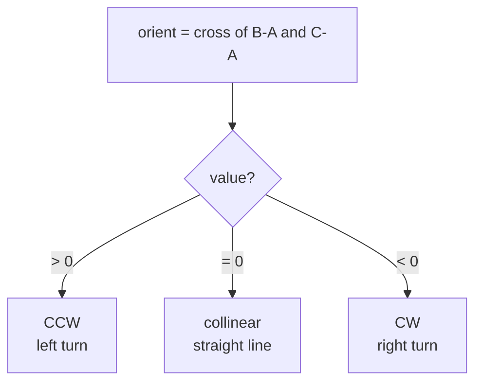

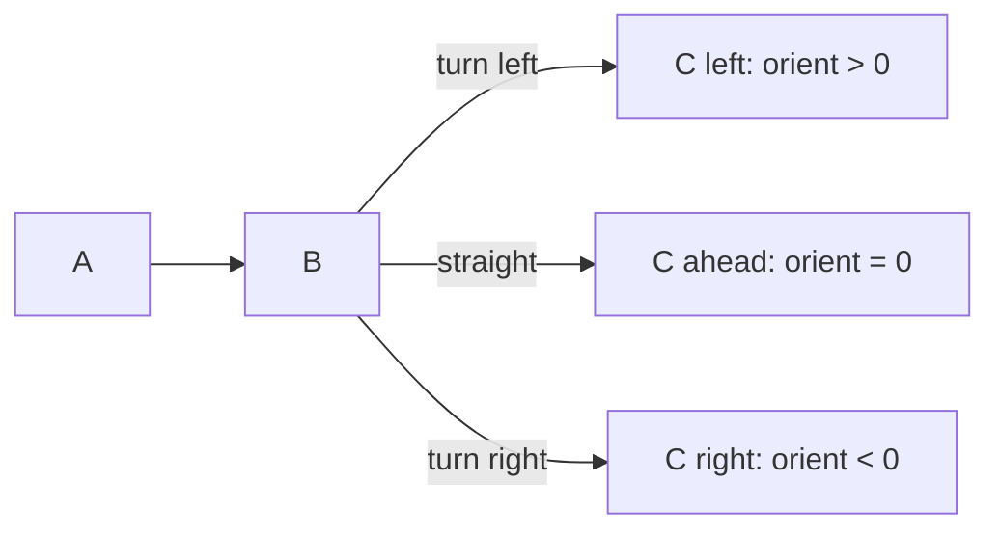

```python
def orient(a: Point, b: Point, c: Point) -> int:
    # cross of (b - a) and (c - a)
    return cross(b - a, c - a)

def turn(a: Point, b: Point, c: Point) -> str:
    o = orient(a, b, c)
    if o > 0:
        return "CCW"
    if o < 0:
        return "CW"
    return "COLLINEAR"
```

```cpp
long long orient(const pt& a, const pt& b, const pt& c) {
    // cross of (b - a) and (c - a)
    return cross(b - a, c - a);
}

string turn(const pt& a, const pt& b, const pt& c) {
    long long o = orient(a, b, c);
    if (o > 0) return "CCW";
    if (o < 0) return "CW";
    return "COLLINEAR";
}
```

A handy way to remember the orientation formula is as a $2\times2$ determinant:

$$
\text{orient}(A,B,C) =
\begin{vmatrix}
B_x - A_x & C_x - A_x \\
B_y - A_y & C_y - A_y
\end{vmatrix}
$$

---

## 6. Integer Arithmetic &amp; Precision

The reason geometers love the cross product is that with integer coordinates it stays **exact**.
There are no divisions, no square roots — only multiplications and a subtraction. A comparison
like `orient(a, b, c) > 0` is a perfectly reliable integer comparison, unlike comparing
floating-point angles where rounding can flip a sign.

But beware **overflow**. If coordinates range up to $C$, then a cross product term is on the order
of $C^2$, and the subtraction can reach $2C^2$. With $C \approx 10^9$, that is $\approx 2 \times
10^{18}$ — just inside the range of a signed 64-bit integer ($\approx 9.2 \times 10^{18}$). Hence
**always use `long long`** in C++ for coordinate cross products. Python integers are arbitrary
precision, so overflow is a non-issue there.

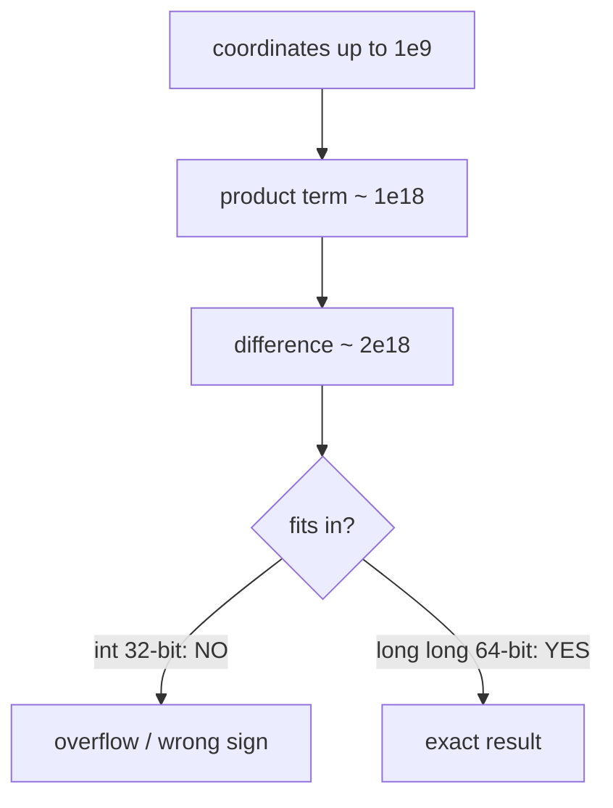

```python
# Python ints are unbounded - no overflow concern
val = orient(Point(10**9, 10**9), Point(-10**9, 0), Point(0, -10**9))
print(val)  # exact, arbitrarily large
```

```cpp
int main() {
    // long long is mandatory: terms approach 2e18
    long long val = orient(pt(1000000000LL, 1000000000LL),
                           pt(-1000000000LL, 0),
                           pt(0, -1000000000LL));
    cout << val << "\n";
    return 0;
}
```

---

## 7. Signed Area of a Triangle

The orientation value *is* twice the signed area of triangle $ABC$:

$$
\text{Area}_{\text{signed}}(A,B,C) = \frac{1}{2}\,\text{orient}(A,B,C)
= \frac{1}{2}\big((B-A)\times(C-A)\big)
$$

The **sign** tells you the winding (CCW positive, CW negative); take the absolute value for the
plain geometric area. Keeping it as twice-the-area lets us stay in integers — we only divide by 2
at the very end, and even then we can keep it exact by reporting `area2` (twice the area).

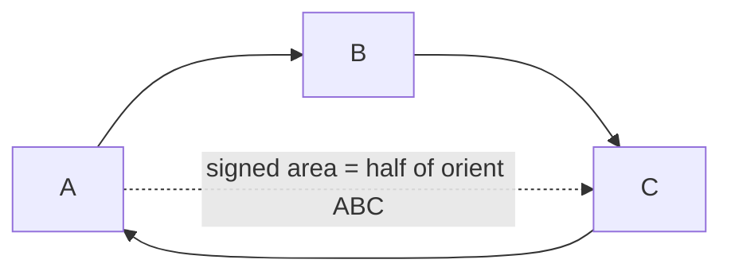

```python
from fractions import Fraction

def area2(a: Point, b: Point, c: Point) -> int:
    # twice the signed area (exact integer)
    return orient(a, b, c)

def triangle_area(a: Point, b: Point, c: Point) -> Fraction:
    return Fraction(abs(area2(a, b, c)), 2)
```

```cpp
long long area2(const pt& a, const pt& b, const pt& c) {
    // twice the signed area (exact integer)
    return orient(a, b, c);
}

double triangle_area(const pt& a, const pt& b, const pt& c) {
    return llabs(area2(a, b, c)) / 2.0;
}
```

---

## 8. Distance &amp; Angle

Sometimes you genuinely need a length or an angle. The squared distance stays in integers and is
preferred for **comparisons**; only take the square root when an actual length is required.

$$
|\vec{AB}|^2 = (B_x - A_x)^2 + (B_y - A_y)^2, \qquad
\theta = \operatorname{atan2}(\,\vec a \times \vec b,\ \vec a \cdot \vec b\,)
$$

Using `atan2(cross, dot)` gives the **signed** angle between two vectors in $(-\pi, \pi]$, more
robust than `acos` of a normalized dot product. When floats are unavoidable, compare with a small
epsilon.

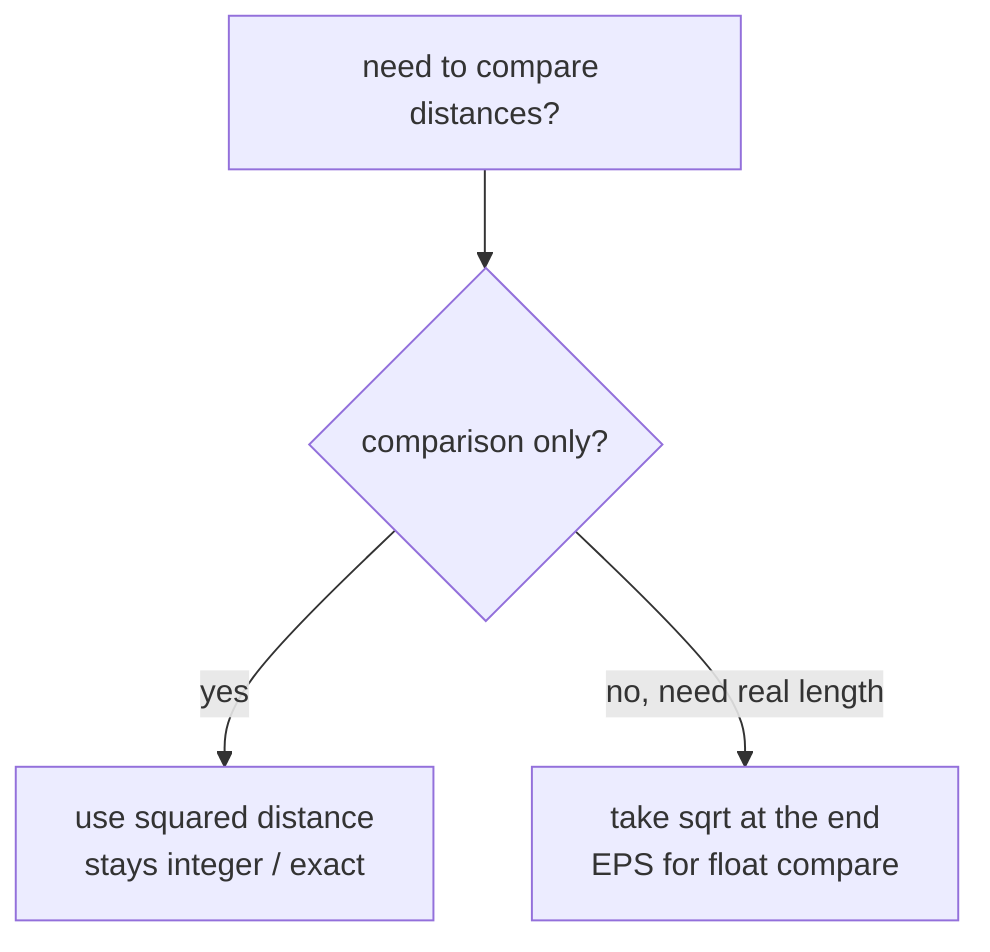

```python
import math

EPS = 1e-9

def dist2(a: Point, b: Point) -> int:
    d = b - a
    return d.x * d.x + d.y * d.y   # exact, good for comparisons

def angle_between(a: Point, b: Point) -> float:
    return math.atan2(cross(a, b), dot(a, b))  # signed, in (-pi, pi]
```

```cpp
const double EPS = 1e-9;

long long dist2(const pt& a, const pt& b) {
    pt d = b - a;
    return d.x * d.x + d.y * d.y;  // exact, good for comparisons
}

double angle_between(const pt& a, const pt& b) {
    return atan2((double)cross(a, b), (double)dot(a, b)); // signed
}
```

---

## 9. Checking Collinearity

Three points are **collinear** exactly when the triangle they form has zero area, i.e. the
orientation is zero:

$$
A, B, C \text{ collinear} \iff \text{orient}(A,B,C) = 0
$$

This is an exact integer check — far safer than computing slopes (which involve division and
break on vertical lines).

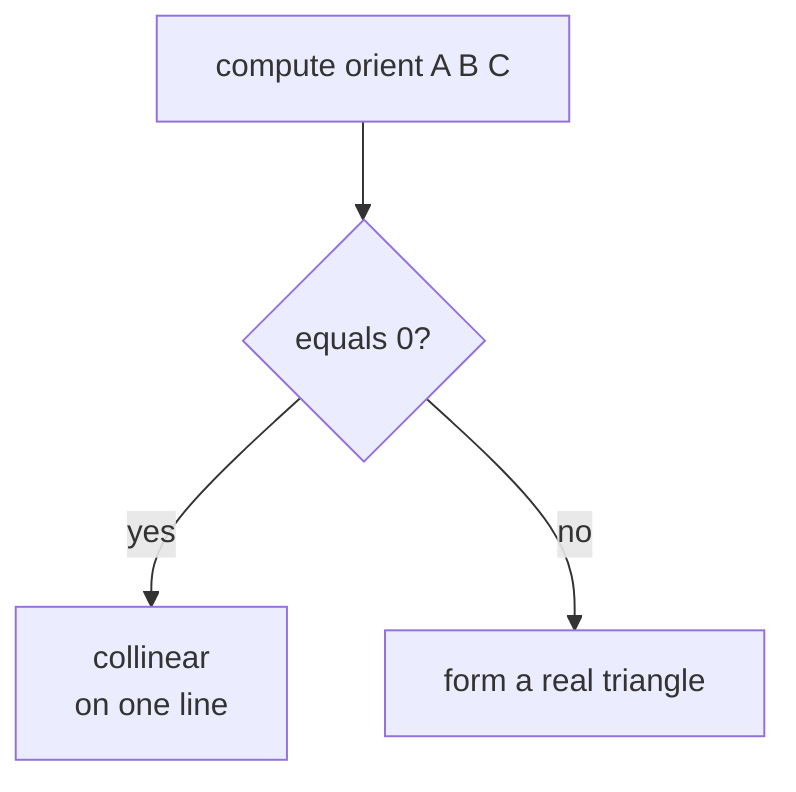

```python
def collinear(a: Point, b: Point, c: Point) -> bool:
    return orient(a, b, c) == 0
```

```cpp
bool collinear(const pt& a, const pt& b, const pt& c) {
    return orient(a, b, c) == 0;
}
```

---

## 10. Comparing by Polar Angle

To sort points around a center (essential for convex hull and angular sweeps), we **avoid
`atan2`** entirely and compare using the cross product plus a half-plane split. First split points
into an upper half (angle in $[0, \pi)$) and lower half; within the same half, the cross product
decides which comes first.

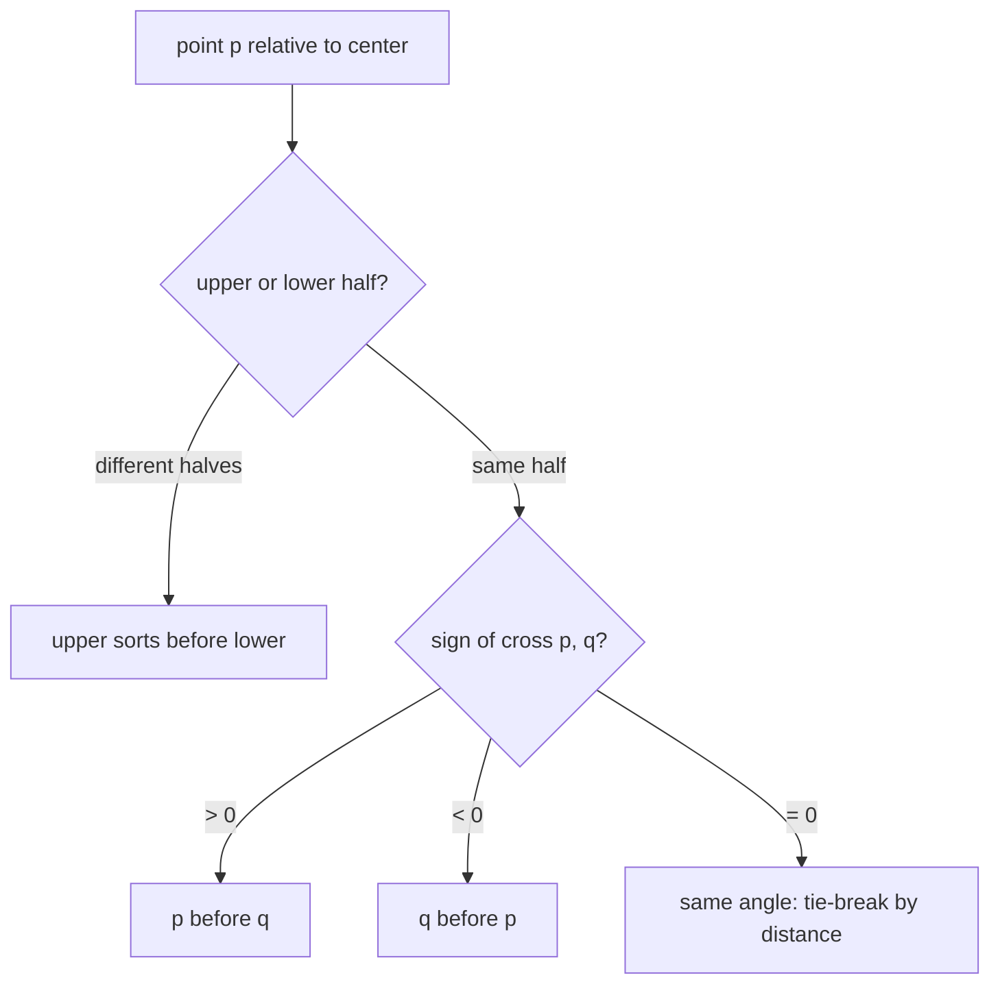

```python
def half(p: Point) -> int:
    # 0 for upper half (y > 0, or y == 0 and x >= 0), else 1
    return 0 if (p.y > 0 or (p.y == 0 and p.x >= 0)) else 1

def polar_cmp(p: Point, q: Point) -> int:
    if half(p) != half(q):
        return -1 if half(p) < half(q) else 1
    c = cross(p, q)
    if c > 0:
        return -1
    if c < 0:
        return 1
    return 0  # same angle; break ties by distance if needed
```

```cpp
int half(const pt& p) {
    // 0 for upper half, 1 for lower
    return (p.y > 0 || (p.y == 0 && p.x >= 0)) ? 0 : 1;
}

bool polar_less(const pt& p, const pt& q) {
    if (half(p) != half(q)) return half(p) < half(q);
    long long c = cross(p, q);
    if (c != 0) return c > 0;            // CCW comes first
    return dist2(pt(0, 0), p) < dist2(pt(0, 0), q); // tie-break by distance
}
```

---

## Complexity Summary

| Operation | Time | Space | Notes |
|-----------|------|-------|-------|
| add / sub / scale | $O(1)$ | $O(1)$ | component-wise |
| dot product | $O(1)$ | $O(1)$ | exact in integers |
| cross product | $O(1)$ | $O(1)$ | exact in integers; use `long long` |
| orientation test | $O(1)$ | $O(1)$ | one cross product |
| triangle area | $O(1)$ | $O(1)$ | half of orient |
| collinearity check | $O(1)$ | $O(1)$ | orient $= 0$ |
| squared distance | $O(1)$ | $O(1)$ | exact; for comparisons |
| polar-angle sort of $n$ points | $O(n \log n)$ | $O(1)$ | cross-based comparator |

---

## Common Pitfalls

- **Integer overflow in the cross product.** With coordinates up to $10^9$, terms reach $10^{18}$.
  Use `long long` in C++. A plain `int` silently overflows and flips the sign, producing wrong
  orientations.
- **Floating-point precision.** Avoid floats when integers suffice. Comparing `atan2` angles or
  slopes can misclassify nearly-collinear points. Prefer the exact cross product. When floats are
  truly needed, compare with `const double EPS = 1e-9`, never with `==`.
- **Degenerate / collinear cases.** Always handle `orient == 0` explicitly. Many bugs come from
  assuming three points form a real triangle. Collinear triples break slope formulas and can make
  "left of" tests ambiguous.
- **Sign conventions.** Decide once whether CCW is positive (the convention here) and stay
  consistent; mixing conventions flips hull windings and area signs.
- **Slope by division.** `(y2 - y1) / (x2 - x1)` divides by zero on vertical segments and loses
  precision. The cross product never divides — use it instead.
- **Comparing distances with `sqrt`.** Compare **squared** distances to stay exact and fast.

---

## Patterns

- **Replace angles with cross products.** Any "is C to the left of A→B?" question is
  `orient(A, B, C) > 0`. No trigonometry required.
- **Stay in integers as long as possible.** Keep twice-the-area, squared distances, and cross
  products; divide or `sqrt` only at the final reporting step.
- **Orientation is the universal primitive.** Convex hull (Graham/Andrew), segment intersection,
  point-in-polygon, and polygon area all reduce to repeated `orient` calls.
- **Half-plane split for angular order.** Sort around a center by (half, cross) instead of
  `atan2` to remain exact and avoid precision-induced misorderings.
- **Sign tables.** Memorize: dot sign → angle acute/right/obtuse; cross sign → turn
  CCW/collinear/CW. These two tables unlock most 2D geometry.
