# Line and Segment Intersection

Geometry problems live or die on two tiny primitives: the **cross product** (to tell which
side of a line a point is on) and the **determinant** (to solve where two lines meet). Once
you trust those two tools, "do these segments cross?" and "where do these lines meet?" become
short, integer-safe routines. This guide builds both from the ground up with many pictures.

---

## Table of Contents

1. [Representing a Line and a Segment](#representing-a-line-and-a-segment)
2. [The Orientation Primitive](#the-orientation-primitive)
3. [Do Two Segments Intersect? — The Orientation Method](#do-two-segments-intersect--the-orientation-method)
4. [The Proper-Intersection Test](#the-proper-intersection-test)
5. [Computing the Intersection Point of Two Lines](#computing-the-intersection-point-of-two-lines)
6. [Parallel and Coincident Handling](#parallel-and-coincident-handling)
7. [Line Given by Two Points vs $ax + by = c$](#line-given-by-two-points-vs-ax--by--c)
8. [Distance from a Point to a Line and Segment](#distance-from-a-point-to-a-line-and-segment)
9. [Complexity Summary](#complexity-summary)
10. [Common Pitfalls](#common-pitfalls)
11. [Patterns](#patterns)

---

## Representing a Line and a Segment

A **point** is a pair $(x, y)$. A **segment** is two endpoints $A$ and $B$; it is the set of
points $A + t(B - A)$ for $t \in [0, 1]$. A **line** is the same expression but with
$t \in (-\infty, \infty)$ — it extends forever in both directions.

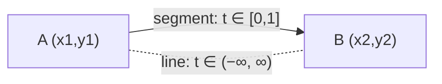

The single reusable building block is a `Point` with a **cross product**. For vectors
$\vec{u} = (u_x, u_y)$ and $\vec{v} = (v_x, v_y)$:

$$
\vec{u} \times \vec{v} = u_x v_y - u_y v_x
$$

The sign of this scalar tells us the turn direction from $\vec{u}$ to $\vec{v}$.

```python
from dataclasses import dataclass

@dataclass(frozen=True)
class Point:
    x: int
    y: int

def sub(a: Point, b: Point) -> Point:
    return Point(a.x - b.x, a.y - b.y)

def cross(a: Point, b: Point) -> int:
    # z-component of a × b
    return a.x * b.y - a.y * b.x
```

```cpp
#include <bits/stdc++.h>
using namespace std;

struct Point {
    long long x, y;
};

Point sub(const Point& a, const Point& b) {
    return Point{a.x - b.x, a.y - b.y};
}

long long cross(const Point& a, const Point& b) {
    // z-component of a × b
    return a.x * b.y - a.y * b.x;
}
```

> Keep coordinates as integers as long as possible. The cross product of integer points is an
> exact integer, so the *yes/no* "do they cross?" question never needs floating point.

---

## The Orientation Primitive

Given three points $P$, $Q$, $R$, the **orientation** is the sign of the cross product of
$\vec{PQ}$ and $\vec{PR}$:

$$
\operatorname{orient}(P, Q, R) = \operatorname{sign}\big((Q - P) \times (R - P)\big)
$$

It answers: *standing at $P$ looking toward $Q$, is $R$ to my left, right, or straight ahead?*

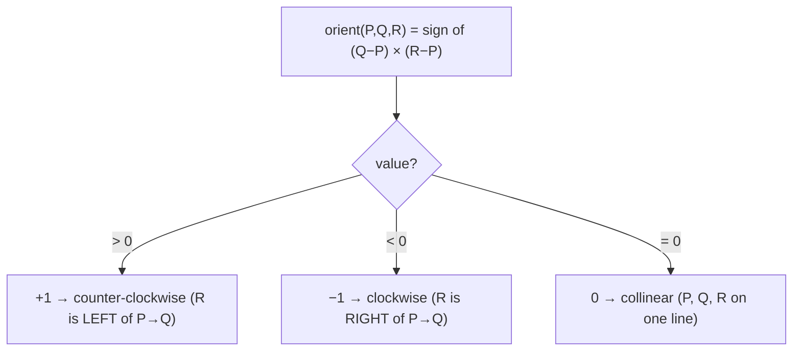

```python
def orient(p: Point, q: Point, r: Point) -> int:
    val = cross(sub(q, p), sub(r, p))
    if val > 0:
        return 1     # counter-clockwise
    if val < 0:
        return -1    # clockwise
    return 0         # collinear
```

```cpp
int orient(const Point& p, const Point& q, const Point& r) {
    long long val = cross(sub(q, p), sub(r, p));
    if (val > 0) return 1;    // counter-clockwise
    if (val < 0) return -1;   // clockwise
    return 0;                 // collinear
}
```

This is the only nontrivial idea in the whole guide. Everything below is bookkeeping on top of
the four possible orientation signs.

---

## Do Two Segments Intersect? — The Orientation Method

Take segments $\overline{P_1 P_2}$ and $\overline{P_3 P_4}$. Compute four orientations:

$$
o_1 = \operatorname{orient}(P_1, P_2, P_3), \quad
o_2 = \operatorname{orient}(P_1, P_2, P_4)
$$
$$
o_3 = \operatorname{orient}(P_3, P_4, P_1), \quad
o_4 = \operatorname{orient}(P_3, P_4, P_2)
$$

**General case:** the segments cross if and only if $P_3, P_4$ lie on *opposite sides* of line
$P_1 P_2$ **and** $P_1, P_2$ lie on opposite sides of line $P_3 P_4$. In signs:
$o_1 \ne o_2$ **and** $o_3 \ne o_4$.

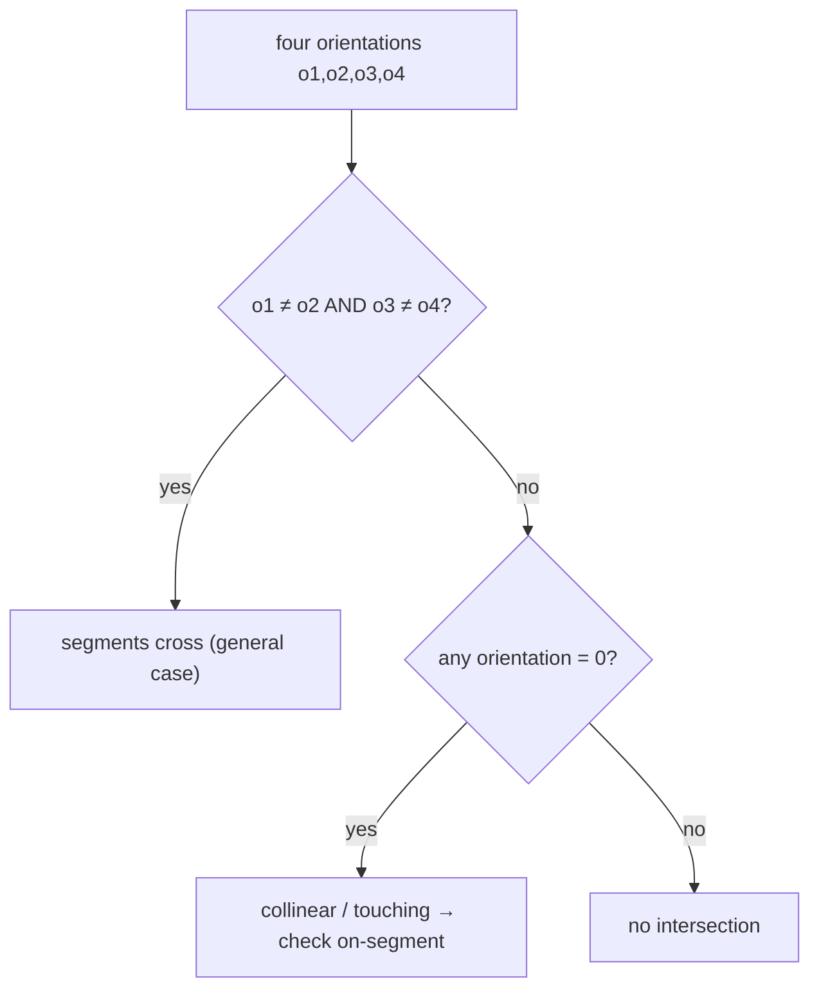

Why "opposite sides both ways"? Each condition alone is not enough — the picture below shows the
four orientation outcomes when probing point $P_3$ and $P_4$ against the line through $P_1 P_2$.

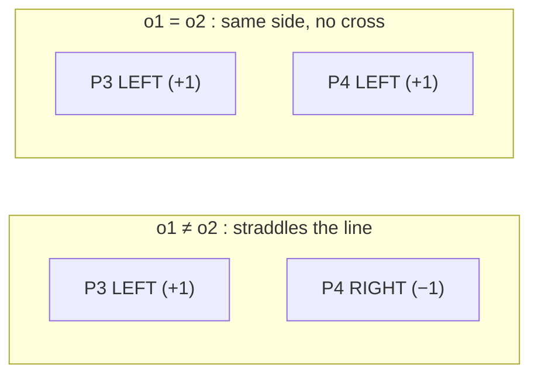

**Special collinear cases:** when some $o_i = 0$, a segment endpoint is *on the line* of the
other. Then we must check whether it actually lands *on the segment* (within its bounding box),
not just on the infinite line.

```python
def on_segment(p: Point, q: Point, r: Point) -> bool:
    # assumes p, q, r are collinear; is q on segment p--r?
    return (min(p.x, r.x) <= q.x <= max(p.x, r.x) and
            min(p.y, r.y) <= q.y <= max(p.y, r.y))
```

```cpp
bool on_segment(const Point& p, const Point& q, const Point& r) {
    // assumes p, q, r are collinear; is q on segment p--r?
    return min(p.x, r.x) <= q.x && q.x <= max(p.x, r.x) &&
           min(p.y, r.y) <= q.y && q.y <= max(p.y, r.y);
}
```

Putting it together — a fully integer-safe boolean test that handles every degenerate case
(touching endpoints, T-junctions, collinear overlap, a point-segment):

```python
def segments_intersect(p1: Point, p2: Point, p3: Point, p4: Point) -> bool:
    o1 = orient(p1, p2, p3)
    o2 = orient(p1, p2, p4)
    o3 = orient(p3, p4, p1)
    o4 = orient(p3, p4, p2)

    # general case: proper straddle on both lines
    if o1 != o2 and o3 != o4:
        return True

    # special collinear / touching cases
    if o1 == 0 and on_segment(p1, p3, p2):
        return True
    if o2 == 0 and on_segment(p1, p4, p2):
        return True
    if o3 == 0 and on_segment(p3, p1, p4):
        return True
    if o4 == 0 and on_segment(p3, p2, p4):
        return True

    return False
```

```cpp
bool segments_intersect(const Point& p1, const Point& p2,
                        const Point& p3, const Point& p4) {
    int o1 = orient(p1, p2, p3);
    int o2 = orient(p1, p2, p4);
    int o3 = orient(p3, p4, p1);
    int o4 = orient(p3, p4, p2);

    // general case: proper straddle on both lines
    if (o1 != o2 && o3 != o4) return true;

    // special collinear / touching cases
    if (o1 == 0 && on_segment(p1, p3, p2)) return true;
    if (o2 == 0 && on_segment(p1, p4, p2)) return true;
    if (o3 == 0 && on_segment(p3, p1, p4)) return true;
    if (o4 == 0 && on_segment(p3, p2, p4)) return true;

    return false;
}
```

---

## The Proper-Intersection Test

Sometimes you want a **proper** intersection: the segments cross at a single interior point and
do **not** merely touch at an endpoint or overlap along a shared stretch. That is the strict
version: all four orientations are nonzero and straddle.

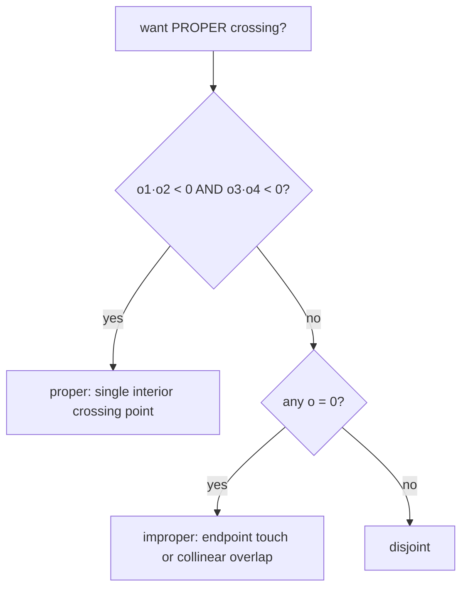

The difference between *proper* and *improper* matters a lot in practice:

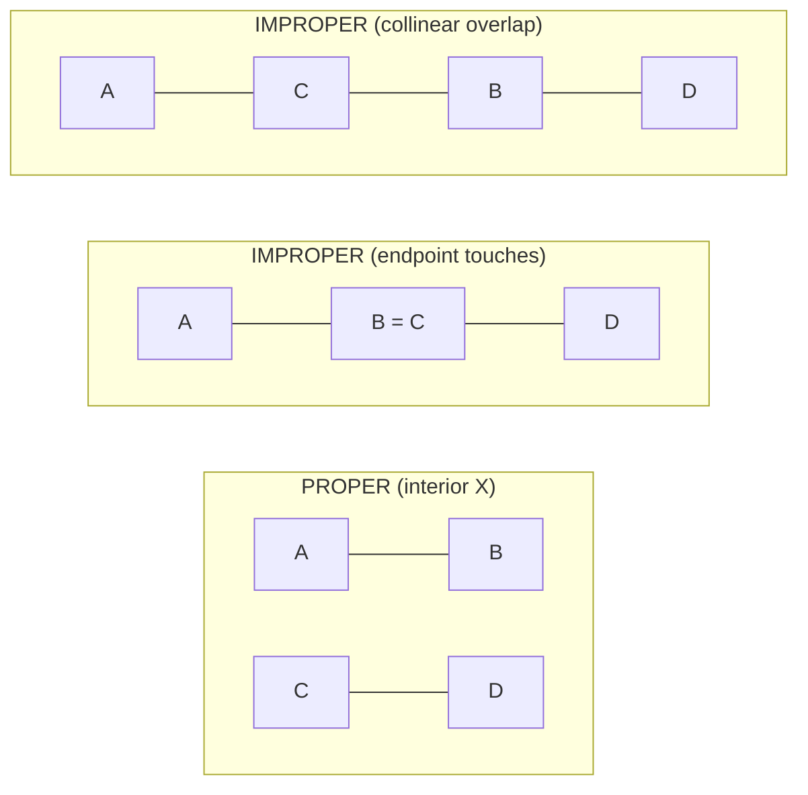

```python
def proper_intersect(p1: Point, p2: Point, p3: Point, p4: Point) -> bool:
    o1 = orient(p1, p2, p3)
    o2 = orient(p1, p2, p4)
    o3 = orient(p3, p4, p1)
    o4 = orient(p3, p4, p2)
    # strictly opposite signs on both lines -> single interior crossing
    return o1 * o2 < 0 and o3 * o4 < 0
```

```cpp
bool proper_intersect(const Point& p1, const Point& p2,
                      const Point& p3, const Point& p4) {
    int o1 = orient(p1, p2, p3);
    int o2 = orient(p1, p2, p4);
    int o3 = orient(p3, p4, p1);
    int o4 = orient(p3, p4, p2);
    // strictly opposite signs on both lines -> single interior crossing
    return o1 * o2 < 0 && o3 * o4 < 0;
}
```

---

## Computing the Intersection Point of Two Lines

Knowing *whether* they cross is the integer part. Knowing *where* needs the **determinant**.
Write each line through two points in the form $a x + b y = c$:

$$
\text{line through } P_1, P_2:\quad
a_1 = y_2 - y_1,\; b_1 = x_1 - x_2,\; c_1 = a_1 x_1 + b_1 y_1
$$

For two lines $a_1 x + b_1 y = c_1$ and $a_2 x + b_2 y = c_2$, **Cramer's rule** gives the
solution with denominator equal to the determinant $D = a_1 b_2 - a_2 b_1$:

$$
x = \frac{c_1 b_2 - c_2 b_1}{D}, \qquad
y = \frac{a_1 c_2 - a_2 c_1}{D}
$$

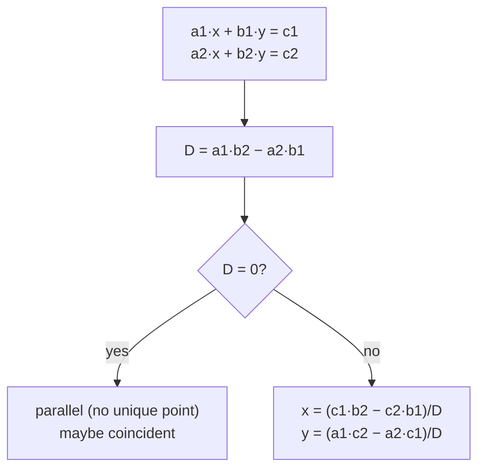

This is the one place we accept floating point, so we guard the determinant with an epsilon.

```python
EPS = 1e-9

def line_intersection_point(p1: Point, p2: Point, p3: Point, p4: Point):
    a1 = p2.y - p1.y
    b1 = p1.x - p2.x
    c1 = a1 * p1.x + b1 * p1.y
    a2 = p4.y - p3.y
    b2 = p3.x - p4.x
    c2 = a2 * p3.x + b2 * p3.y

    det = a1 * b2 - a2 * b1
    if abs(det) < EPS:
        return None  # parallel or coincident -> no unique point
    x = (c1 * b2 - c2 * b1) / det
    y = (a1 * c2 - a2 * c1) / det
    return (x, y)
```

```cpp
const double EPS = 1e-9;

// returns true and fills (ix, iy) when a unique point exists
bool line_intersection_point(const Point& p1, const Point& p2,
                             const Point& p3, const Point& p4,
                             double& ix, double& iy) {
    double a1 = p2.y - p1.y;
    double b1 = p1.x - p2.x;
    double c1 = a1 * p1.x + b1 * p1.y;
    double a2 = p4.y - p3.y;
    double b2 = p3.x - p4.x;
    double c2 = a2 * p3.x + b2 * p3.y;

    double det = a1 * b2 - a2 * b1;
    if (fabs(det) < EPS) return false;  // parallel or coincident
    ix = (c1 * b2 - c2 * b1) / det;
    iy = (a1 * c2 - a2 * c1) / det;
    return true;
}
```

---

## Parallel and Coincident Handling

When the determinant $D = 0$, the two lines are **parallel**. They are either fully **disjoint**
or the **same line** (coincident). To tell them apart, test whether a point of one line satisfies
the other's equation — equivalently, whether the three points $P_1, P_2, P_3$ are collinear.

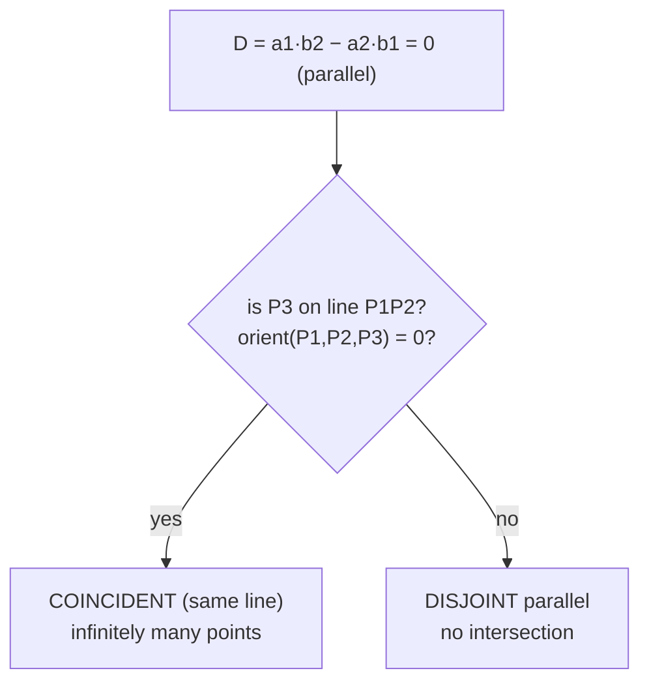

For **segments** that are collinear, "coincident lines" still needs a 1-D overlap check on the
shared axis — exactly the `on_segment` bounding-box idea from earlier, applied to the projected
intervals.

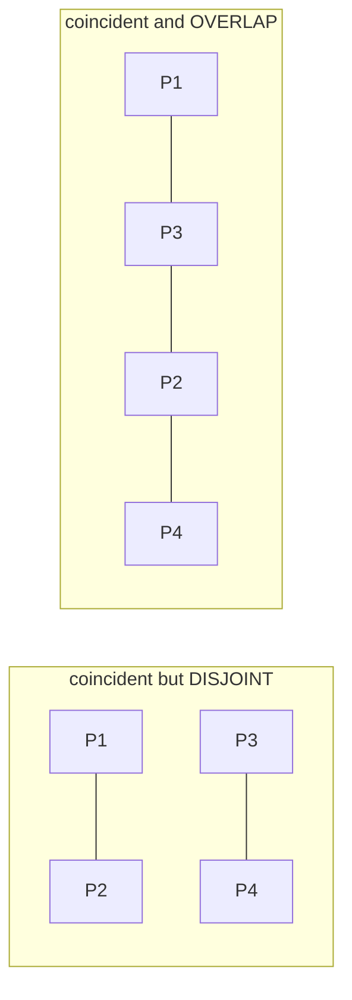

---

## Line Given by Two Points vs $a x + b y = c$

Two ways to specify a line, and converting between them is one cross product. From points
$P_1=(x_1,y_1)$ and $P_2=(x_2,y_2)$:

$$
a = y_2 - y_1, \qquad b = x_1 - x_2, \qquad c = a x_1 + b y_1
$$

The vector $(a, b)$ is the **normal** to the line. The check "is point $R$ on the line?" reduces
to $a R_x + b R_y - c = 0$, which is exactly $\operatorname{orient}(P_1, P_2, R) = 0$.

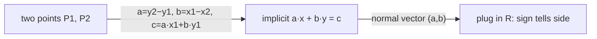

```python
def line_from_points(p1: Point, p2: Point):
    a = p2.y - p1.y
    b = p1.x - p2.x
    c = a * p1.x + b * p1.y
    return (a, b, c)  # a*x + b*y = c
```

```cpp
struct Line { long long a, b, c; };  // a*x + b*y = c

Line line_from_points(const Point& p1, const Point& p2) {
    long long a = p2.y - p1.y;
    long long b = p1.x - p2.x;
    long long c = a * p1.x + b * p1.y;
    return Line{a, b, c};
}
```

---

## Distance from a Point to a Line and Segment

The signed distance from point $R$ to the **infinite line** through $P_1 P_2$ uses the cross
product magnitude over the segment length:

$$
\operatorname{dist}(R, \text{line}) = \frac{\big|(P_2 - P_1) \times (R - P_1)\big|}{|P_2 - P_1|}
$$

For a **segment**, we must clamp to the endpoints. Project $R$ onto the line with parameter

$$
t = \frac{(R - P_1) \cdot (P_2 - P_1)}{|P_2 - P_1|^2}, \qquad t \in [0, 1] \text{ for interior.}
$$

If $t < 0$ the nearest point is $P_1$; if $t > 1$ it is $P_2$; otherwise it is the foot of the
perpendicular.

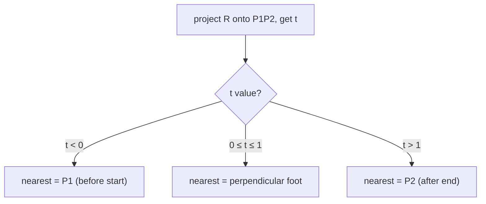

```python
import math

def point_segment_distance(r: Point, p1: Point, p2: Point) -> float:
    dx = p2.x - p1.x
    dy = p2.y - p1.y
    if dx == 0 and dy == 0:
        # degenerate segment is a single point
        return math.hypot(r.x - p1.x, r.y - p1.y)
    t = ((r.x - p1.x) * dx + (r.y - p1.y) * dy) / (dx * dx + dy * dy)
    t = max(0.0, min(1.0, t))            # clamp onto the segment
    fx = p1.x + t * dx
    fy = p1.y + t * dy
    return math.hypot(r.x - fx, r.y - fy)
```

```cpp
double point_segment_distance(const Point& r, const Point& p1, const Point& p2) {
    double dx = p2.x - p1.x;
    double dy = p2.y - p1.y;
    if (dx == 0 && dy == 0) {
        // degenerate segment is a single point
        return hypot((double)(r.x - p1.x), (double)(r.y - p1.y));
    }
    double t = ((r.x - p1.x) * dx + (r.y - p1.y) * dy) / (dx * dx + dy * dy);
    t = max(0.0, min(1.0, t));            // clamp onto the segment
    double fx = p1.x + t * dx;
    double fy = p1.y + t * dy;
    return hypot((double)r.x - fx, (double)r.y - fy);
}
```

---

## Complexity Summary

Every primitive here is a fixed amount of arithmetic — no loops over the input.

| Operation | Time | Space |
|---|---|---|
| `orient` / `cross` | $O(1)$ | $O(1)$ |
| `segments_intersect` (with degenerate cases) | $O(1)$ | $O(1)$ |
| `proper_intersect` | $O(1)$ | $O(1)$ |
| `line_intersection_point` (Cramer) | $O(1)$ | $O(1)$ |
| `point_segment_distance` | $O(1)$ | $O(1)$ |

A naive *all-pairs* "which segments cross?" over $n$ segments is $O(n^2)$ calls; a Bentley–Ottmann
sweep brings it to $O((n + k) \log n)$ where $k$ is the number of intersections.

---

## Common Pitfalls

- **Collinear overlap.** Two segments on the same line that share a stretch *do* intersect, but
  every orientation is $0$, so the general straddle test alone returns false. You must add the
  `on_segment` bounding-box checks.
- **Endpoints touching.** A shared endpoint (T-junction or "+" with a tip) is a real intersection
  for the boolean test but **not** a proper crossing. Decide which one the problem wants.
- **Precision.** Keep the yes/no test in integers. Only the intersection *point* needs `double`,
  and there you must compare the determinant against `EPS`, never against exact `0`.
- **Parallel lines.** Computing a point when $D = 0$ divides by zero (Python) or yields `inf`/`nan`
  (C++). Always check the determinant *before* dividing.
- **Overflow.** Cross products of coordinates up to $10^9$ reach $10^{18}$ — use `long long`,
  not `int`, in C++.

---

## Patterns

- **Orientation straddle** — "do two segments cross?" is four `orient` calls plus collinear guards.
- **Determinant / Cramer** — "where do two lines meet?" is one determinant; guard it against zero.
- **Project-and-clamp** — point-to-segment distance is "project, clamp $t$ to $[0,1]$, measure".
- **Integer first, float last** — answer the boolean question exactly, defer `double` until you
  truly need a coordinate.
- **Brute force then sweep** — count crossings in $O(n^2)$ first; upgrade to a sweep line when $n$
  is large.
