# Polygon Area (Shoelace) & Point-in-Polygon — Complete Guide

> Two of the most reused tools in computational geometry are the **shoelace formula**
> (which gives the *signed area* of any simple polygon from its vertex coordinates) and
> **point-in-polygon** tests (which decide whether a query point lies inside, on, or
> outside a polygon). This guide builds both from scratch: the algebra behind the
> shoelace sum, how its **sign** reveals orientation, why keeping a **doubled integer
> area** avoids floating-point error, **Pick's theorem** for lattice polygons, and two
> point-in-polygon strategies — **ray casting** (parity of crossings) and the **winding
> number** — plus the delicate cases of points lying *on* an edge and the $O(\log n)$
> convex-polygon shortcut.

---

## Table of Contents
1. [Representing a Polygon](#1-representing-a-polygon)
2. [The Shoelace Formula](#2-the-shoelace-formula)
3. [Signed Area & Orientation](#3-signed-area--orientation)
4. [Doubled Integer Area (Staying Exact)](#4-doubled-integer-area-staying-exact)
5. [Pick's Theorem & Boundary Lattice Points](#5-picks-theorem--boundary-lattice-points)
6. [Point-in-Polygon by Ray Casting](#6-point-in-polygon-by-ray-casting)
7. [Point-in-Polygon by Winding Number](#7-point-in-polygon-by-winding-number)
8. [Points On the Boundary](#8-points-on-the-boundary)
9. [Convex Polygon: Orientation & Binary Search](#9-convex-polygon-orientation--binary-search)
10. [Complexity Summary](#complexity-summary)
11. [Common Pitfalls](#common-pitfalls)
12. [Patterns](#patterns)

---

## 1. Representing a Polygon

A polygon is an **ordered** list of vertices $P_0, P_1, \dots, P_{n-1}$, with an implicit
closing edge from $P_{n-1}$ back to $P_0$. The *order* matters: it encodes both the shape
and the **traversal direction** (clockwise or counter-clockwise).

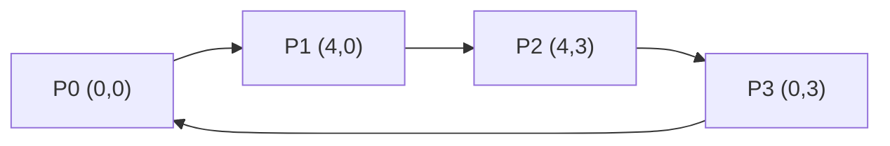

We reuse a single `Point` struct everywhere. Throughout, indices are taken **modulo n**, so
"the next vertex" of $P_{n-1}$ is $P_0$.

```python
class Point:
    __slots__ = ("x", "y")
    def __init__(self, x, y):
        self.x = x
        self.y = y
```

```cpp
#include <bits/stdc++.h>
using namespace std;

struct Point {
    long long x, y;
    Point(long long x = 0, long long y = 0) : x(x), y(y) {}
};
```

A *simple* polygon is one whose edges do not cross each other. Everything below assumes
simple polygons (convex or concave), which is the common case.

---

## 2. The Shoelace Formula

The **shoelace formula** (Gauss's area formula) computes the area of a simple polygon
directly from its vertices:

$$A = \frac{1}{2}\left|\sum_{i=0}^{n-1} \left(x_i\, y_{i+1} - x_{i+1}\, y_i\right)\right|$$

The name comes from how the cross-products **lace** together: multiply each $x_i$ by the
*next* $y$, subtract each $x_{i+1}$ by the *current* $y$, and the products zig-zag like a
shoelace.

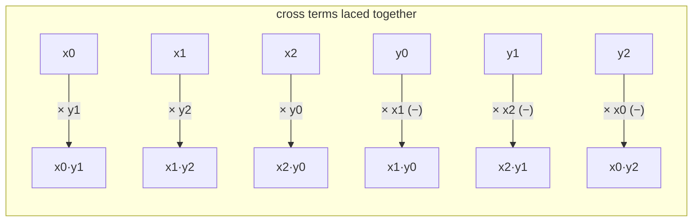

**Why it works (trapezoid view).** Each edge from $P_i$ to $P_{i+1}$, together with its
projection onto the x-axis, forms a trapezoid. The *signed* area of that trapezoid is
$\tfrac{1}{2}(x_i - x_{i+1})(y_i + y_{i+1})$. As you walk the boundary, the trapezoids of
the lower edges **cancel** the overlapping parts of the upper edges, leaving exactly the
enclosed region.

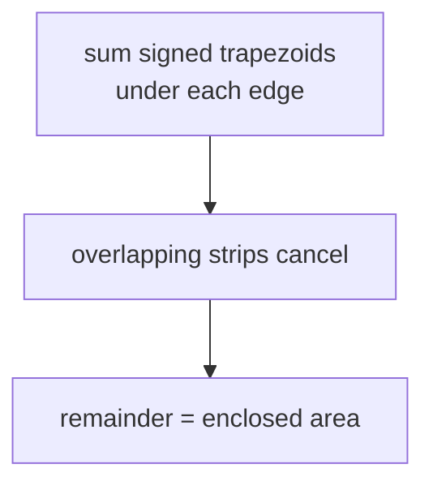

Here is the basic shoelace area:

```python
def polygon_area(poly):
    n = len(poly)
    s = 0
    for i in range(n):
        j = (i + 1) % n
        s += poly[i].x * poly[j].y - poly[j].x * poly[i].y
    return abs(s) / 2.0
```

```cpp
double polygon_area(const vector<Point>& poly) {
    int n = (int)poly.size();
    long long s = 0;
    for (int i = 0; i < n; i++) {
        int j = (i + 1) % n;
        s += poly[i].x * poly[j].y - poly[j].x * poly[i].y;
    }
    return llabs(s) / 2.0;
}
```

---

## 3. Signed Area & Orientation

If you **drop the absolute value**, the shoelace sum is the *signed* area $2A_{\text{signed}}
= \sum (x_i y_{i+1} - x_{i+1} y_i)$. Its **sign** tells you the traversal orientation:

| Sign of $\sum$ | Orientation |
|---|---|
| positive | counter-clockwise (CCW) |
| negative | clockwise (CW) |
| zero | degenerate (collinear / zero area) |

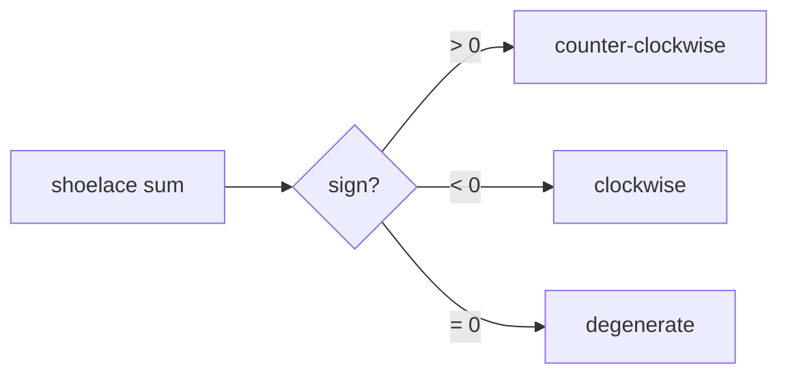

This is the same quantity as the 2D **cross product** accumulated around the boundary. A
single edge pair's cross product $\text{cross}(B-A, C-A) = (B_x-A_x)(C_y-A_y) -
(B_y-A_y)(C_x-A_x)$ is the workhorse for orientation tests:

```python
def cross(o, a, b):
    return (a.x - o.x) * (b.y - o.y) - (a.y - o.y) * (b.x - o.x)
```

```cpp
long long cross(const Point& o, const Point& a, const Point& b) {
    return (a.x - o.x) * (b.y - o.y) - (a.y - o.y) * (b.x - o.x);
}
```

The signed area is returned without the `abs`, so callers can use both the magnitude and
the orientation:

```python
def signed_area2(poly):
    n = len(poly)
    s = 0
    for i in range(n):
        j = (i + 1) % n
        s += poly[i].x * poly[j].y - poly[j].x * poly[i].y
    return s  # twice the signed area
```

```cpp
long long signed_area2(const vector<Point>& poly) {
    int n = (int)poly.size();
    long long s = 0;
    for (int i = 0; i < n; i++) {
        int j = (i + 1) % n;
        s += poly[i].x * poly[j].y - poly[j].x * poly[i].y;
    }
    return s; // twice the signed area
}
```

---

## 4. Doubled Integer Area (Staying Exact)

Notice the shoelace sum is naturally an **even integer** when all coordinates are integers
(each term is an integer, and the geometric area is a multiple of $\tfrac12$). Dividing by
2 at the very end can introduce a `.5` or floating error. The robust pattern is to keep the
**doubled area** $2A = |\sum|$ as a `long long` and only divide when you truly need a real
number.

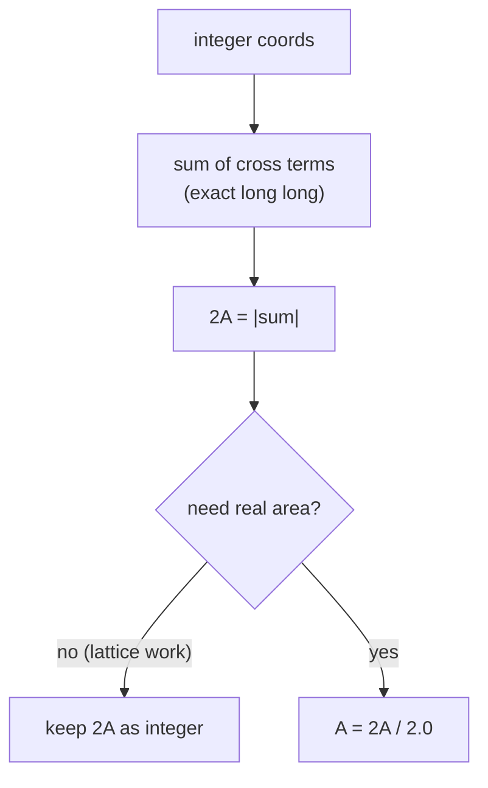

Why this matters: lattice algorithms (Pick's theorem below, half-area comparisons, "is the
area an integer?" checks) all stay **exact** if you never leave the integers. Overflow is
the only concern — products of coordinates up to $10^9$ reach $10^{18}$, so `long long` is
required.

```python
def doubled_area(poly):
    n = len(poly)
    s = 0
    for i in range(n):
        j = (i + 1) % n
        s += poly[i].x * poly[j].y - poly[j].x * poly[i].y
    return abs(s)  # 2 * area, exact integer
```

```cpp
long long doubled_area(const vector<Point>& poly) {
    int n = (int)poly.size();
    long long s = 0;
    for (int i = 0; i < n; i++) {
        int j = (i + 1) % n;
        s += poly[i].x * poly[j].y - poly[j].x * poly[i].y;
    }
    return llabs(s); // 2 * area, exact integer
}
```

---

## 5. Pick's Theorem & Boundary Lattice Points

For a polygon whose vertices are all on integer (lattice) points, **Pick's theorem** links
area to lattice-point counts:

$$A = I + \frac{B}{2} - 1$$

where $I$ is the number of lattice points strictly **inside** and $B$ is the number on the
**boundary**. Rearranged, the interior count is:

$$I = A - \frac{B}{2} + 1 = \frac{2A - B + 2}{2}$$

Using the doubled area $2A$ keeps this exact integer arithmetic.

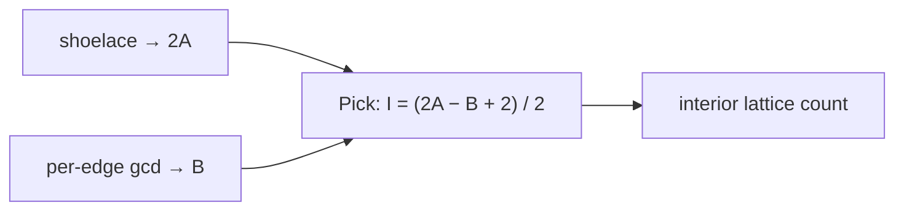

**Counting boundary points $B$.** The number of lattice points on a single segment from
$(x_1,y_1)$ to $(x_2,y_2)$ — *excluding* one endpoint to avoid double counting — is
$\gcd(|x_2-x_1|, |y_2-y_1|)$. Summing this over all edges gives $B$.

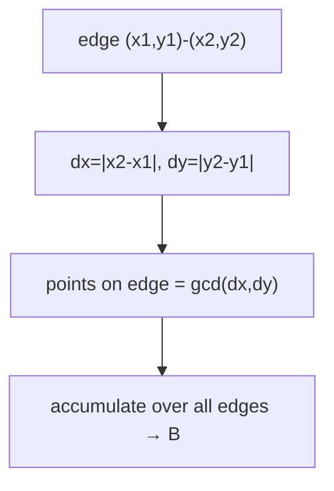

```python
from math import gcd

def boundary_points(poly):
    n = len(poly)
    b = 0
    for i in range(n):
        j = (i + 1) % n
        dx = abs(poly[i].x - poly[j].x)
        dy = abs(poly[i].y - poly[j].y)
        b += gcd(dx, dy)
    return b

def interior_points(poly):
    a2 = doubled_area(poly)          # 2A
    b = boundary_points(poly)        # B
    return (a2 - b + 2) // 2         # I from Pick's theorem
```

```cpp
long long boundary_points(const vector<Point>& poly) {
    int n = (int)poly.size();
    long long b = 0;
    for (int i = 0; i < n; i++) {
        int j = (i + 1) % n;
        long long dx = llabs(poly[i].x - poly[j].x);
        long long dy = llabs(poly[i].y - poly[j].y);
        b += __gcd(dx, dy);
    }
    return b;
}

long long interior_points(const vector<Point>& poly) {
    long long a2 = doubled_area(poly);   // 2A
    long long b = boundary_points(poly); // B
    return (a2 - b + 2) / 2;             // I from Pick's theorem
}
```

---

## 6. Point-in-Polygon by Ray Casting

To decide if a query point $q$ is inside a polygon, shoot a **ray** from $q$ in a fixed
direction (commonly the $+x$ direction) and count how many polygon edges it **crosses**. An
**odd** number of crossings means inside; **even** means outside — the *even–odd rule*.

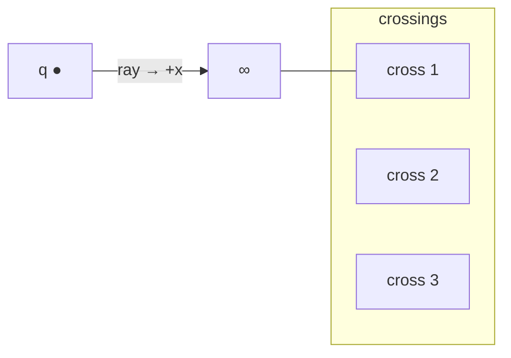

The intuition: every time the ray crosses the boundary it toggles between *outside* and
*inside*. Starting from infinity (definitely outside), an odd count lands you inside.

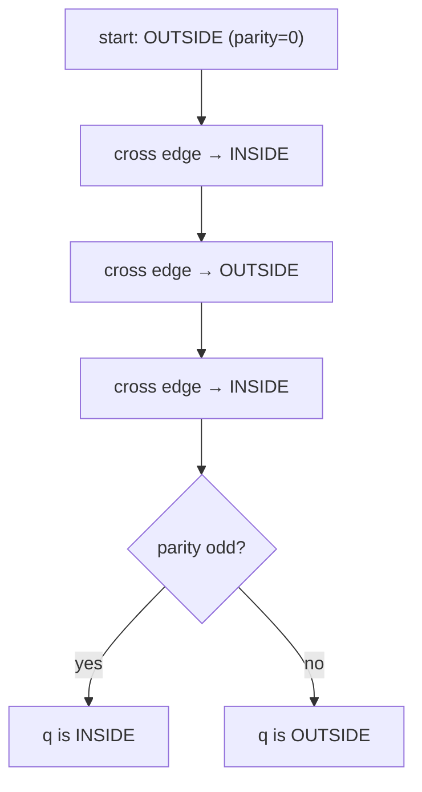

An edge $(a,b)$ is crossed by the rightward ray at height $q_y$ when the edge **straddles**
$q_y$ vertically and the x-coordinate of the intersection lies to the **right** of $q_x$. To
avoid counting an edge twice at a shared vertex, use a **half-open** vertical test: one
endpoint strictly above, the other at-or-below.

```python
def point_in_polygon(q, poly):
    n = len(poly)
    inside = False
    for i in range(n):
        a, b = poly[i], poly[(i + 1) % n]
        straddle = (a.y > q.y) != (b.y > q.y)
        if straddle:
            x_at = a.x + (q.y - a.y) * (b.x - a.x) / (b.y - a.y)
            if q.x < x_at:
                inside = not inside
    return inside  # True = strictly inside
```

```cpp
bool point_in_polygon(const Point& q, const vector<Point>& poly) {
    int n = (int)poly.size();
    bool inside = false;
    for (int i = 0; i < n; i++) {
        const Point& a = poly[i];
        const Point& b = poly[(i + 1) % n];
        bool straddle = (a.y > q.y) != (b.y > q.y);
        if (straddle) {
            double x_at = a.x + (double)(q.y - a.y) * (b.x - a.x) / (b.y - a.y);
            if (q.x < x_at) inside = !inside;
        }
    }
    return inside; // true = strictly inside
}
```

---

## 7. Point-in-Polygon by Winding Number

The **winding number** counts how many times the polygon boundary wraps **around** the
query point as you traverse it once. A nonzero winding number means inside; zero means
outside. Unlike parity, this is robust for self-overlapping polygons.

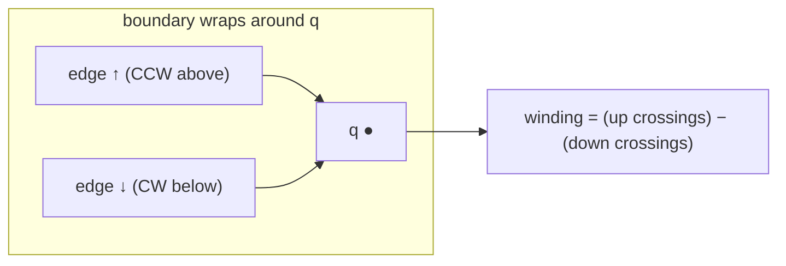

The standard implementation accumulates $+1$ each time an edge crosses the horizontal line
$y = q_y$ going **upward** to the right of $q$, and $-1$ each time it crosses **downward**.
The orientation of each crossing is decided by a `cross` (side) test rather than a floating
division, keeping it exact for integer input.

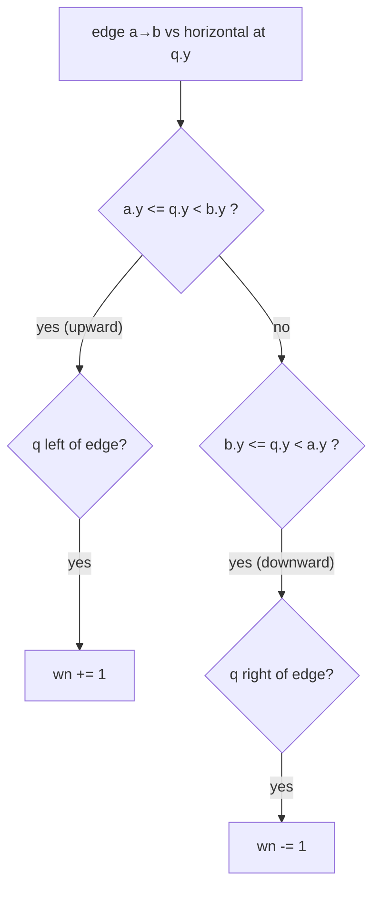

```python
def winding_number(q, poly):
    n = len(poly)
    wn = 0
    for i in range(n):
        a, b = poly[i], poly[(i + 1) % n]
        if a.y <= q.y:
            if b.y > q.y and cross(a, b, q) > 0:
                wn += 1
        else:
            if b.y <= q.y and cross(a, b, q) < 0:
                wn -= 1
    return wn  # nonzero = inside
```

```cpp
int winding_number(const Point& q, const vector<Point>& poly) {
    int n = (int)poly.size();
    int wn = 0;
    for (int i = 0; i < n; i++) {
        const Point& a = poly[i];
        const Point& b = poly[(i + 1) % n];
        if (a.y <= q.y) {
            if (b.y > q.y && cross(a, b, q) > 0) wn += 1;
        } else {
            if (b.y <= q.y && cross(a, b, q) < 0) wn -= 1;
        }
    }
    return wn; // nonzero = inside
}
```

---

## 8. Points On the Boundary

Both ray casting and winding number can give **inconsistent** answers for a point lying
exactly *on* an edge or *at* a vertex — a ray grazing a vertex may count 0 or 2 crossings
depending on tie-breaking. When the *on-boundary* case matters, test it **explicitly and
first**: a point is on segment $ab$ iff $\text{cross}(a,b,q) = 0$ (collinear) **and** $q$
lies within the bounding box of $a,b$.

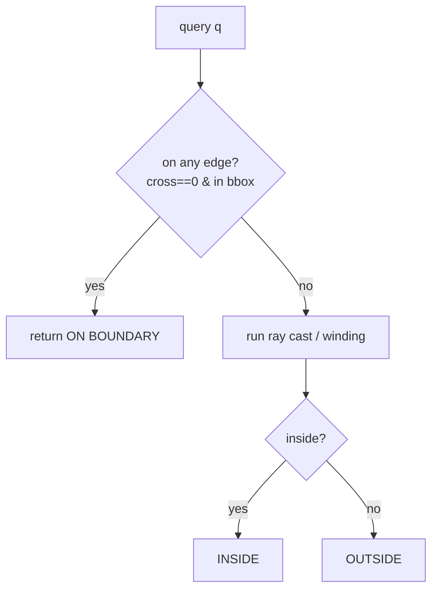

```python
def on_segment(a, b, q):
    if cross(a, b, q) != 0:
        return False
    return (min(a.x, b.x) <= q.x <= max(a.x, b.x) and
            min(a.y, b.y) <= q.y <= max(a.y, b.y))

def classify(q, poly):
    n = len(poly)
    for i in range(n):
        if on_segment(poly[i], poly[(i + 1) % n], q):
            return "ON"
    return "IN" if point_in_polygon(q, poly) else "OUT"
```

```cpp
bool on_segment(const Point& a, const Point& b, const Point& q) {
    if (cross(a, b, q) != 0) return false;
    return (min(a.x, b.x) <= q.x && q.x <= max(a.x, b.x) &&
            min(a.y, b.y) <= q.y && q.y <= max(a.y, b.y));
}

string classify(const Point& q, const vector<Point>& poly) {
    int n = (int)poly.size();
    for (int i = 0; i < n; i++) {
        if (on_segment(poly[i], poly[(i + 1) % n], q)) return "ON";
    }
    return point_in_polygon(q, poly) ? "IN" : "OUT";
}
```

---

## 9. Convex Polygon: Orientation & Binary Search

For a **convex** polygon, the generic $O(n)$ scan can be sharpened. With CCW orientation, a
point is inside iff it is on the **left side** (or on) of *every* directed edge — an $O(n)$
all-edges orientation check:

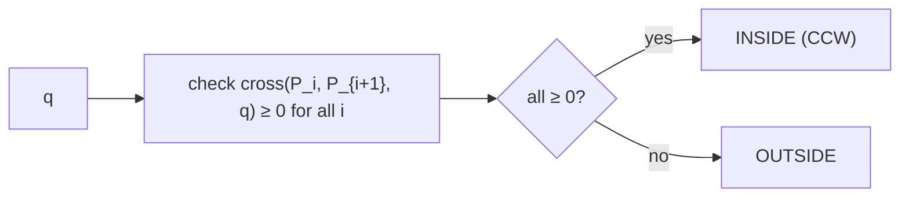

Even faster: fix vertex $P_0$ as a pivot, **binary search** the fan of triangles
$P_0 P_i P_{i+1}$ to find the wedge containing $q$, then a single orientation test settles
it in $O(\log n)$ — ideal when answering many queries against one fixed convex polygon.

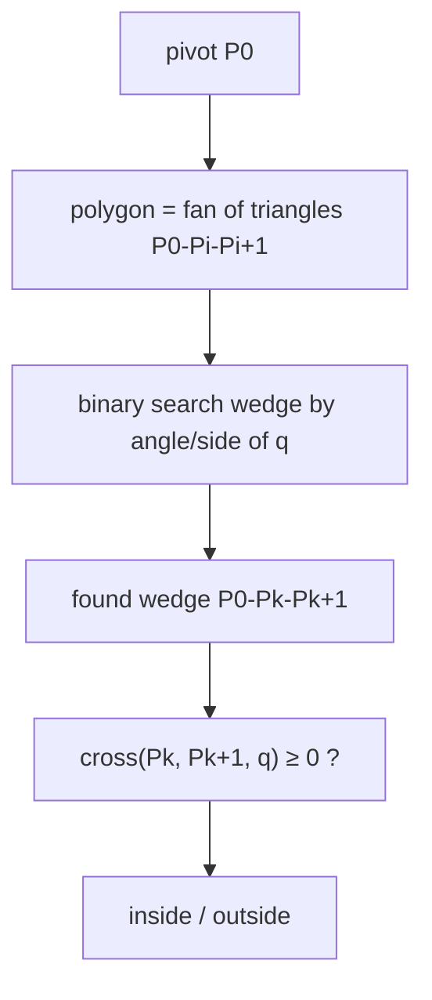

```python
def convex_contains(q, poly):
    n = len(poly)
    if cross(poly[0], poly[1], q) < 0 or cross(poly[0], poly[n - 1], q) > 0:
        return False
    lo, hi = 1, n - 1
    while hi - lo > 1:
        mid = (lo + hi) // 2
        if cross(poly[0], poly[mid], q) >= 0:
            lo = mid
        else:
            hi = mid
    return cross(poly[lo], poly[hi], q) >= 0
```

```cpp
bool convex_contains(const Point& q, const vector<Point>& poly) {
    int n = (int)poly.size();
    if (cross(poly[0], poly[1], q) < 0 || cross(poly[0], poly[n - 1], q) > 0)
        return false;
    int lo = 1, hi = n - 1;
    while (hi - lo > 1) {
        int mid = (lo + hi) / 2;
        if (cross(poly[0], poly[mid], q) >= 0) lo = mid;
        else hi = mid;
    }
    return cross(poly[lo], poly[hi], q) >= 0;
}
```

---

## Complexity Summary

| Task | Time | Space |
|---|---|---|
| Shoelace area / signed area | $O(n)$ | $O(1)$ |
| Doubled integer area | $O(n)$ | $O(1)$ |
| Boundary points (gcd per edge) | $O(n \log C)$ | $O(1)$ |
| Pick's interior count | $O(n \log C)$ | $O(1)$ |
| Ray-casting PIP | $O(n)$ per query | $O(1)$ |
| Winding-number PIP | $O(n)$ per query | $O(1)$ |
| Convex PIP (all edges) | $O(n)$ per query | $O(1)$ |
| Convex PIP (binary search) | $O(\log n)$ per query | $O(1)$ |

Here $C$ is the coordinate magnitude (gcd cost).

---

## Common Pitfalls

- **Orientation sign.** Forgetting the `abs` when you only want magnitude, or *adding* the
  `abs` when you actually need the **sign** to know CW vs CCW.
- **On-boundary ambiguity.** Ray casting and winding give unreliable in/out answers for
  points exactly on an edge or vertex — test `on_segment` **first** if it matters.
- **Ray through a vertex.** A horizontal ray hitting a shared vertex can be double-counted
  or missed. The **half-open** straddle test `(a.y > q.y) != (b.y > q.y)` fixes this.
- **Overflow.** Cross products of coordinates up to $10^9$ reach $10^{18}$; always use
  `long long`. Keep the **doubled area** integer for lattice work.
- **Self-intersecting polygons.** Even–odd parity can mislabel overlapping regions; prefer
  the **winding number** there.
- **Closing edge.** Don't forget the wrap-around edge $P_{n-1} \to P_0$ (use index
  `(i+1) % n`).

---

## Patterns

- **Sign of shoelace = orientation.** A free byproduct: compute area once, read its sign to
  normalize CW/CCW.
- **Stay in integers.** Doubled area + gcd boundary count keeps Pick's theorem exact.
- **Test on-boundary, then in/out.** A clean three-way classify is `on_segment` first, then
  ray cast / winding.
- **Convex ⇒ logarithmic queries.** Fan + binary search amortizes many queries against a
  fixed convex hull.
- **Cross product is the primitive.** Orientation, area, side tests, and winding all reduce
  to the 2D cross product — implement it once, reuse everywhere.
