# Convex Hull — Andrew's Monotone Chain & Graham Scan (Complete Guide)

> Given a set of points in the plane, the **convex hull** is the smallest convex polygon that
> contains all of them. Picture stretching a rubber band around a board of nails and letting it
> snap tight — the nails it touches form the hull. This guide builds the hull two classic ways:
> **Andrew's monotone chain** (sort by coordinates, sweep) and the **Graham scan** (sort by polar
> angle, stack), both in $O(n \log n)$ and both driven by a single integer **orientation predicate**.

---

## Table of Contents
1. [What a Convex Hull Is](#1-what-a-convex-hull-is)
2. [The Orientation Predicate (the engine)](#2-the-orientation-predicate-the-engine)
3. [Andrew's Monotone Chain](#3-andrews-monotone-chain)
4. [Graham Scan](#4-graham-scan)
5. [Handling Collinear Points (keep or drop)](#5-handling-collinear-points-keep-or-drop)
6. [Fewer Than 3 Points](#6-fewer-than-3-points)
7. [Area & Perimeter of the Hull](#7-area--perimeter-of-the-hull)
8. [Diameter via Rotating Calipers (brief)](#8-diameter-via-rotating-calipers-brief)
9. [Complexity Summary](#9-complexity-summary)
10. [Common Pitfalls](#10-common-pitfalls)
11. [Patterns](#11-patterns)

---

## 1. What a Convex Hull Is

A polygon is **convex** if every interior angle is at most $180°$ — equivalently, walking the
boundary you always turn the same way (say counter-clockwise) and never "dent" inward. The convex
hull of a point set $P$ is the smallest convex polygon whose interior (and boundary) contains every
point of $P$.

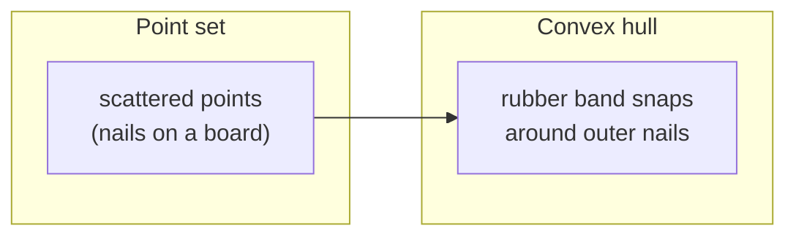

Visually, the *outer* points become hull **vertices**; everything strictly inside is irrelevant to
the boundary:

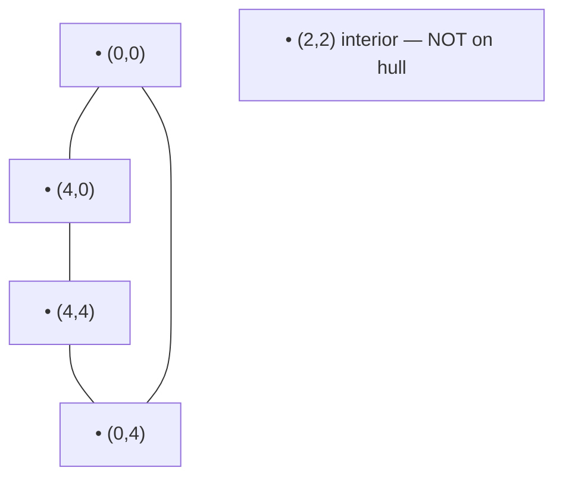

The output is the ordered list of hull vertices (here in counter-clockwise order):
`(0,0) → (4,0) → (4,4) → (0,4)`. The interior point `(2,2)` is discarded.

Why hulls matter: they give the **extreme** points (farthest apart pair, widest spread), they are the
first step for many geometry algorithms (closest pair of hulls, collision shapes, smallest enclosing
shapes), and they shrink a messy cloud to its $O(h)$ boundary vertices.

---

## 2. The Orientation Predicate (the engine)

Both algorithms repeatedly ask: *given an ordered triple $O, A, B$, do we turn **left** (counter-clockwise),
**right** (clockwise), or go **straight**?* The answer is the sign of the **cross product** of
$\vec{OA}$ and $\vec{OB}$:

$$
\operatorname{cross}(O, A, B) = (A_x - O_x)(B_y - O_y) - (A_y - O_y)(B_x - O_x).
$$

- $\operatorname{cross} > 0$ → **counter-clockwise** (left turn).
- $\operatorname{cross} < 0$ → **clockwise** (right turn).
- $\operatorname{cross} = 0$ → **collinear** (straight).

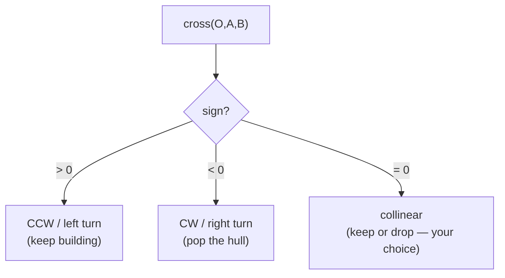

Use **`long long`** for the cross product: coordinates up to $10^9$ make the products up to
$\sim 4\times 10^{18}$, which overflows 32-bit but fits a signed 64-bit integer. Staying in integers
means the predicate is **exact** — no floating-point rounding can misclassify a turn.

```python
class Point:
    __slots__ = ("x", "y")
    def __init__(self, x, y):
        self.x = x
        self.y = y

def cross(o: Point, a: Point, b: Point) -> int:
    # (a - o) x (b - o); >0 CCW, <0 CW, =0 collinear
    return (a.x - o.x) * (b.y - o.y) - (a.y - o.y) * (b.x - o.x)
```

```cpp
#include <bits/stdc++.h>
using namespace std;

struct Point {
    long long x, y;
};

// (a - o) x (b - o); >0 CCW, <0 CW, =0 collinear
long long cross(const Point &o, const Point &a, const Point &b) {
    return (a.x - o.x) * (b.y - o.y) - (a.y - o.y) * (b.x - o.x);
}
```

---

## 3. Andrew's Monotone Chain

**Idea:** sort points by $(x, y)$. Build the **lower hull** left-to-right, then the **upper hull**
right-to-left, each time popping any point that would make a **non-counter-clockwise** turn. Concatenate
the two chains and you have the full hull in CCW order.

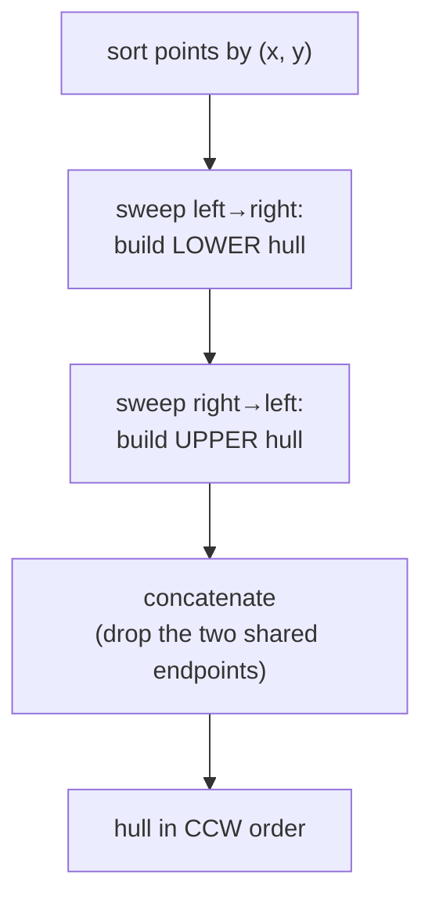

### The stack-pop rule

While the last two hull points plus the new candidate form a **clockwise** (or collinear) turn, pop the
middle point — it cannot be on a convex boundary:

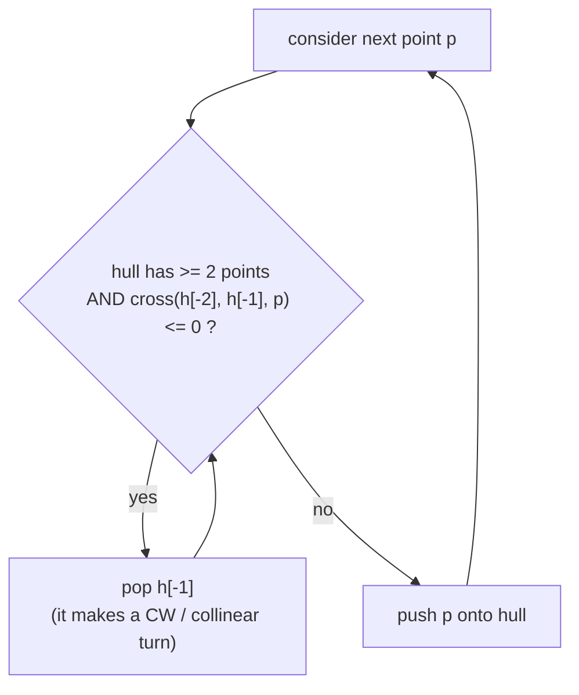

### Lower then upper chain

The lower chain captures the bottom boundary; the upper chain captures the top. Together they wrap the
cloud:

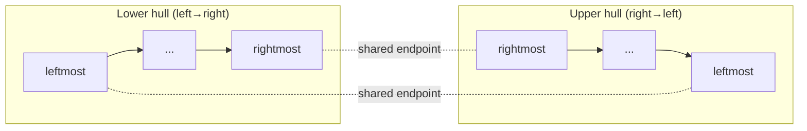

```python
def monotone_chain(points):
    pts = sorted(set((p.x, p.y) for p in points))   # dedupe + sort by (x, y)
    pts = [Point(x, y) for x, y in pts]
    n = len(pts)
    if n <= 2:
        return pts[:]                               # 0,1,2 points: hull is themselves

    def build(seq):
        hull = []
        for p in seq:
            while len(hull) >= 2 and cross(hull[-2], hull[-1], p) <= 0:
                hull.pop()                           # pop CW / collinear turns
            hull.append(p)
        return hull

    lower = build(pts)
    upper = build(reversed(pts))
    # drop each chain's last point (it is the other's first)
    return lower[:-1] + upper[:-1]
```

```cpp
#include <bits/stdc++.h>
using namespace std;

vector<Point> monotone_chain(vector<Point> pts) {
    sort(pts.begin(), pts.end(), [](const Point &a, const Point &b) {
        return a.x != b.x ? a.x < b.x : a.y < b.y;   // sort by (x, y)
    });
    pts.erase(unique(pts.begin(), pts.end(), [](const Point &a, const Point &b) {
        return a.x == b.x && a.y == b.y;             // dedupe
    }), pts.end());

    int n = (int)pts.size();
    if (n <= 2) return pts;                          // 0,1,2 points: hull is themselves

    vector<Point> hull(2 * n);
    int k = 0;
    // lower hull
    for (int i = 0; i < n; ++i) {
        while (k >= 2 && cross(hull[k - 2], hull[k - 1], pts[i]) <= 0) --k;
        hull[k++] = pts[i];
    }
    // upper hull
    int lower = k + 1;
    for (int i = n - 2; i >= 0; --i) {
        while (k >= lower && cross(hull[k - 2], hull[k - 1], pts[i]) <= 0) --k;
        hull[k++] = pts[i];
    }
    hull.resize(k - 1);                              // drop the repeated start point
    return hull;
}
```

### Before / after

Sorting gives a strict left-to-right order; the sweep removes interior and reflex points:

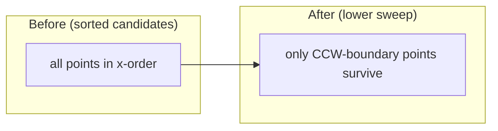

---

## 4. Graham Scan

**Idea:** pick the **pivot** = the lowest point (smallest $y$, ties broken by smallest $x$). Sort all
other points by **polar angle** around the pivot. Then walk the sorted list pushing onto a stack,
popping whenever the last three points make a non-left turn. The pivot is guaranteed to be a hull vertex,
which anchors the scan.

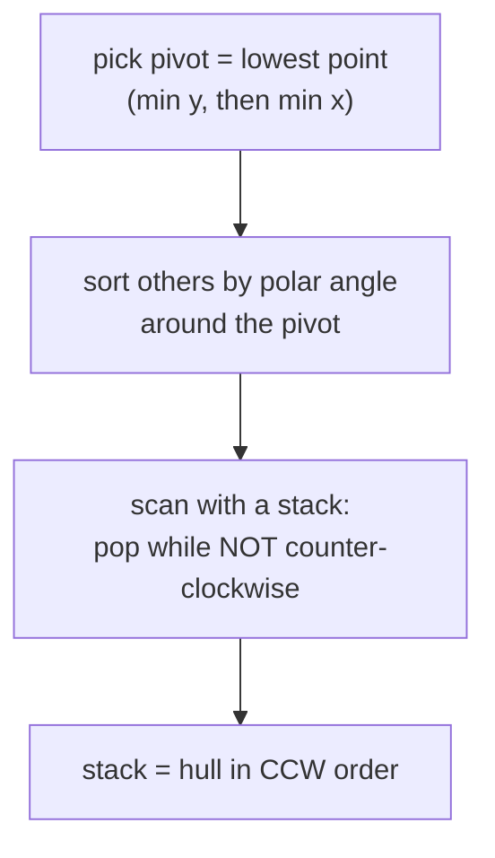

### Polar-angle sort around the pivot

Every other point is ordered by the angle the ray pivot→point makes with the positive $x$-axis. Ties at
the same angle are ordered by distance. We compare angles **without trigonometry** by reusing the cross
product:

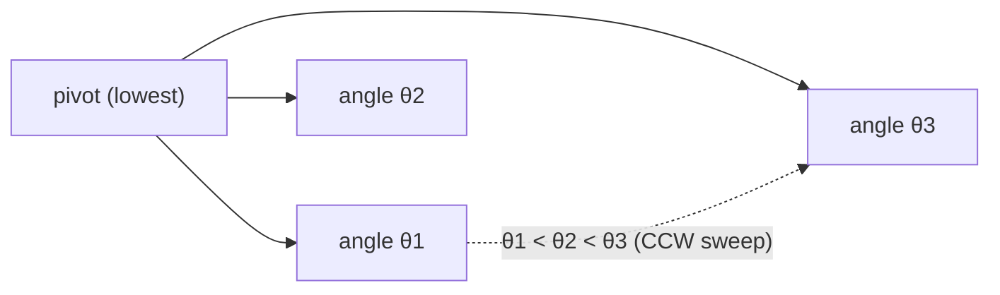

### The stack push/pop scan

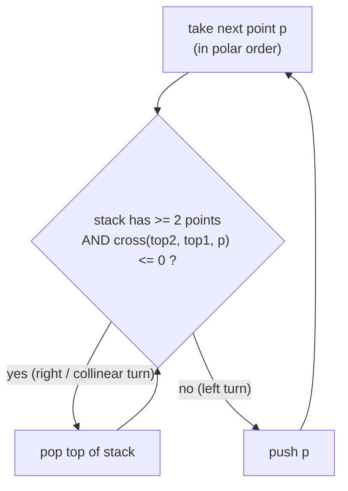

```python
import math

def graham_scan(points):
    pts = list({(p.x, p.y) for p in points})
    pts = [Point(x, y) for x, y in pts]
    if len(pts) <= 2:
        return pts[:]

    # pivot = lowest point (min y, then min x)
    pivot = min(pts, key=lambda p: (p.y, p.x))

    def angle_key(p):
        # sort by polar angle around pivot; ties by squared distance
        ang = math.atan2(p.y - pivot.y, p.x - pivot.x)
        d2 = (p.x - pivot.x) ** 2 + (p.y - pivot.y) ** 2
        return (ang, d2)

    ordered = sorted((p for p in pts if p is not pivot), key=angle_key)

    hull = [pivot]
    for p in ordered:
        while len(hull) >= 2 and cross(hull[-2], hull[-1], p) <= 0:
            hull.pop()                       # pop right / collinear turns
        hull.append(p)
    return hull
```

```cpp
#include <bits/stdc++.h>
using namespace std;

vector<Point> graham_scan(vector<Point> pts) {
    // dedupe
    sort(pts.begin(), pts.end(), [](const Point &a, const Point &b) {
        return a.x != b.x ? a.x < b.x : a.y < b.y;
    });
    pts.erase(unique(pts.begin(), pts.end(), [](const Point &a, const Point &b) {
        return a.x == b.x && a.y == b.y;
    }), pts.end());
    if ((int)pts.size() <= 2) return pts;

    // pivot = lowest point (min y, then min x)
    int piv = 0;
    for (int i = 1; i < (int)pts.size(); ++i)
        if (pts[i].y < pts[piv].y || (pts[i].y == pts[piv].y && pts[i].x < pts[piv].x))
            piv = i;
    swap(pts[0], pts[piv]);
    Point pivot = pts[0];

    auto dist2 = [&](const Point &p) {
        long long dx = p.x - pivot.x, dy = p.y - pivot.y;
        return dx * dx + dy * dy;
    };
    // sort by polar angle using cross product; ties by distance
    sort(pts.begin() + 1, pts.end(), [&](const Point &a, const Point &b) {
        long long c = cross(pivot, a, b);
        if (c != 0) return c > 0;            // a before b if a is CCW of b
        return dist2(a) < dist2(b);
    });

    vector<Point> hull;
    for (const Point &p : pts) {
        while (hull.size() >= 2 && cross(hull[hull.size() - 2], hull.back(), p) <= 0)
            hull.pop_back();                 // pop right / collinear turns
        hull.push_back(p);
    }
    return hull;
}
```

### Incremental stack with pops

Watch the stack as points arrive — a fresh point can trigger several pops before it settles:

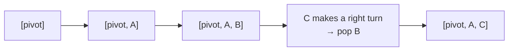

---

## 5. Handling Collinear Points (keep or drop)

When three boundary points are exactly collinear, the cross product is $0$. Whether you keep the middle
one depends on the problem:

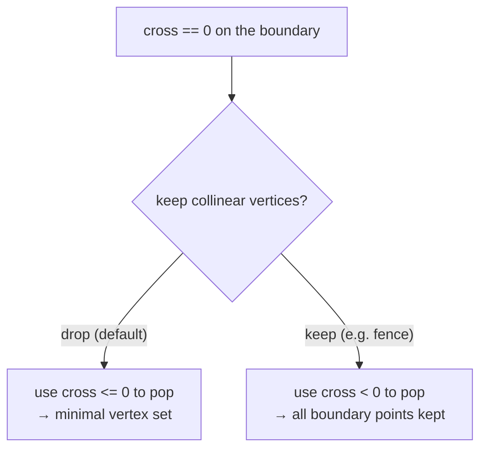

- **Drop collinear (strict turns):** pop when `cross <= 0`. The hull has the *fewest* vertices; straight
  edges contain no extra points. This is the usual default.
- **Keep collinear (non-strict):** pop when `cross < 0`. Points lying *on* a hull edge are retained — needed
  by problems like "Erect the Fence" that want every point touching the boundary.

The two code blocks above use `<= 0` (drop). To keep collinear points, change the pop test to `< 0` and
take care with the final edge (the last collinear run may need explicit handling in monotone chain).

---

## 6. Fewer Than 3 Points

A hull needs at least 3 non-collinear points to be a polygon. Edge cases:

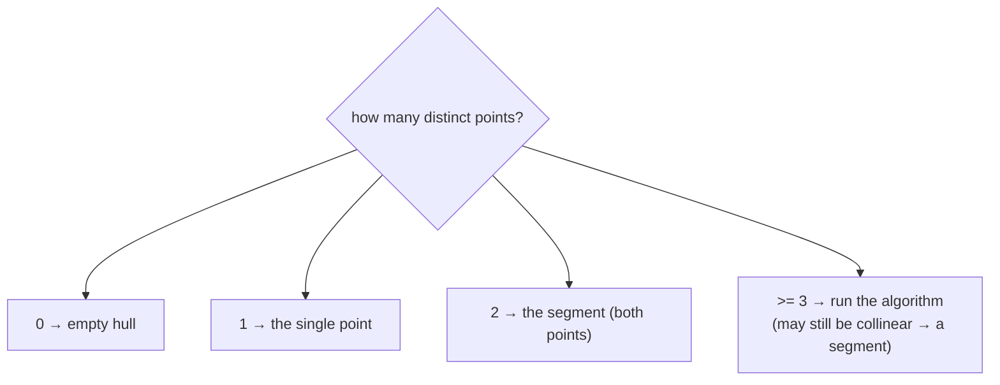

Always **dedupe** first, then short-circuit when $n \le 2$ by returning the points as-is. If all points are
collinear, both algorithms naturally return the two extreme endpoints (drop mode) or the full sorted line
(keep mode).

---

## 7. Area & Perimeter of the Hull

Once you have hull vertices $v_0, v_1, \dots, v_{h-1}$ in order, the **shoelace formula** gives the area and a
simple loop gives the perimeter:

$$
\text{Area} = \frac{1}{2}\left| \sum_{i=0}^{h-1} \big( x_i \, y_{i+1} - x_{i+1} \, y_i \big) \right|,
\qquad
\text{Perimeter} = \sum_{i=0}^{h-1} \lVert v_{i+1} - v_i \rVert,
$$

with indices taken modulo $h$.

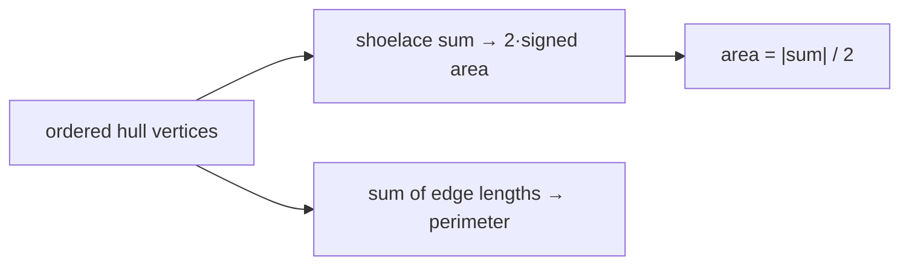

```python
import math

def hull_area_perimeter(hull):
    h = len(hull)
    if h < 3:
        # 0/1 point → area 0, perimeter 0; 2 points → perimeter is 2× the segment
        if h == 2:
            d = math.dist((hull[0].x, hull[0].y), (hull[1].x, hull[1].y))
            return 0.0, 2 * d
        return 0.0, 0.0
    area2 = 0          # twice the signed area (stays integer)
    perim = 0.0
    for i in range(h):
        a, b = hull[i], hull[(i + 1) % h]
        area2 += a.x * b.y - b.x * a.y
        perim += math.dist((a.x, a.y), (b.x, b.y))
    return abs(area2) / 2.0, perim
```

```cpp
#include <bits/stdc++.h>
using namespace std;

pair<double, double> hull_area_perimeter(const vector<Point> &hull) {
    int h = (int)hull.size();
    if (h < 3) {
        if (h == 2) {
            double dx = hull[1].x - hull[0].x, dy = hull[1].y - hull[0].y;
            return {0.0, 2.0 * sqrt(dx * dx + dy * dy)};
        }
        return {0.0, 0.0};
    }
    long long area2 = 0;        // twice the signed area (stays integer)
    double perim = 0.0;
    for (int i = 0; i < h; ++i) {
        const Point &a = hull[i];
        const Point &b = hull[(i + 1) % h];
        area2 += a.x * b.y - b.x * a.y;
        double dx = (double)(b.x - a.x), dy = (double)(b.y - a.y);
        perim += sqrt(dx * dx + dy * dy);
    }
    return {llabs(area2) / 2.0, perim};
}
```

---

## 8. Diameter via Rotating Calipers (brief)

The **diameter** of a point set (largest distance between any two points) is always realized by two hull
vertices. Brute force over hull pairs is $O(h^2)$; **rotating calipers** finds it in $O(h)$ by walking two
pointers around the hull, advancing the "antipodal" pointer as the edge rotates:

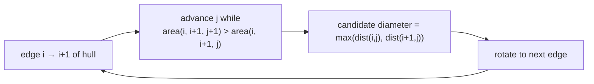

Each pointer makes at most one full loop, so the total work is linear after the $O(n \log n)$ hull build.
The same caliper sweep also yields the hull **width** and the **minimum-area bounding rectangle**.

---

## 9. Complexity Summary

| Step | Time | Space |
|------|------|-------|
| Sort (by coords or polar angle) | $O(n \log n)$ | $O(n)$ |
| Monotone chain sweep (both chains) | $O(n)$ | $O(n)$ |
| Graham scan (stack walk) | $O(n)$ | $O(n)$ |
| **Total hull construction** | $O(n \log n)$ | $O(n)$ |
| Area / perimeter from hull | $O(h)$ | $O(1)$ |
| Diameter (rotating calipers) | $O(n \log n + h)$ | $O(n)$ |

The $O(n \log n)$ sort dominates; the sweep/scan itself is linear because each point is **pushed once and
popped at most once**. This is optimal in the comparison model for output that can have up to $h = n$ hull
vertices.

---

## 10. Common Pitfalls

- **32-bit overflow in the cross product.** Coordinates near $10^9$ make products near $10^{18}$. Use
  `long long` (C++) — Python integers are unbounded so they are safe.
- **Collinear handling mismatch.** `cross <= 0` *drops* collinear boundary points; `cross < 0` *keeps* them.
  Pick the one your problem demands and be consistent in **both** chains / the whole scan.
- **Duplicate points.** Repeated coordinates break the angle sort and can leave a degenerate edge — **dedupe**
  before sorting.
- **Strict vs non-strict turns.** Using `<` where `<=` is needed (or vice-versa) silently changes which
  vertices survive; it is the single most common convex-hull bug.
- **Wrong sort key.** Monotone chain needs sort by $(x, y)$; Graham scan needs sort by **polar angle around the
  pivot**. Mixing them up corrupts the boundary order.
- **Fewer than 3 points.** Return early for $n \le 2$; otherwise the chain concatenation drops real points.
- **Floating-point angle sort.** Prefer the **integer cross product** over `atan2` when possible — it is exact
  and avoids ties being misordered by rounding.

---

## 11. Patterns

- **Orientation predicate everywhere.** Left/right/straight from the sign of one cross product is the
  backbone of segment intersection, point-in-polygon, and hull construction alike.
- **Sort then sweep.** Both hull algorithms reduce a 2-D problem to a 1-D sweep after an $O(n \log n)$ sort —
  a recurring computational-geometry template.
- **Monotonic stack on geometry.** The pop-while-not-CCW loop is the same monotonic-stack idea seen in arrays,
  applied to turn direction instead of magnitude.
- **Lower + upper decomposition.** Splitting a closed boundary into two monotone chains turns a circular
  problem into two linear passes — reused in skyline, Pareto frontier, and visibility problems.
- **Integer-exact geometry.** Keeping everything in integers (cross products, twice-area) eliminates an entire
  class of precision bugs; only convert to `double` at the very end for lengths.
- **Hull as a preprocessing step.** Diameter, width, smallest enclosing rectangle, and farthest-pair queries
  all start by shrinking the cloud to its $O(h)$ hull vertices.
