# Closest Pair of Points — Brute Force, Divide & Conquer, and Sweep Line (Complete Guide)

> Given $n$ points in the plane, find the **two distinct points whose Euclidean distance is
> smallest**. The naive answer compares all $\binom{n}{2}$ pairs in $O(n^2)$. The classic
> **divide & conquer** algorithm and the **sweep-line with an ordered set** both solve it in
> $O(n \log n)$. The whole trick is the same beautiful geometric fact: *inside a thin vertical
> strip of width $d$, each point can have only a constant number of close neighbours*, so the
> "combine" step is linear instead of quadratic.

Throughout we compare **squared distances** (`long long`) so the core logic never touches a
square root — `sqrt` is taken only once at the very end if the actual distance is required.

---

## Table of Contents
1. [The Problem & a Shared Point Type](#1-the-problem--a-shared-point-type)
2. [Brute Force $O(n^2)$](#2-brute-force-on2)
3. [Divide & Conquer $O(n \log n)$](#3-divide--conquer-on-log-n)
4. [The Strip and the 7-Neighbour Bound](#4-the-strip-and-the-7-neighbour-bound)
5. [Why the 7-Neighbour Bound Holds](#5-why-the-7-neighbour-bound-holds)
6. [Sweep-Line with an Ordered Set](#6-sweep-line-with-an-ordered-set)
7. [Squared vs Real Distance](#7-squared-vs-real-distance)
8. [Complexity Summary](#8-complexity-summary)
9. [Common Pitfalls](#9-common-pitfalls)
10. [Patterns](#10-patterns)

---

## 1. The Problem & a Shared Point Type

We are given points $p_1, \dots, p_n$ and want
$$
d^\* = \min_{i \ne j} \lVert p_i - p_j \rVert
     = \min_{i \ne j} \sqrt{(x_i - x_j)^2 + (y_i - y_j)^2}.
$$
Because $\sqrt{\cdot}$ is monotone, minimizing the distance is the **same** as minimizing the
**squared** distance $(x_i - x_j)^2 + (y_i - y_j)^2$, which stays in integers. We keep one tiny
`Point` type and one squared-distance helper, reused by every algorithm below.

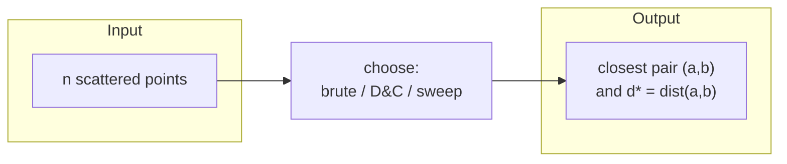

```python
import math
from typing import List, Tuple

class Point:
    __slots__ = ("x", "y")
    def __init__(self, x: int, y: int):
        self.x = x
        self.y = y

def dist2(a: Point, b: Point) -> int:
    # squared Euclidean distance — stays an integer, no sqrt
    dx = a.x - b.x
    dy = a.y - b.y
    return dx * dx + dy * dy
```

```cpp
#include <bits/stdc++.h>
using namespace std;

struct Point {
    long long x, y;
};

// squared Euclidean distance — stays a long long, no sqrt
long long dist2(const Point &a, const Point &b) {
    long long dx = a.x - b.x;
    long long dy = a.y - b.y;
    return dx * dx + dy * dy;
}
```

With coordinates up to $10^9$, each squared term reaches $\sim 10^{18}$ and the sum
$\sim 2\times 10^{18}$ — that overflows 32-bit but fits a signed 64-bit `long long`.

---

## 2. Brute Force $O(n^2)$

The baseline: try every unordered pair, keep the smallest squared distance. It is the simplest,
the most obviously correct, and the perfect **stress-test oracle** for the faster algorithms.

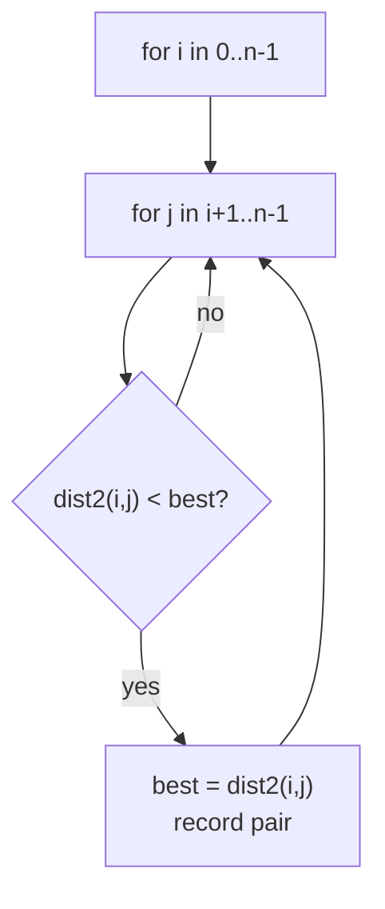

```python
def closest_brute(pts: List[Point]) -> Tuple[int, Point, Point]:
    n = len(pts)
    best = math.inf
    ba = bb = None
    for i in range(n):
        for j in range(i + 1, n):
            d = dist2(pts[i], pts[j])
            if d < best:
                best, ba, bb = d, pts[i], pts[j]
    return best, ba, bb           # best is SQUARED distance
```

```cpp
tuple<long long, Point, Point> closestBrute(const vector<Point> &pts) {
    int n = (int)pts.size();
    long long best = LLONG_MAX;
    Point ba{}, bb{};
    for (int i = 0; i < n; ++i)
        for (int j = i + 1; j < n; ++j) {
            long long d = dist2(pts[i], pts[j]);
            if (d < best) { best = d; ba = pts[i]; bb = pts[j]; }
        }
    return {best, ba, bb};        // best is SQUARED distance
}
```

For $n \le \sim 5000$ this is fine. Beyond that we need a smarter idea.

---

## 3. Divide & Conquer $O(n \log n)$

Sort the points **once by $x$**. Then recursively:

1. **Divide** — split the sorted array at the median $x$ into a left half $L$ and right half $R$.
2. **Conquer** — recursively find the closest pair distance $d_L$ in $L$ and $d_R$ in $R$.
   Let $d = \min(d_L, d_R)$.
3. **Combine** — the only pairs not yet considered are those straddling the dividing line. A
   straddling pair closer than $d$ must lie inside a vertical **strip** of width $2d$ centred on
   the median $x$. Scan that strip and look for anything beating $d$.

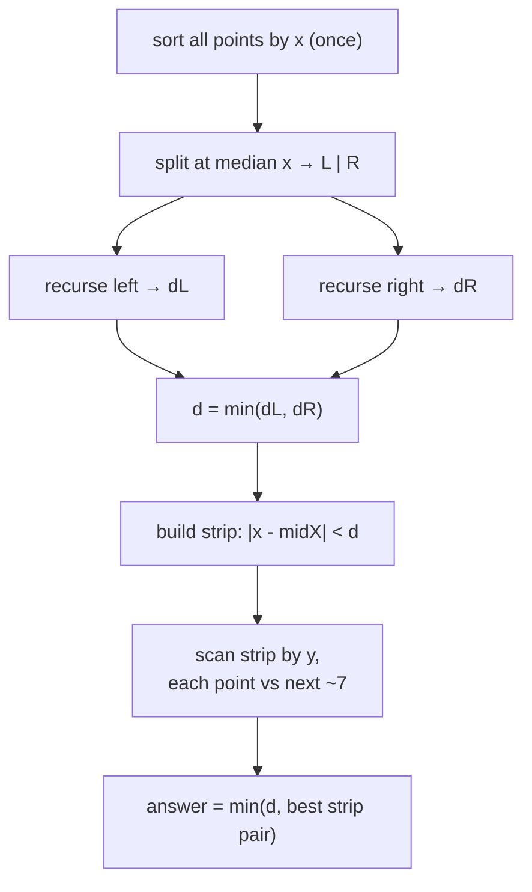

The split by median $x$:

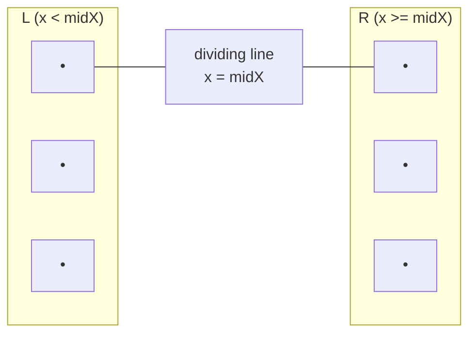

The recursion forms a balanced binary tree of depth $\log_2 n$, just like merge sort:

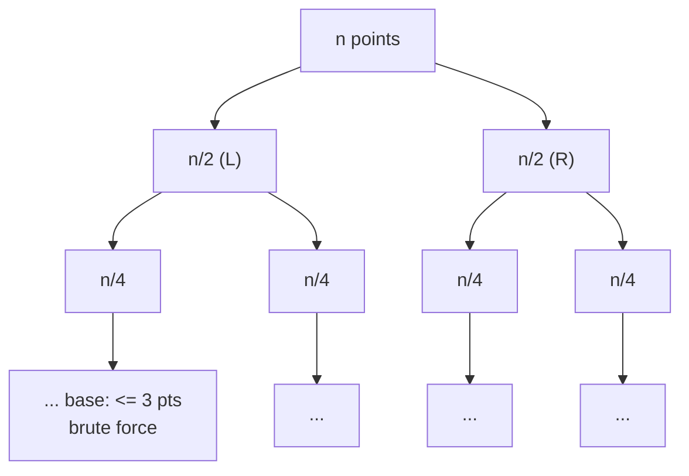

A key implementation detail: we also need the strip **sorted by $y$**. Re-sorting at every level
costs $O(n \log^2 n)$. To get clean $O(n \log n)$ we **merge** the $y$-sorted halves on the way
back up (exactly like merge sort), so each level produces a $y$-sorted list in $O(n)$.

```python
def closest_dc(pts: List[Point]) -> Tuple[int, Point, Point]:
    px = sorted(pts, key=lambda p: (p.x, p.y))

    def rec(a: int, b: int):
        # returns (best_sq, point, point, list_sorted_by_y) for px[a:b]
        n = b - a
        if n <= 3:
            best, pa, pb = math.inf, None, None
            for i in range(a, b):
                for j in range(i + 1, b):
                    d = dist2(px[i], px[j])
                    if d < best:
                        best, pa, pb = d, px[i], px[j]
            by_y = sorted(px[a:b], key=lambda p: p.y)
            return best, pa, pb, by_y

        mid = (a + b) // 2
        midx = px[mid].x
        dl, al, bl, ly = rec(a, mid)
        dr, ar, br, ry = rec(mid, b)
        if dl <= dr:
            best, pa, pb = dl, al, bl
        else:
            best, pa, pb = dr, ar, br

        # merge ly, ry → ys sorted by y in O(n)
        ys = []
        i = j = 0
        while i < len(ly) and j < len(ry):
            if ly[i].y <= ry[j].y:
                ys.append(ly[i]); i += 1
            else:
                ys.append(ry[j]); j += 1
        ys.extend(ly[i:]); ys.extend(ry[j:])

        # strip: points within sqrt(best) of the dividing line
        strip = [p for p in ys if (p.x - midx) * (p.x - midx) < best]
        for i in range(len(strip)):
            # only the next ~7 neighbours by y can beat best
            j = i + 1
            while j < len(strip) and (strip[j].y - strip[i].y) ** 2 < best:
                d = dist2(strip[i], strip[j])
                if d < best:
                    best, pa, pb = d, strip[i], strip[j]
                j += 1
        return best, pa, pb, ys

    best, pa, pb, _ = rec(0, len(px))
    return best, pa, pb
```

```cpp
struct Result { long long best; Point a, b; };

// px sorted by x; ys filled sorted by y for [a,b)
static Result rec(vector<Point> &px, int a, int b, vector<Point> &ys) {
    int n = b - a;
    if (n <= 3) {
        Result r{LLONG_MAX, {}, {}};
        for (int i = a; i < b; ++i)
            for (int j = i + 1; j < b; ++j) {
                long long d = dist2(px[i], px[j]);
                if (d < r.best) { r.best = d; r.a = px[i]; r.b = px[j]; }
            }
        ys.assign(px.begin() + a, px.begin() + b);
        sort(ys.begin(), ys.end(), [](const Point &p, const Point &q){ return p.y < q.y; });
        return r;
    }

    int mid = (a + b) / 2;
    long long midx = px[mid].x;
    vector<Point> ly, ry;
    Result rl = rec(px, a, mid, ly);
    Result rr = rec(px, mid, b, ry);
    Result best = (rl.best <= rr.best) ? rl : rr;

    // merge ly, ry -> ys by y in O(n)
    ys.clear(); ys.reserve(n);
    int i = 0, j = 0;
    while (i < (int)ly.size() && j < (int)ry.size()) {
        if (ly[i].y <= ry[j].y) ys.push_back(ly[i++]);
        else                    ys.push_back(ry[j++]);
    }
    while (i < (int)ly.size()) ys.push_back(ly[i++]);
    while (j < (int)ry.size()) ys.push_back(ry[j++]);

    // strip within sqrt(best) of the dividing line
    vector<Point> strip;
    for (const Point &p : ys)
        if ((p.x - midx) * (p.x - midx) < best.best) strip.push_back(p);

    for (int s = 0; s < (int)strip.size(); ++s)
        for (int t = s + 1; t < (int)strip.size() &&
             (strip[t].y - strip[s].y) * (strip[t].y - strip[s].y) < best.best; ++t) {
            long long d = dist2(strip[s], strip[t]);
            if (d < best.best) { best.best = d; best.a = strip[s]; best.b = strip[t]; }
        }
    return best;
}

Result closestDC(vector<Point> pts) {
    sort(pts.begin(), pts.end(), [](const Point &p, const Point &q){
        return p.x != q.x ? p.x < q.x : p.y < q.y;
    });
    vector<Point> ys;
    return rec(pts, 0, (int)pts.size(), ys);  // best is SQUARED distance
}
```

---

## 4. The Strip and the 7-Neighbour Bound

After we know $d = \min(d_L, d_R)$, any straddling pair beating $d$ must have **both** points within
horizontal distance $d$ of the median line — otherwise their $x$-gap alone already exceeds $d$. So we
keep only the strip $\{p : |p_x - \text{midX}| < d\}$ and sort it by $y$.

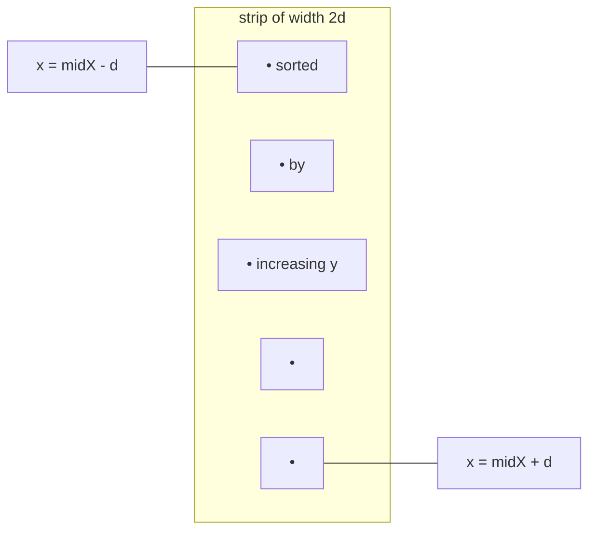

Now the magic: walking the strip in $y$ order, for each point $p$ you only need to test the **next
few** points — those whose $y$ differs from $p_y$ by less than $d$. A classic bound says **at most 7**
such points exist, so the inner loop is $O(1)$ amortized and the whole combine is $O(n)$.

Picture the $d \times 2d$ rectangle just **above** $p$ inside the strip. Split it into a grid of
$\tfrac{d}{2} \times \tfrac{d}{2}$ boxes — that is a $2 \times 4 = 8$ box grid:

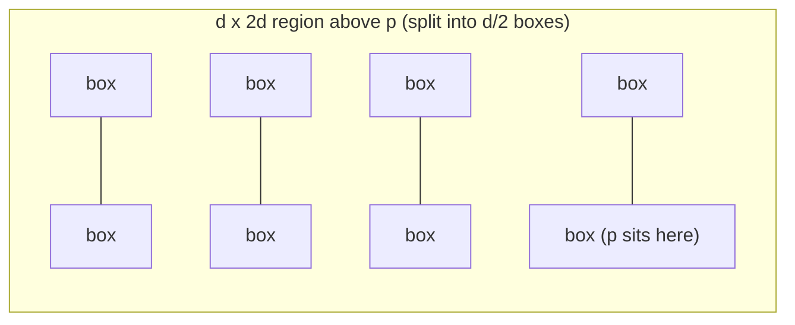

Each box has diameter $\tfrac{d}{\sqrt 2} < d$, so it can hold **at most one** point (two points in
one box would be closer than $d$, contradicting that $d$ is already the minimum within each half).
With 8 boxes and $p$ occupying one, at most **7** other points lie in the region — hence the
"check the next 7 neighbours" rule.

---

## 5. Why the 7-Neighbour Bound Holds

Make the argument precise. Suppose, after sorting the strip by $y$, point $p$ has another strip point
$q$ above it with $q_y - p_y < d$ and $\text{dist}(p, q) < d$. Both $p$ and $q$ lie in the
$2d \times d$ rectangle $[\text{midX}-d, \text{midX}+d] \times [p_y, p_y + d]$.

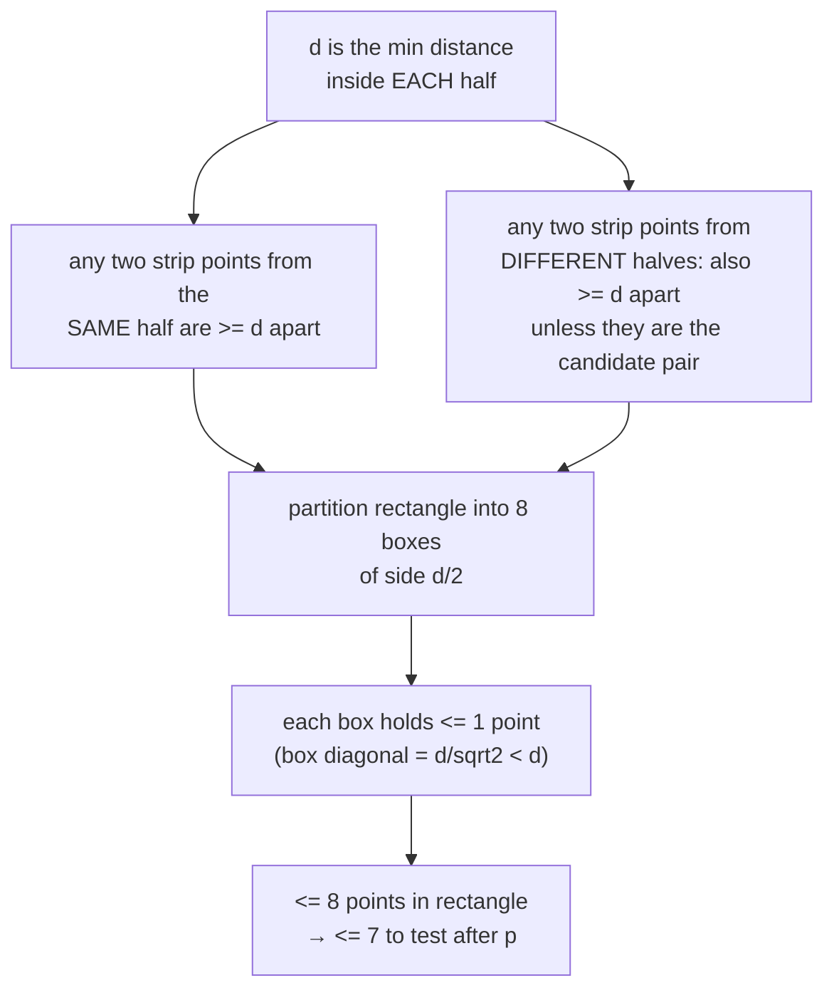

The constant is sometimes stated as 7, sometimes as 15 depending on whether you scan both above and
below or include boundary slack — the point is it is a **fixed constant independent of $n$**. That is
what collapses the combine step from $O(n^2)$ to $O(n)$ and gives the overall recurrence
$$
T(n) = 2\,T(n/2) + O(n) = O(n \log n).
$$

---

## 6. Sweep-Line with an Ordered Set

A second, often shorter, $O(n \log n)$ method sweeps a vertical line left to right. We keep the
**current best distance** $d$ and an **active set** of points whose $x$ falls within $d$ of the
sweep line, stored in a balanced BST **ordered by $y$** (`sorted containers` / `std::set`).

For each new point $p$ (processed in increasing $x$):

1. **Evict** from the set every point whose $x$ is more than $d$ to the left of $p_x$ — they can
   never form a pair closer than the current $d$ again.
2. **Query** the set for points with $y \in [p_y - d, p_y + d]$ (a contiguous range, since the set
   is ordered by $y$). Only those few can beat $d$ — the same strip argument, so it is $O(1)$
   amortized per point.
3. **Update** $d$ if any of them is closer, then **insert** $p$.

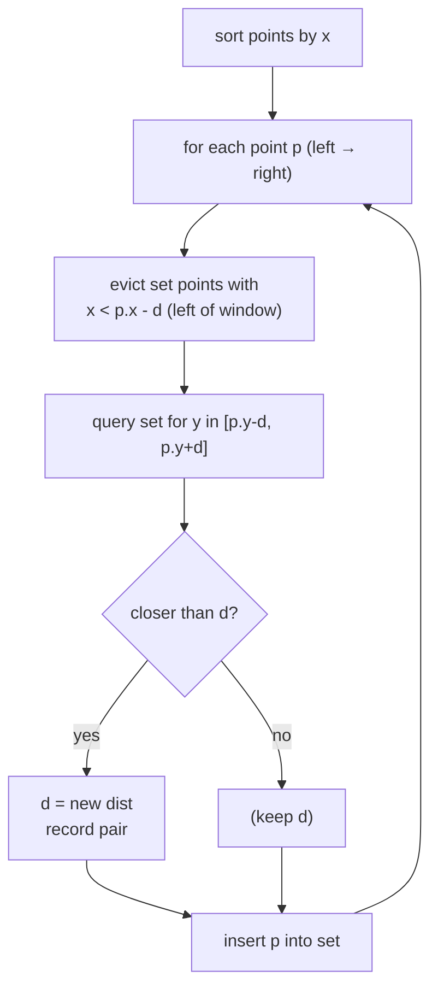

The active set is a moving window of width $d$ following the sweep line:

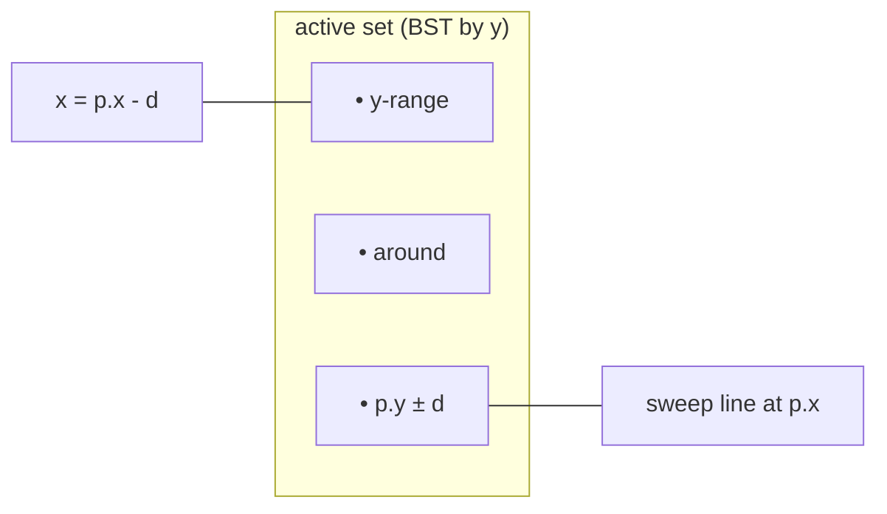

```python
from sortedcontainers import SortedList

def closest_sweep(pts: List[Point]) -> Tuple[int, Point, Point]:
    P = sorted(pts, key=lambda p: (p.x, p.y))
    n = len(P)
    if n < 2:
        return math.inf, None, None

    best = dist2(P[0], P[1])
    ba, bb = P[0], P[1]
    active = SortedList(key=lambda p: p.y)   # ordered by y
    active.add(P[0]); active.add(P[1])
    left = 0
    import math as _m

    for i in range(2, n):
        p = P[i]
        d = _m.isqrt(best) + 1               # window half-width (integer)
        # evict points too far to the left
        while left < i and P[left].x < p.x - d:
            active.remove(P[left])
            left += 1
        # query y-window [p.y - d, p.y + d]
        lo = active.bisect_key_left(p.y - d)
        hi = active.bisect_key_right(p.y + d)
        for k in range(lo, hi):
            q = active[k]
            dd = dist2(p, q)
            if dd < best:
                best, ba, bb = dd, p, q
        active.add(p)
    return best, ba, bb
```

```cpp
struct Result2 { long long best; Point a, b; };

Result2 closestSweep(vector<Point> pts) {
    sort(pts.begin(), pts.end(), [](const Point &p, const Point &q){
        return p.x != q.x ? p.x < q.x : p.y < q.y;
    });
    int n = (int)pts.size();
    Result2 res{LLONG_MAX, {}, {}};
    if (n < 2) return res;

    // set ordered by (y, x) so equal-y points coexist
    auto cmp = [](const Point &p, const Point &q){
        return p.y != q.y ? p.y < q.y : p.x < q.x;
    };
    set<Point, decltype(cmp)> active(cmp);
    res.best = dist2(pts[0], pts[1]); res.a = pts[0]; res.b = pts[1];
    active.insert(pts[0]); active.insert(pts[1]);
    int left = 0;

    for (int i = 2; i < n; ++i) {
        Point p = pts[i];
        long long d = (long long)sqrtl((long double)res.best) + 1; // window half-width
        // evict points too far left
        while (left < i && pts[left].x < p.x - d) {
            active.erase(pts[left]);
            ++left;
        }
        // query y-window [p.y - d, p.y + d]
        auto lo = active.lower_bound(Point{LLONG_MIN, p.y - d});
        auto hi = active.upper_bound(Point{LLONG_MAX, p.y + d});
        for (auto it = lo; it != hi; ++it) {
            long long dd = dist2(p, *it);
            if (dd < res.best) { res.best = dd; res.a = p; res.b = *it; }
        }
        active.insert(p);
    }
    return res;                              // best is SQUARED distance
}
```

> Note on the window half-width: because we compare **squared** distances, we shrink the window by an
> integer $d = \lfloor\sqrt{\text{best}}\rfloor + 1$ so we never miss a true neighbour. Pruning is by
> the integer bound; acceptance is by the exact squared comparison.

---

## 7. Squared vs Real Distance

Every comparison above is between **squared** distances, which keeps arithmetic exact (integers) and
avoids slow, imprecise `sqrt`. The actual minimum distance is just $\sqrt{\text{best}}$, computed once
at the end if the problem asks for a real number.

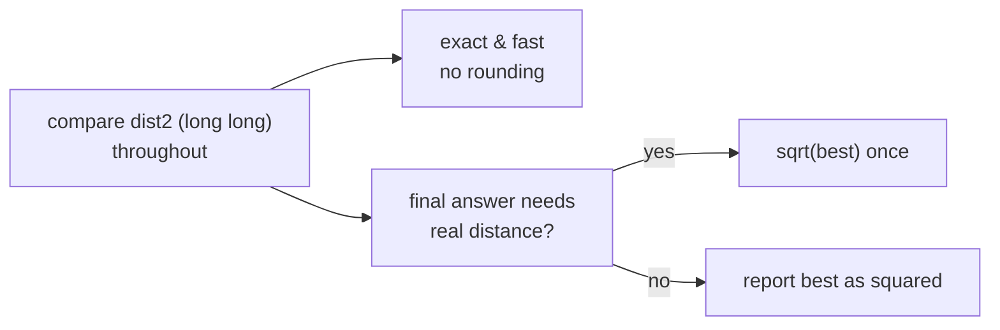

```python
def real_distance(best_sq: int) -> float:
    return math.sqrt(best_sq)
```

```cpp
double realDistance(long long bestSq) {
    return sqrt((double)bestSq);
}
```

---

## 8. Complexity Summary

| Algorithm | Time | Space | Notes |
|-----------|------|-------|-------|
| Brute force | $O(n^2)$ | $O(1)$ | great oracle / for $n \le 5000$ |
| Divide & conquer | $O(n \log n)$ | $O(n)$ | merge $y$-order on the way up |
| Sweep + ordered set | $O(n \log n)$ | $O(n)$ | window of width $d$ in a BST |

The recurrence for divide & conquer is $T(n) = 2T(n/2) + O(n) = O(n \log n)$ because the strip
combine is linear thanks to the constant-neighbour bound. The sweep does $O(n)$ ordered-set
operations, each $O(\log n)$.

---

## 9. Common Pitfalls

- **Strip not sorted by $y$.** The 7-neighbour shortcut only works when the strip is processed in
  increasing $y$. Sorting it by $x$ (or not at all) breaks the bound and silently misses pairs.
- **Mixing squared and real distance.** If you prune with squared distance, compare with squared
  distance everywhere. Never test `dist2 < d` against a non-squared `d`.
- **Duplicate points.** Two identical points have distance $0$. Use a comparator/`set` ordered by
  $(y, x)$ (sweep) so equal-$y$ points coexist, and let the base case / brute force catch the zero.
- **Base case too large or too small.** Recurse down to $\le 3$ points and brute-force them; a base
  of 1 loses pairs, and forgetting the base causes infinite recursion when the split does not shrink.
- **Re-sorting every level.** Sorting the strip by $y$ from scratch at each level gives
  $O(n \log^2 n)$. Merge the $y$-sorted halves instead for clean $O(n \log n)$.
- **Integer overflow.** Squared distances reach $\sim 2\times 10^{18}$; always use `long long`.

---

## 10. Patterns

- **"Closest / nearest pair among $n$ points"** → divide & conquer or sweep, $O(n \log n)$.
- **"Combine step looks $O(n^2)$ but geometry bounds neighbours"** → strip / window with a constant
  per-point neighbour count; the same idea powers many sweep-line problems.
- **"Minimize a distance / radius / spread"** → compare squared quantities, take the root once at the
  end.
- **"Need an oracle to validate a fast geometry routine"** → keep the $O(n^2)$ brute force and
  stress-test against it on random small inputs.
- **"Ordered window following a sweep"** → balanced BST (`std::set` / `SortedList`) keyed by the sweep
  axis, evicting stale entries — reusable for segment, interval, and nearest-neighbour sweeps.
