# Line Sweep for Geometry

Imagine a vertical **sweep line** that starts at $x = -\infty$ and glides rightward across the
plane. Nothing interesting happens in the empty gaps between the geometry — the picture only
*changes* at a finite number of special $x$-coordinates: the left/right end of a rectangle, the
endpoints of a segment, a query position. Those special coordinates are the **events**. We sort
the events by $x$ and process them left to right, and as the line moves we keep an ordered
**active set** (a *status structure*) describing exactly what the sweep line is currently
crossing. The whole family of "geometry that looks $O(n^2)$" problems collapses to
$O((n + k) \log n)$ once you think in events + active set.

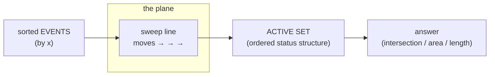

The two moving parts are always the same:

- an **event queue** — the things that happen, sorted by the sweep coordinate, and
- a **status structure** — usually a balanced BST (`std::set` / Python `SortedList`) holding
  the objects currently intersected by the line, ordered along the *other* axis.

---

## Table of Contents

1. [The Event-Driven Paradigm](#the-event-driven-paradigm)
2. [The Active-Set Status Structure](#the-active-set-status-structure)
3. [Bentley–Ottmann: Segment Intersection Detection](#bentleyottmann-segment-intersection-detection)
4. [Detect If Any Two Segments Intersect (Shamos–Hoey)](#detect-if-any-two-segments-intersect-shamoshoey)
5. [Union of 1D Intervals (Total Covered Length)](#union-of-1d-intervals-total-covered-length)
6. [Measure of the Union of Rectangles (Klee's Algorithm)](#measure-of-the-union-of-rectangles-klees-algorithm)
7. [Counting Points in Rectangles / Overlapping Intervals](#counting-points-in-rectangles--overlapping-intervals)
8. [The Skyline Problem](#the-skyline-problem)
9. [Complexity Summary](#complexity-summary)
10. [Common Pitfalls](#common-pitfalls)
11. [Patterns](#patterns)

---

## The Event-Driven Paradigm

An **event** is a point on the sweep axis where the active set must change or be queried. For an
axis-aligned-rectangle sweep, each rectangle $[x_1, x_2] \times [y_1, y_2]$ contributes two
events: an **insertion** at $x_1$ (the $y$-interval $[y_1, y_2]$ becomes active) and a
**deletion** at $x_2$ (it leaves). For a segment sweep each segment contributes a **start**
event at its smaller $x$ and an **end** event at its larger $x$.

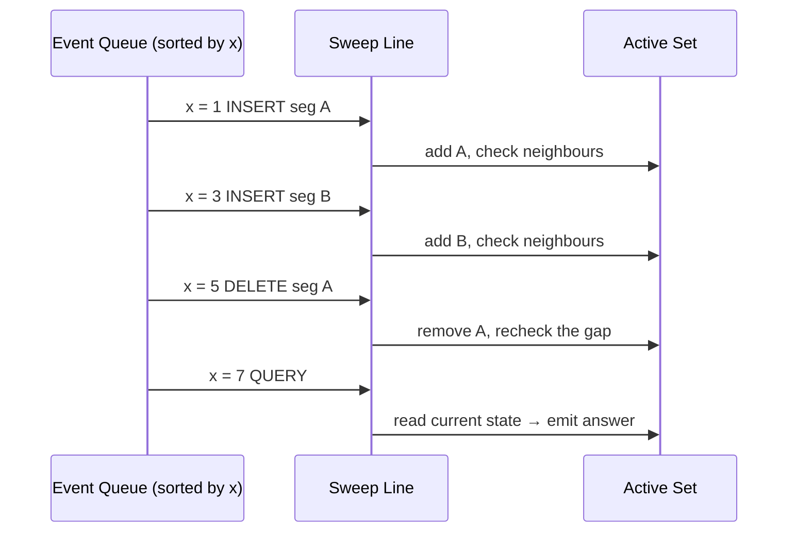

The contract is simple: **everything to the left of the sweep line is fully decided; everything
to the right has not been touched yet.** We only ever look at the active set, which is small and
local, instead of comparing all $\binom{n}{2}$ pairs.

A generic event has a sort key and a type. Tie-breaking on equal $x$ matters a great deal (see
[Common Pitfalls](#common-pitfalls)); a typical rule processes insertions before deletions, or
deletions before insertions, depending on whether touching counts as overlap.

```python
from dataclasses import dataclass

# A generic sweep event: sort by (x, type_priority).
@dataclass(order=True)
class Event:
    x: int            # sweep coordinate
    kind: int         # 0 = enter, 1 = query, 2 = leave (tune the order!)
    payload: int = 0  # index into the geometry

def make_events(intervals):
    ev = []
    for i, (x1, x2) in enumerate(intervals):
        ev.append(Event(x1, 0, i))   # enter
        ev.append(Event(x2, 2, i))   # leave
    ev.sort()
    return ev
```

```cpp
#include <bits/stdc++.h>
using namespace std;

// A generic sweep event: sort by (x, kind).
struct Event {
    long long x;       // sweep coordinate
    int kind;          // 0 = enter, 1 = query, 2 = leave (tune the order!)
    int payload;       // index into the geometry
    bool operator<(const Event& o) const {
        if (x != o.x) return x < o.x;
        return kind < o.kind;
    }
};

vector<Event> make_events(const vector<pair<long long,long long>>& intervals) {
    vector<Event> ev;
    for (int i = 0; i < (int)intervals.size(); i++) {
        ev.push_back({intervals[i].first,  0, i});  // enter
        ev.push_back({intervals[i].second, 2, i});  // leave
    }
    sort(ev.begin(), ev.end());
    return ev;
}
```

---

## The Active-Set Status Structure

The active set holds the objects the sweep line currently crosses, **ordered by the second
coordinate** (the $y$-order in which the line meets them). A balanced BST gives us $O(\log n)$
insert, erase, and — crucially — *predecessor / successor* queries, so we can ask "who is
directly above and below the thing I just inserted?".

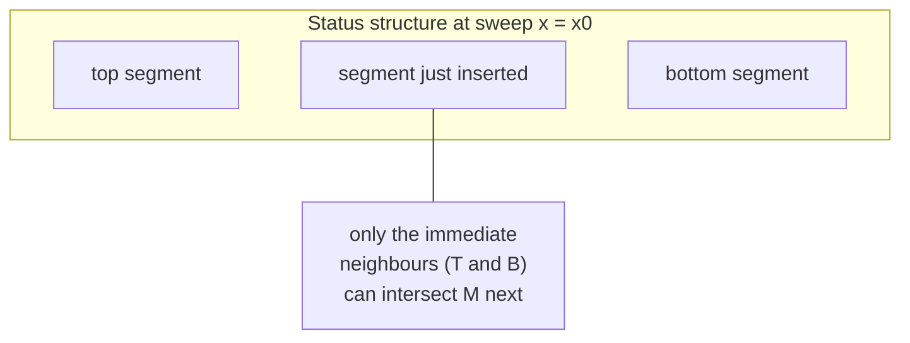

When we insert an object we only compare it with its **immediate neighbours** in $y$-order;
when we delete an object its former neighbours become adjacent and must be compared to each
other. That locality is the entire reason the sweep is fast.

```python
from sortedcontainers import SortedList

# The status structure ordered by current y at the sweep line.
status = SortedList()           # holds (y_at_sweep, object_id)

def insert_and_neighbours(item):
    status.add(item)
    i = status.index(item)
    below = status[i - 1] if i > 0 else None
    above = status[i + 1] if i + 1 < len(status) else None
    return below, above         # only these can interact with `item`
```

```cpp
#include <bits/stdc++.h>
using namespace std;

// The status structure ordered by current y at the sweep line.
set<pair<double,int>> status;   // holds {y_at_sweep, object_id}

// Returns iterators to the below/above neighbours of the inserted item.
pair<set<pair<double,int>>::iterator,
     set<pair<double,int>>::iterator>
insert_and_neighbours(pair<double,int> item) {
    auto it = status.insert(item).first;
    auto below = (it == status.begin()) ? status.end() : prev(it);
    auto above = next(it);
    return {below, above};      // only these can interact with `item`
}
```

---

## Bentley–Ottmann: Segment Intersection Detection

The full **Bentley–Ottmann** algorithm reports *all* $k$ intersections among $n$ segments in
$O((n + k) \log n)$. The key insight: **two segments can intersect only while they are adjacent
in the $y$-order of the status structure.** Just before they cross they must become neighbours,
so we never have to test non-adjacent pairs.

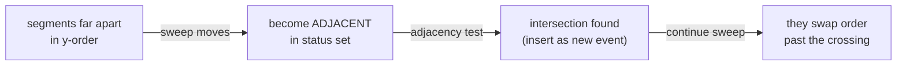

Three event kinds drive it:

| Event | Action on the status set |
|-------|--------------------------|
| **left endpoint** | insert the segment; test it against its new above/below neighbours |
| **right endpoint** | erase the segment; test its (now adjacent) former neighbours against each other |
| **intersection** | swap the two segments' order; test each against its new outer neighbour |

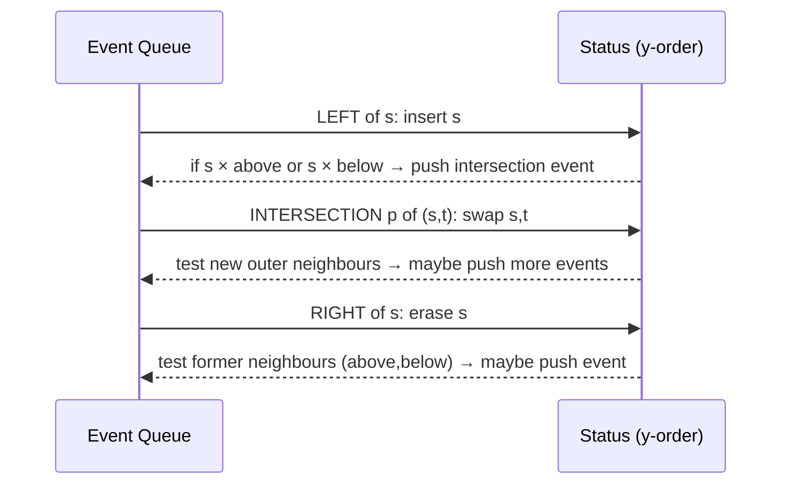

For the simpler **decision** version — "does *any* pair intersect?" — we do not need the
intersection events at all; we stop at the first adjacent pair that crosses. That is the
**Shamos–Hoey** algorithm below.

---

## Detect If Any Two Segments Intersect (Shamos–Hoey)

We sweep left to right. At a segment's left endpoint we insert it (keyed by its $y$ at the
sweep) and test it only against the segment directly above and directly below. At a right
endpoint we erase it and test the two segments it leaves adjacent. The first crossing we find
answers "yes".

```python
from sortedcontainers import SortedList

def sgn(v):
    return (v > 0) - (v < 0)

def cross(ox, oy, ax, ay, bx, by):
    return (ax - ox) * (by - oy) - (ay - oy) * (bx - ox)

def seg_intersect(s1, s2):
    (ax, ay), (bx, by) = s1
    (cx, cy), (dx, dy) = s2
    d1 = sgn(cross(cx, cy, dx, dy, ax, ay))
    d2 = sgn(cross(cx, cy, dx, dy, bx, by))
    d3 = sgn(cross(ax, ay, bx, by, cx, cy))
    d4 = sgn(cross(ax, ay, bx, by, dx, dy))
    if d1 != d2 and d3 != d4:
        return True
    def on(px, py, qx, qy, rx, ry):
        return min(px, qx) <= rx <= max(px, qx) and min(py, qy) <= ry <= max(py, qy)
    if d1 == 0 and on(cx, cy, dx, dy, ax, ay): return True
    if d2 == 0 and on(cx, cy, dx, dy, bx, by): return True
    if d3 == 0 and on(ax, ay, bx, by, cx, cy): return True
    if d4 == 0 and on(ax, ay, bx, by, dx, dy): return True
    return False

def any_intersection(segments):
    # Normalize so each segment goes left → right.
    segs = [tuple(sorted(s)) for s in segments]
    events = []
    for i, ((x1, y1), (x2, y2)) in enumerate(segs):
        events.append((x1, 0, i))   # left endpoint
        events.append((x2, 1, i))   # right endpoint
    events.sort()

    def ykey(i, x):
        (x1, y1), (x2, y2) = segs[i]
        if x1 == x2:
            return float(y1)
        return y1 + (y2 - y1) * (x - x1) / (x2 - x1)

    status = SortedList()
    for x, kind, i in events:
        if kind == 0:                       # insert
            key = (ykey(i, x), i)
            status.add(key)
            pos = status.index(key)
            for j in (pos - 1, pos + 1):
                if 0 <= j < len(status) and seg_intersect(segs[i], segs[status[j][1]]):
                    return True
        else:                               # erase
            key = (ykey(i, x), i)
            pos = status.index(key)
            below = status[pos - 1] if pos > 0 else None
            above = status[pos + 1] if pos + 1 < len(status) else None
            status.remove(key)
            if below and above and seg_intersect(segs[below[1]], segs[above[1]]):
                return True
    return False
```

```cpp
#include <bits/stdc++.h>
using namespace std;

int sgn(long long v) { return (v > 0) - (v < 0); }

long long cross(long long ox, long long oy, long long ax, long long ay,
                long long bx, long long by) {
    return (ax - ox) * (by - oy) - (ay - oy) * (bx - ox);
}

struct Seg { long long x1, y1, x2, y2; };

bool on_box(long long px, long long py, long long qx, long long qy,
            long long rx, long long ry) {
    return min(px, qx) <= rx && rx <= max(px, qx) &&
           min(py, qy) <= ry && ry <= max(py, qy);
}

bool seg_intersect(const Seg& s, const Seg& t) {
    int d1 = sgn(cross(t.x1, t.y1, t.x2, t.y2, s.x1, s.y1));
    int d2 = sgn(cross(t.x1, t.y1, t.x2, t.y2, s.x2, s.y2));
    int d3 = sgn(cross(s.x1, s.y1, s.x2, s.y2, t.x1, t.y1));
    int d4 = sgn(cross(s.x1, s.y1, s.x2, s.y2, t.x2, t.y2));
    if (d1 != d2 && d3 != d4) return true;
    if (d1 == 0 && on_box(t.x1, t.y1, t.x2, t.y2, s.x1, s.y1)) return true;
    if (d2 == 0 && on_box(t.x1, t.y1, t.x2, t.y2, s.x2, s.y2)) return true;
    if (d3 == 0 && on_box(s.x1, s.y1, s.x2, s.y2, t.x1, t.y1)) return true;
    if (d4 == 0 && on_box(s.x1, s.y1, s.x2, s.y2, t.x2, t.y2)) return true;
    return false;
}

bool any_intersection(vector<Seg> segs) {
    for (auto& s : segs)
        if (make_pair(s.x1, s.y1) > make_pair(s.x2, s.y2))
            swap(s.x1, s.x2), swap(s.y1, s.y2);

    struct Ev { long long x; int kind, i; };
    vector<Ev> events;
    for (int i = 0; i < (int)segs.size(); i++) {
        events.push_back({segs[i].x1, 0, i});
        events.push_back({segs[i].x2, 1, i});
    }
    sort(events.begin(), events.end(), [](const Ev& a, const Ev& b) {
        if (a.x != b.x) return a.x < b.x;
        return a.kind < b.kind;
    });

    long long sweep = 0;
    auto ykey = [&](int i) -> double {
        const Seg& g = segs[i];
        if (g.x1 == g.x2) return (double)g.y1;
        return g.y1 + (double)(g.y2 - g.y1) * (sweep - g.x1) / (g.x2 - g.x1);
    };

    set<pair<double,int>> status;
    for (auto& e : events) {
        sweep = e.x;
        if (e.kind == 0) {
            auto it = status.insert({ykey(e.i), e.i}).first;
            if (it != status.begin() &&
                seg_intersect(segs[e.i], segs[prev(it)->second])) return true;
            if (next(it) != status.end() &&
                seg_intersect(segs[e.i], segs[next(it)->second])) return true;
        } else {
            auto it = status.find({ykey(e.i), e.i});
            if (it != status.end()) {
                auto below = (it == status.begin()) ? status.end() : prev(it);
                auto above = next(it);
                if (below != status.end() && above != status.end() &&
                    seg_intersect(segs[below->second], segs[above->second]))
                    return true;
                status.erase(it);
            }
        }
    }
    return false;
}
```

The sweep visits $2n$ events; each does $O(\log n)$ BST work and a constant number of segment
tests, giving $O(n \log n)$ — a huge win over the $O(n^2)$ brute force of all pairs.

---

## Union of 1D Intervals (Total Covered Length)

The simplest sweep of all. To find the total length covered by a set of 1D intervals
$[l_i, r_i]$, turn each into a $+1$ event at $l_i$ and a $-1$ event at $r_i$. Sweep along $x$,
maintain a running **coverage counter**, and whenever the counter is positive, the stretch from
the previous event to the current one is covered.

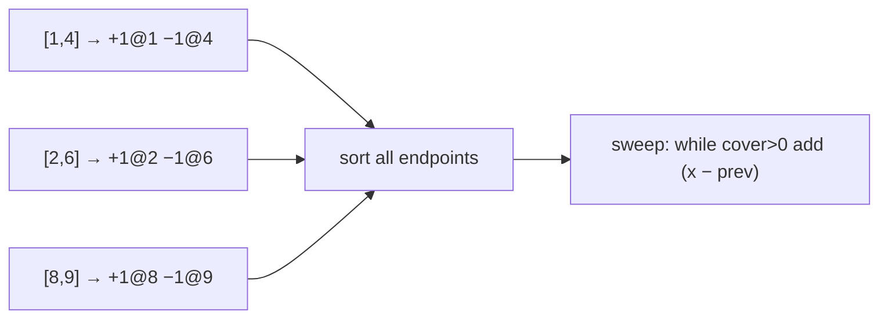

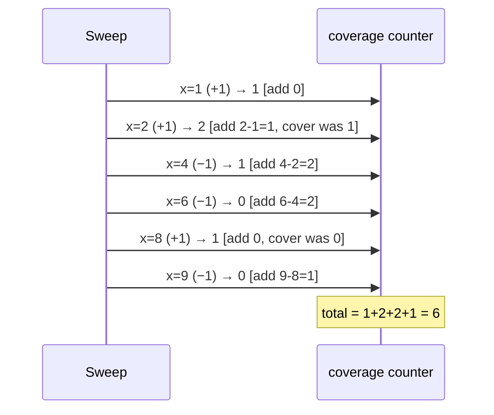

```python
def union_length(intervals):
    events = []
    for l, r in intervals:
        events.append((l, +1))
        events.append((r, -1))
    events.sort()

    cover = 0
    prev_x = None
    total = 0
    for x, delta in events:
        if cover > 0:
            total += x - prev_x       # this stretch was covered
        cover += delta
        prev_x = x
    return total
```

```cpp
#include <bits/stdc++.h>
using namespace std;

long long union_length(vector<pair<long long,long long>> intervals) {
    vector<pair<long long,int>> events;
    for (auto& [l, r] : intervals) {
        events.push_back({l, +1});
        events.push_back({r, -1});
    }
    sort(events.begin(), events.end());

    long long cover = 0, prev_x = 0, total = 0;
    bool started = false;
    for (auto& [x, delta] : events) {
        if (cover > 0 && started) total += x - prev_x;  // covered stretch
        cover += delta;
        prev_x = x;
        started = true;
    }
    return total;
}
```

The same $+1 / -1$ trick — counting how deep the overlap is — generalizes directly to the
$y$-axis inside the rectangle-union sweep below.

---

## Measure of the Union of Rectangles (Klee's Algorithm)

**Klee's measure problem** in 2D: given $n$ axis-aligned rectangles, find the area of their
union. We sweep a vertical line left to right. Between two consecutive vertical event lines the
set of active rectangles is fixed, so the cross-section the sweep line cuts is a fixed union of
$y$-intervals. The contribution of that vertical *slab* is

$$
\text{slab area} = (\text{covered } y\text{-length}) \times (x_{\text{next}} - x_{\text{cur}}).
$$

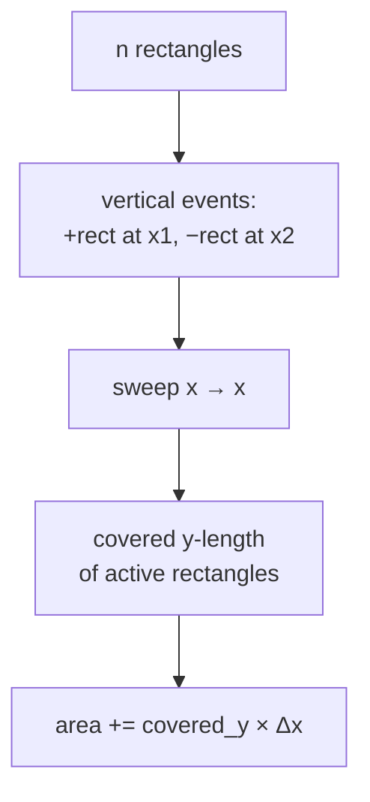

The picture is a stack of vertical **slabs**; each slab's height is the measure of the union of
the active $y$-intervals (computed with the same $+1 / -1$ coverage idea, or a segment tree):

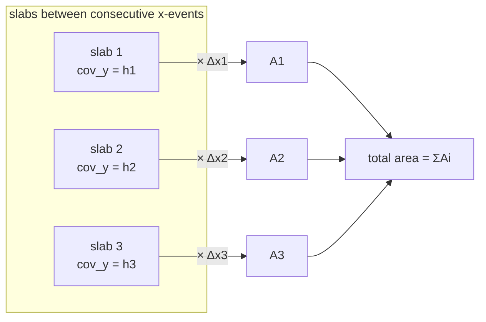

With **coordinate compression** on the $y$-coordinates, each slab's covered length is computed
in $O(n)$ (or $O(\log n)$ with a segment tree), giving an overall $O(n^2)$ simple version or
$O(n \log n)$ with the tree. Here is the clean compression version:

```python
def rectangle_union_area(rects):
    # rects: list of (x1, y1, x2, y2)
    xs = sorted({x for x1, y1, x2, y2 in rects for x in (x1, x2)})
    x_index = {x: i for i, x in enumerate(xs)}

    # For each x-strip, collect active y-intervals via a +1/-1 sweep in y.
    # Build vertical events: at x1 add y-interval, at x2 remove it.
    add = [[] for _ in xs]
    rem = [[] for _ in xs]
    for x1, y1, x2, y2 in rects:
        add[x_index[x1]].append((y1, y2))
        rem[x_index[x2]].append((y1, y2))

    from collections import Counter
    active = Counter()
    total = 0
    for i in range(len(xs) - 1):
        for iv in add[i]:
            active[iv] += 1
        for iv in rem[i]:
            active[iv] -= 1
            if active[iv] == 0:
                del active[iv]
        # covered y-length of the currently active intervals
        ys = []
        for (y1, y2), c in active.items():
            ys.append((y1, +1))
            ys.append((y2, -1))
        ys.sort()
        cover = 0
        prev_y = None
        cov_len = 0
        for y, d in ys:
            if cover > 0:
                cov_len += y - prev_y
            cover += d
            prev_y = y
        total += cov_len * (xs[i + 1] - xs[i])
    return total
```

```cpp
#include <bits/stdc++.h>
using namespace std;

struct Rect { long long x1, y1, x2, y2; };

long long rectangle_union_area(vector<Rect> rects) {
    vector<long long> xs;
    for (auto& r : rects) { xs.push_back(r.x1); xs.push_back(r.x2); }
    sort(xs.begin(), xs.end());
    xs.erase(unique(xs.begin(), xs.end()), xs.end());
    auto xidx = [&](long long x) {
        return (int)(lower_bound(xs.begin(), xs.end(), x) - xs.begin());
    };

    int m = xs.size();
    vector<vector<pair<long long,long long>>> add(m), rem(m);
    for (auto& r : rects) {
        add[xidx(r.x1)].push_back({r.y1, r.y2});
        rem[xidx(r.x2)].push_back({r.y1, r.y2});
    }

    map<pair<long long,long long>, int> active;
    long long total = 0;
    for (int i = 0; i + 1 < m; i++) {
        for (auto& iv : add[i]) active[iv]++;
        for (auto& iv : rem[i]) {
            if (--active[iv] == 0) active.erase(iv);
        }
        // covered y-length of currently active intervals
        vector<pair<long long,int>> ys;
        for (auto& [iv, c] : active) {
            ys.push_back({iv.first, +1});
            ys.push_back({iv.second, -1});
        }
        sort(ys.begin(), ys.end());
        long long cover = 0, prev_y = 0, cov_len = 0;
        bool started = false;
        for (auto& [y, d] : ys) {
            if (cover > 0 && started) cov_len += y - prev_y;
            cover += d;
            prev_y = y;
            started = true;
        }
        total += cov_len * (xs[i + 1] - xs[i]);
    }
    return total;
}
```

This is exactly the engine behind LeetCode 850; the production version swaps the per-slab linear
scan for a **segment tree** keyed on compressed $y$-coordinates to reach $O(n \log n)$.

---

## Counting Points in Rectangles / Overlapping Intervals

Sweeps also answer **counting** queries offline. To count, for each query rectangle, how many of
$n$ given points it contains, decompose each rectangle query into two prefix queries (a 2D
prefix-sum trick) and process *points* and *query edges* as events sorted by $x$, using a
**Binary Indexed Tree (BIT)** over compressed $y$ as the status structure.

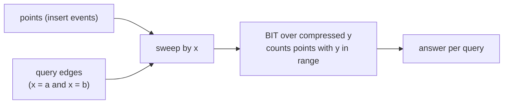

The "max number of overlapping intervals at once" is an even smaller sweep: $+1$ on each start,
$-1$ on each end, and track the running maximum of the coverage counter.

```python
def max_overlap(intervals):
    events = []
    for l, r in intervals:
        events.append((l, +1))   # start increases overlap
        events.append((r, -1))   # end decreases overlap
    # On ties, process −1 before +1 if touching does NOT count as overlap.
    events.sort(key=lambda e: (e[0], e[1]))
    cur = best = 0
    for _, d in events:
        cur += d
        best = max(best, cur)
    return best
```

```cpp
#include <bits/stdc++.h>
using namespace std;

int max_overlap(vector<pair<long long,long long>> intervals) {
    vector<pair<long long,int>> events;
    for (auto& [l, r] : intervals) {
        events.push_back({l, +1});  // start increases overlap
        events.push_back({r, -1});  // end decreases overlap
    }
    // On ties, (+1 sorts after −1) since -1 < +1: end processed first.
    sort(events.begin(), events.end());
    int cur = 0, best = 0;
    for (auto& [x, d] : events) {
        cur += d;
        best = max(best, cur);
    }
    return best;
}
```

---

## The Skyline Problem

The **skyline** (LeetCode 218) is a sweep where each building $[L, R, H]$ becomes an *enter*
event at $L$ that adds height $H$ to a max-heap / multiset and a *leave* event at $R$ that
removes it. Whenever the current maximum active height changes, we emit a key point.

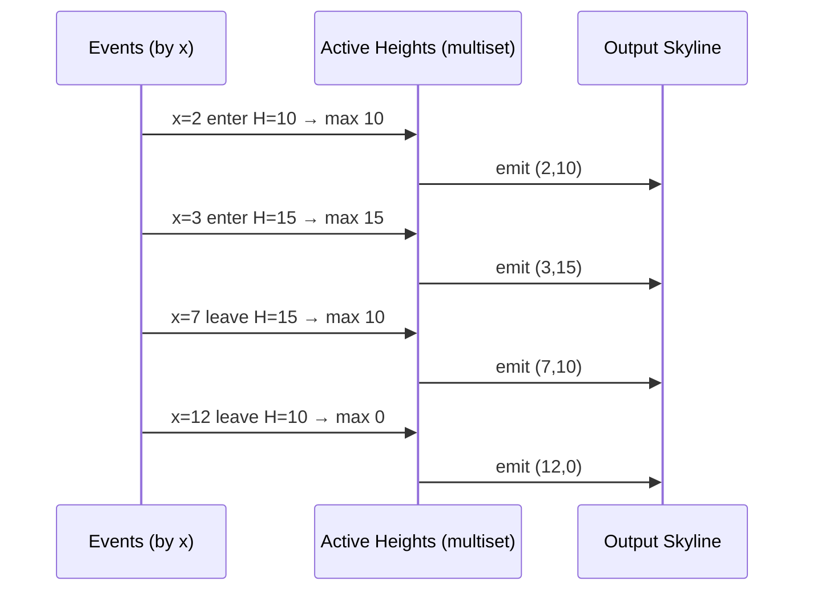

```python
import heapq

def get_skyline(buildings):
    events = []
    for L, R, H in buildings:
        events.append((L, -H, R))   # enter (negative height = max-heap)
        events.append((R, 0, 0))    # leave marker
    events.sort()

    result = []
    live = [(0, float('inf'))]      # (−height, end)
    prev_max = 0
    for x, negH, R in events:
        while live[0][1] <= x:      # drop buildings that ended
            heapq.heappop(live)
        if negH:                    # enter event
            heapq.heappush(live, (negH, R))
        cur_max = -live[0][0]
        if cur_max != prev_max:
            result.append([x, cur_max])
            prev_max = cur_max
    return result
```

```cpp
#include <bits/stdc++.h>
using namespace std;

vector<vector<long long>> get_skyline(vector<array<long long,3>> buildings) {
    vector<array<long long,3>> events;
    for (auto& b : buildings) {
        events.push_back({b[0], -b[2], b[1]});  // enter (neg height)
        events.push_back({b[1], 0, 0});         // leave marker
    }
    sort(events.begin(), events.end());

    vector<vector<long long>> result;
    priority_queue<pair<long long,long long>> live;  // {height, end}
    live.push({0, LLONG_MAX});
    long long prev_max = 0;
    for (auto& e : events) {
        long long x = e[0], negH = e[1], R = e[2];
        while (live.top().second <= x) live.pop();   // lazily drop ended
        if (negH) live.push({-negH, R});             // enter event
        long long cur_max = live.top().first;
        if (cur_max != prev_max) {
            result.push_back({x, cur_max});
            prev_max = cur_max;
        }
    }
    return result;
}
```

---

## Complexity Summary

| Task | Status structure | Time | Space |
|------|------------------|------|-------|
| Any two segments intersect (Shamos–Hoey) | balanced BST | $O(n \log n)$ | $O(n)$ |
| Report all $k$ intersections (Bentley–Ottmann) | balanced BST + event PQ | $O((n + k) \log n)$ | $O(n + k)$ |
| Union length of 1D intervals | sorted events + counter | $O(n \log n)$ | $O(n)$ |
| Union area of rectangles (compression) | coverage counter | $O(n^2)$ | $O(n)$ |
| Union area of rectangles (segment tree) | segment tree on $y$ | $O(n \log n)$ | $O(n)$ |
| Max overlapping intervals | coverage counter | $O(n \log n)$ | $O(n)$ |
| Skyline | max-heap / multiset | $O(n \log n)$ | $O(n)$ |
| Offline points-in-rectangles | BIT over compressed $y$ | $O((n + q) \log n)$ | $O(n + q)$ |

The recurring shape is $O((n + k) \log n)$: a $\log$ for the ordered status structure, times the
number of events (and reported answers $k$).

---

## Common Pitfalls

- **Event tie-breaking.** When two events share an $x$, the *type order* changes the answer. For
  interval union where touching counts as joined, process $+1$ (enter) before $-1$ (leave). For
  "maximum simultaneous overlap" where a point shared by an ending and a starting interval should
  *not* count twice, process $-1$ before $+1$. Decide this deliberately, not by accident.
- **Open vs closed endpoints.** Whether $[1,3]$ and $[3,5]$ "overlap" at $x = 3$ is a problem
  choice. Encode it in the tie-break, and be consistent across both axes in a 2D sweep.
- **The status-set comparator.** Segments must be ordered by their $y$ **at the current sweep
  $x$**, not by a fixed key. A stale comparator silently corrupts the BST ordering. Recompute the
  key at insertion/erase time, and never mutate keys of elements already in the set.
- **Floating point in the comparator.** Use an `EPS` (e.g. `const double EPS = 1e-9`) when
  comparing sweep $y$-values, or keep the cross-product comparison in integers where possible.
- **Erasing by recomputed key.** In C++ `set`, finding the element to erase by recomputing its
  $y$-at-sweep can miss it if the sweep moved; erase using the same key you inserted with, or
  store the iterator.
- **Forgetting the last slab.** In a rectangle sweep, area accumulates *between* consecutive
  events; loop to `m - 1` and always multiply by `xs[i+1] - xs[i]`.

---

## Patterns

- **Decompose geometry into events on one axis, keep an ordered set on the other.** That single
  sentence is 90% of computational-geometry sweeps.
- **`+1 / -1` coverage** counts overlap depth and gives union length/area for free.
- **Only immediate neighbours interact** — exploit predecessor/successor of a balanced BST.
- **Coordinate-compress** the off-axis when values are large but few; pair with a **segment
  tree** or **BIT** for $O(\log n)$ slab updates.
- When you see "do any of these cross / overlap?", "total covered length/area", "how many at
  once", or "outline / skyline", reach for a sweep before considering $O(n^2)$.
