# Rotating Calipers — Diameter, Width & Enclosing Rectangles (Complete Guide)

> Imagine clamping a **caliper** (two parallel jaws) onto a convex polygon, then *rolling* the jaws
> all the way around the boundary. At every moment the two jaws are **parallel support lines** that
> touch the polygon. As one jaw slides along an edge, the opposite jaw pivots on its **antipodal**
> vertex. By rotating this pair of parallel lines through a full turn we visit every "opposite" pair
> exactly once, answering **diameter** (farthest pair), **width** (closest parallel lines), and
> **minimum-area enclosing rectangle** questions in $O(n)$ time — *after* an $O(n \log n)$ convex hull.

---

## Table of Contents
1. [Prerequisite: the Convex Hull](#1-prerequisite-the-convex-hull)
2. [Support Lines and the Caliper Picture](#2-support-lines-and-the-caliper-picture)
3. [Antipodal Pairs](#3-antipodal-pairs)
4. [The Diameter (Farthest Pair)](#4-the-diameter-farthest-pair)
5. [Minimum Width of a Convex Polygon](#5-minimum-width-of-a-convex-polygon)
6. [Minimum-Area Enclosing Rectangle](#6-minimum-area-enclosing-rectangle)
7. [Maximum Distance Between Two Convex Polygons](#7-maximum-distance-between-two-convex-polygons)
8. [Why the Two-Pointer Advance is O(n)](#8-why-the-two-pointer-advance-is-on)
9. [Complexity Summary](#9-complexity-summary)
10. [Common Pitfalls](#10-common-pitfalls)
11. [Patterns](#11-patterns)

---

## 1. Prerequisite: the Convex Hull

Rotating calipers operates on a **convex polygon given in order** (we use counter-clockwise, CCW).
For a raw point set you first build the convex hull; for a polygon already known to be convex you can
feed it directly. Either way the algorithm needs the boundary vertices in rotational order so the two
jaws can "roll" monotonically.

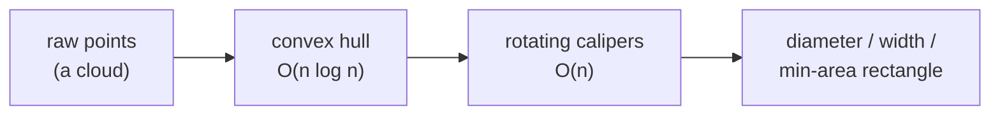

We reuse the integer **cross product** (twice the signed triangle area) as our only geometric engine,
and a **monotone chain** hull. Everything stays in integers until a final length/area needs a square
root or division, which keeps the comparisons **exact**.

$$
\operatorname{cross}(O, A, B) = (A_x - O_x)(B_y - O_y) - (A_y - O_y)(B_x - O_x).
$$

```python
class Point:
    __slots__ = ("x", "y")
    def __init__(self, x, y):
        self.x = x
        self.y = y

def cross(o, a, b):
    # (a - o) x (b - o); >0 CCW, <0 CW, =0 collinear. Equals 2*signed area of triangle OAB.
    return (a.x - o.x) * (b.y - o.y) - (a.y - o.y) * (b.x - o.x)

def dist2(a, b):
    # squared distance — integer-exact, never needs a square root for comparisons
    dx, dy = a.x - b.x, a.y - b.y
    return dx * dx + dy * dy

def convex_hull(points):
    pts = sorted(set((p.x, p.y) for p in points))      # dedupe + sort by (x, y)
    pts = [Point(x, y) for x, y in pts]
    n = len(pts)
    if n <= 2:
        return pts                                     # 0,1,2 points: hull is themselves

    def build(seq):
        h = []
        for p in seq:
            while len(h) >= 2 and cross(h[-2], h[-1], p) <= 0:
                h.pop()                                # drop CW / collinear → minimal hull
            h.append(p)
        return h

    lower = build(pts)
    upper = build(reversed(pts))
    return lower[:-1] + upper[:-1]                     # CCW hull, minimal vertex set
```

```cpp
#include <bits/stdc++.h>
using namespace std;

struct Point {
    long long x, y;
};

// (a - o) x (b - o); >0 CCW, <0 CW, =0 collinear. Equals 2*signed area of triangle OAB.
long long cross(const Point &o, const Point &a, const Point &b) {
    return (a.x - o.x) * (b.y - o.y) - (a.y - o.y) * (b.x - o.x);
}

// squared distance — integer-exact, never needs a square root for comparisons
long long dist2(const Point &a, const Point &b) {
    long long dx = a.x - b.x, dy = a.y - b.y;
    return dx * dx + dy * dy;
}

vector<Point> convex_hull(vector<Point> pts) {
    sort(pts.begin(), pts.end(), [](const Point &a, const Point &b) {
        return a.x != b.x ? a.x < b.x : a.y < b.y;     // sort by (x, y)
    });
    pts.erase(unique(pts.begin(), pts.end(), [](const Point &a, const Point &b) {
        return a.x == b.x && a.y == b.y;               // dedupe
    }), pts.end());

    int n = (int)pts.size();
    if (n <= 2) return pts;                            // 0,1,2 points: hull is themselves

    vector<Point> hull(2 * n);
    int k = 0;
    for (int i = 0; i < n; ++i) {                      // lower hull
        while (k >= 2 && cross(hull[k - 2], hull[k - 1], pts[i]) <= 0) --k;
        hull[k++] = pts[i];
    }
    int lower = k + 1;
    for (int i = n - 2; i >= 0; --i) {                 // upper hull
        while (k >= lower && cross(hull[k - 2], hull[k - 1], pts[i]) <= 0) --k;
        hull[k++] = pts[i];
    }
    hull.resize(k - 1);                                // CCW hull, minimal vertex set
    return hull;
}
```

---

## 2. Support Lines and the Caliper Picture

A **support line** of a convex polygon is a line that touches the polygon but does not cut through it —
the whole polygon lies on one side. A caliper is a pair of **parallel** support lines, one on each side.
As we rotate the common direction through $360°$, each line stays flush with the polygon, sliding along
edges and pivoting at vertices.

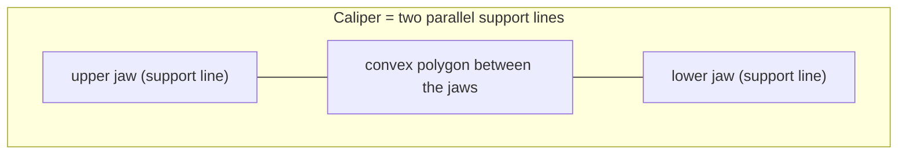

The two contact points where the jaws touch the polygon form an **antipodal pair**. As the direction
turns, the contact points walk around the boundary in the *same* rotational sense — never backwards —
which is exactly why a two-pointer sweep is linear.

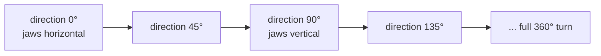

Picture the two jaws as arrows pointing in opposite directions, both rotating together while hugging
the hull:

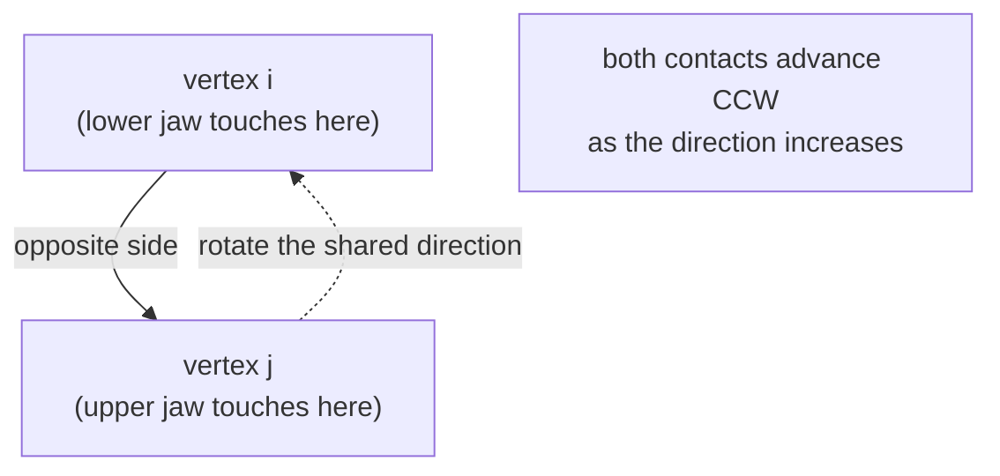

---

## 3. Antipodal Pairs

Two hull vertices are an **antipodal pair** if there exist parallel support lines through them (one
line per vertex). Only $O(n)$ antipodal pairs exist on a convex polygon — *not* $O(n^2)$ — and the
**farthest** pair of the whole point set is always one of them. Rotating calipers enumerates exactly
these pairs.

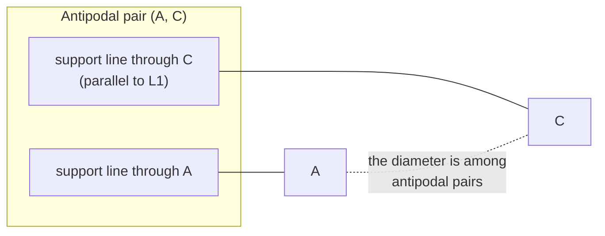

To find, for a fixed edge $v_i v_{i+1}$, the antipodal vertex on the far side, we pick the vertex that
is **farthest from the line** through that edge — i.e. the vertex maximizing the triangle area
$\operatorname{cross}(v_i, v_{i+1}, v_j)$. As the edge rotates CCW, that farthest vertex only ever moves
forward, so we advance a single pointer.

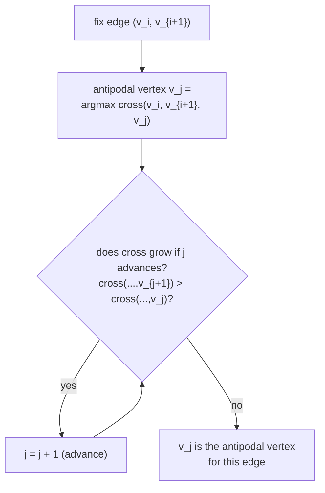

Because the area function is **unimodal** as $j$ walks around the hull (it rises to the farthest vertex
then falls), the `while area increases` test stops exactly at the apex — no binary search needed.


---

## 4. The Diameter (Farthest Pair)

The **diameter** of a point set is the largest distance between any two of its points. Both endpoints
must be hull vertices (a point strictly inside can always be pushed outward to a farther one), and the
two endpoints form an antipodal pair. So: build the hull, then rotate the calipers, advancing the
opposite vertex $j$ while the triangle area over the current edge keeps growing, and track the largest
**squared** distance seen.

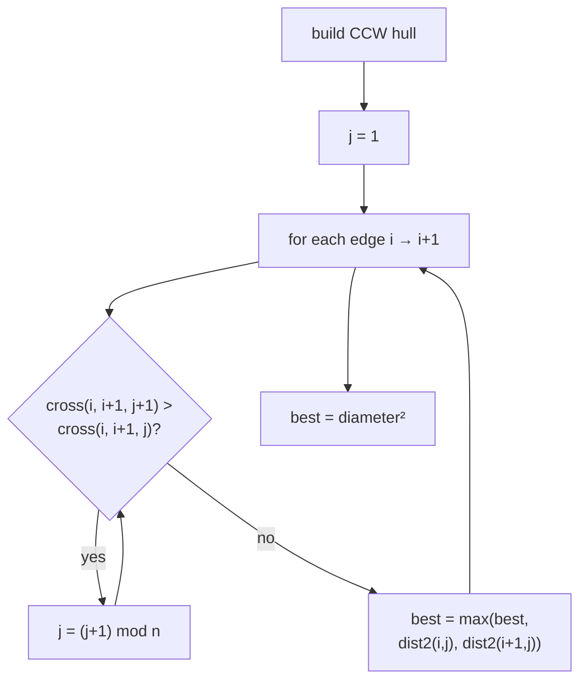

We compare **squared** distances so the whole search is integer-exact; take a square root only once at
the very end if a true length is required.

```python
def farthest_pair_sq(hull):
    n = len(hull)
    if n == 1:
        return 0                                   # single point
    if n == 2:
        return dist2(hull[0], hull[1])             # a segment

    best = 0
    j = 1
    for i in range(n):
        ni = (i + 1) % n
        # advance the opposite vertex while the triangle over edge (i, ni) grows in area
        while cross(hull[i], hull[ni], hull[(j + 1) % n]) > cross(hull[i], hull[ni], hull[j]):
            j = (j + 1) % n
        # the antipodal vertex j is farthest from this edge — check both edge endpoints
        best = max(best, dist2(hull[i], hull[j]), dist2(hull[ni], hull[j]))
    return best

def diameter_sq(points):
    return farthest_pair_sq(convex_hull(points))
```

```cpp
long long farthest_pair_sq(const vector<Point> &hull) {
    int n = (int)hull.size();
    if (n == 1) return 0;                           // single point
    if (n == 2) return dist2(hull[0], hull[1]);     // a segment

    long long best = 0;
    int j = 1;
    for (int i = 0; i < n; ++i) {
        int ni = (i + 1) % n;
        // advance the opposite vertex while the triangle over edge (i, ni) grows in area
        while (cross(hull[i], hull[ni], hull[(j + 1) % n]) > cross(hull[i], hull[ni], hull[j]))
            j = (j + 1) % n;
        // the antipodal vertex j is farthest from this edge — check both edge endpoints
        best = max(best, max(dist2(hull[i], hull[j]), dist2(hull[ni], hull[j])));
    }
    return best;
}

long long diameter_sq(vector<Point> points) {
    return farthest_pair_sq(convex_hull(points));
}
```

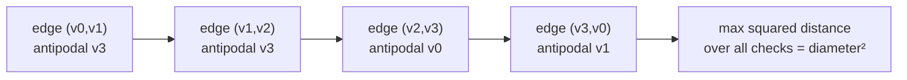

---

## 5. Minimum Width of a Convex Polygon

The **width** of a convex polygon is the smallest distance between any pair of parallel support lines.
A key fact: the minimum width is always achieved when **one** of the two support lines is *flush with a
hull edge*. So for each edge, find its antipodal vertex (the one farthest from the edge's line); the
distance from that vertex to the edge line is a width candidate, and the minimum over all edges is the
answer.

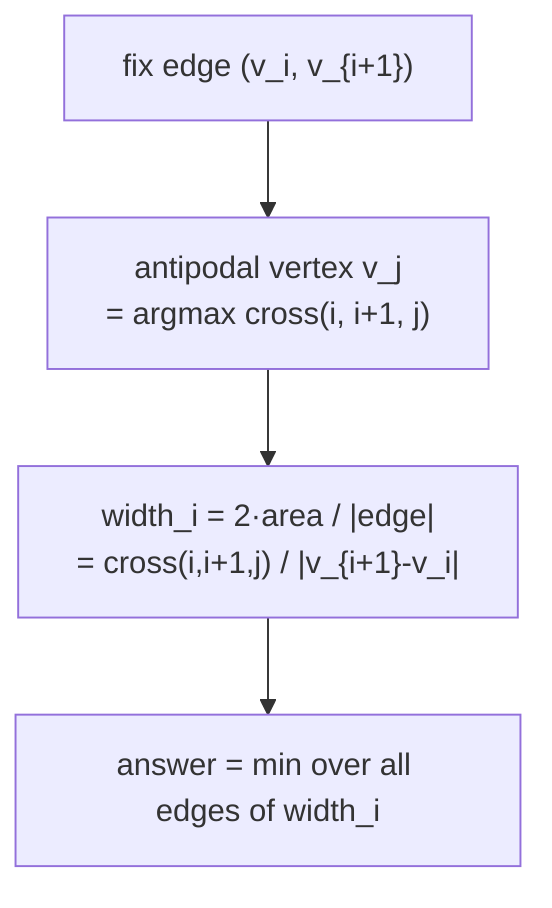

The distance from vertex $v_j$ to the line through edge $v_i v_{i+1}$ is

$$
\text{dist} = \frac{\bigl|\operatorname{cross}(v_i, v_{i+1}, v_j)\bigr|}{\lVert v_{i+1} - v_i \rVert},
$$

because $\operatorname{cross}$ is **twice the triangle area** and the edge is the triangle's base. The
numerator stays an exact integer; only the final division by the edge length uses floating point.

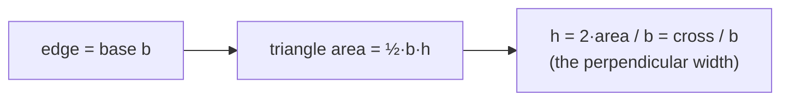

```python
import math

def min_width(hull):
    n = len(hull)
    if n < 3:
        return 0.0                                  # degenerate: a point or a segment

    best = float("inf")
    j = 1
    for i in range(n):
        ni = (i + 1) % n
        # antipodal vertex = farthest from this edge's supporting line
        while cross(hull[i], hull[ni], hull[(j + 1) % n]) > cross(hull[i], hull[ni], hull[j]):
            j = (j + 1) % n
        area2 = cross(hull[i], hull[ni], hull[j])   # 2 * triangle area (exact integer)
        edge_len = math.sqrt(dist2(hull[i], hull[ni]))
        best = min(best, area2 / edge_len)          # perpendicular distance = 2*area / base
    return best

def polygon_min_width(points):
    return min_width(convex_hull(points))
```

```cpp
double min_width(const vector<Point> &hull) {
    int n = (int)hull.size();
    if (n < 3) return 0.0;                           // degenerate: a point or a segment

    double best = numeric_limits<double>::infinity();
    int j = 1;
    for (int i = 0; i < n; ++i) {
        int ni = (i + 1) % n;
        // antipodal vertex = farthest from this edge's supporting line
        while (cross(hull[i], hull[ni], hull[(j + 1) % n]) > cross(hull[i], hull[ni], hull[j]))
            j = (j + 1) % n;
        long long area2 = cross(hull[i], hull[ni], hull[j]);   // 2 * triangle area (exact integer)
        double edge_len = sqrt((double)dist2(hull[i], hull[ni]));
        best = min(best, (double)area2 / edge_len);  // perpendicular distance = 2*area / base
    }
    return best;
}

double polygon_min_width(vector<Point> points) {
    return min_width(convex_hull(points));
}
```

---

## 6. Minimum-Area Enclosing Rectangle

A classic theorem: the **minimum-area rectangle** enclosing a convex polygon has **at least one side
collinear with a hull edge**. So we rotate over every edge and, for each edge direction, compute the
bounding rectangle aligned to it. That needs three rotating pointers driven by the same edge:

- **height** pointer $j$ — the vertex farthest from the edge line (`argmax cross`).
- **right** pointer $r$ — the vertex with maximum projection along the edge direction (`argmax dot`).
- **left** pointer $l$ — the vertex with minimum projection along the edge direction (`argmin dot`).

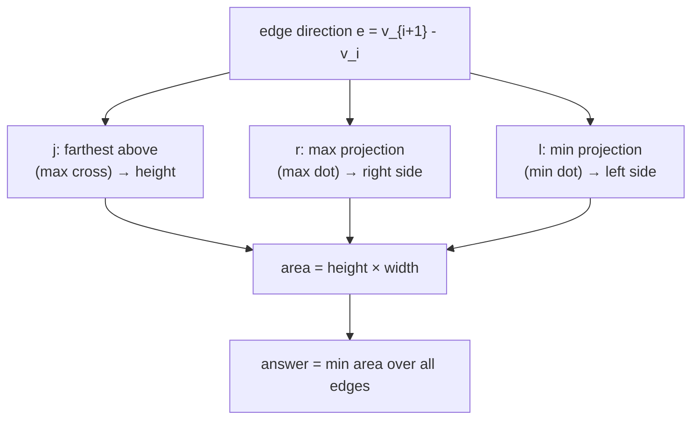

All three pointers advance **monotonically** as the edge rotates, so the total work is linear. Using
$e = v_{i+1} - v_i$ as the base direction:

$$
\text{height} = \frac{\operatorname{cross}(v_i, v_{i+1}, v_j)}{\lVert e \rVert}, \qquad
\text{width} = \frac{e\cdot(v_r - v_i) - e\cdot(v_l - v_i)}{\lVert e \rVert},
$$

so $\text{area} = \text{height}\cdot\text{width} = \dfrac{\operatorname{cross}\cdot(\text{dot}_r - \text{dot}_l)}{\lVert e \rVert^{2}}$.
The two big integer factors are divided by $\lVert e \rVert^{2}$; multiply them as **doubles** to avoid
64-bit overflow on large coordinates.

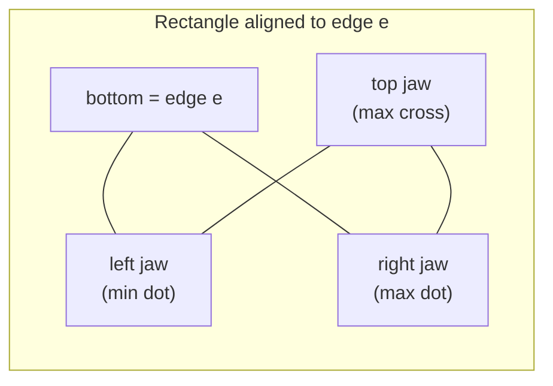

```python
def dot(o, a, b):
    # (a - o) . (b - o): projection helper along the edge direction (a - o)
    return (a.x - o.x) * (b.x - o.x) + (a.y - o.y) * (b.y - o.y)

def min_area_rectangle(hull):
    n = len(hull)
    if n < 3:
        return 0.0                                  # degenerate: a point or a segment

    best = float("inf")
    j = 1                                           # height pointer (max cross)
    r = 1                                           # right pointer (max dot)
    l = 0                                           # left pointer (min dot)
    for i in range(n):
        ni = (i + 1) % n
        while cross(hull[i], hull[ni], hull[(j + 1) % n]) > cross(hull[i], hull[ni], hull[j]):
            j = (j + 1) % n
        while dot(hull[i], hull[ni], hull[(r + 1) % n]) > dot(hull[i], hull[ni], hull[r]):
            r = (r + 1) % n
        if i == 0:
            l = r                                   # seed the min-projection pointer
        while dot(hull[i], hull[ni], hull[(l + 1) % n]) < dot(hull[i], hull[ni], hull[l]):
            l = (l + 1) % n

        edge2 = dist2(hull[i], hull[ni])            # |e|^2 (exact integer)
        height = cross(hull[i], hull[ni], hull[j])  # |e| * perpendicular height
        width = dot(hull[i], hull[ni], hull[r]) - dot(hull[i], hull[ni], hull[l])  # |e| * width
        area = (float(height) * float(width)) / edge2          # cast to avoid overflow
        best = min(best, area)
    return best

def points_min_area_rectangle(points):
    return min_area_rectangle(convex_hull(points))
```

```cpp
// (a - o) . (b - o): projection helper along the edge direction (a - o)
long long dot(const Point &o, const Point &a, const Point &b) {
    return (a.x - o.x) * (b.x - o.x) + (a.y - o.y) * (b.y - o.y);
}

double min_area_rectangle(const vector<Point> &hull) {
    int n = (int)hull.size();
    if (n < 3) return 0.0;                           // degenerate: a point or a segment

    double best = numeric_limits<double>::infinity();
    int j = 1;                                       // height pointer (max cross)
    int r = 1;                                       // right pointer (max dot)
    int l = 0;                                       // left pointer (min dot)
    for (int i = 0; i < n; ++i) {
        int ni = (i + 1) % n;
        while (cross(hull[i], hull[ni], hull[(j + 1) % n]) > cross(hull[i], hull[ni], hull[j]))
            j = (j + 1) % n;
        while (dot(hull[i], hull[ni], hull[(r + 1) % n]) > dot(hull[i], hull[ni], hull[r]))
            r = (r + 1) % n;
        if (i == 0) l = r;                           // seed the min-projection pointer
        while (dot(hull[i], hull[ni], hull[(l + 1) % n]) < dot(hull[i], hull[ni], hull[l]))
            l = (l + 1) % n;

        long long edge2 = dist2(hull[i], hull[ni]);  // |e|^2 (exact integer)
        long long height = cross(hull[i], hull[ni], hull[j]);  // |e| * perpendicular height
        long long width = dot(hull[i], hull[ni], hull[r]) - dot(hull[i], hull[ni], hull[l]); // |e| * width
        double area = ((double)height * (double)width) / (double)edge2;  // cast to avoid overflow
        best = min(best, area);
    }
    return best;
}

double points_min_area_rectangle(vector<Point> points) {
    return min_area_rectangle(convex_hull(points));
}
```

---

## 7. Maximum Distance Between Two Convex Polygons

Given two convex polygons $P$ and $Q$, the **maximum** distance between a vertex of $P$ and a vertex of
$Q$ is also realized by an antipodal-style pair: a vertex of $P$ extreme in some direction and a vertex
of $Q$ extreme in the opposite direction. We rotate two calipers in lockstep — one on each polygon —
choosing whichever vertex advance keeps the supporting directions aligned.

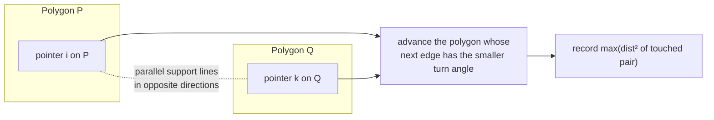

Conceptually: start at the lowest vertex of $P$ and the highest vertex of $Q$ (opposite extremes), then
walk both boundaries forward, at each step advancing the pointer whose outgoing edge turns "less", and
record the maximum squared distance among the touched pairs. This visits $O(|P| + |Q|)$ pairs — far
fewer than the $O(|P|\cdot|Q|)$ of brute force. (The same skeleton, with a *minimum* in the recording
step and an inner edge-to-edge distance, yields the **minimum** distance between two disjoint convex
polygons.)

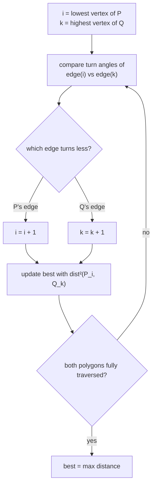

---

## 8. Why the Two-Pointer Advance is O(n)

The magic of rotating calipers is that the opposite-vertex pointer $j$ (and the side pointers $r$, $l$)
**only move forward** as the edge index $i$ marches around the hull. Across the whole outer loop, each
pointer travels at most one full lap — $O(n)$ total advances — so the nested `while` loops contribute
$O(n)$ *amortized*, not $O(n^2)$.

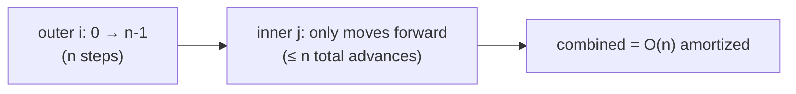

The reason $j$ never needs to back up: as the edge rotates CCW by a small angle, the supporting line on
the far side rotates the same way, so the contact vertex either stays put or moves CCW — never CW. This
monotonicity is precisely the convexity of the hull expressed as a unimodal area function.

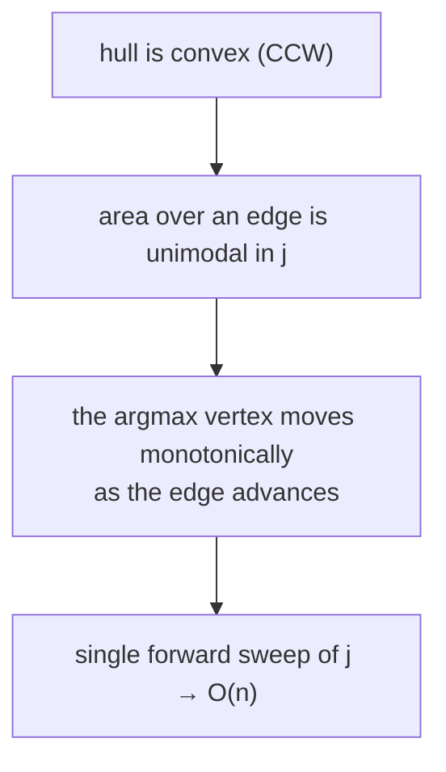

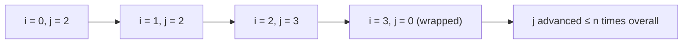

---

## 9. Complexity Summary

| Task | Hull build | Calipers sweep | Total | Space |
|------|-----------|----------------|-------|-------|
| Diameter / farthest pair | $O(n \log n)$ | $O(n)$ | $O(n \log n)$ | $O(n)$ |
| Minimum width | $O(n \log n)$ | $O(n)$ | $O(n \log n)$ | $O(n)$ |
| Min-area enclosing rectangle | $O(n \log n)$ | $O(n)$ | $O(n \log n)$ | $O(n)$ |
| Max distance between two convex polygons | given hulls | $O(|P| + |Q|)$ | $O(|P| + |Q|)$ | $O(1)$ extra |

The hull dominates: once you pay $O(n \log n)$ to sort and build it, every calipers query is a single
linear pass. If the polygon is **already convex and ordered**, you skip the sort and the whole thing is
$O(n)$.

$$
T_{\text{total}} = O(n \log n) \;\text{(hull)} + O(n)\;\text{(calipers)} = O(n \log n).
$$

---

## 10. Common Pitfalls

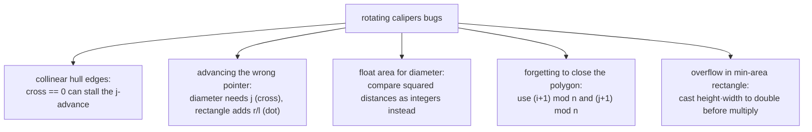

- **Collinear hull edges.** If three boundary points are collinear and you *keep* them, an edge can be
  zero-length or the strict `>` advance may not move where you expect. Prefer the **minimal** hull
  (pop on `cross <= 0`) so every edge has positive length, or use `>=` carefully when you must keep
  collinear vertices.
- **Which pointer to advance.** The diameter uses a single pointer driven by the **cross** product
  (perpendicular extent). The enclosing rectangle additionally needs the **dot**-product pointers $r$
  and $l$ for the extent *along* the edge. Mixing them up gives wrong widths.
- **Integer cross for area/distance.** Keep cross products and squared distances in `long long`. Only
  convert to floating point for a final length (square root) or a width/area ratio.
- **Modular indexing.** Always wrap with `(i + 1) % n` and `(j + 1) % n`; an off-by-one at the wrap is
  the most common silent bug.
- **Overflow in the rectangle.** `height * width` can exceed 64 bits for coordinates near $10^9$; cast
  to `double` *before* multiplying (as the code above does).

---

## 11. Patterns

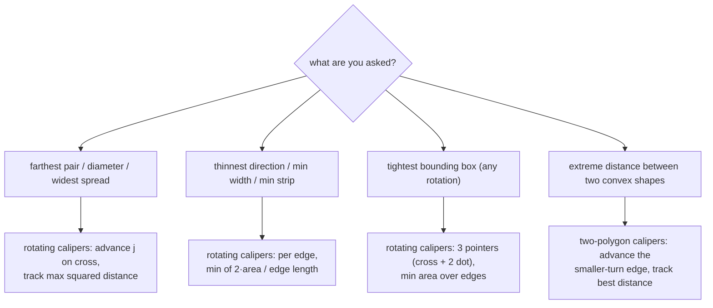

- **"Farthest / widest / diameter"** → build the hull, then a single cross-driven calipers sweep over
  **squared** distances.
- **"Thinnest strip / minimum width"** → per hull edge, take the antipodal vertex and the
  perpendicular distance $2\cdot\text{area} / \text{edge length}$; keep the minimum.
- **"Smallest enclosing rectangle (any orientation)"** → one side hugs a hull edge; rotate three
  pointers (one cross for height, two dot for left/right width) and minimize area.
- **General template** → *sort once → build hull once → walk a monotone pointer once.* Whenever a query
  is about **extreme separations on a convex shape**, reach for rotating calipers before any $O(n^2)$
  pair loop.
