# Half-Plane Intersection — The Feasible Region of 2D Linear Constraints (Complete Guide)

> A **half-plane** is everything on *one side* of an infinite directed line — for example all points
> with $a x + b y \le c$. Each linear inequality you write down carves the plane in two and keeps a
> half. **Intersecting** many half-planes leaves the points that satisfy *every* constraint at once.
> That surviving region is always **convex**, and it is exactly the **feasible region** of a system of
> 2D linear inequalities. This guide builds the classic $O(n \log n)$ **sort-by-angle + deque** algorithm
> that returns the intersection as a convex polygon, and shows how to detect *empty* and *unbounded*
> results.

---

## Table of Contents
1. [What a Half-Plane Is](#1-what-a-half-plane-is)
2. [Representing a Half-Plane](#2-representing-a-half-plane)
3. [The Two Core Primitives: `out` and `intersect`](#3-the-two-core-primitives-out-and-intersect)
4. [Sorting Half-Planes by Angle](#4-sorting-half-planes-by-angle)
5. [The Deque-Based Incremental Algorithm](#5-the-deque-based-incremental-algorithm)
6. [Recovering the Bounding Polygon](#6-recovering-the-bounding-polygon)
7. [Empty vs Unbounded Intersection](#7-empty-vs-unbounded-intersection)
8. [Adding a Big Bounding Box](#8-adding-a-big-bounding-box)
9. [Applications](#9-applications)
10. [Complexity Summary](#10-complexity-summary)
11. [Common Pitfalls](#11-common-pitfalls)
12. [Patterns](#12-patterns)

---

## 1. What a Half-Plane Is

Take an infinite line and give it a **direction** (an arrow). Standing on the line and looking along the
arrow, the plane splits into a **left side** and a **right side**. A *half-plane* is the line plus one of
those sides. We adopt the convention: **a half-plane keeps the points on (or to) its LEFT.**

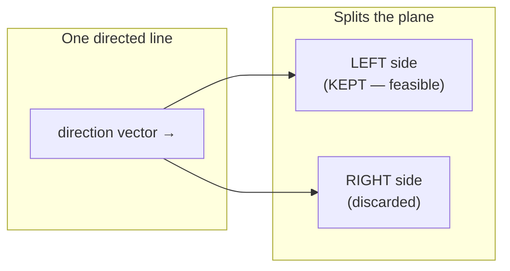

A point $P$ is **inside** the half-plane defined by a point $S$ and direction $\vec{d}$ when the cross
product $\vec{d} \times \overrightarrow{SP} \ge 0$ — i.e. $P$ is to the left of (or on) the line.

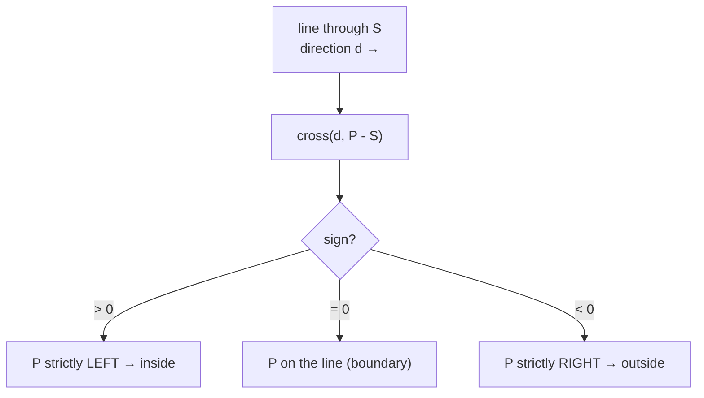

Now stack constraints. Each half-plane is one rule "stay on my left." Their **intersection** is the set of
points obeying all rules simultaneously — a convex region, possibly a polygon, possibly empty, possibly
unbounded:

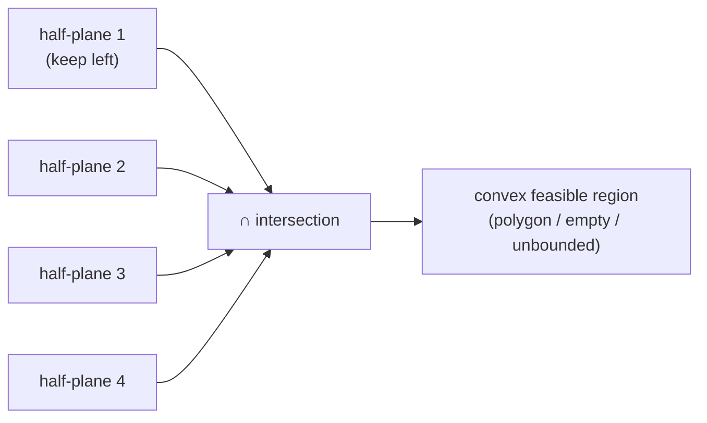

Why convex? An intersection of convex sets is convex, and each half-plane is convex. So no matter how many
constraints you add, the survivor never develops a dent.

---

## 2. Representing a Half-Plane

Two equivalent descriptions show up constantly:

- **Geometric:** a point $S$ on the boundary line plus a direction vector $\vec{d}$; keep the left side.
- **Algebraic:** an inequality $a x + b y \le c$. The boundary is the line $a x + b y = c$; the inward
  normal is $(-a, -b)$ and a direction along the line is $\vec{d} = (b, -a)$ (rotate the gradient).

Converting $a x + b y \le c$ to point+direction: pick any point $S$ on $a x + b y = c$ (e.g. if
$a \neq 0$, $S = (c/a,\,0)$), and set $\vec{d} = (b, -a)$ so that "left of $\vec{d}$" matches
$a x + b y \le c$.

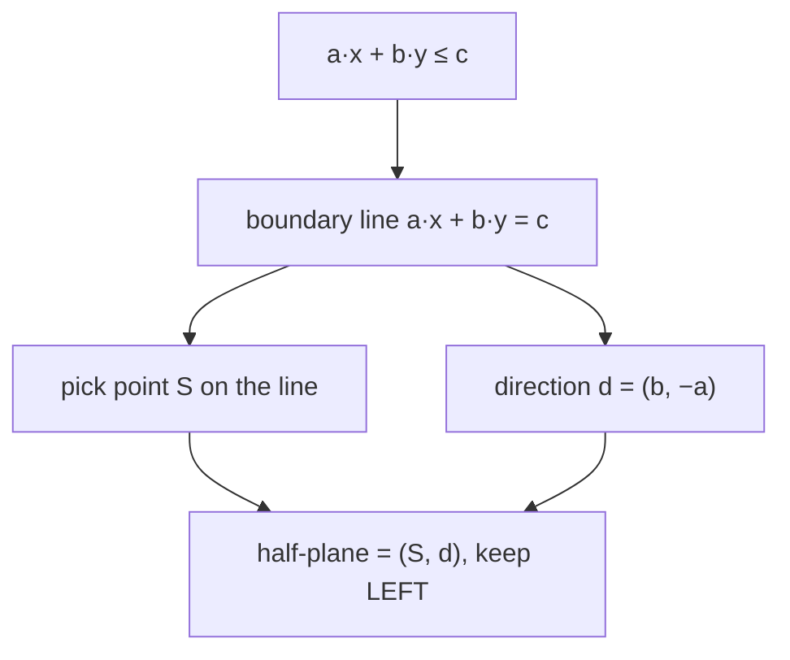

We store each half-plane as a point `p` (any point on its line), a direction `dir`, and a precomputed
**angle** `atan2(dir.y, dir.x)` used for sorting.

```python
import math
from dataclasses import dataclass

EPS = 1e-9

@dataclass
class Point:
    x: float
    y: float
    def __add__(self, o): return Point(self.x + o.x, self.y + o.y)
    def __sub__(self, o): return Point(self.x - o.x, self.y - o.y)
    def __mul__(self, t): return Point(self.x * t, self.y * t)

def cross(a: Point, b: Point) -> float:
    return a.x * b.y - a.y * b.x

@dataclass
class HalfPlane:
    p: Point          # a point on the boundary line
    dir: Point        # direction; the KEPT side is to the LEFT of dir
    def angle(self) -> float:
        return math.atan2(self.dir.y, self.dir.x)
```

```cpp
#include <bits/stdc++.h>
using namespace std;

const double EPS = 1e-9;

struct Point {
    double x, y;
    Point(double x = 0, double y = 0) : x(x), y(y) {}
    Point operator+(const Point& o) const { return Point(x + o.x, y + o.y); }
    Point operator-(const Point& o) const { return Point(x - o.x, y - o.y); }
    Point operator*(double t) const { return Point(x * t, y * t); }
};

double cross(const Point& a, const Point& b) {
    return a.x * b.y - a.y * b.x;
}

struct HalfPlane {
    Point p;             // a point on the boundary line
    Point dir;           // direction; KEPT side is to the LEFT of dir
    double angle() const {
        return atan2(dir.y, dir.x);
    }
};
```

> **Exactness note.** For the *orientation* of integer input (which side, convex-hull style decisions) you
> can keep coordinates in `long long` and the cross product is exact. But the half-plane **intersection
> point** is generally fractional, so the deque algorithm itself runs in `double` with `const double EPS = 1e-9`.

---

## 3. The Two Core Primitives: `out` and `intersect`

The whole algorithm rests on two tiny helpers.

**(a) `out(h, p)` — is point `p` strictly OUTSIDE half-plane `h`?** It is outside when `p` lies strictly to
the *right* of the directed line, i.e. `cross(h.dir, p - h.p) < -EPS`.

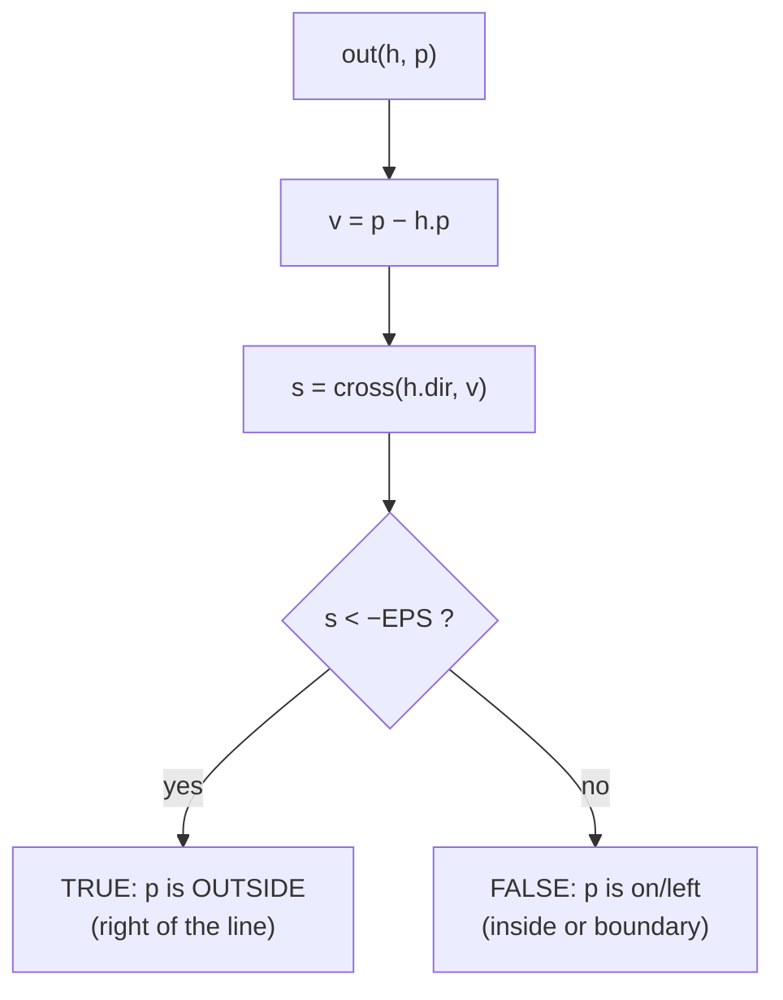

**(b) `intersect(h1, h2)` — the point where two boundary lines meet.** Using the parametric form
$P = h_1.p + t\,h_1.dir$ and solving against $h_2$:

$$
t = \frac{\operatorname{cross}\big(h_2.dir,\; h_1.p - h_2.p\big)}{\operatorname{cross}\big(h_1.dir,\; h_2.dir\big)},
\qquad P = h_1.p + t\,h_1.dir.
$$

The denominator $\operatorname{cross}(h_1.dir, h_2.dir)$ is zero exactly when the two lines are **parallel** —
something the angular sort guarantees we never feed in for *adjacent* deque elements.

```python
def out(h: HalfPlane, p: Point) -> bool:
    # True if p is strictly to the RIGHT of h's directed boundary line.
    return cross(h.dir, p - h.p) < -EPS

def intersect(h1: HalfPlane, h2: HalfPlane) -> Point:
    # Intersection of the two boundary lines (assumes not parallel).
    denom = cross(h1.dir, h2.dir)
    t = cross(h2.dir, h1.p - h2.p) / denom
    return h1.p + h1.dir * t
```

```cpp
bool out(const HalfPlane& h, const Point& p) {
    // True if p is strictly to the RIGHT of h's directed boundary line.
    return cross(h.dir, p - h.p) < -EPS;
}

Point intersect(const HalfPlane& h1, const HalfPlane& h2) {
    // Intersection of the two boundary lines (assumes not parallel).
    double denom = cross(h1.dir, h2.dir);
    double t = cross(h2.dir, h1.p - h2.p) / denom;
    return h1.p + h1.dir * t;
}
```

These two primitives are the *only* geometry the main loop calls. Everything else is bookkeeping with a
double-ended queue.

---

## 4. Sorting Half-Planes by Angle

Sort all half-planes by the **polar angle** of their direction vector, $\operatorname{atan2}(dir.y, dir.x)$,
which runs in $(-\pi, \pi]$. Sorting by angle makes the boundaries sweep around like the hands of a clock,
so that as we add them in order they form a convex "funnel" we can maintain incrementally.

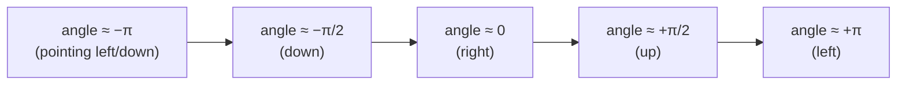

When two half-planes have the **same angle** (parallel boundaries facing the same way), only the *innermost*
one can matter — the others are strictly looser and redundant. Among equal angles, keep the one whose line is
furthest in the kept direction (the tightest constraint) and drop the rest:

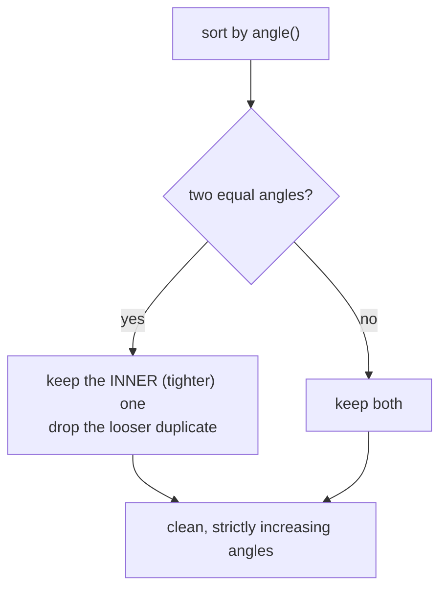

We detect equal angles with `abs(a.angle() - b.angle()) < EPS`. The "inner" test reuses `out`: among two
parallel half-planes, `h_b` is the redundant (outer) one if `h_a.p` is **not** outside `h_b` — meaning
`h_a` already lies inside `h_b`, so `h_b` adds nothing.

```python
def remove_parallel_redundant(planes: list[HalfPlane]) -> list[HalfPlane]:
    planes.sort(key=lambda h: h.angle())
    cleaned: list[HalfPlane] = []
    for h in planes:
        if cleaned and abs(h.angle() - cleaned[-1].angle()) < EPS:
            # Same direction: keep only the inner (tighter) one.
            if out(cleaned[-1], h.p):       # h is tighter → replace
                cleaned[-1] = h
            continue                        # else h is looser → skip
        cleaned.append(h)
    return cleaned
```

```cpp
vector<HalfPlane> remove_parallel_redundant(vector<HalfPlane> planes) {
    sort(planes.begin(), planes.end(),
         [](const HalfPlane& a, const HalfPlane& b) {
             return a.angle() < b.angle();
         });
    vector<HalfPlane> cleaned;
    for (const HalfPlane& h : planes) {
        if (!cleaned.empty() &&
            fabs(h.angle() - cleaned.back().angle()) < EPS) {
            // Same direction: keep only the inner (tighter) one.
            if (out(cleaned.back(), h.p)) {   // h is tighter → replace
                cleaned.back() = h;
            }
            continue;                          // else h is looser → skip
        }
        cleaned.push_back(h);
    }
    return cleaned;
}
```

---

## 5. The Deque-Based Incremental Algorithm

Process the angle-sorted half-planes left to right, maintaining a **double-ended queue** of the half-planes
currently forming the boundary of the running intersection. The invariant: consecutive deque elements
intersect at the polygon's vertices, in order.

For each new half-plane `h`:

1. **Pop from the BACK** while the intersection of the last two deque planes lies *outside* `h` — that vertex
   can no longer survive once `h` is enforced.
2. **Pop from the FRONT** while the intersection of the first two deque planes lies *outside* `h` — the
   angular wrap-around can invalidate the earliest vertices too.
3. **Push `h`** onto the back.

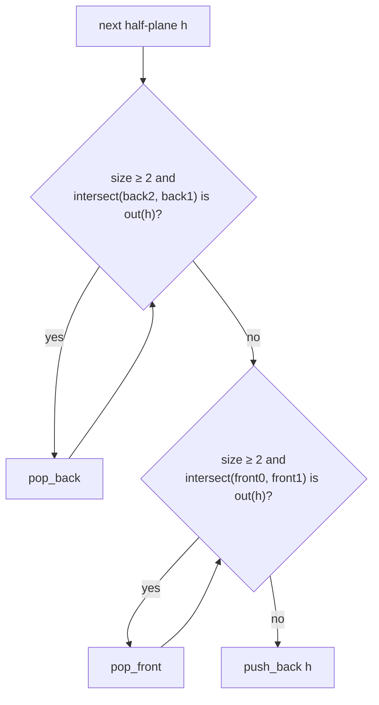

After all half-planes are processed once, do a **final cleanup**: pop from the back while the back-two
intersection is outside the *front* plane, and pop from the front while the front-two intersection is
outside the *back* plane. This closes the cyclic boundary.

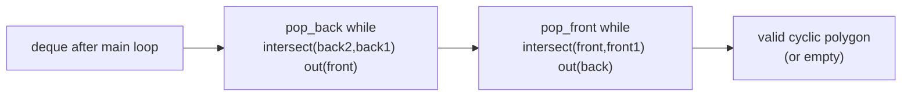

Here is the full $O(n \log n)$ routine, returning the intersection polygon (its vertices in CCW order) or an
empty list when infeasible.

```python
from collections import deque

def half_plane_intersection(planes: list[HalfPlane]) -> list[Point]:
    hs = remove_parallel_redundant(planes)
    dq: deque[HalfPlane] = deque()
    for h in hs:
        while len(dq) >= 2 and out(h, intersect(dq[-1], dq[-2])):
            dq.pop()
        while len(dq) >= 2 and out(h, intersect(dq[0], dq[1])):
            dq.popleft()
        dq.append(h)

    # Final cleanup to close the cyclic boundary.
    while len(dq) >= 3 and out(dq[0], intersect(dq[-1], dq[-2])):
        dq.pop()
    while len(dq) >= 3 and out(dq[-1], intersect(dq[0], dq[1])):
        dq.popleft()

    if len(dq) < 3:
        return []   # empty or degenerate intersection

    # Recover vertices as intersections of consecutive boundary lines.
    n = len(dq)
    poly: list[Point] = []
    for i in range(n):
        poly.append(intersect(dq[i], dq[(i + 1) % n]))
    return poly
```

```cpp
vector<Point> half_plane_intersection(vector<HalfPlane> planes) {
    vector<HalfPlane> hs = remove_parallel_redundant(planes);
    deque<HalfPlane> dq;
    for (const HalfPlane& h : hs) {
        while (dq.size() >= 2 &&
               out(h, intersect(dq[dq.size() - 1], dq[dq.size() - 2]))) {
            dq.pop_back();
        }
        while (dq.size() >= 2 && out(h, intersect(dq[0], dq[1]))) {
            dq.pop_front();
        }
        dq.push_back(h);
    }

    // Final cleanup to close the cyclic boundary.
    while (dq.size() >= 3 &&
           out(dq[0], intersect(dq[dq.size() - 1], dq[dq.size() - 2]))) {
        dq.pop_back();
    }
    while (dq.size() >= 3 && out(dq.back(), intersect(dq[0], dq[1]))) {
        dq.pop_front();
    }

    if (dq.size() < 3) return {};   // empty or degenerate intersection

    // Recover vertices as intersections of consecutive boundary lines.
    int n = (int)dq.size();
    vector<Point> poly;
    for (int i = 0; i < n; ++i) {
        poly.push_back(intersect(dq[i], dq[(i + 1) % n]));
    }
    return poly;
}
```

---

## 6. Recovering the Bounding Polygon

Once the deque holds the final set of $k$ boundary half-planes in angular order, the **vertices** of the
feasible region are the intersection points of *consecutive* boundaries — wrapping the last back to the
first. The polygon comes out in **counter-clockwise** order (matching our "keep the left side" convention).

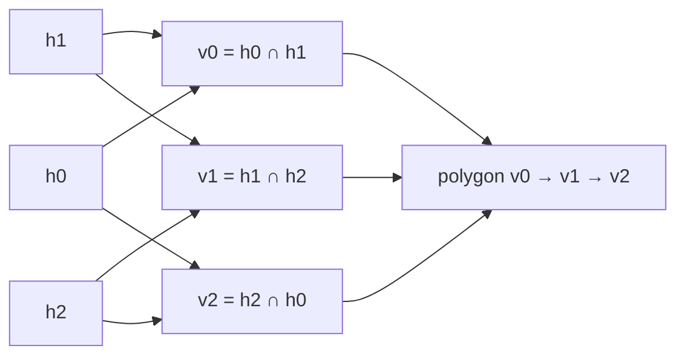

A worked picture: four half-planes carving out a square.

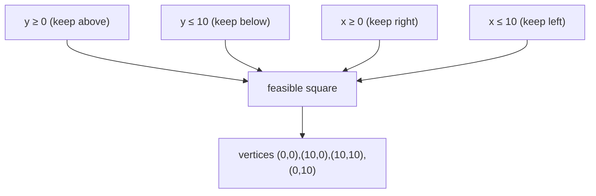

To get the **area** of the region, feed the recovered polygon into the shoelace formula
$\;\text{Area} = \tfrac12\left|\sum (x_i y_{i+1} - x_{i+1} y_i)\right|$.

---

## 7. Empty vs Unbounded Intersection

Two failure modes need care.

- **Empty:** the constraints contradict each other (e.g. $x \le 1$ and $x \ge 5$). After the loop the deque
  collapses to fewer than 3 half-planes, or a leftover vertex is outside some plane — we return an empty
  polygon.
- **Unbounded:** the constraints leave an infinite region (e.g. only $x \ge 0$ and $y \ge 0$ — the whole
  first quadrant). The angular span of the half-plane directions is **less than $\pi$**, so they cannot close
  into a finite polygon.

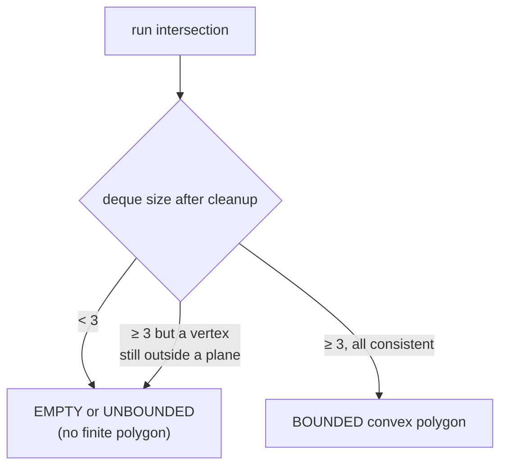

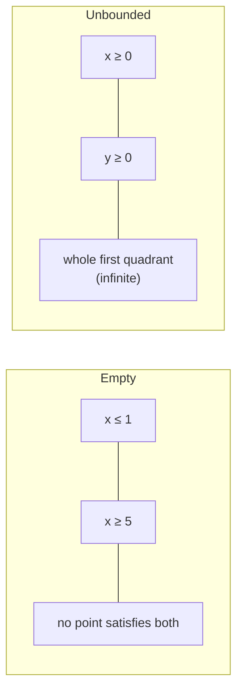

The robust way to *distinguish* unbounded from bounded is the next trick: add a giant box and see whether the
result touches it.

---

## 8. Adding a Big Bounding Box

Most competitive uses only care about a **finite** answer (an area, a kernel inside a polygon). The standard
trick is to start with **four extra half-planes forming a huge axis-aligned box**, say $\pm 10^9$, before
adding the real constraints. This guarantees the intersection is always a finite polygon, turning "unbounded"
into "clipped by the box."

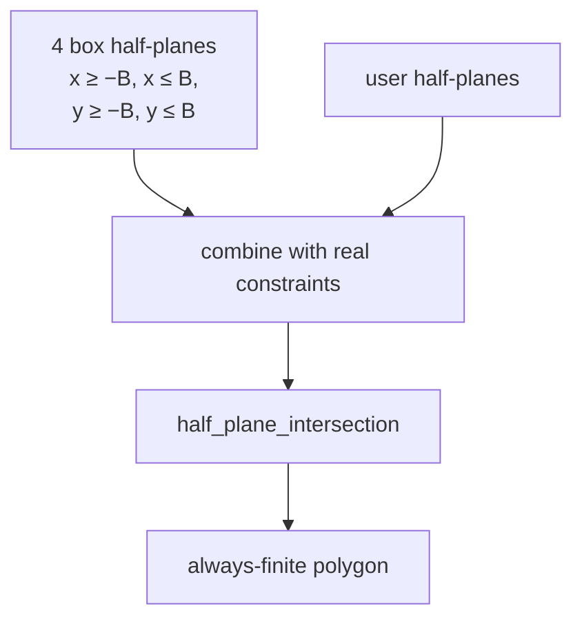

If any recovered vertex lies *on* the box (coordinate near $\pm B$), the true region was unbounded; otherwise
the box was never binding and the area is exact. Choose $B$ comfortably larger than every coordinate that can
appear so the box never clips a genuine feature.

```python
BIG = 1e9

def bounding_box_planes(b: float = BIG) -> list[HalfPlane]:
    # Four CCW half-planes whose left sides intersect in the box [-b, b]^2.
    return [
        HalfPlane(Point(b, -b),  Point(0, 1)),    # x ≤ b  (right edge, going up)
        HalfPlane(Point(b, b),   Point(-1, 0)),   # y ≤ b  (top edge, going left)
        HalfPlane(Point(-b, b),  Point(0, -1)),   # x ≥ -b (left edge, going down)
        HalfPlane(Point(-b, -b), Point(1, 0)),    # y ≥ -b (bottom edge, going right)
    ]
```

```cpp
const double BIG = 1e9;

vector<HalfPlane> bounding_box_planes(double b = BIG) {
    // Four CCW half-planes whose left sides intersect in the box [-b, b]^2.
    return {
        HalfPlane{Point(b, -b),  Point(0, 1)},    // x ≤ b  (right edge, going up)
        HalfPlane{Point(b, b),   Point(-1, 0)},   // y ≤ b  (top edge, going left)
        HalfPlane{Point(-b, b),  Point(0, -1)},   // x ≥ -b (left edge, going down)
        HalfPlane{Point(-b, -b), Point(1, 0)},    // y ≥ -b (bottom edge, going right)
    };
}
```

---

## 9. Applications

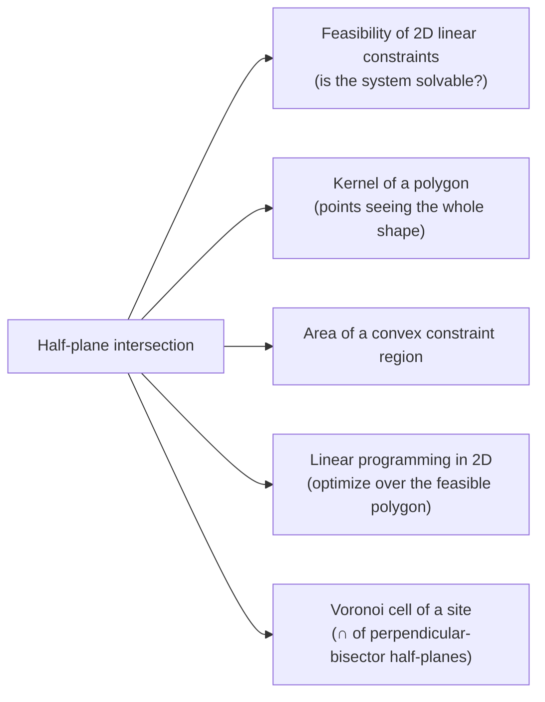

- **Feasibility of linear constraints.** Each inequality $a_i x + b_i y \le c_i$ is a half-plane; the system is
  feasible iff their intersection is non-empty.
- **Kernel of a polygon.** For a simple polygon, the **kernel** is the set of interior points that can "see"
  every other point (a star-shaped polygon's guard positions). Turn each edge into the half-plane on its inner
  side; the kernel is their intersection.
- **Convex region area.** Build the polygon, then shoelace.
- **2D linear programming.** Maximize $c^\top x$ over the feasible polygon — the optimum sits at a vertex of the
  half-plane intersection.

---

## 10. Complexity Summary

| Step | Time | Space |
|---|---|---|
| Sort half-planes by angle | $O(n \log n)$ | $O(n)$ |
| Remove parallel redundancies | $O(n)$ | $O(n)$ |
| Deque sweep (each plane pushed/popped once) | $O(n)$ | $O(n)$ |
| Recover polygon vertices | $O(n)$ | $O(n)$ |
| **Total** | $O(n \log n)$ | $O(n)$ |

If the half-planes are **already sorted by angle** (e.g. they come from the edges of a convex polygon in
order), the sort vanishes and the whole algorithm is $O(n)$.

---

## 11. Common Pitfalls

- **Parallel half-planes.** Two boundaries with the same angle make `intersect` divide by zero. Pre-clean equal
  angles (Section 4) so adjacent deque elements are never parallel.
- **Angle ties keep the INNER one.** Among equal-angle half-planes, the tightest is the only one that matters —
  drop the looser duplicates, or a stale outer constraint corrupts the deque.
- **EPS in the outside test.** Use `cross(...) < -EPS` (strict, with tolerance) in `out`. A bare `< 0` flickers
  on boundary-touching vertices; too large an EPS swallows thin slivers. `1e-9` is the usual sweet spot for
  coordinates up to $10^9$ in `double`.
- **Empty result.** Always check `len(dq) < 3` after the cleanup and return empty — otherwise you read garbage
  vertices.
- **Unbounded result.** Without a bounding box, an unbounded region also yields `< 3` survivors; if you need to
  *tell them apart*, add the big box (Section 8) and test whether a vertex sits on it.
- **Orientation consistency.** Mixing "keep left" and "keep right" half-planes silently returns nonsense. Pick
  one convention (this guide keeps **left**) and convert every input to it.

---

## 12. Patterns

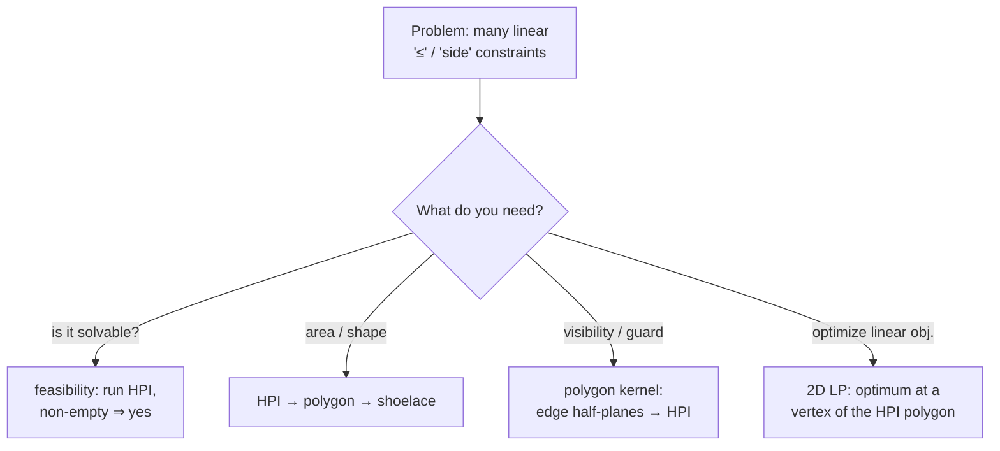

- **Convert everything to one convention first** ("keep the left side"), then forget where the constraints came
  from — the algorithm only sees `(point, direction)` pairs.
- **Wrap with a big box** whenever a finite answer is required, so unboundedness can't crash the area step.
- **Sort once, sweep once.** The deque touches each half-plane a constant number of times; the only $\log$ is the
  initial angular sort.
- **Reuse the `Point` struct and the `out` / `intersect` primitives** across every half-plane problem — the
  variation between tasks is entirely in *how you build the half-planes*, not in the engine.
