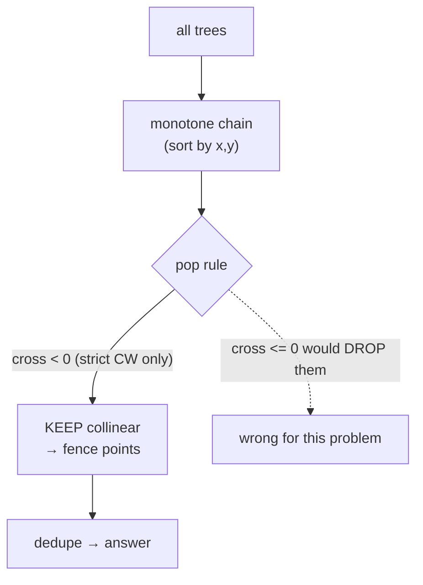
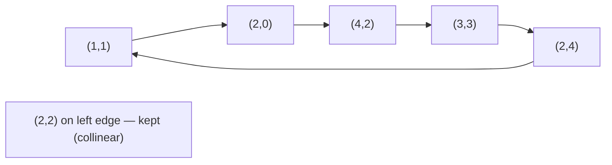
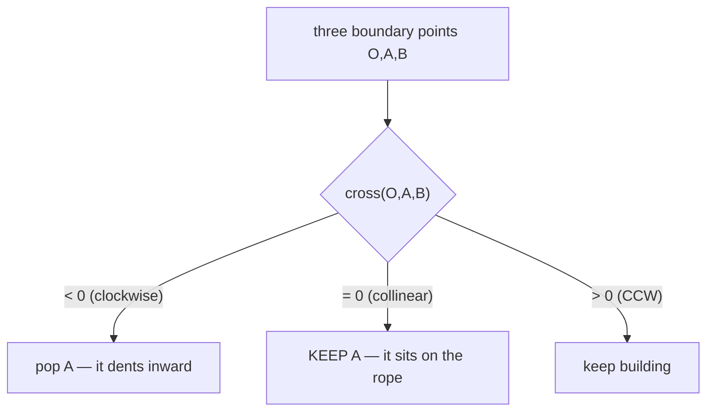
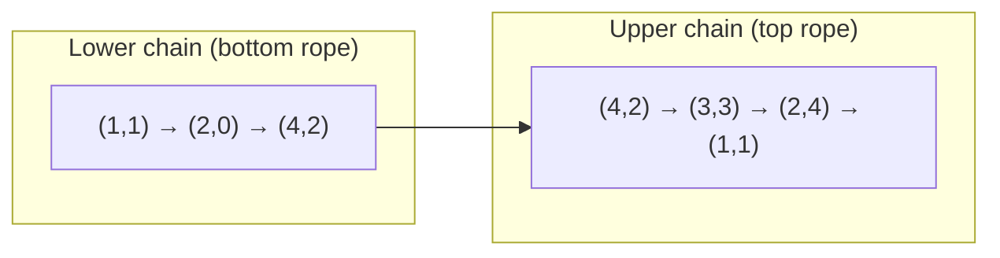
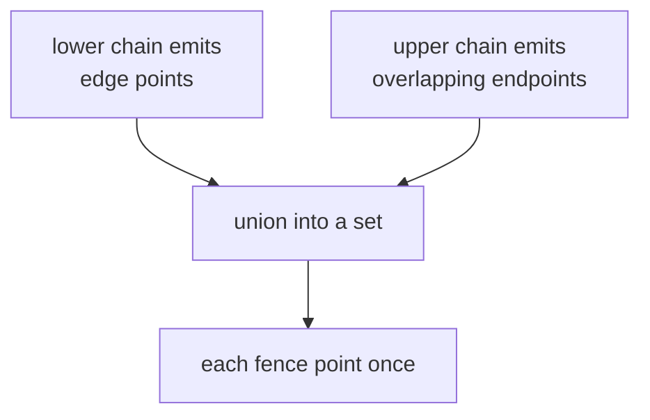

# Erect the Fence (Convex Hull Keeping Collinear Boundary Points)

| Meta | Value |
|------|-------|
| **Problem** | Erect the Fence |
| **Source** | [LeetCode 587](https://leetcode.com/problems/erect-the-fence/) |
| **Difficulty** | Hard |
| **Topics** | Geometry, Convex hull, Monotone chain, Collinear points |
| **Time** | $O(n \log n)$ |
| **Space** | $O(n)$ |

---

## Problem Statement

You are given an array `trees` where `trees[i] = [x, y]` is the position of a tree. You want to fence the
whole garden using the **minimum length of rope** so that all trees are enclosed. Return the coordinates of
the trees that are **exactly located on the fence perimeter** — i.e. the convex hull, **including any trees
lying on a hull edge** (collinear boundary points must be kept).

```text
Input:  trees = [[1,1],[2,2],[2,0],[2,4],[3,3],[4,2]]
Output: [[1,1],[2,0],[4,2],[3,3],[2,4]]
(every tree on the rubber-band boundary, including the corner and edge trees)

Input:  trees = [[1,2],[2,2],[4,2]]
Output: [[1,2],[2,2],[4,2]]
(all three are collinear — every one lies on the fence, so all are returned)
```

---

## Approach (WHY)

The minimum-length enclosing rope is exactly the **convex hull**. The twist versus a textbook hull is that
we must **keep collinear points** that fall on a hull edge — they sit on the rope, so they belong to the
fence.

The *WHY*: a standard hull pops the middle point whenever the turn is clockwise **or straight**
(`cross <= 0`), producing the minimal vertex set. Here a *straight* turn means the middle point lies on the
rope, so we must **not** pop it. We only pop on a strictly **clockwise** turn (`cross < 0`). That single
change in the pop predicate converts "minimal hull" into "all boundary points".



Because collinear runs can otherwise be added twice (once in the lower chain, once in the upper), we collect
hull points into a **set** to dedupe before returning.

---

## Solution

```python
from typing import List

def outerTrees(trees: List[List[int]]) -> List[List[int]]:
    pts = sorted(set(map(tuple, trees)))           # dedupe + sort by (x, y)
    n = len(pts)
    if n <= 2:
        return [list(p) for p in pts]

    def cross(o, a, b):
        # (a-o) x (b-o); >0 CCW, <0 CW, =0 collinear
        return (a[0] - o[0]) * (b[1] - o[1]) - (a[1] - o[1]) * (b[0] - o[0])

    def build(seq):
        hull = []
        for p in seq:
            # pop ONLY on a strictly clockwise turn → keep collinear points
            while len(hull) >= 2 and cross(hull[-2], hull[-1], p) < 0:
                hull.pop()
            hull.append(p)
        return hull

    lower = build(pts)
    upper = build(reversed(pts))
    boundary = set(lower) | set(upper)             # union dedupes collinear runs
    return [list(p) for p in boundary]

print(outerTrees([[1,1],[2,2],[2,0],[2,4],[3,3],[4,2]]))
# e.g. [[1,1],[2,0],[4,2],[3,3],[2,4]] (order may vary)
```

```cpp
#include <bits/stdc++.h>
using namespace std;

struct Point {
    long long x, y;
};

// (a - o) x (b - o); >0 CCW, <0 CW, =0 collinear
long long cross(const Point &o, const Point &a, const Point &b) {
    return (a.x - o.x) * (b.y - o.y) - (a.y - o.y) * (b.x - o.x);
}

vector<vector<int>> outerTrees(vector<vector<int>> &trees) {
    vector<Point> pts;
    for (auto &t : trees) pts.push_back({t[0], t[1]});
    sort(pts.begin(), pts.end(), [](const Point &a, const Point &b) {
        return a.x != b.x ? a.x < b.x : a.y < b.y;          // sort by (x, y)
    });
    pts.erase(unique(pts.begin(), pts.end(), [](const Point &a, const Point &b) {
        return a.x == b.x && a.y == b.y;                    // dedupe
    }), pts.end());

    int n = (int)pts.size();
    if (n <= 2) {
        vector<vector<int>> res;
        for (auto &p : pts) res.push_back({(int)p.x, (int)p.y});
        return res;
    }

    auto build = [&](const vector<Point> &seq) {
        vector<Point> hull;
        for (const Point &p : seq) {
            // pop ONLY on a strictly clockwise turn → keep collinear points
            while (hull.size() >= 2 && cross(hull[hull.size() - 2], hull.back(), p) < 0)
                hull.pop_back();
            hull.push_back(p);
        }
        return hull;
    };

    vector<Point> rev(pts.rbegin(), pts.rend());
    vector<Point> lower = build(pts), upper = build(rev);

    set<pair<long long, long long>> boundary;               // union dedupes collinear runs
    for (auto &p : lower) boundary.insert({p.x, p.y});
    for (auto &p : upper) boundary.insert({p.x, p.y});

    vector<vector<int>> res;
    for (auto &p : boundary) res.push_back({(int)p.first, (int)p.second});
    return res;
}

int main() {
    vector<vector<int>> trees = {{1,1},{2,2},{2,0},{2,4},{3,3},{4,2}};
    auto ans = outerTrees(trees);
    for (auto &p : ans) cout << "[" << p[0] << "," << p[1] << "] ";
    cout << "\n";
    return 0;
}
```

---

## Trace

Sorted, deduped points: `(1,1) (2,0) (2,2) (2,4) (3,3) (4,2)`.

**Lower chain** (left→right), popping only on strict CW (`cross < 0`):

| Add | Hull before | `cross` of last 3 | Action | Hull after |
|-----|-------------|-------------------|--------|------------|
| (1,1) | [] | — | push | (1,1) |
| (2,0) | (1,1) | — | push | (1,1)(2,0) |
| (2,2) | (1,1)(2,0) | `cross((1,1),(2,0),(2,2)) = +2 > 0` | push | (1,1)(2,0)(2,2) |
| (2,4) | …(2,0)(2,2) | `cross((2,0),(2,2),(2,4)) = 0` | keep, push | …(2,2)(2,4) |
| (3,3) | …(2,2)(2,4) | `cross((2,2),(2,4),(3,3)) = -3 < 0` | **pop (2,4)** | …(2,0)(2,2)(3,3)… |
| (4,2) | … | strict CW pops continue | settle | lower ends at (4,2) |

The upper chain (right→left) symmetrically captures the top edge `(4,2)→(3,3)→(2,4)`. Taking the **union**
of both chains, the collinear point `(2,2)` on the left edge `(1,1)…(2,4)` survives because the turn through
it was straight (`cross = 0`), not clockwise.



---

## Diagrams

The decision that defines this problem — strict vs non-strict pop:



Lower and upper chains combine into the closed fence:



Why a set is needed — a collinear run can be emitted by both chains:



---

## Math / Complexity

Sorting the $n$ points dominates: $O(n \log n)$. Each chain build is linear — every point is pushed once and
popped at most once — so the sweep is $O(n)$, and the union/dedupe is $O(n \log n)$ (or $O(n)$ with a hash
set). Total:

$$
T = O(n \log n), \qquad S = O(n).
$$

The orientation test stays in integers; with $|x|, |y| \le 10^4$ the cross product is tiny, but using
`long long` keeps it overflow-proof for the general $|x|,|y| \le 10^9$ setting. The key correctness fact:
on a convex boundary a point is "on the fence" iff the turn through it is non-clockwise, so popping only on
`cross < 0` retains exactly the on-rope (collinear) points.

---

## Takeaway

Erect the Fence is a convex hull with a one-character twist: pop on `cross < 0` instead of `cross <= 0` so that
**collinear boundary points are kept**, then dedupe both chains with a set. Master this and you control the
strict/non-strict turn predicate that distinguishes "minimal hull" from "all boundary points".
