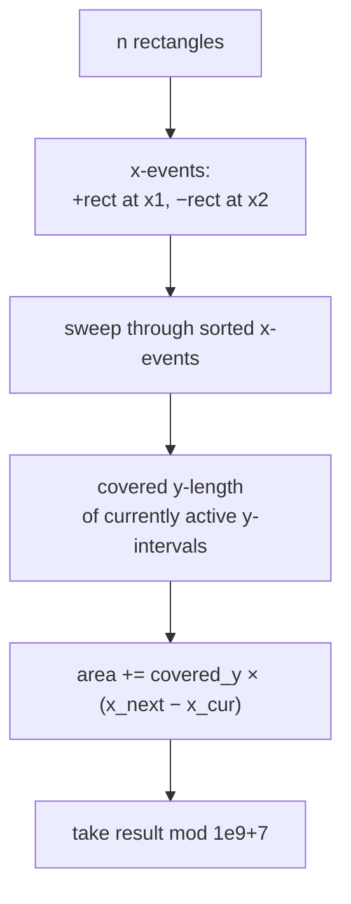
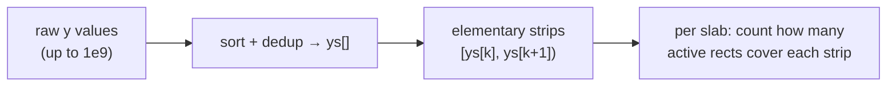
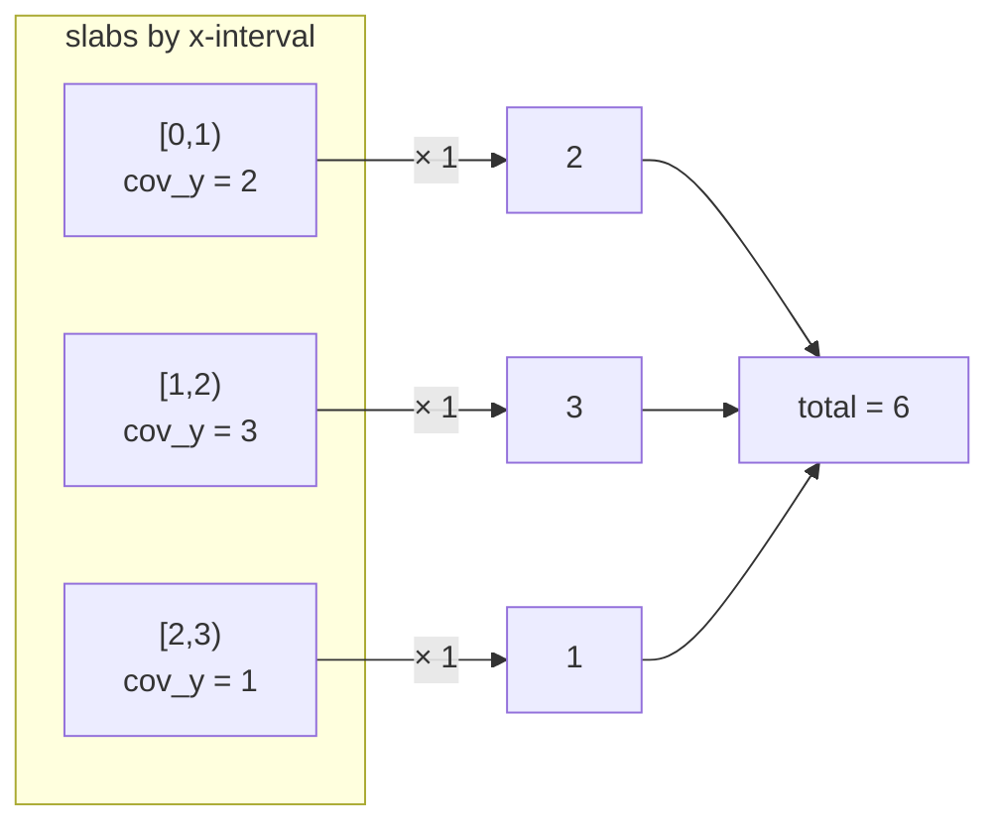
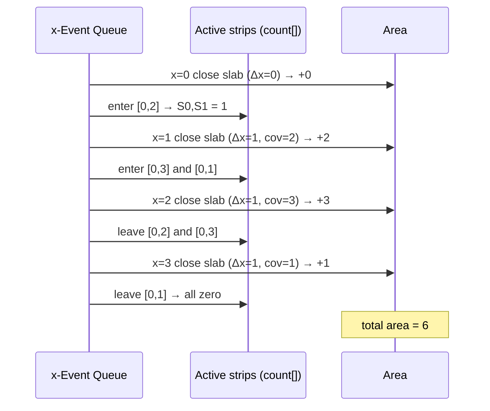
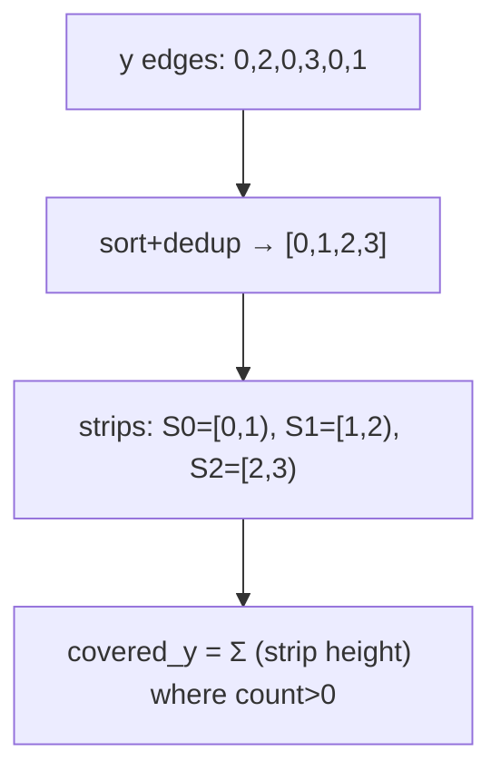

# Rectangle Area II (Union Area via Sweep + Coordinate Compression)

| Meta | Value |
|------|-------|
| **Problem** | Rectangle Area II |
| **Source** | [LeetCode 850](https://leetcode.com/problems/rectangle-area-ii/) |
| **Difficulty** | Hard |
| **Topics** | Geometry, Line sweep, Coordinate compression, Segment tree |
| **Time** | $O(n^2)$ simple / $O(n \log n)$ with segment tree |
| **Space** | $O(n)$ |

---

## Problem Statement

You are given `rectangles` where `rectangles[i] = [x1, y1, x2, y2]` is an axis-aligned rectangle
with bottom-left corner $(x_1, y_1)$ and top-right corner $(x_2, y_2)$. Return the **total area
covered by all rectangles**, counting any overlapped region only **once**. Because the answer can
be large, return it modulo $10^9 + 7$.

```text
Input:  rectangles = [[0,0,2,2],[1,0,2,3],[1,0,3,1]]
Output: 6
Explanation: the union of the three rectangles covers an area of 6.

Input:  rectangles = [[0,0,1000000000,1000000000]]
Output: 49   (10^18 mod (10^9 + 7) = 49)
```

---

## Approach (WHY)

Overlap-aware area is **Klee's measure problem** in 2D. Sweeping a vertical line left to right,
the set of rectangles the line crosses only changes at the $n$ left edges and $n$ right edges —
those are our **events**. Between two consecutive vertical events the active rectangles are fixed,
so the line cuts a fixed union of $y$-intervals. That vertical **slab** contributes

$$
\text{slab area} = \big(\text{covered } y\text{-length of active rectangles}\big)\times \Delta x .
$$



The *WHY* of **coordinate compression**: $y$-coordinates can be up to $10^9$, but only $2n$
distinct values ever matter — the rectangle edges. We compress those into indices $0,1,2,\dots$
so the $y$-axis becomes a small array of *elementary strips*. For each slab we mark which strips
are covered by at least one active rectangle and sum their real heights.



---

## Solution

The compression version below runs an $O(n)$ coverage scan per slab → $O(n^2)$ overall, which is
well within LeetCode's limits ($n \le 200$).

```python
class Solution:
    def rectangleArea(self, rectangles: list[list[int]]) -> int:
        MOD = 10**9 + 7

        # Compress y-coordinates into elementary strips.
        ys = sorted({y for x1, y1, x2, y2 in rectangles for y in (y1, y2)})
        yidx = {y: i for i, y in enumerate(ys)}

        # x-events: (x, type, y1, y2); type +1 = enter, -1 = leave.
        events = []
        for x1, y1, x2, y2 in rectangles:
            events.append((x1, 1, y1, y2))
            events.append((x2, -1, y1, y2))
        events.sort()

        # count[k] = how many active rectangles cover strip [ys[k], ys[k+1])
        count = [0] * (len(ys) - 1)

        def covered_y():
            total = 0
            for k in range(len(count)):
                if count[k] > 0:
                    total += ys[k + 1] - ys[k]
            return total

        area = 0
        prev_x = events[0][0]
        for x, typ, y1, y2 in events:
            area += covered_y() * (x - prev_x)      # close the slab
            prev_x = x
            lo, hi = yidx[y1], yidx[y2]              # update active strips
            for k in range(lo, hi):
                count[k] += typ
        return area % MOD
```

```cpp
#include <bits/stdc++.h>
using namespace std;

class Solution {
public:
    int rectangleArea(vector<vector<int>>& rectangles) {
        const long long MOD = 1e9 + 7;

        // Compress y-coordinates into elementary strips.
        vector<long long> ys;
        for (auto& r : rectangles) { ys.push_back(r[1]); ys.push_back(r[3]); }
        sort(ys.begin(), ys.end());
        ys.erase(unique(ys.begin(), ys.end()), ys.end());
        auto yidx = [&](long long y) {
            return (int)(lower_bound(ys.begin(), ys.end(), y) - ys.begin());
        };

        // x-events: {x, type, y1, y2}; type +1 = enter, -1 = leave.
        struct Ev { long long x; int typ; long long y1, y2; };
        vector<Ev> events;
        for (auto& r : rectangles) {
            events.push_back({r[0],  1, r[1], r[3]});
            events.push_back({r[2], -1, r[1], r[3]});
        }
        sort(events.begin(), events.end(), [](const Ev& a, const Ev& b) {
            return a.x < b.x;
        });

        // count[k] = active rectangles covering strip [ys[k], ys[k+1])
        vector<int> count(ys.size() - 1, 0);
        auto covered_y = [&]() -> long long {
            long long total = 0;
            for (int k = 0; k < (int)count.size(); k++)
                if (count[k] > 0) total += ys[k + 1] - ys[k];
            return total;
        };

        long long area = 0;
        long long prev_x = events[0].x;
        for (auto& e : events) {
            area = (area + covered_y() % MOD * ((e.x - prev_x) % MOD)) % MOD;
            prev_x = e.x;
            int lo = yidx[e.y1], hi = yidx[e.y2];   // update active strips
            for (int k = lo; k < hi; k++) count[k] += e.typ;
        }
        return (int)(area % MOD);
    }
};
```

> For the $O(n \log n)$ version, replace the `count[]` array and `covered_y()` linear scan with a
> **segment tree** over the compressed strips that stores, per node, the covered length given the
> current minimum-coverage count — the classic "area of union of rectangles" segment tree.

---

## Trace

Input `[[0,0,2,2],[1,0,2,3],[1,0,3,1]]`.

Compressed $ys = [0, 1, 2, 3]$ → strips: $S_0=[0,1)$, $S_1=[1,2)$, $S_2=[2,3)$.

Events sorted by $x$:

| $x$ | type | $y$-range | strips touched |
|-----|------|-----------|----------------|
| 0 | +1 | [0,2] | $S_0, S_1$ |
| 1 | +1 | [0,3] | $S_0, S_1, S_2$ |
| 1 | +1 | [0,1] | $S_0$ |
| 2 | −1 | [0,2] | $S_0, S_1$ |
| 2 | −1 | [0,3] | $S_0, S_1, S_2$ |
| 3 | −1 | [0,1] | $S_0$ |

Sweep (area accumulates *before* applying each event's update):

| step | $x$ | $\Delta x$ | covered_y before update | slab area | running area | counts after update $[S_0,S_1,S_2]$ |
|------|-----|-----------|--------------------------|-----------|--------------|-------------------------------------|
| 1 | 0 | 0 | 0 | 0 | 0 | $[1,1,0]$ |
| 2 | 1 | 1 | 2 ($S_0,S_1$) | 2 | 2 | $[2,2,1]$ |
| 3 | 1 | 0 | 3 | 0 | 2 | $[3,2,1]$ |
| 4 | 2 | 1 | 3 ($S_0,S_1,S_2$) | 3 | 5 | $[2,1,0]$ |
| 5 | 2 | 0 | 3 | 0 | 5 | $[1,0,0]$ (after both x=2 events) |
| 6 | 3 | 1 | 1 ($S_0$) | 1 | 6 | $[0,0,0]$ |

Final area $= 6$. ✓

---

## Visualizing the Sweep

The vertical sweep line carving the union into slabs between consecutive $x$-events:



Event-driven processing of enter/leave:



How coordinate compression turns large $y$ values into a few elementary strips:



---

## Math & Complexity

Each slab between consecutive events $x_i$ and $x_{i+1}$ contributes

$$
A_i = \big(x_{i+1} - x_i\big)\sum_{k:\, \text{count}[k] > 0} \big(y_{k+1} - y_k\big),
$$

and the union area is $\sum_i A_i$, returned modulo $10^9 + 7$.

- Sorting events: $O(n \log n)$.
- $2n$ slabs, each an $O(n)$ coverage scan and strip update: $O(n^2)$ total.
- A segment tree on compressed strips reduces each slab to $O(\log n)$ → $O(n \log n)$.

$$
\text{Space} = O(n)\text{ for events, compressed } y\text{, and the count array.}
$$

---

## Takeaway

Union area is a **vertical sweep**: left/right edges are events, and between events the line cuts
a fixed union of $y$-intervals whose covered length times $\Delta x$ is the slab's area.
**Coordinate-compress** the $y$-edges into elementary strips so large coordinates become a small
indexable axis; for the optimal bound swap the linear coverage scan for a segment tree keyed on
those strips.
