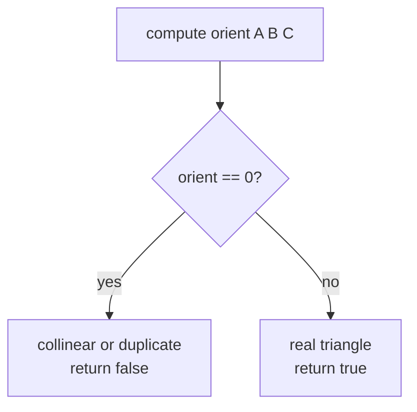
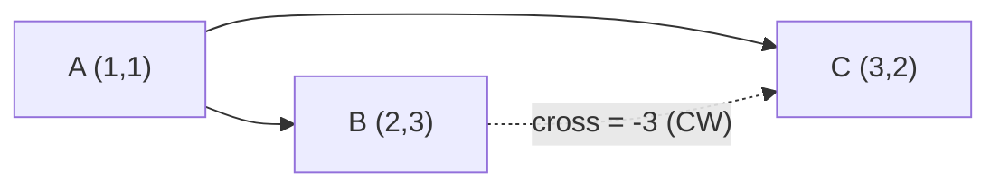
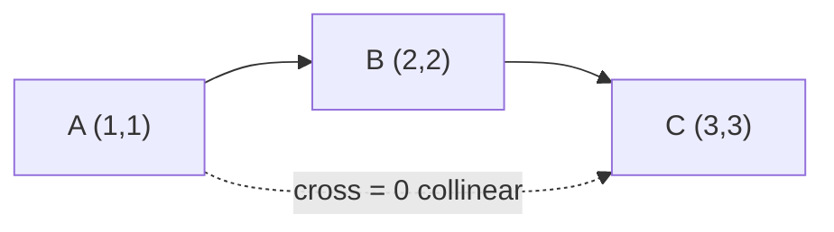

# Valid Boomerang (Cross-Product Collinearity Test)

| Meta | Value |
|------|-------|
| **Problem** | Valid Boomerang |
| **Source** | LeetCode 1037 |
| **Link** | https://leetcode.com/problems/valid-boomerang/ |
| **Difficulty** | Easy |
| **Topics** | Geometry, Cross product, Orientation, Collinearity |
| **Time** | $O(1)$ |
| **Space** | $O(1)$ |

---

## Problem Statement

Given an array `points` of **three** points in the plane, return `true` if these points form a
**boomerang**. A boomerang is a set of three points that are **all distinct** and **not in a
straight line** (not collinear).

```text
Input:  points = [[1,1],[2,3],[3,2]]
Output: true
Reason: the three points are distinct and form a real triangle.

Input:  points = [[1,1],[2,2],[3,3]]
Output: false
Reason: all three lie on the line y = x (collinear).

Input:  points = [[0,0],[0,0],[1,2]]
Output: false
Reason: two points coincide -> degenerate, zero area.
```

---

## Approach (WHY)

The naive instinct is to compute slopes and compare them, but slopes divide by $\Delta x$, which
explodes on vertical segments and loses precision. The clean, exact answer is the **cross
product**.

Three points $A, B, C$ are collinear **iff** the signed area of the triangle they span is zero.
That signed area (times two) is exactly the orientation value:

$$
\text{orient}(A,B,C) = (B-A)\times(C-A) = (B_x-A_x)(C_y-A_y) - (B_y-A_y)(C_x-A_x)
$$

The points form a boomerang **iff** this value is **non-zero**. Why does this also catch the
"two points coincide" case? If two points are equal, one of the vectors $B-A$ or $C-A$ is the
zero vector (or the two vectors are equal), so the cross product collapses to $0$ — handled for
free. A single integer comparison `orient != 0` decides everything, with no division and no
floating point.



---

## Solution

```python
from typing import List

def isBoomerang(points: List[List[int]]) -> bool:
    (ax, ay), (bx, by), (cx, cy) = points
    # orient = (B - A) x (C - A)
    orient = (bx - ax) * (cy - ay) - (by - ay) * (cx - ax)
    return orient != 0
```

```cpp
#include <bits/stdc++.h>
using namespace std;

class Solution {
public:
    bool isBoomerang(vector<vector<int>>& points) {
        long long ax = points[0][0], ay = points[0][1];
        long long bx = points[1][0], by = points[1][1];
        long long cx = points[2][0], cy = points[2][1];
        // orient = (B - A) x (C - A)
        long long orient = (bx - ax) * (cy - ay) - (by - ay) * (cx - ax);
        return orient != 0;
    }
};
```

---

## Trace

Take `points = [[1,1],[2,3],[3,2]]` with $A=(1,1)$, $B=(2,3)$, $C=(3,2)$.

| Step | Computation | Value |
|------|-------------|-------|
| $B - A$ | $(2-1,\ 3-1)$ | $(1, 2)$ |
| $C - A$ | $(3-1,\ 2-1)$ | $(2, 1)$ |
| cross | $1\cdot 1 - 2\cdot 2$ | $-3$ |
| result | $-3 \ne 0$ | **true** |

Now the collinear case `[[1,1],[2,2],[3,3]]`:

| Step | Computation | Value |
|------|-------------|-------|
| $B - A$ | $(1, 1)$ | $(1, 1)$ |
| $C - A$ | $(2, 2)$ | $(2, 2)$ |
| cross | $1\cdot 2 - 1\cdot 2$ | $0$ |
| result | $0 = 0$ | **false** |





---

## Math &amp; Complexity

The single orientation evaluation is the doubled signed area:

$$
2 \cdot \text{Area}(A,B,C) = (B_x-A_x)(C_y-A_y) - (B_y-A_y)(C_x-A_x)
$$

- **Time:** $O(1)$ — a fixed number of multiplications and subtractions.
- **Space:** $O(1)$ — no extra storage.
- **Precision:** exact in integers. With coordinates up to $10^9$ the terms reach $\approx
  10^{18}$, so use `long long` in C++ to avoid 32-bit overflow.

---

## Takeaway

"Are three points non-collinear?" is the cross product asking "is the triangle area non-zero?".
A single `orient(A, B, C) != 0` integer test answers it exactly — no slopes, no division, no
floating point, and the duplicate-point case is handled automatically.
