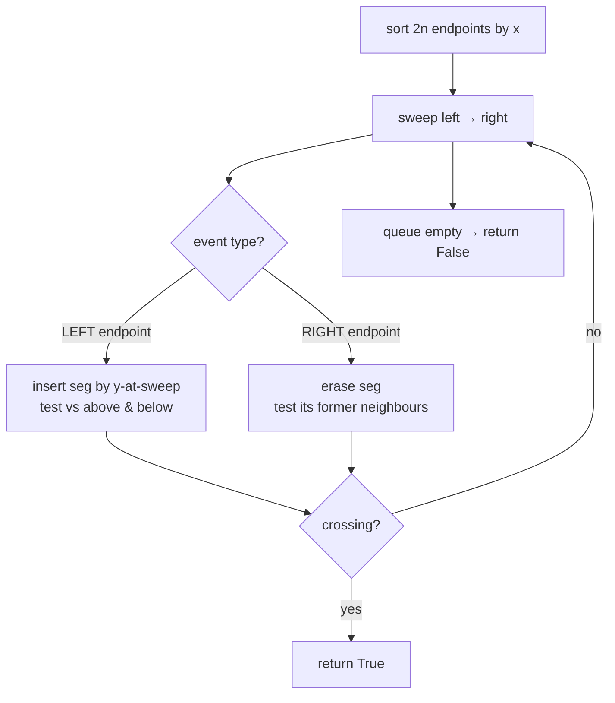
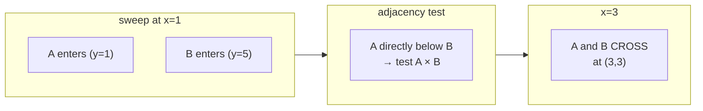
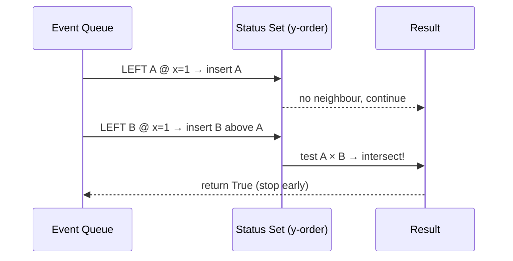
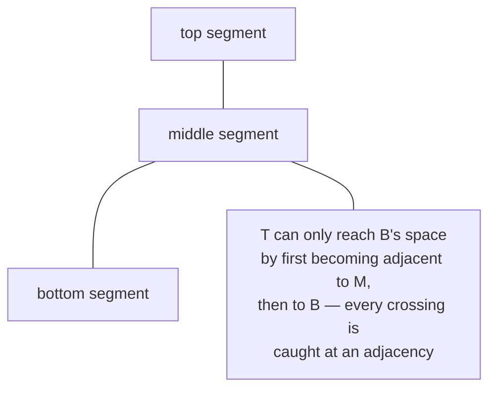

# Do Any Two Segments Intersect? (Shamos–Hoey Sweep)

| Meta | Value |
|------|-------|
| **Problem** | Decide whether any two of $n$ segments intersect |
| **Source** | Classic (Shamos–Hoey, 1976) — self-contained |
| **Difficulty** | Hard |
| **Topics** | Geometry, Line sweep, Balanced BST, Orientation |
| **Time** | $O(n \log n)$ |
| **Space** | $O(n)$ |

---

## Problem Statement

You are given $n$ line segments in the plane, each as two endpoints
$\big((x_1, y_1), (x_2, y_2)\big)$. Decide whether **any** two of them intersect (touching at a
shared point counts). Return `True`/`False`. You do **not** need to find the pair — just the
yes/no answer.

```text
Input:
  segments = [
    ((1, 1), (5, 5)),   # A: diagonal up
    ((1, 5), (5, 1)),   # B: diagonal down  -> crosses A at (3,3)
    ((6, 0), (6, 4)),   # C: vertical, far right
  ]
Output: True            # A and B cross at (3,3)

Input:
  segments = [
    ((0, 0), (2, 0)),   # bottom
    ((0, 1), (2, 1)),   # parallel above
    ((3, 0), (3, 2)),   # disjoint vertical
  ]
Output: False           # no two share a point
```

---

## Approach (WHY)

The brute force tests all $\binom{n}{2}$ pairs — $O(n^2)$. The sweep insight makes it
$O(n \log n)$:

> Two segments can intersect **only while they are adjacent in the vertical ($y$) order** of the
> segments the sweep line currently crosses.

Why is that true? Picture the sweep line just *before* two segments cross. Moving rightward, the
two segments approach each other in $y$; immediately before the crossing they must be vertical
neighbours in the active set — no other active segment can squeeze between them at the crossing
point. So if we only ever test **newly adjacent** pairs, we are guaranteed to test every pair
that actually intersects, while skipping the vast majority that never become neighbours.



The active set is a balanced BST (`std::set` / Python `SortedList`) keyed by each segment's $y$
at the current sweep $x$, giving $O(\log n)$ insert, erase, and neighbour lookup.

---

## Solution

```python
from sortedcontainers import SortedList

def sgn(v):
    return (v > 0) - (v < 0)

def cross(ox, oy, ax, ay, bx, by):
    # (a-o) x (b-o)
    return (ax - ox) * (by - oy) - (ay - oy) * (bx - ox)

def on_box(px, py, qx, qy, rx, ry):
    return min(px, qx) <= rx <= max(px, qx) and min(py, qy) <= ry <= max(py, qy)

def seg_intersect(s1, s2):
    (ax, ay), (bx, by) = s1
    (cx, cy), (dx, dy) = s2
    d1 = sgn(cross(cx, cy, dx, dy, ax, ay))
    d2 = sgn(cross(cx, cy, dx, dy, bx, by))
    d3 = sgn(cross(ax, ay, bx, by, cx, cy))
    d4 = sgn(cross(ax, ay, bx, by, dx, dy))
    if d1 != d2 and d3 != d4:
        return True
    if d1 == 0 and on_box(cx, cy, dx, dy, ax, ay): return True
    if d2 == 0 and on_box(cx, cy, dx, dy, bx, by): return True
    if d3 == 0 and on_box(ax, ay, bx, by, cx, cy): return True
    if d4 == 0 and on_box(ax, ay, bx, by, dx, dy): return True
    return False

def any_segments_intersect(segments):
    # Orient each segment left → right (break x-ties by y).
    segs = [tuple(sorted(s)) for s in segments]

    events = []
    for i, ((x1, y1), (x2, y2)) in enumerate(segs):
        events.append((x1, 0, i))   # 0 = left endpoint (insert first on ties)
        events.append((x2, 1, i))   # 1 = right endpoint
    events.sort()

    def ykey(i, x):
        (x1, y1), (x2, y2) = segs[i]
        if x1 == x2:                       # vertical: use lower y
            return float(y1)
        return y1 + (y2 - y1) * (x - x1) / (x2 - x1)

    status = SortedList()
    for x, kind, i in events:
        if kind == 0:                       # insert
            key = (ykey(i, x), i)
            status.add(key)
            pos = status.index(key)
            if pos > 0 and seg_intersect(segs[i], segs[status[pos - 1][1]]):
                return True
            if pos + 1 < len(status) and seg_intersect(segs[i], segs[status[pos + 1][1]]):
                return True
        else:                               # erase
            key = (ykey(i, x), i)
            pos = status.index(key)
            below = status[pos - 1] if pos > 0 else None
            above = status[pos + 1] if pos + 1 < len(status) else None
            status.remove(key)
            if below and above and seg_intersect(segs[below[1]], segs[above[1]]):
                return True
    return False
```

```cpp
#include <bits/stdc++.h>
using namespace std;

int sgn(long long v) { return (v > 0) - (v < 0); }

long long cross(long long ox, long long oy, long long ax, long long ay,
                long long bx, long long by) {
    return (ax - ox) * (by - oy) - (ay - oy) * (bx - ox);
}

bool on_box(long long px, long long py, long long qx, long long qy,
            long long rx, long long ry) {
    return min(px, qx) <= rx && rx <= max(px, qx) &&
           min(py, qy) <= ry && ry <= max(py, qy);
}

struct Seg { long long x1, y1, x2, y2; };

bool seg_intersect(const Seg& s, const Seg& t) {
    int d1 = sgn(cross(t.x1, t.y1, t.x2, t.y2, s.x1, s.y1));
    int d2 = sgn(cross(t.x1, t.y1, t.x2, t.y2, s.x2, s.y2));
    int d3 = sgn(cross(s.x1, s.y1, s.x2, s.y2, t.x1, t.y1));
    int d4 = sgn(cross(s.x1, s.y1, s.x2, s.y2, t.x2, t.y2));
    if (d1 != d2 && d3 != d4) return true;
    if (d1 == 0 && on_box(t.x1, t.y1, t.x2, t.y2, s.x1, s.y1)) return true;
    if (d2 == 0 && on_box(t.x1, t.y1, t.x2, t.y2, s.x2, s.y2)) return true;
    if (d3 == 0 && on_box(s.x1, s.y1, s.x2, s.y2, t.x1, t.y1)) return true;
    if (d4 == 0 && on_box(s.x1, s.y1, s.x2, s.y2, t.x2, t.y2)) return true;
    return false;
}

bool any_segments_intersect(vector<Seg> segs) {
    // Orient each segment left → right.
    for (auto& s : segs)
        if (make_pair(s.x1, s.y1) > make_pair(s.x2, s.y2)) {
            swap(s.x1, s.x2); swap(s.y1, s.y2);
        }

    struct Ev { long long x; int kind, i; };
    vector<Ev> events;
    for (int i = 0; i < (int)segs.size(); i++) {
        events.push_back({segs[i].x1, 0, i});  // left endpoint
        events.push_back({segs[i].x2, 1, i});  // right endpoint
    }
    sort(events.begin(), events.end(), [](const Ev& a, const Ev& b) {
        if (a.x != b.x) return a.x < b.x;
        return a.kind < b.kind;
    });

    const double EPS = 1e-9;
    long long sweep = 0;
    auto ykey = [&](int i) -> double {
        const Seg& g = segs[i];
        if (g.x1 == g.x2) return (double)g.y1;
        return g.y1 + (double)(g.y2 - g.y1) * (sweep - g.x1) / (g.x2 - g.x1);
    };

    // status set keyed by (y_at_sweep, index)
    set<pair<double,int>> status;
    for (auto& e : events) {
        sweep = e.x;
        if (e.kind == 0) {                  // insert
            auto it = status.insert({ykey(e.i), e.i}).first;
            if (it != status.begin() &&
                seg_intersect(segs[e.i], segs[prev(it)->second])) return true;
            if (next(it) != status.end() &&
                seg_intersect(segs[e.i], segs[next(it)->second])) return true;
        } else {                            // erase
            auto it = status.lower_bound({ykey(e.i) - EPS, e.i});
            while (it != status.end() && it->second != e.i) ++it;
            if (it != status.end()) {
                auto below = (it == status.begin()) ? status.end() : prev(it);
                auto above = next(it);
                if (below != status.end() && above != status.end() &&
                    seg_intersect(segs[below->second], segs[above->second]))
                    return true;
                status.erase(it);
            }
        }
    }
    return false;
}
```

---

## Trace

Using the first example: `A=((1,1),(5,5))`, `B=((1,5),(5,1))`, `C=((6,0),(6,4))`.

Sorted events by $x$ (left=0 before right=1 on ties):

| step | event | sweep $x$ | status (bottom→top, by $y$) | neighbour tests | result |
|------|-------|-----------|-----------------------------|-----------------|--------|
| 1 | LEFT A | 1 | `[A@1]` | none | — |
| 2 | LEFT B | 1 | `[A@1, B@5]` | A×B | **cross at (3,3)** → return `True` |

The sweep stops at the very second event. Notice $A$ enters at $y = 1$ and $B$ enters at
$y = 5$ (their values at $x = 1$); they are adjacent, the adjacency test runs, and the crossing is
found immediately — no need to ever look at $C$.

For the second (non-intersecting) example the active set never holds two segments that share a
point, every neighbour test fails, the queue drains, and we return `False`.

---

## Visualizing the Sweep

The sweep line moving across the three segments of example 1:



Event processing as a sequence:



Why only neighbours matter — a segment squeezed between two others cannot be crossed by them
without first becoming adjacent:



---

## Math & Complexity

Intersection of two segments uses **orientation signs**. With
$d_1 = \operatorname{sign}\big((D-C)\times(A-C)\big)$ and likewise $d_2, d_3, d_4$, the segments
**properly cross** iff

$$
d_1 \ne d_2 \quad\text{and}\quad d_3 \ne d_4 .
$$

Collinear touching is handled by the bounding-box (`on_box`) checks when a sign is $0$.

Cost accounting:

- $2n$ events, sorted once: $O(n \log n)$.
- Each event does $O(\log n)$ BST work plus $O(1)$ segment tests.

$$
\text{Total} = O(n \log n), \qquad \text{Space} = O(n).
$$

Compared to the $O(n^2)$ all-pairs check, the sweep wins decisively once $n$ is more than a few
hundred.

---

## Takeaway

The Shamos–Hoey sweep is the **decision** core of Bentley–Ottmann: sort endpoints into events,
keep the active segments in a BST ordered by $y$-at-sweep, and test **only newly adjacent
pairs**. Adjacency is the whole trick — every real crossing is preceded by the two segments
becoming neighbours, so testing neighbours alone never misses an intersection while collapsing
$O(n^2)$ into $O(n \log n)$.
