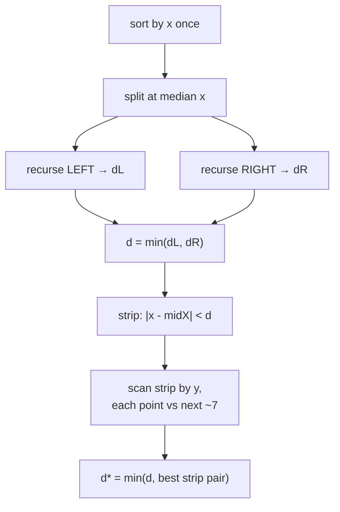
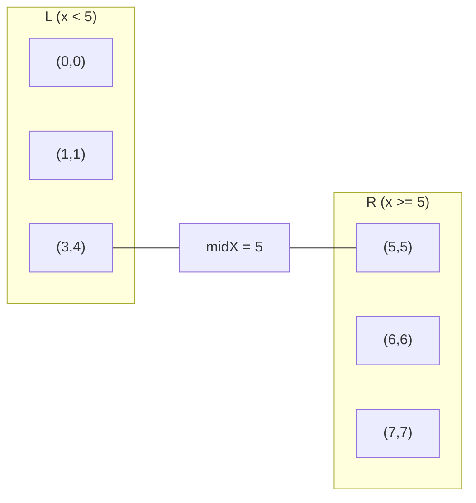
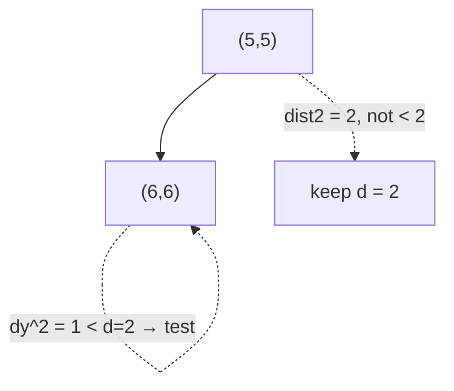
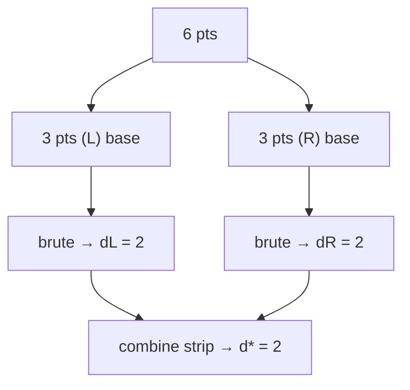

# Closest Pair of Points — Divide & Conquer

| Meta | Value |
|------|-------|
| **Problem** | Minimum distance between any two of $n$ points |
| **Source** | Classic computational geometry (self-contained) |
| **Difficulty** | Hard |
| **Topics** | Geometry, Divide & conquer, Sorting, Strip / 7-neighbour bound |
| **Time** | $O(n \log n)$ |
| **Space** | $O(n)$ |

---

## Problem Statement

You are given $n$ distinct (or possibly repeated) points $p_1, \dots, p_n$ in the plane. Find the
**smallest Euclidean distance** between any two of them:
$$
d^\* = \min_{i \ne j} \sqrt{(x_i - x_j)^2 + (y_i - y_j)^2}.
$$
Report $d^\*$ (and, if asked, the pair achieving it). Internally we work with the **squared**
distance to stay in exact integers.

```text
Input:
6
0 0
3 4
1 1
6 6
7 7
5 5
Output:
closest squared distance = 2     (points (6,6) and (7,7), and (5,5)-(6,6))
closest real distance     = 1.41421356
```

---

## Approach (WHY)

Comparing all $\binom{n}{2}$ pairs is $O(n^2)$ — too slow for large $n$. The **divide & conquer**
insight: sort by $x$, split at the median, solve each half, and observe that the only *new* pairs to
check straddle the dividing line. Crucially, any straddling pair closer than the current best $d$
must sit inside a **vertical strip of width $2d$**, and within that strip — scanned in $y$ order —
each point can have **only a constant number ($\le 7$)** of close partners. That makes the combine
step $O(n)$ and the whole algorithm $O(n \log n)$.



The *WHY* of the constant bound: split the $d \times 2d$ region above a strip point into eight
$\tfrac{d}{2}$-side boxes; each box has diagonal $\tfrac{d}{\sqrt2} < d$, so it holds at most one
point — at most 8 points total, hence $\le 7$ neighbours to test.

---

## Solution

```python
import math
from typing import List, Tuple

class Point:
    __slots__ = ("x", "y")
    def __init__(self, x: int, y: int):
        self.x = x
        self.y = y

def dist2(a: Point, b: Point) -> int:
    dx = a.x - b.x
    dy = a.y - b.y
    return dx * dx + dy * dy

def closest_pair(pts: List[Point]) -> Tuple[int, Point, Point]:
    px = sorted(pts, key=lambda p: (p.x, p.y))

    def rec(a: int, b: int):
        n = b - a
        if n <= 3:                                   # base case: brute force
            best, pa, pb = math.inf, None, None
            for i in range(a, b):
                for j in range(i + 1, b):
                    d = dist2(px[i], px[j])
                    if d < best:
                        best, pa, pb = d, px[i], px[j]
            return best, pa, pb, sorted(px[a:b], key=lambda p: p.y)

        mid = (a + b) // 2
        midx = px[mid].x
        dl, al, bl, ly = rec(a, mid)
        dr, ar, br, ry = rec(mid, b)
        best, pa, pb = (dl, al, bl) if dl <= dr else (dr, ar, br)

        ys = []                                      # merge halves by y in O(n)
        i = j = 0
        while i < len(ly) and j < len(ry):
            if ly[i].y <= ry[j].y:
                ys.append(ly[i]); i += 1
            else:
                ys.append(ry[j]); j += 1
        ys.extend(ly[i:]); ys.extend(ry[j:])

        strip = [p for p in ys if (p.x - midx) ** 2 < best]
        for s in range(len(strip)):                  # only next ~7 by y
            t = s + 1
            while t < len(strip) and (strip[t].y - strip[s].y) ** 2 < best:
                d = dist2(strip[s], strip[t])
                if d < best:
                    best, pa, pb = d, strip[s], strip[t]
                t += 1
        return best, pa, pb, ys

    best, pa, pb, _ = rec(0, len(px))
    return best, pa, pb                              # best is SQUARED
```

```cpp
#include <bits/stdc++.h>
using namespace std;

struct Point {
    long long x, y;
};

long long dist2(const Point &a, const Point &b) {
    long long dx = a.x - b.x;
    long long dy = a.y - b.y;
    return dx * dx + dy * dy;
}

struct Result { long long best; Point a, b; };

static Result rec(vector<Point> &px, int a, int b, vector<Point> &ys) {
    int n = b - a;
    if (n <= 3) {                                    // base case: brute force
        Result r{LLONG_MAX, {}, {}};
        for (int i = a; i < b; ++i)
            for (int j = i + 1; j < b; ++j) {
                long long d = dist2(px[i], px[j]);
                if (d < r.best) { r.best = d; r.a = px[i]; r.b = px[j]; }
            }
        ys.assign(px.begin() + a, px.begin() + b);
        sort(ys.begin(), ys.end(), [](const Point &p, const Point &q){ return p.y < q.y; });
        return r;
    }

    int mid = (a + b) / 2;
    long long midx = px[mid].x;
    vector<Point> ly, ry;
    Result rl = rec(px, a, mid, ly);
    Result rr = rec(px, mid, b, ry);
    Result best = (rl.best <= rr.best) ? rl : rr;

    ys.clear(); ys.reserve(n);                       // merge halves by y in O(n)
    int i = 0, j = 0;
    while (i < (int)ly.size() && j < (int)ry.size()) {
        if (ly[i].y <= ry[j].y) ys.push_back(ly[i++]);
        else                    ys.push_back(ry[j++]);
    }
    while (i < (int)ly.size()) ys.push_back(ly[i++]);
    while (j < (int)ry.size()) ys.push_back(ry[j++]);

    vector<Point> strip;
    for (const Point &p : ys)
        if ((p.x - midx) * (p.x - midx) < best.best) strip.push_back(p);

    for (int s = 0; s < (int)strip.size(); ++s)      // only next ~7 by y
        for (int t = s + 1; t < (int)strip.size() &&
             (strip[t].y - strip[s].y) * (strip[t].y - strip[s].y) < best.best; ++t) {
            long long d = dist2(strip[s], strip[t]);
            if (d < best.best) { best.best = d; best.a = strip[s]; best.b = strip[t]; }
        }
    return best;
}

Result closestPair(vector<Point> pts) {
    sort(pts.begin(), pts.end(), [](const Point &p, const Point &q){
        return p.x != q.x ? p.x < q.x : p.y < q.y;
    });
    vector<Point> ys;
    return rec(pts, 0, (int)pts.size(), ys);         // best is SQUARED
}

int main() {
    int n;
    if (!(cin >> n)) return 0;
    vector<Point> pts(n);
    for (auto &p : pts) cin >> p.x >> p.y;
    Result r = closestPair(pts);
    cout << "closest squared distance = " << r.best << "\n";
    cout << fixed << setprecision(8)
         << "closest real distance     = " << sqrt((double)r.best) << "\n";
    return 0;
}
```

---

## Trace

Points: `(0,0) (3,4) (1,1) (6,6) (7,7) (5,5)`. Sorted by $x$:
`(0,0) (1,1) (3,4) (5,5) (6,6) (7,7)`.

| Step | Action | Result |
|------|--------|--------|
| Split | median between `(3,4)` and `(5,5)` | L = first 3, R = last 3 |
| L base | brute `(0,0)(1,1)(3,4)` | $d_L = 2$ via `(0,0)-(1,1)` |
| R base | brute `(5,5)(6,6)(7,7)` | $d_R = 2$ via `(5,5)-(6,6)` |
| Combine | $d = 2$, midX $= 5$, strip $|x-5|^2 < 2$ | strip = `(5,5)(6,6)` |
| Strip scan | `(5,5)-(6,6)` → $2$ | no improvement |
| Answer | | $d^\* = \sqrt 2 \approx 1.414$ |



The strip after combining, scanned bottom-up by $y$:



The recursion tree for the 6 points:



---

## Math & Complexity

The recurrence is
$$
T(n) = 2\,T\!\left(\tfrac{n}{2}\right) + O(n) = O(n \log n),
$$
where the $O(n)$ combine relies on the constant-neighbour bound inside the strip. The $y$-order is
maintained by **merging** sorted halves on the way up (like merge sort), avoiding an extra
$\log n$ factor.

- **Time:** $O(n \log n)$.
- **Space:** $O(n)$ for the recursion and the merged $y$-lists.
- **Exactness:** all comparisons use squared distances in `long long`; `sqrt` is taken once at the
  end. With $|x|,|y| \le 10^9$, $d^2 \le 2\times10^{18}$ fits a signed 64-bit integer.

---

## Takeaway

Sort once by $x$, recurse, and let geometry shrink the combine: a strip of width $2d$ scanned in
$y$ order needs only a **constant number of neighbour checks per point**. That single observation
turns an $O(n^2)$ all-pairs scan into an $O(n \log n)$ algorithm — and comparing **squared**
distances keeps every step exact.
