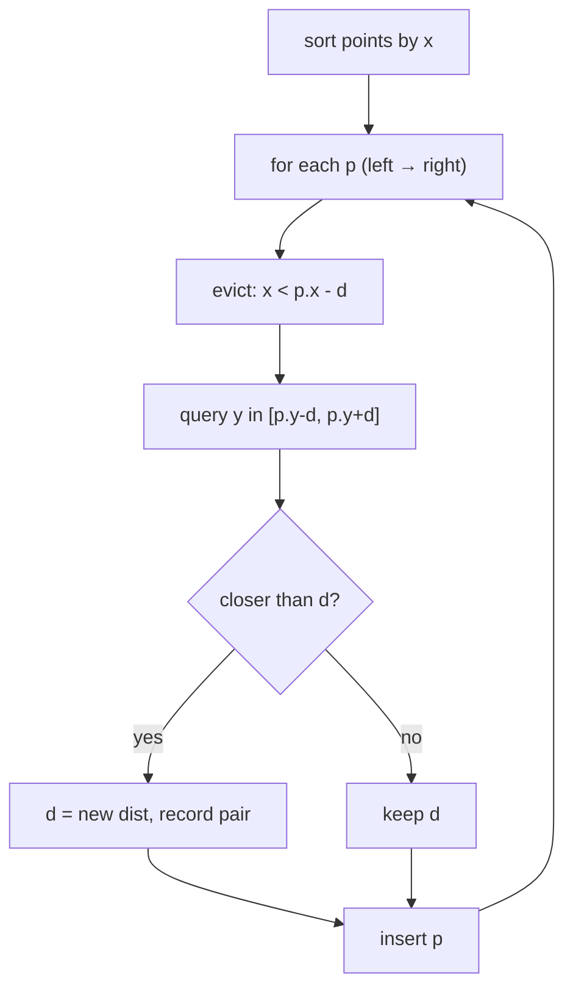
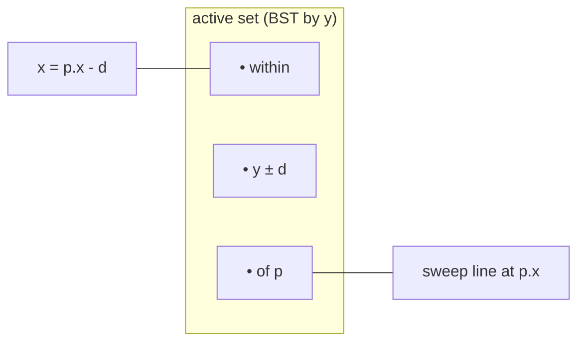
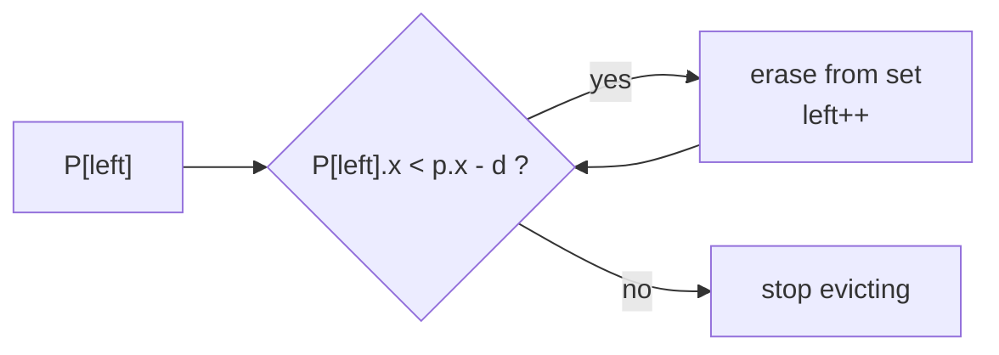
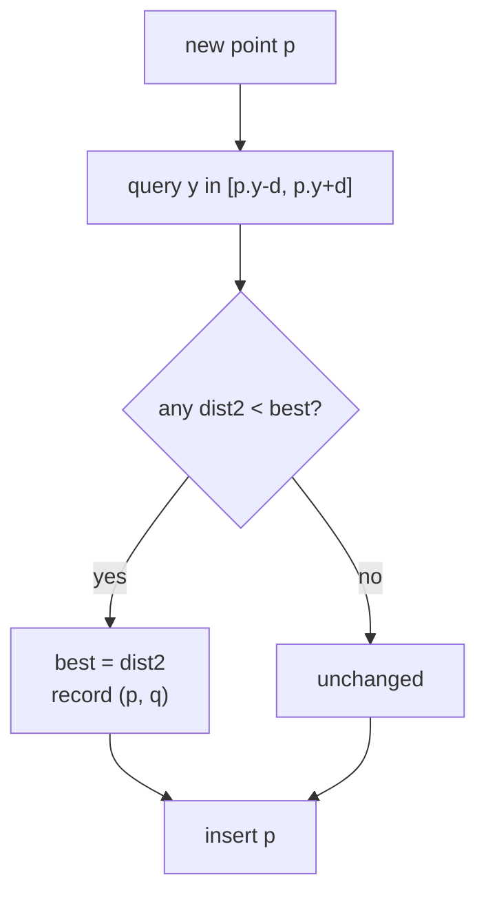

# Closest Pair of Points — Sweep Line with an Ordered Set

| Meta | Value |
|------|-------|
| **Problem** | Minimum distance between any two of $n$ points |
| **Source** | Classic computational geometry (self-contained) |
| **Difficulty** | Hard |
| **Topics** | Geometry, Sweep line, Ordered set (`std::set` / `SortedList`), Sorting |
| **Time** | $O(n \log n)$ |
| **Space** | $O(n)$ |

---

## Problem Statement

Given $n$ points in the plane, find the **smallest Euclidean distance** between any two of them.
This file solves the exact same task as the divide & conquer version, but with a **sweep line** and a
**balanced BST ordered by $y$**, which is often shorter to code.

```text
Input:
5
2 3
12 30
40 50
5 1
12 10
Output:
closest squared distance = 10    (points (2,3) and (5,1))
closest real distance     = 3.16227766
```

---

## Approach (WHY)

Process points left to right by $x$. Maintain the best distance $d$ found so far and an **active
set** of points whose $x$ lies within $d$ of the sweep line, stored in a BST keyed by $y$. For the
new point $p$:

1. **Evict** active points with $x < p_x - d$ — too far left to ever help again.
2. **Query** the set for $y \in [p_y - d,\, p_y + d]$ — a contiguous slice, since the set is ordered
   by $y$. Only those can beat $d$ (same strip geometry: a constant number of them).
3. **Update** $d$ if any is closer, then **insert** $p$.



The *WHY* it stays $O(n \log n)$: by the closest-pair strip bound, at most a constant number of
active points fall in the $2d \times 2d$ box around $p$, so each query touches $O(1)$ points; each
insert/erase is $O(\log n)$. Every point is inserted once and evicted once.

---

## Solution

```python
import math
from typing import List, Tuple
from sortedcontainers import SortedList

class Point:
    __slots__ = ("x", "y")
    def __init__(self, x: int, y: int):
        self.x = x
        self.y = y

def dist2(a: Point, b: Point) -> int:
    dx = a.x - b.x
    dy = a.y - b.y
    return dx * dx + dy * dy

def closest_pair(pts: List[Point]) -> Tuple[int, Point, Point]:
    P = sorted(pts, key=lambda p: (p.x, p.y))
    n = len(P)
    if n < 2:
        return math.inf, None, None

    best = dist2(P[0], P[1])
    ba, bb = P[0], P[1]
    active = SortedList(key=lambda p: p.y)           # ordered by y
    active.add(P[0]); active.add(P[1])
    left = 0

    for i in range(2, n):
        p = P[i]
        d = math.isqrt(best) + 1                      # integer window half-width
        while left < i and P[left].x < p.x - d:       # evict stale points
            active.remove(P[left])
            left += 1
        lo = active.bisect_key_left(p.y - d)          # y-window slice
        hi = active.bisect_key_right(p.y + d)
        for k in range(lo, hi):
            q = active[k]
            dd = dist2(p, q)
            if dd < best:
                best, ba, bb = dd, p, q
        active.add(p)
    return best, ba, bb                               # best is SQUARED
```

```cpp
#include <bits/stdc++.h>
using namespace std;

struct Point {
    long long x, y;
};

long long dist2(const Point &a, const Point &b) {
    long long dx = a.x - b.x;
    long long dy = a.y - b.y;
    return dx * dx + dy * dy;
}

struct Result { long long best; Point a, b; };

Result closestPair(vector<Point> pts) {
    sort(pts.begin(), pts.end(), [](const Point &p, const Point &q){
        return p.x != q.x ? p.x < q.x : p.y < q.y;
    });
    int n = (int)pts.size();
    Result res{LLONG_MAX, {}, {}};
    if (n < 2) return res;

    auto cmp = [](const Point &p, const Point &q){    // ordered by (y, x)
        return p.y != q.y ? p.y < q.y : p.x < q.x;
    };
    set<Point, decltype(cmp)> active(cmp);
    res.best = dist2(pts[0], pts[1]); res.a = pts[0]; res.b = pts[1];
    active.insert(pts[0]); active.insert(pts[1]);
    int left = 0;

    for (int i = 2; i < n; ++i) {
        Point p = pts[i];
        long long d = (long long)sqrtl((long double)res.best) + 1; // window half-width
        while (left < i && pts[left].x < p.x - d) {   // evict stale points
            active.erase(pts[left]);
            ++left;
        }
        auto lo = active.lower_bound(Point{LLONG_MIN, p.y - d});   // y-window slice
        auto hi = active.upper_bound(Point{LLONG_MAX, p.y + d});
        for (auto it = lo; it != hi; ++it) {
            long long dd = dist2(p, *it);
            if (dd < res.best) { res.best = dd; res.a = p; res.b = *it; }
        }
        active.insert(p);
    }
    return res;                                       // best is SQUARED
}

int main() {
    int n;
    if (!(cin >> n)) return 0;
    vector<Point> pts(n);
    for (auto &p : pts) cin >> p.x >> p.y;
    Result r = closestPair(pts);
    cout << "closest squared distance = " << r.best << "\n";
    cout << fixed << setprecision(8)
         << "closest real distance     = " << sqrt((double)r.best) << "\n";
    return 0;
}
```

---

## Trace

Points sorted by $x$: `(2,3) (5,1) (12,10) (12,30) (40,50)`.

| $i$ | $p$ | $d=\lfloor\sqrt{best}\rfloor{+}1$ | evict $x < p_x - d$ | $y$-window query | best update |
|-----|-----|------|----------|----------|-------------|
| init | seed `(2,3),(5,1)` | — | — | — | best $= 10$ |
| 2 | `(12,10)` | 4 | drop $x<8$ → evict `(2,3),(5,1)` | none in $[6,14]$ | best $= 10$ |
| 3 | `(12,30)` | 4 | drop $x<8$ | `(12,10)`? $y$ not in $[26,34]$ | best $= 10$ |
| 4 | `(40,50)` | 4 | drop $x<36$ → evict all | none | best $= 10$ |

Final: best squared $= 10$ from the seed pair `(2,3)-(5,1)`, real $=\sqrt{10}\approx 3.162$.

The sweep with its moving window of width $d$:



Eviction trims everything left of the window:



The per-point decision flow:



---

## Math & Complexity

Each point is inserted and erased **once**; both are $O(\log n)$ in a balanced BST. The $y$-window
query returns $O(1)$ points by the strip bound, so the per-point work is $O(\log n)$ and the total is
$$
O(n \log n).
$$

- **Time:** $O(n \log n)$.
- **Space:** $O(n)$ for the active set.
- **Pruning vs acceptance:** we shrink the window using the **integer** bound
  $d = \lfloor\sqrt{\text{best}}\rfloor + 1$ so no true neighbour is skipped, but every candidate is
  accepted only by the exact **squared** comparison `dist2 < best`. Squared distances reach
  $\sim 2\times10^{18}$ → use `long long`.

---

## Takeaway

A sweep line plus a $y$-ordered balanced BST gives the same $O(n \log n)$ closest pair as divide &
conquer, with less code. Keep a window of width $d$ behind the sweep, **evict** stale points, query a
small $y$-slice, and compare **squared** distances — the strip geometry guarantees each query is
$O(1)$.
