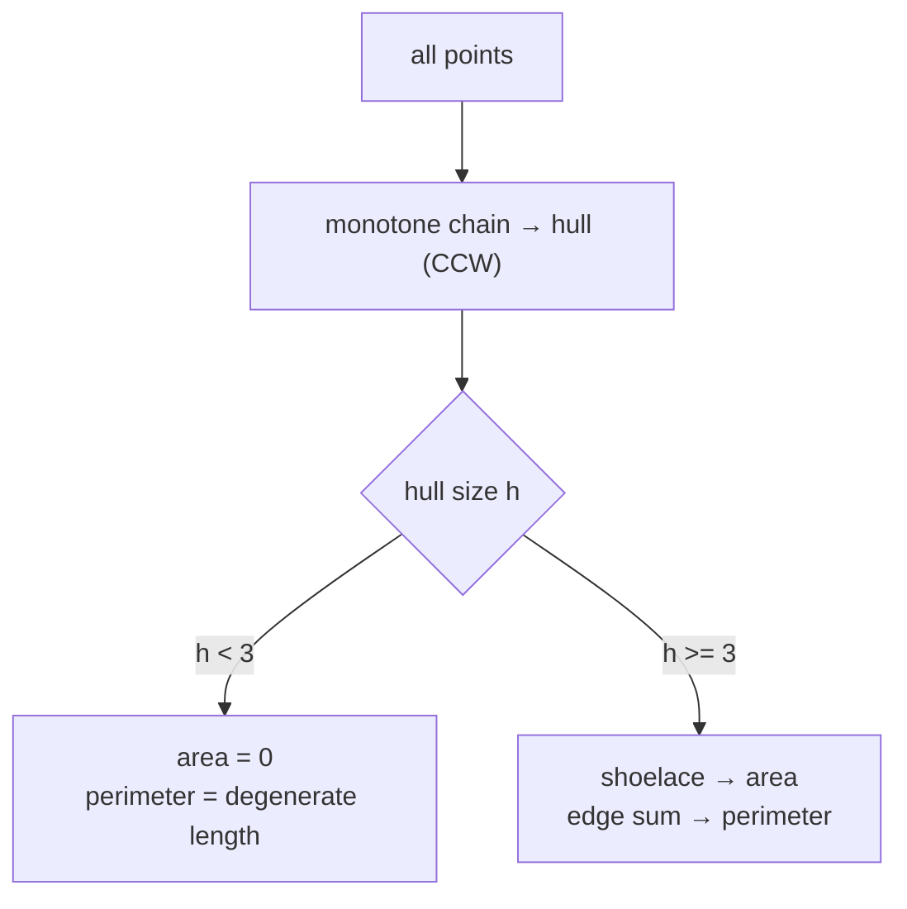
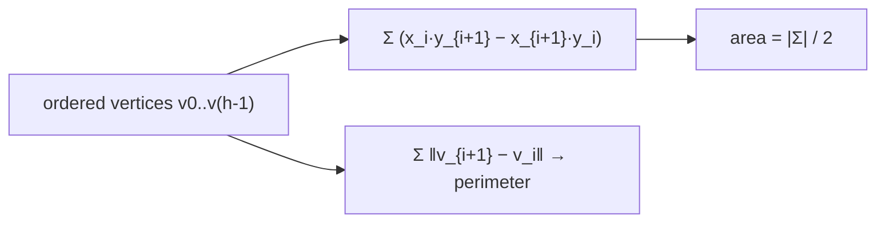
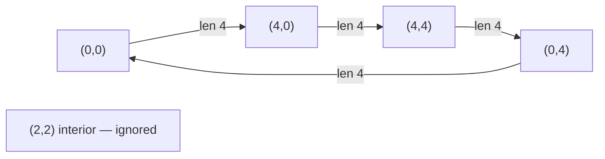
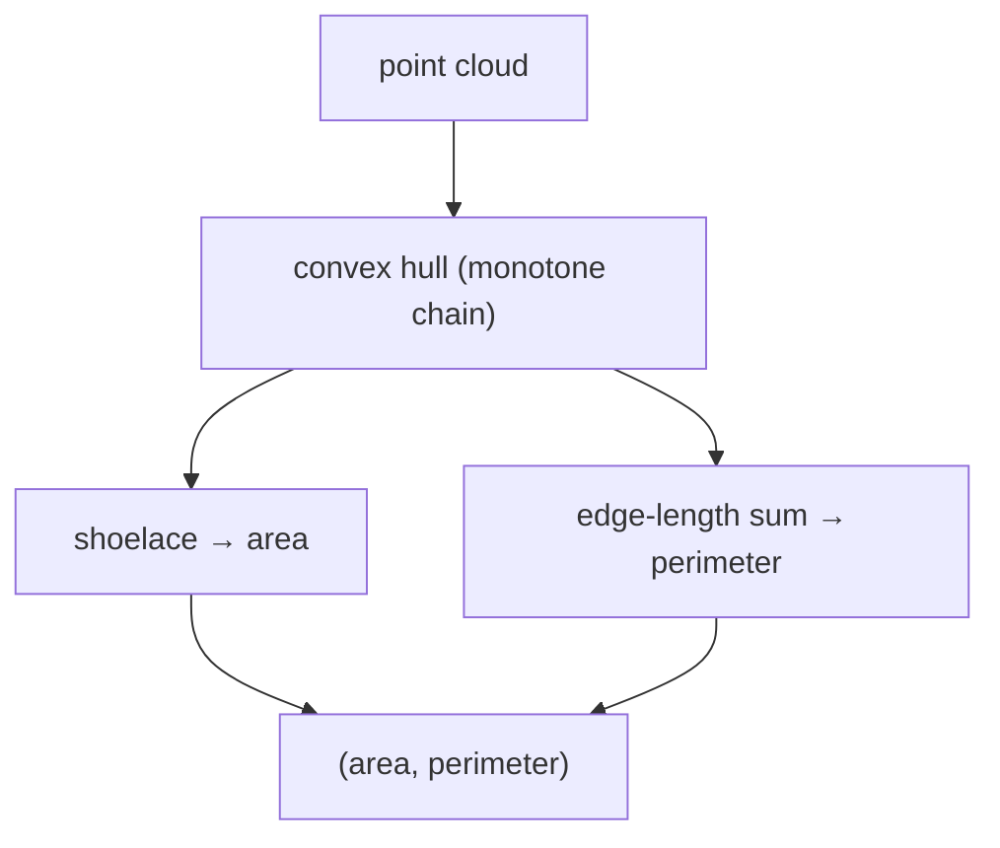
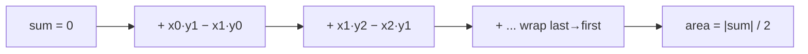
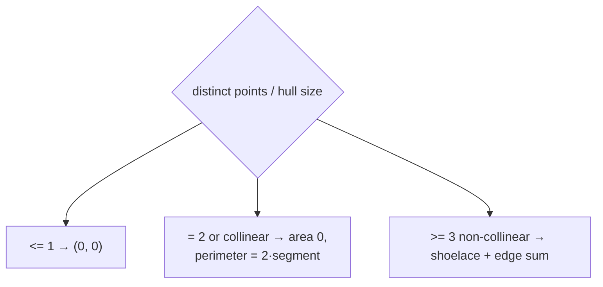

# Area & Perimeter of a Convex Hull

| Meta | Value |
|------|-------|
| **Problem** | Convex Hull Area & Perimeter |
| **Source** | Self-contained (computational geometry) |
| **Reference** | Monotone chain + shoelace |
| **Difficulty** | Medium |
| **Topics** | Geometry, Convex hull, Shoelace formula, Euclidean distance |
| **Time** | $O(n \log n)$ |
| **Space** | $O(n)$ |

---

## Problem Statement

Given $n$ points in the plane, compute the **area** and **perimeter** of their convex hull (the smallest convex
polygon enclosing all points). Return both values; if the points are collinear or fewer than 3 distinct, the
area is $0$.

```text
Input:  points = [(0,0),(4,0),(4,4),(0,4),(2,2)]
Output: area = 16.0, perimeter = 16.0
(the hull is the 4x4 square; (2,2) is interior)

Input:  points = [(0,0),(2,0),(4,0)]
Output: area = 0.0, perimeter = 8.0
(collinear → degenerate; perimeter is the back-and-forth segment length 2*4)
```

---

## Approach (WHY)

First build the convex hull with **monotone chain** ($O(n \log n)$). Then apply the **shoelace formula** to the
ordered hull vertices for the area and sum consecutive **Euclidean edge lengths** for the perimeter.

The *WHY*: area and perimeter only depend on the hull boundary, not the interior cloud, so we shrink the
problem to the $O(h)$ hull vertices first. The shoelace formula computes twice the signed area as a sum of
cross products of consecutive vertices — it stays in **integers**, so we keep exactness until the final
division by 2. Perimeter needs real distances, so only there do we switch to `double`/`sqrt`.





---

## Solution

```python
import math

def hull_area_perimeter(points):
    pts = sorted(set(points))                         # dedupe + sort by (x, y)

    def cross(o, a, b):
        return (a[0] - o[0]) * (b[1] - o[1]) - (a[1] - o[1]) * (b[0] - o[0])

    def build(seq):
        h = []
        for p in seq:
            while len(h) >= 2 and cross(h[-2], h[-1], p) <= 0:
                h.pop()
            h.append(p)
        return h

    if len(pts) <= 1:
        return 0.0, 0.0
    if len(pts) == 2:
        return 0.0, 2 * math.dist(pts[0], pts[1])     # back-and-forth segment

    hull = build(pts)[:-1] + build(list(reversed(pts)))[:-1]
    h = len(hull)
    if h < 3:
        return 0.0, 2 * math.dist(hull[0], hull[1])

    area2 = 0
    perim = 0.0
    for i in range(h):
        a, b = hull[i], hull[(i + 1) % h]
        area2 += a[0] * b[1] - b[0] * a[1]            # shoelace term (integer)
        perim += math.dist(a, b)
    return abs(area2) / 2.0, perim

print(hull_area_perimeter([(0,0),(4,0),(4,4),(0,4),(2,2)]))  # (16.0, 16.0)
```

```cpp
#include <bits/stdc++.h>
using namespace std;

struct Point {
    long long x, y;
};

// (a - o) x (b - o); >0 CCW, <0 CW, =0 collinear
long long cross(const Point &o, const Point &a, const Point &b) {
    return (a.x - o.x) * (b.y - o.y) - (a.y - o.y) * (b.x - o.x);
}

double dist(const Point &a, const Point &b) {
    double dx = (double)(a.x - b.x), dy = (double)(a.y - b.y);
    return sqrt(dx * dx + dy * dy);
}

vector<Point> build(const vector<Point> &seq) {
    vector<Point> h;
    for (const Point &p : seq) {
        while (h.size() >= 2 && cross(h[h.size() - 2], h.back(), p) <= 0)
            h.pop_back();
        h.push_back(p);
    }
    return h;
}

pair<double, double> hull_area_perimeter(vector<Point> pts) {
    sort(pts.begin(), pts.end(), [](const Point &a, const Point &b) {
        return a.x != b.x ? a.x < b.x : a.y < b.y;        // sort by (x, y)
    });
    pts.erase(unique(pts.begin(), pts.end(), [](const Point &a, const Point &b) {
        return a.x == b.x && a.y == b.y;                  // dedupe
    }), pts.end());

    int n = (int)pts.size();
    if (n <= 1) return {0.0, 0.0};
    if (n == 2) return {0.0, 2.0 * dist(pts[0], pts[1])}; // back-and-forth segment

    vector<Point> rev(pts.rbegin(), pts.rend());
    vector<Point> lo = build(pts), up = build(rev);
    vector<Point> hull;
    for (int i = 0; i + 1 < (int)lo.size(); ++i) hull.push_back(lo[i]);
    for (int i = 0; i + 1 < (int)up.size(); ++i) hull.push_back(up[i]);

    int h = (int)hull.size();
    if (h < 3) return {0.0, 2.0 * dist(hull[0], hull[1])};

    long long area2 = 0;                                  // shoelace (integer)
    double perim = 0.0;
    for (int i = 0; i < h; ++i) {
        const Point &a = hull[i];
        const Point &b = hull[(i + 1) % h];
        area2 += a.x * b.y - b.x * a.y;
        perim += dist(a, b);
    }
    return {llabs(area2) / 2.0, perim};
}

int main() {
    vector<Point> pts = {{0,0},{4,0},{4,4},{0,4},{2,2}};
    auto [area, perim] = hull_area_perimeter(pts);
    cout << fixed << setprecision(1);
    cout << "area = " << area << ", perimeter = " << perim << "\n"; // 16.0, 16.0
    return 0;
}
```

---

## Trace

Points `[(0,0),(4,0),(4,4),(0,4),(2,2)]`. Hull = the square `(0,0) (4,0) (4,4) (0,4)`; `(2,2)` is interior.

**Shoelace** over CCW vertices (twice signed area):

| Edge $i \to i+1$ | $x_i y_{i+1} - x_{i+1} y_i$ |
|------------------|------------------------------|
| (0,0)→(4,0) | $0\cdot0 - 4\cdot0 = 0$ |
| (4,0)→(4,4) | $4\cdot4 - 4\cdot0 = 16$ |
| (4,4)→(0,4) | $4\cdot4 - 0\cdot4 = 16$ |
| (0,4)→(0,0) | $0\cdot0 - 0\cdot4 = 0$ |
| **Sum** | $32$ |

$\text{area} = |32| / 2 = 16$.

**Perimeter** = $4 + 4 + 4 + 4 = 16$ (each side length 4).



---

## Diagrams

Pipeline from cloud to two numbers:



Shoelace as a running sum of trapezoid signed areas:



Degenerate handling for small / collinear inputs:



---

## Math / Complexity

Building the hull costs $O(n \log n)$ (sort-dominated). The shoelace pass and perimeter pass each visit the
$h$ hull vertices once, $O(h) \le O(n)$. Overall:

$$
T = O(n \log n), \qquad S = O(n).
$$

The shoelace formula for a simple polygon with vertices $v_0, \dots, v_{h-1}$ is

$$
\text{Area} = \frac{1}{2}\left| \sum_{i=0}^{h-1} \big(x_i\,y_{i+1} - x_{i+1}\,y_i\big) \right|,
\qquad
\text{Perimeter} = \sum_{i=0}^{h-1} \sqrt{(x_{i+1}-x_i)^2 + (y_{i+1}-y_i)^2},
$$

indices modulo $h$. The signed sum is computed in `long long` (exact); only the perimeter uses `sqrt`, so the
single source of floating error is the distance accumulation — area remains exact up to the final $/2$.

---

## Takeaway

Area and perimeter of a convex hull are a **two-step recipe**: build the hull with monotone chain, then run
the integer **shoelace** for area and an edge-length sum for perimeter. Keep the shoelace in `long long` for
exactness and only convert to `double` for distances — a clean separation of exact and floating arithmetic.
