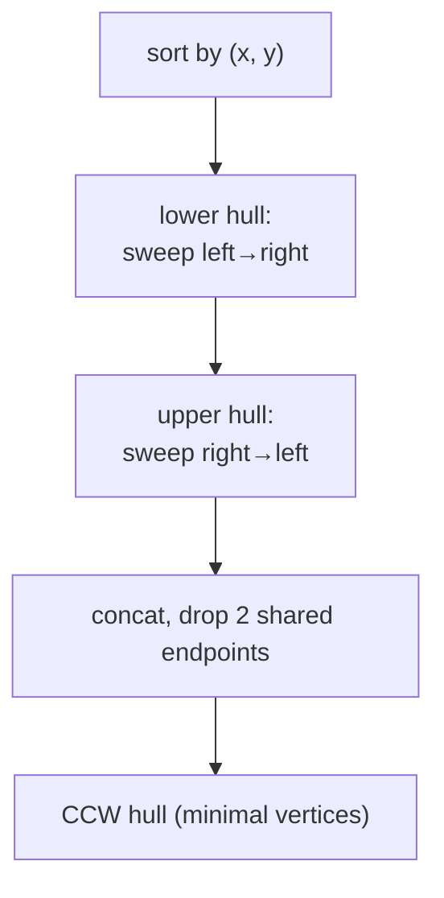
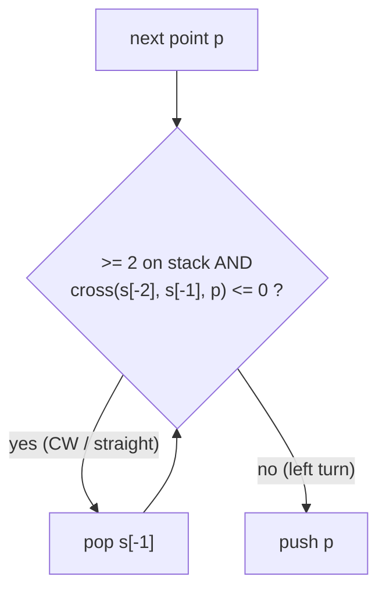
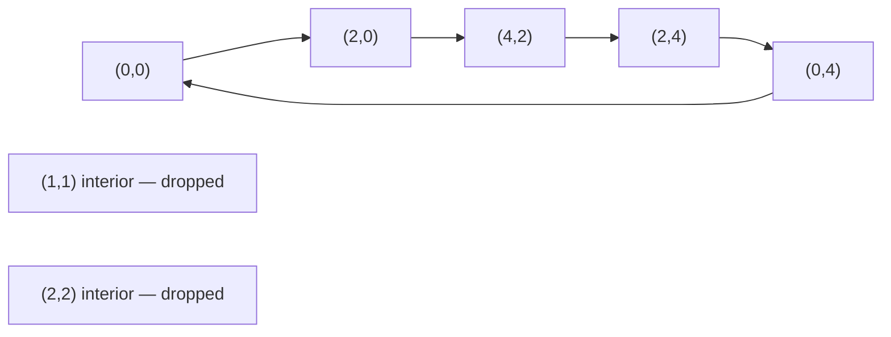
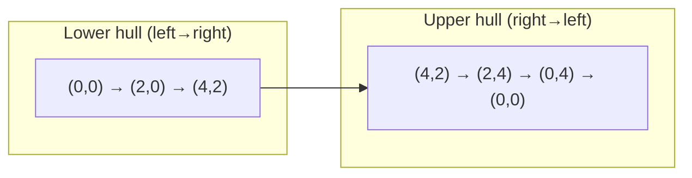
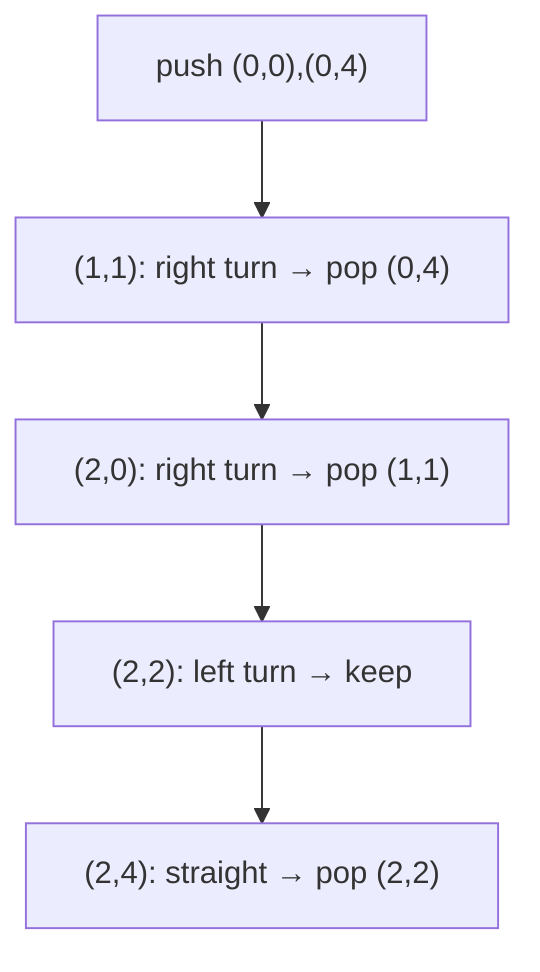

# Convex Hull of a Point Set (Andrew's Monotone Chain)

| Meta | Value |
|------|-------|
| **Problem** | Convex Hull (Monotone Chain) |
| **Source** | Self-contained (computational geometry) |
| **Reference** | Andrew's monotone chain |
| **Difficulty** | Medium |
| **Topics** | Geometry, Convex hull, Sorting, Monotonic stack |
| **Time** | $O(n \log n)$ |
| **Space** | $O(n)$ |

---

## Problem Statement

Given $n$ points in the plane, compute their **convex hull**: the smallest convex polygon that contains all the
points. Return the hull vertices in **counter-clockwise** order, using the *minimal* vertex set (drop any point
that lies strictly **on** a hull edge).

```text
Input:  points = [(0,0),(1,1),(2,2),(2,0),(2,4),(0,4),(4,2)]
Output: [(0,0),(2,0),(4,2),(2,4),(0,4)]
(the 5 extreme corners; (1,1) is interior, (2,2) is interior — both dropped)

Input:  points = [(0,0),(1,0),(2,0)]
Output: [(0,0),(2,0)]
(all collinear → hull degenerates to the extreme segment endpoints)
```

---

## Approach (WHY)

Sort the points by $(x, y)$. Sweep left→right building the **lower hull**, then right→left building the
**upper hull**. Each sweep keeps a stack and pops any point that would create a **non-counter-clockwise**
turn (`cross <= 0`), which removes both interior dents and on-edge collinear points, yielding the minimal
boundary.

The *WHY*: after sorting, the lower hull is the chain of points you'd see looking up from below, and the
upper hull is what you'd see looking down from above. A point belongs to a convex chain only if every
consecutive triple turns left; the moment a triple turns right or goes straight, the middle point is
interior to the chain and must be popped. Because each point is pushed once and popped at most once, the two
sweeps together are linear after the sort.





---

## Solution

```python
def convex_hull(points):
    pts = sorted(set(points))                  # dedupe + sort by (x, y)
    n = len(pts)
    if n <= 2:
        return pts                             # 0,1,2 points: hull is themselves

    def cross(o, a, b):
        return (a[0] - o[0]) * (b[1] - o[1]) - (a[1] - o[1]) * (b[0] - o[0])

    def build(seq):
        hull = []
        for p in seq:
            while len(hull) >= 2 and cross(hull[-2], hull[-1], p) <= 0:
                hull.pop()                     # drop CW / collinear → minimal hull
            hull.append(p)
        return hull

    lower = build(pts)
    upper = build(reversed(pts))
    return lower[:-1] + upper[:-1]             # drop each chain's shared last point

pts = [(0,0),(1,1),(2,2),(2,0),(2,4),(0,4),(4,2)]
print(convex_hull(pts))   # [(0,0),(2,0),(4,2),(2,4),(0,4)]
```

```cpp
#include <bits/stdc++.h>
using namespace std;

struct Point {
    long long x, y;
};

// (a - o) x (b - o); >0 CCW, <0 CW, =0 collinear
long long cross(const Point &o, const Point &a, const Point &b) {
    return (a.x - o.x) * (b.y - o.y) - (a.y - o.y) * (b.x - o.x);
}

vector<Point> convex_hull(vector<Point> pts) {
    sort(pts.begin(), pts.end(), [](const Point &a, const Point &b) {
        return a.x != b.x ? a.x < b.x : a.y < b.y;       // sort by (x, y)
    });
    pts.erase(unique(pts.begin(), pts.end(), [](const Point &a, const Point &b) {
        return a.x == b.x && a.y == b.y;                 // dedupe
    }), pts.end());

    int n = (int)pts.size();
    if (n <= 2) return pts;                              // 0,1,2 points: hull is themselves

    vector<Point> hull(2 * n);
    int k = 0;
    for (int i = 0; i < n; ++i) {                        // lower hull
        while (k >= 2 && cross(hull[k - 2], hull[k - 1], pts[i]) <= 0) --k;
        hull[k++] = pts[i];
    }
    int lower = k + 1;
    for (int i = n - 2; i >= 0; --i) {                   // upper hull
        while (k >= lower && cross(hull[k - 2], hull[k - 1], pts[i]) <= 0) --k;
        hull[k++] = pts[i];
    }
    hull.resize(k - 1);                                  // drop repeated start point
    return hull;
}

int main() {
    vector<Point> pts = {{0,0},{1,1},{2,2},{2,0},{2,4},{0,4},{4,2}};
    auto h = convex_hull(pts);
    for (auto &p : h) cout << "(" << p.x << "," << p.y << ") ";
    cout << "\n"; // (0,0) (2,0) (4,2) (2,4) (0,4)
    return 0;
}
```

---

## Trace

Sorted, deduped: `(0,0) (0,4) (2,0) (2,2) (2,4) (1,1)? ...` → actually `(0,0) (0,4) (1,1) (2,0) (2,2) (2,4) (4,2)`.

**Lower hull** sweep (pop on `cross <= 0`):

| Add | Stack before | `cross` last 3 | Action | Stack after |
|-----|--------------|----------------|--------|-------------|
| (0,0) | [] | — | push | (0,0) |
| (0,4) | (0,0) | — | push | (0,0)(0,4) |
| (1,1) | (0,0)(0,4) | `cross = (0)(1)-(4)(1) = -4 ≤ 0` | **pop (0,4)** | (0,0) → push (1,1) |
| (2,0) | (0,0)(1,1) | `cross((0,0),(1,1),(2,0)) = -2 ≤ 0` | **pop (1,1)** | (0,0) → push (2,0) |
| (2,2) | (0,0)(2,0) | `cross((0,0),(2,0),(2,2)) = +4 > 0` | push | (0,0)(2,0)(2,2) |
| (2,4) | (0,0)(2,0)(2,2) | `cross((2,0),(2,2),(2,4)) = 0` | **pop (2,2)** | (0,0)(2,0) → push (2,4) |
| (4,2) | (0,0)(2,0)(2,4) | `cross((2,0),(2,4),(4,2)) = -8 ≤ 0` | **pop (2,4)** → push (4,2) | (0,0)(2,0)(4,2) |

Lower hull = `(0,0) (2,0) (4,2)`. The symmetric upper sweep gives `(4,2) (2,4) (0,4) (0,0)`. Concatenating
(dropping shared endpoints) → `(0,0) (2,0) (4,2) (2,4) (0,4)`.



---

## Diagrams

Lower + upper decomposition of the closed boundary:



The pop loop is a monotonic stack on **turn direction**:



Before/after the sweep:


---

## Math / Complexity

The orientation predicate is the integer cross product
$\operatorname{cross}(O,A,B) = (A_x-O_x)(B_y-O_y) - (A_y-O_y)(B_x-O_x)$; its sign classifies the turn as
CCW ($>0$), CW ($<0$), or collinear ($=0$). The sort costs $O(n \log n)$; each chain build is $O(n)$ because
every point is pushed once and popped at most once (amortized $O(1)$ per point). Hence:

$$
T = O(n \log n), \qquad S = O(n).
$$

Use `long long` for `cross` so coordinates up to $10^9$ do not overflow (products reach $\sim 4\times10^{18}$).
Output size is $h \le n$; for points in convex position the hull equals the whole set.

---

## Takeaway

Monotone chain is the go-to convex hull: **sort by $(x,y)$, sweep up for the lower hull, sweep back for the
upper hull, popping on `cross <= 0`**. It is short, integer-exact, and runs in $O(n \log n)$ — the canonical
"sort then monotonic-stack" geometry template.
