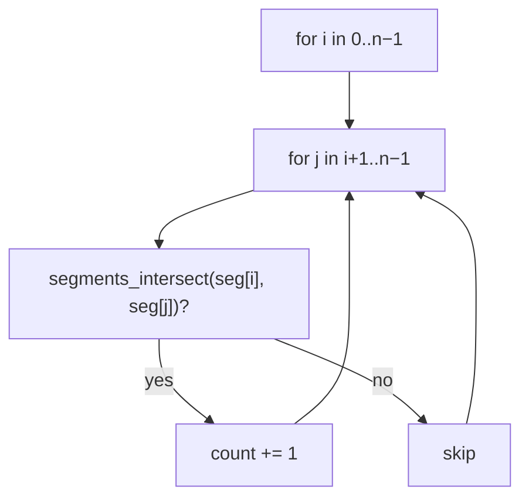
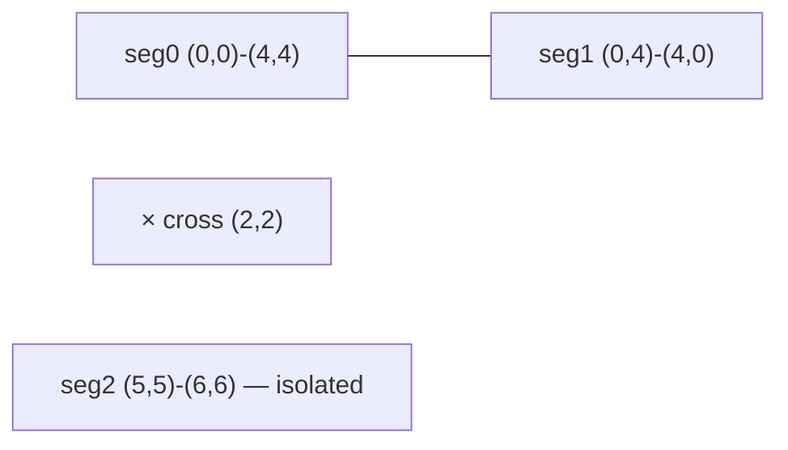
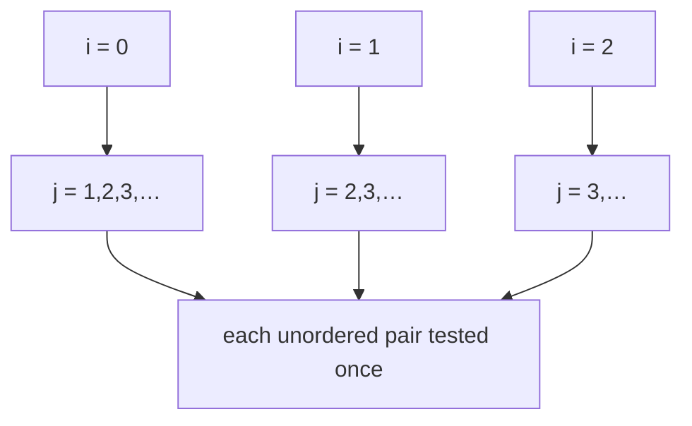
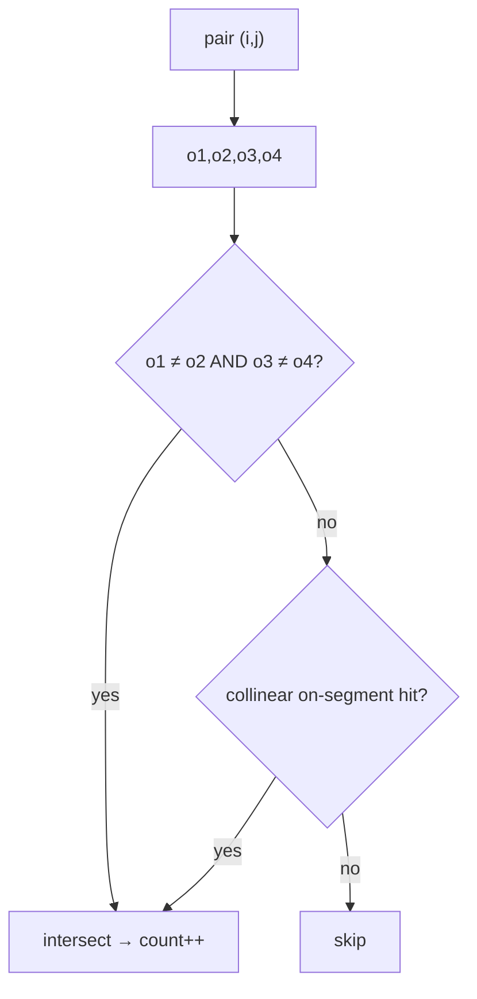
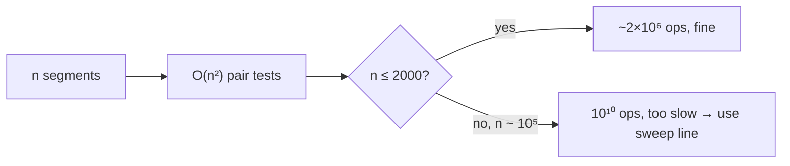

# Count Intersecting Segment Pairs (Brute Force $O(n^2)$)

| Field | Value |
|---|---|
| Source | Classic computational-geometry primitive (self-contained) |
| Difficulty | Medium |
| Primary topic | **All-pairs segment intersection counting** |
| Secondary topic | Orientation test reuse, sweep-line as the fast follow-up |
| Key constraint | $1 \le n \le 2000$ for the baseline; coordinates up to $10^9$ |

---

## Statement

You are given $n$ line segments, the $i$-th with endpoints $A_i$ and $B_i$. Count the number of
**unordered pairs** $(i, j)$ with $i < j$ such that segments $i$ and $j$ **intersect** (share at
least one point, including endpoint touches and collinear overlaps).

### Example

```text
n = 3
Segment 0: (0, 0) -- (4, 4)
Segment 1: (0, 4) -- (4, 0)
Segment 2: (5, 5) -- (6, 6)
Output: 1
# pair (0,1) crosses at (2,2); segment 2 is far away and touches nobody
```

---

## WHY: Test Every Pair with the Orientation Primitive

There are $\binom{n}{2}$ pairs. For each, run the integer-exact segment-intersection test from
the orientation method. With $n \le 2000$ that is about $2 \times 10^6$ pair tests — each $O(1)$,
so the whole thing is comfortably fast.



Each pair test is the same two-part routine: the general straddle (opposite orientation signs on
both lines) plus the collinear bounding-box patch.

---

## Code

```python
import sys
from dataclasses import dataclass

@dataclass(frozen=True)
class Point:
    x: int
    y: int

def cross(ax: int, ay: int, bx: int, by: int) -> int:
    return ax * by - ay * bx

def orient(p: Point, q: Point, r: Point) -> int:
    val = cross(q.x - p.x, q.y - p.y, r.x - p.x, r.y - p.y)
    if val > 0:
        return 1
    if val < 0:
        return -1
    return 0

def on_segment(p: Point, q: Point, r: Point) -> bool:
    return (min(p.x, r.x) <= q.x <= max(p.x, r.x) and
            min(p.y, r.y) <= q.y <= max(p.y, r.y))

def segments_intersect(p1: Point, p2: Point, p3: Point, p4: Point) -> bool:
    o1 = orient(p1, p2, p3)
    o2 = orient(p1, p2, p4)
    o3 = orient(p3, p4, p1)
    o4 = orient(p3, p4, p2)

    if o1 != o2 and o3 != o4:
        return True
    if o1 == 0 and on_segment(p1, p3, p2):
        return True
    if o2 == 0 and on_segment(p1, p4, p2):
        return True
    if o3 == 0 and on_segment(p3, p1, p4):
        return True
    if o4 == 0 and on_segment(p3, p2, p4):
        return True
    return False

def count_intersecting_pairs(segs) -> int:
    n = len(segs)
    count = 0
    for i in range(n):
        a1, b1 = segs[i]
        for j in range(i + 1, n):
            a2, b2 = segs[j]
            if segments_intersect(a1, b1, a2, b2):
                count += 1
    return count

def main() -> None:
    data = list(map(int, sys.stdin.read().split()))
    idx = 0
    n = data[idx]; idx += 1
    segs = []
    for _ in range(n):
        a = Point(data[idx], data[idx + 1])
        b = Point(data[idx + 2], data[idx + 3])
        idx += 4
        segs.append((a, b))
    print(count_intersecting_pairs(segs))

if __name__ == "__main__":
    main()
```

```cpp
#include <bits/stdc++.h>
using namespace std;

struct Point {
    long long x, y;
};

long long cross(long long ax, long long ay, long long bx, long long by) {
    return ax * by - ay * bx;
}

int orient(const Point& p, const Point& q, const Point& r) {
    long long val = cross(q.x - p.x, q.y - p.y, r.x - p.x, r.y - p.y);
    if (val > 0) return 1;
    if (val < 0) return -1;
    return 0;
}

bool on_segment(const Point& p, const Point& q, const Point& r) {
    return min(p.x, r.x) <= q.x && q.x <= max(p.x, r.x) &&
           min(p.y, r.y) <= q.y && q.y <= max(p.y, r.y);
}

bool segments_intersect(const Point& p1, const Point& p2,
                        const Point& p3, const Point& p4) {
    int o1 = orient(p1, p2, p3);
    int o2 = orient(p1, p2, p4);
    int o3 = orient(p3, p4, p1);
    int o4 = orient(p3, p4, p2);

    if (o1 != o2 && o3 != o4) return true;
    if (o1 == 0 && on_segment(p1, p3, p2)) return true;
    if (o2 == 0 && on_segment(p1, p4, p2)) return true;
    if (o3 == 0 && on_segment(p3, p1, p4)) return true;
    if (o4 == 0 && on_segment(p3, p2, p4)) return true;
    return false;
}

long long count_intersecting_pairs(const vector<pair<Point, Point>>& segs) {
    int n = (int)segs.size();
    long long count = 0;
    for (int i = 0; i < n; ++i) {
        const Point& a1 = segs[i].first;
        const Point& b1 = segs[i].second;
        for (int j = i + 1; j < n; ++j) {
            const Point& a2 = segs[j].first;
            const Point& b2 = segs[j].second;
            if (segments_intersect(a1, b1, a2, b2)) ++count;
        }
    }
    return count;
}

int main() {
    ios::sync_with_stdio(false);
    cin.tie(nullptr);

    int n;
    cin >> n;
    vector<pair<Point, Point>> segs(n);
    for (int i = 0; i < n; ++i) {
        cin >> segs[i].first.x >> segs[i].first.y
            >> segs[i].second.x >> segs[i].second.y;
    }
    cout << count_intersecting_pairs(segs) << "\n";
    return 0;
}
```

---

## Trace

With the three example segments:

| Pair | Test | Result |
|---|---|---|
| $(0,1)$ | $(0,0)$–$(4,4)$ vs $(0,4)$–$(4,0)$ | straddle both ways → **cross** |
| $(0,2)$ | $(0,0)$–$(4,4)$ vs $(5,5)$–$(6,6)$ | collinear but boxes disjoint → no |
| $(1,2)$ | $(0,4)$–$(4,0)$ vs $(5,5)$–$(6,6)$ | same side → no |

Total count = **1**.



---

## More Pictures: How the Pairs Are Enumerated

The double loop visits only the upper triangle $i < j$, so no pair is counted twice:



Inside each pair, the same decision tree runs:



Scaling — why this is only a *baseline*:



---

## Math and Complexity

There are $\binom{n}{2} = \dfrac{n(n-1)}{2}$ pairs, each tested in $O(1)$, so:

$$
T(n) = \Theta\!\left(\binom{n}{2}\right) = \Theta(n^2).
$$

| Metric | Value |
|---|---|
| Time | $O(n^2)$ |
| Space | $O(n)$ to store the segments |
| Arithmetic | Integer-exact orientation tests |

**Fast follow-up — the sweep line.** A Bentley–Ottmann sweep sorts the $2n$ endpoints and
maintains the segments currently crossed by a vertical line in a balanced BST ordered by height.
Only **adjacent** segments in that order can newly intersect, so reporting all $k$ crossings
costs $O((n + k) \log n)$ — dramatically better than $O(n^2)$ when intersections are sparse and
$n$ is large.

---

## Takeaway

Counting intersecting pairs is just the $O(1)$ segment-intersection test wrapped in the upper-
triangular double loop. It is correct and simple for $n$ up to a few thousand; when $n$ grows to
$10^5$, switch to a Bentley–Ottmann **sweep line** for $O((n+k)\log n)$.
