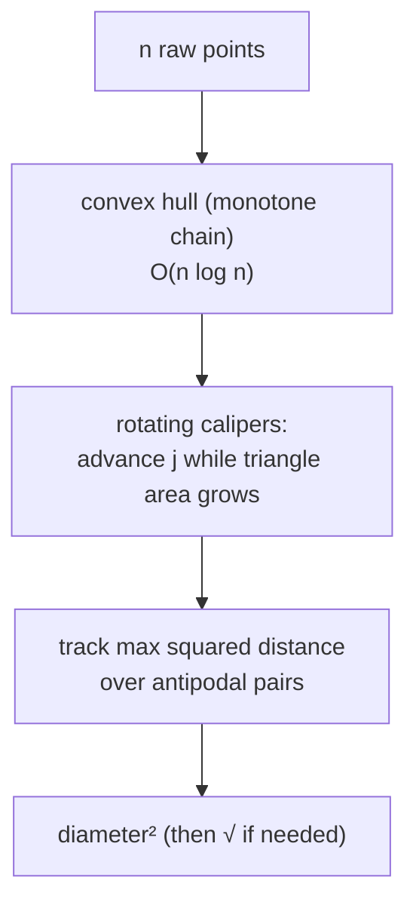
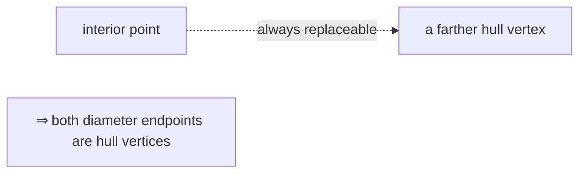
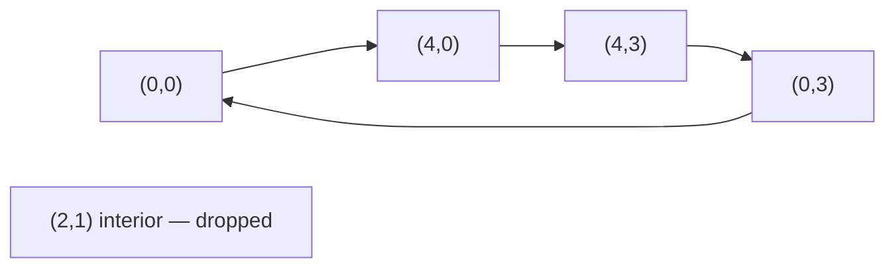
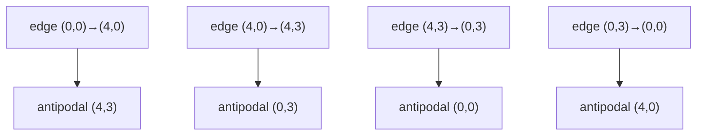
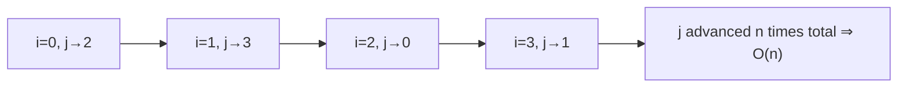
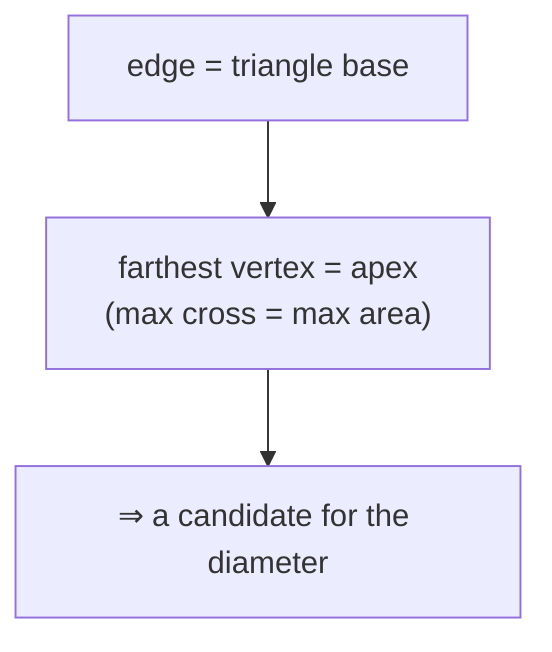

# Farthest Pair of Points — Diameter of a Point Set (Rotating Calipers)

| Meta | Value |
|------|-------|
| **Problem** | Farthest pair of points (point-set diameter) |
| **Source** | Self-contained (computational geometry) |
| **Reference** | Convex hull + rotating calipers |
| **Difficulty** | Medium |
| **Topics** | Geometry, Convex hull, Rotating calipers, Two pointers |
| **Time** | $O(n \log n)$ |
| **Space** | $O(n)$ |

---

## Problem Statement

Given $n$ points in the plane, find the **maximum distance** between any two of them — the *diameter* of
the point set. Return the squared distance (integer-exact) and, if needed, take a square root once at the
end for the true length.

```text
Input:  points = [(0,0),(4,0),(4,3),(0,3),(2,1)]
Output: 25
The farthest pair is (0,0)–(4,3) (or (4,0)–(0,3)), distance² = 16 + 9 = 25, distance = 5.

Input:  points = [(0,0),(1,0),(2,0)]
Output: 4
All collinear → diameter is the extreme segment (0,0)–(2,0), distance² = 4.
```

---

## Approach (WHY)

A brute force over all $\binom{n}{2}$ pairs is $O(n^2)$. The key insight: the two farthest points must
both lie on the **convex hull** — a point strictly inside the hull can always be replaced by a hull
vertex that is farther away. Moreover the farthest pair is an **antipodal pair**, reachable by *rotating
calipers*: roll two parallel support lines around the hull and only the $O(h)$ antipodal pairs need to
be checked.

The *WHY* of the linear sweep: fix a hull edge $v_i v_{i+1}$ and look for the vertex farthest from its
line — that is the vertex maximizing the triangle area $\operatorname{cross}(v_i, v_{i+1}, v_j)$. As the
edge rotates CCW around the hull, this farthest vertex $j$ only ever moves **forward**, so a single
pointer advancing monotonically visits every antipodal pair in $O(h)$ time. We compare **squared**
distances to stay in exact integers.





---

## Solution

```python
class Point:
    __slots__ = ("x", "y")
    def __init__(self, x, y):
        self.x = x
        self.y = y

def cross(o, a, b):
    # (a - o) x (b - o); equals twice the signed area of triangle OAB
    return (a.x - o.x) * (b.y - o.y) - (a.y - o.y) * (b.x - o.x)

def dist2(a, b):
    dx, dy = a.x - b.x, a.y - b.y
    return dx * dx + dy * dy

def convex_hull(points):
    pts = sorted(set((p.x, p.y) for p in points))      # dedupe + sort by (x, y)
    pts = [Point(x, y) for x, y in pts]
    if len(pts) <= 2:
        return pts

    def build(seq):
        h = []
        for p in seq:
            while len(h) >= 2 and cross(h[-2], h[-1], p) <= 0:
                h.pop()
            h.append(p)
        return h

    lower = build(pts)
    upper = build(reversed(pts))
    return lower[:-1] + upper[:-1]                      # CCW, minimal vertices

def diameter_sq(points):
    hull = convex_hull(points)
    n = len(hull)
    if n == 1:
        return 0
    if n == 2:
        return dist2(hull[0], hull[1])

    best = 0
    j = 1
    for i in range(n):
        ni = (i + 1) % n
        # advance the opposite vertex while the triangle over edge (i, ni) grows
        while cross(hull[i], hull[ni], hull[(j + 1) % n]) > cross(hull[i], hull[ni], hull[j]):
            j = (j + 1) % n
        best = max(best, dist2(hull[i], hull[j]), dist2(hull[ni], hull[j]))
    return best

pts = [Point(0, 0), Point(4, 0), Point(4, 3), Point(0, 3), Point(2, 1)]
print(diameter_sq(pts))   # 25
```

```cpp
#include <bits/stdc++.h>
using namespace std;

struct Point {
    long long x, y;
};

// (a - o) x (b - o); equals twice the signed area of triangle OAB
long long cross(const Point &o, const Point &a, const Point &b) {
    return (a.x - o.x) * (b.y - o.y) - (a.y - o.y) * (b.x - o.x);
}

long long dist2(const Point &a, const Point &b) {
    long long dx = a.x - b.x, dy = a.y - b.y;
    return dx * dx + dy * dy;
}

vector<Point> convex_hull(vector<Point> pts) {
    sort(pts.begin(), pts.end(), [](const Point &a, const Point &b) {
        return a.x != b.x ? a.x < b.x : a.y < b.y;      // sort by (x, y)
    });
    pts.erase(unique(pts.begin(), pts.end(), [](const Point &a, const Point &b) {
        return a.x == b.x && a.y == b.y;                // dedupe
    }), pts.end());

    int n = (int)pts.size();
    if (n <= 2) return pts;

    vector<Point> hull(2 * n);
    int k = 0;
    for (int i = 0; i < n; ++i) {
        while (k >= 2 && cross(hull[k - 2], hull[k - 1], pts[i]) <= 0) --k;
        hull[k++] = pts[i];
    }
    int lower = k + 1;
    for (int i = n - 2; i >= 0; --i) {
        while (k >= lower && cross(hull[k - 2], hull[k - 1], pts[i]) <= 0) --k;
        hull[k++] = pts[i];
    }
    hull.resize(k - 1);                                 // CCW, minimal vertices
    return hull;
}

long long diameter_sq(vector<Point> points) {
    vector<Point> hull = convex_hull(points);
    int n = (int)hull.size();
    if (n == 1) return 0;
    if (n == 2) return dist2(hull[0], hull[1]);

    long long best = 0;
    int j = 1;
    for (int i = 0; i < n; ++i) {
        int ni = (i + 1) % n;
        // advance the opposite vertex while the triangle over edge (i, ni) grows
        while (cross(hull[i], hull[ni], hull[(j + 1) % n]) > cross(hull[i], hull[ni], hull[j]))
            j = (j + 1) % n;
        best = max(best, max(dist2(hull[i], hull[j]), dist2(hull[ni], hull[j])));
    }
    return best;
}

int main() {
    vector<Point> pts = {{0, 0}, {4, 0}, {4, 3}, {0, 3}, {2, 1}};
    cout << diameter_sq(pts) << "\n";   // 25
    return 0;
}
```

---

## Trace

Input `[(0,0),(4,0),(4,3),(0,3),(2,1)]`. The interior point `(2,1)` is dropped by the hull, leaving the
CCW square hull `H = [(0,0),(4,0),(4,3),(0,3)]` ($n = 4$). Start `j = 1`, `best = 0`.

| `i` | edge `(v_i, v_{ni})` | advance `j`? | antipodal `j` | checks `dist²` | `best` |
|-----|----------------------|--------------|---------------|----------------|--------|
| 0 | (0,0)→(4,0) | `cross(...,v2)=12 > cross(...,v1)=0` → j=2; `cross(...,v3)=12` not `> 12` stop | (4,3) | `dist2((0,0),(4,3))=25`, `dist2((4,0),(4,3))=9` | 25 |
| 1 | (4,0)→(4,3) | `cross(...,v3)=12 > cross(...,v2)=0` → j=3; next not greater, stop | (0,3) | `dist2((4,0),(0,3))=25`, `dist2((4,3),(0,3))=16` | 25 |
| 2 | (4,3)→(0,3) | `cross(...,v0)=12 > cross(...,v3)=0` → j=0; stop | (0,0) | `dist2((4,3),(0,0))=25`, `dist2((0,3),(0,0))=9` | 25 |
| 3 | (0,3)→(0,0) | `cross(...,v1)=12 > cross(...,v0)=0` → j=1; stop | (4,0) | `dist2((0,3),(4,0))=25`, `dist2((0,0),(4,0))=16` | 25 |

Result: `diameter² = 25`, so the diameter is $\sqrt{25} = 5$. Note `j` advanced exactly $n = 4$ times in
total across the whole loop — one full lap — confirming the $O(n)$ amortized cost.

---

## Diagrams

The interior point is discarded; only hull vertices can be diameter endpoints:



The antipodal pairing as the edge rotates (each edge maps to its farthest vertex):



The single forward-marching pointer (never moves backward):



The area-as-distance intuition — the antipodal vertex is the apex of the tallest triangle on the edge:



---

## Math / Complexity

Both diameter endpoints lie on the convex hull, and the farthest pair is among the $O(h)$ antipodal
pairs. For a fixed edge $v_i v_{i+1}$, the farthest vertex maximizes the triangle area

$$
\operatorname{cross}(v_i, v_{i+1}, v_j) = (v_{i+1}-v_i)\times(v_j-v_i) = 2 \cdot \text{Area}(v_i, v_{i+1}, v_j),
$$

which is **unimodal** in $j$ around a convex hull, so the `while area increases` test stops at the apex
without backtracking. Comparing **squared** distances $\lVert v_a - v_b\rVert^2 = (\Delta x)^2 + (\Delta y)^2$
keeps everything integer-exact (use `long long`; products reach $\sim 4\times10^{18}$ for coordinates up
to $10^9$). The hull costs $O(n \log n)$ and the calipers sweep is $O(n)$:

$$
T = O(n \log n), \qquad S = O(n).
$$

---

## Takeaway

The point-set **diameter** = convex hull + one rotating-calipers pass: **advance the opposite vertex
while the triangle area over the current edge grows, and track the maximum squared distance**. It turns
an $O(n^2)$ pair scan into $O(n \log n)$, all in exact integer arithmetic.
