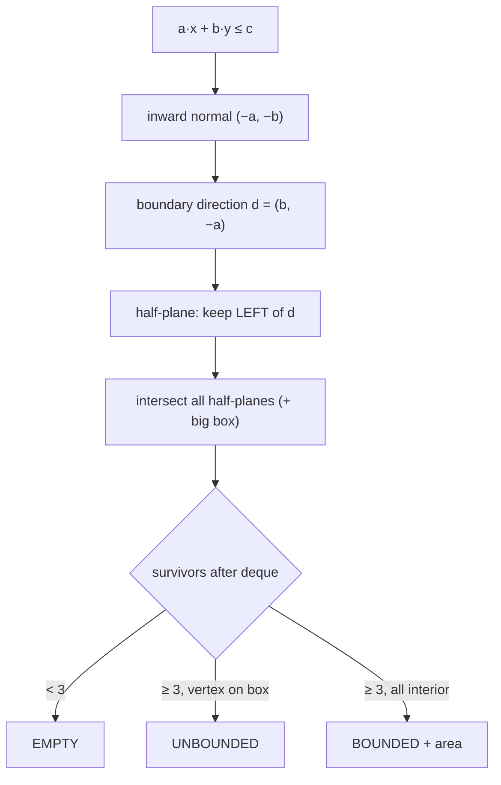
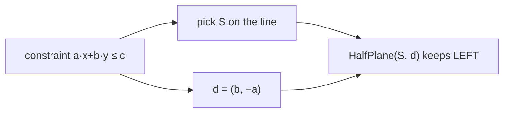
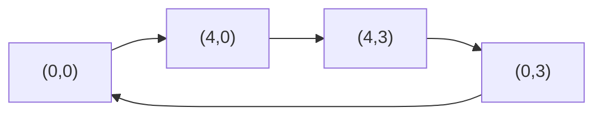
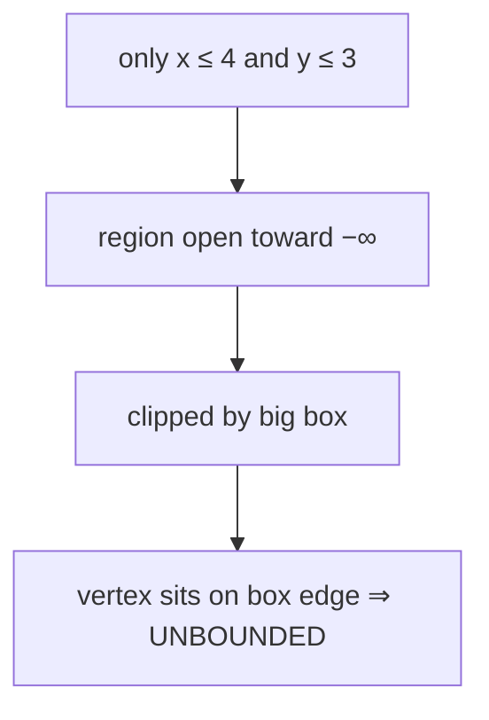
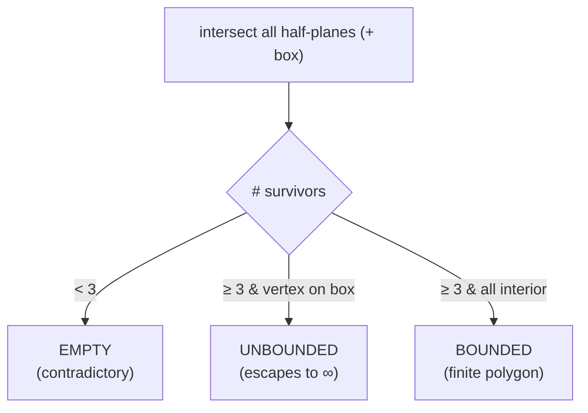
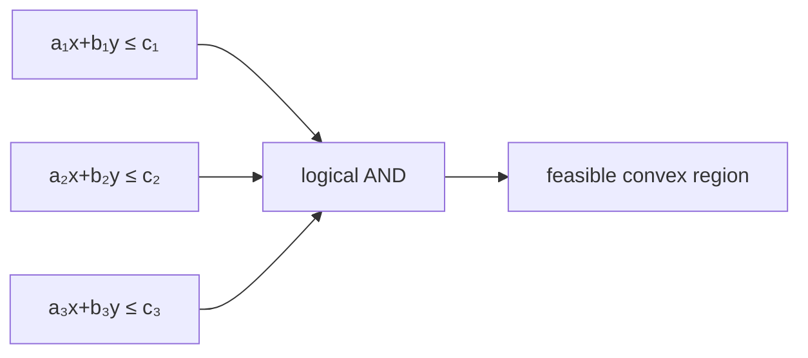
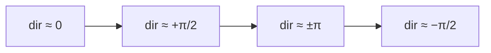

# Feasibility of 2D Linear Constraints (Is the System Solvable?)

| Field | Value |
|---|---|
| Source | Classic computational-geometry / LP primitive (self-contained) |
| Difficulty | Hard |
| Primary topic | **Half-plane intersection** for feasibility |
| Secondary topic | $ax+by\le c$ form, empty / bounded / unbounded classification |
| Key constraint | $n \le 10^5$ inequalities; `double` geometry with `EPS = 1e-9` |

---

## Statement

You are given $n$ linear inequalities in two variables:

$$
a_i\,x + b_i\,y \le c_i, \qquad i = 1, \dots, n.
$$

Decide whether the system is **feasible** (some $(x, y)$ satisfies all of them at once) and describe the
feasible region:

- `EMPTY` — no point satisfies all constraints.
- `UNBOUNDED` — the region is non-empty but infinite.
- `BOUNDED area` — the region is a finite convex polygon; also print its area.

### Example

```text
n = 4
  -1  0   0     # -x ≤ 0   →  x ≥ 0
   0 -1   0     # -y ≤ 0   →  y ≥ 0
   1  0   4     #  x ≤ 4
   0  1   3     #  y ≤ 3

Output: BOUNDED 12.000000     # the rectangle [0,4]×[0,3]
```

```text
n = 2
   1  0   4     # x ≤ 4
   0  1   3     # y ≤ 3

Output: UNBOUNDED             # nothing bounds x,y from below
```

```text
n = 2
   1  0   1     # x ≤ 1
  -1  0  -5     # -x ≤ -5  →  x ≥ 5

Output: EMPTY
```

---

## WHY: An Inequality Is a Half-Plane; Feasibility Is Non-Empty Intersection

Each constraint $a x + b y \le c$ is the set of points on one side of the line $a x + b y = c$ — a
**half-plane**. The system is feasible exactly when **all** the half-planes share at least one common point,
i.e. their intersection is non-empty. To detect *unbounded* vs *bounded*, we wrap the constraints in a huge
box of size $\pm B$ and check whether any surviving vertex touches the box: if it does, the true region
escaped to infinity in that direction.



**Converting $ax+by\le c$ to a directed line.** The boundary is $ax+by=c$. Choose a point $S$ on it and a
direction $\vec{d} = (b, -a)$. With this $\vec{d}$, "keep the **left** side" coincides with
$a x + b y \le c$, because moving left of $\vec d$ decreases $a x + b y$.



To pick a point on $ax+by=c$ robustly: if $|a| \ge |b|$ use $S=(c/a, 0)$, else $S=(0, c/b)$ (whichever
denominator is non-tiny).

---

## Code

```python
import sys
import math
from collections import deque
from dataclasses import dataclass

EPS = 1e-9
BIG = 1e9

@dataclass
class Point:
    x: float
    y: float
    def __add__(self, o): return Point(self.x + o.x, self.y + o.y)
    def __sub__(self, o): return Point(self.x - o.x, self.y - o.y)
    def __mul__(self, t): return Point(self.x * t, self.y * t)

def cross(a: Point, b: Point) -> float:
    return a.x * b.y - a.y * b.x

@dataclass
class HalfPlane:
    p: Point
    dir: Point
    def angle(self) -> float:
        return math.atan2(self.dir.y, self.dir.x)

def out(h: HalfPlane, p: Point) -> bool:
    return cross(h.dir, p - h.p) < -EPS

def intersect(h1: HalfPlane, h2: HalfPlane) -> Point:
    denom = cross(h1.dir, h2.dir)
    t = cross(h2.dir, h1.p - h2.p) / denom
    return h1.p + h1.dir * t

def from_inequality(a: float, b: float, c: float) -> HalfPlane:
    # a*x + b*y <= c  ->  point on line + direction (b, -a), keep LEFT.
    if abs(a) >= abs(b):
        s = Point(c / a, 0.0)
    else:
        s = Point(0.0, c / b)
    return HalfPlane(s, Point(b, -a))

def box_planes(b: float = BIG) -> list[HalfPlane]:
    return [
        HalfPlane(Point(b, -b),  Point(0, 1)),
        HalfPlane(Point(b, b),   Point(-1, 0)),
        HalfPlane(Point(-b, b),  Point(0, -1)),
        HalfPlane(Point(-b, -b), Point(1, 0)),
    ]

def half_plane_intersection(planes: list[HalfPlane]) -> list[Point]:
    planes = sorted(planes, key=lambda h: h.angle())
    cleaned: list[HalfPlane] = []
    for h in planes:
        if cleaned and abs(h.angle() - cleaned[-1].angle()) < EPS:
            if out(cleaned[-1], h.p):
                cleaned[-1] = h
            continue
        cleaned.append(h)

    dq: deque[HalfPlane] = deque()
    for h in cleaned:
        while len(dq) >= 2 and out(h, intersect(dq[-1], dq[-2])):
            dq.pop()
        while len(dq) >= 2 and out(h, intersect(dq[0], dq[1])):
            dq.popleft()
        dq.append(h)

    while len(dq) >= 3 and out(dq[0], intersect(dq[-1], dq[-2])):
        dq.pop()
    while len(dq) >= 3 and out(dq[-1], intersect(dq[0], dq[1])):
        dq.popleft()

    if len(dq) < 3:
        return []
    n = len(dq)
    return [intersect(dq[i], dq[(i + 1) % n]) for i in range(n)]

def polygon_area(poly: list[Point]) -> float:
    s = 0.0
    n = len(poly)
    for i in range(n):
        j = (i + 1) % n
        s += poly[i].x * poly[j].y - poly[j].x * poly[i].y
    return abs(s) / 2.0

def touches_box(poly: list[Point], b: float = BIG) -> bool:
    for p in poly:
        if (abs(abs(p.x) - b) < 1.0) or (abs(abs(p.y) - b) < 1.0):
            return True
    return False

def main() -> None:
    data = sys.stdin.read().split()
    idx = 0
    n = int(data[idx]); idx += 1
    planes = box_planes()
    for _ in range(n):
        a, b, c = (float(data[idx + k]) for k in range(3))
        idx += 3
        planes.append(from_inequality(a, b, c))
    poly = half_plane_intersection(planes)
    if len(poly) < 3:
        print("EMPTY")
    elif touches_box(poly):
        print("UNBOUNDED")
    else:
        print(f"BOUNDED {polygon_area(poly):.6f}")

if __name__ == "__main__":
    main()
```

```cpp
#include <bits/stdc++.h>
using namespace std;

const double EPS = 1e-9;
const double BIG = 1e9;

struct Point {
    double x, y;
    Point(double x = 0, double y = 0) : x(x), y(y) {}
    Point operator+(const Point& o) const { return Point(x + o.x, y + o.y); }
    Point operator-(const Point& o) const { return Point(x - o.x, y - o.y); }
    Point operator*(double t) const { return Point(x * t, y * t); }
};

double cross(const Point& a, const Point& b) {
    return a.x * b.y - a.y * b.x;
}

struct HalfPlane {
    Point p;
    Point dir;
    double angle() const { return atan2(dir.y, dir.x); }
};

bool out(const HalfPlane& h, const Point& p) {
    return cross(h.dir, p - h.p) < -EPS;
}

Point intersect(const HalfPlane& h1, const HalfPlane& h2) {
    double denom = cross(h1.dir, h2.dir);
    double t = cross(h2.dir, h1.p - h2.p) / denom;
    return h1.p + h1.dir * t;
}

HalfPlane from_inequality(double a, double b, double c) {
    // a*x + b*y <= c  ->  point on line + direction (b, -a), keep LEFT.
    Point s = (fabs(a) >= fabs(b)) ? Point(c / a, 0.0) : Point(0.0, c / b);
    return HalfPlane{s, Point(b, -a)};
}

vector<HalfPlane> box_planes(double b = BIG) {
    return {
        HalfPlane{Point(b, -b),  Point(0, 1)},
        HalfPlane{Point(b, b),   Point(-1, 0)},
        HalfPlane{Point(-b, b),  Point(0, -1)},
        HalfPlane{Point(-b, -b), Point(1, 0)},
    };
}

vector<Point> half_plane_intersection(vector<HalfPlane> planes) {
    sort(planes.begin(), planes.end(),
         [](const HalfPlane& a, const HalfPlane& b) {
             return a.angle() < b.angle();
         });
    vector<HalfPlane> cleaned;
    for (const HalfPlane& h : planes) {
        if (!cleaned.empty() &&
            fabs(h.angle() - cleaned.back().angle()) < EPS) {
            if (out(cleaned.back(), h.p)) cleaned.back() = h;
            continue;
        }
        cleaned.push_back(h);
    }

    deque<HalfPlane> dq;
    for (const HalfPlane& h : cleaned) {
        while (dq.size() >= 2 &&
               out(h, intersect(dq[dq.size() - 1], dq[dq.size() - 2]))) {
            dq.pop_back();
        }
        while (dq.size() >= 2 && out(h, intersect(dq[0], dq[1]))) {
            dq.pop_front();
        }
        dq.push_back(h);
    }

    while (dq.size() >= 3 &&
           out(dq[0], intersect(dq[dq.size() - 1], dq[dq.size() - 2]))) {
        dq.pop_back();
    }
    while (dq.size() >= 3 && out(dq.back(), intersect(dq[0], dq[1]))) {
        dq.pop_front();
    }

    if (dq.size() < 3) return {};
    int n = (int)dq.size();
    vector<Point> poly;
    for (int i = 0; i < n; ++i) {
        poly.push_back(intersect(dq[i], dq[(i + 1) % n]));
    }
    return poly;
}

double polygon_area(const vector<Point>& poly) {
    double s = 0.0;
    int n = (int)poly.size();
    for (int i = 0; i < n; ++i) {
        int j = (i + 1) % n;
        s += poly[i].x * poly[j].y - poly[j].x * poly[i].y;
    }
    return fabs(s) / 2.0;
}

bool touches_box(const vector<Point>& poly, double b = BIG) {
    for (const Point& p : poly) {
        if (fabs(fabs(p.x) - b) < 1.0 || fabs(fabs(p.y) - b) < 1.0) {
            return true;
        }
    }
    return false;
}

int main() {
    ios::sync_with_stdio(false);
    cin.tie(nullptr);

    int n;
    if (!(cin >> n)) return 0;
    vector<HalfPlane> planes = box_planes();
    for (int i = 0; i < n; ++i) {
        double a, b, c;
        cin >> a >> b >> c;
        planes.push_back(from_inequality(a, b, c));
    }
    vector<Point> poly = half_plane_intersection(planes);
    if ((int)poly.size() < 3) {
        cout << "EMPTY\n";
    } else if (touches_box(poly)) {
        cout << "UNBOUNDED\n";
    } else {
        cout << fixed << setprecision(6) << "BOUNDED " << polygon_area(poly) << "\n";
    }
    return 0;
}
```

---

## Trace

Take the first example: $x \ge 0,\; y \ge 0,\; x \le 4,\; y \le 3$. Converting to half-planes (keep left) and
sorting by angle gives directions roughly pointing up, left, down, right — one per rectangle edge. The big box
planes are far looser and get popped out during the sweep.

| Constraint | $(a,b,c)$ | direction $(b,-a)$ | meaning |
|---|---|---|---|
| $x \ge 0$ | $(-1,0,0)$ | $(0,1)$ up | keep right of $x=0$ |
| $y \ge 0$ | $(0,-1,0)$ | $(-1,0)$ left | keep above $y=0$ |
| $x \le 4$ | $(1,0,4)$ | $(0,-1)$ down | keep left of $x=4$ |
| $y \le 3$ | $(0,1,3)$ | $(1,0)$ right | keep below $y=3$ |

The deque settles to these four; recovered vertices are $(0,0),(4,0),(4,3),(0,3)$. No vertex is near $\pm B$,
so it is **BOUNDED**. Shoelace:

$$
\text{Area} = \tfrac12\big|0 - 0 + 12 - 0 + 12 - 0 + 0 - 0\big| = \tfrac12 \cdot 24 = 12.
$$



The second example drops the lower bounds, so the region runs off to $x,y \to -\infty$. After clipping to the
box, a recovered vertex lands at a coordinate near $-B$, and `touches_box` reports **UNBOUNDED**.



---

## More Pictures

Classifying the three outcomes:



A single inequality shades half the plane; stacking them narrows the feasible set:



The angular sweep orders constraints like clock hands so the deque can maintain the convex boundary in one
pass:



---

## Math & Complexity

- Building half-planes from inequalities: $O(n)$.
- Sort by angle: $O(n \log n)$.
- Deque sweep + recovery: $O(n)$.
- **Total:** $O(n \log n)$ time, $O(n)$ space.

Feasibility reduces to a single emptiness test: the system $\{a_i x + b_i y \le c_i\}$ has a solution **iff**
the half-plane intersection keeps $\ge 3$ boundaries. The box only serves to separate *bounded* from
*unbounded*; remove it if you merely need the yes/no feasibility answer.

---

## Takeaway

> Every linear inequality $a x + b y \le c$ is a half-plane with direction $(b, -a)$ keeping the **left** side.
> Feasibility is non-emptiness of their intersection; **fewer than 3 survivors ⇒ EMPTY**. Wrap a big box to
> tell **UNBOUNDED** (a vertex on the box) from **BOUNDED** (all vertices interior, area via shoelace).
