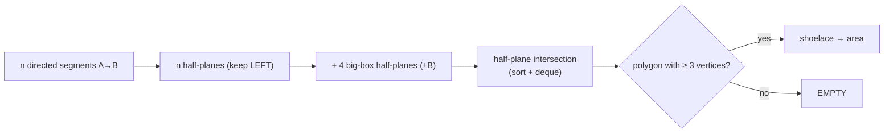
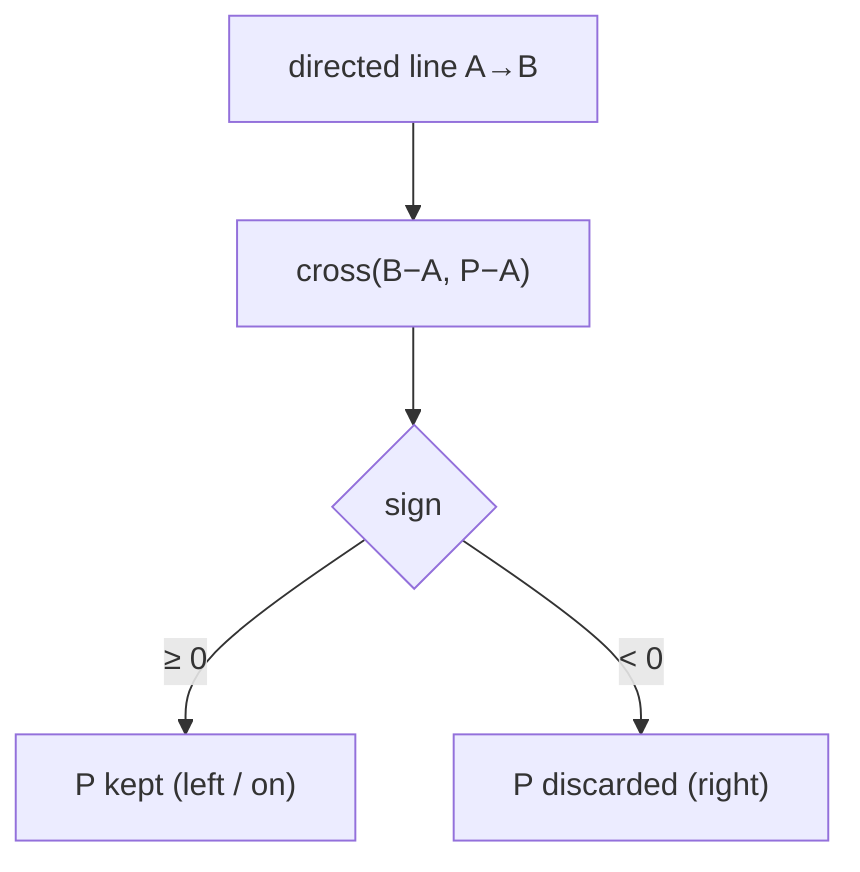
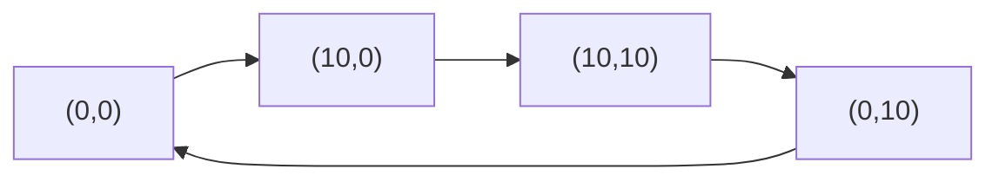
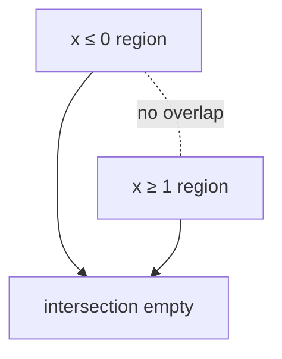
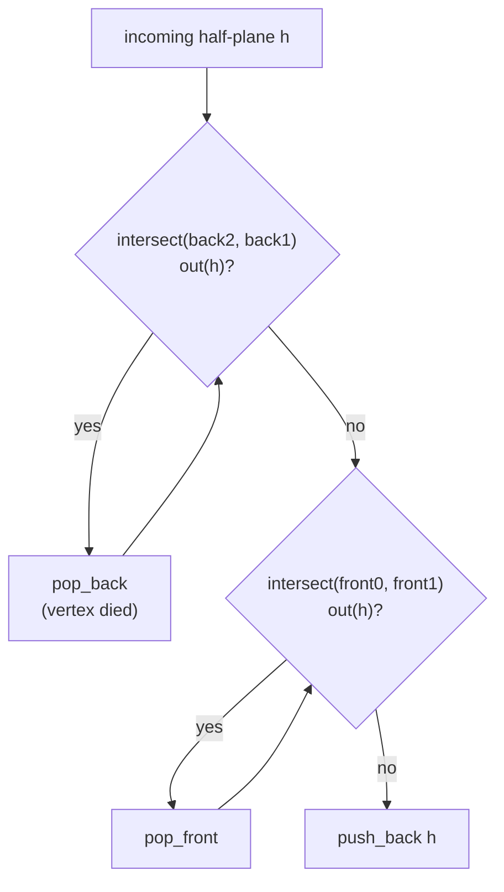
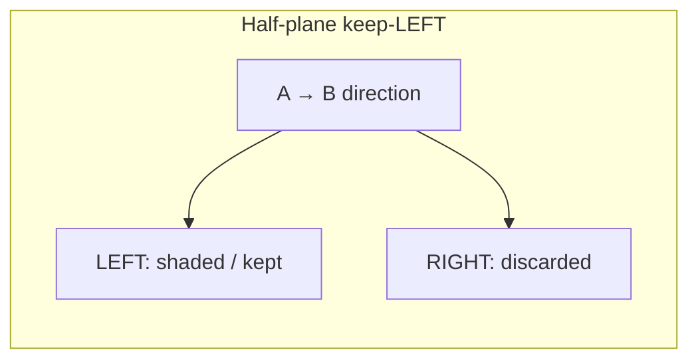

# Area of a Half-Plane Intersection (Bounded by a Big Box)

| Field | Value |
|---|---|
| Source | Classic computational-geometry primitive (self-contained) |
| Difficulty | Hard |
| Primary topic | **Half-plane intersection** (sort-by-angle + deque) |
| Secondary topic | Shoelace area, big-box bounding, empty detection |
| Key constraint | $n \le 10^5$ half-planes; `double` geometry with `EPS = 1e-9` |

---

## Statement

You are given $n$ half-planes. Each is described by two points $A$ and $B$; the half-plane keeps every
point on the **left side** of the directed line $A \to B$ (i.e. all $P$ with
$\overrightarrow{AB} \times \overrightarrow{AP} \ge 0$).

Compute the **area** of the intersection of all $n$ half-planes. Because an intersection can be unbounded,
the region is additionally clipped to a large box $[-B, B]^2$ with $B = 10^9$. Report:

- the area (a real number) if the intersection is a non-empty polygon, or
- `EMPTY` if no point satisfies all the constraints.

### Example

```text
n = 4
half-planes (each "Ax Ay Bx By", keep LEFT of A→B):
  0 0  10 0      # keep y ≥ 0   (above the x-axis)
  10 0 10 10     # keep x ≤ 10  (left of x=10)
  10 10 0 10     # keep y ≤ 10  (below y=10)
  0 10 0 0       # keep x ≥ 0   (right of x=0)

Output: 100.000000      # the 10×10 square
```

A second example that is empty:

```text
n = 2
  0 0  0 1       # keep x ≤ 0   (left half-plane, directed up)
  1 1  1 0       # keep x ≥ 1   (right half-plane, directed down)

Output: EMPTY
```

---

## WHY: Each Constraint Is a Half-Plane; Their Overlap Is a Convex Polygon

A directed segment $A \to B$ defines an infinite line with a direction $\vec{d} = B - A$. "Keep the left
side" is precisely the constraint $\operatorname{cross}(\vec{d}, P - A) \ge 0$. Intersecting many such
constraints yields a **convex** region (intersection of convex sets). The sort-by-angle + deque algorithm
returns that region's boundary as a polygon in $O(n \log n)$; the **shoelace formula** then gives its area.



Why the big box? Without it, constraints like "keep $x \ge 0$" alone leave an infinite region with no finite
area. Clipping to $[-B, B]^2$ makes the answer always a bounded polygon; choosing $B$ far beyond all input
coordinates means the box never cuts a genuine feature.



---

## Code

```python
import sys
import math
from collections import deque
from dataclasses import dataclass

EPS = 1e-9
BIG = 1e9

@dataclass
class Point:
    x: float
    y: float
    def __add__(self, o): return Point(self.x + o.x, self.y + o.y)
    def __sub__(self, o): return Point(self.x - o.x, self.y - o.y)
    def __mul__(self, t): return Point(self.x * t, self.y * t)

def cross(a: Point, b: Point) -> float:
    return a.x * b.y - a.y * b.x

@dataclass
class HalfPlane:
    p: Point          # a point on the boundary line
    dir: Point        # direction; KEPT side is to the LEFT
    def angle(self) -> float:
        return math.atan2(self.dir.y, self.dir.x)

def out(h: HalfPlane, p: Point) -> bool:
    return cross(h.dir, p - h.p) < -EPS

def intersect(h1: HalfPlane, h2: HalfPlane) -> Point:
    denom = cross(h1.dir, h2.dir)
    t = cross(h2.dir, h1.p - h2.p) / denom
    return h1.p + h1.dir * t

def box_planes(b: float = BIG) -> list[HalfPlane]:
    return [
        HalfPlane(Point(b, -b),  Point(0, 1)),
        HalfPlane(Point(b, b),   Point(-1, 0)),
        HalfPlane(Point(-b, b),  Point(0, -1)),
        HalfPlane(Point(-b, -b), Point(1, 0)),
    ]

def half_plane_intersection(planes: list[HalfPlane]) -> list[Point]:
    planes = sorted(planes, key=lambda h: h.angle())
    cleaned: list[HalfPlane] = []
    for h in planes:
        if cleaned and abs(h.angle() - cleaned[-1].angle()) < EPS:
            if out(cleaned[-1], h.p):
                cleaned[-1] = h
            continue
        cleaned.append(h)

    dq: deque[HalfPlane] = deque()
    for h in cleaned:
        while len(dq) >= 2 and out(h, intersect(dq[-1], dq[-2])):
            dq.pop()
        while len(dq) >= 2 and out(h, intersect(dq[0], dq[1])):
            dq.popleft()
        dq.append(h)

    while len(dq) >= 3 and out(dq[0], intersect(dq[-1], dq[-2])):
        dq.pop()
    while len(dq) >= 3 and out(dq[-1], intersect(dq[0], dq[1])):
        dq.popleft()

    if len(dq) < 3:
        return []
    n = len(dq)
    return [intersect(dq[i], dq[(i + 1) % n]) for i in range(n)]

def polygon_area(poly: list[Point]) -> float:
    s = 0.0
    n = len(poly)
    for i in range(n):
        j = (i + 1) % n
        s += poly[i].x * poly[j].y - poly[j].x * poly[i].y
    return abs(s) / 2.0

def main() -> None:
    data = sys.stdin.read().split()
    idx = 0
    n = int(data[idx]); idx += 1
    planes = box_planes()
    for _ in range(n):
        ax, ay, bx, by = (float(data[idx + k]) for k in range(4))
        idx += 4
        a = Point(ax, ay)
        b = Point(bx, by)
        planes.append(HalfPlane(a, b - a))
    poly = half_plane_intersection(planes)
    if len(poly) < 3:
        print("EMPTY")
    else:
        print(f"{polygon_area(poly):.6f}")

if __name__ == "__main__":
    main()
```

```cpp
#include <bits/stdc++.h>
using namespace std;

const double EPS = 1e-9;
const double BIG = 1e9;

struct Point {
    double x, y;
    Point(double x = 0, double y = 0) : x(x), y(y) {}
    Point operator+(const Point& o) const { return Point(x + o.x, y + o.y); }
    Point operator-(const Point& o) const { return Point(x - o.x, y - o.y); }
    Point operator*(double t) const { return Point(x * t, y * t); }
};

double cross(const Point& a, const Point& b) {
    return a.x * b.y - a.y * b.x;
}

struct HalfPlane {
    Point p;          // a point on the boundary line
    Point dir;        // direction; KEPT side is to the LEFT
    double angle() const { return atan2(dir.y, dir.x); }
};

bool out(const HalfPlane& h, const Point& p) {
    return cross(h.dir, p - h.p) < -EPS;
}

Point intersect(const HalfPlane& h1, const HalfPlane& h2) {
    double denom = cross(h1.dir, h2.dir);
    double t = cross(h2.dir, h1.p - h2.p) / denom;
    return h1.p + h1.dir * t;
}

vector<HalfPlane> box_planes(double b = BIG) {
    return {
        HalfPlane{Point(b, -b),  Point(0, 1)},
        HalfPlane{Point(b, b),   Point(-1, 0)},
        HalfPlane{Point(-b, b),  Point(0, -1)},
        HalfPlane{Point(-b, -b), Point(1, 0)},
    };
}

vector<Point> half_plane_intersection(vector<HalfPlane> planes) {
    sort(planes.begin(), planes.end(),
         [](const HalfPlane& a, const HalfPlane& b) {
             return a.angle() < b.angle();
         });
    vector<HalfPlane> cleaned;
    for (const HalfPlane& h : planes) {
        if (!cleaned.empty() &&
            fabs(h.angle() - cleaned.back().angle()) < EPS) {
            if (out(cleaned.back(), h.p)) cleaned.back() = h;
            continue;
        }
        cleaned.push_back(h);
    }

    deque<HalfPlane> dq;
    for (const HalfPlane& h : cleaned) {
        while (dq.size() >= 2 &&
               out(h, intersect(dq[dq.size() - 1], dq[dq.size() - 2]))) {
            dq.pop_back();
        }
        while (dq.size() >= 2 && out(h, intersect(dq[0], dq[1]))) {
            dq.pop_front();
        }
        dq.push_back(h);
    }

    while (dq.size() >= 3 &&
           out(dq[0], intersect(dq[dq.size() - 1], dq[dq.size() - 2]))) {
        dq.pop_back();
    }
    while (dq.size() >= 3 && out(dq.back(), intersect(dq[0], dq[1]))) {
        dq.pop_front();
    }

    if (dq.size() < 3) return {};
    int n = (int)dq.size();
    vector<Point> poly;
    for (int i = 0; i < n; ++i) {
        poly.push_back(intersect(dq[i], dq[(i + 1) % n]));
    }
    return poly;
}

double polygon_area(const vector<Point>& poly) {
    double s = 0.0;
    int n = (int)poly.size();
    for (int i = 0; i < n; ++i) {
        int j = (i + 1) % n;
        s += poly[i].x * poly[j].y - poly[j].x * poly[i].y;
    }
    return fabs(s) / 2.0;
}

int main() {
    ios::sync_with_stdio(false);
    cin.tie(nullptr);

    int n;
    if (!(cin >> n)) return 0;
    vector<HalfPlane> planes = box_planes();
    for (int i = 0; i < n; ++i) {
        double ax, ay, bx, by;
        cin >> ax >> ay >> bx >> by;
        Point a(ax, ay), b(bx, by);
        planes.push_back(HalfPlane{a, b - a});
    }
    vector<Point> poly = half_plane_intersection(planes);
    if ((int)poly.size() < 3) {
        cout << "EMPTY\n";
    } else {
        cout << fixed << setprecision(6) << polygon_area(poly) << "\n";
    }
    return 0;
}
```

---

## Trace

Run the first example (the four square edges) **plus** the four big-box planes. After the angular sort the
square's own four half-planes dominate (the box planes are far looser), so the deque settles to exactly the
four square edges.

| Step | Deque (directions) | Note |
|---|---|---|
| add `x≥0` (up) | `[↑]` | first plane |
| add `y≥0` (right) | `[↑, →]` | two boundaries, no pops yet |
| add `x≤10` (down) | `[↑, →, ↓]` | vertex (10,0) kept |
| add `y≤10` (left) | `[↑, →, ↓, ←]` | closes the loop |
| cleanup | `[↑, →, ↓, ←]` | all vertices inside every plane |

Recovered vertices: $(0,0), (10,0), (10,10), (0,10)$. Shoelace:

$$
\text{Area} = \tfrac12\big|0{\cdot}0 - 10{\cdot}0 + 10{\cdot}10 - 10{\cdot}0 + 10{\cdot}10 - 0{\cdot}10 + 0{\cdot}0 - 0{\cdot}10\big| = \tfrac12 \cdot 200 = 100.
$$



For the **empty** example, "$x \le 0$" and "$x \ge 1$" point in opposite directions and never share a left
side; after the deque sweep fewer than three half-planes survive, so we print `EMPTY`.



---

## More Pictures: The Deque in Motion

The pop-from-back rule fires when the *latest vertex* falls outside the incoming half-plane:



A shaded half-plane keeps one side of its directed line:



---

## Math & Complexity

- Sort by angle: $O(n \log n)$.
- Deque sweep: each half-plane is pushed and popped at most once → $O(n)$ amortized.
- Polygon recovery + shoelace: $O(n)$.
- **Total:** $O(n \log n)$ time, $O(n)$ space.

The geometry runs in `double`; `EPS = 1e-9` separates "strictly outside" from "on the boundary." With
coordinates up to $10^9$ and a box of the same magnitude, intermediate products stay around $10^{18}$, safely
within `double`'s 53-bit mantissa for the comparisons we make (all sign tests, never accumulating error).

---

## Takeaway

> Turn every "stay on this side" rule into a **left-keeping half-plane**, wrap the world in a **big box** so the
> answer is always finite, run the **sort-by-angle + deque** intersection once, and finish with **shoelace**.
> Fewer than three surviving half-planes means the constraints contradict — print `EMPTY`.
