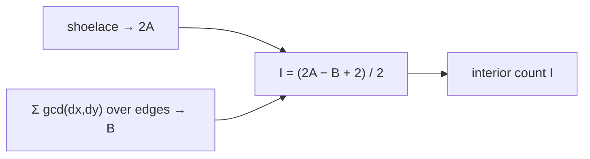
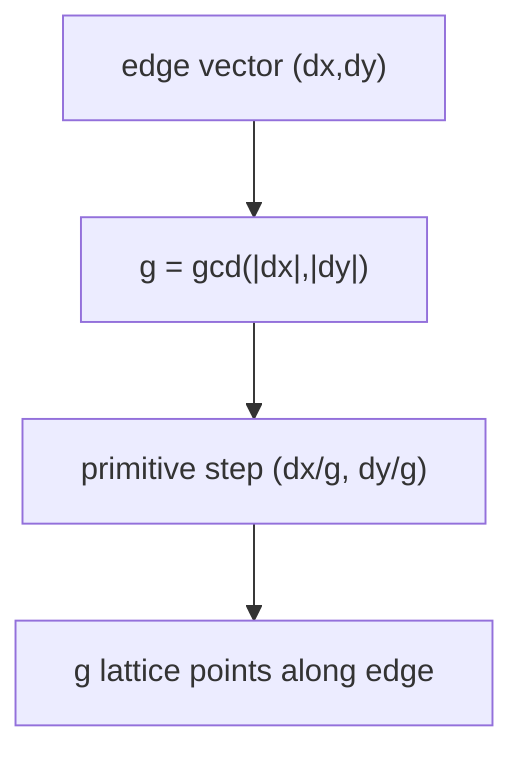
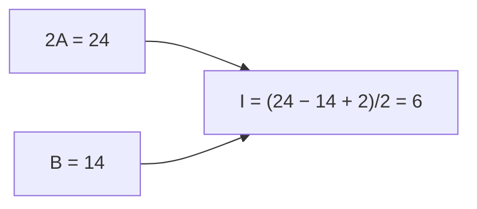
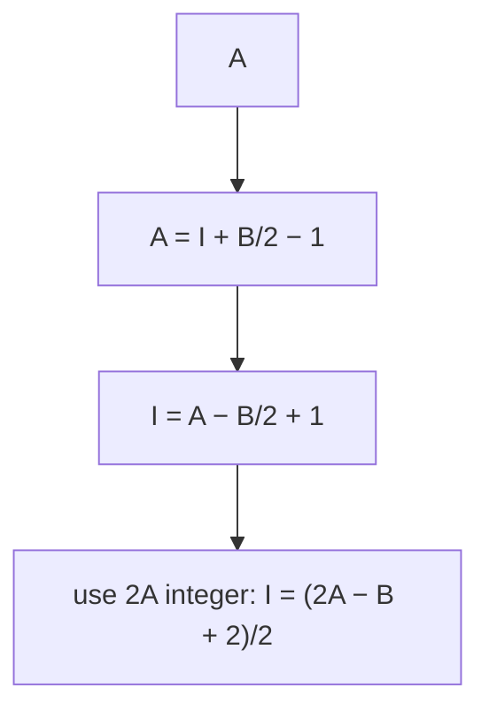
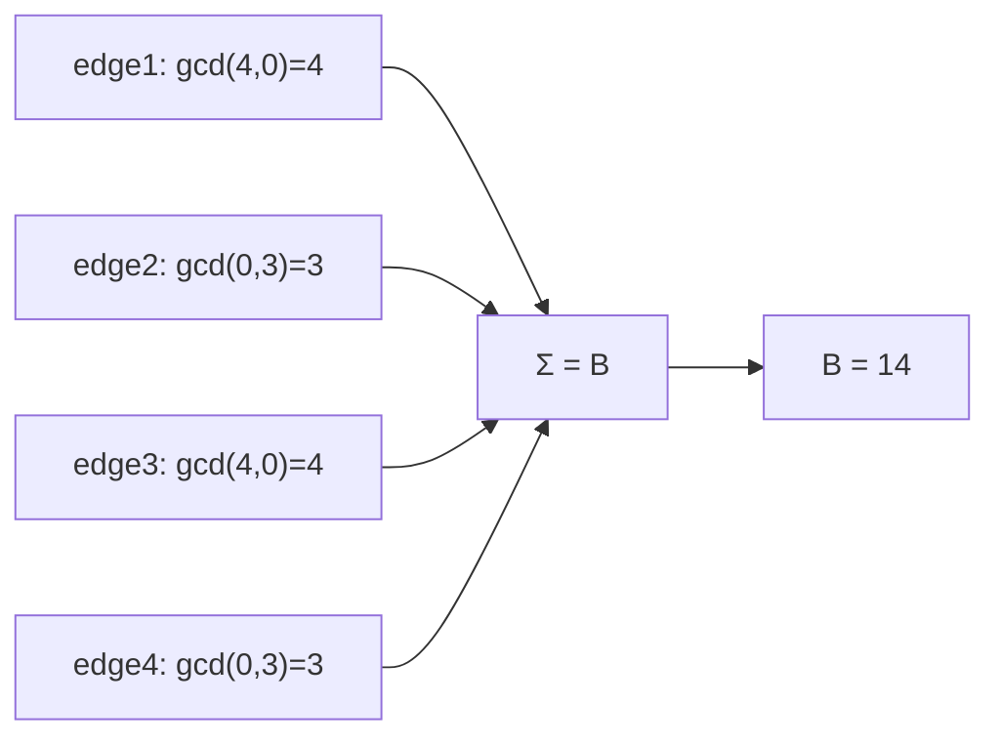
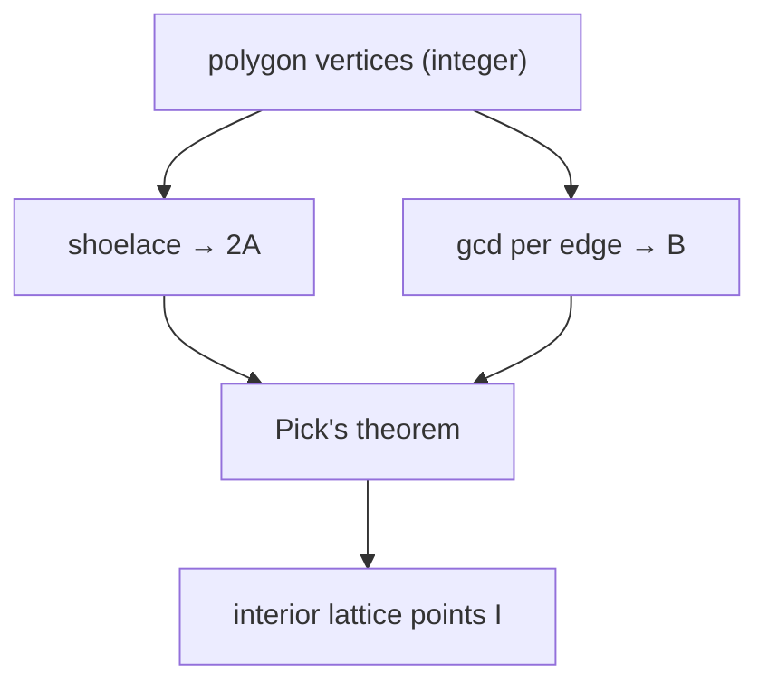
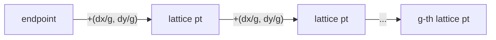

# Interior Lattice Points via Pick's Theorem

| Meta | Value |
|------|-------|
| **Problem** | Count Interior Lattice Points of a Polygon |
| **Source** | Self-contained (computational geometry / number theory) |
| **Reference** | Pick's theorem + shoelace + boundary gcd |
| **Difficulty** | Medium |
| **Topics** | Geometry, Pick's theorem, Shoelace, gcd, Lattice points |
| **Time** | $O(n \log C)$ |
| **Space** | $O(1)$ |

---

## Problem Statement

Given a **simple polygon** whose $n$ vertices all sit on integer (lattice) points, count the
number of lattice points strictly **inside** the polygon.

```text
Input (4×3 rectangle):
  4
  0 0
  4 0
  4 3
  0 3

Interior lattice points: 6
   (the 3×2 grid of points strictly inside)

Input (triangle):
  3
  0 0
  4 0
  0 4

Interior lattice points: 3
```

---

## Approach (WHY)

**Pick's theorem** ties the area of a lattice polygon to its lattice-point counts:

$$A = I + \frac{B}{2} - 1$$

where $I$ = interior lattice points and $B$ = boundary lattice points. Solving for $I$:

$$I = A - \frac{B}{2} + 1 = \frac{2A - B + 2}{2}$$

So we need two ingredients, **both exact integers**:

1. **$2A$** — the *doubled* area from the shoelace formula (already an integer for lattice
   polygons, so no rounding).
2. **$B$** — boundary lattice points. A segment from $(x_1,y_1)$ to $(x_2,y_2)$ passes
   through $\gcd(|x_2-x_1|,\,|y_2-y_1|)$ lattice points if we count one endpoint per edge;
   summing over all edges (each shared vertex counted once) gives $B$.



**Why gcd counts a segment's lattice points.** Reduce the displacement vector
$(dx, dy)$ by $g=\gcd(dx,dy)$ to its primitive step $(dx/g, dy/g)$. Walking that primitive
step lands on a lattice point exactly $g$ times along the segment — so $g$ interior+one
endpoint lattice points lie on it.



---

## Implementation

```python
from math import gcd

class Point:
    __slots__ = ("x", "y")
    def __init__(self, x, y):
        self.x = x
        self.y = y

def doubled_area(poly):
    n = len(poly)
    s = 0
    for i in range(n):
        j = (i + 1) % n
        s += poly[i].x * poly[j].y - poly[j].x * poly[i].y
    return abs(s)                     # 2A, exact integer

def boundary_points(poly):
    n = len(poly)
    b = 0
    for i in range(n):
        j = (i + 1) % n
        dx = abs(poly[i].x - poly[j].x)
        dy = abs(poly[i].y - poly[j].y)
        b += gcd(dx, dy)
    return b                          # B

def interior_points(poly):
    a2 = doubled_area(poly)           # 2A
    b = boundary_points(poly)         # B
    return (a2 - b + 2) // 2          # Pick: I
```

```cpp
#include <bits/stdc++.h>
using namespace std;

struct Point {
    long long x, y;
    Point(long long x = 0, long long y = 0) : x(x), y(y) {}
};

long long doubled_area(const vector<Point>& poly) {
    int n = (int)poly.size();
    long long s = 0;
    for (int i = 0; i < n; i++) {
        int j = (i + 1) % n;
        s += poly[i].x * poly[j].y - poly[j].x * poly[i].y;
    }
    return llabs(s);                  // 2A, exact integer
}

long long boundary_points(const vector<Point>& poly) {
    int n = (int)poly.size();
    long long b = 0;
    for (int i = 0; i < n; i++) {
        int j = (i + 1) % n;
        long long dx = llabs(poly[i].x - poly[j].x);
        long long dy = llabs(poly[i].y - poly[j].y);
        b += __gcd(dx, dy);
    }
    return b;                         // B
}

long long interior_points(const vector<Point>& poly) {
    long long a2 = doubled_area(poly); // 2A
    long long b = boundary_points(poly); // B
    return (a2 - b + 2) / 2;          // Pick: I
}
```

---

## Trace

The $4\times3$ rectangle $(0,0),(4,0),(4,3),(0,3)$.

**Doubled area:**

| $i\to j$ | $x_i y_j - x_j y_i$ |
|---|---|
| $0\to1$ | $0\cdot0-4\cdot0=0$ |
| $1\to2$ | $4\cdot3-4\cdot0=12$ |
| $2\to3$ | $4\cdot3-0\cdot3=12$ |
| $3\to0$ | $0\cdot0-0\cdot3=0$ |

Sum $=24 \Rightarrow 2A = 24$ (so $A = 12$).

**Boundary points** via gcd per edge:

| edge | $(dx,dy)$ | gcd |
|---|---|---|
| bottom | $(4,0)$ | $4$ |
| right | $(0,3)$ | $3$ |
| top | $(4,0)$ | $4$ |
| left | $(0,3)$ | $3$ |

$B = 4+3+4+3 = 14$.

**Pick:** $I = (2A - B + 2)/2 = (24 - 14 + 2)/2 = 12/2 = 6$. ✓



---

## More Diagrams

**Pick's theorem balance** — area splits into interior and half-boundary contributions:



**Boundary count per edge:**



**Pipeline overview:**



**Why each lattice point of a segment is one primitive step:**



---

## Math & Complexity

- **Pick's theorem:** $A = I + \tfrac{B}{2} - 1 \Rightarrow I = \dfrac{2A - B + 2}{2}$.
- **Shoelace doubled area:** $2A = \left|\sum_i (x_i y_{i+1} - x_{i+1} y_i)\right|$, exact
  for integer coordinates.
- **Boundary points:** $B = \sum_{\text{edges}} \gcd(|dx|, |dy|)$.
- **Time:** $O(n \log C)$ (gcd per edge, $C$ = coordinate magnitude). **Space:** $O(1)$.
- **Overflow:** keep $2A$ in `long long`; products reach $\sim10^{18}$.

---

## Takeaway

Pick's theorem converts a *counting* problem into an *area* problem: compute the exact
**doubled area** with the shoelace formula, count **boundary** lattice points as a sum of
per-edge gcds, then read off interior points with $I = (2A - B + 2)/2$ — all in exact
integer arithmetic.
