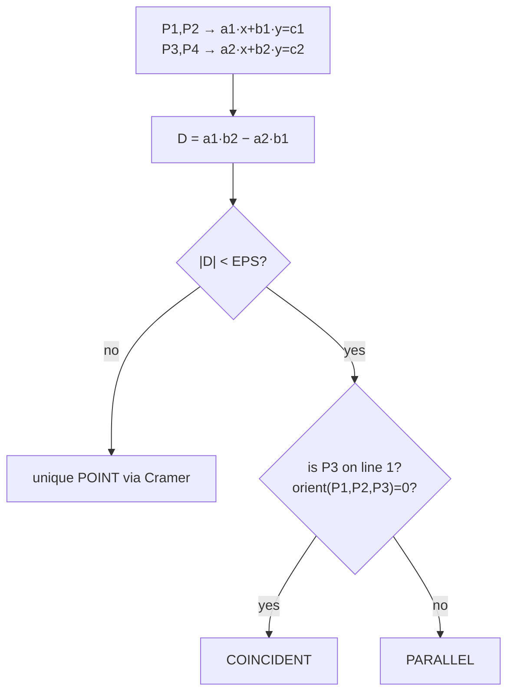
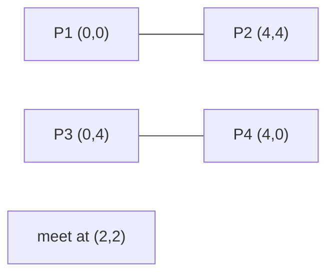
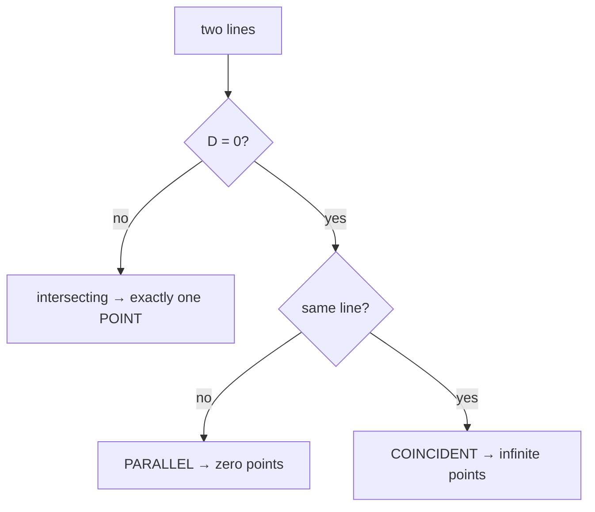
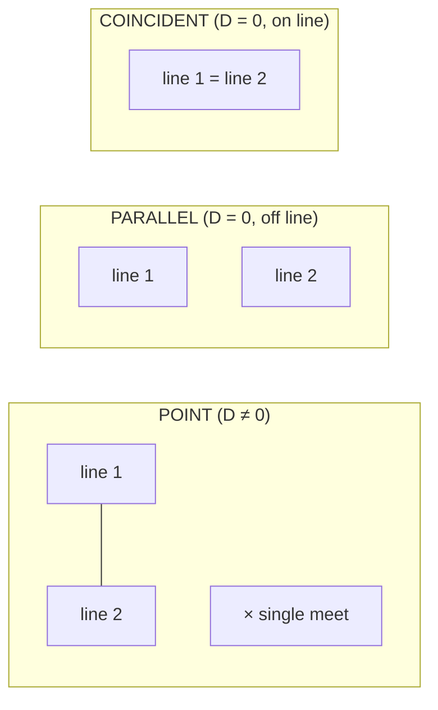
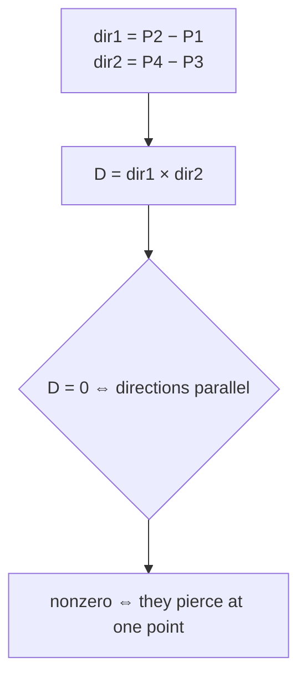

# Line Intersection Point (Where Do Two Lines Meet?)

| Field | Value |
|---|---|
| Source | Classic computational-geometry primitive (self-contained) |
| Difficulty | Medium |
| Primary topic | **Line intersection via determinant / Cramer's rule** |
| Secondary topic | Parallel vs coincident detection, floating-point guard |
| Key constraint | Integer input coordinates; output point as `double` with `EPS = 1e-9` |

---

## Statement

You are given two lines, each described by **two distinct points** it passes through:

- Line 1 through $P_1 = (x_1, y_1)$ and $P_2 = (x_2, y_2)$.
- Line 2 through $P_3 = (x_3, y_3)$ and $P_4 = (x_4, y_4)$.

These are **infinite lines**, not segments. Report one of:

- `POINT x y` — the unique intersection point (printed with enough decimals).
- `PARALLEL` — the lines never meet.
- `COINCIDENT` — the lines are identical (infinitely many shared points).

### Example

```text
Line 1: (0, 0) -- (4, 4)
Line 2: (0, 4) -- (4, 0)
Output: POINT 2.000000 2.000000

Line 1: (0, 0) -- (1, 1)
Line 2: (0, 1) -- (1, 2)
Output: PARALLEL

Line 1: (0, 0) -- (2, 2)
Line 2: (1, 1) -- (3, 3)
Output: COINCIDENT
```

---

## WHY: Convert to $ax+by=c$ and Solve a 2×2 System

Each line through two points becomes an implicit equation $a x + b y = c$ with

$$
a = y_2 - y_1, \qquad b = x_1 - x_2, \qquad c = a x_1 + b y_1.
$$

Two such equations form a linear system. **Cramer's rule** solves it using the determinant
$D = a_1 b_2 - a_2 b_1$:

$$
x = \frac{c_1 b_2 - c_2 b_1}{D}, \qquad y = \frac{a_1 c_2 - a_2 c_1}{D}.
$$



The determinant $D$ is the cross product of the two **direction** vectors; it vanishes exactly
when the lines are parallel. To split parallel into *coincident* vs *strictly parallel*, ask
whether a point of one line lies on the other — an integer orientation test, so that branch stays
exact.

---

## Code

```python
import sys
from dataclasses import dataclass

EPS = 1e-9

@dataclass(frozen=True)
class Point:
    x: int
    y: int

def cross(ax: int, ay: int, bx: int, by: int) -> int:
    return ax * by - ay * bx

def orient(p: Point, q: Point, r: Point) -> int:
    val = cross(q.x - p.x, q.y - p.y, r.x - p.x, r.y - p.y)
    if val > 0:
        return 1
    if val < 0:
        return -1
    return 0

def line_intersection(p1: Point, p2: Point, p3: Point, p4: Point):
    a1 = p2.y - p1.y
    b1 = p1.x - p2.x
    c1 = a1 * p1.x + b1 * p1.y
    a2 = p4.y - p3.y
    b2 = p3.x - p4.x
    c2 = a2 * p3.x + b2 * p3.y

    det = a1 * b2 - a2 * b1
    if abs(det) < EPS:
        # parallel: coincident iff P3 lies on line P1P2
        if orient(p1, p2, p3) == 0:
            return ("COINCIDENT", None)
        return ("PARALLEL", None)

    x = (c1 * b2 - c2 * b1) / det
    y = (a1 * c2 - a2 * c1) / det
    return ("POINT", (x, y))

def main() -> None:
    data = list(map(int, sys.stdin.read().split()[:8]))
    p1 = Point(data[0], data[1])
    p2 = Point(data[2], data[3])
    p3 = Point(data[4], data[5])
    p4 = Point(data[6], data[7])

    kind, pt = line_intersection(p1, p2, p3, p4)
    if kind == "POINT":
        print(f"POINT {pt[0]:.6f} {pt[1]:.6f}")
    else:
        print(kind)

if __name__ == "__main__":
    main()
```

```cpp
#include <bits/stdc++.h>
using namespace std;

const double EPS = 1e-9;

struct Point {
    long long x, y;
};

long long cross(long long ax, long long ay, long long bx, long long by) {
    return ax * by - ay * bx;
}

int orient(const Point& p, const Point& q, const Point& r) {
    long long val = cross(q.x - p.x, q.y - p.y, r.x - p.x, r.y - p.y);
    if (val > 0) return 1;
    if (val < 0) return -1;
    return 0;
}

// kind: 0 POINT, 1 PARALLEL, 2 COINCIDENT
int line_intersection(const Point& p1, const Point& p2,
                      const Point& p3, const Point& p4,
                      double& ix, double& iy) {
    double a1 = p2.y - p1.y;
    double b1 = p1.x - p2.x;
    double c1 = a1 * p1.x + b1 * p1.y;
    double a2 = p4.y - p3.y;
    double b2 = p3.x - p4.x;
    double c2 = a2 * p3.x + b2 * p3.y;

    double det = a1 * b2 - a2 * b1;
    if (fabs(det) < EPS) {
        // parallel: coincident iff P3 lies on line P1P2
        return (orient(p1, p2, p3) == 0) ? 2 : 1;
    }

    ix = (c1 * b2 - c2 * b1) / det;
    iy = (a1 * c2 - a2 * c1) / det;
    return 0;
}

int main() {
    ios::sync_with_stdio(false);
    cin.tie(nullptr);

    Point p1, p2, p3, p4;
    cin >> p1.x >> p1.y >> p2.x >> p2.y;
    cin >> p3.x >> p3.y >> p4.x >> p4.y;

    double ix = 0.0, iy = 0.0;
    int kind = line_intersection(p1, p2, p3, p4, ix, iy);
    if (kind == 0) {
        cout << fixed << setprecision(6) << "POINT " << ix << " " << iy << "\n";
    } else if (kind == 1) {
        cout << "PARALLEL\n";
    } else {
        cout << "COINCIDENT\n";
    }
    return 0;
}
```

---

## Trace

Lines through $P_1=(0,0),P_2=(4,4)$ and $P_3=(0,4),P_4=(4,0)$.

| Quantity | Value |
|---|---|
| $a_1 = y_2 - y_1$ | $4$ |
| $b_1 = x_1 - x_2$ | $-4$ |
| $c_1 = a_1 x_1 + b_1 y_1$ | $0$ |
| $a_2 = y_4 - y_3$ | $-4$ |
| $b_2 = x_3 - x_4$ | $-4$ |
| $c_2 = a_2 x_3 + b_2 y_3$ | $-16$ |
| $D = a_1 b_2 - a_2 b_1$ | $4(-4) - (-4)(-4) = -16 - 16 = -32$ |
| $x = (c_1 b_2 - c_2 b_1)/D$ | $(0 - (-16)(-4))/-32 = -64/-32 = 2$ |
| $y = (a_1 c_2 - a_2 c_1)/D$ | $(4(-16) - 0)/-32 = -64/-32 = 2$ |

Output: `POINT 2.000000 2.000000`.



---

## More Pictures: The Three Outcomes



The geometry of each case:



Why $D$ is the direction cross product:



---

## Math and Complexity

Writing the system in matrix form,

$$
\begin{bmatrix} a_1 & b_1 \\ a_2 & b_2 \end{bmatrix}
\begin{bmatrix} x \\ y \end{bmatrix}
=
\begin{bmatrix} c_1 \\ c_2 \end{bmatrix},
\qquad
D = \det\begin{bmatrix} a_1 & b_1 \\ a_2 & b_2 \end{bmatrix} = a_1 b_2 - a_2 b_1.
$$

Cramer's rule replaces a column with the right-hand side:

$$
x = \frac{1}{D}\det\begin{bmatrix} c_1 & b_1 \\ c_2 & b_2 \end{bmatrix}, \qquad
y = \frac{1}{D}\det\begin{bmatrix} a_1 & c_1 \\ a_2 & c_2 \end{bmatrix}.
$$

| Metric | Value |
|---|---|
| Time | $O(1)$ — a handful of multiplies and one division |
| Space | $O(1)$ |
| Precision | Determinant and parallel/coincident test stay integer-exact; only the final coordinates are `double` |

---

## Takeaway

Turn each line into $a x + b y = c$, compute the determinant $D$, and apply Cramer's rule. The
single branch that matters is $D \approx 0$: split it into `COINCIDENT` vs `PARALLEL` with an
**integer** orientation test, and only the surviving unique-point case ever divides.
