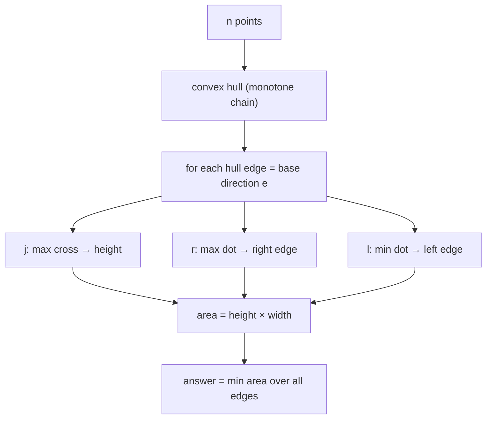
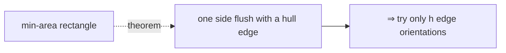
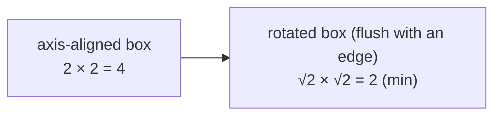
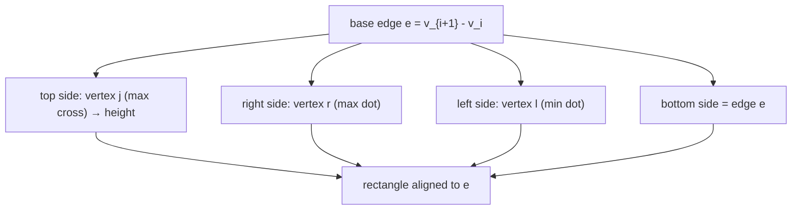
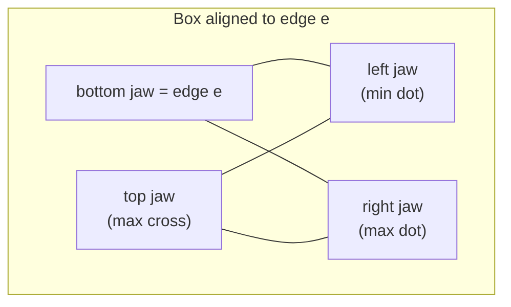
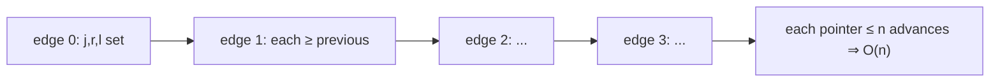
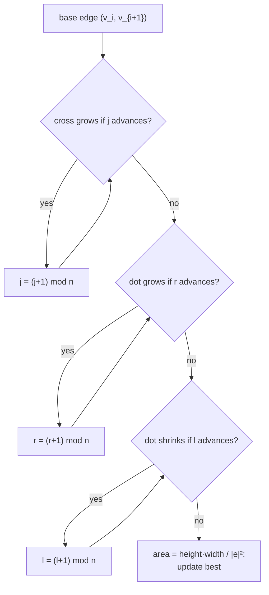

# Minimum-Area Enclosing Rectangle (Rotating Calipers)

| Meta | Value |
|------|-------|
| **Problem** | Minimum-area bounding rectangle of a point set |
| **Source** | Self-contained (computational geometry) |
| **Reference** | Convex hull + rotating calipers (Toussaint) |
| **Difficulty** | Hard |
| **Topics** | Geometry, Convex hull, Rotating calipers, Two pointers |
| **Time** | $O(n \log n)$ |
| **Space** | $O(n)$ |

---

## Problem Statement

Given $n$ points, find the **rectangle of smallest area** (allowed to be rotated to *any* orientation)
that contains all of them. Return the minimum area.

```text
Input:  points = [(0,0),(4,0),(4,2),(0,2)]
Output: 8.0
The points already form a 4 × 2 axis-aligned rectangle; min area = 8.

Input:  points = [(1,0),(0,1),(-1,0),(0,-1)]   (a diamond / rotated square)
Output: 2.0
The tightest box is the 45°-rotated square with side √2; area = (√2)² = 2.
```

---

## Approach (WHY)

A famous theorem (Freeman–Shamos / Toussaint): the **minimum-area enclosing rectangle** of a convex
polygon has **at least one side collinear with a hull edge**. So we only need to try the orientations
defined by the $h$ hull edges — not every angle. For each edge direction we compute the tight bounding
box aligned to it, then keep the smallest area.

The *WHY* of three rotating pointers: fixing edge $v_i v_{i+1}$ as the base direction $e$, the aligned
box is bounded by

- the **antipodal** vertex farthest from the edge line → gives the **height** (`argmax cross`),
- the vertex with the **largest** projection onto $e$ → the **right** side (`argmax dot`),
- the vertex with the **smallest** projection onto $e$ → the **left** side (`argmin dot`).

As the base edge rotates CCW, all three of these vertices move only **forward**, so a single pass over
all edges advances each pointer at most one full lap — rotating calipers in $O(n)$.





---

## Solution

```python
class Point:
    __slots__ = ("x", "y")
    def __init__(self, x, y):
        self.x = x
        self.y = y

def cross(o, a, b):
    # (a - o) x (b - o); twice the signed triangle area — perpendicular extent
    return (a.x - o.x) * (b.y - o.y) - (a.y - o.y) * (b.x - o.x)

def dot(o, a, b):
    # (a - o) . (b - o); projection of b onto the edge direction (a - o)
    return (a.x - o.x) * (b.x - o.x) + (a.y - o.y) * (b.y - o.y)

def dist2(a, b):
    dx, dy = a.x - b.x, a.y - b.y
    return dx * dx + dy * dy

def convex_hull(points):
    pts = sorted(set((p.x, p.y) for p in points))      # dedupe + sort by (x, y)
    pts = [Point(x, y) for x, y in pts]
    if len(pts) <= 2:
        return pts

    def build(seq):
        h = []
        for p in seq:
            while len(h) >= 2 and cross(h[-2], h[-1], p) <= 0:
                h.pop()
            h.append(p)
        return h

    lower = build(pts)
    upper = build(reversed(pts))
    return lower[:-1] + upper[:-1]                      # CCW, minimal vertices

def min_area_rectangle(points):
    hull = convex_hull(points)
    n = len(hull)
    if n < 3:
        return 0.0                                      # a point or a segment encloses zero area

    best = float("inf")
    j = 1                                               # height pointer (max cross)
    r = 1                                               # right pointer (max dot)
    l = 0                                               # left pointer (min dot)
    for i in range(n):
        ni = (i + 1) % n
        while cross(hull[i], hull[ni], hull[(j + 1) % n]) > cross(hull[i], hull[ni], hull[j]):
            j = (j + 1) % n
        while dot(hull[i], hull[ni], hull[(r + 1) % n]) > dot(hull[i], hull[ni], hull[r]):
            r = (r + 1) % n
        if i == 0:
            l = r                                       # seed the min-projection pointer
        while dot(hull[i], hull[ni], hull[(l + 1) % n]) < dot(hull[i], hull[ni], hull[l]):
            l = (l + 1) % n

        edge2 = dist2(hull[i], hull[ni])                # |e|^2 (exact integer)
        height = cross(hull[i], hull[ni], hull[j])      # |e| * perpendicular height
        width = dot(hull[i], hull[ni], hull[r]) - dot(hull[i], hull[ni], hull[l])  # |e| * width
        area = (float(height) * float(width)) / edge2   # cast to double to avoid overflow
        best = min(best, area)
    return best

pts = [Point(1, 0), Point(0, 1), Point(-1, 0), Point(0, -1)]
print(min_area_rectangle(pts))   # 2.0
```

```cpp
#include <bits/stdc++.h>
using namespace std;

struct Point {
    long long x, y;
};

// (a - o) x (b - o); twice the signed triangle area — perpendicular extent
long long cross(const Point &o, const Point &a, const Point &b) {
    return (a.x - o.x) * (b.y - o.y) - (a.y - o.y) * (b.x - o.x);
}

// (a - o) . (b - o); projection of b onto the edge direction (a - o)
long long dot(const Point &o, const Point &a, const Point &b) {
    return (a.x - o.x) * (b.x - o.x) + (a.y - o.y) * (b.y - o.y);
}

long long dist2(const Point &a, const Point &b) {
    long long dx = a.x - b.x, dy = a.y - b.y;
    return dx * dx + dy * dy;
}

vector<Point> convex_hull(vector<Point> pts) {
    sort(pts.begin(), pts.end(), [](const Point &a, const Point &b) {
        return a.x != b.x ? a.x < b.x : a.y < b.y;      // sort by (x, y)
    });
    pts.erase(unique(pts.begin(), pts.end(), [](const Point &a, const Point &b) {
        return a.x == b.x && a.y == b.y;                // dedupe
    }), pts.end());

    int n = (int)pts.size();
    if (n <= 2) return pts;

    vector<Point> hull(2 * n);
    int k = 0;
    for (int i = 0; i < n; ++i) {
        while (k >= 2 && cross(hull[k - 2], hull[k - 1], pts[i]) <= 0) --k;
        hull[k++] = pts[i];
    }
    int lower = k + 1;
    for (int i = n - 2; i >= 0; --i) {
        while (k >= lower && cross(hull[k - 2], hull[k - 1], pts[i]) <= 0) --k;
        hull[k++] = pts[i];
    }
    hull.resize(k - 1);                                 // CCW, minimal vertices
    return hull;
}

double min_area_rectangle(vector<Point> points) {
    vector<Point> hull = convex_hull(points);
    int n = (int)hull.size();
    if (n < 3) return 0.0;                              // a point or a segment encloses zero area

    double best = numeric_limits<double>::infinity();
    int j = 1;                                          // height pointer (max cross)
    int r = 1;                                          // right pointer (max dot)
    int l = 0;                                          // left pointer (min dot)
    for (int i = 0; i < n; ++i) {
        int ni = (i + 1) % n;
        while (cross(hull[i], hull[ni], hull[(j + 1) % n]) > cross(hull[i], hull[ni], hull[j]))
            j = (j + 1) % n;
        while (dot(hull[i], hull[ni], hull[(r + 1) % n]) > dot(hull[i], hull[ni], hull[r]))
            r = (r + 1) % n;
        if (i == 0) l = r;                              // seed the min-projection pointer
        while (dot(hull[i], hull[ni], hull[(l + 1) % n]) < dot(hull[i], hull[ni], hull[l]))
            l = (l + 1) % n;

        long long edge2 = dist2(hull[i], hull[ni]);     // |e|^2 (exact integer)
        long long height = cross(hull[i], hull[ni], hull[j]);   // |e| * perpendicular height
        long long width = dot(hull[i], hull[ni], hull[r]) - dot(hull[i], hull[ni], hull[l]); // |e| * width
        double area = ((double)height * (double)width) / (double)edge2;  // cast to avoid overflow
        best = min(best, area);
    }
    return best;
}

int main() {
    vector<Point> pts = {{1, 0}, {0, 1}, {-1, 0}, {0, -1}};
    cout << min_area_rectangle(pts) << "\n";   // 2
    return 0;
}
```

---

## Trace

Input `[(1,0),(0,1),(-1,0),(0,-1)]` — a diamond, already convex CCW, $n = 4$. Take the base edge
$e$ = $(1,0)\to(0,1)$, direction $(-1, 1)$, with $\lVert e\rVert^2 = 2$.

| pointer | role | chosen vertex for edge $(1,0)\to(0,1)$ | value |
|---------|------|----------------------------------------|-------|
| `j` (max cross) | height | $(-1,0)$ | `cross = 2` → $|e|\cdot h = 2$ |
| `r` (max dot) | right | $(0,1)$ | `dot = 0` (relative to $v_i$) |
| `l` (min dot) | left | $(0,-1)$ | `dot = -2` |

So `height = 2` ($= |e|\cdot h$), `width = dot_r - dot_l = 0 - (-2) = 2` ($= |e|\cdot w$), and

$$
\text{area} = \frac{\text{height}\cdot\text{width}}{\lVert e\rVert^2} = \frac{2\cdot 2}{2} = 2.
$$

By symmetry every edge of the diamond yields area $2$, so `best = 2.0`. The tight box is the
$45°$-rotated square of side $\sqrt2$, area $(\sqrt2)^2 = 2$ — smaller than the axis-aligned $2\times2$
bounding box of area $4$. ✔



---

## Diagrams

The three rotating pointers for a fixed base edge build all four sides of the box:



The aligned rectangle wrapping the hull:



All three pointers advance monotonically as the base edge rotates (none ever rewinds):



Decision flow inside one iteration:



---

## Math / Complexity

With base direction $e = v_{i+1} - v_i$, the rectangle aligned to it has

$$
\text{height} = \frac{\operatorname{cross}(v_i, v_{i+1}, v_j)}{\lVert e\rVert}, \qquad
\text{width} = \frac{\operatorname{dot}(v_i, v_{i+1}, v_r) - \operatorname{dot}(v_i, v_{i+1}, v_l)}{\lVert e\rVert},
$$

so the area divides the two big integer products by $\lVert e\rVert^2$:

$$
\text{area} = \text{height}\cdot\text{width}
= \frac{\operatorname{cross}\cdot(\operatorname{dot}_r - \operatorname{dot}_l)}{\lVert e\rVert^2}.
$$

Both $\operatorname{cross}$ and the $\operatorname{dot}$ difference are exact `long long`, but their
**product** can exceed 64 bits for coordinates near $10^9$ — cast to `double` *before* multiplying (as
the code does). The hull is $O(n \log n)$; each of $j$, $r$, $l$ advances at most $n$ times total, so the
calipers sweep is $O(n)$:

$$
T = O(n \log n), \qquad S = O(n).
$$

---

## Takeaway

By the rotating-calipers theorem the minimum-area rectangle is **flush with a hull edge**, so iterate
over the $h$ edge orientations and, for each, read off **height** (max `cross`) and **width** (max minus
min `dot`) using three monotone pointers. One linear sweep after the hull gives the tightest box in
$O(n \log n)$ — multiply `height·width` in `double` to dodge overflow.
