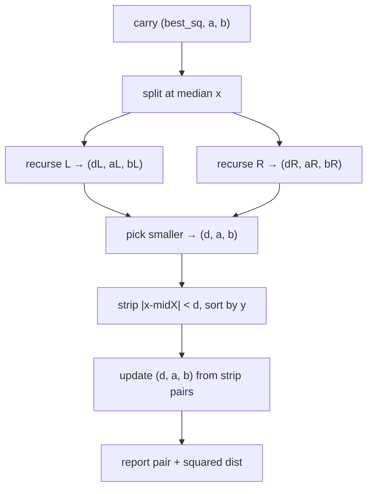
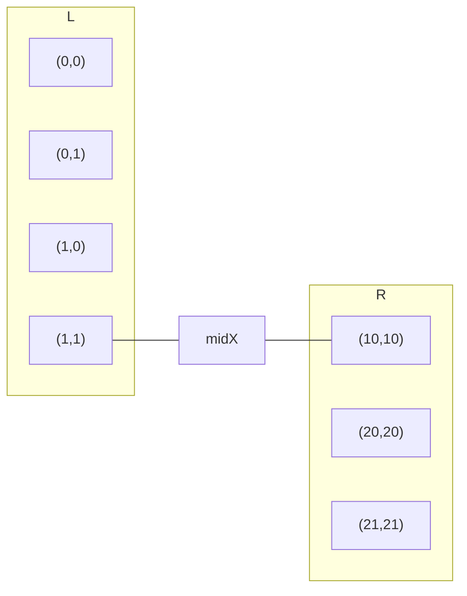
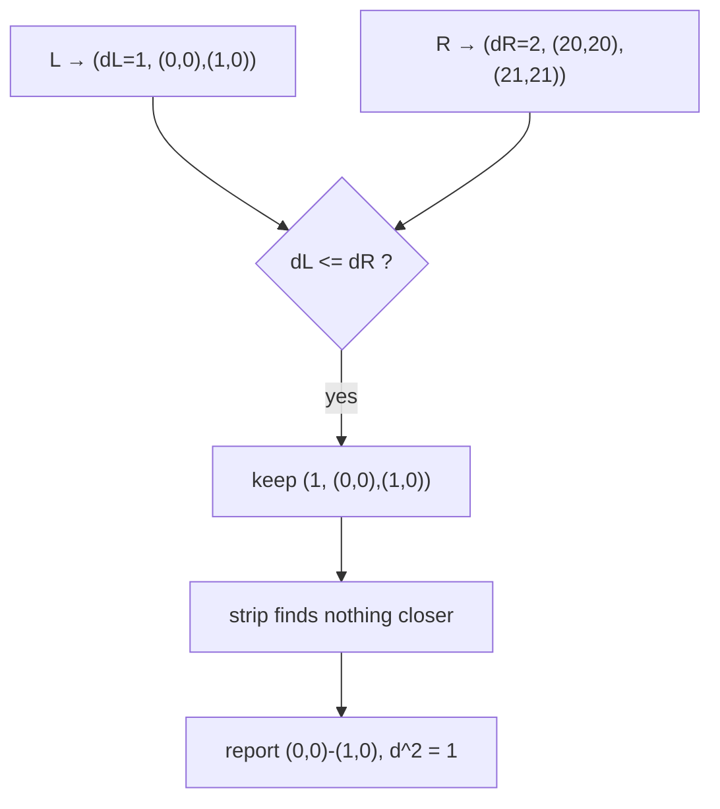
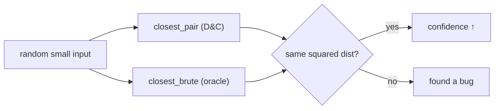

# Minimum Euclidean Distance Pair — Report the Closest Pair & Its Squared Distance

| Meta | Value |
|------|-------|
| **Problem** | Report the closest pair of points and its (squared) distance |
| **Source** | Classic computational geometry (self-contained) |
| **Difficulty** | Hard |
| **Topics** | Geometry, Divide & conquer, Brute-force oracle, Squared distance |
| **Time** | $O(n \log n)$ |
| **Space** | $O(n)$ |

---

## Problem Statement

Given $n$ points $p_1, \dots, p_n$ in the plane, output **both** the two closest points **and** their
**squared** Euclidean distance
$$
d^2 = \min_{i \ne j} \big[(x_i - x_j)^2 + (y_i - y_j)^2\big].
$$
Reporting the squared value keeps the answer an exact integer (no floating point); the real distance
is $\sqrt{d^2}$ if needed.

```text
Input:
7
0 0
10 10
1 0
20 20
21 21
1 1
0 1
Output:
closest pair         = (0,0) (1,0)
closest squared dist = 1
closest real dist    = 1.00000000
```

(Several pairs tie at squared distance $1$, e.g. `(0,0)-(1,0)`, `(0,0)-(0,1)`, `(20,20)-(21,21)`;
any one valid closest pair is acceptable.)

---

## Approach (WHY)

We need not just the minimum value but the **witnessing pair**, so the recursion carries
`(best_sq, point_a, point_b)` everywhere and updates all three together. The engine is the standard
**divide & conquer**: sort by $x$, split at the median, recurse, then combine via a width-$2d$
**strip** scanned in $y$ order where each point checks only its next $\le 7$ neighbours. We also keep
a **brute-force** routine as a self-checking oracle and as the recursion's base case.



The *WHY* the pair survives the merge: at every junction we compare $d_L$ and $d_R$ and **keep the
endpoints** of whichever wins; the strip scan only overwrites them when it finds something strictly
closer. So the returned pair always matches the returned distance.

---

## Solution

```python
import math
from typing import List, Tuple

class Point:
    __slots__ = ("x", "y")
    def __init__(self, x: int, y: int):
        self.x = x
        self.y = y

def dist2(a: Point, b: Point) -> int:
    dx = a.x - b.x
    dy = a.y - b.y
    return dx * dx + dy * dy

def closest_brute(pts: List[Point]) -> Tuple[int, Point, Point]:
    best, ba, bb = math.inf, None, None
    for i in range(len(pts)):
        for j in range(i + 1, len(pts)):
            d = dist2(pts[i], pts[j])
            if d < best:
                best, ba, bb = d, pts[i], pts[j]
    return best, ba, bb
```

```cpp
#include <bits/stdc++.h>
using namespace std;

struct Point {
    long long x, y;
};

long long dist2(const Point &a, const Point &b) {
    long long dx = a.x - b.x;
    long long dy = a.y - b.y;
    return dx * dx + dy * dy;
}

struct Result { long long best; Point a, b; };

Result closestBrute(const vector<Point> &pts) {
    Result r{LLONG_MAX, {}, {}};
    for (int i = 0; i < (int)pts.size(); ++i)
        for (int j = i + 1; j < (int)pts.size(); ++j) {
            long long d = dist2(pts[i], pts[j]);
            if (d < r.best) { r.best = d; r.a = pts[i]; r.b = pts[j]; }
        }
    return r;
}
```

The $O(n \log n)$ divide & conquer that reports the witnessing pair:

```python
def closest_pair(pts: List[Point]) -> Tuple[int, Point, Point]:
    px = sorted(pts, key=lambda p: (p.x, p.y))

    def rec(a: int, b: int):
        if b - a <= 3:
            best, pa, pb = closest_brute(px[a:b])
            return best, pa, pb, sorted(px[a:b], key=lambda p: p.y)

        mid = (a + b) // 2
        midx = px[mid].x
        dl, al, bl, ly = rec(a, mid)
        dr, ar, br, ry = rec(mid, b)
        best, pa, pb = (dl, al, bl) if dl <= dr else (dr, ar, br)

        ys, i, j = [], 0, 0                           # merge by y in O(n)
        while i < len(ly) and j < len(ry):
            if ly[i].y <= ry[j].y:
                ys.append(ly[i]); i += 1
            else:
                ys.append(ry[j]); j += 1
        ys.extend(ly[i:]); ys.extend(ry[j:])

        strip = [p for p in ys if (p.x - midx) ** 2 < best]
        for s in range(len(strip)):                  # next ~7 neighbours by y
            t = s + 1
            while t < len(strip) and (strip[t].y - strip[s].y) ** 2 < best:
                d = dist2(strip[s], strip[t])
                if d < best:
                    best, pa, pb = d, strip[s], strip[t]
                t += 1
        return best, pa, pb, ys

    best, pa, pb, _ = rec(0, len(px))
    return best, pa, pb                              # squared distance + pair
```

```cpp
static Result rec(vector<Point> &px, int a, int b, vector<Point> &ys) {
    if (b - a <= 3) {
        vector<Point> sub(px.begin() + a, px.begin() + b);
        Result r = closestBrute(sub);
        ys = sub;
        sort(ys.begin(), ys.end(), [](const Point &p, const Point &q){ return p.y < q.y; });
        return r;
    }

    int mid = (a + b) / 2;
    long long midx = px[mid].x;
    vector<Point> ly, ry;
    Result rl = rec(px, a, mid, ly);
    Result rr = rec(px, mid, b, ry);
    Result best = (rl.best <= rr.best) ? rl : rr;

    ys.clear(); ys.reserve(b - a);                   // merge by y in O(n)
    int i = 0, j = 0;
    while (i < (int)ly.size() && j < (int)ry.size()) {
        if (ly[i].y <= ry[j].y) ys.push_back(ly[i++]);
        else                    ys.push_back(ry[j++]);
    }
    while (i < (int)ly.size()) ys.push_back(ly[i++]);
    while (j < (int)ry.size()) ys.push_back(ry[j++]);

    vector<Point> strip;
    for (const Point &p : ys)
        if ((p.x - midx) * (p.x - midx) < best.best) strip.push_back(p);

    for (int s = 0; s < (int)strip.size(); ++s)      // next ~7 neighbours by y
        for (int t = s + 1; t < (int)strip.size() &&
             (strip[t].y - strip[s].y) * (strip[t].y - strip[s].y) < best.best; ++t) {
            long long d = dist2(strip[s], strip[t]);
            if (d < best.best) { best.best = d; best.a = strip[s]; best.b = strip[t]; }
        }
    return best;
}

Result closestPair(vector<Point> pts) {
    sort(pts.begin(), pts.end(), [](const Point &p, const Point &q){
        return p.x != q.x ? p.x < q.x : p.y < q.y;
    });
    vector<Point> ys;
    return rec(pts, 0, (int)pts.size(), ys);         // squared distance + pair
}

int main() {
    int n;
    if (!(cin >> n)) return 0;
    vector<Point> pts(n);
    for (auto &p : pts) cin >> p.x >> p.y;
    Result r = closestPair(pts);
    cout << "closest pair         = (" << r.a.x << "," << r.a.y << ") ("
         << r.b.x << "," << r.b.y << ")\n";
    cout << "closest squared dist = " << r.best << "\n";
    cout << fixed << setprecision(8)
         << "closest real dist    = " << sqrt((double)r.best) << "\n";
    return 0;
}
```

---

## Trace

Points sorted by $x$: `(0,0) (0,1) (1,0) (1,1) (10,10) (20,20) (21,21)`.

| Step | Action | Result |
|------|--------|--------|
| Split | median ≈ `(1,1)` | L = first 4, R = last 3 |
| L recurse | base brute on `(0,0)(0,1)(1,0)(1,1)`-region splits | $d_L = 1$ via `(0,0)-(1,0)` |
| R base | brute `(10,10)(20,20)(21,21)` | $d_R = 2$ via `(20,20)-(21,21)` |
| Combine | $d = 1$, strip $|x-\text{midX}|^2 < 1$ | tiny strip, no closer pair |
| Report | | pair `(0,0)-(1,0)`, squared $= 1$ |



How the pair is carried up through the recursion:



Validating against the brute-force oracle (stress test idea):



---

## Math & Complexity

Carrying the witnessing pair adds only $O(1)$ bookkeeping per merge, so the asymptotics are unchanged:
$$
T(n) = 2\,T\!\left(\tfrac{n}{2}\right) + O(n) = O(n \log n).
$$

- **Time:** $O(n \log n)$ for divide & conquer; the brute oracle is $O(n^2)$ (base case / testing
  only).
- **Space:** $O(n)$.
- **Why squared:** with $|x|,|y| \le 10^9$ the squared distance reaches $\sim 2\times10^{18}$, fitting
  `long long`; reporting $d^2$ avoids any floating-point rounding in the answer, and $\sqrt{d^2}$
  recovers the real distance once.

---

## Takeaway

To **report the pair** (not just the minimum value), thread `(best_sq, a, b)` through the whole
recursion and update the endpoints alongside the distance. Keep the brute force as both the base case
and a stress-test oracle, compare **squared** distances for exactness, and output $d^2$ — taking the
square root only if a real number is demanded.
