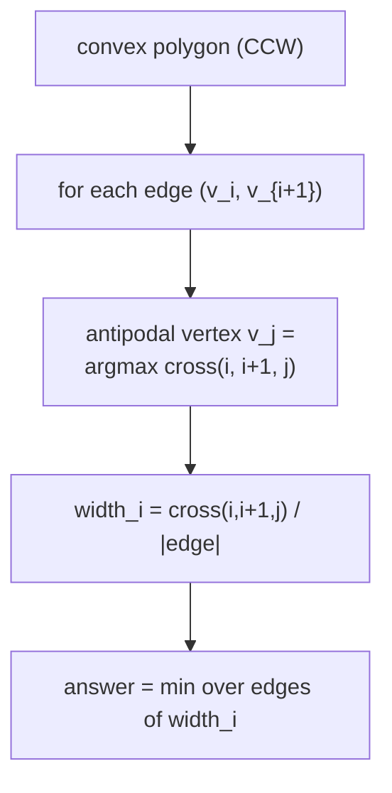
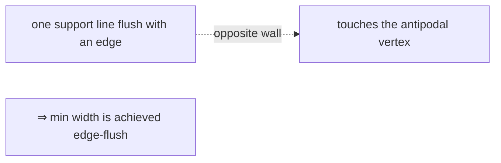
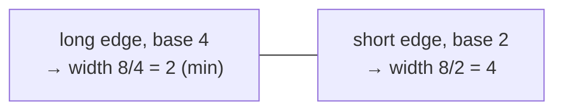
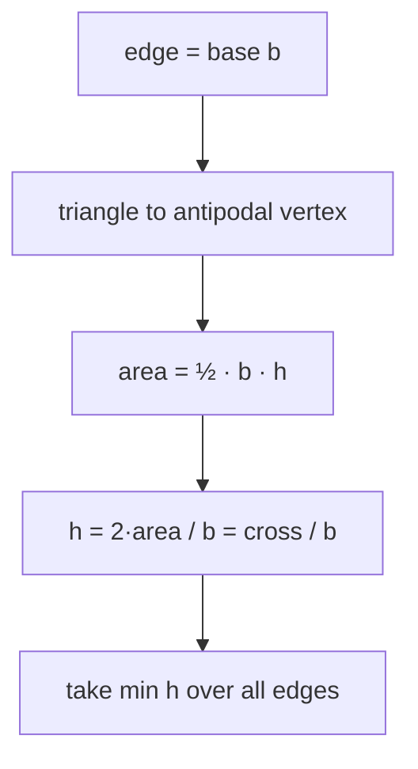
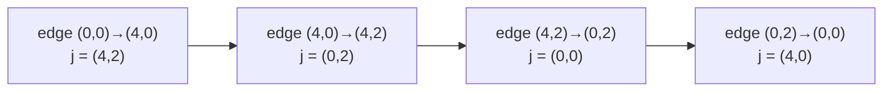
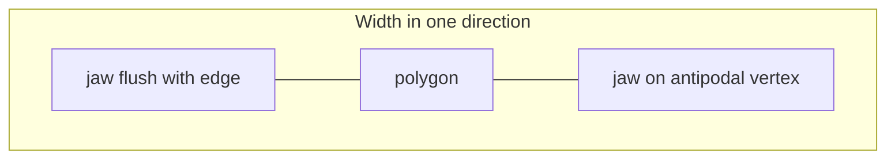

# Minimum Width of a Convex Polygon (Rotating Calipers)

| Meta | Value |
|------|-------|
| **Problem** | Minimum width of a convex polygon |
| **Source** | Self-contained (computational geometry) |
| **Reference** | Convex hull + rotating calipers |
| **Difficulty** | Medium |
| **Topics** | Geometry, Convex hull, Rotating calipers, Two pointers |
| **Time** | $O(n \log n)$ |
| **Space** | $O(n)$ |

---

## Problem Statement

The **width** of a convex polygon is the smallest distance between any pair of **parallel support
lines** (think: the narrowest gap a pair of parallel walls can squeeze the polygon into). Given the
vertices of a convex polygon (or a raw point set whose hull you take), compute that minimum width.

```text
Input:  polygon = [(0,0),(4,0),(4,2),(0,2)]   (a 4 × 2 rectangle, CCW)
Output: 2.0
The narrowest parallel walls are the long sides 2 apart; width = 2.

Input:  polygon = [(0,0),(4,0),(2,1)]         (a thin triangle)
Output: 0.894427...
Min width = 2·area / longest base = (2·4·1/2) / sqrt(20) = 4 / 4.4721 ≈ 0.8944.
```

---

## Approach (WHY)

A minimum-width pair of parallel support lines always has **one line flush with a polygon edge** (you
can always rotate a pair of supporting lines until one touches an edge without increasing the gap). So
for **each edge**, the width in that direction is the perpendicular distance from the edge's line to the
single **antipodal vertex** that is farthest from it. The answer is the minimum of these per-edge widths.

The *WHY* of the linear sweep: for edge $v_i v_{i+1}$, the farthest vertex maximizes the triangle area
$\operatorname{cross}(v_i, v_{i+1}, v_j)$, and the perpendicular distance is $2\cdot\text{area} / \text{base}$.
As the edge rotates CCW, that farthest vertex $j$ moves only forward — rotating calipers — so all $n$
edges are processed in $O(n)$ with a single advancing pointer.





---

## Solution

```python
import math

class Point:
    __slots__ = ("x", "y")
    def __init__(self, x, y):
        self.x = x
        self.y = y

def cross(o, a, b):
    # (a - o) x (b - o); equals twice the signed area of triangle OAB
    return (a.x - o.x) * (b.y - o.y) - (a.y - o.y) * (b.x - o.x)

def dist2(a, b):
    dx, dy = a.x - b.x, a.y - b.y
    return dx * dx + dy * dy

def convex_hull(points):
    pts = sorted(set((p.x, p.y) for p in points))      # dedupe + sort by (x, y)
    pts = [Point(x, y) for x, y in pts]
    if len(pts) <= 2:
        return pts

    def build(seq):
        h = []
        for p in seq:
            while len(h) >= 2 and cross(h[-2], h[-1], p) <= 0:
                h.pop()
            h.append(p)
        return h

    lower = build(pts)
    upper = build(reversed(pts))
    return lower[:-1] + upper[:-1]                      # CCW, minimal vertices

def min_width(points):
    hull = convex_hull(points)                          # works for raw points or a convex polygon
    n = len(hull)
    if n < 3:
        return 0.0                                      # a point or a segment has zero width

    best = float("inf")
    j = 1
    for i in range(n):
        ni = (i + 1) % n
        # antipodal vertex = farthest from this edge's supporting line
        while cross(hull[i], hull[ni], hull[(j + 1) % n]) > cross(hull[i], hull[ni], hull[j]):
            j = (j + 1) % n
        area2 = cross(hull[i], hull[ni], hull[j])       # 2 * triangle area (exact integer)
        edge_len = math.sqrt(dist2(hull[i], hull[ni]))
        best = min(best, area2 / edge_len)              # perpendicular width = 2*area / base
    return best

poly = [Point(0, 0), Point(4, 0), Point(4, 2), Point(0, 2)]
print(min_width(poly))   # 2.0
```

```cpp
#include <bits/stdc++.h>
using namespace std;

struct Point {
    long long x, y;
};

// (a - o) x (b - o); equals twice the signed area of triangle OAB
long long cross(const Point &o, const Point &a, const Point &b) {
    return (a.x - o.x) * (b.y - o.y) - (a.y - o.y) * (b.x - o.x);
}

long long dist2(const Point &a, const Point &b) {
    long long dx = a.x - b.x, dy = a.y - b.y;
    return dx * dx + dy * dy;
}

vector<Point> convex_hull(vector<Point> pts) {
    sort(pts.begin(), pts.end(), [](const Point &a, const Point &b) {
        return a.x != b.x ? a.x < b.x : a.y < b.y;      // sort by (x, y)
    });
    pts.erase(unique(pts.begin(), pts.end(), [](const Point &a, const Point &b) {
        return a.x == b.x && a.y == b.y;                // dedupe
    }), pts.end());

    int n = (int)pts.size();
    if (n <= 2) return pts;

    vector<Point> hull(2 * n);
    int k = 0;
    for (int i = 0; i < n; ++i) {
        while (k >= 2 && cross(hull[k - 2], hull[k - 1], pts[i]) <= 0) --k;
        hull[k++] = pts[i];
    }
    int lower = k + 1;
    for (int i = n - 2; i >= 0; --i) {
        while (k >= lower && cross(hull[k - 2], hull[k - 1], pts[i]) <= 0) --k;
        hull[k++] = pts[i];
    }
    hull.resize(k - 1);                                 // CCW, minimal vertices
    return hull;
}

double min_width(vector<Point> points) {
    vector<Point> hull = convex_hull(points);           // works for raw points or a convex polygon
    int n = (int)hull.size();
    if (n < 3) return 0.0;                               // a point or a segment has zero width

    double best = numeric_limits<double>::infinity();
    int j = 1;
    for (int i = 0; i < n; ++i) {
        int ni = (i + 1) % n;
        // antipodal vertex = farthest from this edge's supporting line
        while (cross(hull[i], hull[ni], hull[(j + 1) % n]) > cross(hull[i], hull[ni], hull[j]))
            j = (j + 1) % n;
        long long area2 = cross(hull[i], hull[ni], hull[j]);    // 2 * triangle area (exact integer)
        double edge_len = sqrt((double)dist2(hull[i], hull[ni]));
        best = min(best, (double)area2 / edge_len);     // perpendicular width = 2*area / base
    }
    return best;
}

int main() {
    vector<Point> poly = {{0, 0}, {4, 0}, {4, 2}, {0, 2}};
    cout << min_width(poly) << "\n";   // 2
    return 0;
}
```

---

## Trace

Input `[(0,0),(4,0),(4,2),(0,2)]` — already convex CCW, $n = 4$. Start `j = 1`, `best = ∞`.

| `i` | edge `(v_i, v_{ni})` | antipodal `j` | `area2 = cross` | `edge_len` | `width_i = area2/edge_len` | `best` |
|-----|----------------------|---------------|-----------------|------------|----------------------------|--------|
| 0 | (0,0)→(4,0) | (4,2) | $8$ | $\sqrt{16}=4$ | $8/4 = 2.0$ | 2.0 |
| 1 | (4,0)→(4,2) | (0,2) | $8$ | $\sqrt{4}=2$ | $8/2 = 4.0$ | 2.0 |
| 2 | (4,2)→(0,2) | (0,0) | $8$ | $\sqrt{16}=4$ | $8/4 = 2.0$ | 2.0 |
| 3 | (0,2)→(0,0) | (4,0) | $8$ | $\sqrt{4}=2$ | $8/2 = 4.0$ | 2.0 |

For each edge, `area2 = 8` is twice the rectangle area $4\times2 = 8$. The narrowest direction is along
the **long** sides (base $4$ → width $2$); the short sides (base $2$ → width $4$) are wider. Result:
`min_width = 2.0`. ✔

---

## Diagrams

The two candidate widths of the rectangle — the minimum comes from the long base:



Per edge: base × height = $2\times$ area, so height (= width) is $2\cdot\text{area}/\text{base}$:



The antipodal vertex advances monotonically as the edge rotates:



The caliper interpretation — one jaw flush with an edge, the opposite jaw on the antipodal vertex:



---

## Math / Complexity

The minimum width is realized with one support line flush with an edge. For edge $v_i v_{i+1}$ with base
length $b = \lVert v_{i+1} - v_i \rVert$ and farthest (antipodal) vertex $v_j$, the perpendicular
distance is

$$
\text{width}_i = \frac{\bigl|\operatorname{cross}(v_i, v_{i+1}, v_j)\bigr|}{b}
= \frac{2 \cdot \text{Area}(v_i, v_{i+1}, v_j)}{b},
$$

and the answer is $\min_i \text{width}_i$. The numerator (`cross`) is an exact `long long`; only the
division by $b$ (and its square root) uses floating point, so all *comparisons* that pick the antipodal
vertex stay integer-exact. The hull is $O(n \log n)$ and the single calipers pass is $O(n)$ because the
pointer $j$ advances at most $n$ times total:

$$
T = O(n \log n), \qquad S = O(n).
$$

---

## Takeaway

**Minimum width = min over hull edges of $2\cdot\text{area}/\text{edge length}$.** Build the hull, then a
single rotating-calipers pass advances the antipodal vertex (farthest from each edge) and keeps the
smallest perpendicular distance — $O(n \log n)$ overall, with exact integer cross products driving the
choice.
