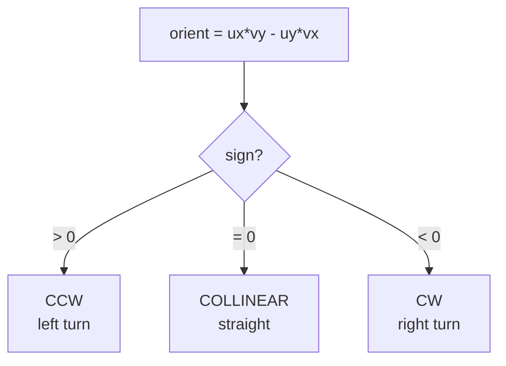
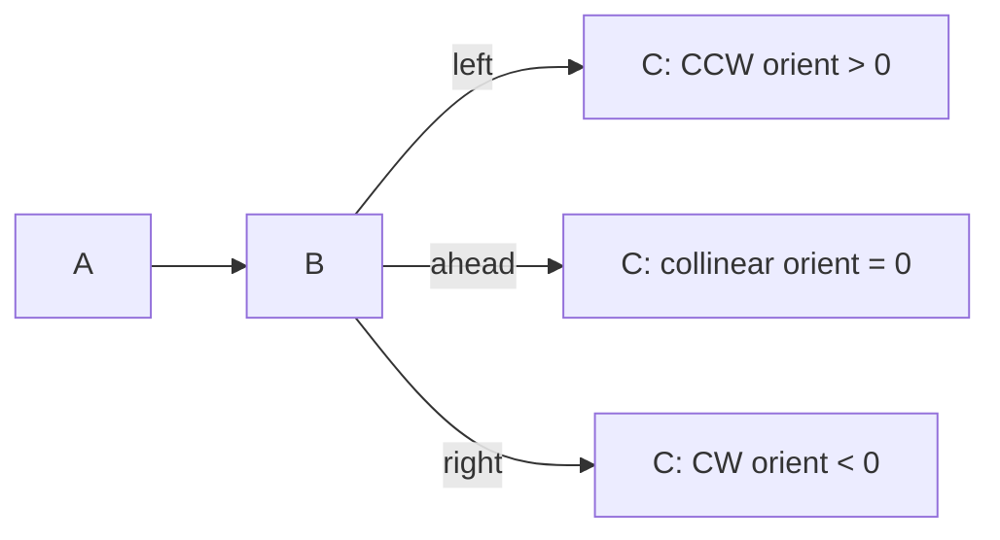
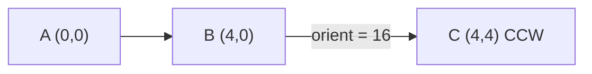
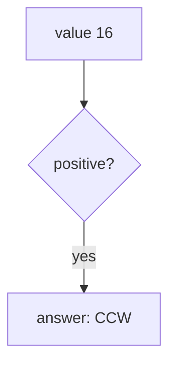

# Orientation of Three Points (CW / CCW / Collinear)

| Meta | Value |
|------|-------|
| **Problem** | Orientation of an Ordered Triple |
| **Source** | Self-contained (classic geometry primitive) |
| **Reference** | Foundation of convex hull &amp; segment intersection |
| **Difficulty** | Easy |
| **Topics** | Geometry, Cross product, Orientation test |
| **Time** | $O(1)$ |
| **Space** | $O(1)$ |

---

## Problem Statement

Given three ordered points $A$, $B$, $C$ in the plane (integer coordinates), classify the
**orientation** of the path $A \to B \to C$ as one of:

- **CCW** (counter-clockwise / left turn),
- **CW** (clockwise / right turn),
- **COLLINEAR** (the three points lie on a single straight line).

```text
Input:  A = (0,0), B = (4,0), C = (4,4)
Output: CCW         (turn left at B)

Input:  A = (0,0), B = (4,0), C = (4,-4)
Output: CW          (turn right at B)

Input:  A = (0,0), B = (2,2), C = (5,5)
Output: COLLINEAR   (all on line y = x)
```

---

## Approach (WHY)

Walk from $A$ to $B$; at $B$ you must decide which way $C$ bends the path. Form two vectors based
at $A$:

$$
\vec{u} = B - A, \qquad \vec{v} = C - A
$$

Their 2D cross product is the **signed area** of the parallelogram they span:

$$
\text{orient}(A,B,C) = \vec{u}\times\vec{v} = u_x v_y - u_y v_x
$$

The **sign** is the whole answer:

- $\text{orient} &gt; 0$ → $C$ is to the **left** of ray $A\to B$ → **CCW**.
- $\text{orient} &lt; 0$ → $C$ is to the **right** → **CW**.
- $\text{orient} = 0$ → zero area → the three are **collinear**.

This is exact in integer arithmetic — the reason every robust hull and intersection algorithm
relies on it instead of comparing angles.





---

## Solution

```python
def orient(a, b, c) -> int:
    # cross of (b - a) and (c - a)
    ux, uy = b[0] - a[0], b[1] - a[1]
    vx, vy = c[0] - a[0], c[1] - a[1]
    return ux * vy - uy * vx

def classify(a, b, c) -> str:
    o = orient(a, b, c)
    if o > 0:
        return "CCW"
    if o < 0:
        return "CW"
    return "COLLINEAR"
```

```cpp
#include <bits/stdc++.h>
using namespace std;

struct pt {
    long long x, y;
    pt(long long x = 0, long long y = 0) : x(x), y(y) {}
    pt operator-(const pt& o) const { return pt(x - o.x, y - o.y); }
};

long long orient(const pt& a, const pt& b, const pt& c) {
    pt u = b - a, v = c - a;          // cross of (b - a) and (c - a)
    return u.x * v.y - u.y * v.x;
}

string classify(const pt& a, const pt& b, const pt& c) {
    long long o = orient(a, b, c);
    if (o > 0) return "CCW";
    if (o < 0) return "CW";
    return "COLLINEAR";
}
```

---

## Trace

Take $A=(0,0)$, $B=(4,0)$, $C=(4,4)$.

| Step | Computation | Value |
|------|-------------|-------|
| $\vec u = B - A$ | $(4-0,\ 0-0)$ | $(4, 0)$ |
| $\vec v = C - A$ | $(4-0,\ 4-0)$ | $(4, 4)$ |
| cross | $4\cdot 4 - 0\cdot 4$ | $16$ |
| sign | $16 &gt; 0$ | **CCW** |

Now the clockwise case $C=(4,-4)$:

| Step | Computation | Value |
|------|-------------|-------|
| $\vec u$ | $(4, 0)$ | $(4, 0)$ |
| $\vec v$ | $(4, -4)$ | $(4, -4)$ |
| cross | $4\cdot(-4) - 0\cdot 4$ | $-16$ |
| sign | $-16 &lt; 0$ | **CW** |





---

## Math &amp; Complexity

The orientation is twice the signed triangle area and equals a $2\times2$ determinant:

$$
\text{orient}(A,B,C) =
\begin{vmatrix}
B_x - A_x & C_x - A_x \\
B_y - A_y & C_y - A_y
\end{vmatrix}
= 2\cdot\text{Area}_{\text{signed}}(A,B,C)
$$

- **Time:** $O(1)$.
- **Space:** $O(1)$.
- **Precision:** exact with integers; use `long long` since terms can reach $\approx 2\times
  10^{18}$ for coordinates near $10^9$.

---

## Takeaway

The orientation test is *the* atomic operation of 2D geometry: one cross product of $B-A$ and
$C-A$, then read the sign — positive is CCW, negative is CW, zero is collinear. Master this and
convex hull, segment intersection, and polygon area all fall into place.
