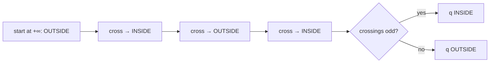
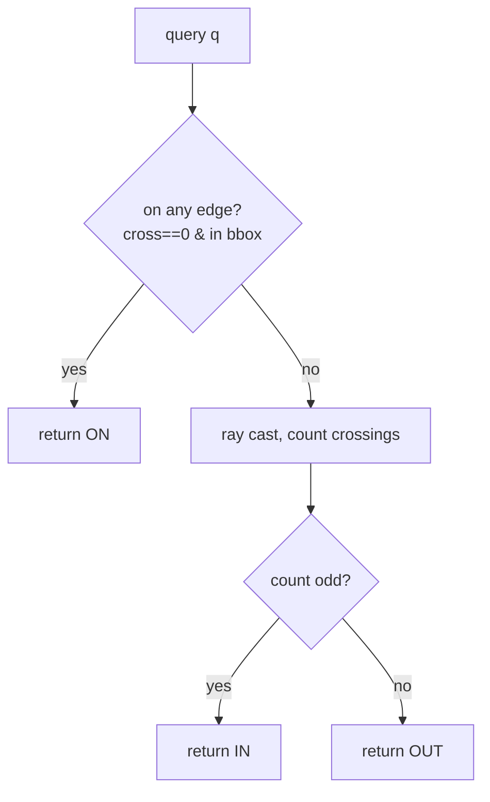
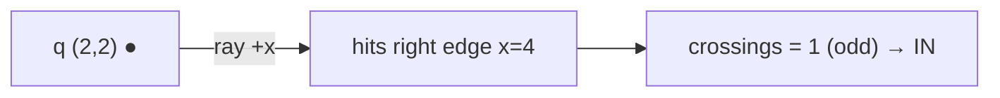
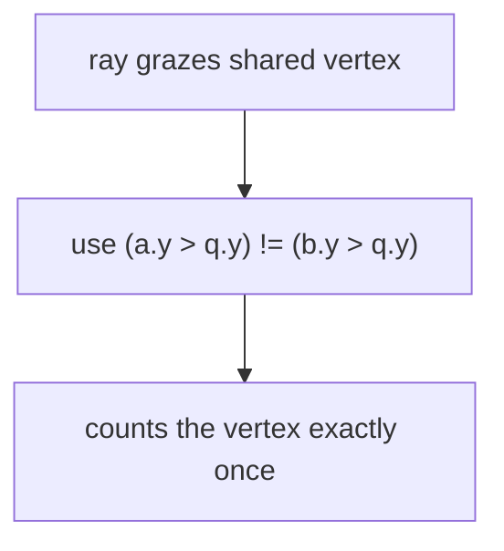
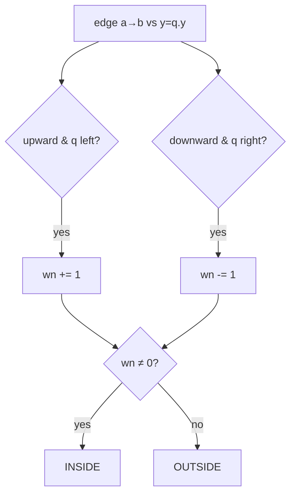
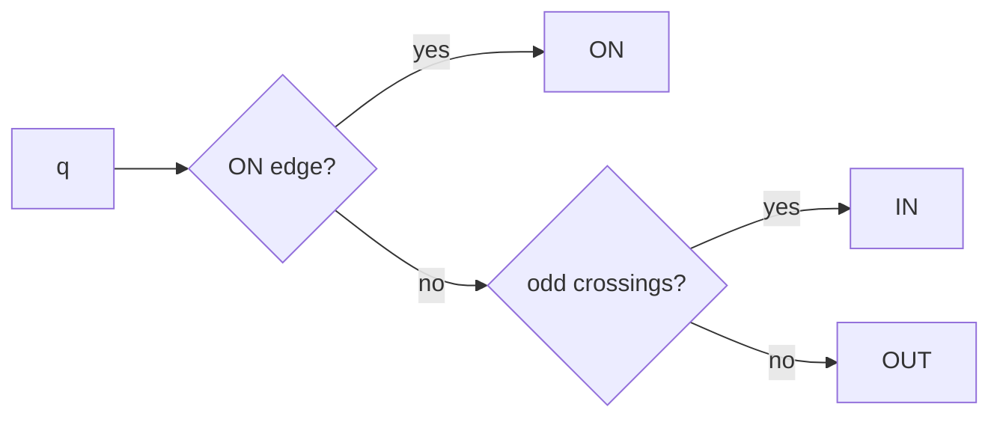

# Point in Polygon by Ray Casting

| Meta | Value |
|------|-------|
| **Problem** | Inside / On / Outside a Polygon |
| **Source** | Self-contained (computational geometry) |
| **Reference** | Even–odd (crossing-number) rule |
| **Difficulty** | Medium |
| **Topics** | Geometry, Ray casting, Even–odd rule, Cross product |
| **Time** | $O(n)$ per query |
| **Space** | $O(1)$ |

---

## Problem Statement

Given a **simple polygon** of $n$ vertices and a query point $q$, decide whether $q$ is
strictly **inside**, exactly **on** the boundary, or **outside** the polygon.

```text
Polygon (square):
  (0,0) (4,0) (4,4) (0,4)

Query (2,2) -> IN
Query (4,2) -> ON     (on the right edge)
Query (5,5) -> OUT
Query (0,0) -> ON     (a vertex)
```

---

## Approach (WHY)

Shoot a ray from $q$ in the $+x$ direction and count how many polygon edges it **crosses**.
Because the ray begins at infinity (clearly *outside*) and every crossing flips us between
outside and inside, an **odd** crossing count means $q$ is inside and an **even** count
means outside. This is the **even–odd rule**.



An edge $(a,b)$ contributes a crossing when it **straddles** the horizontal line $y=q_y$
and its intersection with that line is to the **right** of $q_x$. The subtle part is
*ties*: a ray passing exactly through a shared vertex must be counted **once**, not twice or
zero times. The fix is a **half-open** vertical test `(a.y > q.y) != (b.y > q.y)`, which
treats the upper endpoint as belonging to the edge and the lower endpoint as not.

Because in/out is unreliable for a point sitting *on* an edge, we first test **on-boundary**
explicitly using a collinearity (`cross == 0`) plus bounding-box check.



---

## Implementation

```python
class Point:
    __slots__ = ("x", "y")
    def __init__(self, x, y):
        self.x = x
        self.y = y

def cross(o, a, b):
    return (a.x - o.x) * (b.y - o.y) - (a.y - o.y) * (b.x - o.x)

def on_segment(a, b, q):
    if cross(a, b, q) != 0:
        return False
    return (min(a.x, b.x) <= q.x <= max(a.x, b.x) and
            min(a.y, b.y) <= q.y <= max(a.y, b.y))

def classify(q, poly):
    n = len(poly)
    # 1) on-boundary first
    for i in range(n):
        if on_segment(poly[i], poly[(i + 1) % n], q):
            return "ON"
    # 2) ray cast for strict inside/outside
    inside = False
    for i in range(n):
        a, b = poly[i], poly[(i + 1) % n]
        if (a.y > q.y) != (b.y > q.y):
            x_at = a.x + (q.y - a.y) * (b.x - a.x) / (b.y - a.y)
            if q.x < x_at:
                inside = not inside
    return "IN" if inside else "OUT"
```

```cpp
#include <bits/stdc++.h>
using namespace std;

struct Point {
    long long x, y;
    Point(long long x = 0, long long y = 0) : x(x), y(y) {}
};

long long cross(const Point& o, const Point& a, const Point& b) {
    return (a.x - o.x) * (b.y - o.y) - (a.y - o.y) * (b.x - o.x);
}

bool on_segment(const Point& a, const Point& b, const Point& q) {
    if (cross(a, b, q) != 0) return false;
    return (min(a.x, b.x) <= q.x && q.x <= max(a.x, b.x) &&
            min(a.y, b.y) <= q.y && q.y <= max(a.y, b.y));
}

string classify(const Point& q, const vector<Point>& poly) {
    int n = (int)poly.size();
    // 1) on-boundary first
    for (int i = 0; i < n; i++)
        if (on_segment(poly[i], poly[(i + 1) % n], q)) return "ON";
    // 2) ray cast for strict inside/outside
    bool inside = false;
    for (int i = 0; i < n; i++) {
        const Point& a = poly[i];
        const Point& b = poly[(i + 1) % n];
        if ((a.y > q.y) != (b.y > q.y)) {
            double x_at = a.x + (double)(q.y - a.y) * (b.x - a.x) / (b.y - a.y);
            if (q.x < x_at) inside = !inside;
        }
    }
    return inside ? "IN" : "OUT";
}
```

For purely **integer-exact** in/out (avoiding the floating division), the winding number is
an alternative that uses only `cross`:

```python
def winding_number(q, poly):
    n = len(poly)
    wn = 0
    for i in range(n):
        a, b = poly[i], poly[(i + 1) % n]
        if a.y <= q.y:
            if b.y > q.y and cross(a, b, q) > 0:
                wn += 1
        else:
            if b.y <= q.y and cross(a, b, q) < 0:
                wn -= 1
    return wn  # nonzero = inside
```

```cpp
int winding_number(const Point& q, const vector<Point>& poly) {
    int n = (int)poly.size();
    int wn = 0;
    for (int i = 0; i < n; i++) {
        const Point& a = poly[i];
        const Point& b = poly[(i + 1) % n];
        if (a.y <= q.y) {
            if (b.y > q.y && cross(a, b, q) > 0) wn += 1;
        } else {
            if (b.y <= q.y && cross(a, b, q) < 0) wn -= 1;
        }
    }
    return wn; // nonzero = inside
}
```

---

## Trace

Square $(0,0),(4,0),(4,4),(0,4)$, query $q=(2,2)$, ray going $+x$.

| edge | straddles $y=2$? | x at crossing | right of $q_x=2$? | toggle |
|---|---|---|---|---|
| $(0,0)\to(4,0)$ | no ($0,0$) | — | — | — |
| $(4,0)\to(4,4)$ | yes | $4$ | yes | inside → true |
| $(4,4)\to(0,4)$ | no ($4,4$) | — | — | — |
| $(0,4)\to(0,0)$ | yes | $0$ | no | — |

One toggle ⇒ odd ⇒ **IN**. ✓ For $q=(5,5)$ no edge straddles to the right ⇒ **OUT**.



---

## More Diagrams

**Half-open straddle** avoids double counting at a shared vertex:



**Winding alternative** — sum signed crossings instead of parity:



**Three-way decision** combined:



---

## Math & Complexity

- **Even–odd rule:** parity of ray crossings = inside test.
- **Edge crossing condition:** straddle $(a_y > q_y) \neq (b_y > q_y)$ **and** intersection
  x to the right of $q_x$.
- **On-boundary:** $\text{cross}(a,b,q)=0$ and $q$ within the segment's bounding box.
- **Time:** $O(n)$ per query. **Space:** $O(1)$.
- **Overflow:** `cross` of $10^9$ coordinates fits in `long long`.

---

## Takeaway

Ray casting answers point-in-polygon by counting how many edges a rightward ray crosses —
odd means inside. Guard the two tricky cases: **half-open** vertical straddling so a ray
through a vertex counts once, and an explicit **on-segment** check (via `cross == 0`) before
classifying strict inside vs outside.
