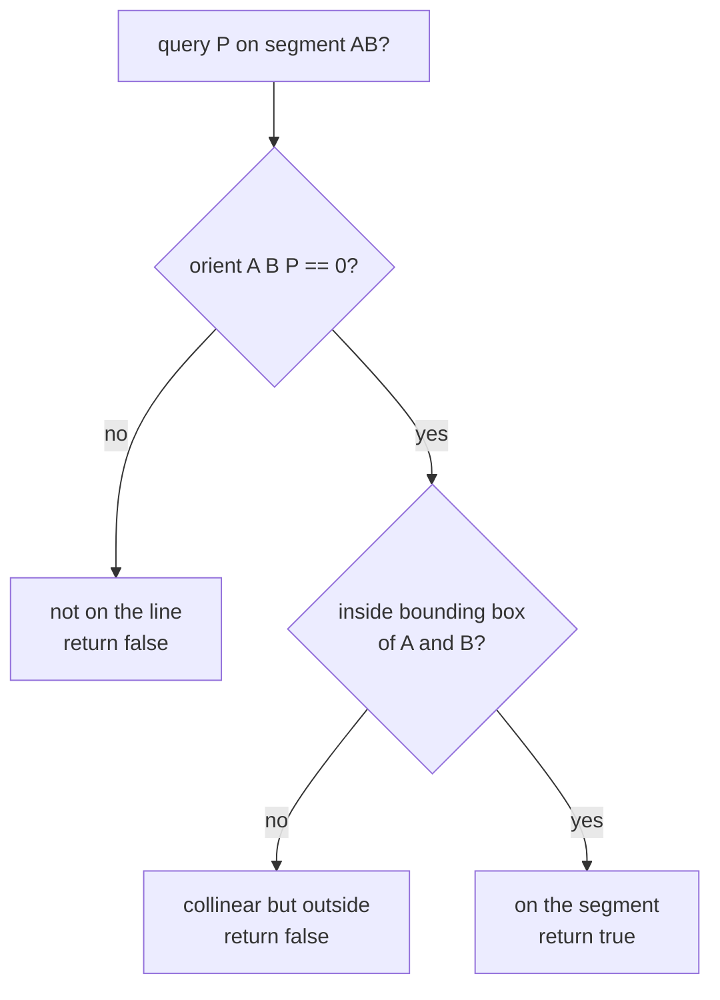
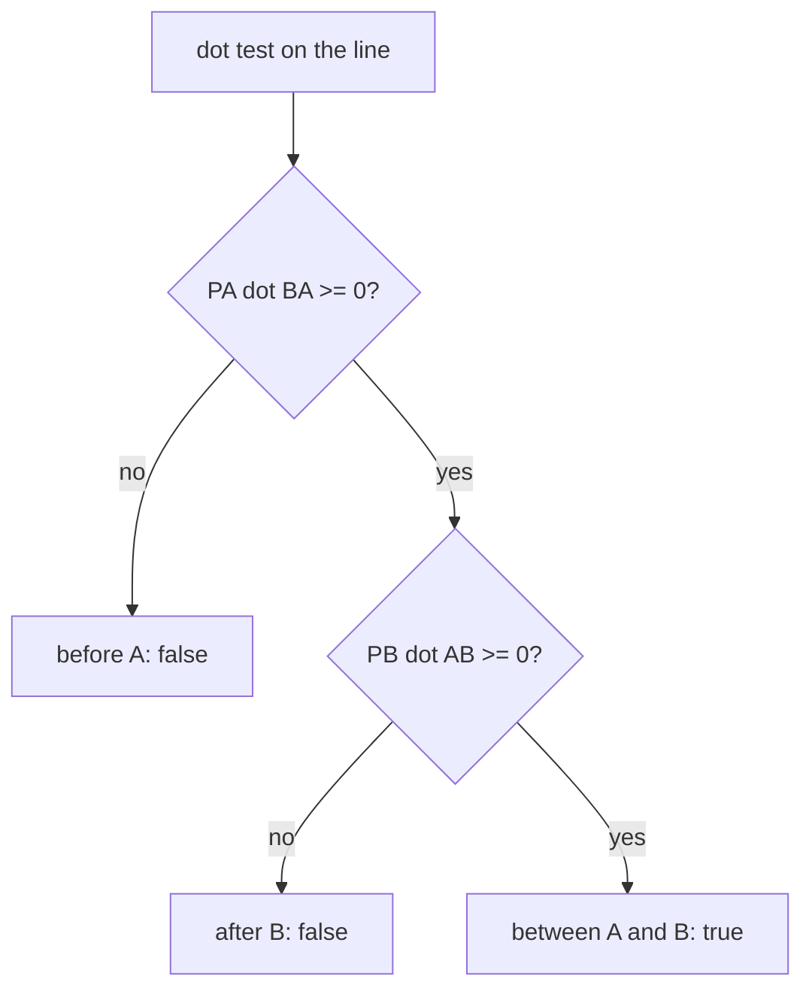
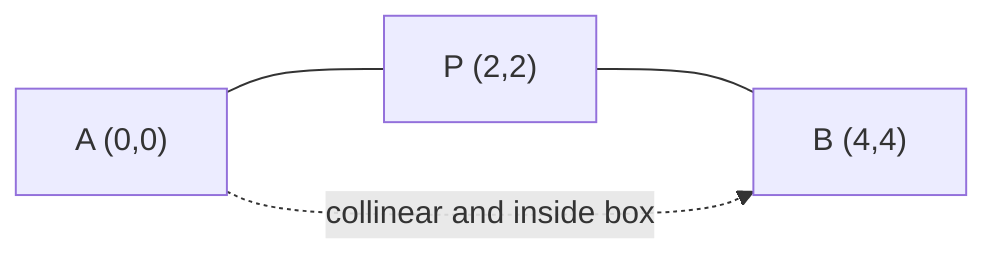
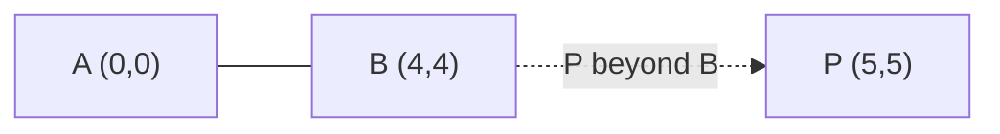

# Point on Segment (Collinearity + Bounding-Box Test)

| Meta | Value |
|------|-------|
| **Problem** | Does a Point Lie on a Segment? |
| **Source** | Self-contained (classic geometry primitive) |
| **Reference** | Building block of segment intersection |
| **Difficulty** | Easy–Medium |
| **Topics** | Geometry, Cross product, Dot product, Bounding box |
| **Time** | $O(1)$ |
| **Space** | $O(1)$ |

---

## Problem Statement

Given a segment with endpoints $A$ and $B$, and a query point $P$ (all with integer
coordinates), determine whether $P$ lies **on** the segment $AB$ — including its endpoints.

```text
Input:  A = (0,0), B = (4,4), P = (2,2)
Output: true        (on the segment, halfway)

Input:  A = (0,0), B = (4,4), P = (5,5)
Output: false       (collinear but BEYOND B)

Input:  A = (0,0), B = (4,4), P = (1,3)
Output: false       (not even on the line)
```

---

## Approach (WHY)

A point is on a segment when **two** independent conditions both hold:

1. **Collinearity** — $P$ lies on the infinite line through $A$ and $B$. This is the orientation
   test equalling zero:
   $$
   \text{orient}(A,B,P) = (B-A)\times(P-A) = 0
   $$
2. **Within bounds** — $P$ lies *between* $A$ and $B$, not on the extension beyond an endpoint.

For the second condition there are two equivalent exact tests:

- **Bounding box:** $\min(A_x,B_x) \le P_x \le \max(A_x,B_x)$ and the same for $y$. Once we know
  $P$ is collinear, lying inside the axis-aligned box of $AB$ guarantees it is on the segment.
- **Dot-product (projection) test:** the projection parameter is non-negative and bounded, i.e.
  $(P-A)\cdot(B-A) \ge 0$ **and** $(P-B)\cdot(A-B) \ge 0$. Equivalently $0 \le (P-A)\cdot(B-A)
  \le |B-A|^2$.

Both stay in integers. We combine collinearity with one of the bound tests.





---

## Solution

```python
def cross(ox, oy, ax, ay, bx, by) -> int:
    # cross of (A - O) and (B - O)
    return (ax - ox) * (by - oy) - (ay - oy) * (bx - ox)

def on_segment(a, b, p) -> bool:
    ax, ay = a
    bx, by = b
    px, py = p
    # 1) collinear: orient(A, B, P) == 0
    if cross(ax, ay, bx, by, px, py) != 0:
        return False
    # 2) within bounding box of A and B
    return (min(ax, bx) <= px <= max(ax, bx) and
            min(ay, by) <= py <= max(ay, by))
```

```cpp
#include <bits/stdc++.h>
using namespace std;

struct pt {
    long long x, y;
    pt(long long x = 0, long long y = 0) : x(x), y(y) {}
    pt operator-(const pt& o) const { return pt(x - o.x, y - o.y); }
};

long long cross(const pt& a, const pt& b) {
    return a.x * b.y - a.y * b.x;
}

bool on_segment(const pt& a, const pt& b, const pt& p) {
    // 1) collinear: orient(A, B, P) == 0
    if (cross(b - a, p - a) != 0) return false;
    // 2) within bounding box of A and B
    return min(a.x, b.x) <= p.x && p.x <= max(a.x, b.x) &&
           min(a.y, b.y) <= p.y && p.y <= max(a.y, b.y);
}
```

---

## Trace

Take $A=(0,0)$, $B=(4,4)$, $P=(2,2)$.

| Step | Computation | Value |
|------|-------------|-------|
| $B - A$ | $(4, 4)$ | $(4, 4)$ |
| $P - A$ | $(2, 2)$ | $(2, 2)$ |
| cross | $4\cdot 2 - 4\cdot 2$ | $0$ → collinear |
| box $x$ | $0 \le 2 \le 4$ | true |
| box $y$ | $0 \le 2 \le 4$ | true |
| result | both pass | **true** |

Now $P=(5,5)$ — collinear but beyond $B$:

| Step | Computation | Value |
|------|-------------|-------|
| cross | $4\cdot 5 - 4\cdot 5$ | $0$ → collinear |
| box $x$ | $0 \le 5 \le 4$ | **false** |
| result | bound fails | **false** |





---

## Math &amp; Complexity

Collinearity is the zero orientation; the projection parameter $t$ of $P$ along $AB$ is

$$
t = \frac{(P-A)\cdot(B-A)}{|B-A|^2}, \qquad P \text{ on segment} \iff \text{collinear and } 0 \le t \le 1.
$$

Multiplying through by $|B-A|^2 &gt; 0$ keeps the dot-product test in integers: $0 \le (P-A)\cdot
(B-A) \le |B-A|^2$. The bounding-box test is an equivalent integer shortcut once collinearity is
known.

- **Time:** $O(1)$.
- **Space:** $O(1)$.
- **Precision:** exact in integers; use `long long` to avoid overflow on the cross and dot
  products for coordinates up to $10^9$.

---

## Takeaway

"On the segment" = **collinear** (cross $= 0$) **and** **bounded** (inside the bounding box, or
equivalently the dot-product projection lies in $[0, |AB|^2]$). Cross handles the line, dot/box
handles the extent — together they give an exact, division-free, integer-only test.
