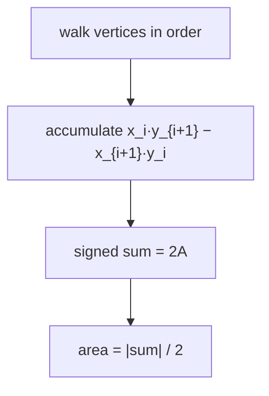
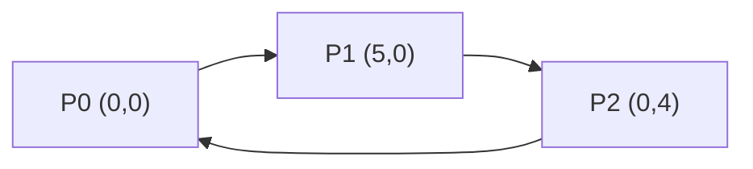
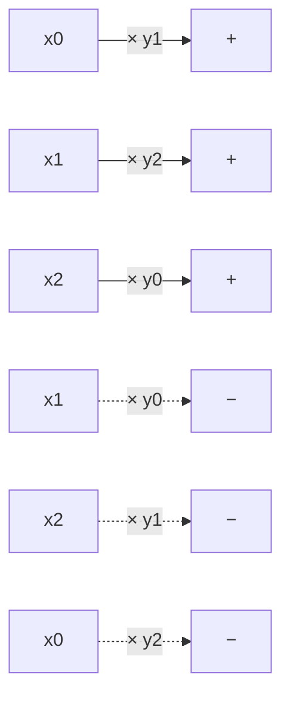
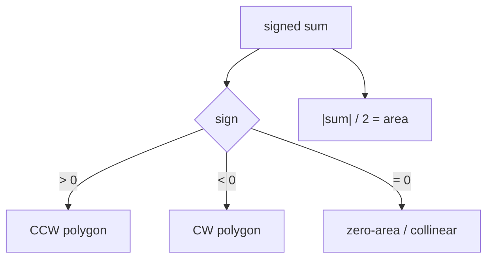
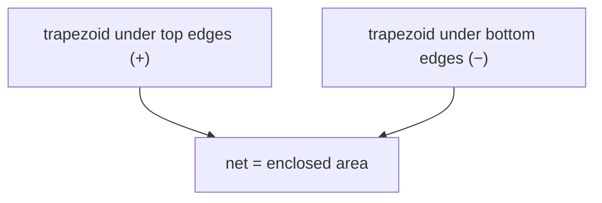

# Polygon Area via the Shoelace Formula

| Meta | Value |
|------|-------|
| **Problem** | Area of a Simple Polygon |
| **Source** | Self-contained (computational geometry) |
| **Reference** | Gauss's shoelace / surveyor's formula |
| **Difficulty** | Easy–Medium |
| **Topics** | Geometry, Shoelace formula, Cross product, Orientation |
| **Time** | $O(n)$ |
| **Space** | $O(1)$ |

---

## Problem Statement

You are given a **simple polygon** as an ordered list of $n$ vertices
$P_0, P_1, \dots, P_{n-1}$ with integer coordinates (the polygon closes from $P_{n-1}$ back
to $P_0$, and edges do not cross). Compute its **area**.

```text
Input:
  4
  0 0
  4 0
  4 3
  0 3

Output:
  12.0          (a 4×3 rectangle)

Input:
  3
  0 0
  5 0
  0 4

Output:
  10.0          (right triangle, area = 5·4/2)
```

---

## Approach (WHY)

The **shoelace formula** turns the area into a single linear sweep over the vertices:

$$A = \frac{1}{2}\left|\sum_{i=0}^{n-1}\left(x_i\,y_{i+1} - x_{i+1}\,y_i\right)\right|$$

**Why it works.** Connect each edge $P_i \to P_{i+1}$ down to the x-axis to form a
trapezoid. The signed area of that trapezoid is $\tfrac12(x_i - x_{i+1})(y_i + y_{i+1})$,
which expands to exactly the cross term $\tfrac12(x_i y_{i+1} - x_{i+1} y_i)$ after summing
around the loop. As you traverse the whole boundary, the parts of the trapezoids *outside*
the polygon are added once with one sign and subtracted once with the other — they cancel,
leaving the enclosed area.



Keeping the running sum as an **exact integer** (it is the *doubled* signed area) avoids all
floating-point error; we only divide by 2 at the very end.

---

## Implementation

```python
class Point:
    __slots__ = ("x", "y")
    def __init__(self, x, y):
        self.x = x
        self.y = y

def polygon_area(poly):
    n = len(poly)
    s = 0                       # exact doubled signed area
    for i in range(n):
        j = (i + 1) % n
        s += poly[i].x * poly[j].y - poly[j].x * poly[i].y
    return abs(s) / 2.0
```

```cpp
#include <bits/stdc++.h>
using namespace std;

struct Point {
    long long x, y;
    Point(long long x = 0, long long y = 0) : x(x), y(y) {}
};

double polygon_area(const vector<Point>& poly) {
    int n = (int)poly.size();
    long long s = 0;            // exact doubled signed area
    for (int i = 0; i < n; i++) {
        int j = (i + 1) % n;
        s += poly[i].x * poly[j].y - poly[j].x * poly[i].y;
    }
    return llabs(s) / 2.0;
}
```

We can also expose the **signed** value so callers learn the orientation for free:

```python
def signed_doubled_area(poly):
    n = len(poly)
    s = 0
    for i in range(n):
        j = (i + 1) % n
        s += poly[i].x * poly[j].y - poly[j].x * poly[i].y
    return s   # >0 CCW, <0 CW, 0 degenerate
```

```cpp
long long signed_doubled_area(const vector<Point>& poly) {
    int n = (int)poly.size();
    long long s = 0;
    for (int i = 0; i < n; i++) {
        int j = (i + 1) % n;
        s += poly[i].x * poly[j].y - poly[j].x * poly[i].y;
    }
    return s; // >0 CCW, <0 CW, 0 degenerate
}
```

---

## Trace

Take the triangle $P_0(0,0)$, $P_1(5,0)$, $P_2(0,4)$ (CCW).

| $i$ | $j$ | $x_i y_j$ | $x_j y_i$ | term |
|---|---|---|---|---|
| 0 | 1 | $0\cdot0=0$ | $5\cdot0=0$ | $0$ |
| 1 | 2 | $5\cdot4=20$ | $0\cdot0=0$ | $+20$ |
| 2 | 0 | $0\cdot0=0$ | $0\cdot4=0$ | $0$ |

Sum $= 20$ (positive ⇒ CCW). Area $= |20| / 2 = 10$. ✓



---

## More Diagrams

**Cross-sum lacing** — each $x$ multiplies the *next* $y$ (solid), minus the *next* $x$
times the current $y$ (dashed):



**Sign decides orientation**, magnitude decides area:



**Trapezoid cancellation** view of *why* the formula is exact:



---

## Math & Complexity

- **Formula:** $A = \tfrac12\left|\sum_{i}(x_i y_{i+1} - x_{i+1} y_i)\right|$.
- **Exactness:** with integer coordinates the doubled area $2A$ is an exact integer; defer
  the `/2` to the end.
- **Overflow:** coordinate products up to $10^9 \times 10^9 = 10^{18}$ require `long long`.
- **Time:** $O(n)$ — one pass. **Space:** $O(1)$.

---

## Takeaway

The shoelace formula is the canonical "area from coordinates" tool: accumulate cross terms
$x_i y_{i+1} - x_{i+1} y_i$ in an exact `long long`, take half the absolute value for area,
and read the **sign** for free to know the polygon's orientation.
