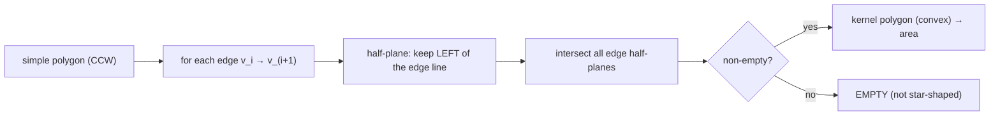
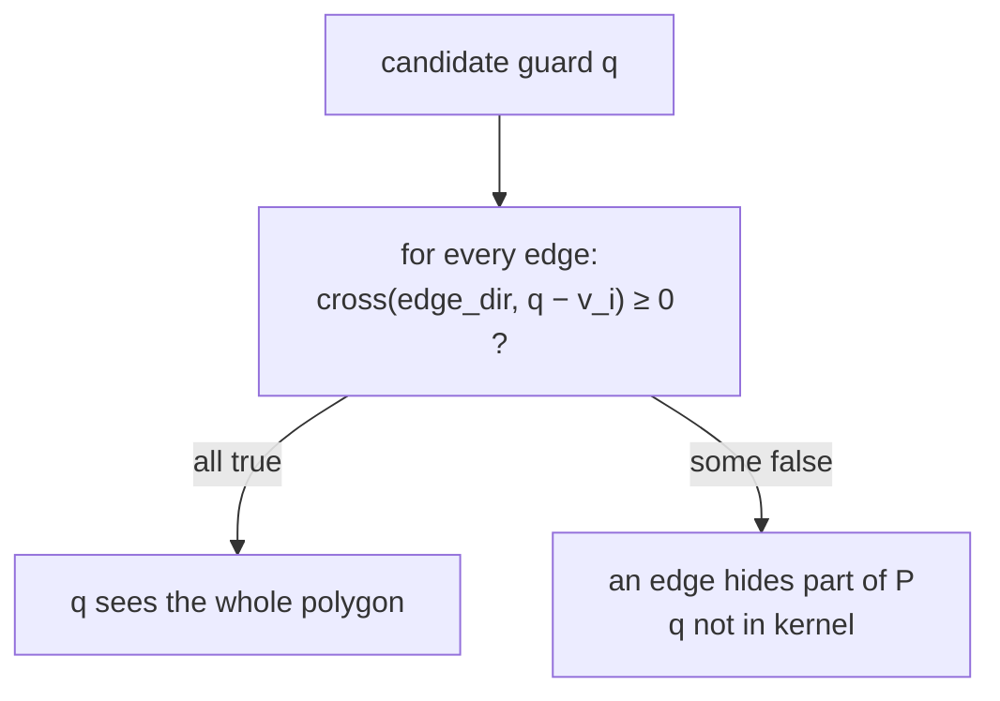
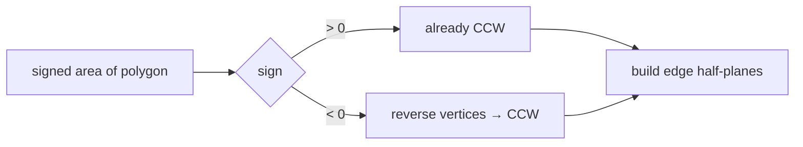
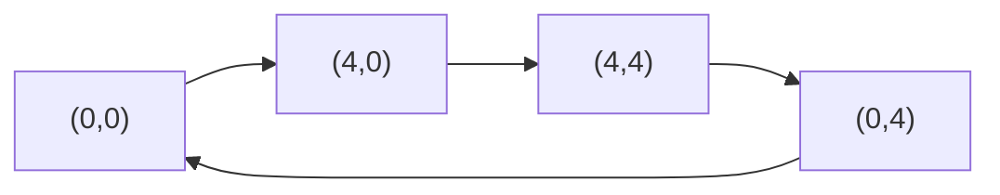
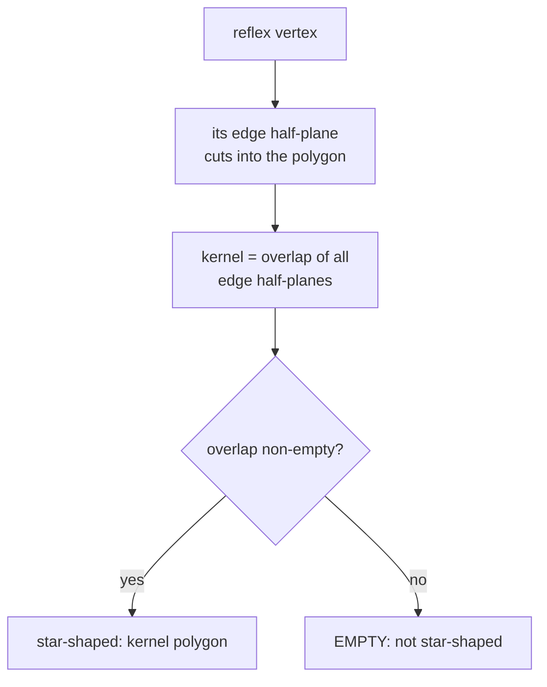
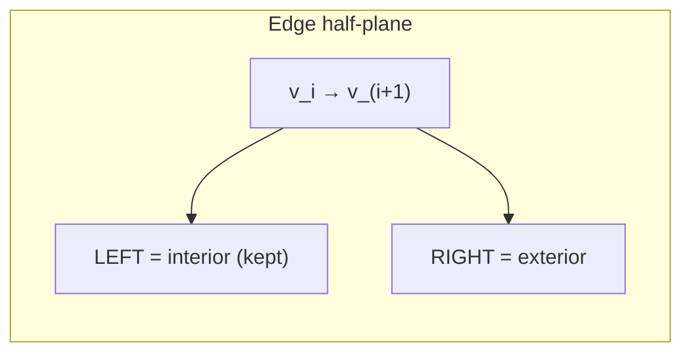
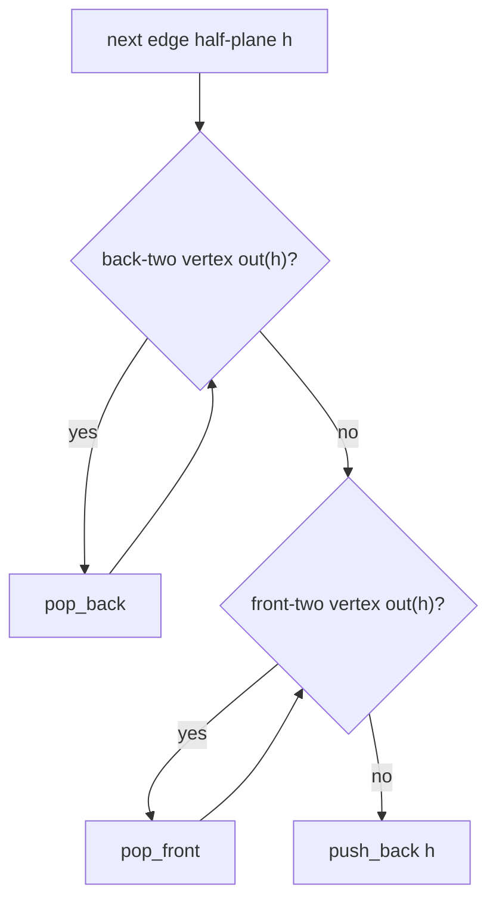
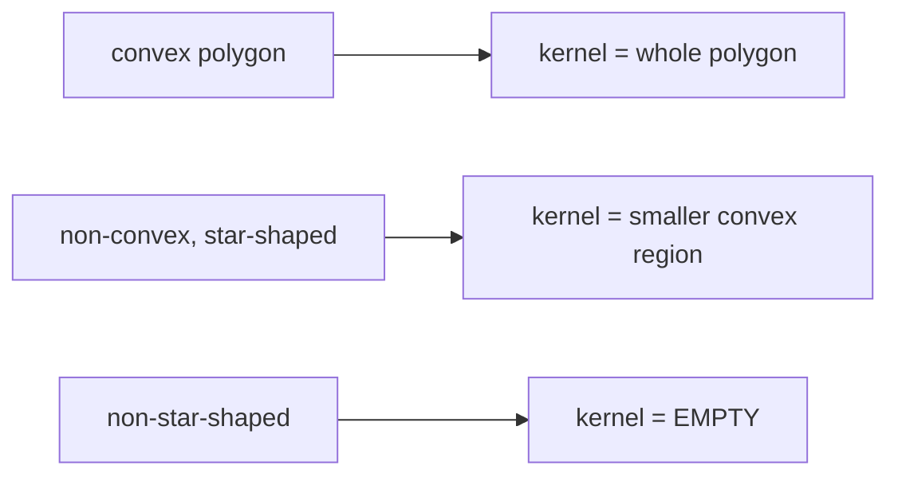
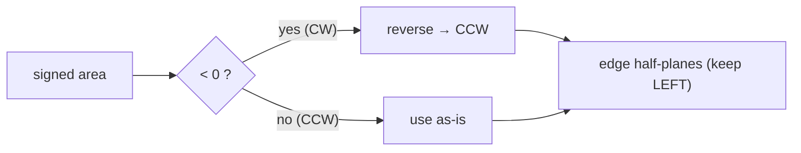

# Kernel of a Simple Polygon (Where Can a Guard See Everything?)

| Field | Value |
|---|---|
| Source | Classic computational-geometry primitive (self-contained) |
| Difficulty | Hard |
| Primary topic | **Half-plane intersection** of edge half-planes |
| Secondary topic | Star-shaped polygons, CCW orientation, kernel area |
| Key constraint | Simple polygon, $n \le 10^5$ vertices; `double` geometry, `EPS = 1e-9` |

---

## Statement

You are given a **simple polygon** $P$ with vertices $v_0, v_1, \dots, v_{n-1}$ listed in order (no
self-intersections). The **kernel** of $P$ is the set of all interior points $q$ from which the *entire*
polygon is visible — every point of $P$ can be reached from $q$ by a straight segment that stays inside $P$.
A polygon has a non-empty kernel exactly when it is **star-shaped**.

Compute the kernel:

- print `EMPTY` if the kernel is empty (the polygon is not star-shaped), or
- print the **area** of the kernel (a convex polygon) otherwise.

### Example

```text
n = 4   (a convex square — every point sees everything)
  0 0
  4 0
  4 4
  0 4

Output: 16.000000     # kernel = the whole square
```

```text
n = 6   (a non-convex "plus/arrow"-style polygon with a small kernel)
  0 0
  4 0
  4 1
  5 1
  ...
Output: <area of the central region that sees all edges>
```

---

## WHY: Each Edge Defines a Half-Plane; The Kernel Is Their Intersection

Walk the polygon **counter-clockwise**. For a CCW polygon, the interior lies to the **left** of every directed
edge $v_i \to v_{i+1}$. A point $q$ can see the whole polygon **iff** it lies on the inner (left) side of
*every* edge line — if $q$ were on the wrong side of some edge, that edge would block visibility to the region
behind it. So:

$$
\text{kernel}(P) = \bigcap_{i} \big\{\, q : q \text{ is left of edge } v_i \to v_{i+1} \,\big\}.
$$

That is exactly a **half-plane intersection** — one half-plane per edge.





First, ensure CCW orientation using the **signed shoelace area**: if it is negative the input is clockwise, so
reverse the vertex list. Then each edge becomes `HalfPlane(v_i, v_{i+1} - v_i)` keeping the left side, and we
run the standard intersection. No bounding box is needed — the polygon's own edges bound the kernel.



---

## Code

```python
import sys
import math
from collections import deque
from dataclasses import dataclass

EPS = 1e-9

@dataclass
class Point:
    x: float
    y: float
    def __add__(self, o): return Point(self.x + o.x, self.y + o.y)
    def __sub__(self, o): return Point(self.x - o.x, self.y - o.y)
    def __mul__(self, t): return Point(self.x * t, self.y * t)

def cross(a: Point, b: Point) -> float:
    return a.x * b.y - a.y * b.x

@dataclass
class HalfPlane:
    p: Point
    dir: Point
    def angle(self) -> float:
        return math.atan2(self.dir.y, self.dir.x)

def out(h: HalfPlane, p: Point) -> bool:
    return cross(h.dir, p - h.p) < -EPS

def intersect(h1: HalfPlane, h2: HalfPlane) -> Point:
    denom = cross(h1.dir, h2.dir)
    t = cross(h2.dir, h1.p - h2.p) / denom
    return h1.p + h1.dir * t

def signed_area(poly: list[Point]) -> float:
    s = 0.0
    n = len(poly)
    for i in range(n):
        j = (i + 1) % n
        s += poly[i].x * poly[j].y - poly[j].x * poly[i].y
    return s / 2.0

def polygon_area(poly: list[Point]) -> float:
    return abs(signed_area(poly))

def edge_half_planes(poly: list[Point]) -> list[HalfPlane]:
    # Ensure CCW so the interior is on the LEFT of each edge.
    if signed_area(poly) < 0:
        poly = list(reversed(poly))
    n = len(poly)
    hs: list[HalfPlane] = []
    for i in range(n):
        a = poly[i]
        b = poly[(i + 1) % n]
        hs.append(HalfPlane(a, b - a))
    return hs

def half_plane_intersection(planes: list[HalfPlane]) -> list[Point]:
    planes = sorted(planes, key=lambda h: h.angle())
    cleaned: list[HalfPlane] = []
    for h in planes:
        if cleaned and abs(h.angle() - cleaned[-1].angle()) < EPS:
            if out(cleaned[-1], h.p):
                cleaned[-1] = h
            continue
        cleaned.append(h)

    dq: deque[HalfPlane] = deque()
    for h in cleaned:
        while len(dq) >= 2 and out(h, intersect(dq[-1], dq[-2])):
            dq.pop()
        while len(dq) >= 2 and out(h, intersect(dq[0], dq[1])):
            dq.popleft()
        dq.append(h)

    while len(dq) >= 3 and out(dq[0], intersect(dq[-1], dq[-2])):
        dq.pop()
    while len(dq) >= 3 and out(dq[-1], intersect(dq[0], dq[1])):
        dq.popleft()

    if len(dq) < 3:
        return []
    n = len(dq)
    return [intersect(dq[i], dq[(i + 1) % n]) for i in range(n)]

def main() -> None:
    data = sys.stdin.read().split()
    idx = 0
    n = int(data[idx]); idx += 1
    poly: list[Point] = []
    for _ in range(n):
        x, y = float(data[idx]), float(data[idx + 1])
        idx += 2
        poly.append(Point(x, y))
    kernel = half_plane_intersection(edge_half_planes(poly))
    if len(kernel) < 3:
        print("EMPTY")
    else:
        print(f"{polygon_area(kernel):.6f}")

if __name__ == "__main__":
    main()
```

```cpp
#include <bits/stdc++.h>
using namespace std;

const double EPS = 1e-9;

struct Point {
    double x, y;
    Point(double x = 0, double y = 0) : x(x), y(y) {}
    Point operator+(const Point& o) const { return Point(x + o.x, y + o.y); }
    Point operator-(const Point& o) const { return Point(x - o.x, y - o.y); }
    Point operator*(double t) const { return Point(x * t, y * t); }
};

double cross(const Point& a, const Point& b) {
    return a.x * b.y - a.y * b.x;
}

struct HalfPlane {
    Point p;
    Point dir;
    double angle() const { return atan2(dir.y, dir.x); }
};

bool out(const HalfPlane& h, const Point& p) {
    return cross(h.dir, p - h.p) < -EPS;
}

Point intersect(const HalfPlane& h1, const HalfPlane& h2) {
    double denom = cross(h1.dir, h2.dir);
    double t = cross(h2.dir, h1.p - h2.p) / denom;
    return h1.p + h1.dir * t;
}

double signed_area(const vector<Point>& poly) {
    double s = 0.0;
    int n = (int)poly.size();
    for (int i = 0; i < n; ++i) {
        int j = (i + 1) % n;
        s += poly[i].x * poly[j].y - poly[j].x * poly[i].y;
    }
    return s / 2.0;
}

double polygon_area(const vector<Point>& poly) {
    return fabs(signed_area(poly));
}

vector<HalfPlane> edge_half_planes(vector<Point> poly) {
    // Ensure CCW so the interior is on the LEFT of each edge.
    if (signed_area(poly) < 0) {
        reverse(poly.begin(), poly.end());
    }
    int n = (int)poly.size();
    vector<HalfPlane> hs;
    for (int i = 0; i < n; ++i) {
        Point a = poly[i];
        Point b = poly[(i + 1) % n];
        hs.push_back(HalfPlane{a, b - a});
    }
    return hs;
}

vector<Point> half_plane_intersection(vector<HalfPlane> planes) {
    sort(planes.begin(), planes.end(),
         [](const HalfPlane& a, const HalfPlane& b) {
             return a.angle() < b.angle();
         });
    vector<HalfPlane> cleaned;
    for (const HalfPlane& h : planes) {
        if (!cleaned.empty() &&
            fabs(h.angle() - cleaned.back().angle()) < EPS) {
            if (out(cleaned.back(), h.p)) cleaned.back() = h;
            continue;
        }
        cleaned.push_back(h);
    }

    deque<HalfPlane> dq;
    for (const HalfPlane& h : cleaned) {
        while (dq.size() >= 2 &&
               out(h, intersect(dq[dq.size() - 1], dq[dq.size() - 2]))) {
            dq.pop_back();
        }
        while (dq.size() >= 2 && out(h, intersect(dq[0], dq[1]))) {
            dq.pop_front();
        }
        dq.push_back(h);
    }

    while (dq.size() >= 3 &&
           out(dq[0], intersect(dq[dq.size() - 1], dq[dq.size() - 2]))) {
        dq.pop_back();
    }
    while (dq.size() >= 3 && out(dq.back(), intersect(dq[0], dq[1]))) {
        dq.pop_front();
    }

    if (dq.size() < 3) return {};
    int n = (int)dq.size();
    vector<Point> poly;
    for (int i = 0; i < n; ++i) {
        poly.push_back(intersect(dq[i], dq[(i + 1) % n]));
    }
    return poly;
}

int main() {
    ios::sync_with_stdio(false);
    cin.tie(nullptr);

    int n;
    if (!(cin >> n)) return 0;
    vector<Point> poly(n);
    for (int i = 0; i < n; ++i) {
        cin >> poly[i].x >> poly[i].y;
    }
    vector<Point> kernel = half_plane_intersection(edge_half_planes(poly));
    if ((int)kernel.size() < 3) {
        cout << "EMPTY\n";
    } else {
        cout << fixed << setprecision(6) << polygon_area(kernel) << "\n";
    }
    return 0;
}
```

---

## Trace

Take the **convex square** $ (0,0),(4,0),(4,4),(0,4) $, which is already CCW (signed area $+16$). Its four
edges give four half-planes, each keeping the interior on the left:

| Edge | $v_i \to v_{i+1}$ | direction | keeps |
|---|---|---|---|
| bottom | $(0,0)\to(4,0)$ | $(4,0)$ → | $y \ge 0$ |
| right | $(4,0)\to(4,4)$ | $(0,4)$ ↑ | $x \le 4$ |
| top | $(4,4)\to(0,4)$ | $(-4,0)$ ← | $y \le 4$ |
| left | $(0,4)\to(0,0)$ | $(0,-4)$ ↓ | $x \ge 0$ |

Their intersection is the square itself; kernel area $= 16$. For a **convex** polygon the kernel always equals
the whole polygon, since the interior is left of every edge.



For a **non-convex** polygon, a reflex vertex contributes an edge whose half-plane slices into the shape; the
kernel shrinks to the points that lie inside *all* edge half-planes simultaneously. If two edges face away from
each other so no common left side exists, the deque collapses below 3 and we print `EMPTY` — the polygon is not
star-shaped.



---

## More Pictures

Each directed edge keeps its left (interior) side:



The deque maintains the running kernel boundary, popping vertices that a new edge excludes:



Convex vs non-convex kernels:



Orientation guard before building half-planes:



---

## Math & Complexity

- Orientation check (signed area): $O(n)$.
- Build $n$ edge half-planes: $O(n)$.
- Sort by angle + deque sweep + recovery: $O(n \log n)$.
- **Total:** $O(n \log n)$ time, $O(n)$ space.

The kernel is the intersection of the $n$ edge half-planes:
$\;\text{kernel}(P) = \bigcap_i H_i$, where $H_i$ keeps the left side of edge $i$. It is always **convex**
(intersection of convex sets) and non-empty **iff** $P$ is star-shaped. If the edges already arrive in CCW
order with distinct angles, the sort can be skipped, dropping the cost to $O(n)$.

---

## Takeaway

> The **kernel** of a polygon — every guard position that sees the whole shape — is the **intersection of the
> left half-planes of its edges**. Force CCW orientation first (signed area), turn each edge into a
> keep-left half-plane, run the sort-by-angle + deque intersection, and read off the convex kernel; **fewer than
> 3 survivors means the polygon is not star-shaped (EMPTY)**.
