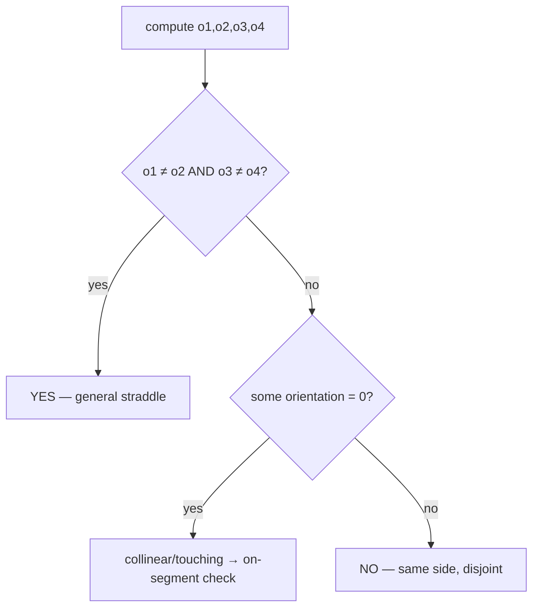
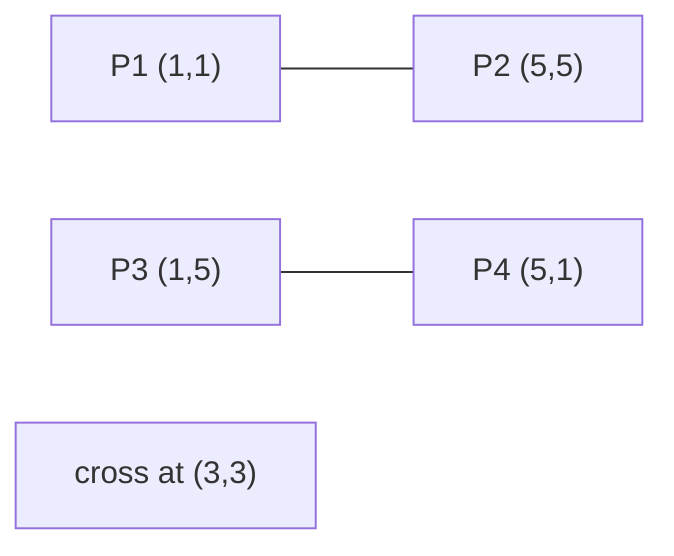
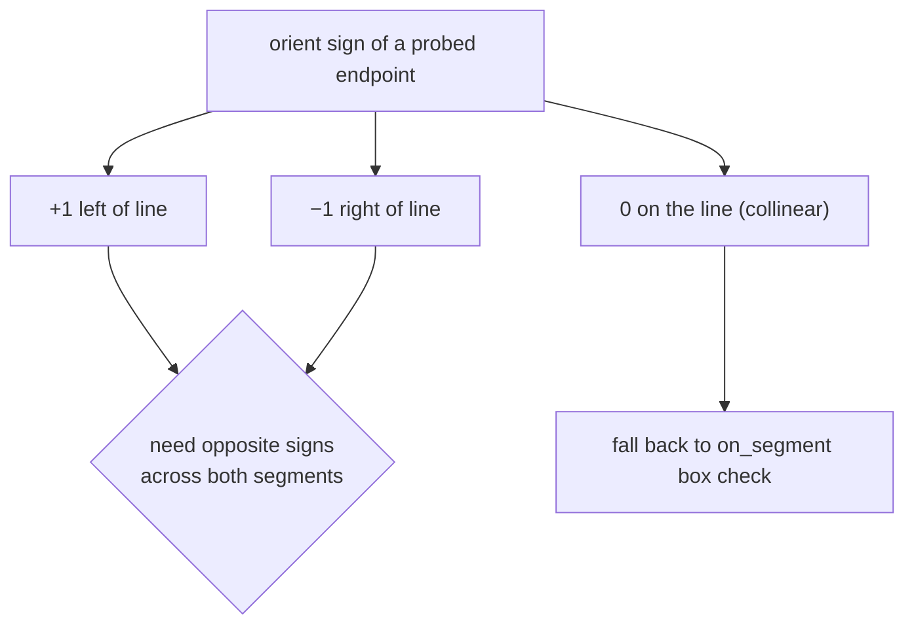
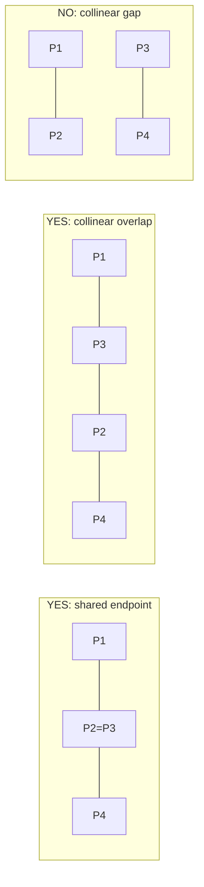
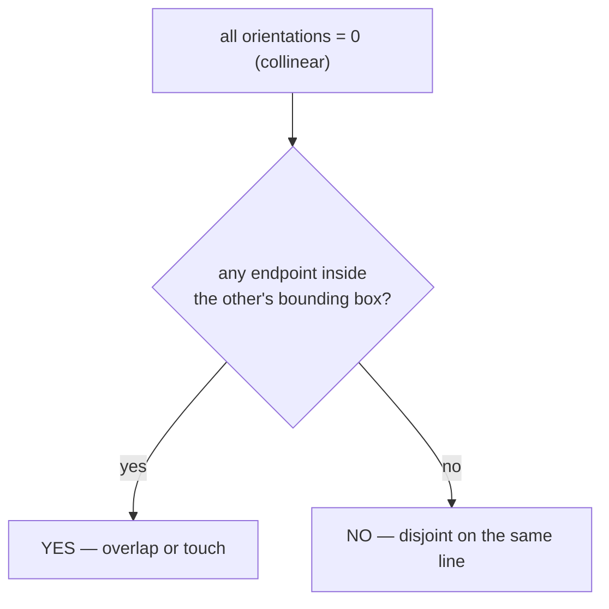

# Segment Intersection Test (Do Two Segments Cross?)

| Field | Value |
|---|---|
| Source | Classic computational-geometry primitive (self-contained) |
| Difficulty | Medium |
| Primary topic | **Orientation (cross-product) segment intersection** |
| Secondary topic | Collinear / degenerate-case handling |
| Key constraint | Coordinates up to $10^9$ in absolute value; use 64-bit integers |

---

## Statement

You are given two line segments in the plane:

- Segment 1 with endpoints $P_1 = (x_1, y_1)$ and $P_2 = (x_2, y_2)$.
- Segment 2 with endpoints $P_3 = (x_3, y_3)$ and $P_4 = (x_4, y_4)$.

Report `YES` if the two segments **intersect** (share at least one point) and `NO` otherwise.
The answer must be correct for *every* degenerate case: shared endpoints, T-junctions, a
zero-length segment (a point), and collinear segments that overlap or merely touch.

### Example

```text
Segment 1: (1, 1) -- (5, 5)
Segment 2: (1, 5) -- (5, 1)
Output: YES        # they cross at (3, 3)

Segment 1: (1, 1) -- (3, 3)
Segment 2: (4, 4) -- (6, 6)
Output: NO         # collinear but disjoint

Segment 1: (1, 1) -- (4, 4)
Segment 2: (3, 3) -- (6, 6)
Output: YES        # collinear and overlapping
```

---

## WHY: Straddle on Both Sides, Then Patch the Collinear Cases

Two segments cross in the *general* case exactly when each one straddles the line carrying the
other. "Straddle" is measured by the **orientation** sign: endpoints of segment 2 must fall on
opposite sides of line $P_1 P_2$, and vice versa.



The four orientations probe each endpoint against the opposite segment's line:

$$
o_1 = \operatorname{orient}(P_1,P_2,P_3),\;
o_2 = \operatorname{orient}(P_1,P_2,P_4),\;
o_3 = \operatorname{orient}(P_3,P_4,P_1),\;
o_4 = \operatorname{orient}(P_3,P_4,P_2)
$$

When any $o_i = 0$ the points are collinear; the general test goes blind there, so we fall back
to a bounding-box `on_segment` check.

---

## Code

```python
import sys
from dataclasses import dataclass

@dataclass(frozen=True)
class Point:
    x: int
    y: int

def cross(ax: int, ay: int, bx: int, by: int) -> int:
    return ax * by - ay * bx

def orient(p: Point, q: Point, r: Point) -> int:
    val = cross(q.x - p.x, q.y - p.y, r.x - p.x, r.y - p.y)
    if val > 0:
        return 1
    if val < 0:
        return -1
    return 0

def on_segment(p: Point, q: Point, r: Point) -> bool:
    # collinear p,q,r assumed; is q within the bounding box of p--r?
    return (min(p.x, r.x) <= q.x <= max(p.x, r.x) and
            min(p.y, r.y) <= q.y <= max(p.y, r.y))

def segments_intersect(p1: Point, p2: Point, p3: Point, p4: Point) -> bool:
    o1 = orient(p1, p2, p3)
    o2 = orient(p1, p2, p4)
    o3 = orient(p3, p4, p1)
    o4 = orient(p3, p4, p2)

    if o1 != o2 and o3 != o4:
        return True                       # general straddle

    if o1 == 0 and on_segment(p1, p3, p2):
        return True
    if o2 == 0 and on_segment(p1, p4, p2):
        return True
    if o3 == 0 and on_segment(p3, p1, p4):
        return True
    if o4 == 0 and on_segment(p3, p2, p4):
        return True

    return False

def main() -> None:
    data = sys.stdin.read().split()
    vals = list(map(int, data[:8]))
    p1 = Point(vals[0], vals[1])
    p2 = Point(vals[2], vals[3])
    p3 = Point(vals[4], vals[5])
    p4 = Point(vals[6], vals[7])
    print("YES" if segments_intersect(p1, p2, p3, p4) else "NO")

if __name__ == "__main__":
    main()
```

```cpp
#include <bits/stdc++.h>
using namespace std;

struct Point {
    long long x, y;
};

long long cross(long long ax, long long ay, long long bx, long long by) {
    return ax * by - ay * bx;
}

int orient(const Point& p, const Point& q, const Point& r) {
    long long val = cross(q.x - p.x, q.y - p.y, r.x - p.x, r.y - p.y);
    if (val > 0) return 1;
    if (val < 0) return -1;
    return 0;
}

bool on_segment(const Point& p, const Point& q, const Point& r) {
    // collinear p,q,r assumed; is q within the bounding box of p--r?
    return min(p.x, r.x) <= q.x && q.x <= max(p.x, r.x) &&
           min(p.y, r.y) <= q.y && q.y <= max(p.y, r.y);
}

bool segments_intersect(const Point& p1, const Point& p2,
                        const Point& p3, const Point& p4) {
    int o1 = orient(p1, p2, p3);
    int o2 = orient(p1, p2, p4);
    int o3 = orient(p3, p4, p1);
    int o4 = orient(p3, p4, p2);

    if (o1 != o2 && o3 != o4) return true;   // general straddle

    if (o1 == 0 && on_segment(p1, p3, p2)) return true;
    if (o2 == 0 && on_segment(p1, p4, p2)) return true;
    if (o3 == 0 && on_segment(p3, p1, p4)) return true;
    if (o4 == 0 && on_segment(p3, p2, p4)) return true;

    return false;
}

int main() {
    ios::sync_with_stdio(false);
    cin.tie(nullptr);

    Point p1, p2, p3, p4;
    cin >> p1.x >> p1.y >> p2.x >> p2.y;
    cin >> p3.x >> p3.y >> p4.x >> p4.y;

    cout << (segments_intersect(p1, p2, p3, p4) ? "YES" : "NO") << "\n";
    return 0;
}
```

---

## Trace

Take $P_1=(1,1), P_2=(5,5)$ and $P_3=(1,5), P_4=(5,1)$ (the crossing "X").

| Step | Computation | Sign |
|---|---|---|
| $o_1=\operatorname{orient}(P_1,P_2,P_3)$ | $(5-1,5-1)\times(1-1,5-1)=(4,4)\times(0,4)=16$ | $+1$ |
| $o_2=\operatorname{orient}(P_1,P_2,P_4)$ | $(4,4)\times(4,0)=-16$ | $-1$ |
| $o_3=\operatorname{orient}(P_3,P_4,P_1)$ | $(4,-4)\times(0,-4)=-16$ | $-1$ |
| $o_4=\operatorname{orient}(P_3,P_4,P_2)$ | $(4,-4)\times(4,0)=16$ | $+1$ |

$o_1 \ne o_2$ and $o_3 \ne o_4$ → general straddle → **YES**.



---

## More Pictures: Every Case the Test Must Survive

The four orientation outcomes for the straddle decision:



Degenerate configurations and the expected answer:



Decision flow for a collinear pair (all four $o_i = 0$):



---

## Math and Complexity

The orientation is the signed area test:

$$
\operatorname{orient}(P,Q,R)=\operatorname{sign}\big((Q_x-P_x)(R_y-P_y)-(Q_y-P_y)(R_x-P_x)\big)
$$

With coordinates up to $10^9$, each product reaches $10^{18}$, fitting in a signed 64-bit
integer — so the test is **exact**, never touching floating point.

| Metric | Value |
|---|---|
| Time | $O(1)$ — four orientation tests plus up to four box checks |
| Space | $O(1)$ |
| Arithmetic | Integer only (no precision error) |

---

## Takeaway

A correct segment-intersection test is **two halves**: the general "opposite signs on both
lines" straddle, plus the collinear patch using bounding-box `on_segment` checks. Keep it in
64-bit integers and you get an exact yes/no with no epsilon anywhere.
