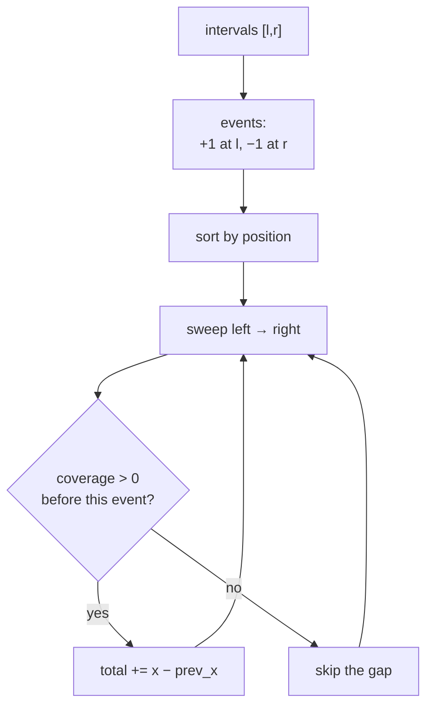
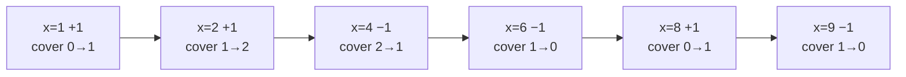
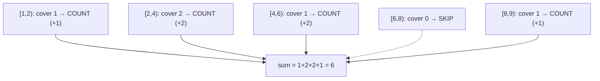
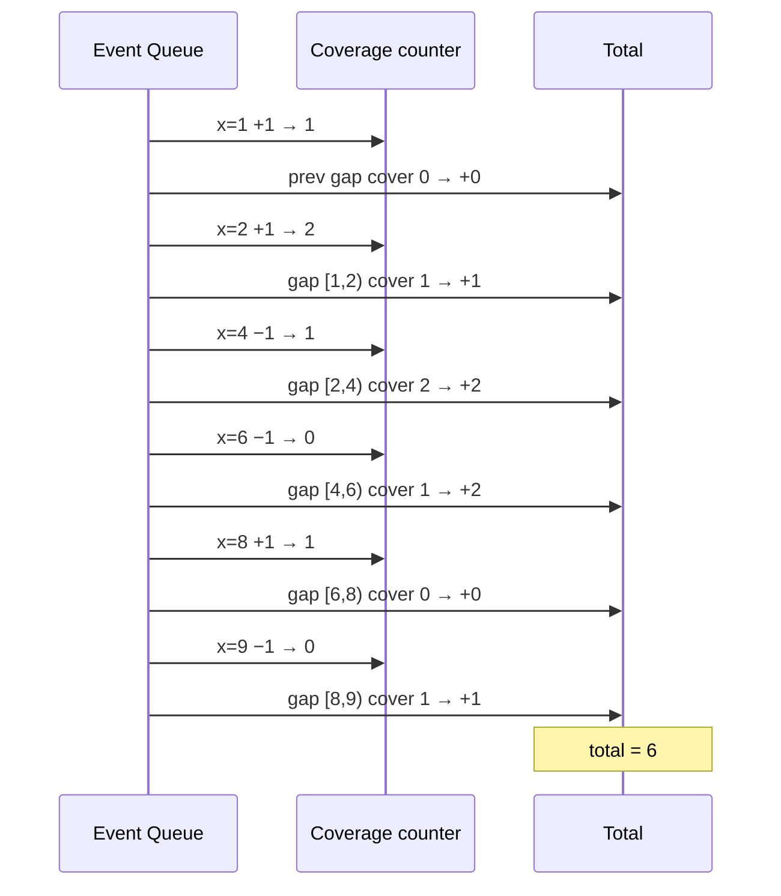

# Total Covered Length of 1D Intervals (Sweep)

| Meta | Value |
|------|-------|
| **Problem** | Total length covered by a set of 1D intervals |
| **Source** | Classic interval-union — self-contained |
| **Difficulty** | Medium |
| **Topics** | Line sweep, Intervals, Sorting, Coverage counter |
| **Time** | $O(n \log n)$ |
| **Space** | $O(n)$ |

---

## Problem Statement

You are given $n$ closed intervals $[l_i, r_i]$ on the number line (overlaps allowed). Return the
**total length of their union** — every covered point counted exactly once, no matter how many
intervals cover it.

```text
Input:  intervals = [[1,4],[2,6],[8,9]]
Output: 6
Explanation: [1,4] ∪ [2,6] = [1,6] (length 5), plus [8,9] (length 1) → 6.

Input:  intervals = [[1,3],[3,5]]
Output: 4
Explanation: they touch at 3 and merge into [1,5], length 4.

Input:  intervals = [[5,5],[1,2]]
Output: 1
Explanation: [5,5] has zero length; only [1,2] contributes 1.
```

---

## Approach (WHY)

The naive "merge intervals then sum lengths" works, but the **sweep** framing generalizes to 2D
(it is literally the inner loop of rectangle-union area). Turn each interval into two events:

- a $+1$ event at $l_i$ (coverage begins), and
- a $-1$ event at $r_i$ (coverage ends).

Sort all $2n$ events by position. Sweep left to right keeping a **coverage counter** = how many
intervals currently overlap the sweep point. Whenever that counter is **positive**, the stretch
from the previous event to the current one is covered, so we add its width.



The *WHY*: between two consecutive events the coverage count never changes, so the whole stretch
is uniformly either covered ($\text{cover} > 0$) or empty ($\text{cover} = 0$). We only need to
decide once per gap. Touching endpoints merge naturally because $+1$ is processed before $-1$ at
the same position (a closed-interval choice — see the tie-break note).

---

## Solution

```python
def union_length(intervals):
    # Build +1 / -1 events. Sort so that, on equal x, +1 (enter) precedes -1 (leave)
    # → touching closed intervals merge. delta = +1 sorts before -1 because -1 < +1?
    # We force enter-first explicitly with a secondary key.
    events = []
    for l, r in intervals:
        events.append((l, 0, +1))   # 0 = enter, processed first on ties
        events.append((r, 1, -1))   # 1 = leave
    events.sort()

    cover = 0
    prev_x = None
    total = 0
    for x, _, delta in events:
        if cover > 0 and prev_x is not None:
            total += x - prev_x       # covered stretch since last event
        cover += delta
        prev_x = x
    return total
```

```cpp
#include <bits/stdc++.h>
using namespace std;

long long union_length(vector<pair<long long,long long>> intervals) {
    // Build +1 / -1 events. On equal x, enter (0) precedes leave (1)
    // so that touching closed intervals merge.
    vector<array<long long,3>> events;   // {x, order, delta}
    for (auto& [l, r] : intervals) {
        events.push_back({l, 0, +1});    // enter first on ties
        events.push_back({r, 1, -1});    // leave
    }
    sort(events.begin(), events.end());

    long long cover = 0, prev_x = 0, total = 0;
    bool started = false;
    for (auto& e : events) {
        long long x = e[0], delta = e[2];
        if (cover > 0 && started) total += x - prev_x;  // covered stretch
        cover += delta;
        prev_x = x;
        started = true;
    }
    return total;
}
```

> Swap the tie-break to **leave-before-enter** (give `-1` the smaller order key) if intervals are
> *open* and touching should **not** merge — then $[1,3]$ and $[3,5]$ would contribute lengths
> $2 + 2 = 4$ but with a zero-width gap handled correctly. For closed intervals the version above
> is what you want.

---

## Trace

Input `[[1,4],[2,6],[8,9]]`. Events sorted (enter before leave on ties):

| event | $x$ | delta | cover before update | added (if cover>0) | total | cover after |
|-------|-----|-------|---------------------|--------------------|-------|-------------|
| enter | 1 | +1 | 0 | — (prev none) | 0 | 1 |
| enter | 2 | +1 | 1 | $2-1 = 1$ | 1 | 2 |
| leave | 4 | −1 | 2 | $4-2 = 2$ | 3 | 1 |
| leave | 6 | −1 | 1 | $6-4 = 2$ | 5 | 0 |
| enter | 8 | +1 | 0 | $0$ (cover was 0) | 5 | 1 |
| leave | 9 | −1 | 1 | $9-8 = 1$ | 6 | 0 |

Total $= 6$. ✓ The empty gap $[6, 8]$ contributes nothing because the coverage counter was $0$
across it.

---

## Visualizing the Sweep

The coverage counter rising and falling as the sweep crosses each event:



Which gaps are counted (covered) vs skipped (empty):



Event-driven view of the sweep:



---

## Math & Complexity

Let the sorted event positions be $x_0 \le x_1 \le \dots \le x_{2n-1}$, and let
$c_j$ be the coverage count on the open gap $(x_{j}, x_{j+1})$. The union length is

$$
L = \sum_{j} \big(x_{j+1} - x_j\big)\cdot \big[\, c_j > 0 \,\big],
$$

where $[\cdot]$ is the Iverson bracket (1 if covered, 0 if empty).

- Building $2n$ events and sorting: $O(n \log n)$.
- One linear pass updating the counter: $O(n)$.

$$
\text{Total} = O(n \log n), \qquad \text{Space} = O(n).
$$

---

## Takeaway

The $+1 / -1$ **coverage counter** is the smallest, most reusable sweep there is: events at
interval ends, a running overlap count, and "add the gap whenever coverage is positive." Master
it in 1D and the exact same idea computes the covered $y$-length inside a 2D rectangle-union
sweep — only the tie-breaking rule (open vs closed endpoints) needs your deliberate attention.
