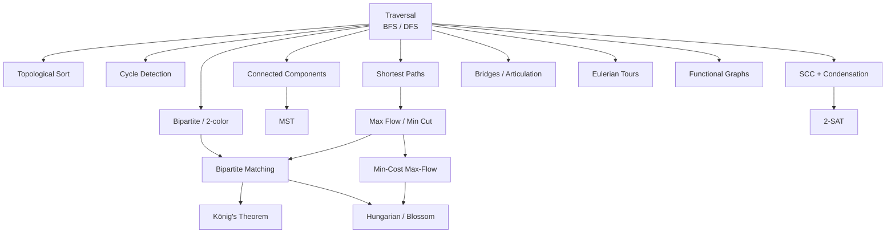

# Graph Algorithms — Advanced

A deep-dive module on **advanced graph algorithms** for competitive programming and senior-level
interviews. Each topic has a **complete guide** (theory, math, complexity, pitfalls) and one or
more **curated problems** (mostly [CSES](https://cses.fi/problemset/) + classics) solved with
**both Python and C++**.

> This folder builds on the foundational [Graphs](../Graphs/guide/Graphs-Complete-Guide.md) module
> (basic BFS/DFS, topo sort, Dijkstra, DSU). Here we go deeper: SCC, bridges, Euler tours, and the
> full **network-flow** stack.

## Structure

```
graph_advanced/
├── guide/      # one concept guide per topic
└── problems/   # one file per curated problem (Python + C++, traces, diagrams, math)
```

## Topics & Guides

| # | Concept | Guide | Key problems |
|---|---------|-------|--------------|
| 1 | BFS, DFS, flood fill, connected components | [01-traversal-floodfill-components.md](guide/01-traversal-floodfill-components.md) | Counting Rooms, Message Route |
| 2 | Topological sort (Kahn's + DFS) | [02-topological-sort.md](guide/02-topological-sort.md) | Course Schedule, Longest Flight Route |
| 3 | Cycle detection (directed & undirected) | [03-cycle-detection.md](guide/03-cycle-detection.md) | Round Trip, Round Trip II |
| 4 | Bipartite check / 2-coloring | [04-bipartite-2coloring.md](guide/04-bipartite-2coloring.md) | Building Teams |
| 5 | Shortest paths: Dijkstra, Bellman-Ford, Floyd-Warshall, 0-1 BFS | [05-shortest-paths.md](guide/05-shortest-paths.md) | Shortest Routes I, Flight Discount |
| 6 | MST: Kruskal, Prim | [06-mst-kruskal-prim.md](guide/06-mst-kruskal-prim.md) | Road Reparation (Prim & Kruskal) |
| 7 | Strongly connected components (Tarjan/Kosaraju), condensation | [07-scc-tarjan-kosaraju.md](guide/07-scc-tarjan-kosaraju.md) | Planets and Kingdoms, Coin Collector |
| 8 | Bridges & articulation points | [08-bridges-articulation-points.md](guide/08-bridges-articulation-points.md) | Critical edges/vertices |
| 9 | Eulerian path / circuit | [09-eulerian-path-circuit.md](guide/09-eulerian-path-circuit.md) | Mail Delivery, Teleporters Path |
| 10 | Max flow (Dinic), min cut, max-flow-min-cut duality | [10-max-flow-dinic-mincut.md](guide/10-max-flow-dinic-mincut.md) | Download Speed, Police Chase |
| 11 | Bipartite matching (Hopcroft-Karp / Kuhn), König's theorem | [11-bipartite-matching-konig.md](guide/11-bipartite-matching-konig.md) | School Dance |
| 12 | Min-cost max-flow | [12-min-cost-max-flow.md](guide/12-min-cost-max-flow.md) | Assignment Problem |
| 13 | 2-SAT (implication graph + SCC) | [13-two-sat.md](guide/13-two-sat.md) | Giant Pizza, Possible Bipartition |
| 14 | Functional graphs (successor graphs, binary lifting) | [14-functional-graphs.md](guide/14-functional-graphs.md) | Planets Queries I/II, Planets Cycles |
| 15 | Hungarian algorithm & general matching (Blossom) | [15-hungarian-general-matching.md](guide/15-hungarian-general-matching.md) | Assignment (Hungarian), general matching |

## How the pieces fit together



## Recommended study order

1. **Traversal → Components** (1) — everything else is built on DFS/BFS.
2. **Topological sort, Cycle detection, Bipartite** (2–4) — direct DFS/BFS applications.
3. **Shortest paths, MST** (5–6) — weighted-graph greedy/DP.
4. **SCC, Bridges, Euler** (7–9) — DFS tree structure (discovery/low-link times).
5. **Flow stack** (10–12) — max-flow/min-cut, matching, MCMF.
6. **2-SAT, Functional graphs, Hungarian/Blossom** (13–15) — SCC application, successor structure, and advanced matching capstones.

## Complexity cheat sheet

| Algorithm | Complexity | Notes |
|-----------|-----------|-------|
| BFS / DFS | $O(V+E)$ | traversal, components, flood fill |
| Topological sort | $O(V+E)$ | Kahn (BFS) or DFS post-order |
| Dijkstra (binary heap) | $O(E \log V)$ | non-negative weights |
| Bellman-Ford | $O(VE)$ | negative edges, cycle detection |
| Floyd-Warshall | $O(V^3)$ | all-pairs, small $V$ |
| 0-1 BFS | $O(V+E)$ | weights $\in \{0,1\}$ |
| Kruskal / Prim | $O(E \log V)$ | MST |
| Tarjan / Kosaraju SCC | $O(V+E)$ | strongly connected components |
| Bridges / articulation | $O(V+E)$ | low-link DFS |
| Eulerian path (Hierholzer) | $O(V+E)$ | uses every edge once |
| Dinic max flow | $O(V^2 E)$ | $O(E\sqrt V)$ on unit-capacity / matching |
| Kuhn matching | $O(VE)$ | bipartite matching |
| Hopcroft-Karp | $O(E\sqrt V)$ | faster bipartite matching |
| Min-cost max-flow (SPFA/Johnson) | $O(F \cdot VE)$ | $F$ = max flow value |
| 2-SAT (implication SCC) | $O(V+E)$ | satisfiability + assignment |
| Functional graph k-th successor | $O(n \log k)$ | binary lifting; $O(n)$ cycle find |
| Hungarian (Kuhn-Munkres) | $O(n^3)$ | min-cost assignment |
| Blossom (general matching) | $O(V^3)$ | max matching, non-bipartite |
