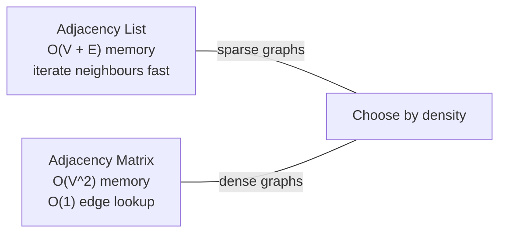
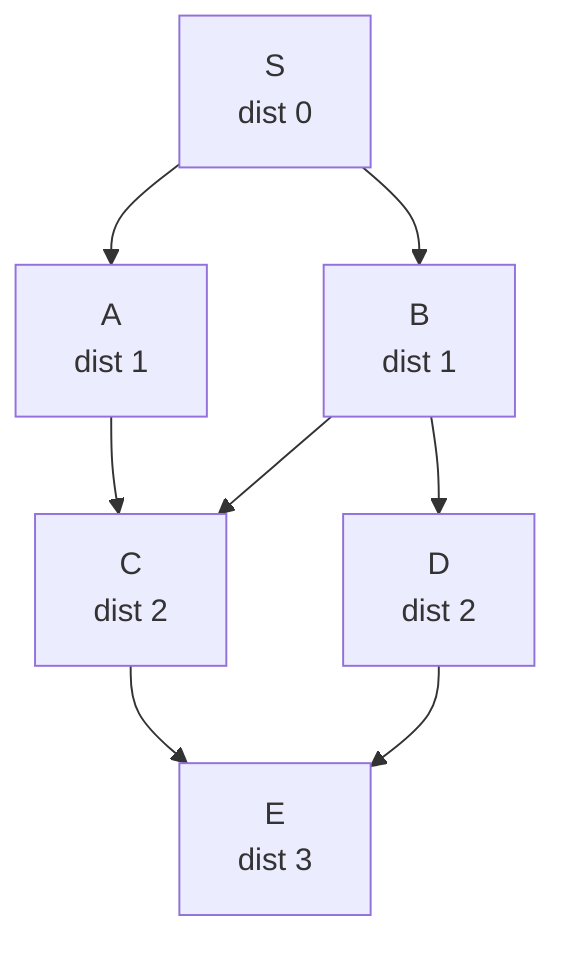
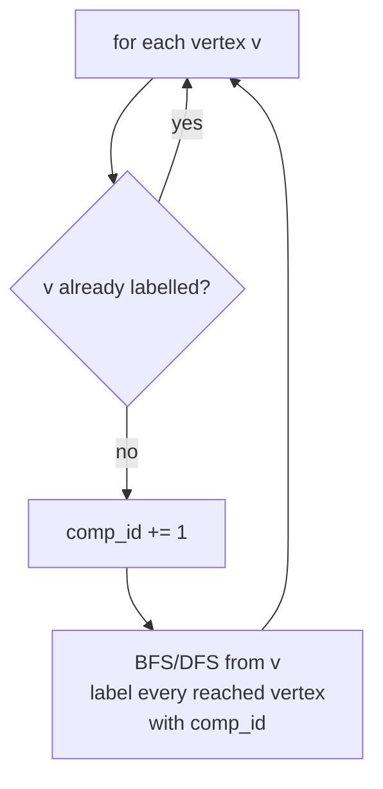
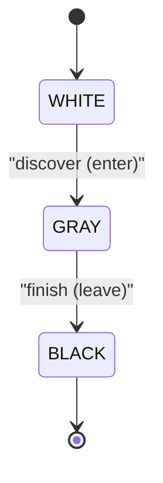

# Graph Traversal, Flood Fill & Connected Components

A practical, from-the-ground-up guide to the two foundational graph traversals —
**BFS** and **DFS** — and the two patterns built directly on top of them: **flood fill**
on grids and **connected components** on general graphs. Everything here assumes an
*unweighted* graph; weighted shortest paths (Dijkstra, Bellman-Ford) live in their own
guides.

The mental model to hold throughout: **a grid is just a graph in disguise**. Every cell is
a vertex; every legal move to a neighbouring cell is an edge. Once you internalize that,
flood fill and "count the islands" stop being special cases and become plain traversal.

---

## Table of Contents

1. [Representing a Graph: List vs Matrix](#1-representing-a-graph-list-vs-matrix)
2. [BFS — Breadth-First Search](#2-bfs--breadth-first-search)
3. [DFS — Depth-First Search](#3-dfs--depth-first-search)
4. [Flood Fill on Grids](#4-flood-fill-on-grids)
5. [Connected Components: Count + Label](#5-connected-components-count--label)
6. [The DFS Tree and Visit States](#6-the-dfs-tree-and-visit-states)
7. [Complexity Summary](#7-complexity-summary)
8. [Common Pitfalls](#8-common-pitfalls)
9. [When to Use / Patterns](#9-when-to-use--patterns)

---

## 1. Representing a Graph: List vs Matrix

A graph $G = (V, E)$ has $V$ vertices and $E$ edges. Two storage choices dominate.

### Adjacency List

For each vertex, store a list of its neighbours. Total memory is $O(V + E)$ — you pay only
for edges that exist. This is the default for almost all competitive / interview problems
because real graphs are **sparse** ($E \ll V^2$).

### Adjacency Matrix

A $V \times V$ boolean (or weight) table where `M[u][v]` is set iff edge $u \to v$ exists.
Memory is $O(V^2)$ regardless of edge count, but an edge-existence query is $O(1)$. Use it
only for **dense** graphs or when you constantly ask "is there an edge between $u$ and $v$?".



| Operation | Adjacency List | Adjacency Matrix |
|-----------|----------------|------------------|
| Memory | $O(V + E)$ | $O(V^2)$ |
| Iterate neighbours of $u$ | $O(\deg u)$ | $O(V)$ |
| Edge exists $u\!-\!v$? | $O(\deg u)$ | $O(1)$ |
| Add edge | $O(1)$ | $O(1)$ |

**Building an adjacency list** from an edge list:

```python
# n vertices labelled 0..n-1, edges is a list of (u, v) pairs.
def build_adj(n, edges, directed=False):
    adj = [[] for _ in range(n)]      # one bucket per vertex
    for u, v in edges:
        adj[u].append(v)              # u -> v
        if not directed:
            adj[v].append(u)          # v -> u for undirected graphs
    return adj
```

```cpp
// n vertices labelled 0..n-1, edges is a list of (u, v) pairs.
vector<vector<int>> build_adj(int n, const vector<pair<int,int>>& edges,
                              bool directed = false) {
    vector<vector<int>> adj(n);       // one bucket per vertex
    for (auto [u, v] : edges) {
        adj[u].push_back(v);          // u -> v
        if (!directed)
            adj[v].push_back(u);      // v -> u for undirected graphs
    }
    return adj;
}
```

---

## 2. BFS — Breadth-First Search

BFS explores the graph in **layers**: first the start vertex (distance 0), then all its
neighbours (distance 1), then their unseen neighbours (distance 2), and so on. It uses a
**FIFO queue**. Because it expands strictly outward, BFS computes the **shortest path in an
unweighted graph** — the first time you reach a vertex, you have reached it via a minimum
number of edges.

### The key invariant

> When a vertex is **dequeued**, its recorded distance is final and minimal.

The critical implementation detail: **mark a vertex as visited the moment you push it**, not
when you pop it. If you wait until popping, a vertex can be enqueued many times before it is
first processed, which both breaks the distance guarantee and blows up the queue.

### Pseudocode

```
BFS(source):
    dist[source] = 0
    visited[source] = true
    queue.push(source)
    while queue not empty:
        u = queue.pop_front()
        for each neighbour w of u:
            if not visited[w]:
                visited[w] = true            # mark on PUSH
                dist[w] = dist[u] + 1
                queue.push(w)
```

```python
from collections import deque

def bfs(adj, source):
    n = len(adj)
    dist = [-1] * n                  # -1 = unreached
    dist[source] = 0
    q = deque([source])              # FIFO queue
    while q:
        u = q.popleft()              # dequeue the front
        for w in adj[u]:
            if dist[w] == -1:        # not visited yet
                dist[w] = dist[u] + 1
                q.append(w)          # mark-on-push via dist assignment
    return dist
```

```cpp
#include <queue>
#include <vector>
using namespace std;

vector<int> bfs(const vector<vector<int>>& adj, int source) {
    int n = adj.size();
    vector<int> dist(n, -1);         // -1 = unreached
    dist[source] = 0;
    queue<int> q;                    // FIFO queue
    q.push(source);
    while (!q.empty()) {
        int u = q.front(); q.pop();  // dequeue the front
        for (int w : adj[u]) {
            if (dist[w] == -1) {     // not visited yet
                dist[w] = dist[u] + 1;
                q.push(w);           // mark-on-push via dist assignment
            }
        }
    }
    return dist;
}
```

Here `dist[w] != -1` doubles as the "visited" test, so we avoid a separate array.

### Layered view



Every edge in BFS connects vertices whose distances differ by at most 1 — that is the
formal reason the layers are well-defined.

---

## 3. DFS — Depth-First Search

DFS dives as deep as possible along one branch before backtracking. It uses a **LIFO stack**
— either the implicit call stack (recursion) or an explicit one. DFS does **not** give
shortest paths, but it is the natural tool for connectivity, cycle detection, topological
sorting, and anything that needs the *structure* of exploration (entry/exit times).

### Recursive DFS

```
DFS(u):
    visited[u] = true
    process(u)
    for each neighbour w of u:
        if not visited[w]:
            DFS(w)
```

```python
def dfs_recursive(adj, source):
    n = len(adj)
    visited = [False] * n
    order = []                       # vertices in visit order

    def dfs(u):
        visited[u] = True
        order.append(u)              # pre-order processing
        for w in adj[u]:
            if not visited[w]:
                dfs(w)

    dfs(source)
    return order
```

```cpp
void dfs(const vector<vector<int>>& adj, int u,
         vector<bool>& visited, vector<int>& order) {
    visited[u] = true;
    order.push_back(u);              // pre-order processing
    for (int w : adj[u]) {
        if (!visited[w]) {
            dfs(adj, w, visited, order);
        }
    }
}
```

### Iterative DFS (explicit stack)

For deep graphs (think a grid with $10^6$ cells, or a path-shaped graph), recursion can
overflow the call stack. Convert to an explicit stack. Note the visit order differs slightly
from the recursive version, but the set of reached vertices is identical.

```python
def dfs_iterative(adj, source):
    n = len(adj)
    visited = [False] * n
    order = []
    stack = [source]
    visited[source] = True           # mark on push
    while stack:
        u = stack.pop()              # LIFO
        order.append(u)
        for w in adj[u]:
            if not visited[w]:
                visited[w] = True    # mark on push to avoid dup entries
                stack.append(w)
    return order
```

```cpp
vector<int> dfs_iterative(const vector<vector<int>>& adj, int source) {
    int n = adj.size();
    vector<bool> visited(n, false);
    vector<int> order;
    vector<int> stack{source};
    visited[source] = true;          // mark on push
    while (!stack.empty()) {
        int u = stack.back(); stack.pop_back();   // LIFO
        order.push_back(u);
        for (int w : adj[u]) {
            if (!visited[w]) {
                visited[w] = true;   // mark on push to avoid dup entries
                stack.push_back(w);
            }
        }
    }
    return order;
}
```

---

## 4. Flood Fill on Grids

A grid is a graph where each cell $(r, c)$ is a vertex and edges connect orthogonally (or
diagonally) adjacent cells of the same region. **Flood fill** = run BFS/DFS from a starting
cell and visit every cell reachable through same-coloured neighbours. This powers the paint
bucket tool, "number of islands", and CSES *Counting Rooms*.

### Direction vectors

Encode the moves as offset arrays. Four-directional (von Neumann) vs eight-directional
(Moore):

$$
\text{4-dir} = \{(-1,0),(1,0),(0,-1),(0,1)\}, \qquad
\text{8-dir} = \text{4-dir} \cup \{(-1,-1),(-1,1),(1,-1),(1,1)\}
$$

```python
from collections import deque

DIRS4 = [(-1, 0), (1, 0), (0, -1), (0, 1)]   # up, down, left, right

def flood_fill(grid, sr, sc, target):
    """BFS flood fill from (sr, sc) over cells equal to `target`."""
    rows, cols = len(grid), len(grid[0])
    if grid[sr][sc] != target:
        return
    seen = [[False] * cols for _ in range(rows)]
    seen[sr][sc] = True
    q = deque([(sr, sc)])
    while q:
        r, c = q.popleft()
        for dr, dc in DIRS4:
            nr, nc = r + dr, c + dc
            # bounds check FIRST, then content check
            if 0 <= nr < rows and 0 <= nc < cols \
                    and not seen[nr][nc] and grid[nr][nc] == target:
                seen[nr][nc] = True
                q.append((nr, nc))
```

```cpp
const int DR[4] = {-1, 1, 0, 0};     // up, down, left, right
const int DC[4] = {0, 0, -1, 1};

// BFS flood fill from (sr, sc) over cells equal to `target`.
void flood_fill(vector<vector<char>>& grid, int sr, int sc, char target) {
    int rows = grid.size(), cols = grid[0].size();
    if (grid[sr][sc] != target) return;
    vector<vector<bool>> seen(rows, vector<bool>(cols, false));
    seen[sr][sc] = true;
    queue<pair<int,int>> q;
    q.push({sr, sc});
    while (!q.empty()) {
        auto [r, c] = q.front(); q.pop();
        for (int k = 0; k < 4; ++k) {
            int nr = r + DR[k], nc = c + DC[k];
            // bounds check FIRST, then content check
            if (nr >= 0 && nr < rows && nc >= 0 && nc < cols
                    && !seen[nr][nc] && grid[nr][nc] == target) {
                seen[nr][nc] = true;
                q.push({nr, nc});
            }
        }
    }
}
```

The order of the conditions matters: **always check bounds before indexing** `grid[nr][nc]`,
otherwise you read out of range. In C++ this is undefined behaviour; in Python negative
indices silently wrap and give wrong answers.

---

## 5. Connected Components: Count + Label

A **connected component** is a maximal set of mutually reachable vertices. To both *count*
and *label* every component, scan all vertices; whenever you find an unvisited one, it
starts a new component — flood the whole thing with one traversal, tagging each vertex with
the current component id.



```python
from collections import deque

def connected_components(adj):
    n = len(adj)
    comp = [-1] * n                  # -1 = unlabelled
    num = 0
    for start in range(n):
        if comp[start] != -1:
            continue
        comp[start] = num            # open a new component
        q = deque([start])
        while q:
            u = q.popleft()
            for w in adj[u]:
                if comp[w] == -1:
                    comp[w] = num
                    q.append(w)
        num += 1                     # component fully explored
    return num, comp                 # count and per-vertex labels
```

```cpp
pair<int, vector<int>> connected_components(const vector<vector<int>>& adj) {
    int n = adj.size();
    vector<int> comp(n, -1);         // -1 = unlabelled
    int num = 0;
    for (int start = 0; start < n; ++start) {
        if (comp[start] != -1) continue;
        comp[start] = num;           // open a new component
        queue<int> q; q.push(start);
        while (!q.empty()) {
            int u = q.front(); q.pop();
            for (int w : adj[u]) {
                if (comp[w] == -1) {
                    comp[w] = num;
                    q.push(w);
                }
            }
        }
        ++num;                       // component fully explored
    }
    return {num, comp};              // count and per-vertex labels
}
```

The outer loop visits each vertex once and the inner traversal touches each edge a constant
number of times, so the **total** cost across all components is $O(V + E)$ — not
$O(V \cdot (V+E))$. Each vertex is flooded by exactly one component.

---

## 6. The DFS Tree and Visit States

As DFS runs it implicitly builds a **DFS tree** (or forest, if the graph is disconnected):
tree edges are the ones along which we recurse into a fresh vertex. Classifying vertices by
their **state** is the key to cycle detection and topological sorting.

The classic **three-colour** model:

- **WHITE** — not yet discovered.
- **GRAY** — discovered, still on the recursion stack (in progress).
- **BLACK** — fully finished, all descendants explored.



In a **directed** graph, encountering an edge to a **GRAY** vertex means a **back edge** —
that is exactly a cycle. In an **undirected** graph, a cycle is detected when you reach an
already-visited neighbour that is **not** the parent you came from.

```python
WHITE, GRAY, BLACK = 0, 1, 2

def has_cycle_directed(adj):
    n = len(adj)
    color = [WHITE] * n

    def dfs(u):
        color[u] = GRAY              # enter: now on the stack
        for w in adj[u]:
            if color[w] == GRAY:     # edge to in-progress vertex
                return True          # back edge => cycle
            if color[w] == WHITE and dfs(w):
                return True
        color[u] = BLACK             # leave: fully explored
        return False

    return any(color[v] == WHITE and dfs(v) for v in range(n))
```

```cpp
enum { WHITE, GRAY, BLACK };

bool dfs_cycle(const vector<vector<int>>& adj, int u, vector<int>& color) {
    color[u] = GRAY;                 // enter: now on the stack
    for (int w : adj[u]) {
        if (color[w] == GRAY)        // edge to in-progress vertex
            return true;             // back edge => cycle
        if (color[w] == WHITE && dfs_cycle(adj, w, color))
            return true;
    }
    color[u] = BLACK;                // leave: fully explored
    return false;
}

bool has_cycle_directed(const vector<vector<int>>& adj) {
    int n = adj.size();
    vector<int> color(n, WHITE);
    for (int v = 0; v < n; ++v)
        if (color[v] == WHITE && dfs_cycle(adj, v, color))
            return true;
    return false;
}
```

Recording **entry** and **exit** timestamps during this process gives you the data needed
for topological order (reverse exit order), bridges, articulation points, and strongly
connected components.

---

## 7. Complexity Summary

Let $V$ be the number of vertices and $E$ the number of edges. For a grid of $R \times C$
cells, $V = RC$ and $E = O(RC)$ (constant neighbours per cell), so all the grid traversals
are $O(RC)$.

| Algorithm | Time | Extra Space | Shortest Path? |
|-----------|------|-------------|----------------|
| BFS (adjacency list) | $O(V + E)$ | $O(V)$ queue + visited | Yes, unweighted |
| DFS recursive | $O(V + E)$ | $O(V)$ call stack | No |
| DFS iterative | $O(V + E)$ | $O(V)$ explicit stack | No |
| Flood fill (grid) | $O(RC)$ | $O(RC)$ | Yes (BFS variant) |
| Connected components | $O(V + E)$ | $O(V)$ | n/a |
| BFS on matrix graph | $O(V^2)$ | $O(V)$ | Yes, unweighted |

The matrix row is the cautionary tale: scanning neighbours is $O(V)$ per vertex, so BFS/DFS
become $O(V^2)$ even on sparse graphs. Prefer adjacency lists.

---

## 8. Common Pitfalls

- **Visited-marking timing (BFS/iterative DFS).** Mark a vertex **when you push it**, not
  when you pop it. Marking on pop lets the same vertex sit in the queue/stack many times,
  causing duplicate work and — for BFS — wrong distances.
- **Recursion depth.** Recursive DFS on a $10^6$-cell grid or a long path graph overflows
  the stack. In Python the default limit is ~1000; either raise it carefully with
  `sys.setrecursionlimit` *and* enlarge the OS stack, or just use an iterative stack. For
  big CSES grids, **prefer iterative BFS/DFS**.
- **Grid bounds order.** Check `0 <= nr < rows and 0 <= nc < cols` **before** reading
  `grid[nr][nc]`. Python's negative-index wraparound hides the bug; C++ gives UB.
- **Mixing up directed/undirected cycle rules.** Undirected cycle detection must ignore the
  immediate parent edge; otherwise every edge looks like a cycle.
- **Re-creating the visited array per component.** Use a single shared `visited`/`comp`
  array across the whole scan so total work stays $O(V + E)$.
- **Using BFS for weighted shortest paths.** BFS is only correct when every edge has the
  same weight. With weights, reach for Dijkstra (0/1 weights → 0-1 BFS with a deque).

---

## 9. When to Use / Patterns

| You need... | Use |
|-------------|-----|
| Shortest path in an **unweighted** graph / grid | **BFS** |
| Minimum number of moves / "fewest steps" | **BFS** |
| Reachability, "can I get from A to B" | BFS or DFS |
| Count / label connected components | DFS or BFS over all vertices |
| Flood fill, islands, enclosed regions | Grid BFS/DFS |
| Cycle detection, topological sort, SCC, bridges | **DFS** (with timestamps/colours) |
| Multi-source spread (fire, rot, infection) | **Multi-source BFS** (seed the queue with all sources at distance 0) |
| 0/1 edge weights | **0-1 BFS** (deque: push-front for 0, push-back for 1) |

**Rules of thumb**

1. If the question asks "shortest / fewest / minimum steps" on an unweighted structure, the
   answer is almost always BFS.
2. If it asks about *structure* (cycles, ordering, components, articulation), reach for DFS.
3. On large grids, default to **iterative** traversal to dodge recursion limits.
4. A grid problem is a graph problem — write the direction vectors and reuse the same BFS
   skeleton every time.
