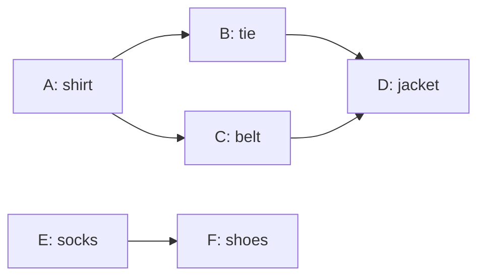
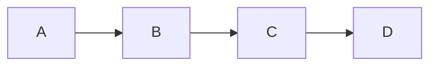
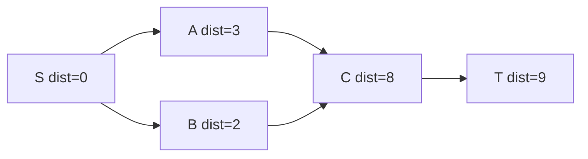

# Topological Sort — Kahn's BFS & DFS Post-Order

A **topological sort** (or topological ordering) of a directed graph is a linear ordering of its vertices such that for **every** directed edge `u → v`, `u` appears **before** `v` in the ordering. It is the backbone of dependency resolution: build systems, task scheduling, course prerequisites, spreadsheet recalculation, and dynamic programming on Directed Acyclic Graphs (DAGs).

This guide covers the two canonical algorithms (Kahn's BFS using in-degrees, and DFS post-order), how to detect cycles, when an ordering is unique, how to obtain the lexicographically smallest ordering, and how to use a topological order to drive DAG dynamic programming.

## Table of Contents

1. [What a Topological Order Is (and When It Exists)](#1-what-a-topological-order-is-and-when-it-exists)
2. [Kahn's Algorithm (In-Degrees + Queue)](#2-kahns-algorithm-in-degrees--queue)
3. [DFS Post-Order + Reverse](#3-dfs-post-order--reverse)
4. [Uniqueness vs Multiple Valid Orders](#4-uniqueness-vs-multiple-valid-orders)
5. [Lexicographically Smallest Order (Priority Queue)](#5-lexicographically-smallest-order-priority-queue)
6. [Using a Topological Order for DAG DP](#6-using-a-topological-order-for-dag-dp)
7. [Complexity Summary](#7-complexity-summary)
8. [Common Pitfalls](#8-common-pitfalls)
9. [Patterns](#9-patterns)

---

## 1. What a Topological Order Is (and When It Exists)

A topological order exists **if and only if** the directed graph is a **DAG** (Directed Acyclic Graph). If there is any directed cycle, no valid ordering can exist: the vertices on the cycle each demand to come before the next, which is impossible.



A valid order for the DAG above is `A, E, B, C, F, D` (among others). Notice every arrow points "forward" in the listing.

Key facts:

- A DAG always has **at least one** vertex with in-degree `0` (a source) and **at least one** vertex with out-degree `0` (a sink).
- The number of distinct topological orders can range from `1` to `V!` depending on how constrained the edges are.
- Detecting a cycle is a **free byproduct** of both algorithms below.

---

## 2. Kahn's Algorithm (In-Degrees + Queue)

Kahn's algorithm repeatedly removes vertices that currently have **no incoming edges** (in-degree `0`). Removing a vertex "satisfies" its outgoing edges, potentially exposing new in-degree-`0` vertices.

**Pseudocode**

```
compute indegree[v] for all v
queue Q <- all vertices with indegree 0
order <- []
while Q not empty:
    u <- Q.pop()
    order.append(u)
    for each edge u -> v:
        indegree[v] -= 1
        if indegree[v] == 0:
            Q.push(v)
if len(order) < V:        # not all vertices placed
    report CYCLE
else:
    return order
```

**Cycle detection rule:** after the loop, if `processed count < V`, the leftover vertices form (or feed into) a cycle, because their in-degree never dropped to `0`.

```python
from collections import deque

def kahn(n, adj):
    # adj: list of lists, adj[u] = vertices v with edge u -> v
    indeg = [0] * n
    for u in range(n):
        for v in adj[u]:
            indeg[v] += 1

    q = deque(u for u in range(n) if indeg[u] == 0)  # all sources
    order = []
    while q:
        u = q.popleft()
        order.append(u)
        for v in adj[u]:        # relax outgoing edges
            indeg[v] -= 1
            if indeg[v] == 0:   # v became a new source
                q.append(v)

    if len(order) < n:          # some vertices never reached in-degree 0
        return None             # cycle exists
    return order
```

```cpp
#include <vector>
#include <queue>
using namespace std;

// adj[u] = vertices v with edge u -> v. Returns empty vector if a cycle exists.
vector<int> kahn(int n, const vector<vector<int>>& adj) {
    vector<int> indeg(n, 0);
    for (int u = 0; u < n; ++u)
        for (int v : adj[u])
            indeg[v]++;

    queue<int> q;
    for (int u = 0; u < n; ++u)
        if (indeg[u] == 0) q.push(u);   // all sources

    vector<int> order;
    while (!q.empty()) {
        int u = q.front(); q.pop();
        order.push_back(u);
        for (int v : adj[u]) {          // relax outgoing edges
            if (--indeg[v] == 0)        // v became a new source
                q.push(v);
        }
    }

    if ((int)order.size() < n)          // some vertices stuck in a cycle
        return {};                      // cycle exists
    return order;
}
```

Runs in $O(V+E)$: each vertex enters the queue once and each edge is relaxed once.

---

## 3. DFS Post-Order + Reverse

A depth-first search finishes (post-orders) a vertex only **after** all vertices reachable from it are finished. Therefore the **reverse** of the DFS finish order is a valid topological order.

**Pseudocode**

```
state[v] = WHITE for all v          # 0 unvisited, 1 in-stack, 2 done
order <- []
for each vertex s:
    if state[s] == WHITE:
        dfs(s)

dfs(u):
    state[u] = GRAY
    for each edge u -> v:
        if state[v] == GRAY:        # back edge -> cycle
            report CYCLE
        if state[v] == WHITE:
            dfs(v)
    state[u] = BLACK
    order.append(u)                 # post-order
reverse(order)                      # topological order
```

**Cycle detection rule:** encountering a **GRAY** (currently on the recursion stack) vertex means a back edge, hence a cycle.

```python
import sys

def topo_dfs(n, adj):
    sys.setrecursionlimit(1 << 20)
    state = [0] * n          # 0 white, 1 gray (on stack), 2 black (done)
    order = []
    has_cycle = False

    def dfs(u):
        nonlocal has_cycle
        state[u] = 1
        for v in adj[u]:
            if state[v] == 1:        # back edge -> cycle
                has_cycle = True
            elif state[v] == 0:
                dfs(v)
        state[u] = 2
        order.append(u)              # post-order push

    for s in range(n):
        if state[s] == 0:
            dfs(s)
    if has_cycle:
        return None
    order.reverse()                  # reverse post-order = topo order
    return order
```

```cpp
#include <vector>
#include <algorithm>
using namespace std;

// Recursive DFS post-order. Returns empty vector if a cycle exists.
struct TopoDFS {
    int n;
    const vector<vector<int>>& adj;
    vector<int> state;   // 0 white, 1 gray (on stack), 2 black (done)
    vector<int> order;
    bool hasCycle = false;

    TopoDFS(int n, const vector<vector<int>>& adj)
        : n(n), adj(adj), state(n, 0) {}

    void dfs(int u) {
        state[u] = 1;
        for (int v : adj[u]) {
            if (state[v] == 1) {         // back edge -> cycle
                hasCycle = true;
            } else if (state[v] == 0) {
                dfs(v);
            }
        }
        state[u] = 2;
        order.push_back(u);              // post-order push
    }

    vector<int> solve() {
        for (int s = 0; s < n; ++s)
            if (state[s] == 0) dfs(s);
        if (hasCycle) return {};
        reverse(order.begin(), order.end());  // reverse post-order = topo order
        return order;
    }
};
```

For large inputs prefer an **explicit-stack** iterative DFS to avoid stack overflow:

```python
def topo_dfs_iter(n, adj):
    state = [0] * n          # 0 white, 1 gray, 2 black
    order = []
    for s in range(n):
        if state[s] != 0:
            continue
        stack = [(s, 0)]     # (vertex, index into adj[vertex])
        while stack:
            u, i = stack[-1]
            if i == 0:
                state[u] = 1
            if i < len(adj[u]):
                stack[-1] = (u, i + 1)
                v = adj[u][i]
                if state[v] == 1:
                    return None       # back edge -> cycle
                if state[v] == 0:
                    stack.append((v, 0))
            else:
                state[u] = 2
                order.append(u)       # post-order
                stack.pop()
    order.reverse()
    return order
```

```cpp
#include <vector>
#include <algorithm>
using namespace std;

// Iterative DFS post-order. Returns empty vector if a cycle exists.
vector<int> topoDfs(int n, const vector<vector<int>>& adj) {
    vector<int> state(n, 0);     // 0 white, 1 gray, 2 black
    vector<int> order;
    vector<int> idx(n, 0);       // current neighbor index per vertex
    vector<int> stk;

    for (int s = 0; s < n; ++s) {
        if (state[s] != 0) continue;
        stk.push_back(s);
        state[s] = 1;            // gray on push
        while (!stk.empty()) {
            int u = stk.back();
            if (idx[u] < (int)adj[u].size()) {
                int v = adj[u][idx[u]++];
                if (state[v] == 1) return {};   // back edge -> cycle
                if (state[v] == 0) {
                    state[v] = 1;
                    stk.push_back(v);
                }
            } else {
                state[u] = 2;     // black on pop
                order.push_back(u); // post-order
                stk.pop_back();
            }
        }
    }
    reverse(order.begin(), order.end());  // reverse post-order = topo order
    return order;
}
```

---

## 4. Uniqueness vs Multiple Valid Orders

A DAG has a **unique** topological order **if and only if** there is a Hamiltonian path — that is, at every step of Kahn's algorithm the queue contains **exactly one** vertex. If at any step two or more vertices simultaneously have in-degree `0`, they can be swapped, producing multiple valid orders.



This chain `A → B → C → D` has the **single** order `A, B, C, D`. By contrast, the first diagram in section 1 has many valid orders because sources like `A` and `E` are independent.

Practical check inside Kahn's loop: if the queue size is ever `> 1`, the ordering is **not** unique.

---

## 5. Lexicographically Smallest Order (Priority Queue)

To obtain the **lexicographically smallest** valid topological order, replace Kahn's FIFO queue with a **min-priority queue** (min-heap). Whenever multiple vertices are available (in-degree `0`), always emit the smallest label first.

```python
import heapq

def kahn_lexsmallest(n, adj):
    indeg = [0] * n
    for u in range(n):
        for v in adj[u]:
            indeg[v] += 1

    heap = [u for u in range(n) if indeg[u] == 0]
    heapq.heapify(heap)              # min-heap of available sources
    order = []
    while heap:
        u = heapq.heappop(heap)      # smallest available label
        order.append(u)
        for v in adj[u]:
            indeg[v] -= 1
            if indeg[v] == 0:
                heapq.heappush(heap, v)

    if len(order) < n:
        return None                  # cycle
    return order
```

```cpp
#include <vector>
#include <queue>
using namespace std;

// Lexicographically smallest topological order; {} on cycle.
vector<int> kahnLexSmallest(int n, const vector<vector<int>>& adj) {
    vector<int> indeg(n, 0);
    for (int u = 0; u < n; ++u)
        for (int v : adj[u])
            indeg[v]++;

    // min-heap: smallest label has highest priority
    priority_queue<int, vector<int>, greater<int>> pq;
    for (int u = 0; u < n; ++u)
        if (indeg[u] == 0) pq.push(u);

    vector<int> order;
    while (!pq.empty()) {
        int u = pq.top(); pq.pop();   // smallest available label
        order.push_back(u);
        for (int v : adj[u])
            if (--indeg[v] == 0)
                pq.push(v);
    }

    if ((int)order.size() < n) return {};  // cycle
    return order;
}
```

The heap variant costs $O(V \log V + E)$ because of the priority-queue operations.

---

## 6. Using a Topological Order for DAG DP

Once vertices are in topological order, every dependency of a vertex is processed **before** it. This lets us compute dynamic programming over the DAG in a single linear pass — no memoized recursion needed.

For a longest path in a DAG with edge weights `w(u, v)`, define `dist[v]` as the length of the longest path **ending** at `v`. Process vertices in topological order and relax forward:

$$
\text{dist}[v] = \max_{(u,\,v)\,\in\,E}\bigl(\text{dist}[u] + w(u, v)\bigr),
\qquad \text{dist}[s] = 0 \ \text{for sources.}
$$

The same skeleton solves many DAG problems by swapping the combine operator:

- **Longest / shortest path:** `max` / `min` of `dist[u] + w`.
- **Counting paths** between two nodes: `ways[v] = Σ ways[u]` over incoming edges.
- **Reachability / earliest finish time** in scheduling (critical path / PERT).

```python
def dag_longest_path(n, adj):
    # adj[u] = list of (v, w) edges. Returns dist[] (longest path ending at v).
    order = kahn(n, [[v for v, _ in adj[u]] for u in range(n)])
    if order is None:
        raise ValueError("graph has a cycle")

    NEG = float("-inf")
    dist = [0] * n               # 0: a path may start anywhere
    for u in order:              # dependencies of u already finalized
        for v, w in adj[u]:
            if dist[u] + w > dist[v]:
                dist[v] = dist[u] + w
    return dist
```

```cpp
#include <vector>
#include <queue>
#include <algorithm>
using namespace std;

// adj[u] = vector of {v, w}. dist[v] = longest path ending at v.
vector<long long> dagLongestPath(int n, const vector<vector<pair<int,int>>>& adj) {
    vector<int> indeg(n, 0);
    for (int u = 0; u < n; ++u)
        for (auto& [v, w] : adj[u]) indeg[v]++;

    queue<int> q;
    for (int u = 0; u < n; ++u) if (indeg[u] == 0) q.push(u);

    vector<long long> dist(n, 0);     // path may start anywhere
    while (!q.empty()) {
        int u = q.front(); q.pop();   // u finalized in topo order
        for (auto& [v, w] : adj[u]) {
            dist[v] = max(dist[v], dist[u] + w);  // relax forward
            if (--indeg[v] == 0) q.push(v);
        }
    }
    return dist;
}
```



Edge weights above: `S→A=3`, `S→B=2`, `A→C=5`, `B→C=4`, `C→T=1`. Processing in topo order `S, A, B, C, T` yields `dist[C] = max(3+5, 2+4) = 8` and `dist[T] = 9`.

---

## 7. Complexity Summary

| Approach | Time | Extra Space | Cycle Detection | Notes |
|---|---|---|---|---|
| Kahn (BFS, FIFO queue) | $O(V+E)$ | $O(V)$ | processed `< V` | iterative, no recursion limit |
| DFS post-order + reverse | $O(V+E)$ | $O(V)$ stack | GRAY back edge | recursion risk on deep graphs |
| Iterative DFS post-order | $O(V+E)$ | $O(V)$ | GRAY back edge | safe for huge graphs |
| Lex-smallest (min-heap) | $O(V \log V + E)$ | $O(V)$ | processed `< V` | smallest label first |
| DAG DP over topo order | $O(V+E)$ | $O(V)$ | reuse Kahn | longest/shortest/count |

---

## 8. Common Pitfalls

- **Forgetting cycle handling.** Always verify the processed count equals `V` (Kahn) or watch for a GRAY back edge (DFS). A "topological order" of a graph with a cycle is meaningless — return IMPOSSIBLE.
- **Assuming a unique answer.** Most DAGs have many valid orders. Test harnesses must accept *any* valid order (verify every edge points forward) unless the problem explicitly asks for the lexicographically smallest.
- **Recursion depth.** Recursive DFS on a chain of `10^5+` vertices overflows the stack in many environments. Use Kahn's BFS or an explicit-stack DFS.
- **Wrong edge direction.** `u → v` means `u` comes **before** `v`. Building the adjacency list reversed silently produces a reversed (still "valid-looking") order that fails the problem.
- **Resetting state between components.** A disconnected DAG needs the outer loop over **all** start vertices, not just vertex `0`.
- **Initializing DP `dist` wrong.** For "path may start anywhere" use `0`; for "path must start at a fixed source" use `-inf` everywhere except the source.

---

## 9. Patterns

- **Dependency resolution:** courses, build targets, package installation → "is there a valid order? give one."
- **Cycle detection in a directed graph:** if Kahn places fewer than `V` vertices, a cycle exists (equivalent to DFS back-edge detection).
- **DAG longest/shortest path:** linearize with topo sort, then a single relaxation pass — far simpler than Dijkstra/Bellman-Ford and works with negative weights.
- **Counting paths / DAG DP:** accumulate over incoming edges in topological order.
- **Lexicographic / tie-breaking output:** swap the FIFO queue for a min-heap.
- **Critical path (PERT/CPM):** longest path in a DAG gives the minimum project completion time.
