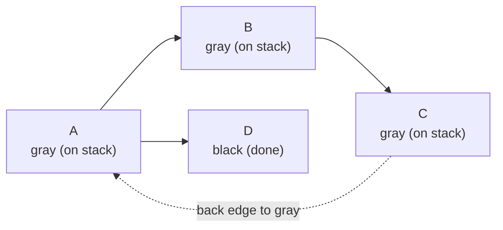
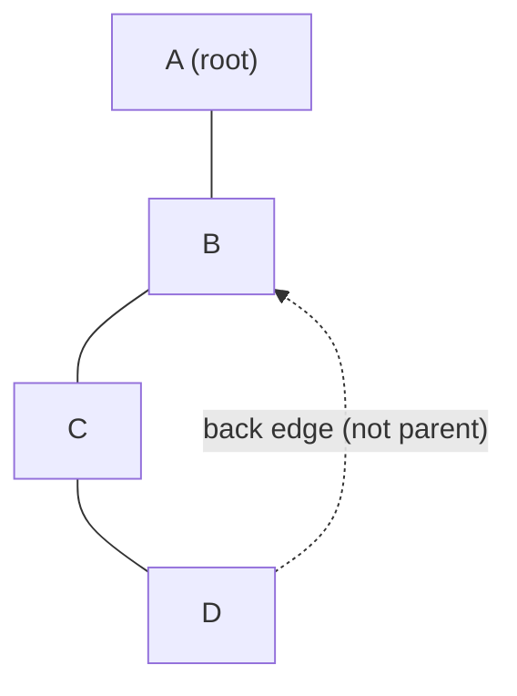
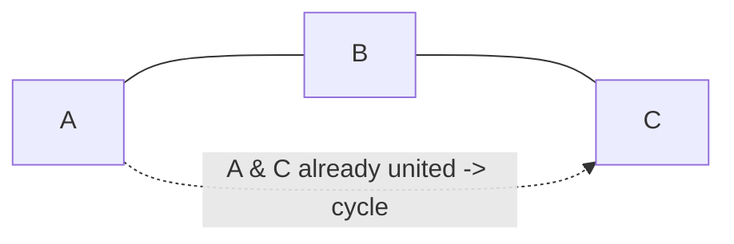
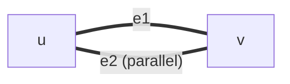

# Cycle Detection in Directed and Undirected Graphs

Cycle detection is one of the most frequently reused graph primitives. It powers
deadlock detection, build/dependency ordering, spreadsheet recalculation,
"is this a tree?" checks, and a huge number of competitive programming tasks.

The catch is that **directed** and **undirected** graphs require genuinely
different reasoning. A back edge in a directed graph means something different
from a back edge in an undirected graph, and the "skip the parent" trick that
works beautifully for undirected DFS is *wrong* for directed graphs and even
*subtly wrong* for undirected multigraphs. This guide builds all four core
techniques from first principles and shows how to **reconstruct and print the
actual cycle**, not just answer yes/no.

---

## Table of Contents

1. [Mental Model: What Is a Cycle?](#mental-model-what-is-a-cycle)
2. [Directed Graphs](#directed-graphs)
   - [Method A: 3-Color DFS (white / gray / black)](#method-a-3-color-dfs)
   - [Method B: Kahn's Topological Sort (leftover nodes)](#method-b-kahns-topological-sort)
3. [Undirected Graphs](#undirected-graphs)
   - [Method C: DFS with Parent Tracking](#method-c-dfs-with-parent-tracking)
   - [Method D: DSU / Union-Find](#method-d-dsu--union-find)
4. [Reconstructing and Printing the Cycle](#reconstructing-and-printing-the-cycle)
5. [Subtleties: Self-Loops, Multi-Edges, Parent-Skip Pitfalls](#subtleties)
6. [Complexity Summary](#complexity-summary)
7. [Common Pitfalls](#common-pitfalls)
8. [Patterns](#patterns)

---

## Mental Model: What Is a Cycle?

A **cycle** is a path that starts and ends at the same vertex.

- In a **directed** graph, a cycle is a sequence
  $v_0 \rightarrow v_1 \rightarrow \dots \rightarrow v_k \rightarrow v_0$
  where every arrow respects edge direction.
- In an **undirected** graph, a cycle is a closed walk of length $\ge 3$ that
  does not immediately reuse the edge it just came in on. (Reusing the same
  edge $u - v - u$ is *not* a cycle; it is just walking across one edge and
  back.)

A graph with no cycles is:

- a **DAG** (Directed Acyclic Graph) in the directed case, and
- a **forest** (a disjoint union of trees) in the undirected case.

Key counting fact for undirected graphs: a forest on $n$ vertices with $c$
connected components has exactly $n - c$ edges. So:

$$
\text{undirected graph has a cycle} \iff |E| > n - c.
$$

If the graph is connected ($c = 1$), any graph with $|E| \ge n$ edges *must*
contain a cycle. This is the pigeonhole intuition behind the DSU method.

---

## Directed Graphs

### Method A: 3-Color DFS

We run a DFS and color each vertex one of three states:

| Color | Meaning |
| ----- | ------- |
| **white** (0) | unvisited |
| **gray** (1) | on the current DFS recursion stack (being processed) |
| **black** (2) | fully processed (DFS finished, popped off the stack) |

The single rule: **if DFS reaches a gray vertex, we found a back edge, and a
back edge to a gray ancestor means a directed cycle.** Reaching a *black*
vertex is fine — that subtree is already explored and led to no cycle.



The dashed edge `C -> A` points back to a vertex that is still **gray** (still
on the stack), so `A -> B -> C -> A` is a cycle.

**Why does gray matter and not black?** A gray vertex is an *ancestor* of the
current vertex in the DFS tree, so an edge to it closes a loop. A black vertex
has already been completely explored and removed from the stack; an edge to it
is a "cross edge" or "forward edge" and never forms a cycle in a directed graph.

#### Pseudocode

```
for each vertex v: color[v] = WHITE
for each vertex v:
    if color[v] == WHITE and DFS(v): return "cycle found"
return "no cycle"

DFS(u):
    color[u] = GRAY
    for each edge u -> w:
        if color[w] == GRAY: return true          // back edge -> cycle
        if color[w] == WHITE and DFS(w): return true
    color[u] = BLACK
    return false
```

#### Python

```python
import sys
from sys import setrecursionlimit

def has_cycle_directed(n, adj):
    # color: 0 = white (unvisited), 1 = gray (on stack), 2 = black (done)
    color = [0] * (n + 1)

    def dfs(u):
        color[u] = 1                 # mark u as on the recursion stack (gray)
        for w in adj[u]:
            if color[w] == 1:        # edge into a gray node -> back edge -> cycle
                return True
            if color[w] == 0 and dfs(w):
                return True
        color[u] = 2                 # fully explored -> black
        return False

    for v in range(1, n + 1):
        if color[v] == 0 and dfs(v):
            return True
    return False
```

#### C++

```cpp
#include <bits/stdc++.h>
using namespace std;

// color: 0 = white (unvisited), 1 = gray (on stack), 2 = black (done)
bool dfs(int u, const vector<vector<int>>& adj, vector<int>& color) {
    color[u] = 1;                      // mark u as on the recursion stack (gray)
    for (int w : adj[u]) {
        if (color[w] == 1) return true;          // back edge into gray -> cycle
        if (color[w] == 0 && dfs(w, adj, color)) return true;
    }
    color[u] = 2;                      // fully explored -> black
    return false;
}

bool hasCycleDirected(int n, const vector<vector<int>>& adj) {
    vector<int> color(n + 1, 0);
    for (int v = 1; v <= n; ++v)
        if (color[v] == 0 && dfs(v, adj, color))
            return true;
    return false;
}
```

> For large inputs (CSES-scale $n, m \le 10^5$) recursion can blow the stack.
> See the problem files for an **explicit-stack iterative** version.

---

### Method B: Kahn's Topological Sort

Kahn's algorithm repeatedly removes vertices with in-degree $0$. A DAG can
always be fully ordered this way, so:

$$
\text{number of vertices output} < n \iff \text{a directed cycle exists}.
$$

The leftover vertices (those never reaching in-degree $0$) are exactly the ones
trapped inside cycles.

#### Pseudocode

```
compute indeg[v] for all v
queue = all v with indeg[v] == 0
processed = 0
while queue not empty:
    u = queue.pop()
    processed += 1
    for each u -> w:
        indeg[w] -= 1
        if indeg[w] == 0: queue.push(w)
return processed < n   // true => cycle
```

#### Python

```python
from collections import deque

def has_cycle_kahn(n, adj):
    indeg = [0] * (n + 1)
    for u in range(1, n + 1):
        for w in adj[u]:
            indeg[w] += 1                  # count incoming edges

    q = deque(v for v in range(1, n + 1) if indeg[v] == 0)
    processed = 0
    while q:
        u = q.popleft()
        processed += 1                     # u is safely placed in topo order
        for w in adj[u]:
            indeg[w] -= 1                  # "remove" edge u -> w
            if indeg[w] == 0:
                q.append(w)
    return processed < n                   # leftover nodes => cycle
```

#### C++

```cpp
#include <bits/stdc++.h>
using namespace std;

bool hasCycleKahn(int n, const vector<vector<int>>& adj) {
    vector<int> indeg(n + 1, 0);
    for (int u = 1; u <= n; ++u)
        for (int w : adj[u])
            indeg[w]++;                    // count incoming edges

    queue<int> q;
    for (int v = 1; v <= n; ++v)
        if (indeg[v] == 0) q.push(v);

    int processed = 0;
    while (!q.empty()) {
        int u = q.front(); q.pop();
        processed++;                       // u is safely placed in topo order
        for (int w : adj[u])
            if (--indeg[w] == 0)           // "remove" edge u -> w
                q.push(w);
    }
    return processed < n;                  // leftover nodes => cycle
}
```

---

## Undirected Graphs

### Method C: DFS with Parent Tracking

In an undirected graph every tree edge $u - v$ is stored in *both* adjacency
lists. So during DFS from `u` we will always see `u` again from `v`. That is
**not** a cycle — it is just the same edge. We must therefore skip the edge that
leads straight back to our **parent**.

The rule: **if DFS reaches an already-visited vertex that is *not* the parent we
came from, that is a back edge and proves a cycle.**



`D` sees `B`, which is visited and is *not* `D`'s parent (`C` is), so
`B - C - D - B` is a cycle.

#### Pseudocode

```
DFS(u, parent):
    visited[u] = true
    for each neighbor w of u:
        if not visited[w]:
            par[w] = u
            if DFS(w, u): return true
        else if w != parent:        // visited and not where we came from
            return true             // back edge -> cycle
    return false
```

#### Python

```python
def has_cycle_undirected(n, adj):
    visited = [False] * (n + 1)

    def dfs(u, parent):
        visited[u] = True
        for w in adj[u]:
            if not visited[w]:
                if dfs(w, u):
                    return True
            elif w != parent:          # visited AND not the edge we arrived on
                return True            # back edge -> cycle
        return False

    for v in range(1, n + 1):
        if not visited[v] and dfs(v, -1):
            return True
    return False
```

#### C++

```cpp
#include <bits/stdc++.h>
using namespace std;

bool dfsU(int u, int parent, const vector<vector<int>>& adj, vector<char>& vis) {
    vis[u] = 1;
    for (int w : adj[u]) {
        if (!vis[w]) {
            if (dfsU(w, u, adj, vis)) return true;
        } else if (w != parent) {      // visited AND not the edge we arrived on
            return true;               // back edge -> cycle
        }
    }
    return false;
}

bool hasCycleUndirected(int n, const vector<vector<int>>& adj) {
    vector<char> vis(n + 1, 0);
    for (int v = 1; v <= n; ++v)
        if (!vis[v] && dfsU(v, -1, adj, vis))
            return true;
    return false;
}
```

> **Warning:** the bare `w != parent` test is unsafe when **multi-edges**
> exist. See [Subtleties](#subtleties) for the fix (compare by *edge id*, not by
> vertex).

---

### Method D: DSU / Union-Find

Disjoint Set Union maintains connected components incrementally. Process edges
one at a time:

- If the two endpoints are already in the **same** set, this edge connects two
  vertices that were *already connected* by another path — adding it **closes a
  cycle**.
- Otherwise `unite` them.

This is the classic Kruskal "would this edge create a cycle?" test, and it works
**only for undirected graphs**.



#### Pseudocode

```
init DSU with each vertex its own parent
for each edge (u, v):
    if find(u) == find(v): return "cycle (this edge closes it)"
    unite(u, v)
return "no cycle"
```

#### Python

```python
class DSU:
    def __init__(self, n):
        self.parent = list(range(n + 1))
        self.rank = [0] * (n + 1)

    def find(self, x):
        # path compression
        while self.parent[x] != x:
            self.parent[x] = self.parent[self.parent[x]]
            x = self.parent[x]
        return x

    def unite(self, a, b):                 # named 'unite' on purpose
        ra, rb = self.find(a), self.find(b)
        if ra == rb:
            return False                   # already connected -> would form cycle
        if self.rank[ra] < self.rank[rb]:
            ra, rb = rb, ra
        self.parent[rb] = ra
        if self.rank[ra] == self.rank[rb]:
            self.rank[ra] += 1
        return True

def has_cycle_dsu(n, edges):
    dsu = DSU(n)
    for u, v in edges:
        if not dsu.unite(u, v):            # endpoints already in same set
            return True                    # this edge closes a cycle
    return False
```

#### C++

```cpp
#include <bits/stdc++.h>
using namespace std;

// 'union' is a reserved C++ keyword, so the merge op is named 'unite'.
struct DSU {
    vector<int> parent, rnk;
    DSU(int n) : parent(n + 1), rnk(n + 1, 0) {
        iota(parent.begin(), parent.end(), 0);   // parent[i] = i
    }
    int find(int x) {
        while (parent[x] != x) {
            parent[x] = parent[parent[x]];        // path compression
            x = parent[x];
        }
        return x;
    }
    bool unite(int a, int b) {                    // returns false if already joined
        int ra = find(a), rb = find(b);
        if (ra == rb) return false;               // would form a cycle
        if (rnk[ra] < rnk[rb]) swap(ra, rb);
        parent[rb] = ra;
        if (rnk[ra] == rnk[rb]) rnk[ra]++;
        return true;
    }
};

bool hasCycleDSU(int n, const vector<pair<int,int>>& edges) {
    DSU dsu(n);
    for (auto [u, v] : edges)
        if (!dsu.unite(u, v))                     // endpoints already in same set
            return true;                          // this edge closes a cycle
    return false;
}
```

---

## Reconstructing and Printing the Cycle

Detecting *that* a cycle exists is easy; printing *which* vertices form it is the
part interviewers and judges actually grade. The universal trick is **parent
pointers + slicing**.

When DFS discovers a back edge from the current vertex `u` to an earlier vertex
`anc`, the cycle is exactly:

$$
\text{anc} \rightarrow \dots \rightarrow \text{parent}[u] \rightarrow u \rightarrow \text{anc}.
$$

We rebuild it by walking parent pointers **from `u` back up to `anc`**, then
reversing.

```
reconstruct(u, anc, par):
    cycle = [u]
    while u != anc:
        u = par[u]
        cycle.append(u)
    reverse(cycle)        // now anc ... u
    cycle.append(anc)     // close the loop for printing
    return cycle
```

- **Directed (3-color):** the back edge is the moment you hit a **gray** node.
  `anc` is that gray node; `u` is the current node.
- **Undirected (parent DFS):** the back edge is the moment you hit a **visited,
  non-parent** node. `anc` is that visited node; `u` is the current node.

Slicing variant (when you keep an explicit DFS path stack `path`): the cycle is
just the suffix `path[index_of(anc):] + [anc]`. Both formulations are used in
the two problem files.

For **DSU** you cannot reconstruct from the DSU alone — DSU loses path
information. To print a cycle, first find the closing edge $(u, v)$ with
`find(u) == find(v)`, then run a BFS/DFS in the graph built from the
*previously accepted* edges to recover the $u \to v$ path, and append the edge
$(v, u)$.

---

## Subtleties

### Self-Loops

A **self-loop** is an edge $v - v$ (or $v \to v$).

- **Directed:** $v \to v$ is a cycle of length 1. In 3-color DFS, scanning `v`'s
  edges you immediately see `w == v` which is currently **gray** → cycle. It
  works automatically.
- **Undirected:** a self-loop is conventionally a cycle of length 1. The naive
  parent test `w != parent` *misfires* only if you forget that `w == u`. Guard
  explicitly: `if w == u: return cycle`. Many problem statements promise no
  self-loops; read the constraints.

### Multi-Edges (the parent-skip trap)

Suppose vertices `u` and `v` are connected by **two parallel edges**
$e_1$ and $e_2$. That *is* a genuine cycle: go `u --e1--> v --e2--> u`.

But the naive undirected DFS does:

```
dfs(u, parent=-1): visit v via e1, par stack...
  dfs(v, parent=u): neighbor u is visited, but u == parent -> SKIP  (WRONG!)
```

The code skips `u` because it equals the parent, **missing the second edge**.
The fix is to track **which edge** you arrived on, not which vertex:



```python
def dfs(u, in_edge):
    visited[u] = True
    for (w, eid) in adj[u]:        # store edge id alongside neighbor
        if eid == in_edge:          # skip the SAME edge we arrived on, by id
            continue
        if visited[w]:
            return True             # any other edge to a visited node -> cycle
        if dfs(w, eid):
            return True
    return False
```

```cpp
// adj[u] holds pairs {neighbor, edgeId}; skip by edge id, not by vertex.
bool dfs(int u, int inEdge) {
    vis[u] = 1;
    for (auto [w, eid] : adj[u]) {
        if (eid == inEdge) continue;   // same physical edge -> not a cycle
        if (vis[w]) return true;       // different edge to visited node -> cycle
        if (dfs(w, eid)) return true;
    }
    return false;
}
```

DSU has **no such problem**: a second parallel edge between already-united `u`
and `v` is detected as a cycle immediately, because `find(u) == find(v)`.

### Why direction changes everything

In a directed graph the parent-skip idea is meaningless — you only traverse
`u -> w`, never the reverse, so seeing a *black* node is fine but a *gray* node
is fatal. Never reuse undirected `visited[]`-only logic for directed cycles; you
must distinguish gray from black.

---

## Complexity Summary

Let $n = |V|$ and $m = |E|$.

| Method | Graph type | Time | Space | Prints cycle easily? |
| ------ | ---------- | ---- | ----- | -------------------- |
| 3-color DFS | directed | $O(n + m)$ | $O(n)$ | ✅ via parent stack |
| Kahn's topo | directed | $O(n + m)$ | $O(n)$ | ⚠️ extra work |
| Parent DFS | undirected | $O(n + m)$ | $O(n)$ | ✅ via parent stack |
| DSU | undirected | $O(m\,\alpha(n))$ | $O(n)$ | ⚠️ needs re-search |

Here $\alpha(n)$ is the inverse Ackermann function, effectively constant
($\alpha(n) \le 4$ for any astronomically large $n$).

---

## Common Pitfalls

- **Using `visited[]` only for directed graphs.** You need three states
  (white/gray/black). A two-state visited array reports false cycles on simple
  DAGs like $A \to B$, $A \to C$, $B \to C$.
- **Forgetting the parent skip in undirected DFS.** Every tree edge looks like a
  back edge if you do not exclude the parent — you will report a cycle on a
  plain path.
- **Skipping the parent by *vertex* with multi-edges.** Use edge ids. (See
  [Subtleties](#subtleties).)
- **Recursion stack overflow.** For $n \sim 10^5$ chains, recursive DFS crashes.
  Use an explicit stack (iterative DFS) or raise the recursion limit cautiously.
- **DSU on directed graphs.** DSU ignores direction, so it cannot detect
  directed cycles. Use 3-color DFS or Kahn instead.
- **Resetting state between components.** Color/visited arrays must persist
  across the outer loop over start vertices, not be reset each time.
- **Off-by-one in 1-indexed input.** CSES graphs are 1-indexed; size arrays
  `n + 1`.

---

## Patterns

- **"Is it a DAG / can it be scheduled / any deadlock?"** → directed cycle
  detection (3-color DFS or Kahn). Course Schedule, build systems.
- **"Is it a tree / a forest / are there redundant connections?"** → undirected
  cycle detection (parent DFS or DSU). Redundant Connection, "is this a valid
  tree?".
- **"Print the actual cycle."** → keep parent pointers (or a path stack) and
  slice from the ancestor to the current node. Both Round Trip problems.
- **"Edges arrive online / Kruskal MST / connectivity queries."** → DSU, where
  the cycle test is a free by-product of `unite` returning false.
- **"Need topological order *and* a cycle check."** → Kahn's algorithm gives you
  both in one pass.

---

### See also

- [`cses-1669-round-trip.md`](../problems/cses-1669-round-trip.md) — print a
  cycle in an **undirected** graph.
- [`cses-1678-round-trip-ii.md`](../problems/cses-1678-round-trip-ii.md) — print
  a cycle in a **directed** graph.
