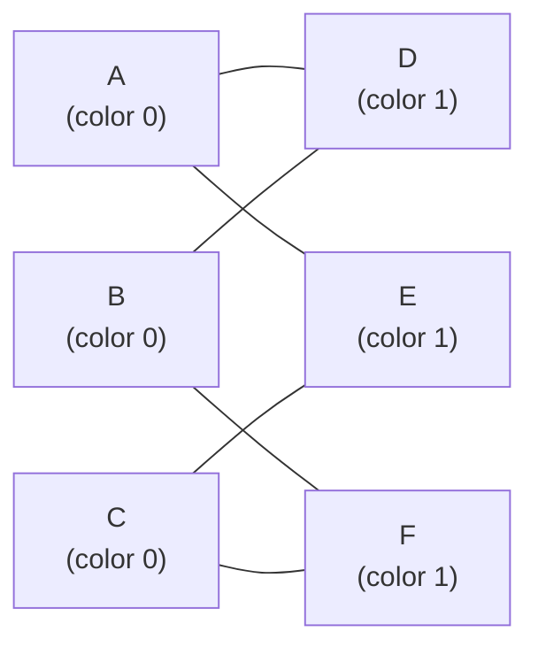
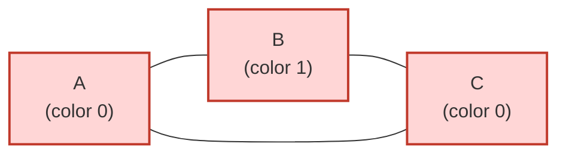
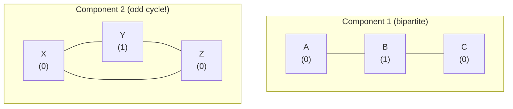

# Bipartite Graphs & 2-Coloring

A **bipartite graph** is one whose vertices can be split into two disjoint sets so that *every* edge
crosses between the sets — never inside one. Deciding bipartiteness is equivalent to **2-coloring**
the graph, and it is one of the most useful structural tests in all of graph theory: it underpins
team assignment, scheduling, conflict resolution, and the entire theory of **bipartite matching**.

This guide develops the theory (including the classic *odd-cycle theorem*), then gives four
practical algorithms — **BFS coloring**, **DFS coloring**, the **DSU-with-parity** trick, and how to
correctly handle **disconnected** graphs — each with pseudocode and mirrored **Python + C++**.

## Table of Contents
1. [What is a Bipartite Graph?](#1-what-is-a-bipartite-graph)
2. [The Odd-Cycle Theorem](#2-the-odd-cycle-theorem)
3. [Method 1 — BFS 2-Coloring](#3-method-1--bfs-2-coloring)
4. [Method 2 — DFS 2-Coloring](#4-method-2--dfs-2-coloring)
5. [Handling Disconnected Graphs](#5-handling-disconnected-graphs)
6. [Method 3 — DSU with Parity](#6-method-3--dsu-with-parity)
7. [Applications](#7-applications)
8. [Complexity](#8-complexity)
9. [Common Pitfalls](#9-common-pitfalls)
10. [Patterns](#10-patterns)

---

## 1. What is a Bipartite Graph?

A graph $G = (V, E)$ is **bipartite** if its vertex set can be partitioned into two sets
$U$ and $W$ with $U \cap W = \varnothing$ and $U \cup W = V$, such that every edge has **one
endpoint in $U$ and the other in $W$**:

$$\forall (u, v) \in E : \big(u \in U \land v \in W\big) \;\lor\; \big(u \in W \land v \in U\big).$$

Equivalently, we can **2-color** the vertices (say colors $0$ and $1$) so that no edge connects two
vertices of the same color. The two formulations are identical: color $0$ *is* the set $U$, color
$1$ *is* the set $W$.



*Above: a valid 2-coloring. The left column $\{A,B,C\}$ is color 0, the right column $\{D,E,F\}$ is
color 1, and **every** edge crosses between the columns.*

---

## 2. The Odd-Cycle Theorem

> **Theorem.** A graph is bipartite **if and only if** it contains **no cycle of odd length**.

This is the cornerstone result; both coloring algorithms below are really just constructive proofs
of it.

### Proof sketch

**($\Rightarrow$) Bipartite $\implies$ no odd cycle.**
Suppose $G$ is bipartite with a valid 2-coloring $c : V \to \{0,1\}$. Walk along any cycle
$v_0, v_1, \dots, v_{k-1}, v_0$. Each edge flips the color, so

$$c(v_i) = c(v_0) \oplus (i \bmod 2).$$

Returning to the start requires $c(v_k) = c(v_0)$ where $v_k = v_0$, i.e.
$c(v_0) \oplus (k \bmod 2) = c(v_0)$, which forces $k \bmod 2 = 0$. Hence **every cycle has even
length** — no odd cycle can exist.

**($\Leftarrow$) No odd cycle $\implies$ bipartite.**
Run a BFS from any vertex $r$ and color each vertex by the **parity of its distance**:
$c(v) = \operatorname{dist}(r, v) \bmod 2$. Consider any edge $(u, v)$. In a BFS tree the distances
of adjacent vertices differ by at most one, so $|\operatorname{dist}(u) - \operatorname{dist}(v)| \le 1$.
If $c(u) = c(v)$ the two distances have the **same parity**, making them *equal*; then the two
tree paths from $r$ plus the edge $(u,v)$ form a closed walk of **odd** length, which contains an
odd cycle — a contradiction. So every edge joins different colors and $G$ is bipartite. $\blacksquare$



*Above: an **odd cycle** $A \to B \to C \to A$ (length 3). Coloring forces $A=0, B=1, C=0$, but the
edge $C\text{–}A$ then joins two color-0 vertices — a conflict. **Not bipartite.***

---

## 3. Method 1 — BFS 2-Coloring

Start each component, assign the source color `0`, then push the *opposite* color to every neighbor.
A neighbor already colored with the **same** color as the current vertex proves an odd cycle.

### Pseudocode
```
color[1..n] = -1                 # -1 means "uncolored"
for s in 1..n:
    if color[s] != -1: continue  # already handled by another component
    color[s] = 0
    queue = [s]
    while queue not empty:
        u = queue.pop_front()
        for v in adj[u]:
            if color[v] == -1:
                color[v] = color[u] XOR 1   # opposite color
                queue.push_back(v)
            else if color[v] == color[u]:
                return NOT_BIPARTITE
return BIPARTITE
```

```python
from collections import deque

def is_bipartite_bfs(n, adj):
    color = [-1] * (n + 1)              # -1 = uncolored; colors are 0/1
    for s in range(1, n + 1):
        if color[s] != -1:             # skip vertices already colored
            continue
        color[s] = 0                   # seed this component with color 0
        q = deque([s])
        while q:
            u = q.popleft()
            for v in adj[u]:
                if color[v] == -1:     # unseen neighbor: paint it opposite
                    color[v] = color[u] ^ 1
                    q.append(v)
                elif color[v] == color[u]:
                    return False, None # same color across an edge -> odd cycle
    return True, color                 # valid 2-coloring found
```

```cpp
#include <vector>
#include <queue>
using namespace std;

// returns true if bipartite; fills `color` with a valid 2-coloring (0/1)
bool isBipartiteBFS(int n, const vector<vector<int>>& adj, vector<int>& color) {
    color.assign(n + 1, -1);           // -1 = uncolored; colors are 0/1
    for (int s = 1; s <= n; ++s) {
        if (color[s] != -1) continue;  // skip vertices already colored
        color[s] = 0;                  // seed this component with color 0
        queue<int> q;
        q.push(s);
        while (!q.empty()) {
            int u = q.front(); q.pop();
            for (int v : adj[u]) {
                if (color[v] == -1) {  // unseen neighbor: paint it opposite
                    color[v] = color[u] ^ 1;
                    q.push(v);
                } else if (color[v] == color[u]) {
                    return false;      // same color across an edge -> odd cycle
                }
            }
        }
    }
    return true;                       // valid 2-coloring found
}
```

BFS is the preferred choice for **large** inputs because it uses an explicit queue and never risks a
recursion-depth overflow.

---

## 4. Method 2 — DFS 2-Coloring

Identical idea, recursive control flow: color a vertex, then recurse into neighbors with the
opposite color, bailing out on a same-color clash.

### Pseudocode
```
color[1..n] = -1
function dfs(u, c):
    color[u] = c
    for v in adj[u]:
        if color[v] == -1:
            if not dfs(v, c XOR 1): return false
        else if color[v] == c:
            return false
    return true

for s in 1..n:
    if color[s] == -1 and not dfs(s, 0):
        return NOT_BIPARTITE
return BIPARTITE
```

```python
import sys

def is_bipartite_dfs(n, adj):
    sys.setrecursionlimit(300000)      # raise limit; DFS depth can reach n
    color = [-1] * (n + 1)

    def dfs(u, c):
        color[u] = c                   # paint current vertex
        for v in adj[u]:
            if color[v] == -1:         # recurse with the opposite color
                if not dfs(v, c ^ 1):
                    return False
            elif color[v] == c:        # neighbor shares our color -> conflict
                return False
        return True

    for s in range(1, n + 1):
        if color[s] == -1 and not dfs(s, 0):
            return False, None
    return True, color
```

```cpp
#include <vector>
using namespace std;

vector<int> color;                     // -1 = uncolored; colors are 0/1

bool dfs(int u, int c, const vector<vector<int>>& adj) {
    color[u] = c;                      // paint current vertex
    for (int v : adj[u]) {
        if (color[v] == -1) {          // recurse with the opposite color
            if (!dfs(v, c ^ 1, adj)) return false;
        } else if (color[v] == c) {    // neighbor shares our color -> conflict
            return false;
        }
    }
    return true;
}

bool isBipartiteDFS(int n, const vector<vector<int>>& adj) {
    color.assign(n + 1, -1);
    for (int s = 1; s <= n; ++s)       // cover every component
        if (color[s] == -1 && !dfs(s, 0, adj))
            return false;
    return true;
}
```

---

## 5. Handling Disconnected Graphs

A graph may have several components, and each is colored **independently** — the choice of which
side is "0" in one component has no bearing on another. The bug to avoid is starting BFS/DFS from a
single source and concluding "bipartite" without ever visiting the other components.

The fix is the outer `for s in 1..n` loop in every method above: it re-seeds the search from every
**still-uncolored** vertex, guaranteeing every component is checked.



*The whole graph is **not** bipartite: it suffices for **one** component to contain an odd cycle.*

---

## 6. Method 3 — DSU with Parity

A **Disjoint Set Union** augmented with a *parity bit* per node (its color relative to its set
representative) can answer bipartiteness incrementally — ideal when edges arrive **online** or you
also need union-find connectivity. Each node stores `rank[v]` = parity of the path from `v` to its
root; an edge $(u, v)$ demands `rank[u] != rank[v]` once both share a root.

### Pseudocode
```
find(u): returns (root, parity-from-u-to-root) with path compression
for each edge (u, v):
    (ru, pu) = find(u)
    (rv, pv) = find(v)
    if ru == rv:
        if pu == pv: return NOT_BIPARTITE   # both same parity -> odd cycle
    else:
        union ru under rv, setting relative parity so that pu != pv
return BIPARTITE
```

```python
def is_bipartite_dsu(n, edges):
    parent = list(range(n + 1))
    rank = [0] * (n + 1)               # parity from node to its parent

    def find(u):
        par = 0                        # accumulated parity to the root
        root = u
        while parent[root] != root:
            par ^= rank[root]
            root = parent[root]
        # path compression, fixing parities to point straight at root
        while parent[u] != root:
            nxt = parent[u]
            cur_par = par
            par ^= rank[u]             # parity of remaining tail
            parent[u] = root
            rank[u] = cur_par ^ (par ^ rank[u])  # parity u->root
            u = nxt
        rank[u] = 0
        return root, par

    for u, v in edges:
        ru, pu = find(u)
        rv, pv = find(v)
        if ru == rv:
            if pu == pv:               # same parity inside a set -> odd cycle
                return False
        else:
            parent[ru] = rv            # link, encode that u,v must differ
            rank[ru] = pu ^ pv ^ 1
    return True
```

```cpp
#include <vector>
#include <numeric>
using namespace std;

struct ParityDSU {
    vector<int> parent, rnk;           // rnk[v] = parity of v to its parent
    ParityDSU(int n) : parent(n + 1), rnk(n + 1, 0) {
        iota(parent.begin(), parent.end(), 0);
    }
    // returns {root, parity-from-u-to-root}
    pair<int,int> find(int u) {
        if (parent[u] == u) return {u, 0};
        auto [root, p] = find(parent[u]); // p = parity(parent[u] -> root)
        int par = rnk[u] ^ p;             // parity(u -> root)
        parent[u] = root;                 // path compression
        rnk[u] = par;                     // store collapsed parity
        return {root, par};
    }
    bool addEdge(int u, int v) {        // false if this edge creates an odd cycle
        auto [ru, pu] = find(u);
        auto [rv, pv] = find(v);
        if (ru == rv) return pu != pv;  // must have differing parity
        parent[ru] = rv;
        rnk[ru] = pu ^ pv ^ 1;          // force u,v to differ
        return true;
    }
};

bool isBipartiteDSU(int n, const vector<pair<int,int>>& edges) {
    ParityDSU dsu(n);
    for (auto [u, v] : edges)
        if (!dsu.addEdge(u, v)) return false;
    return true;
}
```

> The BFS/DFS methods are simpler and usually preferred for a one-shot static check. Reach for
> parity-DSU when edges stream in or you need union-find anyway.

---

## 7. Applications

| Application | How bipartiteness helps |
|-------------|-------------------------|
| **Team / group assignment** | Two-color people so that no two who *dislike* each other share a team (CSES *Building Teams*). |
| **Bipartite matching** | Matching (jobs↔workers, students↔projects) is only defined on bipartite graphs; König's theorem links max matching to min vertex cover. |
| **Scheduling / conflict graphs** | An edge = "cannot coexist"; 2-colorability means the conflicts can be resolved with two time slots / two rooms. |
| **2-SAT structure & checks** | Parity/2-color reasoning appears in constraint feasibility checks. |
| **Sanity / preprocessing** | Many flow and matching algorithms first *require* the input to be bipartite — this is the gate. |

---

## 8. Complexity

| Method | Time | Space | Notes |
|--------|------|-------|-------|
| BFS coloring | $O(V + E)$ | $O(V)$ | Iterative; safe for huge graphs. |
| DFS coloring | $O(V + E)$ | $O(V)$ recursion | Raise recursion limit / use explicit stack. |
| DSU with parity | $O(E\,\alpha(V))$ | $O(V)$ | $\alpha$ = inverse Ackermann ≈ constant; good for online edges. |

All three are essentially **linear** in the size of the graph.

---

## 9. Common Pitfalls

- **Forgetting disconnected components.** Always loop over *all* vertices and (re)start the search
  from each uncolored one. A single BFS/DFS source only sees its own component.
- **Self-loops.** An edge $(v, v)$ makes the graph **non-bipartite** immediately ($v$ would need two
  different colors). Guard against it explicitly — naive coloring may silently ignore it.
- **Parallel edges** are harmless for coloring (same parity constraint repeated) but can break a
  *naive* parity-DSU if you assume simple graphs; the constraint check still holds.
- **Recursion depth** in DFS on a long chain ($n \sim 10^5$) overflows the default stack — prefer
  BFS or raise the limit.
- **Treating "no conflict found in one component" as the global answer.** Bipartiteness is an
  **all-components** property; one odd cycle anywhere kills it.
- **Directed graphs:** bipartiteness ignores direction — build the adjacency as **undirected** (add
  both `u→v` and `v→u`).

---

## 10. Patterns

- **"Split into two groups with no internal edge"** → 2-coloring / bipartite check.
- **"Detect an odd cycle"** → run the coloring; a same-color edge *is* an odd cycle witness.
- **"Two of something (slots, rooms, teams, sides)"** + pairwise conflicts → bipartite model.
- **Need a matching?** First confirm bipartite, then run Hopcroft–Karp / Kuhn.
- **Online edge insertions with a feasibility question** → DSU-with-parity.
- **Output the assignment, not just yes/no** → keep the `color[]` array from BFS/DFS and print it.
```
