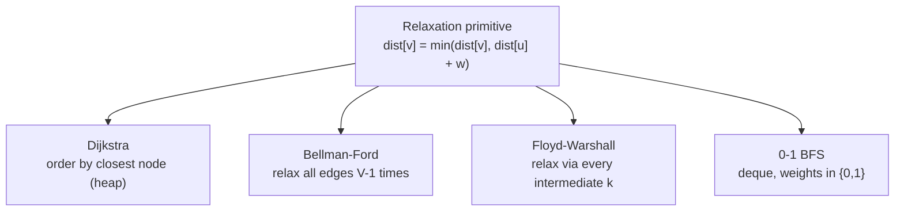
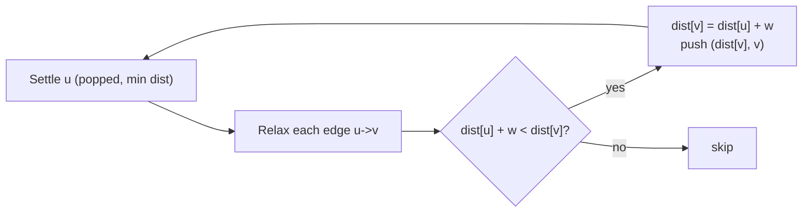
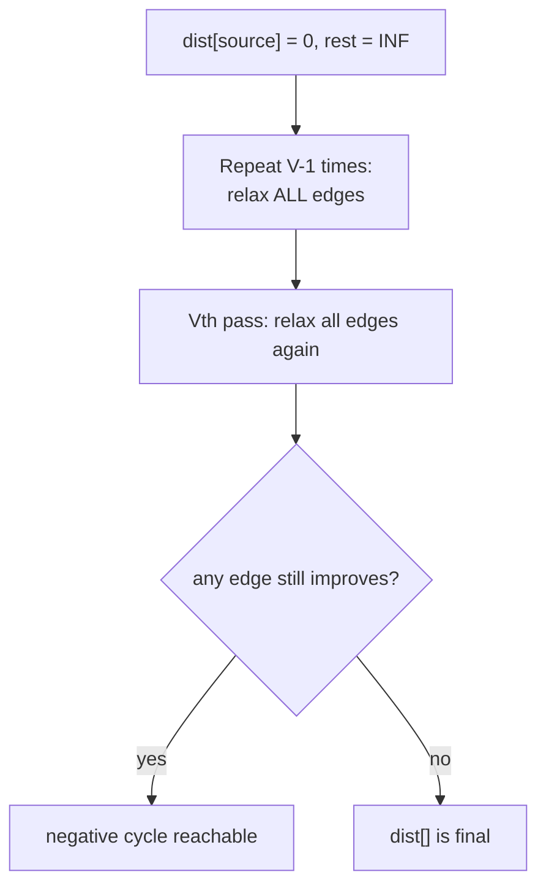
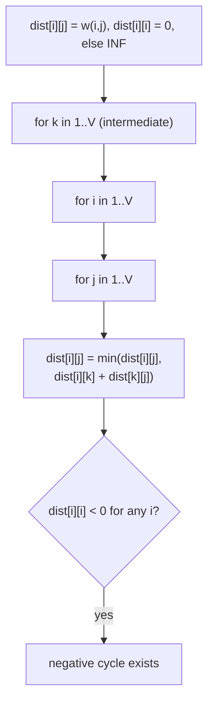
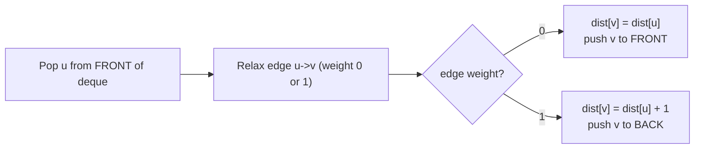
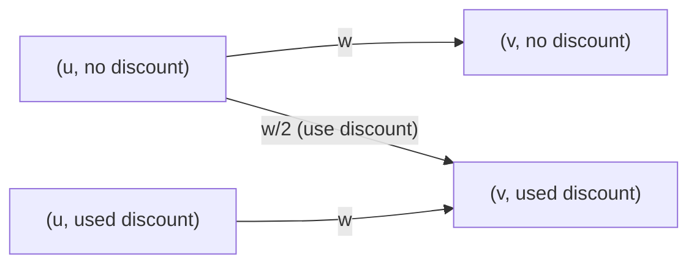

# Shortest Paths — Dijkstra, Bellman-Ford, Floyd-Warshall & 0-1 BFS

A unified guide to the four workhorse shortest-path algorithms. We compare **when** to use each,
**why** they work (and fail), and provide **pseudocode + Python + C++** with mirrored comments,
KaTeX math, complexity reasoning, and Mermaid diagrams.

> Prerequisite: comfort with adjacency lists, BFS/DFS, and basic priority queues. This guide builds
> on the foundational [Graphs](../../Graphs/guide/Graphs-Complete-Guide.md) module.

---

## Table of Contents

1. [The Core Idea: Relaxation](#the-core-idea-relaxation)
2. [Decision Table — Which Algorithm When](#decision-table--which-algorithm-when)
3. [Dijkstra (non-negative weights)](#dijkstra-non-negative-weights)
4. [Bellman-Ford (negative edges, cycle detection)](#bellman-ford-negative-edges-cycle-detection)
5. [Floyd-Warshall (all-pairs DP)](#floyd-warshall-all-pairs-dp)
6. [0-1 BFS (deque, weights in {0,1})](#0-1-bfs-deque-weights-in-01)
7. [Complexity Summary](#complexity-summary)
8. [Common Pitfalls](#common-pitfalls)
9. [Patterns: State / Layered Dijkstra, k-th Shortest](#patterns-state--layered-dijkstra-k-th-shortest)

---

## The Core Idea: Relaxation

Every shortest-path algorithm is built on one primitive — **edge relaxation**. If we know a tentative
distance `dist[u]` to `u` and there is an edge `u → v` with weight `w(u, v)`, we ask: *can we reach
`v` more cheaply by going through `u`?*

$$dist[v] = \min\bigl(dist[v],\; dist[u] + w(u, v)\bigr)$$

The algorithms differ only in **the order** in which they relax edges and **how many times**:

- **Dijkstra** relaxes edges out of the closest unsettled node (greedy, needs non-negative weights).
- **Bellman-Ford** relaxes *all* edges $V-1$ times (no ordering assumptions, allows negatives).
- **Floyd-Warshall** relaxes via every possible intermediate node $k$ (all-pairs DP).
- **0-1 BFS** is Dijkstra specialized to weights $\in \{0, 1\}$ using a deque instead of a heap.



---

## Decision Table — Which Algorithm When

| Situation | Best choice | Why |
|-----------|-------------|-----|
| Single source, **non-negative** weights | **Dijkstra** (binary heap) | $O(E \log V)$, greedy is correct |
| Single source, weights in $\{0, 1\}$ | **0-1 BFS** | $O(V + E)$, no heap overhead |
| Single source, **negative** edges possible | **Bellman-Ford** | handles negatives, detects negative cycles |
| Need **all-pairs** distances, small $V$ ($\le 500$) | **Floyd-Warshall** | $O(V^3)$ DP, trivially simple |
| All-pairs, large $V$, non-negative | **Dijkstra from each source** | $O(V \cdot E \log V)$ beats $V^3$ when sparse |
| Detect a **negative cycle** | Bellman-Ford (extra pass) or Floyd-Warshall (`dist[i][i] < 0`) | both expose it directly |
| Unweighted graph | **plain BFS** | every edge weight 1, $O(V + E)$ |

---

## Dijkstra (non-negative weights)

### Idea

Maintain a set of **settled** nodes whose final shortest distance is known. Repeatedly pick the
**unsettled node with the smallest tentative distance**, settle it, and relax its outgoing edges.
A min-heap (priority queue) finds the closest node in $O(\log V)$.

**Why non-negativity matters.** When we pop a node `u` with the minimum tentative distance, we claim
that distance is final. This relies on the fact that any *other* path to `u` must pass through some
not-yet-settled node `x` with `dist[x] >= dist[u]`, and since all remaining edges are
$\ge 0$, that detour can only be **longer**. A **negative edge** breaks this monotonicity: a later,
cheaper path could appear after `u` is already settled — so the greedy choice becomes wrong.



### Lazy deletion

A binary heap has no efficient *decrease-key*. Instead we **push a new (distance, node) pair** each
time we improve `v` and leave the stale entry in the heap. When we pop a pair whose stored distance
is **greater than** the current best `dist[v]`, we know it is outdated and **skip** it. This "lazy
deletion" keeps the code simple; the heap holds up to $O(E)$ entries, giving $O(E \log V)$.

### Pseudocode

```
function dijkstra(source):
    dist[*] = +INF
    dist[source] = 0
    push (0, source) into min-heap PQ
    while PQ not empty:
        (d, u) = pop-min(PQ)
        if d > dist[u]: continue          # lazy deletion: stale entry
        for each edge (u, v, w):
            if dist[u] + w < dist[v]:
                dist[v] = dist[u] + w
                push (dist[v], v) into PQ
    return dist
```

### Python

```python
import heapq

INF = float('inf')

def dijkstra(n, adj, source):
    # adj[u] = list of (v, w) with w >= 0; nodes are 1..n
    dist = [INF] * (n + 1)
    dist[source] = 0
    pq = [(0, source)]                      # (distance, node) min-heap

    while pq:
        d, u = heapq.heappop(pq)
        if d > dist[u]:                     # lazy deletion: stale entry, skip
            continue
        for v, w in adj[u]:                 # relax every outgoing edge
            nd = d + w
            if nd < dist[v]:                # found a shorter path to v
                dist[v] = nd
                heapq.heappush(pq, (nd, v)) # push improved (no decrease-key)
    return dist
```

### C++

```cpp
#include <bits/stdc++.h>
using namespace std;

const long long INF = 1e18;

// adj[u] = list of {v, w} with w >= 0; nodes are 1..n
vector<long long> dijkstra(int n, vector<vector<pair<int,long long>>>& adj, int source) {
    vector<long long> dist(n + 1, INF);
    dist[source] = 0;

    // min-heap of (distance, node); greater<> turns max-heap into min-heap
    priority_queue<pair<long long,int>, vector<pair<long long,int>>,
                   greater<pair<long long,int>>> pq;
    pq.push({0, source});

    while (!pq.empty()) {
        auto [d, u] = pq.top(); pq.pop();
        if (d > dist[u]) continue;          // lazy deletion: stale entry, skip
        for (auto [v, w] : adj[u]) {        // relax every outgoing edge
            long long nd = d + w;
            if (nd < dist[v]) {             // found a shorter path to v
                dist[v] = nd;
                pq.push({nd, v});           // push improved (no decrease-key)
            }
        }
    }
    return dist;
}
```

**Complexity.** Each edge causes at most one push, so the heap holds $O(E)$ entries; each push/pop is
$O(\log E) = O(\log V)$ (since $E \le V^2$). Total: $O(E \log V)$ time, $O(V + E)$ space.

---

## Bellman-Ford (negative edges, cycle detection)

### Idea

When edges can be **negative**, the greedy ordering of Dijkstra fails. Bellman-Ford gives up on
ordering entirely: it relaxes **every edge**, repeated $V - 1$ times. After $i$ rounds, every shortest
path using at most $i$ edges is correct. Since a simple shortest path uses at most $V - 1$ edges,
$V - 1$ rounds suffice.

**Negative-cycle detection.** Run **one more** ($V$-th) round. If *any* edge still relaxes, then a
shortest path of length $\ge V$ edges keeps improving — only possible if a **negative cycle** is
reachable. Nodes relaxed in this extra pass are "affected" by such a cycle.



### Pseudocode

```
function bellman_ford(source):
    dist[*] = +INF; dist[source] = 0
    repeat V-1 times:
        for each edge (u, v, w):
            if dist[u] != INF and dist[u] + w < dist[v]:
                dist[v] = dist[u] + w
    # detection pass
    for each edge (u, v, w):
        if dist[u] != INF and dist[u] + w < dist[v]:
            report "negative cycle reachable"
    return dist
```

### Python

```python
INF = float('inf')

def bellman_ford(n, edges, source):
    # edges = list of (u, v, w); w may be negative; nodes 1..n
    dist = [INF] * (n + 1)
    dist[source] = 0

    for _ in range(n - 1):                  # V-1 relaxation rounds
        for u, v, w in edges:
            if dist[u] != INF and dist[u] + w < dist[v]:
                dist[v] = dist[u] + w       # relax edge u -> v

    has_negative_cycle = False
    for u, v, w in edges:                   # Vth pass detects a negative cycle
        if dist[u] != INF and dist[u] + w < dist[v]:
            has_negative_cycle = True
            break

    return dist, has_negative_cycle
```

### C++

```cpp
#include <bits/stdc++.h>
using namespace std;

const long long INF = 1e18;

struct Edge { int u, v; long long w; };

// edges may have negative w; nodes 1..n
pair<vector<long long>, bool> bellman_ford(int n, vector<Edge>& edges, int source) {
    vector<long long> dist(n + 1, INF);
    dist[source] = 0;

    for (int i = 0; i < n - 1; ++i) {       // V-1 relaxation rounds
        for (auto& e : edges) {
            if (dist[e.u] != INF && dist[e.u] + e.w < dist[e.v])
                dist[e.v] = dist[e.u] + e.w; // relax edge u -> v
        }
    }

    bool hasNegativeCycle = false;
    for (auto& e : edges) {                 // Vth pass detects a negative cycle
        if (dist[e.u] != INF && dist[e.u] + e.w < dist[e.v]) {
            hasNegativeCycle = true;
            break;
        }
    }
    return {dist, hasNegativeCycle};
}
```

**Complexity.** $V - 1$ rounds, each relaxing all $E$ edges: $O(VE)$ time, $O(V)$ space. Slower than
Dijkstra, but the only simple option for negative weights.

---

## Floyd-Warshall (all-pairs DP)

### Idea

Floyd-Warshall computes shortest distances between **all pairs** $(i, j)$. The DP variable is:

> $dist_k[i][j]$ = shortest path from $i$ to $j$ using only intermediate vertices from $\{1, \dots, k\}$.

For each new allowed intermediate $k$, a path either ignores $k$ (keeps $dist_{k-1}[i][j]$) or routes
through $k$ once ($dist_{k-1}[i][k] + dist_{k-1}[k][j]$):

$$dist_k[i][j] = \min\bigl(dist_{k-1}[i][j],\; dist_{k-1}[i][k] + dist_{k-1}[k][j]\bigr)$$

We can drop the $k$ dimension and update in place, **as long as `k` is the outermost loop**.



**Negative-cycle check.** After the triple loop, if any `dist[i][i] < 0`, vertex `i` lies on a
negative cycle (you can leave `i` and return having reduced the distance below 0).

### Pseudocode

```
function floyd_warshall():
    dist[i][j] = w(i,j); dist[i][i] = 0; else +INF
    for k in 1..V:                 # k MUST be the outermost loop
        for i in 1..V:
            for j in 1..V:
                if dist[i][k] + dist[k][j] < dist[i][j]:
                    dist[i][j] = dist[i][k] + dist[k][j]
    for i in 1..V:
        if dist[i][i] < 0: report "negative cycle through i"
```

### Python

```python
INF = float('inf')

def floyd_warshall(n, edges):
    # edges = list of (u, v, w); nodes 1..n; returns n+1 x n+1 dist matrix
    dist = [[INF] * (n + 1) for _ in range(n + 1)]
    for i in range(1, n + 1):
        dist[i][i] = 0                          # zero self-distance
    for u, v, w in edges:
        dist[u][v] = min(dist[u][v], w)         # keep the cheapest parallel edge

    for k in range(1, n + 1):                   # k = intermediate vertex (OUTERMOST)
        for i in range(1, n + 1):
            if dist[i][k] == INF:               # micro-optimization: skip dead rows
                continue
            for j in range(1, n + 1):
                if dist[i][k] + dist[k][j] < dist[i][j]:
                    dist[i][j] = dist[i][k] + dist[k][j]

    return dist                                 # check dist[i][i] < 0 for neg cycle
```

### C++

```cpp
#include <bits/stdc++.h>
using namespace std;

const long long INF = 1e18;

// edges = list of {u, v, w}; nodes 1..n
vector<vector<long long>> floyd_warshall(int n, vector<array<long long,3>>& edges) {
    vector<vector<long long>> dist(n + 1, vector<long long>(n + 1, INF));
    for (int i = 1; i <= n; ++i) dist[i][i] = 0;          // zero self-distance
    for (auto& e : edges) {
        int u = (int)e[0], v = (int)e[1];
        dist[u][v] = min(dist[u][v], e[2]);               // cheapest parallel edge
    }

    for (int k = 1; k <= n; ++k)                          // intermediate (OUTERMOST)
        for (int i = 1; i <= n; ++i) {
            if (dist[i][k] == INF) continue;              // skip dead rows
            for (int j = 1; j <= n; ++j)
                if (dist[i][k] + dist[k][j] < dist[i][j]) // guard against INF + INF
                    dist[i][j] = dist[i][k] + dist[k][j];
        }

    return dist;                                          // dist[i][i] < 0 => neg cycle
}
```

**Complexity.** Three nested loops over $V$: $O(V^3)$ time, $O(V^2)$ space. Practical for $V \le 500$.
Beware `INF + INF` overflow — guard with the `dist[i][k] == INF` check or use `long long` with a safe
`INF = 1e18` (two of them sum to $2 \times 10^{18}$, still inside `long long`'s $\approx 9.2 \times 10^{18}$).

---

## 0-1 BFS (deque, weights in {0,1})

### Idea

When every edge weighs **0 or 1**, a full heap is overkill. Use a **double-ended queue**. Process
nodes in non-decreasing distance order by maintaining the invariant that the deque holds at most two
distinct distance values, $d$ and $d + 1$:

- relaxing a **0-edge** keeps the distance → **push to the front** (process at the same level),
- relaxing a **1-edge** increments the distance → **push to the back** (process one level later).

This mimics Dijkstra's ordering without the $\log$ factor, giving $O(V + E)$.



### Pseudocode

```
function zero_one_bfs(source):
    dist[*] = +INF; dist[source] = 0
    deque D = [source]
    while D not empty:
        u = pop-front(D)
        for each edge (u, v, w):     # w in {0, 1}
            if dist[u] + w < dist[v]:
                dist[v] = dist[u] + w
                if w == 0: push-front(D, v)
                else:      push-back(D, v)
    return dist
```

### Python

```python
from collections import deque

INF = float('inf')

def zero_one_bfs(n, adj, source):
    # adj[u] = list of (v, w) with w in {0, 1}; nodes 1..n
    dist = [INF] * (n + 1)
    dist[source] = 0
    dq = deque([source])

    while dq:
        u = dq.popleft()                    # always pop from the front
        for v, w in adj[u]:                 # w is 0 or 1
            if dist[u] + w < dist[v]:
                dist[v] = dist[u] + w
                if w == 0:
                    dq.appendleft(v)        # 0-edge: same level -> front
                else:
                    dq.append(v)            # 1-edge: next level -> back
    return dist
```

### C++

```cpp
#include <bits/stdc++.h>
using namespace std;

const long long INF = 1e18;

// adj[u] = list of {v, w} with w in {0, 1}; nodes 1..n
vector<long long> zeroOneBfs(int n, vector<vector<pair<int,int>>>& adj, int source) {
    vector<long long> dist(n + 1, INF);
    dist[source] = 0;
    deque<int> dq;
    dq.push_back(source);

    while (!dq.empty()) {
        int u = dq.front(); dq.pop_front();     // always pop from the front
        for (auto [v, w] : adj[u]) {            // w is 0 or 1
            if (dist[u] + w < dist[v]) {
                dist[v] = dist[u] + w;
                if (w == 0) dq.push_front(v);   // 0-edge: same level -> front
                else        dq.push_back(v);    // 1-edge: next level -> back
            }
        }
    }
    return dist;
}
```

**Complexity.** Each node may be inserted a few times but processed with its final distance once;
total work is $O(V + E)$, $O(V)$ space.

---

## Complexity Summary

| Algorithm | Scope | Negative edges? | Time | Space |
|-----------|-------|-----------------|------|-------|
| **0-1 BFS** | single source, $w \in \{0,1\}$ | no | $O(V + E)$ | $O(V)$ |
| **Dijkstra** (binary heap) | single source | no | $O(E \log V)$ | $O(V + E)$ |
| **Bellman-Ford** | single source | yes (+ detects neg cycle) | $O(VE)$ | $O(V)$ |
| **Floyd-Warshall** | all pairs | yes (+ detects neg cycle) | $O(V^3)$ | $O(V^2)$ |

Rule of thumb: pick the **leftmost** row whose assumptions your problem satisfies.

---

## Common Pitfalls

- **Negative edges with Dijkstra.** Dijkstra is *wrong* (not just slow) with negative weights — a
  settled node may later get a cheaper path. Switch to Bellman-Ford or SPFA. A single negative edge
  is enough to break it.
- **Integer overflow.** Adding `dist[u] + w` when `dist[u] == INF` can overflow. In C++ use
  `long long` with `const long long INF = 1e18` and **guard** relaxations with `dist[u] != INF`.
  In Floyd-Warshall, `INF + INF` must stay below `LLONG_MAX` — `1e18 + 1e18 = 2e18 < 9.2e18`, so it
  is safe, but always skip rows where `dist[i][k] == INF`.
- **Revisiting / stale heap entries.** In Dijkstra, forgetting the `if d > dist[u]: continue` check
  reprocesses stale entries, degrading performance (still correct, but slower).
- **Wrong loop order in Floyd-Warshall.** `k` **must** be the outermost loop. Putting `i` or `j`
  outside produces incorrect distances.
- **Unsettled INF as a valid distance.** Never relax *from* an unreachable node; check
  `dist[u] != INF` first in Bellman-Ford / Floyd-Warshall.
- **Directed vs. undirected.** For undirected graphs, add both `(u, v, w)` and `(v, u, w)`.

---

## Patterns: State / Layered Dijkstra, k-th Shortest

### State / Layered Dijkstra

When the answer depends on more than position — e.g. *"you may use one discount"*, *"at most k
refuels"*, *"parity of edges used"* — expand each node into **(node, state)** pairs and run Dijkstra
on this larger graph. The state encodes the extra dimension; transitions move between layers.

A classic example: **one edge may be halved** (CSES *Flight Discount*). Model two layers:

- layer 0 = discount **not yet used**,
- layer 1 = discount **already used**.

Within a layer, normal edges; a discounted transition moves layer $0 \to 1$ at half cost. The answer
is `dist[(sink, layer 1)]` (and also `dist[(sink, layer 0)]` if not using it could be better).



### k-th Shortest Path

To find the **k-th shortest** path (allowing repeated nodes), run a Dijkstra-like search but allow a
node to be **popped up to k times**, keeping a per-node visit counter. The k-th time you pop the sink
gives the k-th shortest distance. Heap size stays manageable because you stop pushing once a node has
been finalized k times.

---

## Takeaway

All four algorithms are variations on the single relaxation rule
$dist[v] = \min(dist[v], dist[u] + w)$. Choose by **edge weights** (Dijkstra/0-1 BFS for
non-negative, Bellman-Ford for negative) and **scope** (single-source vs. all-pairs Floyd-Warshall).
When the problem adds a twist, **expand the state space** and reuse Dijkstra.
