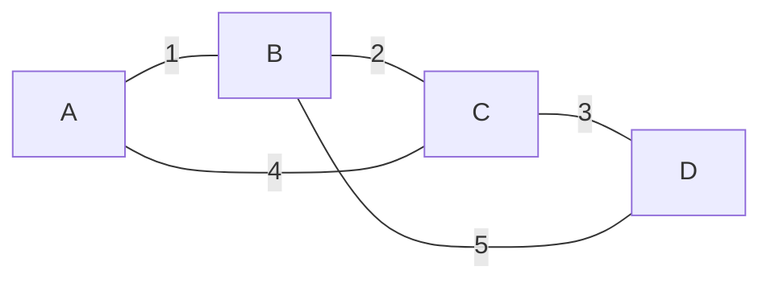
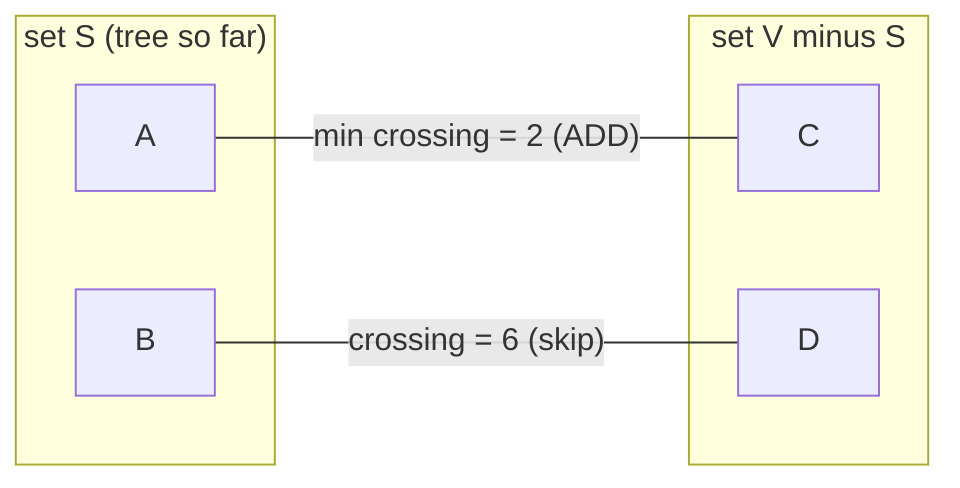
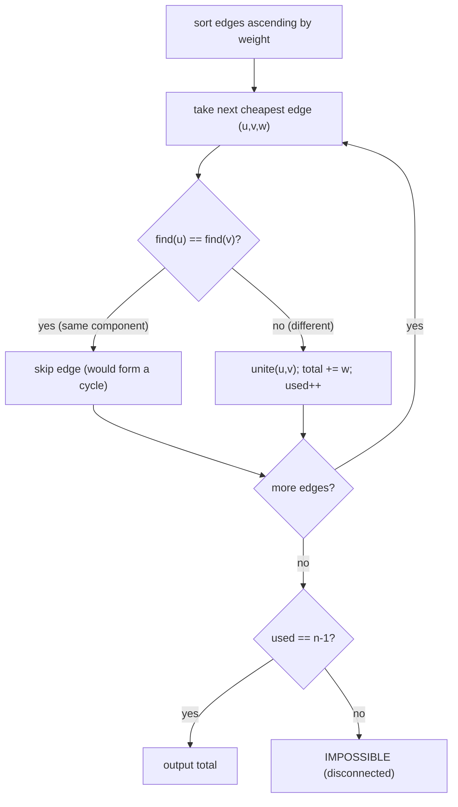
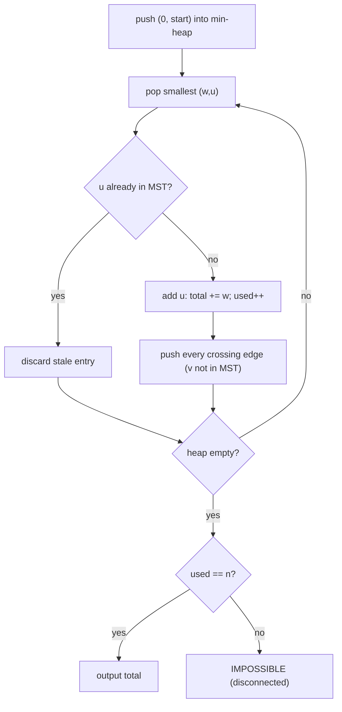

# Minimum Spanning Trees — Kruskal (DSU) and Prim (Heap)

A **Minimum Spanning Tree (MST)** is one of the most elegant results in graph theory: from a
connected, weighted, undirected graph you extract a subset of edges that connects *every* vertex
using the *smallest possible total weight*, and you do it with a simple greedy strategy that
provably gives the optimum. This guide develops the theory (cut property, cycle property), then
presents both classical algorithms — **Kruskal** (sort edges + Disjoint Set Union) and **Prim**
(grow a tree with a min-heap) — with pseudocode, Python, and C++ for each.

---

## Table of Contents
1. [What Is a Spanning Tree / MST?](#what-is-a-spanning-tree--mst)
2. [The Cut Property and the Cycle Property](#the-cut-property-and-the-cycle-property)
3. [Kruskal's Algorithm](#kruskals-algorithm)
4. [Disjoint Set Union (Union-Find)](#disjoint-set-union-union-find)
5. [Prim's Algorithm](#prims-algorithm)
6. [Kruskal vs Prim — When to Use Which](#kruskal-vs-prim--when-to-use-which)
7. [Borůvka's Algorithm (Brief)](#borůvkas-algorithm-brief)
8. [Uniqueness of the MST](#uniqueness-of-the-mst)
9. [Second-Best MST](#second-best-mst)
10. [Complexity Summary](#complexity-summary)
11. [Common Pitfalls](#common-pitfalls)
12. [Patterns](#patterns)

---

## What Is a Spanning Tree / MST?

Given a connected, undirected graph $G = (V, E)$ with $|V| = n$ vertices and $|E| = m$ edges:

- A **spanning tree** is a subset of $n - 1$ edges that connects all $n$ vertices and contains
  **no cycle**. (Any tree on $n$ vertices has exactly $n - 1$ edges.)
- A **minimum spanning tree (MST)** is a spanning tree whose total edge weight
  $\sum_{e \in T} w(e)$ is as small as possible.

Key facts:

- An MST exists **iff** the graph is connected. If the graph has more than one connected
  component, no single tree can span it → the answer is *impossible*.
- An MST always has exactly $n - 1$ edges. If your greedy run ends with fewer accepted edges, the
  graph was disconnected.
- Edge weights may be negative — MST algorithms still work, because they only ever compare weights.



For the graph above the MST is `{A-B (1), B-C (2), C-D (3)}` with total weight $6$. The edges
`A-C (4)` and `B-D (5)` are skipped because cheaper alternatives already connect those vertices.

---

## The Cut Property and the Cycle Property

Both Kruskal and Prim are correct because of two complementary structural facts. A **cut** is any
partition of the vertices into two non-empty sets $(S, V \setminus S)$. An edge **crosses** the cut
if it has one endpoint in $S$ and the other in $V \setminus S$.

### Cut Property (which edges are safe to *add*)

> **Cut Property.** For any cut $(S, V \setminus S)$, if an edge $e$ is the **unique minimum-weight
> edge crossing the cut**, then $e$ belongs to **every** MST.

$$
\text{If } w(e) < w(e') \text{ for all other crossing edges } e', \text{ then } e \in \text{MST}.
$$

**Proof sketch (exchange argument).** Suppose an MST $T$ does *not* contain the minimum crossing
edge $e = (u, v)$. Adding $e$ to $T$ creates exactly one cycle. That cycle must cross the cut an
even number of times, so it contains some other crossing edge $e'$ with $w(e') \ge w(e)$. Remove
$e'$ and keep $e$: the result is still a spanning tree, and its weight did not increase. Hence a
minimum crossing edge can always be part of an MST — and if it is *strictly* minimum, every MST
must contain it. ∎

This is the justification for *adding* edges: any edge that is the cheapest way to connect two
otherwise-separated groups of vertices is safe.

### Cycle Property (which edges are safe to *discard*)

> **Cycle Property.** For any cycle $C$ in the graph, if an edge $e$ is the **unique
> maximum-weight edge** on that cycle, then $e$ belongs to **no** MST.

**Intuition.** If a spanning tree included the heaviest edge of a cycle, you could delete that edge
and reconnect the two halves through the rest of the cycle using a *cheaper* edge, strictly
lowering the total weight. So the heaviest edge of a cycle is never needed. ∎

This is the justification for *skipping* edges: Kruskal rejects an edge precisely when adding it
would close a cycle, and because edges are processed in increasing weight order, the rejected edge
is the heaviest on that cycle.



---

## Kruskal's Algorithm

**Idea:** consider edges from cheapest to most expensive. Add an edge only if its two endpoints are
currently in **different** components (adding it would not form a cycle). Stop when $n - 1$ edges
have been accepted.

This is the cut property applied globally: at each step the cheapest remaining edge that does not
create a cycle is the minimum edge across the cut separating one of its endpoints' components from
the rest, so it is safe.

### Pseudocode

```
function kruskal(n, edges):
    sort edges ascending by weight
    dsu = DSU(n)
    total = 0
    used  = 0
    for (w, u, v) in edges:
        if dsu.find(u) != dsu.find(v):      # endpoints in different components
            dsu.unite(u, v)                 # merge the two components
            total += w
            used  += 1
            if used == n - 1: break         # spanning tree complete
    if used == n - 1: return total
    else:             return IMPOSSIBLE     # graph was disconnected
```



### Python

```python
class DSU:
    def __init__(self, n):
        self.parent = list(range(n + 1))   # 1-indexed vertices
        self.rank = [0] * (n + 1)          # upper bound on tree height

    def find(self, x):
        # Path compression: flatten the chain toward the root.
        while self.parent[x] != x:
            self.parent[x] = self.parent[self.parent[x]]
            x = self.parent[x]
        return x

    def unite(self, a, b):
        # Union by rank: attach the shorter tree under the taller one.
        ra, rb = self.find(a), self.find(b)
        if ra == rb:
            return False                   # already connected → cycle
        if self.rank[ra] < self.rank[rb]:
            ra, rb = rb, ra
        self.parent[rb] = ra
        if self.rank[ra] == self.rank[rb]:
            self.rank[ra] += 1
        return True


def kruskal(n, edges):
    # edges: list of (w, u, v)
    edges.sort()                           # sort ascending by weight
    dsu = DSU(n)
    total = 0
    used = 0
    for w, u, v in edges:
        if dsu.unite(u, v):                # True only if it merged two components
            total += w
            used += 1
            if used == n - 1:              # spanning tree is complete
                break
    return total if used == n - 1 else None  # None => disconnected
```

### C++

```cpp
#include <bits/stdc++.h>
using namespace std;

struct DSU {
    vector<int> parent, rank_;
    DSU(int n) : parent(n + 1), rank_(n + 1, 0) {   // 1-indexed vertices
        iota(parent.begin(), parent.end(), 0);
    }
    int find(int x) {
        // Path compression: flatten the chain toward the root.
        while (parent[x] != x) {
            parent[x] = parent[parent[x]];
            x = parent[x];
        }
        return x;
    }
    // 'union' is a C++ keyword, so the method is named 'unite'.
    bool unite(int a, int b) {
        int ra = find(a), rb = find(b);
        if (ra == rb) return false;                 // already connected → cycle
        if (rank_[ra] < rank_[rb]) swap(ra, rb);    // union by rank
        parent[rb] = ra;
        if (rank_[ra] == rank_[rb]) rank_[ra]++;
        return true;
    }
};

// Returns MST weight, or -1 if the graph is disconnected.
long long kruskal(int n, vector<array<long long,3>>& edges) {
    // each edge stored as {w, u, v}
    sort(edges.begin(), edges.end());               // sort ascending by weight
    DSU dsu(n);
    long long total = 0;
    int used = 0;
    for (auto& e : edges) {
        long long w = e[0];
        int u = (int)e[1], v = (int)e[2];
        if (dsu.unite(u, v)) {                       // merged two components
            total += w;
            if (++used == n - 1) break;              // spanning tree complete
        }
    }
    return used == n - 1 ? total : -1;               // -1 => disconnected
}
```

**Complexity.** Sorting dominates: $O(E \log E) = O(E \log V)$ (since $E \le V^2$, $\log E =
O(\log V)$). The DSU operations cost effectively $O(\alpha(n))$ each (see below), so the union/find
loop is $O(E\,\alpha(n))$.

---

## Disjoint Set Union (Union-Find)

The DSU is the engine that makes Kruskal fast. It maintains a partition of the vertices into
disjoint sets and supports two operations:

- `find(x)` — return a canonical representative (root) of `x`'s set.
- `unite(a, b)` — merge the sets containing `a` and `b`.

Two optimizations make these almost free:

1. **Path compression** — during `find`, point traversed nodes directly at (or closer to) the
   root, flattening the tree.
2. **Union by rank/size** — always attach the smaller/shorter tree beneath the larger/taller one,
   keeping trees shallow.

With both, any sequence of $m$ operations on $n$ elements runs in $O(m\,\alpha(n))$, where
$\alpha$ is the inverse Ackermann function:

$$
\alpha(n) \le 4 \text{ for every } n \text{ that fits in the observable universe.}
$$

So each operation is **near-constant time**, written $O(\alpha(n))$.

---

## Prim's Algorithm

**Idea:** grow a single tree starting from an arbitrary seed vertex. Repeatedly add the cheapest
edge that connects a vertex *inside* the tree to a vertex *outside* it. A **min-heap** keyed on
crossing-edge weight delivers that cheapest edge efficiently.

This is the cut property applied incrementally: the cut is always (tree so far, everything else),
and the cheapest crossing edge is safe to add.

### Pseudocode

```
function prim(n, adj, start):
    in_mst = array of false, size n
    total  = 0
    used   = 0
    min_heap = { (0, start) }                # (edge_weight, vertex)
    while min_heap not empty:
        (w, u) = pop minimum from min_heap
        if in_mst[u]: continue               # already absorbed (stale entry)
        in_mst[u] = true
        total += w
        used  += 1
        for (v, wuv) in adj[u]:
            if not in_mst[v]:
                push (wuv, v) into min_heap   # a new crossing edge
    if used == n: return total
    else:         return IMPOSSIBLE           # could not reach all vertices
```



### Python

```python
import heapq


def prim(n, adj, start=1):
    # adj[u] = list of (v, weight); vertices are 1-indexed
    in_mst = [False] * (n + 1)
    total = 0
    used = 0
    heap = [(0, start)]                     # (edge_weight, vertex)
    while heap:
        w, u = heapq.heappop(heap)
        if in_mst[u]:                       # stale entry, skip
            continue
        in_mst[u] = True                    # absorb u into the tree
        total += w
        used += 1
        for v, wuv in adj[u]:
            if not in_mst[v]:               # a crossing edge candidate
                heapq.heappush(heap, (wuv, v))
    return total if used == n else None     # None => disconnected
```

### C++

```cpp
#include <bits/stdc++.h>
using namespace std;

// adj[u] = vector of {v, weight}; vertices are 1-indexed.
// Returns MST weight, or -1 if the graph is disconnected.
long long prim(int n, vector<vector<pair<int,long long>>>& adj, int start = 1) {
    vector<char> inMst(n + 1, false);
    // Min-heap of (edge_weight, vertex); greater<> makes it a min-heap.
    priority_queue<pair<long long,int>,
                   vector<pair<long long,int>>,
                   greater<>> pq;
    pq.push({0, start});                          // (edge_weight, vertex)
    long long total = 0;
    int used = 0;
    while (!pq.empty()) {
        auto [w, u] = pq.top(); pq.pop();
        if (inMst[u]) continue;                   // stale entry, skip
        inMst[u] = true;                          // absorb u into the tree
        total += w;
        used++;
        for (auto& [v, wuv] : adj[u])
            if (!inMst[v])                        // a crossing edge candidate
                pq.push({wuv, v});
    }
    return used == n ? total : -1;                // -1 => disconnected
}
```

**Complexity.** Each edge is pushed at most once, each pop is $O(\log V)$, giving
$O(E \log V)$ with a binary heap — the same asymptotic class as Kruskal.

---

## Kruskal vs Prim — When to Use Which

| Aspect | Kruskal | Prim (binary heap) |
|--------|---------|--------------------|
| Core idea | Sort edges, union components | Grow one tree from a seed |
| Data structure | DSU (union-find) | Min-heap + adjacency list |
| Time | $O(E \log E)$ | $O(E \log V)$ |
| Best for | **Sparse** graphs ($E \approx V$), or edges given as a list | **Dense** graphs ($E \approx V^2$) |
| Needs adjacency list? | No — just an edge list | Yes |
| Dense-graph variant | — | $O(V^2)$ array version (no heap) |
| Handles disconnected input | Yes — count accepted edges | Yes — count absorbed vertices |

Rule of thumb: if you already have an **edge list** and the graph is **sparse**, reach for Kruskal;
if the graph is **dense** and you have an **adjacency list**, Prim (especially the $O(V^2)$ array
form) shines.

---

## Borůvka's Algorithm (Brief)

The oldest MST algorithm (1926). In each round, **every** component simultaneously selects its
single cheapest outgoing edge and merges along all of them. Because every round at least halves the
number of components, there are $O(\log V)$ rounds, each $O(E)$ work, for $O(E \log V)$ total.
Borůvka is the basis of many **parallel** and near-linear MST algorithms because all components act
independently within a round.

---

## Uniqueness of the MST

> If **all edge weights are distinct**, the MST is **unique**.

This follows from the cut and cycle properties: with distinct weights, every cut has a *strictly*
minimum crossing edge (forced into every MST) and every cycle has a *strictly* maximum edge (banned
from every MST), leaving no freedom. When weights repeat, multiple MSTs can exist, though they all
share the same total weight. A practical uniqueness check: an MST is unique iff for every non-tree
edge $e$, the maximum-weight edge on the tree path between $e$'s endpoints is *strictly* less than
$w(e)$ (no tie that could be swapped).

---

## Second-Best MST

The **second-best MST** is a spanning tree with the smallest total weight strictly greater than the
MST. Idea: build the MST, then for **every** non-tree edge $e = (u, v)$, find the maximum-weight
edge $f$ on the tree path between $u$ and $v$. Replacing $f$ with $e$ yields another spanning tree
whose weight increases by $w(e) - w(f)$. The second-best MST minimizes this positive increase:

$$
\text{cost}_2 = \text{cost}_{\text{MST}} + \min_{e \notin T}\big(w(e) - \max_{f \in \text{path}(u,v)} w(f)\big),
$$

taking only swaps where $w(e) > w(f)$ (a strict increase). The path-maximum queries can be answered
with binary lifting / LCA in $O(\log V)$ each, for $O(E \log V)$ overall.

---

## Complexity Summary

| Algorithm | Time | Extra Space | Notes |
|-----------|------|-------------|-------|
| Kruskal | $O(E \log E) = O(E \log V)$ | $O(V)$ for DSU | Sort dominates; DSU ops $O(\alpha(n))$ |
| Prim (binary heap) | $O(E \log V)$ | $O(V + E)$ | Lazy heap with stale-entry skipping |
| Prim (array, dense) | $O(V^2)$ | $O(V)$ | Best when $E \approx V^2$ |
| Borůvka | $O(E \log V)$ | $O(V)$ | $O(\log V)$ rounds; parallel-friendly |
| DSU `find`/`unite` | $O(\alpha(n))$ amortized | — | Near-constant in practice |

---

## Common Pitfalls

- **Disconnected graph.** No spanning tree exists. In Kruskal, detect it when accepted edges
  $< n - 1$; in Prim, when absorbed vertices $< n$. Output `IMPOSSIBLE` (or equivalent) rather than
  a partial sum.
- **Integer overflow.** With up to $\sim 10^5$ edges of weight up to $\sim 10^9$, the total can
  exceed a 32-bit int. Use `long long` in C++ for the running total. Python ints are unbounded.
- **Duplicate / parallel edges.** Multiple edges between the same pair are fine — Kruskal naturally
  keeps the cheapest (the others are later rejected as cycles); Prim pushes them all and discards
  stale ones. Just do not assume at most one edge per pair.
- **Self-loops.** An edge $(u, u)$ is always a cycle; it is harmlessly skipped, but it should never
  be counted toward the tree.
- **Forgetting `union` is a keyword in C++.** Name the DSU method `unite` (or `merge`).
- **Stale heap entries in Prim.** Always re-check `in_mst[u]` after popping; a vertex can appear in
  the heap multiple times with different keys.
- **Off-by-one indexing.** Size DSU/visited arrays as $n + 1$ for 1-indexed graphs.

---

## Patterns

- **"Connect everything as cheaply as possible"** → MST. (Connect cities/computers/wires with
  minimum total cost.)
- **"Minimize the *largest* edge needed to connect all"** → MST also minimizes the maximum edge on
  the path (a *minimum bottleneck* spanning tree); the Kruskal/Prim tree is a bottleneck-optimal
  tree.
- **Edges given as a list, sparse graph** → Kruskal + DSU.
- **Dense graph / adjacency matrix** → Prim ($O(V^2)$ array version).
- **Dynamic connectivity / "are these two connected?"** → DSU on its own.
- **MST with a twist** (must include certain edges, must avoid others, second-best, MST of changing
  graph) → start from the cut/cycle properties and reason about safe swaps.
