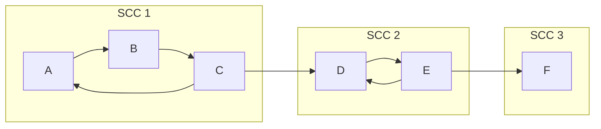
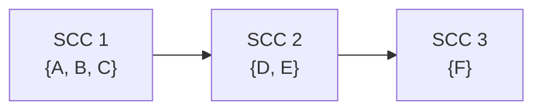

# Strongly Connected Components — Tarjan & Kosaraju + the Condensation DAG

In a **directed** graph, two vertices `u` and `v` are *mutually reachable* when there is a path `u → … → v` **and** a path `v → … → u`. A **Strongly Connected Component (SCC)** is a maximal set of vertices that are all pairwise mutually reachable. SCCs partition the vertices of any directed graph, and when each SCC is collapsed into a single super-node the result is always a **Directed Acyclic Graph** — the *condensation*. This single idea powers DAG dynamic programming over directed graphs (longest path, cheapest collection), cycle-aware reachability, and **2-SAT**.

This guide builds SCCs two ways — **Tarjan** (one DFS with discovery/low-link values and an explicit stack) and **Kosaraju** (two DFS passes using the transpose graph) — then shows how to build the condensation and run DP on it. Every algorithm is given as pseudocode followed by **iterative** Python and C++ implementations, because the recursive form blows the stack on large CSES inputs (up to `10^5` nodes / `2·10^5` edges).

## Table of Contents

1. [What an SCC Is](#1-what-an-scc-is)
2. [The DFS Tree, `disc`, and `low`-Link](#2-the-dfs-tree-disc-and-low-link)
3. [Tarjan's Algorithm (Single DFS + Stack)](#3-tarjans-algorithm-single-dfs--stack)
4. [Kosaraju's Algorithm (Two Passes + Transpose)](#4-kosarajus-algorithm-two-passes--transpose)
5. [Building the Condensation Graph](#5-building-the-condensation-graph)
6. [DAG DP on the Condensation](#6-dag-dp-on-the-condensation)
7. [2-SAT in One Sentence](#7-2-sat-in-one-sentence)
8. [Tarjan vs Kosaraju](#8-tarjan-vs-kosaraju)
9. [Complexity](#9-complexity)
10. [Common Pitfalls](#10-common-pitfalls)
11. [Patterns](#11-patterns)

---

## 1. What an SCC Is

Formally, define a relation `u ~ v` iff `u` can reach `v` **and** `v` can reach `u`. This relation is reflexive, symmetric, and transitive — an **equivalence relation** — so it carves the vertex set into disjoint equivalence classes. Each class is one SCC.



Above there are three SCCs: `{A, B, C}` (a 3-cycle), `{D, E}` (a 2-cycle), and `{F}` (a lone vertex — every single vertex is trivially its own SCC). The cross edges `C → D` and `E → F` connect *distinct* components and never form a cycle between components.

Key facts:

- Every vertex belongs to **exactly one** SCC.
- An edge inside one SCC may sit on a cycle; an edge between two SCCs never can.
- Collapsing each SCC to a point yields a DAG (proved in §5).

---

## 2. The DFS Tree, `disc`, and `low`-Link

Run a DFS from some root. The tree edges you follow form the **DFS tree**; the remaining edges are classified as **back** (to an ancestor), **forward** (to a descendant), or **cross** (to an already-finished vertex in another branch). Tarjan's insight: an SCC corresponds to a sub-tree of the DFS tree whose vertices cannot "escape upward" past a certain root.

Two integer labels drive everything:

- `disc[u]` — the **discovery time**: the order index when DFS first visits `u`.
- `low[u]` — the smallest `disc` reachable from `u` using tree edges followed by **at most one** back/cross edge that lands on a vertex *still on the stack*.

The low-link recurrence:

$$
low[u] = \min\Big( disc[u],\ \min_{(u,v)\ \text{tree edge}} low[v],\ \min_{(u,w)\ \text{back/cross edge},\ w\ \text{on stack}} disc[w] \Big)
$$

When DFS finishes exploring `u` and finds

$$
low[u] = disc[u],
$$

then `u` is the **root** of an SCC: no vertex in its sub-tree could reach anything discovered earlier that is still on the stack, so the vertices sitting on the stack above `u` (plus `u`) form one complete component.

---

## 3. Tarjan's Algorithm (Single DFS + Stack)

Tarjan finds **all** SCCs in a *single* DFS. It keeps an explicit **stack** of vertices in the current exploration path that have not yet been assigned to a finished component, plus an `on_stack[]` flag so back/cross edges only update `low` when the target is still "open". When `low[u] == disc[u]`, it pops the stack down to and including `u` — that popped set is one SCC. Components are numbered in **reverse topological order** of the condensation (a handy bonus).

**Pseudocode**

```
timer <- 0
disc[*] <- -1; low[*] <- 0; on_stack[*] <- false
S <- empty stack            # vertices awaiting a component
comp[*] <- -1; ncomp <- 0

dfs(u):
    disc[u] = low[u] = timer; timer += 1
    S.push(u); on_stack[u] = true
    for v in adj[u]:
        if disc[v] == -1:           # tree edge
            dfs(v)
            low[u] = min(low[u], low[v])
        elif on_stack[v]:           # back/cross edge to open vertex
            low[u] = min(low[u], disc[v])
    if low[u] == disc[u]:           # u is an SCC root
        repeat:
            w = S.pop(); on_stack[w] = false
            comp[w] = ncomp
        until w == u
        ncomp += 1

for u in vertices:
    if disc[u] == -1: dfs(u)
```

The implementations below convert the recursion into an **explicit work stack** so deep graphs do not overflow the call stack.

```python
import sys

def tarjan_scc(n, adj):
    # adj[u] = list of v with edge u -> v ; vertices are 0..n-1
    disc = [-1] * n            # discovery time, -1 = unvisited
    low = [0] * n              # low-link value
    comp = [-1] * n            # SCC id of each vertex
    on_stack = [False] * n     # is vertex currently on the SCC stack?
    stack = []                 # the SCC stack (vertices awaiting a component)
    timer = 0
    ncomp = 0

    for start in range(n):
        if disc[start] != -1:
            continue
        # work_stack holds (u, index of next neighbour to try)
        work = [(start, 0)]
        while work:
            u, i = work[-1]
            if i == 0:                       # first time we enter u
                disc[u] = low[u] = timer
                timer += 1
                stack.append(u)
                on_stack[u] = True
            if i < len(adj[u]):
                work[-1] = (u, i + 1)        # advance neighbour pointer
                v = adj[u][i]
                if disc[v] == -1:            # tree edge: descend into v
                    work.append((v, 0))
                elif on_stack[v]:            # back/cross edge to open vertex
                    low[u] = min(low[u], disc[v])
            else:                            # done with u: pop frame
                work.pop()
                if work:                     # propagate low to parent
                    p = work[-1][0]
                    low[p] = min(low[p], low[u])
                if low[u] == disc[u]:        # u is an SCC root -> pop one SCC
                    while True:
                        w = stack.pop()
                        on_stack[w] = False
                        comp[w] = ncomp
                        if w == u:
                            break
                    ncomp += 1
    return ncomp, comp
```

```cpp
#include <bits/stdc++.h>
using namespace std;

// adj[u] = vertices v with edge u -> v ; vertices are 0..n-1
// Returns number of SCCs; fills comp[] with each vertex's SCC id.
int tarjanSCC(int n, const vector<vector<int>>& adj, vector<int>& comp) {
    vector<int> disc(n, -1);     // discovery time, -1 = unvisited
    vector<int> low(n, 0);       // low-link value
    vector<char> onStack(n, 0);  // is vertex on the SCC stack?
    comp.assign(n, -1);          // SCC id of each vertex
    vector<int> sccStack;        // vertices awaiting a component
    int timer = 0, ncomp = 0;

    vector<pair<int,int>> work;  // explicit recursion: (u, next neighbour index)
    for (int start = 0; start < n; ++start) {
        if (disc[start] != -1) continue;
        work.push_back({start, 0});
        while (!work.empty()) {
            auto& [u, i] = work.back();
            if (i == 0) {                       // first entry into u
                disc[u] = low[u] = timer++;
                sccStack.push_back(u);
                onStack[u] = 1;
            }
            if (i < (int)adj[u].size()) {
                int v = adj[u][i++];            // advance neighbour pointer
                if (disc[v] == -1) {            // tree edge: descend
                    work.push_back({v, 0});
                } else if (onStack[v]) {        // back/cross edge to open vertex
                    low[u] = min(low[u], disc[v]);
                }
            } else {                            // done with u: pop frame
                int uu = u;
                work.pop_back();
                if (!work.empty())              // propagate low to parent
                    low[work.back().first] = min(low[work.back().first], low[uu]);
                if (low[uu] == disc[uu]) {      // uu is an SCC root -> pop one SCC
                    while (true) {
                        int w = sccStack.back(); sccStack.pop_back();
                        onStack[w] = 0;
                        comp[w] = ncomp;
                        if (w == uu) break;
                    }
                    ++ncomp;
                }
            }
        }
    }
    return ncomp;
}
```

---

## 4. Kosaraju's Algorithm (Two Passes + Transpose)

Kosaraju is arguably easier to *remember*: it runs two DFS passes.

1. **Pass 1** — DFS over `G`, pushing each vertex onto an `order` list when it **finishes** (post-order). The list ends up sorted by increasing finish time.
2. **Pass 2** — process vertices in **reverse** finish order; for each unvisited vertex run a DFS over the **transpose** `Gᵀ` (every edge reversed). Each tree explored in this pass is exactly one SCC.

**Why it works:** the vertex with the latest finish time lies in a *source* SCC of the condensation. Reversing edges turns that source into a sink, so a DFS from it in `Gᵀ` can only reach vertices inside its own SCC — it cannot leak into other components.

**Pseudocode**

```
# Pass 1: finish-order on G
visited[*] <- false; order <- []
for u in vertices:
    if not visited[u]: dfs1(u)        # push u to order on finish

# Pass 2: DFS on transpose in reverse finish order
build Gt = transpose(G)
comp[*] <- -1; ncomp <- 0
for u in reversed(order):
    if comp[u] == -1:
        dfs2(u, ncomp)                # label whole reachable tree in Gt
        ncomp += 1
```

```python
def kosaraju_scc(n, adj):
    # adj[u] = list of v with edge u -> v ; vertices 0..n-1
    radj = [[] for _ in range(n)]      # transpose graph G^T
    for u in range(n):
        for v in adj[u]:
            radj[v].append(u)          # reverse every edge

    visited = [False] * n
    order = []                         # vertices by increasing finish time

    # ---- Pass 1: iterative post-order DFS on G ----
    for s in range(n):
        if visited[s]:
            continue
        stack = [(s, 0)]
        while stack:
            u, i = stack[-1]
            if i == 0:
                visited[u] = True
            if i < len(adj[u]):
                stack[-1] = (u, i + 1)
                v = adj[u][i]
                if not visited[v]:
                    stack.append((v, 0))
            else:
                order.append(u)        # u finished -> record post-order
                stack.pop()

    # ---- Pass 2: DFS on G^T in reverse finish order ----
    comp = [-1] * n
    ncomp = 0
    for s in reversed(order):
        if comp[s] != -1:
            continue
        stack = [s]
        comp[s] = ncomp
        while stack:                   # plain iterative DFS, label component
            u = stack.pop()
            for v in radj[u]:
                if comp[v] == -1:
                    comp[v] = ncomp
                    stack.append(v)
        ncomp += 1
    return ncomp, comp
```

```cpp
#include <bits/stdc++.h>
using namespace std;

// adj[u] = vertices v with edge u -> v ; vertices 0..n-1
// Returns number of SCCs; fills comp[] with each vertex's SCC id.
int kosarajuSCC(int n, const vector<vector<int>>& adj, vector<int>& comp) {
    vector<vector<int>> radj(n);       // transpose graph G^T
    for (int u = 0; u < n; ++u)
        for (int v : adj[u])
            radj[v].push_back(u);       // reverse every edge

    vector<char> visited(n, 0);
    vector<int> order;                  // vertices by increasing finish time
    order.reserve(n);

    // ---- Pass 1: iterative post-order DFS on G ----
    vector<pair<int,int>> st;           // (u, next neighbour index)
    for (int s = 0; s < n; ++s) {
        if (visited[s]) continue;
        st.push_back({s, 0});
        while (!st.empty()) {
            auto& [u, i] = st.back();
            if (i == 0) visited[u] = 1;
            if (i < (int)adj[u].size()) {
                int v = adj[u][i++];
                if (!visited[v]) st.push_back({v, 0});
            } else {
                order.push_back(u);     // u finished -> record post-order
                st.pop_back();
            }
        }
    }

    // ---- Pass 2: DFS on G^T in reverse finish order ----
    comp.assign(n, -1);
    int ncomp = 0;
    vector<int> stack2;
    for (int idx = n - 1; idx >= 0; --idx) {
        int s = order[idx];
        if (comp[s] != -1) continue;
        stack2.push_back(s);
        comp[s] = ncomp;
        while (!stack2.empty()) {        // plain iterative DFS, label component
            int u = stack2.back(); stack2.pop_back();
            for (int v : radj[u]) {
                if (comp[v] == -1) {
                    comp[v] = ncomp;
                    stack2.push_back(v);
                }
            }
        }
        ++ncomp;
    }
    return ncomp;
}
```

> **Component numbering differs between the two algorithms.** Tarjan emits components in *reverse* topological order of the condensation; Kosaraju emits them in *forward* topological order. Either is fine — if your DP needs a specific direction, sort the condensation explicitly (see §6) rather than relying on the labels.

---

## 5. Building the Condensation Graph

Once every vertex has a `comp[]` label, the **condensation** `C` has one super-node per SCC. For every original edge `u → v` with `comp[u] != comp[v]`, add an edge `comp[u] → comp[v]` in `C` (deduplicate if you need simple edges).



**Why the condensation is always a DAG.** Suppose it had a cycle `X → … → X` through distinct super-nodes. Then a vertex in `X` could reach a vertex in another component `Y` and return — making all of them mutually reachable, so they would have been *one* SCC. Contradiction. Hence no inter-component cycle can exist: the condensation is acyclic.

```python
def condense(n, adj, ncomp, comp):
    # Build the condensation DAG; dedupe parallel super-edges via per-node sets.
    cadj = [set() for _ in range(ncomp)]
    for u in range(n):
        for v in adj[u]:
            if comp[u] != comp[v]:           # only cross-component edges
                cadj[comp[u]].add(comp[v])
    return [list(s) for s in cadj]
```

```cpp
// Build the condensation DAG; dedupe parallel super-edges via sets.
vector<vector<int>> condense(int n, const vector<vector<int>>& adj,
                             int ncomp, const vector<int>& comp) {
    vector<set<int>> tmp(ncomp);
    for (int u = 0; u < n; ++u)
        for (int v : adj[u])
            if (comp[u] != comp[v])          // only cross-component edges
                tmp[comp[u]].insert(comp[v]);
    vector<vector<int>> cadj(ncomp);
    for (int c = 0; c < ncomp; ++c)
        cadj[c] = vector<int>(tmp[c].begin(), tmp[c].end());
    return cadj;
}
```

---

## 6. DAG DP on the Condensation

Because the condensation is a DAG, classic DAG DP applies: process super-nodes in topological order and combine results from predecessors or successors. Two staples:

- **Longest / cheapest path** (e.g. CSES *Coin Collector*): give each super-node a weight = sum of its members' values, then `best[c] = weight[c] + max(best[s] for s in successors[c])`.
- **Reachability counting**, **DP on "can we satisfy all"**, etc.

The cleanest order is Tarjan's labels: since they are already in **reverse** topological order, iterating component ids `0, 1, …, ncomp-1` visits every node *after* all of its successors. So a forward sweep computes "best value reachable starting here":

```python
def longest_value(ncomp, cadj, weight, comp_order_is_reverse_topo=True):
    # weight[c] = aggregated value of SCC c. With Tarjan ids, c < successor ids,
    # so iterating 0..ncomp-1 processes successors first -> single pass works.
    best = weight[:]                         # best[c] = max total starting at c
    rng = range(ncomp) if comp_order_is_reverse_topo else reversed(range(ncomp))
    for c in rng:
        for s in cadj[c]:
            best[c] = max(best[c], weight[c] + best[s])
    return max(best)
```

```cpp
// weight[c] = aggregated value of SCC c. Tarjan ids are reverse-topo, so a
// forward sweep processes successors before predecessors in one pass.
long long longestValue(int ncomp, const vector<vector<int>>& cadj,
                       const vector<long long>& weight) {
    vector<long long> best = weight;         // best[c] = max total starting at c
    long long ans = 0;
    for (int c = 0; c < ncomp; ++c) {
        for (int s : cadj[c])
            best[c] = max(best[c], weight[c] + best[s]);
        ans = max(ans, best[c]);
    }
    return ans;
}
```

If you cannot trust the label order, run Kahn's topological sort on the condensation and DP in that order instead.

---

## 7. 2-SAT in One Sentence

For a boolean formula in conjunctive normal form with clauses of two literals, build the **implication graph** (clause `(a ∨ b)` adds `¬a → b` and `¬b → a`), compute SCCs, and the formula is satisfiable **iff no variable `x` shares an SCC with `¬x`**; a satisfying assignment falls out by comparing the two literals' component order. SCCs are the entire engine behind 2-SAT.

---

## 8. Tarjan vs Kosaraju

| Aspect | Tarjan | Kosaraju |
|---|---|---|
| DFS passes | **1** | **2** |
| Extra graph | none | needs the **transpose** `Gᵀ` |
| Auxiliary data | `disc`, `low`, on-stack flags, stack | `visited`, finish `order` |
| Component order | reverse topological | forward topological |
| Constant factor | usually faster (one pass) | slightly slower, more memory |
| Ease of recall | trickier (`low`-link logic) | simpler (two plain DFS) |
| Iterative form | a bit fiddly (propagate `low` on pop) | straightforward |

Both are $O(V+E)$. Pick Tarjan when you want one pass and minimal memory; pick Kosaraju when you value conceptual simplicity or already have the transpose handy.

---

## 9. Complexity

| Quantity | Tarjan | Kosaraju |
|---|---|---|
| Time | $O(V+E)$ | $O(V+E)$ (two DFS + transpose build) |
| Extra space | $O(V)$ | $O(V+E)$ (the transpose graph) |

Both touch every vertex and edge a constant number of times, so the asymptotics are identical; Kosaraju pays an extra linear pass and stores `Gᵀ`.

---

## 10. Common Pitfalls

- **Recursion depth.** A recursive DFS on a `10^5`-long chain overflows Python's default limit and can segfault C++. Use the **iterative** templates above (or raise limits / enlarge the stack only if you must).
- **Transpose construction (Kosaraju).** Forgetting to reverse edges — or reversing into the wrong list — silently produces wrong components. Reverse `u → v` into `radj[v].push_back(u)`.
- **On-stack check (Tarjan).** Only relax `low[u]` with `disc[v]` when `v` is **still on the stack**. Updating from a vertex already assigned to a finished component is the classic Tarjan bug.
- **`disc[v]` vs `low[v]` on the back edge.** For a back/cross edge use `low[u] = min(low[u], disc[v])` (the *discovery* time), not `low[v]`.
- **Propagating `low` on pop.** In the iterative version, after popping `u` you must fold `low[u]` into its parent's `low`. Omitting this merges/splits components incorrectly.
- **Self-loops and parallel edges.** They never change SCC membership; just make sure they do not corrupt the condensation (skip `comp[u] == comp[v]`).

---

## 11. Patterns

- **Condensation → DAG DP.** Collapse cycles, then run longest-path / cheapest-path / counting DP on the acyclic super-graph (CSES *Coin Collector*).
- **SCC labeling.** Output each vertex's component id; vertices in the same SCC are mutually reachable (CSES *Planets and Kingdoms*).
- **2-SAT.** Satisfiability via implication-graph SCCs (`x` and `¬x` must differ).
- **Cycle-aware reachability / "must pass through".** Mutual reachability and reachability between super-nodes.
- **Bridges / articulation points.** Same `disc`/`low` machinery, applied to *undirected* graphs — a close cousin worth recognizing.
