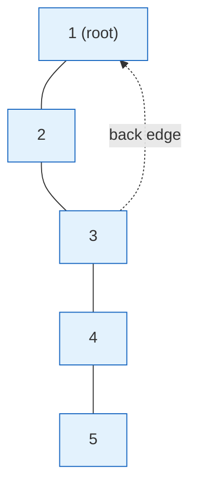
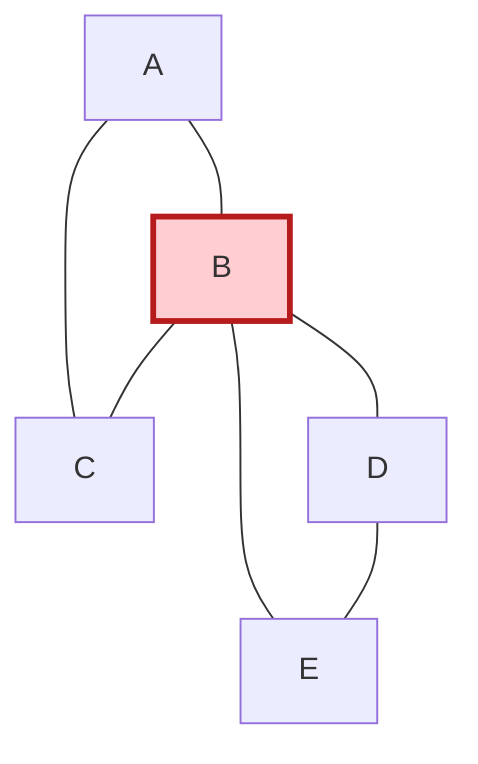

# Bridges (Cut Edges) and Articulation Points (Cut Vertices)

Bridges and articulation points answer a single, intuitive question about an
**undirected** graph: *which parts of the graph are fragile?* A **bridge** is an
edge that, if it fails, splits a connected piece into two. An **articulation
point** (or **cut vertex**) is a vertex that, if it is removed, does the same.

These ideas power network-reliability analysis ("which single cable or router,
if it dies, disconnects the system?"), they are the building blocks of
**biconnected** and **2-edge-connected** component decomposition, and they show
up constantly in competitive programming. The beautiful part is that *both* can
be found in a single $O(V + E)$ depth-first search using one shared idea: the
**low-link** value. This guide builds that idea from first principles, derives
the exact inequalities, handles the nasty edge cases (parents, multi-edges, the
DFS root), and gives idiomatic Python and C++ for both problems.

---

## Table of Contents

1. [Definitions](#definitions)
2. [The DFS Tree: Tree Edges vs Back Edges](#the-dfs-tree-tree-edges-vs-back-edges)
3. [Discovery Time `disc` and the `low`-Link](#discovery-time-disc-and-the-low-link)
4. [The Bridge Condition](#the-bridge-condition)
5. [The Articulation-Point Conditions](#the-articulation-point-conditions)
6. [Handling Multi-Edges (the Parent Trap)](#handling-multi-edges-the-parent-trap)
7. [Pseudocode](#pseudocode)
8. [Bridge-Finding Code](#bridge-finding-code)
9. [Articulation-Point Code](#articulation-point-code)
10. [Biconnected & 2-Edge-Connected Components](#biconnected--2-edge-connected-components)
11. [Complexity](#complexity)
12. [Common Pitfalls](#common-pitfalls)
13. [Patterns](#patterns)

---

## Definitions

Let $G = (V, E)$ be a connected (or per-component) **undirected** graph.

- A **bridge** (a.k.a. *cut edge*, *isthmus*) is an edge $e \in E$ whose removal
  increases the number of connected components:
  $$
  e \text{ is a bridge} \iff \text{comp}(G - e) > \text{comp}(G).
  $$
- An **articulation point** (a.k.a. *cut vertex*) is a vertex $v \in V$ whose
  removal (together with all edges incident to it) increases the number of
  connected components:
  $$
  v \text{ is an articulation point} \iff \text{comp}(G - v) > \text{comp}(G).
  $$

Intuition: a bridge is a single point of failure on the **edges**; an
articulation point is a single point of failure on the **vertices**. A graph
with **no** bridges is called **2-edge-connected**; a graph with **no**
articulation points (and at least 3 vertices) is called **2-vertex-connected**
(biconnected).

> Relationship, not equality: both endpoints of a bridge are *usually*
> articulation points, but a graph can have an articulation point with **no**
> incident bridge (e.g. the center of two triangles sharing one vertex). So we
> compute them with closely related — but distinct — conditions.

---

## The DFS Tree: Tree Edges vs Back Edges

Run a DFS from any start vertex. Every edge you traverse to reach a **new**
(unvisited) vertex is a **tree edge**; these form the **DFS tree**. Every other
edge of an undirected graph connects a vertex to one of its **ancestors** in the
DFS tree — these are **back edges**. (Undirected DFS has *no* cross or forward
edges; that is a directed-graph phenomenon.)



In the picture above, solid lines `1-2`, `2-3`, `3-4`, `4-5` are **tree edges**
and the dotted `3-1` is a **back edge**. The back edge `3-1` creates a cycle
`1-2-3-1`. Notice: every edge *inside* that cycle is **safe** (removing any one
of them keeps the graph connected via the other path), but the tree edge `4-5`
hangs off the cycle with no alternate route — so `4-5` is a **bridge**.

The single most important observation:

> **An edge is a bridge if and only if it is a tree edge that no back edge
> "covers".** A back edge from a descendant to an ancestor protects (makes
> non-bridge) *every* tree edge on the tree path it spans.

The `low`-link below is exactly the bookkeeping that measures "how high up the
tree can I climb using one back edge from my subtree."

---

## Discovery Time `disc` and the `low`-Link

During DFS, assign each vertex an increasing **discovery time** `disc[u]` (the
timestamp when DFS first enters `u`). Then define the **low-link**:

$$
\text{low}[u] = \min\Big(
  \text{disc}[u],\;
  \min_{(u,w)\,\text{back edge}} \text{disc}[w],\;
  \min_{v\,\text{child of }u} \text{low}[v]
\Big).
$$

In words, `low[u]` is the smallest discovery time reachable from the subtree
rooted at `u` by using **tree edges downward** and then **at most one back edge
upward**. It is the highest ancestor (smallest timestamp) the subtree of `u` can
"escape" to without going back through `u`'s parent edge.

> **Variant note.** Some references define `low` using `low[v]` of children
> *and* `disc[w]` of back edges (as above). A common alternative uses
> `min(low[u], low[v])` for children plus `min(low[u], disc[w])` for back edges.
> Both give identical bridge/articulation answers; this guide uses `disc[w]` for
> back edges, which is the CP-Algorithms convention and is the easiest to reason
> about for the strict `<` bridge inequality.

---

## The Bridge Condition

Let $(u, v)$ be a **tree edge** with $u$ the parent and $v$ the child. Then:

$$
\boxed{(u, v) \text{ is a bridge} \iff \text{low}[v] > \text{disc}[u].}
$$

**Why.** `low[v] > disc[u]` says the entire subtree of `v` cannot reach `u` or
anything *above* `u` except by going back through the edge $(u, v)$ itself. There
is no back edge from $v$'s subtree to $u$ or an ancestor of $u$. Hence deleting
$(u, v)$ severs the subtree of $v$ from the rest of the graph — it is a bridge.

Conversely, if `low[v] <= disc[u]`, some vertex in $v$'s subtree has a back edge
to $u$ (giving `low[v] == disc[u]`) or to a proper ancestor of $u$ (giving
`low[v] < disc[u]`). Either way an alternate route exists, so $(u, v)$ is safe.

The strict inequality is the crux: `low[v] == disc[u]` means there is a back edge
landing exactly on $u$, providing a second path — **not** a bridge.

---

## The Articulation-Point Conditions

For a **vertex** $u$, removing it can disconnect its children's subtrees from the
rest. Two cases, depending on whether $u$ is the DFS root:

1. **Root special case.** The DFS root $r$ is an articulation point **iff it has
   two or more children in the DFS tree.** (The root has no ancestors, so the
   `low` test below never applies to it. With $\ge 2$ children, deleting the root
   leaves those subtrees mutually disconnected.)

2. **Non-root case.** A non-root vertex $u$ is an articulation point **iff it has
   at least one child $v$ in the DFS tree with**
   $$
   \boxed{\text{low}[v] \ge \text{disc}[u].}
   $$

**Why the non-root condition.** `low[v] >= disc[u]` says the subtree of $v$
cannot reach any *strict ancestor* of $u$ without passing through $u$. So
removing $u$ strands that subtree. Note the inequality is **`>=`** here, unlike
the bridge's strict **`>`**: even a back edge that climbs *exactly* to $u$
(`low[v] == disc[u]`) does **not** help, because we are deleting $u$ itself, so
landing on $u$ is no escape.

| Quantity | Bridge test | Articulation test |
| --- | --- | --- |
| Inequality | `low[v] > disc[u]` (strict) | `low[v] >= disc[u]` |
| Special root rule | none | root is AP iff `children >= 2` |
| Object found | the edge `(u, v)` | the vertex `u` |

---

## Handling Multi-Edges (the Parent Trap)

In undirected DFS we must **not** treat the edge back to our parent as a back
edge — otherwise every leaf would falsely look reachable upward. The naive fix
"skip the vertex equal to `parent`" works **only if there are no multi-edges**.

Consider two parallel edges between $u$ and $v$. If we skip *by vertex* (`if w ==
parent: continue`), we incorrectly skip the *second* parallel edge too — but that
second edge is a genuine alternate route, so the first one is **not** a bridge.
Skipping by vertex would wrongly report a bridge.

**The robust fix: skip by edge id, not by vertex.** Give every undirected edge a
unique id; store it in the adjacency list as `(neighbor, edge_id)`. When
recursing into `v`, remember the id of the edge you came in on, and only ignore
that *specific* id. A second parallel edge has a different id, so it is correctly
treated as a back edge — canceling the bridge.

> For **articulation points**, multi-edges are harmless because the condition is
> about *vertices*, not edges; tracking the parent vertex is fine. But the
> edge-id discipline never hurts, so the code below uses it for bridges and the
> simpler parent-vertex tracking for articulation points.

---

## Pseudocode

```text
DFS(u, parent_edge_id):
    disc[u] = low[u] = timer++         # first visit timestamp
    for (v, id) in adj[u]:
        if id == parent_edge_id:        # ignore the exact edge we arrived on
            continue
        if disc[v] is UNVISITED:        # tree edge -> recurse
            DFS(v, id)
            low[u] = min(low[u], low[v])
            if low[v] > disc[u]:        # BRIDGE test (strict)
                report edge (u, v) as bridge
        else:                           # back edge -> tighten low directly
            low[u] = min(low[u], disc[v])

# Articulation-point DFS (parent-vertex variant)
DFS_AP(u, parent):
    disc[u] = low[u] = timer++
    children = 0
    for v in adj[u]:
        if v == parent: continue        # skip parent vertex (multi-edge-safe for AP)
        if disc[v] is UNVISITED:
            children += 1
            DFS_AP(v, u)
            low[u] = min(low[u], low[v])
            if parent != NONE and low[v] >= disc[u]:
                mark u as articulation point     # non-root rule (>=)
        else:
            low[u] = min(low[u], disc[v])
    if parent == NONE and children >= 2:
        mark u as articulation point             # root rule
```

---

## Bridge-Finding Code

Adjacency stores `(neighbor, edge_id)` so multi-edges are handled correctly.

```python
import sys

def find_bridges(n, edges):
    """Return list of bridges (u, v). Vertices are 0..n-1.
    edges: list of (u, v) undirected pairs (may include multi-edges)."""
    adj = [[] for _ in range(n)]
    for eid, (u, v) in enumerate(edges):
        adj[u].append((v, eid))          # each undirected edge -> two entries,
        adj[v].append((u, eid))          # but with the SAME edge id

    disc = [-1] * n                      # discovery time, -1 = unvisited
    low = [0] * n                        # low-link value
    timer = 0
    bridges = []

    sys.setrecursionlimit(1 << 20)       # recursion can go ~V deep

    def dfs(u, parent_edge):
        nonlocal timer
        disc[u] = low[u] = timer
        timer += 1
        for v, eid in adj[u]:
            if eid == parent_edge:       # ignore the exact edge we came in on
                continue
            if disc[v] == -1:            # tree edge -> recurse into child
                dfs(v, eid)
                low[u] = min(low[u], low[v])
                if low[v] > disc[u]:     # strict '>' => (u, v) is a bridge
                    bridges.append((u, v))
            else:                        # back edge -> climb via discovery time
                low[u] = min(low[u], disc[v])

    for s in range(n):                   # cover every connected component
        if disc[s] == -1:
            dfs(s, -1)
    return bridges
```

```cpp
#include <bits/stdc++.h>
using namespace std;

int n, timer_ = 0;
vector<vector<pair<int,int>>> adj;       // adj[u] = list of (neighbor, edge_id)
vector<int> disc, low_;                  // discovery time and low-link
vector<pair<int,int>> bridges;

void dfs(int u, int parent_edge) {
    disc[u] = low_[u] = timer_++;        // first visit timestamp
    for (auto [v, eid] : adj[u]) {
        if (eid == parent_edge) continue; // ignore the exact edge we came in on
        if (disc[v] == -1) {             // tree edge -> recurse into child
            dfs(v, eid);
            low_[u] = min(low_[u], low_[v]);
            if (low_[v] > disc[u])       // strict '>' => (u, v) is a bridge
                bridges.push_back({u, v});
        } else {                         // back edge -> climb via discovery time
            low_[u] = min(low_[u], disc[v]);
        }
    }
}

vector<pair<int,int>> find_bridges(int N, vector<pair<int,int>>& edges) {
    n = N; timer_ = 0;
    adj.assign(n, {});
    disc.assign(n, -1); low_.assign(n, 0);
    bridges.clear();
    for (int i = 0; i < (int)edges.size(); ++i) {
        auto [u, v] = edges[i];
        adj[u].push_back({v, i});        // same edge id on both directions
        adj[v].push_back({u, i});
    }
    for (int s = 0; s < n; ++s)          // cover every connected component
        if (disc[s] == -1) dfs(s, -1);
    return bridges;
}
```

> **Recursion depth.** Both versions recurse up to $O(V)$ deep. Python needs
> `setrecursionlimit`; C++ may overflow the stack for $V \approx 10^5$+ chains.
> For very large inputs convert to an **explicit stack** (iterative DFS) — the
> logic is identical, you just push/pop frames and apply the `low` update when a
> child returns.

---

## Articulation-Point Code

Here parent-*vertex* tracking suffices (the condition is about vertices).

```python
import sys

def find_articulation_points(n, adj):
    """adj: list of neighbor-lists (0-indexed). Returns a set of cut vertices."""
    disc = [-1] * n                      # discovery time, -1 = unvisited
    low = [0] * n                        # low-link value
    is_ap = [False] * n
    timer = 0

    sys.setrecursionlimit(1 << 20)

    def dfs(u, parent):
        nonlocal timer
        disc[u] = low[u] = timer
        timer += 1
        children = 0                     # # of DFS-tree children of u
        for v in adj[u]:
            if v == parent:              # skip the parent vertex
                continue
            if disc[v] == -1:            # tree edge -> recurse
                children += 1
                dfs(v, u)
                low[u] = min(low[u], low[v])
                # non-root rule uses '>=' (landing on u is no escape)
                if parent != -1 and low[v] >= disc[u]:
                    is_ap[u] = True
            else:                        # back edge
                low[u] = min(low[u], disc[v])
        if parent == -1 and children >= 2:   # root rule
            is_ap[u] = True

    for s in range(n):                   # every component
        if disc[s] == -1:
            dfs(s, -1)
    return {u for u in range(n) if is_ap[u]}
```

```cpp
#include <bits/stdc++.h>
using namespace std;

int n, timer_ = 0;
vector<vector<int>> adj;                 // simple adjacency by neighbor
vector<int> disc, low_;
vector<bool> is_ap;

void dfs(int u, int parent) {
    disc[u] = low_[u] = timer_++;        // first visit timestamp
    int children = 0;                    // # of DFS-tree children
    for (int v : adj[u]) {
        if (v == parent) continue;       // skip the parent vertex
        if (disc[v] == -1) {             // tree edge -> recurse
            ++children;
            dfs(v, u);
            low_[u] = min(low_[u], low_[v]);
            // non-root rule uses '>=' (landing on u is no escape)
            if (parent != -1 && low_[v] >= disc[u])
                is_ap[u] = true;
        } else {                         // back edge
            low_[u] = min(low_[u], disc[v]);
        }
    }
    if (parent == -1 && children >= 2)   // root rule
        is_ap[u] = true;
}

vector<int> find_articulation_points(int N, vector<vector<int>>& g) {
    n = N; timer_ = 0;
    adj = g;
    disc.assign(n, -1); low_.assign(n, 0); is_ap.assign(n, false);
    for (int s = 0; s < n; ++s)          // every component
        if (disc[s] == -1) dfs(s, -1);
    vector<int> res;
    for (int u = 0; u < n; ++u) if (is_ap[u]) res.push_back(u);
    return res;
}
```

> **Multi-edge note for AP.** Because the AP test is about a *vertex*, two
> parallel edges to the parent do not change the answer, so parent-vertex
> tracking is safe here. (For bridges it is **not** — use edge ids.)

### Visualizing a Cut Vertex



Vertex **B** (highlighted) is an articulation point: triangle `A-B-C` and
triangle `B-D-E` share *only* B. Removing B splits `{A, C}` from `{D, E}`.
Notice there is **no bridge** here — every edge sits inside a triangle — yet B is
still a cut vertex. This is exactly why bridges and articulation points need
separate conditions (`>` vs `>=`, plus the root rule).

---

## Biconnected & 2-Edge-Connected Components

The same DFS generalizes to decomposition:

- **2-edge-connected components (2ECC).** Delete all bridges; each remaining
  connected piece is a 2-edge-connected component. Contracting each 2ECC to a
  single node turns the whole graph into the **bridge tree** (or *block-cut
  forest of edges*) — a tree where every edge is a bridge. Great for "after
  removing one edge, are X and Y still connected?" queries.

- **Biconnected components (BCC).** Maintain a stack of edges during DFS; when
  the articulation condition `low[v] >= disc[u]` fires, pop edges off the stack
  down to `(u, v)` — that popped set is one biconnected component. The
  **block-cut tree** alternates *block* nodes (BCCs) and *cut* nodes
  (articulation points) and is the standard structure for 2-vertex-connectivity
  queries.

Both are $O(V + E)$ and reuse `disc`/`low` exactly as above; only the bookkeeping
(an edge stack) is added.

---

## Complexity

| Operation | Time | Space |
| --- | --- | --- |
| Find all bridges | $O(V + E)$ | $O(V + E)$ |
| Find all articulation points | $O(V + E)$ | $O(V + E)$ |
| Build bridge tree / BCCs | $O(V + E)$ | $O(V + E)$ |

A single DFS pass touches each vertex once and each edge twice (once per
direction), so the work is linear in the graph size. Space is the adjacency list
plus the $O(V)$ arrays `disc`, `low`, and (for bridges) the edge-id metadata.

---

## Common Pitfalls

- **Strict vs non-strict inequality.** Bridges use `low[v] > disc[u]`;
  articulation points use `low[v] >= disc[u]`. Swapping them is the #1 bug.
- **Forgetting the root special case.** A root with one child is *not* an
  articulation point even if every child fails `low[v] >= disc[u]`. A root with
  two children *is* — regardless of any inequality.
- **Parent-skip with multi-edges (bridges).** Skipping by *vertex* breaks on
  parallel edges and reports false bridges. Skip by **edge id** instead.
- **Updating `low` from back edges with `low[v]` instead of `disc[v]`.** When you
  meet an already-visited neighbor `v` via a back edge, tighten with
  `disc[v]`, not `low[v]` (using `low[v]` can over-relax through a non-ancestor).
- **Recursion depth.** Deep DFS (long chains, $V \ge 10^5$) overflows the native
  stack in C++ and Python's default limit. Raise the limit or go iterative.
- **Disconnected graphs.** Loop the DFS over all start vertices so every
  component is processed.
- **Self-loops.** A self-loop `u-u` is never a bridge and never affects `low`;
  it is safe to skip outright.

---

## Patterns

- **"Critical connection / single point of failure on edges"** → find bridges.
  (LeetCode 1192 *Critical Connections in a Network* is exactly this.)
- **"Removing which server disconnects the network?"** → articulation points.
- **"Can X reach Y after removing one edge?"** → build the **bridge tree** (2ECC
  contraction) and answer connectivity on the tree.
- **"Can X reach Y after removing one vertex?"** → build the **block-cut tree**.
- **Shared DFS skeleton.** `disc`/`low` timestamping is the same engine behind
  bridges, articulation points, BCC/2ECC decomposition, and Tarjan's SCC for
  directed graphs — learn it once, reuse everywhere.

---

### One-line summary

Run one DFS, compute `low[u]`; an edge is a **bridge** when `low[v] > disc[u]`
(skip the parent *edge*), and a vertex is an **articulation point** when it is a
root with $\ge 2$ children or a non-root with a child where `low[v] >= disc[u]` —
all in $O(V + E)$.
