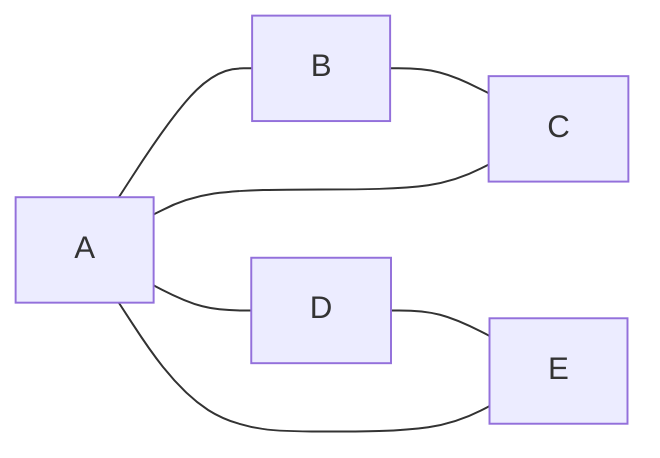
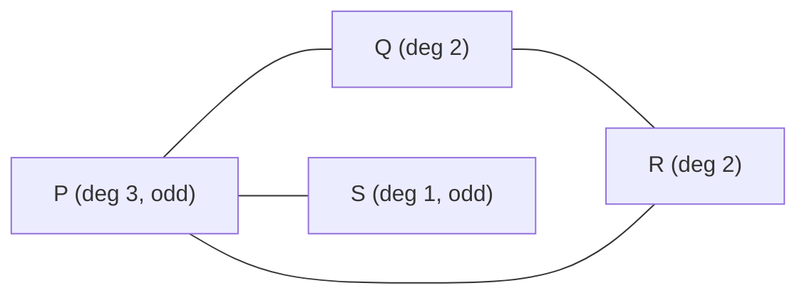
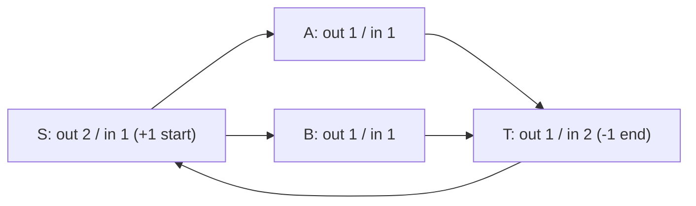
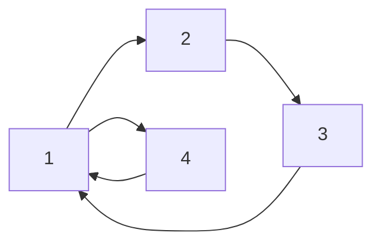
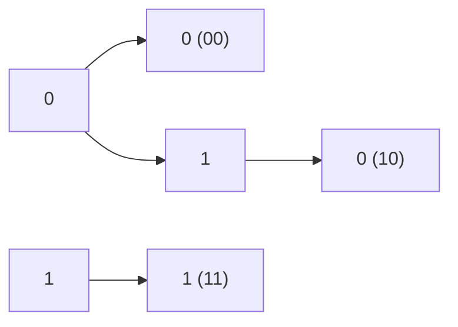

# Eulerian Path & Eulerian Circuit — Hierholzer's Algorithm

An **Eulerian trail** (or **Eulerian path**) is a walk through a graph that uses **every edge exactly once**. If that walk starts and ends at the **same** vertex it is called an **Eulerian circuit** (or Eulerian cycle). The name comes from Euler's 1736 solution to the *Seven Bridges of Königsberg*, which is widely considered the birth of graph theory.

The remarkable fact is that the *existence* of such a trail is decided by a tiny, purely local condition on vertex degrees — you never have to search. Once you know a trail exists, **Hierholzer's algorithm** constructs one in linear time `O(V + E)` by greedily following unused edges and splicing detours into the main tour.

This guide covers the definitions, the existence conditions for both **undirected** and **directed** graphs, an iterative `O(V+E)` implementation of Hierholzer in Python and C++ that survives large CSES inputs, and the connectivity subtleties that trip people up.

## Table of Contents

1. [Definitions](#1-definitions)
2. [Existence Conditions — Undirected Graphs](#2-existence-conditions--undirected-graphs)
3. [Existence Conditions — Directed Graphs](#3-existence-conditions--directed-graphs)
4. [The Connectivity Requirement](#4-the-connectivity-requirement)
5. [Hierholzer's Algorithm — Idea](#5-hierholzers-algorithm--idea)
6. [Pseudocode](#6-pseudocode)
7. [Implementation — Undirected (Python & C++)](#7-implementation--undirected-python--cpp)
8. [Implementation — Directed (Python & C++)](#8-implementation--directed-python--cpp)
9. [Worked Trace](#9-worked-trace)
10. [Complexity](#10-complexity)
11. [Common Pitfalls](#11-common-pitfalls)
12. [Patterns — de Bruijn Sequences](#12-patterns--de-bruijn-sequences)

---

## 1. Definitions

- **Edge** vs **vertex** traversal: an Eulerian trail constrains **edges** (each used exactly once), unlike a Hamiltonian path which constrains **vertices** (each visited exactly once). Hamiltonian path is NP-hard; Eulerian trail is linear-time. Do not confuse them.
- **Eulerian path / trail**: a walk `v_0, e_1, v_1, e_2, \dots, e_m, v_m` where every edge of the graph appears exactly once among `e_1, \dots, e_m`. The endpoints `v_0` and `v_m` may differ.
- **Eulerian circuit / cycle**: an Eulerian trail with `v_0 = v_m` — it begins and ends at the **same** vertex.

A circuit is a special case of a path. A graph that has an Eulerian circuit automatically has an Eulerian path (the circuit itself), but not vice versa.



In the figure above every vertex has even degree (`A` has degree 4, the rest degree 2), so an **Eulerian circuit** exists, e.g. `A-B-C-A-D-E-A`.

---

## 2. Existence Conditions — Undirected Graphs

Let the **degree** of a vertex be the number of edge-endpoints incident to it. For a connected (over the edge set) undirected graph:

- An **Eulerian circuit** exists **iff every vertex has even degree**.
- An **Eulerian path** (that is not a circuit) exists **iff exactly two vertices have odd degree**; those two odd vertices are forced to be the start and the end of the trail.

Formally, let `O` be the set of odd-degree vertices. Because every edge contributes `1` to exactly two degrees, the sum of all degrees is even, so `|O|` is **always even**:

$$\sum_{v \in V} \deg(v) = 2|E| \quad\Longrightarrow\quad |O| \equiv 0 \pmod 2.$$

Hence the only feasible cases are:

| `|O|` (odd-degree vertices) | Result |
|---|---|
| `0` | Eulerian **circuit** (also a path); start anywhere with `\deg>0` |
| `2` | Eulerian **path** only; must start at one odd vertex, end at the other |
| `\ge 4` | **Neither** exists |

**Intuition.** Every time the trail enters a vertex through one edge it must leave through a different unused edge — edges are consumed in *pairs* at every intermediate visit. So an interior vertex needs even degree. Only the two endpoints of a non-closed trail are allowed to have an unmatched edge, i.e. odd degree.



Here `P` and `S` are the two odd-degree vertices, so an Eulerian **path** exists and **must** run from `P` to `S` (or `S` to `P`): e.g. `S-P-Q-R-P` … wait that reuses `P`; the valid trail is `S-P-R-Q-P`. The two odd vertices are forced endpoints.

---

## 3. Existence Conditions — Directed Graphs

For a directed graph use **in-degree** and **out-degree**. With the graph connected in the underlying (undirected) sense over the vertices that have edges:

- An **Eulerian circuit** exists **iff `\text{indeg}(v) = \text{outdeg}(v)` for every vertex**.
- An **Eulerian path** (open trail) exists **iff exactly one vertex has `\text{outdeg} - \text{indeg} = +1`** (the **start** `s`) **and exactly one vertex has `\text{indeg} - \text{outdeg} = +1`** (the **end** `t`), and **every other** vertex is balanced (`indeg == outdeg`).

$$\text{circuit:}\;\forall v\;\; \text{outdeg}(v)=\text{indeg}(v).$$

$$\text{path:}\;\; \text{outdeg}(s)-\text{indeg}(s)=+1,\;\; \text{indeg}(t)-\text{outdeg}(t)=+1,\;\; \text{others balanced.}$$

Because total out-degree equals total in-degree (`\sum \text{outdeg} = |E| = \sum \text{indeg}`), the surpluses must cancel — you can never have a single unbalanced vertex.

**Choosing the start.** For a directed Eulerian *path* you **must** begin at the `+1` surplus vertex `s`; starting anywhere else fails. For a directed *circuit* you may start at any vertex with `outdeg > 0`.



In this directed example `S` has the `+1` out-surplus and `T` has the `+1` in-surplus, so an Eulerian **path** runs from `S` to `T`, e.g. `S-A-T-S-B-T`.

---

## 4. The Connectivity Requirement

The degree/balance condition alone is **not** sufficient. The edges must also form a **single connected piece** — otherwise you could have two disjoint even-degree cycles with no way to walk from one to the other.

The precise statement: *all vertices that have at least one edge must lie in the same connected component* (for directed graphs, the same **weakly** connected component, plus the balance condition handles reachability). **Isolated vertices** (degree 0) are irrelevant and must be ignored — they do not break Eulerianness.

Practical checks:

- Run a BFS/DFS (undirected) or a weak-connectivity check from any vertex that owns an edge; confirm every other edge-owning vertex is reached.
- Equivalently, after Hierholzer finishes, if the produced trail does **not** contain `|E| + 1` vertices (i.e. fewer than `E` edges were consumed), the edge set was disconnected → report impossible. This "count the edges used" check is the cheapest way to fold connectivity into the algorithm itself.

---

## 5. Hierholzer's Algorithm — Idea

Hierholzer (1873) builds an Eulerian trail in linear time:

1. Start at the correct vertex (see existence rules) and **walk along unused edges**, marking each as used, until you get stuck (no unused edge leaves the current vertex). Because of the degree/balance condition, you can only get stuck back at the start vertex (circuit case) or at the forced end vertex (path case).
2. The closed walk you just made may have skipped side-branches. While there is a vertex on your current trail that still has an **unused** edge, start a new sub-walk from there, which again returns to that vertex, and **splice** this detour into the main trail.
3. Repeat until no unused edges remain.

The slick iterative implementation uses an **explicit stack**:

- Maintain a **per-vertex pointer** (an index/iterator into its adjacency list) so each edge is examined **once** — this is what makes it `O(E)` rather than `O(E^2)`.
- Push the start vertex. While the stack is non-empty, look at the top vertex `u`. If `u` has an unused outgoing edge, mark it used and push the neighbor. If `u` has **no** unused edge, **pop** it and append it to the output list.
- The output list is the Eulerian trail **in reverse** — reverse it (or read it back-to-front) at the end.

The reversal is the elegant trick: a vertex is only emitted once it is fully drained, so dead-ends get written first and the spliced detours land in the correct positions automatically.

---

## 6. Pseudocode

```text
Hierholzer(start):
    iter[v] = 0 for all v          # next-unused-edge pointer per vertex
    stack = [start]
    trail = []                     # will hold the trail in reverse

    while stack not empty:
        u = stack.top()
        if iter[u] < len(adj[u]):           # u still has a candidate edge
            (v, edge_id) = adj[u][ iter[u] ]
            iter[u] += 1                    # consume this slot for u
            if used[edge_id]:               # (undirected) other side already walked
                continue
            used[edge_id] = true            # mark the edge consumed
            stack.push(v)
        else:
            trail.append(u)                 # u is drained -> emit it
            stack.pop()

    reverse(trail)
    if len(trail) != E + 1: return IMPOSSIBLE   # edges were disconnected
    return trail
```

For **directed** graphs each adjacency entry is consumed exactly once, so you do not even need a `used[]` array — advancing `iter[u]` *is* the consumption. For **undirected** graphs each physical edge appears in **two** adjacency lists (once per endpoint), so a shared `used[edge_id]` boolean indexed by **edge id** prevents walking the same edge from the other side.

---

## 7. Implementation — Undirected (Python & C++)

Each undirected edge gets a unique **edge id**; both directions store that id so a single `used[]` array, indexed by edge id, double-marks correctly.

```python
import sys
from sys import setrecursionlimit

def euler_undirected(n, edges):
    # n vertices (1..n); edges is a list of (a, b)
    # adj[v] holds (neighbor, edge_id); each edge id appears in BOTH endpoints' lists
    adj = [[] for _ in range(n + 1)]
    deg = [0] * (n + 1)
    for eid, (a, b) in enumerate(edges):
        adj[a].append((b, eid))
        adj[b].append((a, eid))      # undirected: store both directions, same id
        deg[a] += 1
        deg[b] += 1

    m = len(edges)
    if m == 0:
        return None

    # Existence: 0 odd-degree -> circuit; pick a start with degree > 0.
    odd = [v for v in range(1, n + 1) if deg[v] % 2 == 1]
    if len(odd) not in (0, 2):       # 4+ odd vertices -> no Eulerian trail
        return None
    start = odd[0] if odd else next(v for v in range(1, n + 1) if deg[v] > 0)

    used = [False] * m               # edge-used flag indexed by EDGE ID
    it = [0] * (n + 1)               # per-vertex pointer to next unused edge
    stack = [start]
    trail = []                       # built in reverse

    while stack:
        u = stack[-1]
        advanced = False
        while it[u] < len(adj[u]):
            v, eid = adj[u][it[u]]
            it[u] += 1               # consume this adjacency slot for u
            if not used[eid]:        # edge not yet walked from either side
                used[eid] = True     # double-mark via shared edge id
                stack.append(v)
                advanced = True
                break
        if not advanced:
            trail.append(u)          # u is drained -> emit
            stack.pop()

    trail.reverse()
    if len(trail) != m + 1:          # disconnected edge set -> impossible
        return None
    return trail
```

```cpp
#include <bits/stdc++.h>
using namespace std;

// returns the Eulerian trail (1-based vertices) or empty vector if none exists
vector<int> euler_undirected(int n, const vector<pair<int,int>>& edges) {
    int m = (int)edges.size();
    // adj[v] holds (neighbor, edge_id); each edge id appears in BOTH endpoints' lists
    vector<vector<pair<int,int>>> adj(n + 1);
    vector<int> deg(n + 1, 0);
    for (int eid = 0; eid < m; ++eid) {
        auto [a, b] = edges[eid];
        adj[a].push_back({b, eid});
        adj[b].push_back({a, eid});   // undirected: both directions, same id
        deg[a]++; deg[b]++;
    }
    if (m == 0) return {};

    // Existence: 0 odd-degree -> circuit; 2 -> path; otherwise impossible.
    vector<int> odd;
    for (int v = 1; v <= n; ++v) if (deg[v] & 1) odd.push_back(v);
    if (odd.size() != 0 && odd.size() != 2) return {};
    int start = -1;
    if (!odd.empty()) start = odd[0];
    else for (int v = 1; v <= n; ++v) if (deg[v] > 0) { start = v; break; }

    vector<char> used(m, 0);          // edge-used flag indexed by EDGE ID
    vector<int> it(n + 1, 0);         // per-vertex pointer to next unused edge
    vector<int> stack = {start}, trail;

    while (!stack.empty()) {
        int u = stack.back();
        bool advanced = false;
        while (it[u] < (int)adj[u].size()) {
            auto [v, eid] = adj[u][it[u]++];  // consume this adjacency slot for u
            if (!used[eid]) {                 // edge not yet walked from either side
                used[eid] = 1;                // double-mark via shared edge id
                stack.push_back(v);
                advanced = true;
                break;
            }
        }
        if (!advanced) {                      // u is drained -> emit
            trail.push_back(u);
            stack.pop_back();
        }
    }

    reverse(trail.begin(), trail.end());
    if ((int)trail.size() != m + 1) return {}; // disconnected -> impossible
    return trail;
}
```

---

## 8. Implementation — Directed (Python & C++)

For directed graphs an edge lives in exactly one adjacency list, so advancing the per-vertex pointer is the consumption — no `used[]` array is needed.

```python
def euler_directed(n, edges):
    # n vertices (1..n); edges is a list of (a, b) meaning a -> b
    adj = [[] for _ in range(n + 1)]
    outdeg = [0] * (n + 1)
    indeg = [0] * (n + 1)
    for a, b in edges:
        adj[a].append(b)             # directed: edge stored ONCE
        outdeg[a] += 1
        indeg[b] += 1

    m = len(edges)
    if m == 0:
        return None

    # Existence for a directed Eulerian PATH:
    #   start has outdeg - indeg == +1, end has indeg - outdeg == +1, rest balanced.
    start, end = -1, -1
    for v in range(1, n + 1):
        d = outdeg[v] - indeg[v]
        if d == 1:
            if start != -1:
                return None          # more than one +1 vertex
            start = v
        elif d == -1:
            if end != -1:
                return None          # more than one -1 vertex
            end = v
        elif d != 0:
            return None              # imbalance of magnitude >= 2
    if (start == -1) != (end == -1):
        return None                  # exactly one of start/end set -> impossible
    if start == -1:                  # all balanced -> circuit; start anywhere with out-edges
        start = next((v for v in range(1, n + 1) if outdeg[v] > 0), -1)
        if start == -1:
            return None

    it = [0] * (n + 1)               # per-vertex pointer = consumption
    stack = [start]
    trail = []

    while stack:
        u = stack[-1]
        if it[u] < len(adj[u]):
            v = adj[u][it[u]]
            it[u] += 1               # consume the edge u -> v
            stack.append(v)
        else:
            trail.append(u)          # u drained -> emit
            stack.pop()

    trail.reverse()
    if len(trail) != m + 1:          # not all edges used -> disconnected
        return None
    return trail
```

```cpp
#include <bits/stdc++.h>
using namespace std;

// directed Eulerian trail (1-based) or empty vector if none exists
vector<int> euler_directed(int n, const vector<pair<int,int>>& edges) {
    int m = (int)edges.size();
    vector<vector<int>> adj(n + 1);           // directed: edge stored ONCE
    vector<int> outdeg(n + 1, 0), indeg(n + 1, 0);
    for (auto [a, b] : edges) {
        adj[a].push_back(b);
        outdeg[a]++; indeg[b]++;
    }
    if (m == 0) return {};

    // Path: one vertex with out-in == +1 (start), one with in-out == +1 (end),
    // all others balanced. All balanced -> circuit.
    int start = -1, endv = -1;
    for (int v = 1; v <= n; ++v) {
        int d = outdeg[v] - indeg[v];
        if (d == 1) {
            if (start != -1) return {};
            start = v;
        } else if (d == -1) {
            if (endv != -1) return {};
            endv = v;
        } else if (d != 0) {
            return {};
        }
    }
    if ((start == -1) != (endv == -1)) return {};
    if (start == -1) {                         // circuit: any vertex with out-edges
        for (int v = 1; v <= n; ++v) if (outdeg[v] > 0) { start = v; break; }
        if (start == -1) return {};
    }

    vector<int> it(n + 1, 0);                  // pointer = consumption
    vector<int> stack = {start}, trail;

    while (!stack.empty()) {
        int u = stack.back();
        if (it[u] < (int)adj[u].size()) {
            int v = adj[u][it[u]++];           // consume edge u -> v
            stack.push_back(v);
        } else {
            trail.push_back(u);                // u drained -> emit
            stack.pop_back();
        }
    }

    reverse(trail.begin(), trail.end());
    if ((int)trail.size() != m + 1) return {}; // disconnected -> impossible
    return trail;
}
```

---

## 9. Worked Trace

Take the directed graph `1->2, 2->3, 3->1, 1->4, 4->1`. Every vertex is balanced (`1`: out 2 / in 2; `2,3,4`: out 1 / in 1), so an Eulerian **circuit** exists. Start at `1`.

| Step | Action | Stack (bottom→top) | Emitted trail (reverse) |
|---|---|---|---|
| 1 | push start | `1` | — |
| 2 | `1->2` | `1 2` | — |
| 3 | `2->3` | `1 2 3` | — |
| 4 | `3->1` | `1 2 3 1` | — |
| 5 | `1->4` | `1 2 3 1 4` | — |
| 6 | `4->1` | `1 2 3 1 4 1` | — |
| 7 | `1` drained, pop | `1 2 3 1 4` | `1` |
| 8 | `4` drained, pop | `1 2 3 1` | `1 4` |
| 9 | `1` drained, pop | `1 2 3` | `1 4 1` |
| 10 | `3` drained, pop | `1 2` | `1 4 1 3` |
| 11 | `2` drained, pop | `1` | `1 4 1 3 2` |
| 12 | `1` drained, pop | *(empty)* | `1 4 1 3 2 1` |

Reverse the emitted list: `1 2 3 1 4 1`. That is the Eulerian circuit, using all `5` edges (`6 = E + 1` vertices). 



---

## 10. Complexity

| Quantity | Cost |
|---|---|
| Degree / balance check | $O(V)$ |
| Connectivity (via edge-count after Hierholzer) | $O(V + E)$ |
| Hierholzer construction | $O(V + E)$ |
| Extra space (stack + adjacency + used) | $O(V + E)$ |

Each edge is pushed and popped from the explicit stack a constant number of times, and the per-vertex pointer guarantees each adjacency entry is inspected exactly once:

$$T(V, E) = O(V + E).$$

This linear bound is why the **explicit-stack iterative** form is mandatory for CSES-scale inputs (`V, E` up to a few `10^5`): a recursive Hierholzer would blow the call stack on a long chain.

---

## 11. Common Pitfalls

- **Forgetting connectivity.** Even/balanced degrees are necessary but **not sufficient**. Always verify the edge set is connected — the cheapest method is to check that the produced trail has exactly `E + 1` vertices.
- **Counting isolated vertices.** A vertex with degree `0` is fine and must be ignored when checking connectivity; do not declare the graph disconnected just because some vertex owns no edges.
- **Wrong start vertex.** Undirected path case: you **must** start at an odd-degree vertex. Directed path case: you **must** start at the `+1` out-surplus vertex. Starting elsewhere strands edges and produces a wrong/partial trail.
- **Undirected edge double-marking.** Each physical undirected edge is in two adjacency lists. Mark it by a shared **edge id**, not by `(u, v)` pairs, or you will walk the same edge twice (and parallel edges break a `set`-based scheme).
- **`O(E^2)` blowup.** Re-scanning an adjacency list from the beginning each time turns the algorithm quadratic. Keep a **per-vertex pointer** that only moves forward.
- **Recursion depth.** A recursive Hierholzer recurses up to `O(E)` deep — overflow on big inputs. Use the explicit stack.
- **Output order.** The stack pops yield the trail **reversed**; remember to reverse before printing.

---

## 12. Patterns — de Bruijn Sequences

The flagship application of directed Eulerian circuits is constructing **de Bruijn sequences**. A de Bruijn sequence `B(k, n)` is a cyclic string over an alphabet of size `k` in which **every** length-`n` string appears exactly once as a substring.

Build the **de Bruijn graph**: vertices are the `k^{n-1}` strings of length `n-1`; for each length-`n` string `a_1 a_2 \dots a_n` add a directed edge from `a_1 \dots a_{n-1}` to `a_2 \dots a_n`. Every vertex has in-degree and out-degree exactly `k`, so the graph is **balanced and connected** → an Eulerian **circuit** exists, and reading the edge labels along it yields the de Bruijn sequence.



Related Eulerian patterns:

- **Reconstructing a string / genome assembly** from overlapping `k`-mers (the same de Bruijn-graph Eulerian-path idea).
- **Mail / route problems** (the *Chinese Postman* relaxation): if a graph is not Eulerian, the minimum extra edge duplication to make all degrees even gives the shortest closed route covering every edge.
- **Pairing odd vertices**: when there are `2t` odd-degree vertices, an Eulerian *trail* needs the graph split into `t` trails — a recurring competitive-programming twist.
