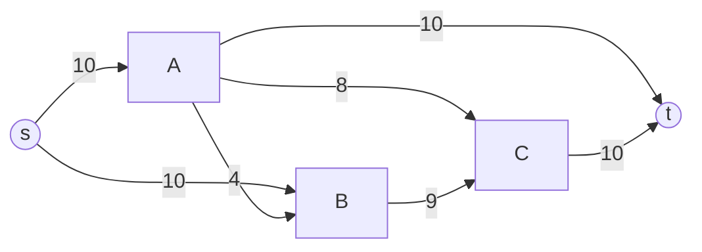
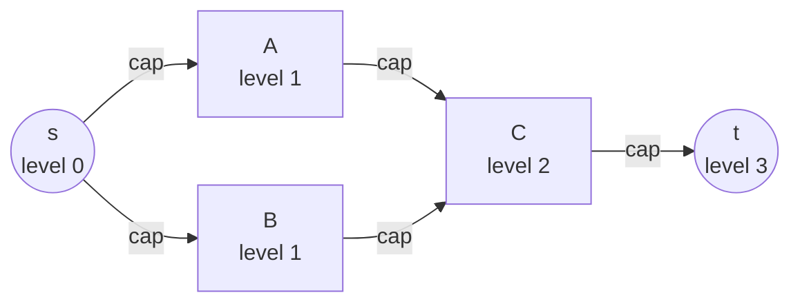
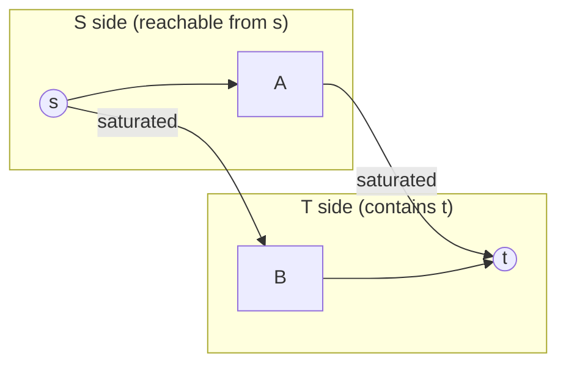

# Maximum Flow (Dinic's Algorithm), Minimum Cut, and Max-Flow–Min-Cut Duality

Maximum flow is one of the most powerful modeling tools in competitive programming and
combinatorial optimization. A surprising number of problems — bipartite matching, vertex-disjoint
paths, project selection, image segmentation, scheduling — reduce to *"push as much flow as
possible from a source to a sink through a capacitated network."* This guide builds the theory
from first principles, develops **Dinic's algorithm** as the workhorse solver, proves the
**max-flow–min-cut theorem**, and shows how to actually **recover the minimum cut** from the
residual graph.

---

## Table of Contents

1. [Flow Networks: Capacities, Source, Sink, Conservation](#1-flow-networks)
2. [Residual Graph and Augmenting Paths](#2-residual-graph-and-augmenting-paths)
3. [Ford–Fulkerson and Edmonds–Karp](#3-fordfulkerson-and-edmonionskarp)
4. [Dinic's Algorithm](#4-dinics-algorithm)
5. [The Max-Flow–Min-Cut Theorem](#5-the-max-flowmin-cut-theorem)
6. [Recovering the Minimum Cut](#6-recovering-the-minimum-cut)
7. [Reusable Dinic Implementation (Python + C++)](#7-reusable-dinic-implementation)
8. [Common Pitfalls](#8-common-pitfalls)
9. [Patterns and Reductions](#9-patterns-and-reductions)
10. [Complexity Summary](#10-complexity-summary)

---

## 1. Flow Networks

A **flow network** is a directed graph $G = (V, E)$ together with:

- a **capacity** function $c : V \times V \to \mathbb{R}_{\ge 0}$, where $c(u,v) = 0$ if there is no edge $u \to v$;
- a distinguished **source** $s$ and **sink** (target) $t$.

A **flow** is a function $f : V \times V \to \mathbb{R}$ satisfying three constraints:

**Capacity constraint** — you cannot send more than the edge allows:
$$0 \le f(u,v) \le c(u,v) \qquad \forall (u,v) \in E.$$

**Skew symmetry** (a bookkeeping convention) — flow on $u \to v$ is the negative of flow on $v \to u$:
$$f(u,v) = -f(v,u).$$

**Flow conservation** — every internal node passes through exactly what it receives. For all
$v \in V \setminus \{s, t\}$:
$$\sum_{u \in V} f(u, v) \;=\; \sum_{w \in V} f(v, w).$$

The **value** of the flow is the net amount leaving the source (equivalently, the net amount
arriving at the sink):
$$|f| \;=\; \sum_{v \in V} f(s, v) \;=\; \sum_{v \in V} f(v, t).$$

The **maximum flow problem** asks for a flow of maximum value.



In the network above, edge labels are capacities. The goal is to route the largest possible
quantity from $s$ to $t$ without violating any capacity and keeping every internal node balanced.

---

## 2. Residual Graph and Augmenting Paths

The key algorithmic idea is the **residual graph** $G_f$. Given a flow $f$, the **residual
capacity** of an ordered pair $(u, v)$ is how much *additional* flow we can push:
$$c_f(u,v) \;=\; c(u,v) - f(u,v).$$

Two kinds of residual edges arise:

- **Forward residual edge** $u \to v$ with capacity $c(u,v) - f(u,v)$ — the slack still available.
- **Backward residual edge** $v \to u$ with capacity $f(u,v)$ — the ability to *cancel* flow we
  already sent, redirecting it elsewhere. This "undo" capability is what makes greedy augmentation
  provably optimal.

An **augmenting path** is any directed path from $s$ to $t$ in $G_f$ using only edges with
$c_f > 0$. Its **bottleneck** is the minimum residual capacity along it. Pushing the bottleneck
amount along the path increases $|f|$ by exactly that amount and keeps all constraints satisfied.

> **Core loop of every max-flow algorithm:** while an augmenting path exists in $G_f$, push flow
> along it. The algorithms differ only in *how they choose* the augmenting path(s).

When no augmenting path remains, the flow is maximum (proved in §5).

---

## 3. Ford–Fulkerson and Edmonds–Karp

**Ford–Fulkerson** is the generic method: repeatedly find *any* augmenting path (e.g., via DFS)
and saturate its bottleneck. With integer capacities it terminates, and each augmentation raises
the flow by at least 1, giving $O(E \cdot |f^*|)$ — which can be terrible if capacities are large
and path choice is adversarial.

**Edmonds–Karp** fixes the path selection: always pick the **shortest** augmenting path (fewest
edges) using **BFS**. One can prove the BFS distance from $s$ to any vertex never decreases across
augmentations, and each edge becomes "critical" (saturated and removed) at most $O(V)$ times.
This yields:

$$T_{\text{Edmonds–Karp}} = O(V E^2),$$

independent of capacity magnitudes. It is simple and a fine baseline, but for dense graphs Dinic
is strictly better.

```text
EdmondsKarp(s, t):
    flow = 0
    while BFS finds a shortest s→t path P in residual graph:
        b = min residual capacity along P        # bottleneck
        push b along P (update forward & reverse) # augment
        flow += b
    return flow
```

---

## 4. Dinic's Algorithm

**Dinic's algorithm** accelerates Edmonds–Karp by augmenting along **many shortest paths at once**.
It alternates two phases until the sink becomes unreachable:

**Phase A — BFS to build the level graph.** Run BFS from $s$ over residual edges, assigning each
vertex a `level` equal to its BFS distance. Only edges going from level $\ell$ to level $\ell + 1$
are kept. If $t$ is unreachable, we are done.

**Phase B — DFS to find a blocking flow.** Inside the level graph, repeatedly send flow along
$s \to t$ paths until no more can be pushed (a *blocking flow*). The crucial optimizations:

- **Iterator / pointer pruning** (`it[]` array): each vertex remembers which outgoing edge it last
  explored, so we never re-scan saturated edges within one phase.
- **Dead-edge pruning**: if a DFS from a vertex returns 0 (cannot reach $t$), we advance its
  iterator, effectively deleting that edge for this phase.

Each phase strictly increases the shortest $s\to t$ distance, so there are at most $V - 1$ phases.

```text
Dinic(s, t):
    flow = 0
    while BFS(s, t) assigns levels and reaches t:   # Phase A
        reset iterators it[v] = first edge of v
        while pushed = DFS(s, t, INF) > 0:          # Phase B (blocking flow)
            flow += pushed
    return flow

DFS(u, t, pushed):
    if u == t: return pushed
    while it[u] valid:
        e = edge at it[u]
        if cap[e] > 0 and level[v] == level[u] + 1:
            d = DFS(v, t, min(pushed, cap[e]))
            if d > 0:
                cap[e]   -= d        # consume forward capacity
                cap[e^1] += d        # restore reverse (undo) capacity
                return d
        it[u]++                       # dead edge: skip it next time
    return 0
```

**Complexity.**

$$T_{\text{Dinic}} = O(V^2 E) \quad \text{in general.}$$

For **unit-capacity** networks (and bipartite matching), the bound sharpens dramatically to

$$T_{\text{Dinic, unit}} = O\!\left(E \sqrt{V}\right),$$

which is why Dinic is the standard choice for matching and disjoint-paths problems.



The level graph above only keeps edges that climb exactly one level; DFS pushes blocking flow
through this layered DAG.

---

## 5. The Max-Flow–Min-Cut Theorem

An **s–t cut** $(S, T)$ partitions the vertices into two sets with $s \in S$ and $t \in T$. Its
**capacity** is the total capacity of edges crossing from $S$ to $T$ (forward edges only):
$$c(S, T) \;=\; \sum_{u \in S} \sum_{v \in T} c(u, v).$$

**Theorem (Ford–Fulkerson, 1956).** In any flow network, the maximum value of an $s$–$t$ flow
equals the minimum capacity of an $s$–$t$ cut:

$$\boxed{\;\max\text{-flow} \;=\; \min\text{-cut}\;}$$

**Intuition / proof sketch.** Three statements are equivalent:

1. $f$ is a maximum flow.
2. There is no augmenting path in $G_f$.
3. There exists a cut $(S, T)$ with $c(S, T) = |f|$.

- **$(1 \Rightarrow 2)$**: if an augmenting path existed we could push more flow, contradicting
  maximality.
- **$(2 \Rightarrow 3)$**: let $S$ be the set of vertices reachable from $s$ in $G_f$. Since $t$ is
  unreachable, $t \in T = V \setminus S$. Every edge $u \to v$ crossing from $S$ to $T$ must be
  **saturated** ($f(u,v) = c(u,v)$), otherwise $v$ would be reachable; and every edge from $T$
  back into $S$ carries **zero** flow, otherwise its reverse residual edge would make a $T$-vertex
  reachable. Therefore the net flow across the cut equals its full capacity, so $|f| = c(S,T)$.
- **$(3 \Rightarrow 1)$**: for *any* flow and *any* cut, $|f| \le c(S,T)$ (flow across a cut cannot
  exceed its capacity). So a flow that meets some cut's capacity must be maximum, and that cut must
  be minimum.

This duality is the reason "minimize the cut" problems are solved by "maximize the flow."



The two **saturated** edges crossing $S \to T$ form the minimum cut; their total capacity equals
the max-flow value.

---

## 6. Recovering the Minimum Cut

The proof above is *constructive* — it tells us exactly how to extract a concrete minimum cut once
the flow is maximum:

1. Run Dinic to completion to obtain the maximum flow and the final **residual** graph.
2. From $s$, run a BFS/DFS using only residual edges with $c_f > 0$. Let $S$ be the set of reached
   vertices. (This is precisely the last failed BFS of Dinic — $t \notin S$.)
3. The **minimum cut edges** are the *original* directed edges $u \to v$ with $u \in S$ and
   $v \notin S$. Equivalently, they are the **saturated** edges leaving the reachable region.

For **Police-Chase-style** problems where every edge has capacity 1 (or you want the *actual edges*
to remove), iterate over the original edge list and output every edge whose tail is reachable and
whose head is not. The number of such edges equals the max-flow value.

```text
min_cut_edges(dinic, s):
    reachable = BFS over residual edges with cap > 0 starting from s
    cut = []
    for each ORIGINAL edge (u -> v):
        if reachable[u] and not reachable[v]:
            cut.append((u, v))      # this edge is saturated and crosses the cut
    return cut
```

> **Tip:** store, for each original input edge, the index of its forward arc in the Dinic edge
> list. Then "is this edge saturated?" is just `cap[forward] == 0`, and "does it cross the cut?" is
> `reachable[u] && !reachable[v]`.

---

## 7. Reusable Dinic Implementation

We store edges in a single flat **edge list**. Each undirected pair is two entries: a forward edge
and its reverse. Because they are added consecutively, edge `e` and its twin are related by the
**index XOR trick**: the reverse of edge `e` is `e ^ 1`. Pushing $d$ units does
`cap[e] -= d; cap[e^1] += d`.

### Python

```python
from collections import deque

INF = float("inf")  # large sentinel; flows/caps fit in Python's arbitrary ints

class Dinic:
    def __init__(self, n):
        self.n = n
        self.graph = [[] for _ in range(n)]  # graph[u] = list of edge indices
        self.to = []        # to[e]   = head vertex of edge e
        self.cap = []       # cap[e]  = residual capacity of edge e
        self.level = [0] * n
        self.it = [0] * n   # iterator: next unexplored edge per vertex

    def add_edge(self, u, v, c):
        # forward edge e, reverse edge e+1 (so reverse of e is e ^ 1)
        self.graph[u].append(len(self.to)); self.to.append(v); self.cap.append(c)
        self.graph[v].append(len(self.to)); self.to.append(u); self.cap.append(0)

    def _bfs(self, s, t):
        self.level = [-1] * self.n
        self.level[s] = 0
        q = deque([s])
        while q:
            u = q.popleft()
            for e in self.graph[u]:
                v = self.to[e]
                if self.cap[e] > 0 and self.level[v] < 0:   # residual & unvisited
                    self.level[v] = self.level[u] + 1
                    q.append(v)
        return self.level[t] >= 0                            # is sink reachable?

    def _dfs(self, u, t, pushed):
        if u == t:
            return pushed
        while self.it[u] < len(self.graph[u]):
            e = self.graph[u][self.it[u]]
            v = self.to[e]
            if self.cap[e] > 0 and self.level[v] == self.level[u] + 1:
                d = self._dfs(v, t, min(pushed, self.cap[e]))
                if d > 0:
                    self.cap[e]     -= d    # consume forward capacity
                    self.cap[e ^ 1] += d    # restore reverse (undo) capacity
                    return d
            self.it[u] += 1                 # dead edge: never revisit this phase
        return 0

    def max_flow(self, s, t):
        flow = 0
        while self._bfs(s, t):              # Phase A: build level graph
            self.it = [0] * self.n
            while True:                     # Phase B: blocking flow
                pushed = self._dfs(s, t, INF)
                if pushed == 0:
                    break
                flow += pushed
        return flow

    def min_cut_reachable(self, s):
        # vertices reachable from s in the FINAL residual graph (the S side)
        seen = [False] * self.n
        seen[s] = True
        q = deque([s])
        while q:
            u = q.popleft()
            for e in self.graph[u]:
                v = self.to[e]
                if self.cap[e] > 0 and not seen[v]:
                    seen[v] = True
                    q.append(v)
        return seen
```

### C++

```cpp
#include <bits/stdc++.h>
using namespace std;
using ll = long long;
const ll INF = (ll)4e18;            // large sentinel for capacities/flow

struct Dinic {
    int n;
    vector<int> to;                 // to[e]  = head vertex of edge e
    vector<ll>  cap;                // cap[e] = residual capacity of edge e
    vector<vector<int>> graph;      // graph[u] = list of edge indices
    vector<int> level, it;          // BFS levels & per-vertex iterators

    Dinic(int n) : n(n), graph(n), level(n), it(n) {}

    void add_edge(int u, int v, ll c) {
        // forward edge e, reverse edge e+1 (reverse of e is e ^ 1)
        graph[u].push_back((int)to.size()); to.push_back(v); cap.push_back(c);
        graph[v].push_back((int)to.size()); to.push_back(u); cap.push_back(0);
    }

    bool bfs(int s, int t) {
        fill(level.begin(), level.end(), -1);
        level[s] = 0;
        queue<int> q; q.push(s);
        while (!q.empty()) {
            int u = q.front(); q.pop();
            for (int e : graph[u]) {
                int v = to[e];
                if (cap[e] > 0 && level[v] < 0) {       // residual & unvisited
                    level[v] = level[u] + 1;
                    q.push(v);
                }
            }
        }
        return level[t] >= 0;                            // is sink reachable?
    }

    ll dfs(int u, int t, ll pushed) {
        if (u == t) return pushed;
        for (int &i = it[u]; i < (int)graph[u].size(); ++i) {
            int e = graph[u][i], v = to[e];
            if (cap[e] > 0 && level[v] == level[u] + 1) {
                ll d = dfs(v, t, min(pushed, cap[e]));
                if (d > 0) {
                    cap[e]     -= d;        // consume forward capacity
                    cap[e ^ 1] += d;        // restore reverse (undo) capacity
                    return d;
                }
            }
        }
        return 0;                            // dead end for this phase
    }

    ll max_flow(int s, int t) {
        ll flow = 0;
        while (bfs(s, t)) {                  // Phase A: build level graph
            fill(it.begin(), it.end(), 0);
            while (ll pushed = dfs(s, t, INF)) // Phase B: blocking flow
                flow += pushed;
        }
        return flow;
    }

    vector<char> min_cut_reachable(int s) {
        // vertices reachable from s in the FINAL residual graph (the S side)
        vector<char> seen(n, 0);
        seen[s] = 1;
        queue<int> q; q.push(s);
        while (!q.empty()) {
            int u = q.front(); q.pop();
            for (int e : graph[u]) {
                int v = to[e];
                if (cap[e] > 0 && !seen[v]) { seen[v] = 1; q.push(v); }
            }
        }
        return seen;
    }
};
```

---

## 8. Common Pitfalls

- **Reverse-edge XOR trick.** Always add the forward and reverse edges *consecutively* so that
  `e ^ 1` is the twin. Pushing flow must do `cap[e] -= d; cap[e ^ 1] += d`. Forgetting the reverse
  edge breaks the "undo" mechanism and silently produces wrong (too small) flows.
- **Integer overflow.** Capacities can be large; summed bottlenecks even larger. Use `long long`
  in C++ and a big `INF` like `4e18` (not `INT_MAX`, which overflows when used as a DFS bound).
- **Antiparallel edges.** If the input has both $u \to v$ and $v \to u$ as *real* capacitated
  edges, the flat edge-list / XOR scheme handles them automatically: each `add_edge` call creates
  its own forward+reverse pair, so a real $v \to u$ edge is independent of the residual reverse of
  $u \to v$. (The classic textbook pitfall only bites adjacency-matrix implementations.)
- **Re-scanning saturated edges.** Without the iterator `it[]` pruning, the DFS degenerates and the
  $O(V^2 E)$ bound is lost. Reset `it[]` at the start of every BFS phase, never mid-phase.
- **Directed vs. undirected.** For an *undirected* edge of capacity $c$, add it with capacity $c$ in
  **both** directions (i.e. `add_edge(u, v, c)` with the reverse arc also given capacity $c$, or
  call a helper that sets both forward residuals to $c$).

---

## 9. Patterns and Reductions

- **Bipartite matching = unit-capacity flow.** Add source $s \to$ every left vertex (cap 1), every
  right vertex $\to t$ (cap 1), and each allowed pair as a left→right edge (cap 1). The max flow
  equals the maximum matching, computed in $O(E\sqrt V)$ by Dinic. By **König's theorem**, the
  minimum vertex cover equals this matching, recoverable from residual reachability.
- **Vertex capacities via node splitting.** To cap *how much flow passes through a vertex* $v$,
  split it into $v_{\text{in}} \to v_{\text{out}}$ with capacity equal to the vertex limit; route
  all incoming edges to $v_{\text{in}}$ and all outgoing from $v_{\text{out}}$. This also models
  **vertex-disjoint paths**.
- **Edge-disjoint paths.** The maximum number of edge-disjoint $s\to t$ paths equals the max flow
  when every edge has capacity 1 (Menger's theorem). Decompose the integral flow into paths to
  recover them.
- **Minimum cut / "remove fewest edges to disconnect".** Solve max flow, then take the residual
  reachable set $S$; the crossing edges are the answer (see §6). CSES *Police Chase* is exactly this.

---

## 10. Complexity Summary

| Algorithm | Path selection | Time complexity | Notes |
|---|---|---|---|
| Ford–Fulkerson | any (DFS) | $O(E \cdot \lvert f^*\rvert)$ | depends on capacity magnitude; can be slow |
| Edmonds–Karp | shortest (BFS) | $O(V E^2)$ | capacity-independent; simple baseline |
| **Dinic** | level graph + blocking flow | $O(V^2 E)$ | default general-purpose solver |
| Dinic (unit caps) | level graph + blocking flow | $O(E \sqrt{V})$ | bipartite matching, disjoint paths |

Key identities to remember:

$$\sum_{u} f(u, v) = \sum_{w} f(v, w) \quad (v \ne s, t) \qquad\text{(conservation)},$$

$$|f| \le c(S, T) \ \text{for every cut} \qquad\Longrightarrow\qquad \max\text{-flow} = \min\text{-cut}.$$

Dinic gives both the optimal flow value **and**, via residual reachability, the optimal cut — two
answers from one run.
