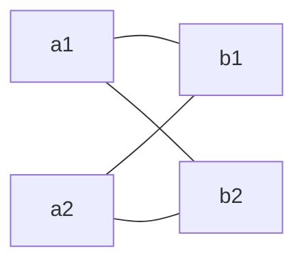
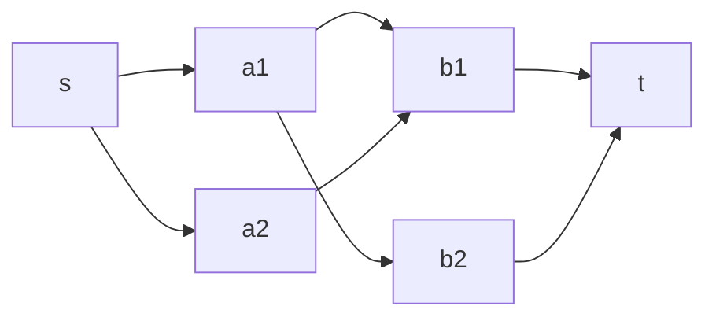
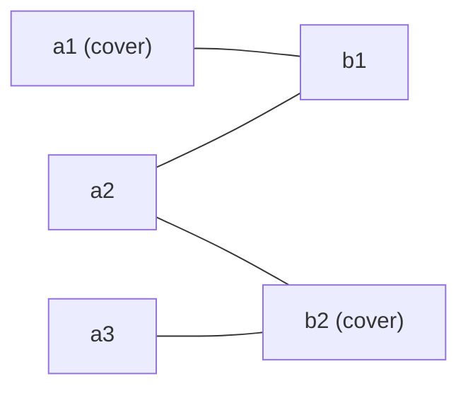

# Bipartite Matching — Kuhn, Hopcroft–Karp, and König's Theorem

A **matching** is one of the most useful objects in combinatorial optimization: a set of edges
that pair up vertices so that no vertex is used twice. In **bipartite** graphs the theory is
especially beautiful — augmenting paths give a clean algorithm for the *maximum* matching, and a
deep duality (**König's theorem**) ties that maximum matching to the *minimum vertex cover* and to
the *maximum independent set*. This guide develops the full picture: Berge's lemma, Kuhn's
augmenting-path algorithm, Hopcroft–Karp, the reduction to max flow, and the constructive recovery
of the min vertex cover and max independent set, with pseudocode plus Python and C++ for each core
routine.

---

## Table of Contents
1. [Matchings: Definitions](#matchings-definitions)
2. [Augmenting Paths and Berge's Lemma](#augmenting-paths-and-berges-lemma)
3. [Kuhn's Algorithm](#kuhns-algorithm)
4. [Hopcroft–Karp](#hopcroftkarp)
5. [Reduction to Unit-Capacity Max Flow](#reduction-to-unit-capacity-max-flow)
6. [König's Theorem: Max Matching = Min Vertex Cover](#königs-theorem-max-matching--min-vertex-cover)
7. [Recovering the Minimum Vertex Cover](#recovering-the-minimum-vertex-cover)
8. [Maximum Independent Set Duality](#maximum-independent-set-duality)
9. [Hall's Marriage Theorem](#halls-marriage-theorem)
10. [Complexity Summary](#complexity-summary)
11. [Common Pitfalls](#common-pitfalls)
12. [Patterns](#patterns)

---

## Matchings: Definitions

Let $G = (V, E)$ be a graph. A **matching** $M \subseteq E$ is a set of edges no two of which share
a vertex. A vertex incident to an edge of $M$ is **matched** (or *saturated*); otherwise it is
**free** (or *exposed*).

- A **maximal** matching cannot be extended by adding a single edge (a local property).
- A **maximum** matching has the largest possible number of edges (a global property).
- A **perfect** matching saturates every vertex (only possible when $|V|$ is even).

Maximal is easy (greedy), but **maximum** is what we want. The two differ:



Picking `a1—b1` greedily is *maximal* but blocks `a2`; the *maximum* matching `a1—b2, a2—b1`
pairs everyone. The fix for this gap is the augmenting path.

A **bipartite** graph splits its vertices into two disjoint sides $L$ (left) and $R$ (right) so
that every edge goes between the sides. We store the pairing in two arrays:

- `matchL[u]` = the right vertex matched to left vertex `u`, or `-1`.
- `matchR[v]` = the left vertex matched to right vertex `v`, or `-1`.

---

## Augmenting Paths and Berge's Lemma

Fix a matching $M$. An **alternating path** is a path whose edges alternate between *not in $M$*
and *in $M$*. An **augmenting path** is an alternating path whose **both endpoints are free**.

Because the endpoints are free, an augmenting path has odd length and contains one more
non-matching edge than matching edge. If we **flip** every edge along it (matched $\leftrightarrow$
unmatched), the result is still a valid matching, and it has **one more edge**:

```mermaid
graph LR
    F1["free L"] -. "unmatched" .- M1["R"]
    M1 == "matched" == M2["L"]
    M2 -. "unmatched" .- M3["R"]
    M3 == "matched" == M4["L"]
    M4 -. "unmatched" .- F2["free R"]
```

Flipping the dotted (unmatched) and solid (matched) edges along `free L … free R` turns 2 matched
edges into 3 matched edges.

**Berge's Lemma.** A matching $M$ is **maximum** if and only if there is **no augmenting path**
with respect to $M$.

*Proof sketch.* If an augmenting path exists, flipping it yields a larger matching, so $M$ is not
maximum. Conversely, suppose $M$ is not maximum and let $M^{*}$ be a larger matching. Consider the
symmetric difference $M \oplus M^{*}$: every vertex has degree $\le 2$ in it, so it decomposes into
simple paths and even cycles that **alternate** between $M$ and $M^{*}$. Cycles use equal numbers
of $M$ and $M^{*}$ edges. Since $|M^{*}| > |M|$, some component must be a path with more $M^{*}$
edges than $M$ edges — that path is augmenting for $M$. $\blacksquare$

Berge's lemma turns "find a maximum matching" into "**repeatedly find an augmenting path** until
none remains." That is exactly what Kuhn's algorithm does.

---

## Kuhn's Algorithm

Kuhn's algorithm searches for an augmenting path from each left vertex using DFS. When it tries to
match left vertex `u` to right vertex `v`:

- if `v` is free, match `u—v` directly;
- if `v` is already taken by `w = matchR[v]`, *recursively* try to re-home `w` to some other right
  vertex. If `w` succeeds, `v` is freed for `u`. This recursion **is** the augmenting path: it
  reassigns matched vertices along an alternating chain.

### Pseudocode

```text
function try_kuhn(u):
    for v in adj[u]:
        if not visited[v]:
            visited[v] = true
            if matchR[v] == -1 or try_kuhn(matchR[v]):
                matchL[u] = v
                matchR[v] = u
                return true
    return false

function max_matching():
    matchL[*] = matchR[*] = -1
    result = 0
    for u in L:
        visited[*] = false          # reset BEFORE each augmentation attempt
        if try_kuhn(u):
            result += 1
    return result
```

The `visited` array marks right vertices already explored **in the current attempt**, preventing
infinite loops along alternating cycles. It must be reset before each new left vertex `u`.

### Python

```python
import sys
from sys import setrecursionlimit

def kuhn(adj, n_left, n_right):
    # adj[u] = list of right vertices reachable from left vertex u (0-indexed)
    setrecursionlimit(1 << 20)
    matchL = [-1] * n_left          # left  -> right partner, or -1
    matchR = [-1] * n_right         # right -> left  partner, or -1

    def try_kuhn(u):
        for v in adj[u]:
            if not visited[v]:
                visited[v] = True               # explore right vertex v once per attempt
                # v is free, or its owner can be re-homed along an alternating path
                if matchR[v] == -1 or try_kuhn(matchR[v]):
                    matchL[u] = v
                    matchR[v] = u
                    return True
        return False

    result = 0
    for u in range(n_left):
        visited = [False] * n_right             # RESET visited before each augmentation
        if try_kuhn(u):
            result += 1
    return result, matchL, matchR
```

### C++

```cpp
#include <bits/stdc++.h>
using namespace std;

vector<int> adj[100005];   // adj[u] = right vertices reachable from left vertex u (0-indexed)
int matchL[100005];        // left  -> right partner, or -1
int matchR[100005];        // right -> left  partner, or -1
vector<char> visited;      // per-attempt mark on right vertices

bool try_kuhn(int u) {
    for (int v : adj[u]) {
        if (!visited[v]) {
            visited[v] = 1;                       // explore right vertex v once per attempt
            // v is free, or its owner can be re-homed along an alternating path
            if (matchR[v] == -1 || try_kuhn(matchR[v])) {
                matchL[u] = v;
                matchR[v] = u;
                return true;
            }
        }
    }
    return false;
}

int max_matching(int nLeft, int nRight) {
    fill(matchL, matchL + nLeft, -1);
    fill(matchR, matchR + nRight, -1);
    int result = 0;
    for (int u = 0; u < nLeft; ++u) {
        visited.assign(nRight, 0);                // RESET visited before each augmentation
        if (try_kuhn(u)) ++result;
    }
    return result;
}
```

**Complexity.** Each of the $|L|$ augmentation attempts runs a DFS that touches each edge at most
once: $O(E)$ per attempt, so $O(V \cdot E)$ overall. In practice it is far faster, and a common
optimization (greedy initial matching, or shuffling `adj`) makes it fly on contest inputs.

---

## Hopcroft–Karp

Kuhn augments **one path at a time**. **Hopcroft–Karp** augments along **many shortest augmenting
paths simultaneously**, which provably cuts the number of phases to $O(\sqrt{V})$.

Each **phase** has two parts:

1. **BFS** from all free left vertices, computing the layer (distance) of each left vertex along
   alternating paths. This finds the length of the *shortest* augmenting path and partitions
   vertices into layers.
2. **DFS** that greedily finds a *maximal set of vertex-disjoint shortest augmenting paths* using
   those layers, and flips them all.

Why $O(\sqrt{V})$ phases? After phase $k$, the shortest augmenting path has length $> k$. Short
augmenting paths ($\le \sqrt{V}$) are exhausted within $O(\sqrt{V})$ phases; once the shortest path
exceeds $\sqrt{V}$, at most $O(\sqrt{V})$ augmenting paths remain (they are vertex-disjoint and long),
so $O(\sqrt{V})$ more phases finish the job. Each phase is $O(E)$.

$$\text{Hopcroft–Karp: } O\!\big(E \sqrt{V}\big)$$

Use Hopcroft–Karp when $V, E$ are large (say $V \gtrsim 10^4$ with dense edges); Kuhn is simpler and
plenty fast for the typical $V \le 10^3$ contest matching.

---

## Reduction to Unit-Capacity Max Flow

Bipartite matching is the canonical special case of **max flow**:

- Add a **source** $s$ and a **sink** $t$.
- Edge $s \to u$ of capacity $1$ for each left vertex $u$.
- Edge $u \to v$ of capacity $1$ for each original edge $(u, v)$.
- Edge $v \to t$ of capacity $1$ for each right vertex $v$.



A unit of integral flow on $u \to v$ means "match $u$ with $v$." Unit capacities force each vertex to
carry at most one matched edge, so the **maximum integral flow equals the maximum matching**. Running
Dinic's algorithm on this unit-capacity graph runs in $O(E \sqrt{V})$ — the same bound as
Hopcroft–Karp, of which it is essentially a generalization. The flow view also gives König's theorem
for free via **max-flow min-cut**.

---

## König's Theorem: Max Matching = Min Vertex Cover

A **vertex cover** is a set of vertices $C$ such that every edge has at least one endpoint in $C$.
For *any* graph, $|VC^{*}| \ge |M^{*}|$ (each matching edge needs its own cover vertex). In
**bipartite** graphs the bound is tight:

**König's Theorem.** In a bipartite graph, the size of a maximum matching equals the size of a
minimum vertex cover:

$$|M^{*}| = |VC^{*}|.$$

*Constructive proof (alternating reachability).* Let $M^{*}$ be a maximum matching. Let $U \subseteq L$
be the **free** left vertices. Run alternating BFS/DFS from $U$: follow **unmatched** edges
$L \to R$ and **matched** edges $R \to L$. Let $Z$ be the set of all vertices reachable this way
(including $U$). Define the cover

$$C = (L \setminus Z) \;\cup\; (R \cap Z).$$

We claim $C$ is a vertex cover with $|C| = |M^{*}|$.

- **$C$ covers every edge.** Take an edge $(u, v)$, $u \in L$, $v \in R$. If $u \in L \setminus Z$ it
  is covered. Otherwise $u \in Z$. If $(u,v)$ is unmatched, the alternating search would step from
  $u$ to $v$, so $v \in R \cap Z$ — covered. If $(u,v)$ is matched, then $u$ reached $Z$ via this
  matched edge from $v$, so again $v \in Z$ — covered.
- **$|C| = |M^{*}|$.** Every vertex of $C$ is matched: a free left vertex is in $Z$ (it's in $U$), so
  $L \setminus Z$ contains only matched left vertices; and any matched right vertex's partner reasoning
  shows $R \cap Z$ vertices are matched too. No matching edge is counted twice (one cannot have its
  left endpoint in $L \setminus Z$ *and* right endpoint in $R \cap Z$ — that would require the left
  endpoint matched yet unreached while its matched partner is reached, a contradiction). Hence
  $|C| = |M^{*}|$. $\blacksquare$

This equals the max-flow min-cut theorem applied to the flow network above: the min $s$–$t$ cut
corresponds exactly to this vertex cover.



Here the maximum matching has size 2 (`a1—b1`, `a2—b2`) and the minimum vertex cover
$\{a_1, b_2\}$ also has size 2 — every edge touches `a1` or `b2`.

---

## Recovering the Minimum Vertex Cover

The proof is constructive, so we can *output* a minimum vertex cover after running Kuhn:

1. Run Kuhn to get `matchL`, `matchR`.
2. Find free left vertices `U = { u : matchL[u] == -1 }`.
3. Alternating DFS from `U`: from a left vertex follow **all** edges to right vertices; from a right
   vertex follow only its **matched** edge back to a left vertex. Mark reached left (`visL`) and
   right (`visR`) vertices.
4. Cover $= (L \setminus visL) \cup (R \cap visR)$.

### Python

```python
def min_vertex_cover(adj, n_left, n_right, matchL, matchR):
    visL = [False] * n_left
    visR = [False] * n_right

    def alt_dfs(u):
        visL[u] = True
        for v in adj[u]:                 # follow unmatched L->R edges outward
            if not visR[v]:
                visR[v] = True
                w = matchR[v]            # then the matched R->L edge back
                if w != -1 and not visL[w]:
                    alt_dfs(w)

    for u in range(n_left):
        if matchL[u] == -1:              # start from FREE left vertices
            alt_dfs(u)

    # cover = unreached left  +  reached right
    left_cover  = [u for u in range(n_left)  if not visL[u]]
    right_cover = [v for v in range(n_right) if visR[v]]
    return left_cover, right_cover
```

### C++

```cpp
vector<char> visL, visR;

void alt_dfs(int u) {
    visL[u] = 1;
    for (int v : adj[u]) {               // follow unmatched L->R edges outward
        if (!visR[v]) {
            visR[v] = 1;
            int w = matchR[v];           // then the matched R->L edge back
            if (w != -1 && !visL[w]) alt_dfs(w);
        }
    }
}

// returns (left_cover, right_cover)
pair<vector<int>, vector<int>> min_vertex_cover(int nLeft, int nRight) {
    visL.assign(nLeft, 0);
    visR.assign(nRight, 0);
    for (int u = 0; u < nLeft; ++u)
        if (matchL[u] == -1) alt_dfs(u); // start from FREE left vertices

    vector<int> leftCover, rightCover;
    for (int u = 0; u < nLeft;  ++u) if (!visL[u]) leftCover.push_back(u);  // unreached left
    for (int v = 0; v < nRight; ++v) if ( visR[v]) rightCover.push_back(v); // reached right
    return {leftCover, rightCover};
}
```

---

## Maximum Independent Set Duality

A **maximum independent set (MIS)** is the largest set of vertices with no edge between any two of
them. The complement of a vertex cover is always an independent set (if a set covers every edge, the
remaining vertices have no edge entirely inside them). Therefore, for **any** graph,

$$|MIS^{*}| = |V| - |VC^{*}|.$$

Combining with König's theorem, in a **bipartite** graph:

$$|MIS^{*}| = |V| - |M^{*}|.$$

So all three quantities are computed from one matching run: the maximum matching gives the minimum
vertex cover (König), and the complement of that cover is the maximum independent set. (Finding MIS
is NP-hard in general graphs — bipartiteness is what makes it polynomial.)

---

## Hall's Marriage Theorem

Hall's theorem characterizes when **every** left vertex can be matched (a *perfect matching of $L$
into $R$*). For $S \subseteq L$ let $N(S)$ be its neighborhood in $R$.

**Hall's Theorem.** A bipartite graph has a matching saturating $L$ **iff** $|N(S)| \ge |S|$ for
every $S \subseteq L$.

The "only if" is obvious (the matched partners of $S$ already need $|S|$ distinct right vertices).
The "if" direction follows from König/augmenting paths: if some $S$ violated the condition, an
unsaturatable left vertex would exist and no augmenting path could fix it. Hall's condition is the
theoretical reason augmenting-path algorithms succeed exactly when a saturating matching exists.

---

## Complexity Summary

| Algorithm / task | Time | Space | Notes |
|---|---|---|---|
| Kuhn (DFS augmenting) | $O(V \cdot E)$ | $O(V + E)$ | Simple; fast in practice for $V \le 10^3$ |
| Hopcroft–Karp | $O(E \sqrt{V})$ | $O(V + E)$ | BFS layers + multiple disjoint shortest paths |
| Dinic on unit-capacity flow | $O(E \sqrt{V})$ | $O(V + E)$ | Equivalent to Hopcroft–Karp |
| Min vertex cover recovery | $O(V + E)$ | $O(V + E)$ | One alternating DFS after matching |
| Max independent set (bipartite) | $O(V + E)$ | $O(V + E)$ | Complement of the vertex cover |

---

## Common Pitfalls

- **Forgetting to reset `visited` before each augmentation.** `visited` is *per-attempt* (scoped to
  one left vertex). Reset it before every call to `try_kuhn(u)`, not once globally — otherwise later
  left vertices cannot reuse right vertices and you undercount the matching.
- **1-indexing vs 0-indexing.** Inputs (CSES, etc.) are usually 1-indexed; convert to 0-indexed
  arrays consistently or keep sizes `n+1`. Mixing the two silently drops or duplicates vertices.
- **Sharing one `visited` across left and right vertices.** `visited` marks **right** vertices only.
- **Recursion depth.** Deep alternating chains can overflow the stack; in Python raise the recursion
  limit (or write an explicit stack); in C++ ensure the recursion is bounded by $V$.
- **Treating maximal as maximum.** A greedy matching is only maximal; you must run augmenting paths
  to reach the maximum.
- **Non-bipartite graphs.** König and the MIS duality hold *only* for bipartite graphs. General
  matching needs Blossom; general MIS/min-vertex-cover are NP-hard.

---

## Patterns

- **DAG minimum path cover.** The minimum number of vertex-disjoint paths covering all vertices of a
  DAG equals $V - (\text{max matching})$ of the bipartite "split graph" (each vertex appears as a left
  out-copy and a right in-copy, with an edge per DAG edge). Classic interview/contest reduction.
- **Assignment / task–worker problems.** "Assign each worker to a compatible task, maximize the
  number assigned" is directly maximum bipartite matching; weighted versions use the Hungarian
  algorithm / min-cost max-flow.
- **Board domino / grid tilings.** Cells two-color like a checkerboard → place dominoes = match
  adjacent black/white cells.
- **Minimum vertex cover / maximum independent set on bipartite graphs.** Use König to turn an
  NP-hard-sounding request into one matching run.
- **Hall feasibility checks.** "Can every item be assigned a distinct slot?" → test for an
  $L$-saturating matching.
