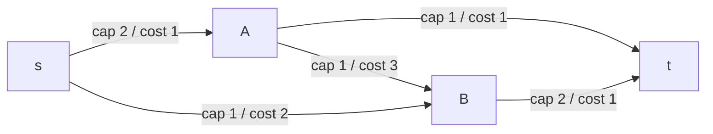
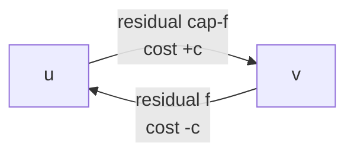

# Min-Cost Max-Flow (MCMF) — Successive Shortest Augmenting Paths

A **min-cost max-flow** problem asks for the *cheapest* way to push the *largest* amount of flow
from a source $s$ to a sink $t$. It generalizes ordinary maximum flow: among all maximum flows we
want the one whose total cost $\sum_e c_e f_e$ is minimal. This single primitive solves a
surprising range of combinatorial problems — the **assignment problem**, **transportation**,
**min-cost bipartite matching**, and **k edge-disjoint paths of minimum total length** — by writing
them as flow networks with per-unit edge costs.

This guide develops the theory (residual graph with costs, why reverse edges carry *negated*
cost), the **successive shortest paths** algorithm, how to find cheapest paths with **Bellman-Ford
/ SPFA** when negative reduced costs appear, and how **Johnson potentials** let us switch to the
much faster **Dijkstra**. It closes with a clean reusable `struct MCMF` in both Python and C++.

---

## Table of Contents
1. [The MCMF Problem](#the-mcmf-problem)
2. [Residual Graph with Costs](#residual-graph-with-costs)
3. [Successive Shortest Paths](#successive-shortest-paths)
4. [Finding Cheapest Paths with Bellman-Ford / SPFA](#finding-cheapest-paths-with-bellman-ford--spfa)
5. [Johnson Potentials → Dijkstra](#johnson-potentials--dijkstra)
6. [Sending Flow = Bottleneck](#sending-flow--bottleneck)
7. [Why This Is Optimal at Every Flow Value](#why-this-is-optimal-at-every-flow-value)
8. [Pseudocode](#pseudocode)
9. [Reusable MCMF — Python](#reusable-mcmf--python)
10. [Reusable MCMF — C++](#reusable-mcmf--c)
11. [Complexity](#complexity)
12. [Common Pitfalls](#common-pitfalls)
13. [Patterns](#patterns)

---

## The MCMF Problem

We are given a directed network $G = (V, E)$ with a **source** $s$ and **sink** $t$. Every edge
$(u, v)$ carries:

- a **capacity** $\text{cap}(u, v) \ge 0$ — the maximum flow it can hold, and
- a **cost** $c(u, v)$ — the price paid *per unit* of flow sent across it.

A flow $f$ assigns to each edge a value $0 \le f(u,v) \le \text{cap}(u,v)$ obeying conservation at
every vertex except $s$ and $t$. Its **value** is the net flow leaving $s$; its **cost** is

$$\text{cost}(f) = \sum_{(u,v) \in E} c(u,v) \, f(u,v).$$

The **min-cost max-flow** problem: among all flows of *maximum value* $F$, return one minimizing
$\text{cost}(f)$. The objective is

$$\min \sum_{e \in E} c_e f_e \quad \text{subject to } |f| = F \text{ (maximum).}$$

A useful variant is **min-cost flow of a fixed value $k$** (stop once $|f| = k$ instead of pushing
to the maximum), and **min-cost circulation** problems; the algorithm below handles all of these by
controlling when to stop augmenting.



Each edge is labeled `cap / cost`. We want to push as much flow as possible $s \to t$, breaking
ties by total price.

---

## Residual Graph with Costs

As in ordinary max-flow we maintain a **residual graph** $G_f$. For every original edge
$(u, v)$ with capacity $\text{cap}$ and cost $c$ we store two arcs:

- a **forward** arc $u \to v$ with residual capacity $\text{cap} - f(u,v)$ and cost $+c$, and
- a **reverse** arc $v \to u$ with residual capacity $f(u,v)$ and cost $-c$.

The reverse arc's **negated cost** is the heart of MCMF. Sending one unit back along $v \to u$
*cancels* one unit previously sent along $u \to v$, so we should be *refunded* the $c$ we paid —
hence cost $-c$. These negative-cost arcs are exactly why a plain Dijkstra is not enough out of the
box; they can create paths whose total cost is negative relative to naive edge weights.



We store each arc with fields `to`, `cap` (remaining capacity), `cost`, and an index `rev`
pointing to its paired reverse arc, so that pushing $\Delta$ units does
`e.cap -= Δ; rev.cap += Δ` in $O(1)$.

---

## Successive Shortest Paths

The algorithm is beautifully simple:

> Repeatedly find the **cheapest** (minimum-cost) path from $s$ to $t$ in the residual graph that
> still has positive residual capacity, and push as much flow along it as the bottleneck allows.
> Stop when no $s \to t$ path remains.

Because each augmentation always chooses the *currently cheapest* path, the total cost stays minimal
for the flow value reached so far (proved [below](#why-this-is-optimal-at-every-flow-value)). "Cost
of a path" means the sum of arc costs along it, and "cheapest" is shortest **by cost**, not by edge
count.

This differs from Edmonds–Karp (which picks the *shortest* augmenting path by edge count to maximize
flow). Here the shortest-path metric is **cost**, which is what keeps the result min-cost.

---

## Finding Cheapest Paths with Bellman-Ford / SPFA

The residual graph contains negative-cost arcs (the reverse edges), so **Dijkstra is invalid
directly** — its greedy "settled = final" invariant breaks under negative weights. The robust choice
is **Bellman-Ford**, or its queue-based optimization **SPFA** (Shortest Path Faster Algorithm).

SPFA relaxes edges using a FIFO queue of "active" vertices whose distance just improved:

- `dist[s] = 0`, all others $\infty$; push $s$.
- Pop $u$; for each residual arc $u \to v$ with `cap > 0`, if
  `dist[u] + cost(u,v) < dist[v]`, relax `dist[v]`, record the parent arc, and enqueue $v$ if not
  already queued.
- Continue until the queue empties. If `dist[t]` is finite, a cheapest augmenting path exists.

SPFA handles the negative reduced costs from reverse edges correctly. There are **no negative
cycles** in a residual graph of an optimal-so-far flow, so Bellman-Ford/SPFA terminates with valid
shortest paths.

---

## Johnson Potentials → Dijkstra

Bellman-Ford/SPFA costs $O(VE)$ per phase, which is slow for large graphs. **Johnson's technique**
restores Dijkstra by reweighting edges with **vertex potentials** $h(\cdot)$ so that every residual
edge has a **non-negative reduced cost**.

Define the **reduced cost** of arc $(u, v)$ as

$$c'(u, v) = c(u, v) + h(u) - h(v).$$

If the potentials satisfy $h(v) \le h(u) + c(u, v)$ for every residual arc (i.e. $h$ is a valid
shortest-distance function), then $c'(u, v) \ge 0$ everywhere, and Dijkstra on the reduced costs is
correct. Crucially, for any $s \to t$ path the potential terms telescope:

$$\sum c'(u,v) = \Big(\sum c(u,v)\Big) + h(s) - h(t),$$

so the **cheapest path under $c'$ is also the cheapest under the true cost $c$** — only a constant
$h(s) - h(t)$ differs. We recover the real distance and update potentials each phase.

**Initialization.** Set $h$ with a **single Bellman-Ford / SPFA run** from $s$ on the original costs
(needed because the initial graph may have negative edges; if all original costs are
non-negative you may initialize $h \equiv 0$).

**Update each phase.** After a Dijkstra phase producing reduced distances $d'(v)$, update

$$h(v) \leftarrow h(v) + d'(v) \quad \text{for every reachable } v.$$

This keeps reduced costs non-negative for the *next* phase, even though augmentation introduces new
reverse arcs. The result is **Dijkstra with potentials**, often written *MCMF with Johnson's
algorithm*, running far faster than repeated Bellman-Ford.

---

## Sending Flow = Bottleneck

Once a cheapest $s \to t$ path is found (via parent-arc pointers), the amount we push is the
**bottleneck** — the minimum residual capacity along the path:

$$\Delta = \min_{(u,v) \in P} \text{residual-cap}(u, v).$$

We then walk the path and update each arc: `e.cap -= Δ` and `rev.cap += Δ`. Total cost increases by
$\Delta \cdot \text{dist}(t)$ where $\text{dist}(t)$ is the *true* path cost. To push exactly $k$
units (fixed-value variant), cap $\Delta$ at the remaining demand.

---

## Why This Is Optimal at Every Flow Value

Let $\text{MinCost}(x)$ be the minimum cost to route exactly $x$ units of flow. A classical result:

> $\text{MinCost}(x)$ is a **convex**, piecewise-linear function of $x$, and its slope at value $x$
> equals the cost of the **cheapest augmenting path** in the current residual graph.

Each successive-shortest-paths augmentation uses the cheapest available path, i.e. the *smallest
possible slope increment*, so the running total stays on the lower convex envelope. By induction, if
the flow of value $x$ is min-cost, then augmenting along the cheapest path yields a min-cost flow of
value $x + \Delta$. The base case (zero flow, cost 0) is trivially optimal. Hence **every
intermediate flow is min-cost for its value**, which is precisely why the fixed-value variant works
by simply stopping early. Convexity also guarantees the chosen paths have *non-decreasing* cost, so
no negative cycle ever appears in the residual graph.

---

## Pseudocode

```text
function min_cost_max_flow(s, t):
    total_flow = 0
    total_cost = 0
    h = bellman_ford_potentials(s)          # init once; handles negative edges
    loop:
        # Dijkstra on reduced costs c'(u,v) = c(u,v) + h[u] - h[v]  >= 0
        dist[*] = INF; dist[s] = 0
        parent_edge[*] = NONE
        run Dijkstra by reduced cost, recording parent_edge
        if dist[t] == INF: break            # no augmenting path -> done

        for v reachable: h[v] += dist[v]     # update potentials (true dist now h[t]-h[s])

        # bottleneck along s->t path
        d = INF
        v = t
        while v != s:
            e = parent_edge[v]
            d = min(d, e.cap)
            v = e.from
        # push flow, update residual capacities
        v = t
        while v != s:
            e = parent_edge[v]
            e.cap     -= d
            rev(e).cap += d
            v = e.from

        total_flow += d
        total_cost += d * (h[t] - h[s])      # true cost of this path * units
    return (total_flow, total_cost)
```

A simpler-to-code variant replaces the Dijkstra+potentials block with a single **SPFA** that finds
cheapest paths directly on the true costs (no potentials needed). The reusable templates below use
**SPFA** for clarity and robustness; a note shows where Dijkstra+potentials would slot in.

---

## Reusable MCMF — Python

```python
from collections import deque

INF = float("inf")

class MCMF:
    """Min-cost max-flow via successive shortest paths (SPFA shortest path by cost)."""

    def __init__(self, n):
        self.n = n
        self.graph = [[] for _ in range(n)]   # adjacency: lists of edge indices
        self.edges = []                       # each edge: [to, cap, cost]

    def add_edge(self, u, v, cap, cost):
        # forward edge, then its reverse (cap 0, negated cost)
        self.graph[u].append(len(self.edges))
        self.edges.append([v, cap, cost])
        self.graph[v].append(len(self.edges))
        self.edges.append([u, 0, -cost])

    def _spfa(self, s, t):
        # cheapest path s->t by cost; returns (dist[t], parent_edge[]) or (INF, _)
        dist = [INF] * self.n
        in_queue = [False] * self.n
        parent = [-1] * self.n                # parent edge index reaching each node
        dist[s] = 0
        q = deque([s])
        in_queue[s] = True
        while q:
            u = q.popleft()
            in_queue[u] = False
            for eid in self.graph[u]:
                v, cap, cost = self.edges[eid]
                if cap > 0 and dist[u] + cost < dist[v]:
                    dist[v] = dist[u] + cost
                    parent[v] = eid
                    if not in_queue[v]:
                        q.append(v)
                        in_queue[v] = True
        return dist[t], parent

    def min_cost_max_flow(self, s, t, max_flow=INF):
        total_flow = 0
        total_cost = 0                        # use plain ints (Python is big-int safe)
        while total_flow < max_flow:
            d, parent = self._spfa(s, t)
            if d == INF:                      # no augmenting path -> done
                break
            # bottleneck along the path
            push = max_flow - total_flow
            v = t
            while v != s:
                eid = parent[v]
                push = min(push, self.edges[eid][1])
                v = self.edges[eid ^ 1][0]    # reverse edge's 'to' == this edge's 'from'
            # apply the flow, update residual capacities
            v = t
            while v != s:
                eid = parent[v]
                self.edges[eid][1] -= push    # forward cap down
                self.edges[eid ^ 1][1] += push  # reverse cap up
                v = self.edges[eid ^ 1][0]
            total_flow += push
            total_cost += push * d            # units * path cost
        return total_flow, total_cost
```

> Edges are stored in pairs, so `eid ^ 1` is always the paired reverse edge — the classic
> "XOR trick" for residual graphs.

---

## Reusable MCMF — C++

```cpp
#include <bits/stdc++.h>
using namespace std;

struct MCMF {
    struct Edge { int to; long long cap, cost; };
    int n;
    vector<Edge> edges;                 // edges[i] and edges[i^1] are a pair
    vector<vector<int>> graph;          // adjacency: lists of edge indices
    const long long INF = (long long)4e18;

    MCMF(int n) : n(n), graph(n) {}

    void add_edge(int u, int v, long long cap, long long cost) {
        // forward edge, then its reverse (cap 0, negated cost)
        graph[u].push_back((int)edges.size());
        edges.push_back({v, cap, cost});
        graph[v].push_back((int)edges.size());
        edges.push_back({u, 0, -cost});
    }

    // cheapest path s->t by cost; fills parent[]; returns dist[t] (INF if none)
    long long spfa(int s, int t, vector<int>& parent) {
        vector<long long> dist(n, INF);
        vector<char> in_queue(n, 0);
        parent.assign(n, -1);
        dist[s] = 0;
        deque<int> q = {s};
        in_queue[s] = 1;
        while (!q.empty()) {
            int u = q.front(); q.pop_front();
            in_queue[u] = 0;
            for (int eid : graph[u]) {
                const Edge& e = edges[eid];
                if (e.cap > 0 && dist[u] + e.cost < dist[e.to]) {
                    dist[e.to] = dist[u] + e.cost;
                    parent[e.to] = eid;
                    if (!in_queue[e.to]) { q.push_back(e.to); in_queue[e.to] = 1; }
                }
            }
        }
        return dist[t];
    }

    // returns {max_flow, min_cost}; cap flow at flow_limit if desired
    pair<long long, long long> min_cost_max_flow(int s, int t,
                                                 long long flow_limit = -1) {
        long long total_flow = 0, total_cost = 0;
        vector<int> parent;
        while (true) {
            long long d = spfa(s, t, parent);
            if (d == INF) break;            // no augmenting path -> done
            // bottleneck along the path
            long long push = INF;
            if (flow_limit >= 0) push = flow_limit - total_flow;
            for (int v = t; v != s; v = edges[parent[v] ^ 1].to)
                push = min(push, edges[parent[v]].cap);
            // apply the flow, update residual capacities
            for (int v = t; v != s; v = edges[parent[v] ^ 1].to) {
                edges[parent[v]].cap     -= push;   // forward cap down
                edges[parent[v] ^ 1].cap += push;   // reverse cap up
            }
            total_flow += push;
            total_cost += push * d;          // units * path cost
            if (flow_limit >= 0 && total_flow == flow_limit) break;
        }
        return {total_flow, total_cost};
    }
};
```

Both implementations mirror each other: `add_edge` stores `cap + cost + reverse`, SPFA finds the
cheapest path by cost, we augment along parent edges, and loop until no augmenting path remains.
Costs and flows use `long long` / Python big ints, and `INF` is large enough that
`dist[u] + cost` never overflows. To switch to **Dijkstra + Johnson potentials**, replace `spfa`
with a priority-queue Dijkstra over reduced costs $c'(u,v) = c(u,v) + h[u] - h[v]$ and add
`h[v] += dist[v]` after each phase.

---

## Complexity

Let $V$ be vertices, $E$ edges, and $F$ the maximum flow value (number of augmenting phases is at
most $F$, or $O(VE)$ in general for integral capacities).

| Variant | Per-phase shortest path | Total |
|---------|------------------------|-------|
| SPFA / Bellman-Ford | $O(VE)$ worst case | $O(F \cdot VE)$ |
| Dijkstra + Johnson potentials (binary heap) | $O(E \log V)$ | $O(F \cdot E \log V)$ |
| Unit capacities (e.g. matching) | — | $O(V \cdot E \log V)$ with potentials |

For the **assignment problem** ($n$ workers, $n$ jobs) we have $F = n$, giving
$O(n \cdot E \log V) = O(n^3 \log n)$ with potentials — competitive with the
$O(n^3)$ **Hungarian algorithm**.

---

## Common Pitfalls

- **Forgetting the negated reverse cost.** The reverse arc must store cost $-c$, not $0$ or $+c$.
  Getting this wrong silently produces non-minimal costs.
- **Using Dijkstra without potentials.** Residual reverse edges are negative; plain Dijkstra gives
  wrong answers. Either use SPFA/Bellman-Ford, or Dijkstra **with** Johnson potentials.
- **Potential initialization.** Initialize potentials with **one** Bellman-Ford/SPFA pass when the
  graph has negative original costs; thereafter update with `h[v] += dist[v]` each phase. Re-running
  Bellman-Ford every phase wastes time; never running it (when negatives exist) breaks Dijkstra.
- **Overflow.** Cost can reach (max flow) × (max edge cost) × (path length). Use `long long` for
  both cost and flow and pick `INF` so `dist[u] + cost` cannot overflow.
- **Self / parallel edges.** Store edges in pairs and use the `^1` trick; don't deduplicate parallel
  edges — they may legitimately carry different costs.
- **Stopping condition.** For min-cost **max**-flow, loop until no augmenting path. For fixed-value
  flow, cap the bottleneck at the remaining demand and stop when satisfied.

---

## Patterns

- **Assignment problem** — complete bipartite graph, source→workers (cap 1), workers→jobs
  (cap 1, cost $c_{ij}$), jobs→sink (cap 1); MCMF of value $n$ gives the minimum-cost perfect
  matching. (Hungarian algorithm is the specialized $O(n^3)$ alternative.)
- **Transportation problem** — supplies as source edges (cap = supply), demands as sink edges
  (cap = demand), shipping costs on the middle edges.
- **Min-cost bipartite matching** — unit capacities both sides; MCMF maximizes matches first, then
  minimizes cost.
- **k edge-disjoint paths of minimum total length** — set every edge cap = 1, cost = length, push
  exactly $k$ units; the flow decomposes into $k$ cheapest edge-disjoint paths.
- **Min-cost circulation / lower bounds** — model edge lower bounds and node demands as auxiliary
  source/sink edges, then run MCMF.
- **Profit maximization** — negate profits into costs (or maximize by negating) and let MCMF find
  the best-value flow.
