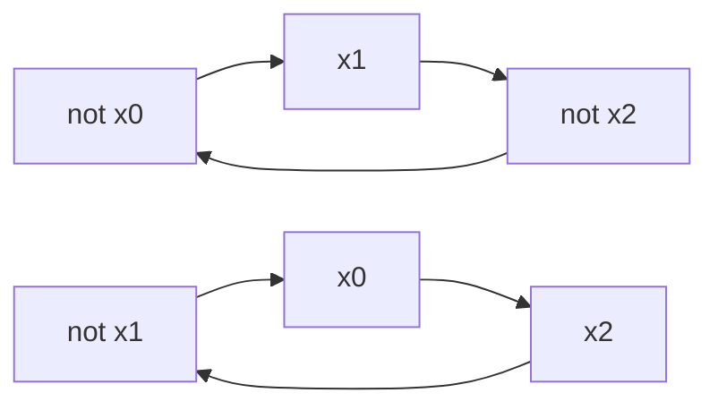

# 2-SAT — Satisfiability of 2-CNF via the Implication Graph + SCC

**2-satisfiability (2-SAT)** asks whether a boolean formula in **conjunctive normal form** where every clause has **at most two literals** can be made true. Unlike general SAT (NP-complete from three literals onward), 2-SAT is solvable in **linear time**. The trick is to read each clause as a pair of *implications*, build a directed **implication graph** over the literals, and then run a **strongly connected components** decomposition: the formula is satisfiable exactly when no variable shares an SCC with its own negation, and a satisfying assignment falls out of the SCC topological order for free.

This guide is the full, dedicated treatment of 2-SAT. It reuses the SCC machinery from [guide 07](07-scc-tarjan-kosaraju.md) — read that first if Tarjan/Kosaraju are unfamiliar — and focuses here on the *encoding*, the *criterion*, and *recovering* a model. Every code sample is given in **both Python and C++**, and the SCC step is **iterative** so it survives the large inputs typical of 2-SAT (up to `~10^6` variables and clauses).

## Table of Contents

1. [The 2-SAT Problem](#1-the-2-sat-problem)
2. [Literals as Nodes: the Encoding](#2-literals-as-nodes-the-encoding)
3. [A Clause Is Two Implications](#3-a-clause-is-two-implications)
4. [Building the Implication Graph](#4-building-the-implication-graph)
5. [The Satisfiability Criterion](#5-the-satisfiability-criterion)
6. [Recovering an Assignment from SCC Order](#6-recovering-an-assignment-from-scc-order)
7. [The TwoSAT Class](#7-the-twosat-class)
8. [Encoding Common Constraints](#8-encoding-common-constraints)
9. [Worked Mermaid Example](#9-worked-mermaid-example)
10. [Complexity Summary](#10-complexity-summary)
11. [Common Pitfalls](#11-common-pitfalls)
12. [Patterns](#12-patterns)

---

## 1. The 2-SAT Problem

We are given $n$ boolean variables $x_0, x_1, \dots, x_{n-1}$ and a formula

$$
\Phi = (\ell_{1,1} \lor \ell_{1,2}) \land (\ell_{2,1} \lor \ell_{2,2}) \land \cdots \land (\ell_{m,1} \lor \ell_{m,2}),
$$

where each **literal** $\ell$ is either a variable $x_i$ or its negation $\neg x_i$. A clause $(a \lor b)$ is satisfied when *at least one* of its two literals is true. The formula $\Phi$ is satisfied when *every* clause is satisfied. **2-SAT** asks: does there exist an assignment of true/false to the variables that satisfies $\Phi$, and if so, produce one.

General SAT with three literals per clause (3-SAT) is NP-complete, but the two-literal restriction makes the implication structure so rigid that a linear-time decision exists. The whole algorithm rests on a single rewrite of the clause connective.

---

## 2. Literals as Nodes: the Encoding

Each variable produces **two** nodes — one for the literal "$x_i$ is true" and one for "$x_i$ is false". Two index conventions are common; both are used in practice.

- **Interleaved (`2i` / `2i+1`):** node $2i$ means $x_i = \text{true}$, node $2i+1$ means $x_i = \text{false}$. The negation of a node is found with a single XOR: $\operatorname{neg}(v) = v \oplus 1$.
- **Offset (`i` / `i+n`):** node $i$ means $x_i = \text{true}$, node $i+n$ means $x_i = \text{false}$. Negation is $\operatorname{neg}(v) = (v + n) \bmod 2n$.

We use the **interleaved** convention throughout because $v \oplus 1$ is the cheapest possible negation. A *literal* is encoded as a `(variable, is_positive)` pair and mapped to a node:

```python
def node(var, is_true):
    # interleaved: 2*var = "var is true", 2*var+1 = "var is false"
    return 2 * var + (0 if is_true else 1)

def neg(v):
    return v ^ 1            # flip true<->false for the same variable
```

```cpp
// interleaved: 2*var = "var is true", 2*var+1 = "var is false"
inline int node(int var, bool isTrue) {
    return 2 * var + (isTrue ? 0 : 1);
}
inline int neg(int v) {
    return v ^ 1;          // flip true<->false for the same variable
}
```

With $n$ variables the graph has exactly $2n$ nodes.

---

## 3. A Clause Is Two Implications

The key identity. A disjunction $(a \lor b)$ is logically equivalent to *both* of these implications:

$$
(a \lor b) \equiv (\neg a \Rightarrow b) \land (\neg b \Rightarrow a).
$$

Read it aloud: "if $a$ is false then $b$ must be true" and symmetrically "if $b$ is false then $a$ must be true". Either way the clause stays satisfied. So **every clause contributes two directed edges** to the implication graph:

$$
\neg a \longrightarrow b \qquad\text{and}\qquad \neg b \longrightarrow a.
$$

Special cases fall out of the same rule:

- A **unit clause** $(a)$ — forcing $a$ true — is the clause $(a \lor a)$, which adds the single meaningful edge $\neg a \Rightarrow a$. Any path that reaches $\neg a$ is then forced into $a$.
- A bare **implication** $a \Rightarrow b$ that you want to assert directly is the clause $(\neg a \lor b)$.

---

## 4. Building the Implication Graph

The implication graph $G$ is a directed graph on the $2n$ literal-nodes. For each clause $(a \lor b)$ we add the two edges from §3. Edges respect a beautiful **skew-symmetry**: if $u \rightarrow v$ is present then $\operatorname{neg}(v) \rightarrow \operatorname{neg}(u)$ is also present (the contrapositive). This symmetry is what makes the SCC structure mirror itself across negation.

**Pseudocode**

```
build_implication_graph(n, clauses):
    G <- directed graph with 2n nodes
    for each clause (a, b):          # a, b are literals (var, is_true)
        # (a OR b)  ==  (not a => b) AND (not b => a)
        add_edge(G, neg(a), b)
        add_edge(G, neg(b), a)
    return G
```

```python
def add_clause(adj, a, b):
    # a, b are already node ids (use node(var, is_true) to build them)
    adj[neg(a)].append(b)            # not a  =>  b
    adj[neg(b)].append(a)            # not b  =>  a
```

```cpp
void addClause(vector<vector<int>>& adj, int a, int b) {
    // a, b are already node ids (use node(var, isTrue) to build them)
    adj[neg(a)].push_back(b);        // not a  =>  b
    adj[neg(b)].push_back(a);        // not b  =>  a
}
```

A path $u \rightsquigarrow v$ in $G$ means "asserting $u$ forces $v$". Because edges come in contrapositive pairs, a path $u \rightsquigarrow v$ guarantees a mirror path $\operatorname{neg}(v) \rightsquigarrow \operatorname{neg}(u)$.

---

## 5. The Satisfiability Criterion

Collapse $G$ into its **strongly connected components**. Inside one SCC every node reaches every other, so all of its literals are forced to share the same truth value. That is fine — *unless* a variable's two nodes $x$ and $\neg x$ land in the **same** SCC, because then asserting $x$ forces $\neg x$ and vice-versa, a contradiction.

> **Criterion.** The 2-CNF formula $\Phi$ is satisfiable **if and only if** for every variable $x_i$ the literal nodes $x_i$ and $\neg x_i$ lie in **different** strongly connected components.

$$
\Phi \text{ is satisfiable} \iff \forall i,\ \operatorname{comp}(2i) \neq \operatorname{comp}(2i+1).
$$

Here $\operatorname{comp}(v)$ is the SCC id of node $v$. Checking the criterion is a single linear scan after the SCC pass.

---

## 6. Recovering an Assignment from SCC Order

When the formula is satisfiable, we still need a concrete model. Consider the **condensation** (the DAG of SCCs) in **topological order**. For each variable pick the literal whose SCC comes **later** in topological order — equivalently, the literal that is *not* able to reach its own negation downstream:

$$
x_i = \text{true} \iff \operatorname{topo}(2i) > \operatorname{topo}(2i+1).
$$

This is sound because if $x_i$ could reach $\neg x_i$ (so $\neg x_i$ is topologically later) we choose $x_i = \text{false}$, never asserting the literal that drags us into a contradiction. Skew-symmetry guarantees the two choices stay globally consistent.

**Tarjan gives this for free.** Tarjan's algorithm finalizes SCCs in **reverse topological order**, so the *smaller* component id is the *topologically later* component. The clean rule with Tarjan ids:

$$
x_i = \text{true} \iff \operatorname{comp}(2i) < \operatorname{comp}(2i+1).
$$

(With Kosaraju, components are numbered in topological order, so the comparison flips to `>`. Always match the comparison to the numbering direction your SCC routine produces.)

```python
# after iterative Tarjan fills comp[] (reverse-topo numbering):
value = [comp[2 * i] < comp[2 * i + 1] for i in range(n)]
```

```cpp
// after iterative Tarjan fills comp[] (reverse-topo numbering):
vector<char> value(n);
for (int i = 0; i < n; ++i)
    value[i] = comp[2 * i] < comp[2 * i + 1];
```

---

## 7. The TwoSAT Class

A reusable class wraps the encoding, the implication edges, an **iterative Tarjan** SCC pass, and assignment recovery. Methods:

- `add_implication(a, b)` — assert the single implication $a \Rightarrow b$ (and its contrapositive).
- `add_clause(a, b)` — assert $(a \lor b)$, the two implications of §3.
- `force(a)` — force literal $a$ true via the unit clause $(a \lor a)$.
- `solve()` — return `(sat, assignment)`; `assignment[i]` is the boolean value of $x_i$.

Literals are passed as a `(var, is_true)` pair so callers never touch raw node ids.

```python
import sys

class TwoSAT:
    def __init__(self, n):
        self.n = n                       # number of variables
        self.adj = [[] for _ in range(2 * n)]   # implication graph

    @staticmethod
    def _node(lit):
        var, is_true = lit
        return 2 * var + (0 if is_true else 1)

    @staticmethod
    def _neg(v):
        return v ^ 1

    def add_implication(self, a, b):
        # a => b, plus contrapositive not b => not a
        na, nb = self._node(a), self._node(b)
        self.adj[na].append(nb)
        self.adj[self._neg(nb)].append(self._neg(na))

    def add_clause(self, a, b):
        # (a OR b) == (not a => b) AND (not b => a)
        na, nb = self._node(a), self._node(b)
        self.adj[self._neg(na)].append(nb)
        self.adj[self._neg(nb)].append(na)

    def force(self, a):
        # unit clause (a OR a): forces literal a to be true
        na = self._node(a)
        self.adj[self._neg(na)].append(na)

    def solve(self):
        N = 2 * self.n
        disc = [-1] * N                  # discovery time, -1 = unvisited
        low = [0] * N                    # low-link value
        comp = [-1] * N                  # SCC id (Tarjan: reverse-topo)
        on_stack = [False] * N
        scc_stack = []
        timer = 0
        ncomp = 0

        for start in range(N):
            if disc[start] != -1:
                continue
            work = [(start, 0)]          # (u, next neighbour index)
            while work:
                u, i = work[-1]
                if i == 0:
                    disc[u] = low[u] = timer
                    timer += 1
                    scc_stack.append(u)
                    on_stack[u] = True
                if i < len(self.adj[u]):
                    work[-1] = (u, i + 1)
                    v = self.adj[u][i]
                    if disc[v] == -1:
                        work.append((v, 0))      # descend
                    elif on_stack[v]:
                        low[u] = min(low[u], disc[v])
                else:
                    if low[u] == disc[u]:        # u roots an SCC
                        while True:
                            w = scc_stack.pop()
                            on_stack[w] = False
                            comp[w] = ncomp
                            if w == u:
                                break
                        ncomp += 1
                    work.pop()
                    if work:
                        p = work[-1][0]
                        low[p] = min(low[p], low[u])

        assignment = [False] * self.n
        for i in range(self.n):
            if comp[2 * i] == comp[2 * i + 1]:
                return False, []          # x and not-x share an SCC
            assignment[i] = comp[2 * i] < comp[2 * i + 1]
        return True, assignment
```

```cpp
#include <bits/stdc++.h>
using namespace std;

struct TwoSAT {
    int n;                              // number of variables
    vector<vector<int>> adj;            // implication graph (2n nodes)

    explicit TwoSAT(int n) : n(n), adj(2 * n) {}

    static int node(int var, bool isTrue) { return 2 * var + (isTrue ? 0 : 1); }
    static int neg(int v) { return v ^ 1; }

    // a => b, plus contrapositive not b => not a
    void addImplication(int va, bool ta, int vb, bool tb) {
        int a = node(va, ta), b = node(vb, tb);
        adj[a].push_back(b);
        adj[neg(b)].push_back(neg(a));
    }

    // (a OR b) == (not a => b) AND (not b => a)
    void addClause(int va, bool ta, int vb, bool tb) {
        int a = node(va, ta), b = node(vb, tb);
        adj[neg(a)].push_back(b);
        adj[neg(b)].push_back(a);
    }

    // unit clause (a OR a): forces literal a to be true
    void force(int va, bool ta) {
        int a = node(va, ta);
        adj[neg(a)].push_back(a);
    }

    // Returns true if satisfiable; fills value[] with a model.
    bool solve(vector<char>& value) {
        int N = 2 * n;
        vector<int> disc(N, -1), low(N, 0), comp(N, -1);
        vector<char> onStack(N, 0);
        vector<int> sccStack;
        sccStack.reserve(N);
        int timer = 0, ncomp = 0;

        for (int start = 0; start < N; ++start) {
            if (disc[start] != -1) continue;
            // iterative DFS: stack of (vertex, next-neighbour-index)
            vector<pair<int,int>> work;
            work.push_back({start, 0});
            while (!work.empty()) {
                int u = work.back().first;
                int& i = work.back().second;
                if (i == 0) {
                    disc[u] = low[u] = timer++;
                    sccStack.push_back(u);
                    onStack[u] = 1;
                }
                if (i < (int)adj[u].size()) {
                    int v = adj[u][i++];
                    if (disc[v] == -1) {
                        work.push_back({v, 0});      // descend
                    } else if (onStack[v]) {
                        low[u] = min(low[u], disc[v]);
                    }
                } else {
                    if (low[u] == disc[u]) {         // u roots an SCC
                        while (true) {
                            int w = sccStack.back(); sccStack.pop_back();
                            onStack[w] = 0;
                            comp[w] = ncomp;
                            if (w == u) break;
                        }
                        ++ncomp;
                    }
                    work.pop_back();
                    if (!work.empty()) {
                        int p = work.back().first;
                        low[p] = min(low[p], low[u]);
                    }
                }
            }
        }

        value.assign(n, 0);
        for (int i = 0; i < n; ++i) {
            if (comp[2 * i] == comp[2 * i + 1]) return false;  // contradiction
            value[i] = comp[2 * i] < comp[2 * i + 1];
        }
        return true;
    }
};
```

---

## 8. Encoding Common Constraints

The expressive power of 2-SAT comes from translating real constraints into clauses. Let $a, b, c$ be literals (each a `(var, is_true)` pair).

| Constraint | Meaning | Clauses added |
|---|---|---|
| Force $a$ true | $a$ | `force(a)` = $(a \lor a)$ |
| Force $a$ false | $\neg a$ | `force(not a)` |
| Implication $a \Rightarrow b$ | if $a$ then $b$ | $(\neg a \lor b)$ |
| Equality $a = b$ | same value | $(\neg a \lor b) \land (a \lor \neg b)$ |
| XOR / inequality $a \neq b$ | different values | $(a \lor b) \land (\neg a \lor \neg b)$ |
| NAND $\neg(a \land b)$ | not both true | $(\neg a \lor \neg b)$ |
| At-least-one $(a \lor b)$ | one of two | `add_clause(a, b)` |

**At-most-one over a set** $\{a_1, \dots, a_k\}$: the pairwise encoding adds $(\neg a_j \lor \neg a_l)$ for every pair — that is $O(k^2)$ clauses. For large $k$, use the **prefix/commander** chain with $k-1$ auxiliary variables $p_j$ (read $p_j$ as "some literal among $a_1..a_j$ is true"):

$$
a_j \Rightarrow p_j, \qquad p_{j-1} \Rightarrow p_j, \qquad p_{j-1} \Rightarrow \neg a_j,
$$

which encodes at-most-one in $O(k)$ clauses.

```python
def at_most_one_pairwise(sat, lits):
    # lits: list of (var, is_true); adds O(k^2) NAND clauses
    for j in range(len(lits)):
        for l in range(j + 1, len(lits)):
            nj = (lits[j][0], not lits[j][1])
            nl = (lits[l][0], not lits[l][1])
            sat.add_clause(nj, nl)         # (not a_j OR not a_l)
```

```cpp
// lits: list of (var, isTrue); adds O(k^2) NAND clauses
void atMostOnePairwise(TwoSAT& sat, const vector<pair<int,bool>>& lits) {
    for (size_t j = 0; j < lits.size(); ++j)
        for (size_t l = j + 1; l < lits.size(); ++l)
            sat.addClause(lits[j].first, !lits[j].second,
                          lits[l].first, !lits[l].second);  // not a_j OR not a_l
}
```

---

## 9. Worked Mermaid Example

Take the formula

$$
\Phi = (x_0 \lor x_1) \land (\neg x_0 \lor x_2) \land (\neg x_1 \lor \neg x_2).
$$

Using interleaved nodes — `x0` $= 0$, `not x0` $= 1$, `x1` $= 2$, `not x1` $= 3$, `x2` $= 4$, `not x2` $= 5$ — each clause contributes its two implication edges:

- $(x_0 \lor x_1)$: `not x0 implies x1` and `not x1 implies x0`.
- $(\neg x_0 \lor x_2)$: `x0 implies x2` and `not x2 implies not x0`.
- $(\neg x_1 \lor \neg x_2)$: `x1 implies not x2` and `x2 implies not x1`.



No literal node can reach its own negation here, so every variable's two nodes sit in distinct SCCs and $\Phi$ is **satisfiable**. One model: $x_0 = \text{true}$, $x_1 = \text{false}$, $x_2 = \text{true}$ — check: $(T) \land (F \lor T) \land (T \lor F) = T$.

The criterion restated for this instance:

$$
\Phi \text{ satisfiable} \iff \operatorname{comp}(0) \neq \operatorname{comp}(1) \ \land\ \operatorname{comp}(2) \neq \operatorname{comp}(3) \ \land\ \operatorname{comp}(4) \neq \operatorname{comp}(5).
$$

---

## 10. Complexity Summary

Let $n$ be the number of variables and $m$ the number of clauses. The implication graph has $2n$ nodes and $2m$ edges.

| Operation | Time | Space |
|---|---|---|
| Build implication graph | $O(n + m)$ | $O(n + m)$ |
| SCC (iterative Tarjan / Kosaraju) | $O(n + m)$ | $O(n + m)$ |
| Satisfiability check | $O(n)$ | $O(1)$ |
| Assignment recovery | $O(n)$ | $O(n)$ |
| **Whole 2-SAT solve** | $O(n + m)$ | $O(n + m)$ |
| At-most-one (pairwise) | $O(k^2)$ clauses | — |
| At-most-one (chain, aux vars) | $O(k)$ clauses | $O(k)$ aux vars |

The linear bound is why 2-SAT scales to `~10^6` variables and clauses where 3-SAT cannot.

---

## 11. Common Pitfalls

- **Recursion stack overflow.** A recursive Tarjan/Kosaraju blows the stack on long implication chains (and 2-SAT chains *are* long). Always use the **iterative** SCC given above for large inputs.
- **Mismatched topo direction.** Tarjan numbers SCCs in *reverse* topological order, Kosaraju in *forward* order. Pick `comp[x] < comp[not x]` for Tarjan but `>` for Kosaraju — getting this backwards yields a *valid-looking but wrong* assignment.
- **Forgetting the contrapositive.** When adding a bare implication $a \Rightarrow b$ you must also add $\neg b \Rightarrow \neg a$, otherwise skew-symmetry breaks and recovery can produce inconsistent models. (`add_clause` adds both directions automatically; only raw `add_implication` needs care.)
- **Wrong negation under the offset encoding.** With `i`/`i+n` the negation is `(v + n) % (2n)`, *not* `v ^ 1`. Mixing the two conventions silently corrupts edges.
- **Off-by-one variables.** Reserve exactly $2n$ nodes. A clause referencing variable index $n$ (out of range) is a buffer overrun, not a logic bug — validate inputs at the boundary.
- **At-most-one explosion.** The pairwise encoding is $O(k^2)$; on a large group it can dominate the whole instance. Switch to the auxiliary-variable chain.

---

## 12. Patterns

- **"Each X has two options, pick one" → 2-SAT.** Whenever each entity offers a binary choice and constraints couple choices pairwise (toppings, scheduling, seating, coloring with two colors), model each entity as a variable and each "at least one of these two" as a clause.
- **Forbidden pairs → NAND clauses.** "These two cannot both happen" is exactly $(\neg a \lor \neg b)$. A graph 2-coloring / bipartition problem is a chain of such forbidden-pair clauses (see [Possible Bipartition](../problems/0886-possible-bipartition-2sat.md)).
- **Conditional rules → implications.** "If we do $a$ we must do $b$" is $(\neg a \lor b)$; the implication graph literally encodes the rule.
- **Mandatory choices → unit clauses.** Any literal known true is `force(a)` — a one-edge unit clause that the SCC pass propagates automatically.
- **Reuse the SCC engine.** 2-SAT is just "build implication edges, then run the SCC routine from [guide 07](07-scc-tarjan-kosaraju.md), then compare component ids." Keep one well-tested iterative SCC and let every 2-SAT problem call into it.

Related reading: [guide 07 — SCC](07-scc-tarjan-kosaraju.md) for the Tarjan/Kosaraju machinery, and [guide 04 — Bipartite 2-coloring](04-bipartite-2coloring.md) for the special case where every clause is a forbidden pair.
