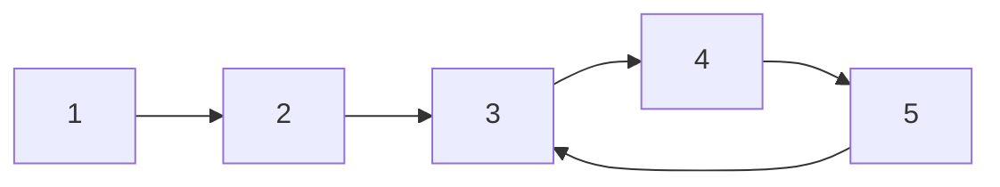
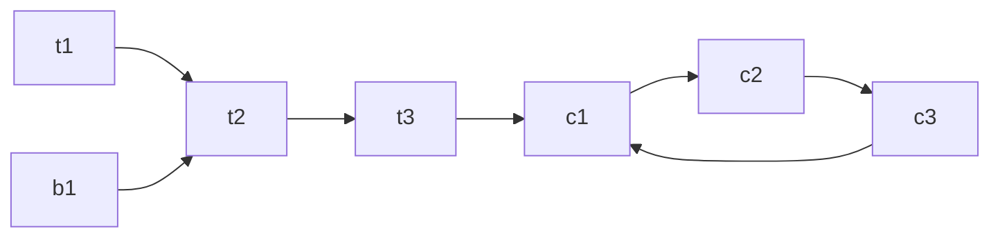
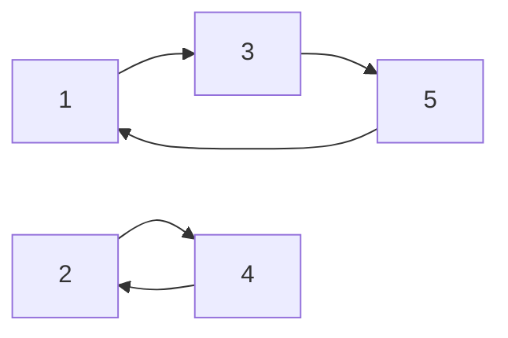

# Functional Graphs (Successor Graphs)

A **functional graph** (also called a *successor graph*) is a directed graph in which **every node has out-degree exactly 1**. Equivalently, the graph is defined by a *successor function* $succ(x)$ that maps each node to exactly one other node (or to itself). From any starting node you can only ever "walk forward" along a single, deterministic path.

These graphs appear constantly in competitive programming: "each planet has exactly one teleporter", "each player passes the ball to exactly one other player", permutations, pointer-chasing, and the iteration $x \to f(x)$ used in Pollard's rho. Because the out-degree is fixed at 1, functional graphs have a beautiful and rigid structure that we can exploit for fast queries.

## Table of Contents

- [Definition and Core Structure](#definition-and-core-structure)
- [The Rho Shape: Tails and Cycles](#the-rho-shape-tails-and-cycles)
- [Where Does a Walk End Up?](#where-does-a-walk-end-up)
- [Cycle Detection: Floyd's Tortoise and Hare](#cycle-detection-floyds-tortoise-and-hare)
- [Cycle Detection: Visited-Coloring / Iterative DFS](#cycle-detection-visited-coloring--iterative-dfs)
- [Binary Lifting: k-th Successor](#binary-lifting-k-th-successor)
- [Cycle Lengths and Tail Lengths per Node](#cycle-lengths-and-tail-lengths-per-node)
- [Counting Nodes by Component](#counting-nodes-by-component)
- [Permutation Graphs: The Bijective Case](#permutation-graphs-the-bijective-case)
- [Complexity Summary](#complexity-summary)
- [Common Pitfalls](#common-pitfalls)
- [Patterns](#patterns)

## Definition and Core Structure

A functional graph on $n$ nodes is given by an array $succ[1..n]$ where $succ[x]$ is the unique node reachable from $x$ in one step. There are exactly $n$ edges (one per node).

Key structural fact: **starting from any node and repeatedly applying $succ$, you must eventually enter a cycle.** Since there are only $n$ nodes, a walk of length $n$ must repeat a node (pigeonhole), and once a node repeats, the deterministic successor means the walk loops forever on the same cycle.



Here nodes $1, 2$ form a *tail* leading into the cycle $3 \to 4 \to 5 \to 3$.

## The Rho Shape: Tails and Cycles

Each **weakly connected component** of a functional graph consists of **exactly one cycle**, with trees ("rho trees") hanging off the cycle nodes. Every node not on the cycle has a unique path that flows *into* the cycle. The shape resembles the Greek letter $\rho$ (rho): a tail leading into a loop.



The **tail length** of a node is the number of steps to reach the cycle. The **cycle length** is the number of nodes on the loop. For the node `t1` above the tail length is 3 and the cycle length is 3.

Formally, for a node $v$ let $\mu(v)$ be its tail length (distance to the cycle) and let $\lambda$ be the length of the cycle it eventually reaches. Then for all $k \ge \mu(v)$:

$$succ^{k+\lambda}(v) = succ^{k}(v).$$

## Where Does a Walk End Up?

The most basic query: starting at $v$, where are we after $k$ steps? Naively, simulate:

```text
function walk(v, k):
    repeat k times:
        v = succ[v]
    return v
```

```python
def walk(succ, v, k):
    for _ in range(k):
        v = succ[v]
    return v
```

```cpp
int walk(const vector<int>& succ, int v, long long k) {
    while (k--) v = succ[v];
    return v;
}
```

This is $O(k)$ per query, which is far too slow when $k$ can be up to $10^9$. The fix is **binary lifting** (covered below), giving $O(\log k)$ per query.

## Cycle Detection: Floyd's Tortoise and Hare

Floyd's algorithm finds a cycle using $O(1)$ extra memory. A slow pointer moves one step at a time; a fast pointer moves two steps. They are guaranteed to meet inside the cycle.

```text
slow = succ[start]; fast = succ[succ[start]]
while slow != fast:
    slow = succ[slow]
    fast = succ[succ[fast]]
# now find the cycle entrance (mu)
slow = start
while slow != fast:
    slow = succ[slow]; fast = succ[fast]
# slow == fast == first node on the cycle
# then measure cycle length lambda
```

```python
def floyd(succ, start):
    slow = succ[start]
    fast = succ[succ[start]]
    while slow != fast:
        slow = succ[slow]
        fast = succ[succ[fast]]
    # find cycle start (mu)
    mu = 0
    slow = start
    while slow != fast:
        slow = succ[slow]
        fast = succ[fast]
        mu += 1
    # find cycle length (lambda)
    lam = 1
    fast = succ[slow]
    while fast != slow:
        fast = succ[fast]
        lam += 1
    return mu, lam  # tail length, cycle length
```

```cpp
pair<long long, long long> floyd(const vector<int>& succ, int start) {
    int slow = succ[start];
    int fast = succ[succ[start]];
    while (slow != fast) {
        slow = succ[slow];
        fast = succ[succ[fast]];
    }
    long long mu = 0;
    slow = start;
    while (slow != fast) {
        slow = succ[slow];
        fast = succ[fast];
        ++mu;
    }
    long long lam = 1;
    fast = succ[slow];
    while (fast != slow) {
        fast = succ[fast];
        ++lam;
    }
    return {mu, lam}; // tail length, cycle length
}
```

The meeting point lies on the cycle. Resetting `slow` to the start and advancing both pointers one step at a time finds $\mu$, the cycle entrance. Floyd is ideal when you cannot afford an $O(n)$ visited array, or when the graph is generated on the fly.

## Cycle Detection: Visited-Coloring / Iterative DFS

When the whole graph is known and $n$ is up to $\sim 2 \times 10^5$, a **three-color iterative DFS** finds every cycle in $O(n)$. Colors: `0` = unvisited (white), `1` = in progress (gray), `2` = done (black). Following successors, if we hit a gray node we have found a cycle; if we hit a black node we have joined an already-processed structure.

```text
for each start node s:
    if color[s] == white:
        walk the path marking nodes gray, recording order
        stop at a non-white node 'end'
        if end is gray: nodes from 'end' onward form a cycle
        mark all walked nodes black
```

```python
def find_cycles(succ, n):
    color = [0] * (n + 1)      # 0 white, 1 gray, 2 black
    on_cycle = [False] * (n + 1)
    cycle_len = [0] * (n + 1)
    for s in range(1, n + 1):
        if color[s] != 0:
            continue
        path = []
        v = s
        while color[v] == 0:
            color[v] = 1       # gray
            path.append(v)
            v = succ[v]
        if color[v] == 1:      # found a fresh cycle starting at v
            idx = path.index(v)
            cyc = path[idx:]
            for u in cyc:
                on_cycle[u] = True
                cycle_len[u] = len(cyc)
        for u in path:
            color[u] = 2       # black
    return on_cycle, cycle_len
```

```cpp
void find_cycles(const vector<int>& succ, int n,
                 vector<char>& on_cycle, vector<int>& cycle_len) {
    vector<int> color(n + 1, 0);        // 0 white, 1 gray, 2 black
    vector<int> pos(n + 1, -1);         // index in current path
    for (int s = 1; s <= n; ++s) {
        if (color[s] != 0) continue;
        vector<int> path;
        int v = s;
        while (color[v] == 0) {
            color[v] = 1;               // gray
            pos[v] = (int)path.size();
            path.push_back(v);
            v = succ[v];
        }
        if (color[v] == 1) {            // fresh cycle starting at v
            int idx = pos[v];
            int len = (int)path.size() - idx;
            for (int i = idx; i < (int)path.size(); ++i) {
                on_cycle[path[i]] = 1;
                cycle_len[path[i]] = len;
            }
        }
        for (int u : path) color[u] = 2; // black
    }
}
```

Note the use of an explicit `path` list rather than recursion — for $n$ up to $2 \times 10^5$ a recursive DFS risks stack overflow, so we **iterate**.

## Binary Lifting: k-th Successor

To answer "where am I after $k$ steps?" in $O(\log k)$, precompute a sparse table $up[j][v]$ = the $2^j$-th successor of $v$:

$$up[0][v] = succ[v], \qquad up[j][v] = up[j-1]\big[up[j-1][v]\big].$$

The second equation says: taking $2^j$ steps is the same as taking $2^{j-1}$ steps and then another $2^{j-1}$ steps. To jump $k$ steps, decompose $k$ into its binary representation and apply the corresponding powers of two.


Each level doubles the reach, so $LOG = \lceil \log_2 K_{\max} \rceil$ levels cover any $k$.

```text
build:
    up[0][v] = succ[v]
    for j in 1..LOG-1:
        for v in 1..n:
            up[j][v] = up[j-1][ up[j-1][v] ]

query(v, k):
    for j in 0..LOG-1:
        if k has bit j set:
            v = up[j][v]
    return v
```

```python
def build_lifting(succ, n, LOG):
    up = [[0] * (n + 1) for _ in range(LOG)]
    up[0] = succ[:]                       # 2^0-th successor
    for j in range(1, LOG):
        prev = up[j - 1]
        cur = up[j]
        for v in range(1, n + 1):
            cur[v] = prev[prev[v]]
    return up

def kth_successor(up, LOG, v, k):
    for j in range(LOG):
        if (k >> j) & 1:
            v = up[j][v]
    return v
```

```cpp
vector<vector<int>> build_lifting(const vector<int>& succ, int n, int LOG) {
    vector<vector<int>> up(LOG, vector<int>(n + 1));
    for (int v = 1; v <= n; ++v) up[0][v] = succ[v]; // 2^0-th successor
    for (int j = 1; j < LOG; ++j)
        for (int v = 1; v <= n; ++v)
            up[j][v] = up[j - 1][up[j - 1][v]];
    return up;
}

int kth_successor(const vector<vector<int>>& up, int LOG, int v, long long k) {
    for (int j = 0; j < LOG; ++j)
        if ((k >> j) & 1)
            v = up[j][v];
    return v;
}
```

The table uses $O(n \log K)$ memory and $O(n \log K)$ build time; each query is $O(\log k)$.

## Cycle Lengths and Tail Lengths per Node

A common task is: for **every** node $v$, compute the distance $\mu(v)$ to its cycle plus the length $\lambda$ of that cycle (e.g. CSES Planets Cycles asks for $\mu(v) + \lambda$). We do this in $O(n)$:

1. Find all cycles with the coloring method; record `cycle_len[c]` for cycle nodes.
2. For non-cycle nodes, compute the distance to the cycle by walking back via memoized DFS (iterative, with a stack), since each node has a unique successor.

```text
dist_to_cycle(v):
    if on_cycle[v]: dist[v] = 0
    else: dist[v] = 1 + dist_to_cycle(succ[v])
answer(v) = dist[v] + cycle_len[entry_cycle_of(v)]
```

```python
def tail_and_cycle(succ, n, on_cycle, cycle_len):
    dist = [0] * (n + 1)        # steps to reach the cycle
    cyc_of = [0] * (n + 1)      # cycle length the node ends up on
    for c in range(1, n + 1):
        if on_cycle[c]:
            cyc_of[c] = cycle_len[c]
    for s in range(1, n + 1):
        # climb until we hit a node with known answer or a cycle node
        stack = []
        v = s
        while not on_cycle[v] and cyc_of[v] == 0:
            stack.append(v)
            v = succ[v]
        base_dist = 0 if on_cycle[v] else dist[v]
        base_cyc = cyc_of[v]
        # v is resolved; unwind the stack assigning distances
        d = base_dist
        for u in reversed(stack):
            d += 1
            dist[u] = d
            cyc_of[u] = base_cyc
    return dist, cyc_of   # answer(v) = dist[v] + cyc_of[v]
```

```cpp
void tail_and_cycle(const vector<int>& succ, int n,
                    const vector<char>& on_cycle, const vector<int>& cycle_len,
                    vector<long long>& dist, vector<long long>& cyc_of) {
    for (int c = 1; c <= n; ++c)
        if (on_cycle[c]) cyc_of[c] = cycle_len[c];
    for (int s = 1; s <= n; ++s) {
        vector<int> stk;
        int v = s;
        while (!on_cycle[v] && cyc_of[v] == 0) {
            stk.push_back(v);
            v = succ[v];
        }
        long long baseDist = on_cycle[v] ? 0 : dist[v];
        long long baseCyc = cyc_of[v];
        long long d = baseDist;
        for (int i = (int)stk.size() - 1; i >= 0; --i) {
            ++d;
            dist[stk[i]] = d;
            cyc_of[stk[i]] = baseCyc;
        }
    }
    // answer(v) = dist[v] + cyc_of[v]
}
```

## Counting Nodes by Component

To count how many nodes belong to each component (one cycle + its rho trees), assign each node a component id equal to the representative cycle it reaches. During the coloring pass, give every cycle a unique id and propagate that id to all tail nodes that flow into it. The component size is then the count of nodes sharing that id. Because each node flows to exactly one cycle, this is a clean $O(n)$ labeling — there is no ambiguity as there can be in general graphs.

$$\sum_{\text{components } C} |C| = n.$$

## Permutation Graphs: The Bijective Case

When $succ$ is a **bijection** (a permutation), every node has in-degree exactly 1 as well as out-degree 1. There are **no tails** — the graph is a disjoint union of pure cycles. This is the special, cleaner case of a functional graph.



**Cycle decomposition** of a permutation $\pi$ partitions $\{1, \dots, n\}$ into cycles. Two classic applications:

- The number of times you must apply $\pi$ to return everything to its original position is the **order** of the permutation: the least common multiple of all cycle lengths,
$$\text{ord}(\pi) = \operatorname{lcm}(\ell_1, \ell_2, \dots, \ell_m),$$
where $\ell_i$ are the cycle lengths.
- Applying $\pi$ exactly $k$ times sends a node $v$ to position $(p + k) \bmod \ell$ within its cycle of length $\ell$, where $p$ is $v$'s index along the cycle.

```python
def perm_cycles_and_order(perm, n):
    seen = [False] * (n + 1)
    cycles = []
    for s in range(1, n + 1):
        if seen[s]:
            continue
        cyc = []
        v = s
        while not seen[v]:
            seen[v] = True
            cyc.append(v)
            v = perm[v]
        cycles.append(cyc)
    from math import gcd
    order = 1
    for c in cycles:
        order = order * len(c) // gcd(order, len(c))
    return cycles, order
```

```cpp
pair<vector<vector<int>>, long long>
perm_cycles_and_order(const vector<int>& perm, int n) {
    vector<char> seen(n + 1, 0);
    vector<vector<int>> cycles;
    for (int s = 1; s <= n; ++s) {
        if (seen[s]) continue;
        vector<int> cyc;
        int v = s;
        while (!seen[v]) {
            seen[v] = 1;
            cyc.push_back(v);
            v = perm[v];
        }
        cycles.push_back(cyc);
    }
    long long order = 1;
    for (auto& c : cycles) {
        long long len = (long long)c.size();
        order = order / std::__gcd(order, len) * len; // lcm
    }
    return {cycles, order};
}
```

Because permutation graphs have no tails, you can answer $k$-th successor queries in $O(1)$ after an $O(n)$ preprocessing by storing each node's cycle and its index: jump to index $(p + k) \bmod \ell$.

## Complexity Summary

| Operation | Time | Space |
| --- | --- | --- |
| Naive walk of $k$ steps | $O(k)$ | $O(1)$ |
| Floyd's tortoise and hare | $O(\mu + \lambda)$ | $O(1)$ |
| Coloring / iterative DFS cycle detection | $O(n)$ | $O(n)$ |
| Binary lifting build | $O(n \log K)$ | $O(n \log K)$ |
| $k$-th successor query (lifting) | $O(\log k)$ | — |
| Tail + cycle length for all nodes | $O(n)$ | $O(n)$ |
| Permutation cycle decomposition | $O(n)$ | $O(n)$ |
| Permutation $k$-th power query | $O(1)$ after $O(n)$ prep | $O(n)$ |

Here $n$ is the number of nodes, $K$ the maximum query distance, $\mu$ the tail length and $\lambda$ the cycle length.

## Common Pitfalls

- **Recursion depth.** A recursive DFS over a long chain ($n \approx 2 \times 10^5$) overflows the call stack in both Python and C++. Always use an **iterative** walk with an explicit stack/list.
- **Integer overflow.** Query distances $k$ can reach $\sim 10^9$ or more. Use `long long` in C++ for $k$ and any accumulated step counts; Python integers are unbounded but be mindful when porting.
- **LOG too small.** The number of lifting levels must satisfy $2^{LOG} > K_{\max}$. If $k$ can be $10^9$, use $LOG = 30$; for $10^{18}$ use $LOG = 60$. An undersized table silently truncates jumps.
- **Forgetting tails.** A node's answer about "reaching the cycle" combines **both** the tail distance and the cycle length. Do not assume the start node is already on the cycle.
- **Off-by-one in the cycle slice.** When the coloring DFS hits a gray node, the cycle is the suffix of the path *from that node's first occurrence*, not the entire path.
- **Self-loops and tiny cycles.** A node with $succ[x] = x$ is a valid cycle of length 1. Handle $\lambda = 1$ and avoid special-casing it incorrectly in Floyd's setup.
- **1-indexed vs 0-indexed.** CSES problems are 1-indexed; allocate arrays of size $n + 1$ and be consistent.

## Patterns

- **"Each X points to exactly one Y"** → model as a functional graph with `succ`.
- **"Where after $k$ steps?"** with large $k$ → **binary lifting**.
- **"Steps to enter a loop" / "first repeated state"** → tortoise-and-hare or coloring DFS to get $\mu$ and $\lambda$.
- **"For every node, distance to cycle + cycle length"** → coloring to mark cycles, then memoized iterative climb.
- **"Apply a permutation $k$ times"** → cycle decomposition, index arithmetic modulo cycle length; order = lcm of cycle lengths.
- **"Count reachable / component sizes"** → label each node by the cycle it flows into.
- **Memory-constrained or streaming successor** → Floyd's $O(1)$-space cycle detection (also the heart of Pollard's rho factorization).
