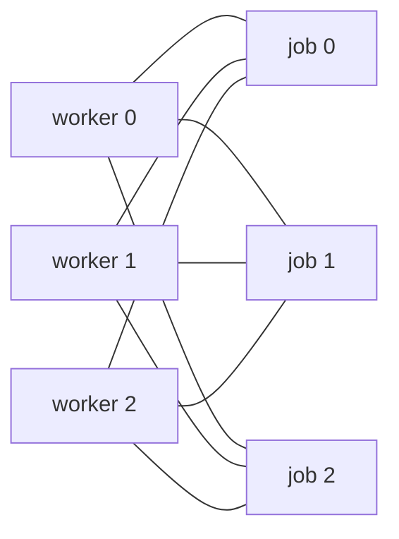
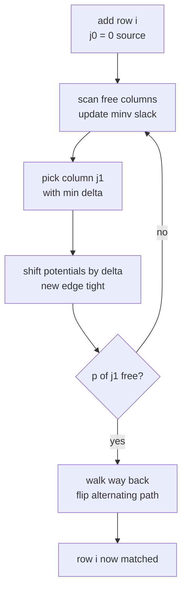
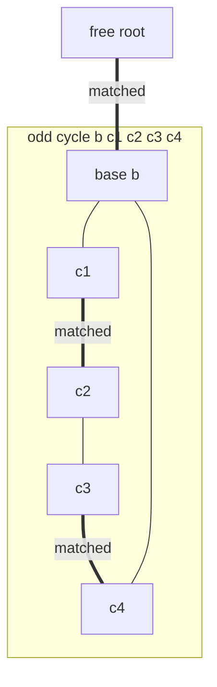
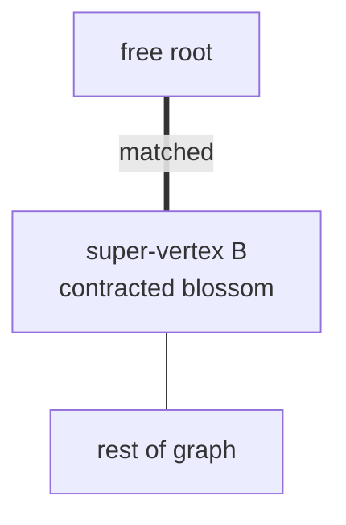

# Hungarian Algorithm (Kuhn–Munkres) and General Matching (Blossom)

This guide is the dedicated, full treatment of two classic matching problems that the flow guides
only mention in passing. First the **assignment problem** — finding a minimum-cost *perfect*
matching in a complete bipartite graph from an $n\times n$ cost matrix — solved directly by the
**Hungarian algorithm (Kuhn–Munkres)** in $O(n^3)$ using dual *potentials*. Then the much harder
world of **general (non-bipartite) matching**, where odd cycles ("blossoms") break the simple
augmenting-path argument, and **Edmonds' Blossom algorithm** restores it by *contracting* those
cycles to find a maximum-cardinality matching in $O(V^3)$.

The MCMF guide ([12-min-cost-max-flow.md](12-min-cost-max-flow.md)) and the bipartite-matching
guide ([11-bipartite-matching-konig.md](11-bipartite-matching-konig.md)) both reference the
Hungarian algorithm; this guide is where it lives in full.

---

## Table of Contents
1. [The Assignment Problem](#the-assignment-problem)
2. [LP / Dual View: Potentials and Complementary Slackness](#lp--dual-view-potentials-and-complementary-slackness)
3. [The Hungarian Algorithm (Kuhn–Munkres)](#the-hungarian-algorithm-kuhnmunkres)
4. [Reading Back the Assignment and Cost](#reading-back-the-assignment-and-cost)
5. [Min vs Max Cost](#min-vs-max-cost)
6. [Assignment via MCMF](#assignment-via-mcmf)
7. [General (Non-Bipartite) Matching](#general-non-bipartite-matching)
8. [Blossoms: Why Odd Cycles Break Augmentation](#blossoms-why-odd-cycles-break-augmentation)
9. [Edmonds' Blossom Algorithm](#edmonds-blossom-algorithm)
10. [Weighted General Matching](#weighted-general-matching)
11. [Complexity Summary](#complexity-summary)
12. [Common Pitfalls](#common-pitfalls)
13. [Patterns](#patterns)

---

## The Assignment Problem

We have $n$ **workers** and $n$ **jobs**. Assigning worker $i$ to job $j$ costs $c_{ij}$ (a full
$n \times n$ matrix). We must choose a **perfect matching**: a bijection $\sigma$ from workers to
jobs (each worker gets exactly one job, each job exactly one worker) minimizing total cost:

$$\min_{\sigma \in S_n} \ \sum_{i=1}^{n} c_{i,\sigma(i)}$$

There are $n!$ permutations, so brute force is hopeless. Greedy ("each worker grabs their cheapest
job") fails because of conflicts. The structure that makes this tractable is **linear-programming
duality** specialized to a bipartite graph.



Every worker connects to every job (a **complete** bipartite graph $K_{n,n}$); the cost lives on
the edges.

---

## LP / Dual View: Potentials and Complementary Slackness

Write the assignment as an integer program with variables $x_{ij} \in \{0,1\}$ (1 if worker $i$
takes job $j$). Its LP relaxation is *totally unimodular*, so the optimum is integral:

$$\min \sum_{i,j} c_{ij}\,x_{ij} \quad\text{s.t.}\quad \sum_j x_{ij} = 1,\ \ \sum_i x_{ij} = 1,\ \ x_{ij}\ge 0.$$

The **dual** assigns a *potential* (label) $u_i$ to each row (worker) and $v_j$ to each column
(job), subject to **dual feasibility**:

$$u_i + v_j \ \le\ c_{ij} \quad \text{for all } i, j,$$

and maximizes $\sum_i u_i + \sum_j v_j$. By LP duality the optimal primal cost equals the optimal
dual objective. **Complementary slackness** then says an edge $(i,j)$ can be used in the optimal
matching **only if it is tight**:

$$x_{ij} > 0 \ \Longrightarrow\ u_i + v_j = c_{ij}.$$

The set of tight edges forms the **equality subgraph**. The Hungarian algorithm maintains feasible
potentials and grows a matching using *only* tight edges; when it finds a perfect matching in the
equality subgraph, complementary slackness certifies optimality. When no augmenting path exists in
the equality subgraph, it nudges the potentials by the **minimum slack** $\delta$ to make a new
edge tight, and repeats.

---

## The Hungarian Algorithm (Kuhn–Munkres)

We present the clean **e-maxx / cp-algorithms** $O(n^3)$ implementation. It augments
**column by column** (adding one job at a time), maintaining potentials `u[]` (rows) and `v[]`
(columns) and a partial assignment `p[j]` = the worker (row) currently assigned to column `j`.

State:

- `u[i]` — potential of row $i$, `v[j]` — potential of column $j$.
- `p[j]` — row matched to column $j$ (`p[0]` is a sentinel "free" slot, `0` means unmatched).
- `way[j]` — for path reconstruction: the previous column on the alternating path that reached $j$.
- `minv[j]` — current minimum reduced slack to reach column $j$; `used[j]` — whether $j$ is in the
  alternating tree.

**1-indexed** rows/columns are used so column `0` is a virtual source. For each new row `i` we run
a Dijkstra-like search over *reduced costs* $c_{ij} - u_i - v_j$, repeatedly picking the column of
minimum slack `delta`, adding it to the tree, and **shifting potentials by `delta`** (so the chosen
edge becomes tight while preserving feasibility everywhere). When we reach an unmatched column we
walk `way[]` back to flip the alternating path.

Pseudocode:

```
for i in 1..n:                 # add row i
    p[0] = i; j0 = 0
    minv[*] = +INF; used[*] = false
    repeat:
        used[j0] = true
        i0 = p[j0]; delta = +INF; j1 = -1
        for j in 1..n if not used[j]:
            cur = cost[i0][j] - u[i0] - v[j]      # reduced cost
            if cur < minv[j]: minv[j] = cur; way[j] = j0
            if minv[j] < delta: delta = minv[j]; j1 = j
        for j in 0..n:
            if used[j]: u[p[j]] += delta; v[j] -= delta
            else:        minv[j] -= delta
        j0 = j1
    until p[j0] == 0
    repeat:                    # augment along reconstructed path
        j1 = way[j0]; p[j0] = p[j1]; j0 = j1
    until j0 == 0
```

The double potential shift (`u[p[j]] += delta` for tree rows, `v[j] -= delta` for tree columns,
`minv[j] -= delta` for the frontier) keeps **all** reduced costs $\ge 0$ and makes at least one new
edge tight each iteration — the engine of the $O(n^3)$ bound (n rows × at most n frontier
expansions × O(n) scan).



### Python

```python
INF = float("inf")

def hungarian(cost):
    """Minimum-cost perfect assignment for an n x n matrix.
    Returns (min_total_cost, assign) where assign[i] = column for row i."""
    n = len(cost)
    # 1-indexed potentials and matching; index 0 is the virtual source.
    u = [0] * (n + 1)
    v = [0] * (n + 1)
    p = [0] * (n + 1)          # p[j] = row matched to column j
    way = [0] * (n + 1)        # path reconstruction
    for i in range(1, n + 1):
        p[0] = i
        j0 = 0
        minv = [INF] * (n + 1)
        used = [False] * (n + 1)
        while True:
            used[j0] = True
            i0 = p[j0]
            delta = INF
            j1 = -1
            for j in range(1, n + 1):
                if not used[j]:
                    cur = cost[i0 - 1][j - 1] - u[i0] - v[j]   # reduced cost
                    if cur < minv[j]:
                        minv[j] = cur
                        way[j] = j0
                    if minv[j] < delta:
                        delta = minv[j]
                        j1 = j
            for j in range(n + 1):
                if used[j]:
                    u[p[j]] += delta
                    v[j] -= delta
                else:
                    minv[j] -= delta
            j0 = j1
            if p[j0] == 0:
                break
        while j0:                       # augment along the path
            j1 = way[j0]
            p[j0] = p[j1]
            j0 = j1
    assign = [0] * n
    for j in range(1, n + 1):
        assign[p[j] - 1] = j - 1        # row p[j] takes column j
    total = sum(cost[i][assign[i]] for i in range(n))
    return total, assign


if __name__ == "__main__":
    cost = [
        [9, 2, 7],
        [6, 4, 3],
        [5, 8, 1],
    ]
    total, assign = hungarian(cost)
    print(total)     # 9
    print(assign)    # [1, 0, 2]
```

### C++

```cpp
#include <bits/stdc++.h>
using namespace std;

// Minimum-cost perfect assignment for an n x n matrix.
// Returns total cost; fills assign[i] = column chosen for row i.
long long hungarian(const vector<vector<long long>>& cost, vector<int>& assign) {
    const long long INF = 1e18;
    int n = (int)cost.size();
    vector<long long> u(n + 1, 0), v(n + 1, 0);
    vector<int> p(n + 1, 0), way(n + 1, 0);     // p[j] = row matched to column j
    for (int i = 1; i <= n; ++i) {
        p[0] = i;
        int j0 = 0;
        vector<long long> minv(n + 1, INF);
        vector<char> used(n + 1, false);
        do {
            used[j0] = true;
            int i0 = p[j0], j1 = -1;
            long long delta = INF;
            for (int j = 1; j <= n; ++j) {
                if (!used[j]) {
                    long long cur = cost[i0 - 1][j - 1] - u[i0] - v[j];  // reduced cost
                    if (cur < minv[j]) { minv[j] = cur; way[j] = j0; }
                    if (minv[j] < delta) { delta = minv[j]; j1 = j; }
                }
            }
            for (int j = 0; j <= n; ++j) {
                if (used[j]) { u[p[j]] += delta; v[j] -= delta; }
                else          minv[j] -= delta;
            }
            j0 = j1;
        } while (p[j0] != 0);
        do {                                    // augment along the path
            int j1 = way[j0];
            p[j0] = p[j1];
            j0 = j1;
        } while (j0);
    }
    assign.assign(n, 0);
    for (int j = 1; j <= n; ++j) assign[p[j] - 1] = j - 1;
    long long total = 0;
    for (int i = 0; i < n; ++i) total += cost[i][assign[i]];
    return total;
}

int main() {
    vector<vector<long long>> cost = {
        {9, 2, 7},
        {6, 4, 3},
        {5, 8, 1},
    };
    vector<int> assign;
    cout << hungarian(cost, assign) << "\n";    // 9
    for (int x : assign) cout << x << ' ';      // 1 0 2
    cout << "\n";
    return 0;
}
```

---

## Reading Back the Assignment and Cost

After all rows are processed, `p[j]` holds the row matched to column `j`. To get the more natural
"row → column" map we invert it: `assign[p[j] - 1] = j - 1`. The optimal cost can be read two ways
— both agree by strong duality:

$$\text{cost} \;=\; \sum_{i} c_{i,\sigma(i)} \;=\; \sum_{i} u_i + \sum_{j} v_j \;=\; -\,v_0 ,$$

so `−v[0]` (the sentinel column potential) equals the optimal total cost; summing
`cost[i][assign[i]]` is the clearest sanity check.

---

## Min vs Max Cost

The algorithm minimizes. To solve the **maximum**-cost assignment, **negate** every entry and run
the same routine, then negate the result:

$$\max \sum_i c_{i,\sigma(i)} \;=\; -\Big(\min \sum_i (-c_{i,\sigma(i)})\Big).$$

```python
def max_assignment(cost):
    neg = [[-x for x in row] for row in cost]
    total, assign = hungarian(neg)
    return -total, assign
```

```cpp
long long max_assignment(vector<vector<long long>> cost, vector<int>& assign) {
    for (auto& row : cost) for (auto& x : row) x = -x;
    return -hungarian(cost, assign);
}
```

A common alternative for max is subtracting each entry from the matrix maximum, but negation is
simpler and avoids overflow surprises.

---

## Assignment via MCMF

The assignment problem is exactly a **min-cost max-flow** instance: source → each worker (cap 1,
cost 0), worker $i$ → job $j$ (cap 1, cost $c_{ij}$), each job → sink (cap 1, cost 0). The max flow
of $n$ is the perfect matching; minimizing cost gives the optimal assignment. See
[12-min-cost-max-flow.md](12-min-cost-max-flow.md) and the worked problem
[assignment-problem-mcmf.md](../problems/assignment-problem-mcmf.md).

| Aspect | Hungarian | MCMF (SSP + potentials) |
|--------|-----------|--------------------------|
| Complexity | $O(n^3)$ tight | $O(n^3 \log n)$ typical |
| Constant factor | Very small | Larger (graph + heap) |
| Flexibility | Square / perfect only | Partial, non-square, side constraints |
| Code size | Compact | Larger |

Reach for Hungarian when the input *is* a square cost matrix; reach for MCMF when you need extra
edges, capacities, or a non-square / partial assignment.

---

## General (Non-Bipartite) Matching

Now drop the bipartite assumption: $G = (V, E)$ is an arbitrary graph and we want a
**maximum-cardinality matching** (most edges, no shared vertex). Berge's lemma still holds — a
matching is maximum iff it admits **no augmenting path** — so we again search for alternating paths
from free vertices. The catch is *finding* them.

In bipartite graphs the alternating BFS/DFS tree is two-colored and clean. In a general graph an
alternating path can run into an **odd cycle**, and the simple search can wrongly conclude no
augmenting path exists.

---

## Blossoms: Why Odd Cycles Break Augmentation

A **blossom** is an odd-length cycle ($2k+1$ vertices) with $k$ matched edges inside it, attached
to the alternating tree at a single vertex called the **base**. The problem: a vertex on the cycle
can be reached by an alternating path with *either* parity depending on which way you go around the
cycle. A naive search commits to one parity and may miss the augmenting path that uses the other.



Edmonds' insight: **contract** the entire blossom into a single super-vertex. Augmenting paths in
the contracted graph correspond exactly to augmenting paths in the original (you can always lift a
path back through the blossom because the odd cycle lets you enter and leave the base with the
right parity).



After contraction the search continues as if bipartite; once an augmenting path is found, the
blossoms are **expanded** and the matching flipped through them.

---

## Edmonds' Blossom Algorithm

We give the standard $O(V^3)$ implementation using a BFS over the alternating tree with **labels**
(`even`/`odd` via a `parent`/`match` structure) and an **LCA-based blossom contraction**. Vertices
are labeled as they enter the tree; when a tree edge connects two `even` vertices we have found a
blossom and mark its members via their lowest common ancestor in the alternating tree.

Key arrays: `match[v]` (partner or −1), `p[v]` (tree parent), `base[v]` (representative of the
blossom containing `v`), and a queue of `even` vertices to expand.

### Python

```python
from collections import deque

def max_matching_general(n, adj):
    """Maximum-cardinality matching in a general graph on vertices 0..n-1.
    adj is an adjacency list. Returns (size, match) with match[v] = partner or -1."""
    match = [-1] * n
    p = [-1] * n
    base = list(range(n))

    def lca(a, b):
        used = [False] * n
        while True:
            a = base[a]
            used[a] = True
            if match[a] == -1:
                break
            a = p[match[a]]
        while True:
            b = base[b]
            if used[b]:
                return b
            b = p[match[b]]

    def mark_path(v, b, child, blossom):
        while base[v] != b:
            blossom[base[v]] = True
            blossom[base[match[v]]] = True
            p[v] = child
            child = match[v]
            v = p[match[v]]

    def find_path(root):
        nonlocal base, p
        used = [False] * n
        p = [-1] * n
        base = list(range(n))
        used[root] = True
        q = deque([root])
        while q:
            v = q.popleft()
            for to in adj[v]:
                if base[v] == base[to] or match[v] == to:
                    continue
                if to == root or (match[to] != -1 and p[match[to]] != -1):
                    # found a blossom: contract it
                    cur = lca(v, to)
                    blossom = [False] * n
                    mark_path(v, cur, to, blossom)
                    mark_path(to, cur, v, blossom)
                    for i in range(n):
                        if blossom[base[i]]:
                            base[i] = cur
                            if not used[i]:
                                used[i] = True
                                q.append(i)
                elif p[to] == -1:
                    p[to] = v
                    if match[to] == -1:
                        return to            # augmenting path endpoint
                    else:
                        used[match[to]] = True
                        q.append(match[to])
        return -1

    for v in range(n):
        if match[v] == -1:
            u = find_path(v)
            while u != -1:                   # flip the augmenting path
                pv = p[u]
                ppv = match[pv]
                match[u] = pv
                match[pv] = u
                u = ppv
    size = sum(1 for v in range(n) if match[v] != -1) // 2
    return size, match


if __name__ == "__main__":
    # Triangle 0-1-2 plus pendant 2-3: max matching has 2 edges (e.g. 0-1, 2-3).
    n = 4
    adj = [[1, 2], [0, 2], [0, 1, 3], [2]]
    size, match = max_matching_general(n, adj)
    print(size)      # 2
    print(match)     # e.g. [1, 0, 3, 2]
```

### C++

```cpp
#include <bits/stdc++.h>
using namespace std;

struct Blossom {
    int n;
    vector<vector<int>> adj;
    vector<int> match, p, base;
    vector<char> used, blossom;
    queue<int> q;

    Blossom(int n) : n(n), adj(n), match(n, -1), p(n), base(n),
                     used(n), blossom(n) {}

    void add_edge(int u, int v) { adj[u].push_back(v); adj[v].push_back(u); }

    int lca(int a, int b) {
        vector<char> seen(n, false);
        while (true) {
            a = base[a];
            seen[a] = true;
            if (match[a] == -1) break;
            a = p[match[a]];
        }
        while (true) {
            b = base[b];
            if (seen[b]) return b;
            b = p[match[b]];
        }
    }

    void mark_path(int v, int b, int child) {
        while (base[v] != b) {
            blossom[base[v]] = true;
            blossom[base[match[v]]] = true;
            p[v] = child;
            child = match[v];
            v = p[match[v]];
        }
    }

    int find_path(int root) {
        fill(used.begin(), used.end(), false);
        fill(p.begin(), p.end(), -1);
        for (int i = 0; i < n; ++i) base[i] = i;
        used[root] = true;
        q = queue<int>();
        q.push(root);
        while (!q.empty()) {
            int v = q.front(); q.pop();
            for (int to : adj[v]) {
                if (base[v] == base[to] || match[v] == to) continue;
                if (to == root || (match[to] != -1 && p[match[to]] != -1)) {
                    int cur = lca(v, to);
                    fill(blossom.begin(), blossom.end(), false);
                    mark_path(v, cur, to);
                    mark_path(to, cur, v);
                    for (int i = 0; i < n; ++i) {
                        if (blossom[base[i]]) {
                            base[i] = cur;
                            if (!used[i]) { used[i] = true; q.push(i); }
                        }
                    }
                } else if (p[to] == -1) {
                    p[to] = v;
                    if (match[to] == -1) return to;     // augmenting endpoint
                    used[match[to]] = true;
                    q.push(match[to]);
                }
            }
        }
        return -1;
    }

    int solve() {
        for (int v = 0; v < n; ++v) {
            if (match[v] == -1) {
                int u = find_path(v);
                while (u != -1) {                        // flip path
                    int pv = p[u], ppv = match[pv];
                    match[u] = pv;
                    match[pv] = u;
                    u = ppv;
                }
            }
        }
        int size = 0;
        for (int v = 0; v < n; ++v) if (match[v] != -1) ++size;
        return size / 2;
    }
};

int main() {
    Blossom b(4);                 // triangle 0-1-2 plus pendant 2-3
    b.add_edge(0, 1);
    b.add_edge(1, 2);
    b.add_edge(0, 2);
    b.add_edge(2, 3);
    cout << b.solve() << "\n";    // 2
    return 0;
}
```

---

## Weighted General Matching

**Maximum-weight** matching in a *general* graph is substantially harder than the bipartite (=
assignment) case. It needs the weighted Blossom algorithm with primal–dual updates and careful
blossom dual variables; the textbook bound is $O(V^3)$ with a heavy constant, and correct
implementations are long. In contests, prefer modeling weighted *bipartite* matching as the
assignment problem (Hungarian) or MCMF; only reach for weighted general matching when the graph is
genuinely non-bipartite and weighted — a relatively rare ask.

---

## Complexity Summary

| Problem | Algorithm | Time | Space |
|---------|-----------|------|-------|
| Min-cost perfect assignment ($n\times n$) | Hungarian (Kuhn–Munkres) | $O(n^3)$ | $O(n^2)$ |
| Min-cost assignment (alt.) | MCMF (SSP + potentials) | $O(n^3 \log n)$ | $O(n^2)$ |
| Max-cardinality bipartite matching | Hopcroft–Karp | $O(E\sqrt{V})$ | $O(V+E)$ |
| Max-cardinality general matching | Edmonds' Blossom | $O(V^3)$ | $O(V^2)$ |
| Max-weight general matching | Weighted Blossom | $O(V^3)$ | $O(V^2)$ |

---

## Common Pitfalls

- **Indexing in Hungarian.** The clean implementation is **1-indexed** with column `0` as a virtual
  source. Off-by-one errors (mixing 0- and 1-indexed `cost` access) are the #1 bug — note the
  `cost[i0-1][j-1]` translation.
- **Non-square matrices.** Hungarian needs $n\times n$. **Pad** with dummy rows/columns of cost 0
  (or a large constant if those assignments must be forbidden) to square it up.
- **Max vs min.** Negate the matrix for maximization; do not subtract from the max unless you
  understand the bias it introduces.
- **Overflow.** With large costs, accumulate in `long long`; potentials can grow to $O(n \cdot
  \max c)$.
- **Blossom: forgetting to reset `base`/`p`/`used`** at the start of each `find_path` — stale state
  corrupts the tree. Reset per root.
- **Blossom LCA correctness.** The two-phase `lca` marks ancestors of `a` then walks `b` until a
  marked vertex — both walks must hop `base[match[·]]`, not raw vertices.
- **Self-loops / parallel edges** in general matching: skip `match[v] == to` and same-`base` edges,
  exactly as the code does.

---

## Patterns

- **"$n$ workers, $n$ jobs, cost matrix, minimize total"** → Hungarian, $O(n^3)$.
- **"Assign but with capacities / partial / non-square / side constraints"** → model as MCMF.
- **"Maximize total instead of minimize"** → negate and run Hungarian.
- **"Pair up items in a general graph, no bipartite split"** (e.g. roommates, tournament pairings,
  domino tilings on irregular boards) → Blossom for max cardinality.
- **"Perfect matching exists?"** → run the matcher; size $= V/2$ iff a perfect matching exists.
- When in doubt whether a graph is bipartite, 2-color it first
  ([11-bipartite-matching-konig.md](11-bipartite-matching-konig.md)); bipartite unlocks the much
  simpler Hopcroft–Karp.
